<p align="center">
  
</p>

<h3 align="center">Universidad Peruana de Ciencias Aplicadas</h3>

<h3 align="center">Carrera de Ingeniería de Software</h3>

<br>

<p align="center">
<strong>1ASI0729</strong><br>
<strong>Desarrollo de Aplicaciones Open Source</strong>
</p>

<p align="center">
<strong>NRC</strong><br>
11990
</p>

<h2 align="center">Informe de Trabajo Final</h2>

<p align="center">
<strong>Docente</strong><br>
Flores Moroco, Juan Antonio
</p>

<p align="center">
<strong>Equipo</strong><br>
Innovify
</p>

<p align="center">
<strong>Proyecto</strong><br>
SkillSwap
</p>

<h3 align="center">Integrantes</h3>


<div align="center">

| Código | Apellidos y Nombres |
| :---: | :--- |
| U201924127 | Alberca Saavedra, Victor Manuel |
| U202416706 | Vargas Alarcon, Santiago Enrique |
| U201724692 | Komatsu Dueñas, David |
| U202014215 | Pacheco Lavado, Rafael Agustin |
| U20231C792 | Becerra Ninahuanca, Luis Angel |
||

</div>

<p align="center">
<strong>Período 202610</strong>
</p>

<p align="center">
Julio 2026
</p>

---

## Registro de Versiones del Informe

| Versión | Fecha | Autor | Descripción de modificación |
| :--- | :--- | :--- | :--- |
| **v.01.Avn1** | 15/04/2026 | Alberca Saavedra, Víctor Manuel<br>Komatsu Dueñas, David<br>Becerra Ninahuanca, Luis Angel<br>Vargas Alarcon, Santiago Enrique<br>Pacheco Lavado, Rafael Agustin | Se agregaron los siguientes tópicos:<br><br>**Capítulo I: Introducción 1.1.Startup Profile**<br>1.1.1. Descripción de la Startup<br>1.1.2. Perfiles de integrantes del equipo<br>1.2. Solution Profile<br>1.2.1 Antecedentes y problemática<br>1.2.2 Lean UX Process.<br>1.2.2.1. Lean UX Problem Statements.<br>1.2.2.2. Lean UX Assumptions.<br>1.2.2.3. Lean UX Hypothesis Statements.<br>1.2.2.4. Lean UX Canvas.<br>1.3. Segmentos objetivo.<br><br>**Capítulo II: Requirements Elicitation & Analysis**<br>2.1. Competidores.<br>2.1.1. Análisis competitivo.<br>2.1.2. Estrategias y tácticas frente a competidores.<br>2.2. Entrevistas.<br>2.2.1. Diseño de entrevistas.<br>2.2.2. Registro de entrevistas.<br>2.2.3. Análisis de entrevistas.<br>2.3. Needfinding.<br>2.3.1. User Personas.<br>2.3.2. User Task Matrix.<br>2.3.3. User Journey Mapping.<br>2.3.4. Empathy Mapping.<br>2.4. Big Picture Event Storming.<br>2.5. Ubiquitous Language.<br><br>**Capítulo III: Requirements Specification**<br>3.1. User Stories.<br>3.2. Impact Mapping<br>3.3. Product Backlog.<br><br>**Capítulo IV: Product Design**<br>4.1. Style Guidelines.<br>4.1.1. General Style Guidelines.<br>4.1.2. Web Style Guidelines.<br>4.2. Information Architecture.<br>4.2.1. Organization Systems.<br>4.2.2. Labeling Systems.<br>4.2.3. SEO Tags and Meta Tags<br>4.2.4. Searching Systems.<br>4.2.5. Navigation Systems.<br>4.3. Landing Page UI Design.<br>4.3.1. Landing Page Wireframe.<br>4.3.2. Landing Page Mock-up.<br>4.4. Web Applications UX/UI Design.<br>4.4.1. Web Applications Wireframes.<br>4.4.2. Web Applications Wireflow Diagrams.<br>4.4.2. Web Applications Mock-ups.<br>4.4.3. Web Applications User Flow Diagrams.<br>4.5. Web Applications Prototyping.<br>4.6. Domain-Driven Software Architecture.<br>4.6.1. Design-Level Event Storming.<br>4.6.2. Software Architecture Context Diagram.<br>4.6.3. Software Architecture Container Diagrams.<br>4.6.4. Software Architecture Components Diagrams.<br>4.7. Software Object-Oriented Design.<br>4.7.1. Class Diagrams.<br>4.8. Database Design.<br>4.8.1. Database Diagrams.<br><br>**Capítulo V: Product Implementation, Validation & Deployment**<br>5.1. Software Configuration Management.<br>5.1.1. Software Development Environment Configuration.<br>5.1.2. Source Code Management.<br>5.1.3. Source Code Style Guide & Conventions.<br>5.1.4. Software Deployment Configuration.<br>5.2. Landing Page, Services & Applications Implementation.<br>5.2.X. Sprint n<br>5.2.X.1. Sprint Planning n.<br>5.2.X.2. Aspect Leaders and Collaborators.<br>5.2.X.3. Sprint Backlog n.<br>5.2.X.4. Development Evidence for Sprint Review.<br>5.2.X.5. Execution Evidence for Sprint Review.<br>5.2.X.6. Services Documentation Evidence for Sprint Review.<br>5.2.X.7. Software Deployment Evidence for Sprint Review.<br>5.2.X.8. Team Collaboration Insights during Sprint. |
| **v.02.TB1** | 12/05/2026 | Alberca Saavedra, Víctor Manuel<br>Komatsu Dueñas, David<br>Becerra Ninahuanca, Luis Angel<br>Vargas Alarcon, Santiago Enrique<br>Pacheco Lavado, Rafael Agustin | Se agregaron los siguientes tópicos:<br><br>**Capítulo I: Introducción 1.1.Startup Profile**<br>1.1.1. Descripción de la Startup<br>1.1.2. Perfiles de integrantes del equipo<br>1.2. Solution Profile<br>1.2.1 Antecedentes y problemática<br>1.2.2 Lean UX Process.<br>1.2.2.1. Lean UX Problem Statements.<br>1.2.2.2. Lean UX Assumptions.<br>1.2.2.3. Lean UX Hypothesis Statements.<br>1.2.2.4. Lean UX Canvas.<br>1.3. Segmentos objetivo.<br><br>**Capítulo II: Requirements Elicitation & Analysis**<br>2.1. Competidores.<br>2.1.1. Análisis competitivo.<br>2.1.2. Estrategias y tácticas frente a competidores.<br>2.2. Entrevistas.<br>2.2.1. Diseño de entrevistas.<br>2.2.2. Registro de entrevistas.<br>2.2.3. Análisis de entrevistas.<br>2.3. Needfinding.<br>2.3.1. User Personas.<br>2.3.2. User Task Matrix.<br>2.3.3. User Journey Mapping.<br>2.3.4. Empathy Mapping.<br>2.4. Big Picture Event Storming.<br>2.5. Ubiquitous Language.<br><br>**Capítulo III: Requirements Specification**<br>3.1. User Stories.<br>3.2. Impact Mapping<br>3.3. Product Backlog.<br><br>**Capítulo IV: Product Design**<br>4.1. Style Guidelines.<br>4.1.1. General Style Guidelines.<br>4.1.2. Web Style Guidelines.<br>4.2. Information Architecture.<br>4.2.1. Organization Systems.<br>4.2.2. Labeling Systems.<br>4.2.3. SEO Tags and Meta Tags<br>4.2.4. Searching Systems.<br>4.2.5. Navigation Systems.<br>4.3. Landing Page UI Design.<br>4.3.1. Landing Page Wireframe.<br>4.3.2. Landing Page Mock-up.<br>4.4. Web Applications UX/UI Design.<br>4.4.1. Web Applications Wireframes.<br>4.4.2. Web Applications Wireflow Diagrams.<br>4.4.2. Web Applications Mock-ups.<br>4.4.3. Web Applications User Flow Diagrams.<br>4.5. Web Applications Prototyping.<br>4.6. Domain-Driven Software Architecture.<br>4.6.1. Design-Level Event Storming.<br>4.6.2. Software Architecture Context Diagram.<br>4.6.3. Software Architecture Container Diagrams.<br>4.6.4. Software Architecture Components Diagrams.<br>4.7. Software Object-Oriented Design.<br>4.7.1. Class Diagrams.<br>4.8. Database Design.<br>4.8.1. Database Diagrams.<br><br>**Capítulo V: Product Implementation, Validation & Deployment**<br>5.1. Software Configuration Management.<br>5.1.1. Software Development Environment Configuration.<br>5.1.2. Source Code Management.<br>5.1.3. Source Code Style Guide & Conventions.<br>5.1.4. Software Deployment Configuration.<br>5.2. Landing Page, Services & Applications Implementation.<br>5.2.X. Sprint n<br>5.2.X.1. Sprint Planning n.<br>5.2.X.2. Aspect Leaders and Collaborators.<br>5.2.X.3. Sprint Backlog n.<br>5.2.X.4. Development Evidence for Sprint Review.<br>5.2.X.5. Execution Evidence for Sprint Review.<br>5.2.X.6. Services Documentation Evidence for Sprint Review.<br>5.2.X.7. Software Deployment Evidence for Sprint Review.<br>5.2.X.8. Team Collaboration Insights during Sprint.<br>5.2.2. Sprint 2<br>5.2.2.1.Sprint Planning 2.<br>5.2.2.2. Aspect Leaders and Collaborators.<br>5.2.2.3.Sprint Backlog 2.<br>5.2.2.4.Development Evidence for Sprint Review.<br>5.2.2.5.Execution Evidence for Sprint Review.<br>5.2.2.6.Services Documentation Evidence for Sprint Review.<br>5.2.2.7.Software Deployment Evidence for Sprint Review.<br>5.2.2.8.Team Collaboration Insights during Sprint.  |
| **v.03.AV2** | 15/06/2026 | Alberca Saavedra, Víctor Manuel<br>Komatsu Dueñas, David<br>Becerra Ninahuanca, Luis Angel<br>Vargas Alarcon, Santiago Enrique<br>Pacheco Lavado, Rafael Agustin | Se agregaron los siguientes tópicos:<br><br>**Capítulo I: Introducción 1.1.Startup Profile**<br>1.1.1. Descripción de la Startup<br>1.1.2. Perfiles de integrantes del equipo<br>1.2. Solution Profile<br>1.2.1 Antecedentes y problemática<br>1.2.2 Lean UX Process.<br>1.2.2.1. Lean UX Problem Statements.<br>1.2.2.2. Lean UX Assumptions.<br>1.2.2.3. Lean UX Hypothesis Statements.<br>1.2.2.4. Lean UX Canvas.<br>1.3. Segmentos objetivo.<br><br>**Capítulo II: Requirements Elicitation & Analysis**<br>2.1. Competidores.<br>2.1.1. Análisis competitivo.<br>2.1.2. Estrategias y tácticas frente a competidores.<br>2.2. Entrevistas.<br>2.2.1. Diseño de entrevistas.<br>2.2.2. Registro de entrevistas.<br>2.2.3. Análisis de entrevistas.<br>2.3. Needfinding.<br>2.3.1. User Personas.<br>2.3.2. User Task Matrix.<br>2.3.3. User Journey Mapping.<br>2.3.4. Empathy Mapping.<br>2.4. Big Picture Event Storming.<br>2.5. Ubiquitous Language.<br><br>**Capítulo III: Requirements Specification**<br>3.1. User Stories.<br>3.2. Impact Mapping<br>3.3. Product Backlog.<br><br>**Capítulo IV: Product Design**<br>4.1. Style Guidelines.<br>4.1.1. General Style Guidelines.<br>4.1.2. Web Style Guidelines.<br>4.2. Information Architecture.<br>4.2.1. Organization Systems.<br>4.2.2. Labeling Systems.<br>4.2.3. SEO Tags and Meta Tags<br>4.2.4. Searching Systems.<br>4.2.5. Navigation Systems.<br>4.3. Landing Page UI Design.<br>4.3.1. Landing Page Wireframe.<br>4.3.2. Landing Page Mock-up.<br>4.4. Web Applications UX/UI Design.<br>4.4.1. Web Applications Wireframes.<br>4.4.2. Web Applications Wireflow Diagrams.<br>4.4.2. Web Applications Mock-ups.<br>4.4.3. Web Applications User Flow Diagrams.<br>4.5. Web Applications Prototyping.<br>4.6. Domain-Driven Software Architecture.<br>4.6.1. Design-Level Event Storming.<br>4.6.2. Software Architecture Context Diagram.<br>4.6.3. Software Architecture Container Diagrams.<br>4.6.4. Software Architecture Components Diagrams.<br>4.7. Software Object-Oriented Design.<br>4.7.1. Class Diagrams.<br>4.8. Database Design.<br>4.8.1. Database Diagrams.<br><br>**Capítulo V: Product Implementation, Validation & Deployment**<br>5.1. Software Configuration Management.<br>5.1.1. Software Development Environment Configuration.<br>5.1.2. Source Code Management.<br>5.1.3. Source Code Style Guide & Conventions.<br>5.1.4. Software Deployment Configuration.<br>5.2. Landing Page, Services & Applications Implementation.<br>5.2.1. Sprint n<br>5.2.1.1. Sprint Planning n.<br>5.2.1.2. Aspect Leaders and Collaborators.<br>5.2.1.3. Sprint Backlog n.<br>5.2.1.4. Development Evidence for Sprint Review.<br>5.2.1.5. Execution Evidence for Sprint Review.<br>5.2.1.6. Services Documentation Evidence for Sprint Review.<br>5.2.1.7. Software Deployment Evidence for Sprint Review.<br>5.2.1.8. Team Collaboration Insights during Sprint.<br>5.2.2. Sprint 2<br>5.2.2.1.Sprint Planning 2.<br>5.2.2.2. Aspect Leaders and Collaborators.<br>5.2.2.3.Sprint Backlog 2.<br>5.2.2.4.Development Evidence for Sprint Review.<br>5.2.2.5.Execution Evidence for Sprint Review.<br>5.2.2.6.Services Documentation Evidence for Sprint Review.<br>5.2.2.7.Software Deployment Evidence for Sprint Review.<br>5.2.2.8.Team Collaboration Insights during Sprint.<br>5.2.3. Sprint 3<br>5.2.3.1.Sprint Planning 3.<br>5.2.3.2. Aspect Leaders and Collaborators.<br>5.2.3.3.Sprint Backlog 3.<br>5.2.3.4.Development Evidence for Sprint Review.<br>5.2.3.5.Execution Evidence for Sprint Review.<br>5.2.3.6.Services Documentation Evidence for Sprint Review.<br>5.2.3.7.Software Deployment Evidence for Sprint Review.<br>5.2.3.8.Team Collaboration Insights during Sprint.<br>5.3. Validation Interviews.<br>5.3.1. Diseño de Entrevistas.<br>5.3.2. Registro de Entrevistas.<br>5.3.3. Evaluaciones según heurísticas.<br>5.4. Video About-the-Product.  |
| **v.04.TB2** | 04/07/2026 | Alberca Saavedra, Víctor Manuel<br>Komatsu Dueñas, David<br>Becerra Ninahuanca, Luis Angel<br>Vargas Alarcon, Santiago Enrique<br>Pacheco Lavado, Rafael Agustin | Se agregaron los siguientes tópicos:<br><br>**Capítulo V: Product Implementation, Validation & Deployment**<br>5.2.4. Sprint 4<br>5.2.4.1. Sprint Planning 4.<br>5.2.4.2. Aspect Leaders and Collaborators.<br>5.2.4.3. Sprint Backlog 4.<br>5.2.4.4. Development Evidence for Sprint Review.<br>5.2.4.5. Execution Evidence for Sprint Review.<br>5.2.4.6. Services Documentation Evidence for Sprint Review.<br>5.2.4.7. Software Deployment Evidence for Sprint Review.<br>5.2.4.8. Team Collaboration Insights during Sprint.<br><br>**Conclusiones** — versión final, contrastando los Hypothesis Statements y criterios de éxito del proceso Lean UX con los resultados obtenidos al cierre del ciclo de vida del proyecto. |


---


# Project Report Collaboration Insights

En esta sección se indica el URL del repositorio utilizado para la elaboración colaborativa del Informe de Trabajo Final, así como las evidencias de participación de cada integrante del equipo durante el desarrollo de la entrega TB1.

**URL del repositorio del Project Report (GitHub):** [https://github.com/Open-Source-2026-1/Frontend-SkillSwap.git](https://github.com/Open-Source-2026-1/Frontend-SkillSwap.git)

---

### AVN1

Durante el desarrollo de la entrega AV1, el equipo distribuyó la elaboración del informe asignando capítulos y secciones específicas a cada integrante según sus áreas de responsabilidad. Cada miembro realizó sus aportes directamente en el repositorio de GitHub mediante commits en ramas individuales, siguiendo la convención de Conventional Commits, y luego integrando los cambios mediante Pull Requests hacia la rama `develop` y después pasando todo a la rama `main`. Todos los integrantes participaron activamente en la redacción de secciones del informe, asegurando coherencia y calidad en el contenido entregado.

A continuación, se presentan las capturas de los analíticos de colaboración del repositorio del informe:

<figure style="text-align: center; margin-bottom: 40px;">
  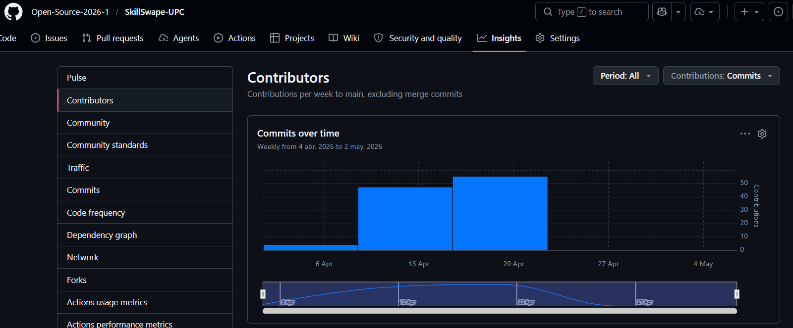
  <figcaption style="margin-top: 10px;">
    <em>Figura 1. Gráfico de contribuciones al repositorio del Project Report durante TB1. Se evidencia la participación de todos los integrantes del equipo mediante commits realizados en el período correspondiente.</em>
  </figcaption>
</figure>

<figure style="text-align: center; margin-bottom: 40px;">
  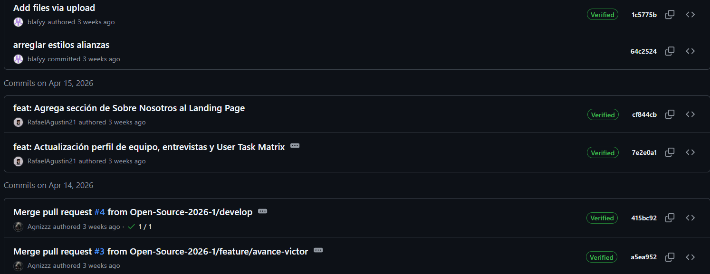
  <figcaption style="margin-top: 10px;">
    <em>Figura 2. Historial de commits en el repositorio del Project Report, evidenciando los aportes individuales de cada miembro con sus respectivos mensajes bajo la convención de Conventional Commits.</em>
  </figcaption>
</figure>

<figure style="text-align: center; margin-bottom: 40px;">
  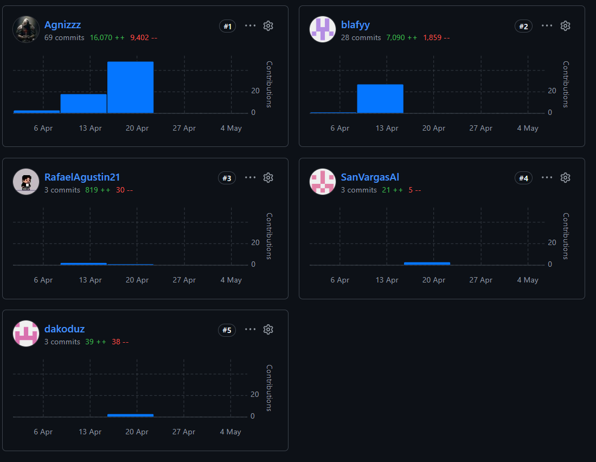
  <figcaption style="margin-top: 10px;">
    <em>Figura 3. Panel de contribuciones individuales al repositorio del Project Report, mostrando el volumen de commits, líneas añadidas y eliminadas por cada integrante durante la elaboración de AV1.</em>
  </figcaption>
</figure>

### TB1

Durante el desarrollo de la entrega TB1, el equipo distribuyó la elaboración del informe asignando capítulos y secciones específicas a cada integrante según sus áreas de responsabilidad. Cada miembro realizó sus aportes directamente en el repositorio de GitHub mediante commits en ramas individuales, siguiendo la convención de Conventional Commits, y luego integrando los cambios mediante Pull Requests hacia la rama `develop` y después pasando todo a la rama `main`. Todos los integrantes participaron activamente en la redacción de secciones del informe, asegurando coherencia y calidad en el contenido entregado.

A continuación, se presentan las capturas de los analíticos de colaboración del repositorio del informe:

<figure style="text-align: center; margin-bottom: 40px;">
  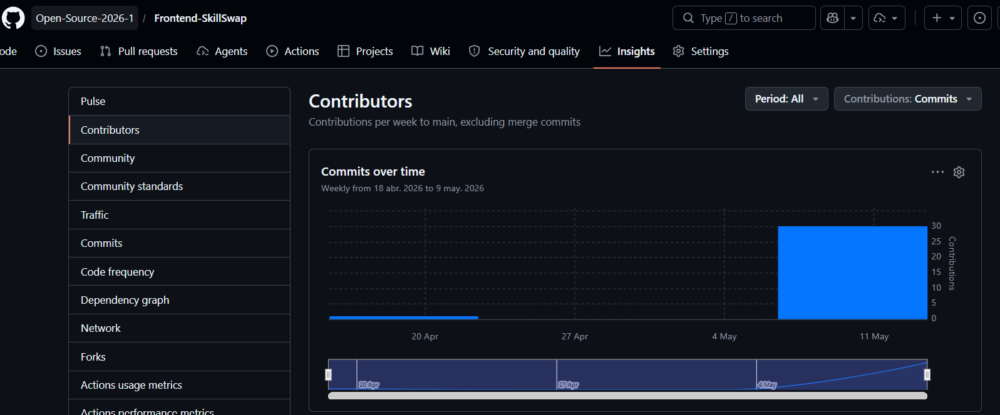
  <figcaption style="margin-top: 10px;">
    <em>Figura 6. Gráfico de contribuciones al repositorio del Project Report durante TB1. Se evidencia la participación de todos los integrantes del equipo mediante commits realizados en el período correspondiente.</em>
  </figcaption>
</figure>

<figure style="text-align: center; margin-bottom: 40px;">
  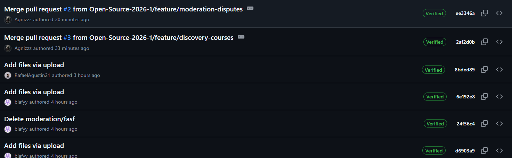
  <figcaption style="margin-top: 10px;">
    <em>Figura 5. Historial de commits en el repositorio del Project Report, evidenciando los aportes individuales de cada miembro con sus respectivos mensajes bajo la convención de Conventional Commits.</em>
  </figcaption>
</figure>

<figure style="text-align: center; margin-bottom: 40px;">
  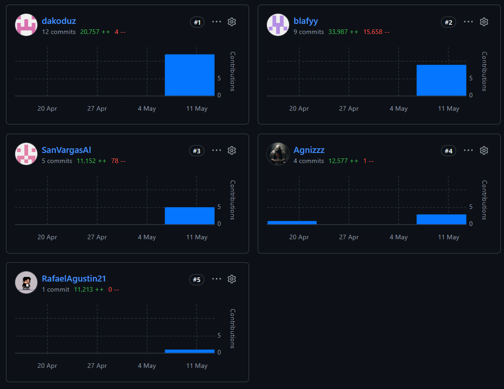
  <figcaption style="margin-top: 10px;">
    <em>Figura 6. Panel de contribuciones individuales al repositorio del Project Report, mostrando el volumen de commits, líneas añadidas y eliminadas por cada integrante durante la elaboración de TB1.</em>
  </figcaption>
</figure>

### AV2

Durante el desarrollo de la entrega AV2, el equipo distribuyó la
elaboración del informe asignando secciones específicas a cada integrante
según sus áreas de responsabilidad en el Sprint 3. Cada miembro realizó
sus aportes directamente en el repositorio de GitHub mediante commits en
ramas individuales, siguiendo la convención de Conventional Commits, y
luego integrando los cambios mediante Pull Requests hacia la rama
`develop` y posteriormente hacia la rama `main`. Todos los integrantes
participaron activamente en la redacción de las secciones correspondientes
al Sprint 3, las entrevistas de validación y las evaluaciones heurísticas,
asegurando coherencia y calidad en el contenido entregado.

A continuación, se presentan las capturas de los analíticos de colaboración
del repositorio del informe durante la entrega AV2:

<figure style="text-align: center; margin-bottom: 40px;">
  
  <figcaption style="margin-top: 10px;">
    <em>Figura. Gráfico de contribuciones al repositorio del Project Report
    durante AV2. Se evidencia la participación de todos los integrantes del
    equipo mediante commits realizados en el período correspondiente.</em>
  </figcaption>
</figure>

<figure style="text-align: center; margin-bottom: 40px;">
  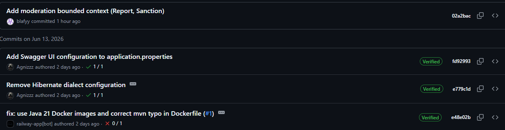
  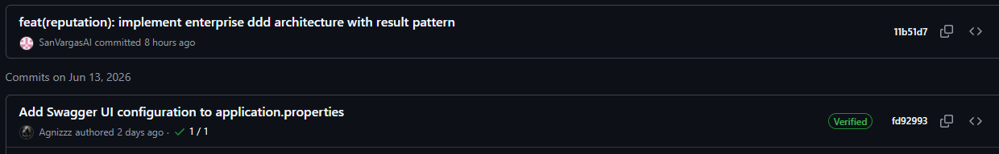
  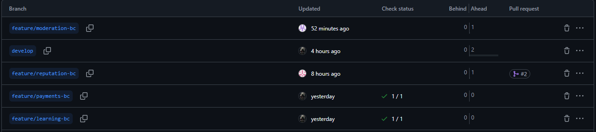
  <figcaption style="margin-top: 10px;">
    <em>Figura. Historial de commits en el repositorio del Project Report
    durante AV2, evidenciando los aportes individuales de cada miembro con
    sus respectivos mensajes bajo la convención de Conventional Commits.</em>
  </figcaption>
</figure>

<figure style="text-align: center; margin-bottom: 40px;">
  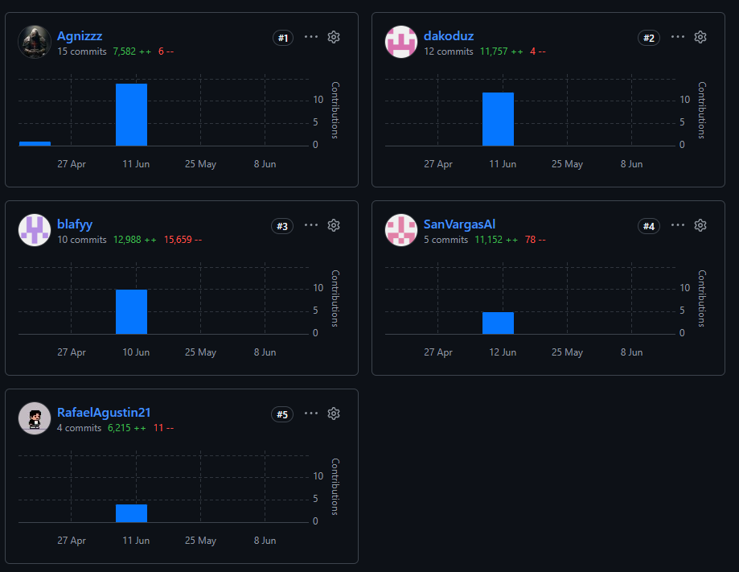
  <figcaption style="margin-top: 10px;">
    <em>Figura. Panel de contribuciones individuales al repositorio del
    Project Report durante AV2, mostrando el volumen de commits, líneas
    añadidas y eliminadas por cada integrante del equipo.</em>
  </figcaption>
</figure>

### TB2

Durante el desarrollo de la entrega final TB2, el equipo distribuyó la elaboración del informe asignando las secciones correspondientes al cierre del Sprint 4 y a la versión final de cada capítulo, según las áreas de responsabilidad asumidas durante la integración del backend con el frontend. Cada miembro realizó sus aportes directamente en el repositorio de GitHub mediante commits en ramas individuales, siguiendo la convención de Conventional Commits, integrando los cambios mediante Pull Requests hacia la rama `develop` y posteriormente hacia `main`. Todos los integrantes participaron activamente en la redacción y revisión final del informe, asegurando coherencia entre las evidencias documentadas y el estado real del producto desplegado.

A continuación, se presentan las capturas de los analíticos de colaboración del repositorio del informe correspondientes a TB2:

<figure style="text-align: center; margin-bottom: 40px;">
  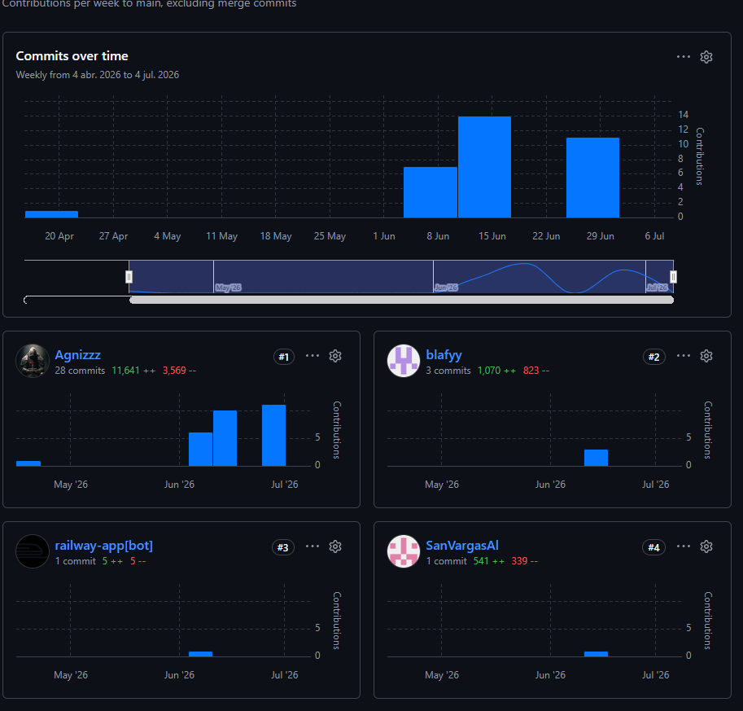
  <figcaption style="margin-top: 10px;">
    <em>Figura. Gráfico de contribuciones al repositorio del Project Report durante TB2. Se evidencia la participación de todos los integrantes del equipo mediante commits realizados en el período correspondiente al cierre del proyecto.</em>
  </figcaption>
</figure>

<figure style="text-align: center; margin-bottom: 40px;">
  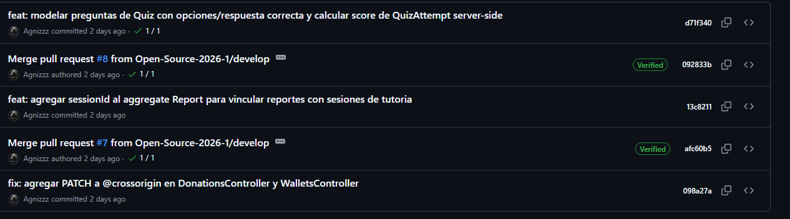
  <figcaption style="margin-top: 10px;">
    <em>Figura. Historial de commits en el repositorio del Project Report durante TB2, evidenciando los aportes individuales de cada miembro con sus respectivos mensajes bajo la convención de Conventional Commits.</em>
  </figcaption>
</figure>

---


# Contenido

- Contenido ........................................ 2  
- Registro de Versiones del Informe ................. 4  
- Student Outcome ................................... 7  

# Capítulo I: Introduccion 
- 1.1 Startup Profile ..................................... 10  
- 1.1.1 Descripción de la Startup ...................... 10  
  - 1.1.2 Perfiles de integrantes del equipo ............. 12  
- 1.2 Solution Profile .................................... 13  
  - 1.2.1 Antecedentes y problemática ..................... 13  
  - 1.2.2 Lean UX Process ................................ 16  
- 1.3 Segmentos objetivo .................................. 1  

# Capítulo II: Requirements Elicitation & Analysis 
- 2.1 Competidores ........................................ 2  
  - 2.1.1 Análisis competitivo ............................ 3  
  - 2.1.2 Estrategias y tácticas frente a competidores .... 7  
- 2.2 Entrevistas ......................................... 10  
  - 2.2.1 Diseño de entrevistas ............................ 10  
  - 2.2.2 Registro de entrevistas ......................... 14  
  - 2.2.3 Análisis de entrevistas ......................... 30  
- 2.3 Needfinding ......................................... 36  
  - 2.3.1 User Personas .................................... 36  
  - 2.3.2 User Task Matrix ................................ 39  
  - 2.3.3 User Journey Mapping ............................ 43  
  - 2.3.4 Empathy Mapping .................................. 46  
- 2.4 Big Picture EventStorming ............................ 51  
- 2.5 Ubiquitous Language .................................. 65  

# Capítulo III: Requirements Specification 
- 3.1 Epics ................................................ 66  
- 3.2 User Stories ......................................... 67  
- 3.3 Impact Mapping ....................................... 87  
- 3.4 Product Backlog ...................................... 90  

# Capítulo IV: Product UX/UI Design 
- 4.1 Style Guidelines ..................................... 98  
  - 4.1.1 General Style Guidelines ......................... 99  
  - 4.1.2 Web Style Guidelines ............................. 101   
- 4.2 Information Architecture ............................. 110  
  - 4.2.1 Organization Systems ............................. 110  
  - 4.2.2 Labeling Systems ................................ 112  
  - 4.2.3 SEO Tags and Meta Tags ......................... 113  
  - 4.2.4 Searching Systems ............................... 115  
  - 4.2.5 Navigation Systems .............................. 116  
- 4.3 Landing Page UI Design ............................... 117  
  - 4.3.1 Landing Page Wireframe .......................... 118  
  - 4.3.2 Landing Page Mock-up ............................ 123  
- 4.4 Web Applications UI Design ........................ 133  
  - 4.4.1 Wireframes ...................................... 133  
  - 4.4.2 Wireflow Diagrams ............................... 140  
  - 4.4.3 Mock-ups ........................................ 159  
  - 4.4.4 User Flow Diagrams .............................. 165  
- 4.5 Web Applications Prototyping ..................... 174  
  - 4.5.1 Android Prototyping ............................. 175  
  - 4.5.2 iOS Prototyping .................................. 175  
- 4.6 Domain-Driven Software Architecture .................. 176  
  - 4.6.1 Design-Level EventStorming ...................... 176  
  - 4.6.2 Context Diagram .................................. 185  
  - 4.6.3 Container Diagrams .............................. 185  
  - 4.6.4 Component Diagrams .............................. 186  
- 4.7 Software Object-Oriented Design ...................... 193  
  - 4.7.1 Class Diagrams ................................... 193  
- 4.8 Database Design ...................................... 198  
  - 4.8.1 Database Diagrams ............................... 199  

# Capítulo V: Product Implementation 
- 5.1 Software Configuration Management ................... 199  
  - 5.1.1 Development Environment Configuration ........... 199  
  - 5.1.2 Source Code Management .......................... 201  
  - 5.1.3 Code Style Guide & Conventions ................. 203  
  - 5.1.4 Deployment Configuration ........................ 205  
- 5.2. Sprint 1 ......................................... 210  
- 5.2 Software Configuration Management ................... 199  
  - 5.2.1 Development Environment Configuration ........... 199  
  - 5.2.2 Source Code Management .......................... 201  
  - 5.2.3 Code Style Guide & Conventions ................. 203  
  - 5.2.4 Deployment Configuration ........................ 205   
- 5.2.2 Sprint 2 ......................................... 210  


- Conclusiones y recomendaciones .......................... 229  
- Bibliografía y Anexos ................................... 231  
- Anexos .................................................. 233  
  - Índice de tablas ...................................... 233  
  - Índice de figuras ..................................... 233  
  - Anexo C ............................................... 235   


---

## Student Outcome

| Criterio específico | Acciones realizadas | Conclusiones |
| :--- | :--- | :--- |
| **Comunica oralmente con efectividad a diferentes rangos de audiencia** | **Victor Alberca:**<br>AV1: Analicé a la competencia y realicé entrevistas para entender los problemas de los estudiantes, lo que me permitió crear User Personas y definir un Product Backlog con historias de usuario claras. Luego validé estos hallazgos con nuevas entrevistas y evaluaciones heurísticas, identificando problemas clave de navegación, consistencia y retroalimentación en los prototipos. Finalmente, prioricé estos problemas y los convertí en requisitos concretos, asegurando soluciones alineadas con las necesidades reales y fáciles de comunicar a distintos públicos.<br><br>TB1: Participé en la Sprint Planning 2 explicando los hallazgos obtenidos en las validaciones previas y comunicando las prioridades del Sprint Backlog 2 al equipo. Durante el Sprint Review presenté los avances relacionados con la navegación y experiencia de usuario, explicando de manera clara los problemas detectados y las mejoras implementadas. Además, colaboré en las reuniones grupales compartiendo retroalimentación sobre la documentación de servicios y el despliegue del software para asegurar una comprensión común entre todos los integrantes.<br><br>AV2: Lideré la Sprint Planning 3 comunicando al equipo el objetivo del sprint orientado al desarrollo del backend con Spring Boot y la integración con el frontend. Presenté los avances de los bounded contexts Discovery y Workspace durante las reuniones de seguimiento, explicando las decisiones técnicas tomadas y los endpoints implementados. Asimismo, participé en las sesiones de validación con usuarios del segmento Estudiante Aprendiz, conduciendo la entrevista y facilitando la interacción del entrevistado con el frontend desplegado.<br><br>TB2: Lideré la Sprint Planning 4 comunicando al equipo el objetivo de cierre del sprint, centrado en reemplazar los mocks de identidad por el IAM real y consolidar el despliegue final de los tres productos. Presenté ante el equipo el estado de la integración por bounded context y coordiné la revisión cruzada de los guards de rol implementados. Asimismo, expliqué en la sustentación final las decisiones técnicas tomadas para el despliegue en Railway y Firebase, adaptando el nivel de detalle según la audiencia (equipo técnico vs. docente evaluador).<br><br>**David Komatsu:**<br>AV1: Realicé entrevistas para obtener información de la problemática, identifiqué los puntos clave y analicé los datos con respecto a nuestro segmento objetivo.<br><br>TB1: Participé en la planificación del Sprint 2, coordinando tareas y priorizando actividades junto al equipo. Asimismo, comuniqué avances del análisis de requerimientos, colaboré en la validación de mejoras del sistema y brindé retroalimentación continua para asegurar el entendimiento de los objetivos y propuestas del equipo.<br><br>AV2: Participé en la Sprint Planning 3 comunicando las tareas correspondientes al bounded context Learning & Assessment y los criterios de aceptación de los endpoints a implementar. Durante las reuniones de seguimiento expuse el avance de la implementación del módulo de quizzes en Spring Boot, explicando las decisiones de modelado de datos tomadas. También colaboré en las sesiones de entrevistas de validación, apoyando en la conducción de las preguntas dirigidas al segmento Estudiante Tutor.<br><br>TB2: Participé en la Sprint Planning 4 explicando al equipo el diseño del bounded context Favorites y sus criterios de aceptación. Durante las reuniones de seguimiento presenté el avance de la integración del store de Favorites con el frontend, exponiendo las decisiones tomadas para conectar el toggle de favorito con el endpoint real. Además, comuniqué al equipo los resultados de las pruebas de la funcionalidad antes del despliegue final.<br><br>**Luis Becerra:**<br>AV1: Participé en la realización de entrevistas a dos segmentos de usuarios, donde comuniqué de manera clara y ordenada las preguntas planteadas para obtener información relevante sobre sus necesidades y problemas. Además, durante las discusiones grupales del Event Storming, expuse ideas y escuché aportes del equipo, facilitando la comprensión del flujo del sistema y asegurando que todos los integrantes compartan una visión común del problema.<br><br>TB1: Participé activamente en las reuniones de Sprint Planning 2, comunicando el progreso de las funcionalidades frontend y explicando las tareas pendientes al equipo. Asimismo, presenté los avances de la interfaz desarrollada, colaboré en la coordinación de la integración entre frontend y backend y facilité una comunicación clara entre los miembros del equipo.<br><br>AV2: Participé en la Sprint Planning 3 exponiendo las tareas del bounded context Moderation & Disputes y comunicando al equipo los criterios de resolución de reportes a implementar en el backend. Durante las reuniones de revisión presenté los endpoints de reportes desarrollados en Spring Boot y expliqué su funcionamiento ante el equipo. Además, conduje las entrevistas de validación con representantes del segmento Coordinador Institucional, adaptando el lenguaje y las preguntas al perfil del entrevistado.<br><br>TB2: Participé en la Sprint Planning 4 comunicando las tareas relacionadas con la corrección de los diez hallazgos de la evaluación heurística del AV2 y la eliminación del botón temporal de moderador. Durante las reuniones de revisión expuse ante el equipo cada uno de los problemas de usabilidad resueltos, explicando el criterio de severidad aplicado para priorizarlos. Asimismo, participé activamente en la sustentación final explicando las mejoras de experiencia de usuario implementadas en el frontend desplegado.<br><br>**Rafael Pacheco:**<br>AV1: Realicé y registré las entrevistas de validación con los segmentos objetivo para identificar las necesidades críticas y problemas de los usuarios.<br><br>TB1: Participé en las reuniones de coordinación del Sprint 2, exponiendo avances relacionados con la documentación de servicios y el despliegue del sistema. Asimismo, comuniqué los resultados de las pruebas funcionales, compartí observaciones para mejorar el desempeño de la aplicación y brindé retroalimentación sobre la organización de tareas y validación de funcionalidades implementadas.<br><br>AV2: Participé en la Sprint Planning 3 comunicando las tareas del bounded context Payments & Wallet y explicando al equipo la lógica del cálculo de comisión del 5% a implementar en el backend. Presenté los avances de los endpoints de donaciones y billetera virtual durante las reuniones de seguimiento. Asimismo, colaboré en las entrevistas de validación apoyando en la conducción de los flujos de donación evaluados con los entrevistados del segmento Estudiante Aprendiz.<br><br>TB2: Participé en la Sprint Planning 4 comunicando al equipo la lógica de seguridad aplicada al cálculo de comisión en Payments, explicando por qué el valor ya no debía depender del cliente. Durante las reuniones de seguimiento expuse los avances de la corrección del filtro de rating en Discovery, detallando la diferencia entre el campo estático anterior y el promedio calculado de Reputation. También colaboré exponiendo los resultados de las pruebas de seguridad realizadas sobre el endpoint de donaciones.<br><br>**Santiago Vargas:**<br>AV1: Realicé una entrevista para el segmento 3 referente a coordinadores institucionales, comunicando efectivamente mis ideas e intenciones. Compartí retroalimentación con mis compañeros de grupo respecto a la implementación del dispositivo IoT en el sistema.<br><br>TB1: Participé en la Sprint Planning 2, explicando las tareas relacionadas con la base de datos y autenticación del sistema para asegurar la comprensión de los objetivos técnicos. Asimismo, presenté los avances de la implementación del login y nuevas funcionalidades, y brindé retroalimentación técnica sobre la arquitectura y despliegue del software para mejorar la coordinación del equipo.<br><br>AV2: Participé en la Sprint Planning 3 comunicando las tareas del bounded context Reputation System y los criterios de aceptación del endpoint de reseñas a implementar. Durante las reuniones de seguimiento expuse los avances del módulo de reputación en Spring Boot. Asimismo, colaboré en las sesiones de validación conduciendo preguntas dirigidas al segmento Estudiante Tutor sobre los flujos de reputación y billetera evaluados en el frontend desplegado.<br><br>TB2: Participé en la Sprint Planning 4 comunicando las tareas de integración de Cloudinary para la compartición de archivos en el chat (US11), explicando al equipo el flujo del preset unsigned y sus implicancias de seguridad. Durante las reuniones de revisión presenté la demostración del envío y visualización de archivos dentro del historial de chat, y participé en la sustentación final explicando esta funcionalidad ante el docente evaluador. | En AV1, el equipo demostró una comunicación oral efectiva al interactuar con distintos tipos de audiencia mediante entrevistas y dinámicas grupales. Se recopilaron y analizaron datos de usuarios para identificar problemas y necesidades clave, lo que permitió definir perfiles, validar hallazgos y priorizar soluciones. Además, se compartieron ideas, se brindó retroalimentación y se facilitó la comprensión común del sistema, asegurando que los resultados fueran claros, útiles y alineados con el público objetivo.<br><br>En TB1, el equipo demostró una comunicación oral efectiva durante las reuniones de planificación, revisión y coordinación del Sprint 2. Cada integrante expuso avances, explicó problemas encontrados y compartió retroalimentación sobre funcionalidades, arquitectura y despliegue del sistema. Esto permitió mantener una comprensión común de los objetivos, mejorar la coordinación entre áreas y asegurar que las soluciones implementadas fueran entendidas claramente por todos los participantes.<br><br>En AV2, el equipo demostró comunicación oral efectiva durante la Sprint Planning 3, las reuniones de seguimiento del backend y las sesiones de entrevistas de validación. Cada integrante expuso los avances de su bounded context asignado, explicó decisiones técnicas tomadas durante la implementación con Spring Boot y condujo o apoyó entrevistas con usuarios reales de los tres segmentos objetivo. Esto permitió alinear al equipo en torno al objetivo del sprint, validar la experiencia de usuario del frontend desplegado y comunicar los resultados a distintas audiencias de forma clara y adaptada a su perfil.<br><br>En TB2, el equipo demostró una comunicación oral efectiva durante la Sprint Planning 4, las reuniones de seguimiento y la sustentación final del proyecto. Cada integrante presentó los avances y decisiones técnicas de su bounded context, abordando aspectos como la integración del IAM real, la implementación de funcionalidades de Favorites, la corrección de hallazgos de usabilidad, el fortalecimiento de la seguridad en Payments y la incorporación de Cloudinary para la compartición de archivos en el chat. Asimismo, se comunicaron los resultados de pruebas y validaciones realizadas antes del despliegue final, adaptando el nivel de detalle y el enfoque de las explicaciones según la audiencia, lo que permitió alinear al equipo, consolidar la integración de los productos y exponer de manera clara los logros alcanzados ante el docente evaluador.
 |
| **Comunica por escrito con efectividad a diferentes rangos de audiencia** | **Victor Alberca:**<br>AV1: Analicé entrevistas para identificar patrones y definir tareas clave con la User Task Matrix, vinculándolas a los requerimientos del software y manteniendo actualizadas herramientas como el Product Backlog. Validé los hallazgos con nuevas entrevistas y evaluaciones heurísticas, detectando problemas de navegación, consistencia y retroalimentación. Finalmente, convertí estos resultados en métricas, criterios de aceptación y tareas claras del Sprint Backlog, asegurando soluciones comprensibles y alineadas para distintos públicos.<br><br>TB1: Participé en la documentación de los acuerdos definidos en la Sprint Planning 2 y actualicé el Sprint Backlog 2 con tareas claras y organizadas para el equipo. Asimismo, colaboré en la redacción de evidencias relacionadas con las mejoras de experiencia de usuario y en la documentación de servicios y despliegue del software.<br><br>AV2: Redacté el Sprint Planning 3 documentando el objetivo del sprint, la velocidad del equipo y los acuerdos de la reunión de planificación. Elaboré las tablas de Development Evidence y Services Documentation Evidence para los bounded contexts Discovery y Workspace, describiendo los commits realizados y los endpoints implementados con sus respectivos verbos HTTP, sintaxis y ejemplos de respuesta. Asimismo, contribuí en la redacción de la sección de evaluaciones heurísticas documentando problemas de usabilidad identificados durante las sesiones de validación.<br><br>TB2: Redacté el Sprint Planning 4 documentando el Sprint Goal, la velocidad del equipo y el resumen de la retrospectiva del Sprint 3. Elaboré las tablas de Development Evidence y Software Deployment Evidence describiendo los commits y pasos de despliegue final del backend y frontend. Asimismo, actualicé el Registro de Versiones del Informe y el Project Report Collaboration Insights correspondientes a esta entrega final.<br><br>**David Komatsu:**<br>AV1: Con la información obtenida en las entrevistas diseñé el Empathy Map, conectando la información con los requerimientos necesarios y apoyando en el Task Matrix.<br><br>TB1: Participé en la elaboración de documentación relacionada con los requerimientos y avances del Sprint 2, organizando la información de manera clara para facilitar el seguimiento del proyecto. Asimismo, apoyé en la actualización de evidencias del Sprint Review y en la descripción de tareas técnicas realizadas durante el desarrollo.<br><br>AV2: Documenté los endpoints del bounded context Learning & Assessment en la tabla de Services Documentation Evidence, especificando los recursos /api/v1/quizzes y /api/v1/quiz-attempts con sus parámetros y ejemplos de respuesta. Redacté las entradas correspondientes en el Sprint Backlog 3 con las tareas de implementación del módulo de quizzes. Asimismo, colaboré en la redacción de los resúmenes de las entrevistas de validación del segmento Estudiante Tutor.<br><br>TB2: Documenté los endpoints del nuevo bounded context Favorites en la tabla de Services Documentation Evidence, especificando los recursos /api/v1/favorites con sus parámetros y ejemplos de respuesta. Redacté las tareas correspondientes en el Sprint Backlog 4 relacionadas con la implementación del store y la vista de "Mis Favoritos".<br><br>**Luis Becerra:**<br>AV1: Participé activamente en planificación, entrevistas y desarrollo frontend.<br><br>TB1: Participé en la actualización del Sprint Backlog 2, registrando tareas frontend y avances relacionados con la interfaz del sistema. Asimismo, documenté el desarrollo e integración de componentes visuales y colaboré en la redacción de evidencias de ejecución para el Sprint Review.<br><br>AV2: Documenté los endpoints del bounded context Moderation & Disputes en la tabla de Services Documentation Evidence, describiendo el recurso /api/v1/reports con sus escenarios de request y response. Redacté las tareas correspondientes en el Sprint Backlog 3 y elaboré los resúmenes de las entrevistas de validación del segmento Coordinador Institucional. Asimismo, contribuí en la redacción de la evaluación heurística documentando los problemas identificados en el panel de moderación durante las sesiones de validación.<br><br>TB2: Documenté en la sección de Execution Evidence cada uno de los hallazgos de usabilidad corregidos durante el Sprint 4, describiendo el problema original, la severidad y la solución implementada. Redacté las tareas correspondientes en el Sprint Backlog 4 relacionadas con las confirmaciones visuales, los badges con etiqueta textual y la eliminación del acceso temporal de moderador.<br><br>**Rafael Pacheco:**<br>AV1: Analicé los datos de las entrevistas para estructurar la User Task Matrix y diseñé la sección "Sobre Nosotros" del Landing Page para comunicar la visión del equipo.<br><br>TB1: Participé en la elaboración de documentación técnica relacionada con la base de datos y autenticación del sistema, describiendo claramente las funcionalidades implementadas. Asimismo, colaboré en la actualización del Sprint Backlog 2 y en la redacción de evidencias de desarrollo y despliegue del software.<br><br>AV2: Documenté los endpoints del bounded context Payments & Wallet en la tabla de Services Documentation Evidence, especificando los recursos /api/v1/donations y /api/v1/wallets con la lógica de comisión del 5% reflejada en los ejemplos de respuesta. Redacté las tareas del Sprint Backlog 3 correspondientes a su bounded context y colaboré en la redacción de los resúmenes de las entrevistas de validación del segmento Estudiante Aprendiz relacionadas con el flujo de donación.<br><br>**Santiago Vargas:**<br>AV1: Elaboré nuevas historias de usuario que reflejaran mejor nuestro objetivo final. Escribí la descripción de mi entrevista y su User Task Matrix. Adapté el diseño de la base de datos a nuevas necesidades. Desarrollé el código para la sección de login del landing page (HTML y CSS).<br><br>TB1: Participé en la redacción de documentación relacionada con las pruebas funcionales, el despliegue del sistema y la evidencia de servicios implementados durante el Sprint 2. Asimismo, apoyé en la organización de información técnica y en la validación escrita de funcionalidades desarrolladas por el equipo.<br><br>AV2: Documenté los endpoints del bounded context Reputation System en la tabla de Services Documentation Evidence, describiendo el recurso /api/v1/reviews con sus parámetros y ejemplos de respuesta. Redacté las tareas correspondientes en el Sprint Backlog 3 y colaboré en la elaboración de la evaluación heurística documentando los problemas de visibilidad de reseñas y reputación identificados durante las sesiones de validación con el segmento Estudiante Tutor.<br><br>TB2: Documenté la integración de Cloudinary en la tabla de Development Evidence, describiendo los commits relacionados con el widget de carga y el renderizado de archivos en el chat. Redacté las tareas correspondientes en el Sprint Backlog 4 y colaboré en la redacción de la nota final sobre el cierre del backend en la sección de Services Documentation Evidence. | En AV1, el equipo organizó la información para construir herramientas como User Personas y Empathy Map. Posteriormente, transformó los hallazgos en requisitos técnicos y flujos de navegación claros.<br><br>En TB1, el equipo organizó y documentó la información generada durante el Sprint 2 mediante backlog, evidencias técnicas y documentación de servicios. Los integrantes redactaron avances relacionados con desarrollo, pruebas, despliegue y arquitectura del sistema, asegurando claridad y coherencia en la información presentada. Esto permitió mantener un seguimiento estructurado del proyecto y facilitar la comprensión de los resultados tanto para el equipo como para otros públicos involucrados.<br><br>En AV2, el equipo demostró comunicación escrita efectiva al documentar el Sprint 3 en sus distintas dimensiones: planificación, backlog, evidencias de desarrollo, documentación de servicios y evaluaciones de validación. Cada integrante redactó con precisión técnica los artefactos correspondientes a su bounded context, usando un lenguaje claro y adaptado tanto para audiencias técnicas como no técnicas. La evaluación heurística y los registros de entrevistas de validación evidencian la capacidad del equipo para comunicar por escrito hallazgos de UX de forma estructurada y comprensible. <br><br>En TB2, el equipo evidenció una adecuada comunicación escrita mediante la elaboración y actualización de la documentación técnica y de gestión del proyecto. Los integrantes redactaron el Sprint Planning 4, el Sprint Backlog, las evidencias de desarrollo y despliegue, y la documentación de servicios correspondiente a los distintos bounded contexts implementados. Asimismo, se registraron las mejoras de usabilidad realizadas, las actualizaciones de seguridad en Payments y Discovery, la integración de nuevas funcionalidades como Favorites y Cloudinary, y los resultados finales del proceso de desarrollo. Esta documentación permitió mantener la trazabilidad de los avances, facilitar la comprensión de las decisiones técnicas adoptadas y consolidar el cierre ordenado y consistente de la entrega final del proyecto.|

---

# Capítulo I: Introducción

## 1.1. Startup Profile

### 1.1.1. Descripción de la Startup

**Innovify** es una startup cuyo propósito es reducir la deserción académica conectando a estudiantes universitarios para que compartan conocimientos a través de sesiones de tutoría. Esta iniciativa resuelve de manera ágil las dudas específicas de los alumnos mediante dos modalidades integradas: un aprendizaje sincrónico, llevado a cabo en tiempo real a través de videollamadas incrustadas en la misma plataforma (mediante el consumo de APIs de video externas), y un aprendizaje asincrónico, que facilita el intercambio de materiales y recursos de estudio directamente en el entorno de la reserva.

A diferencia de los modelos tradicionales, nuestra plataforma se sostiene bajo un modelo de negocio mixto (B2C y B2B). Por el lado del estudiante (B2C), operamos bajo un sistema colaborativo de donaciones voluntarias; al finalizar una tutoría, el aprendiz puede realizar un aporte económico al tutor como agradecimiento, procesado mediante una pasarela de pagos segura, de la cual Skillswap  retiene una comisión del 5% para garantizar su sostenibilidad. Por el lado institucional, Skillswap ofrece alianzas estratégicas a las universidades, brindándoles acceso a un Dashboard Analítico que les permite visualizar estadísticas en tiempo real sobre los cursos con mayor demanda de tutorías, ayudándolas a prevenir la deserción estudiantil.

Todo este ecosistema se mantiene seguro y escalable gracias a un proceso de validación automatizada que exige el uso de correos institucionales (`.edu.pe` o `upc.edu.pe`, `pupc.edu.pe`) para garantizar que los usuarios sean estudiantes reales. Asimismo, la calidad académica está respaldada por la participación de los Profesores Universitarios, quienes actúan como garantes de excelencia al crear el banco oficial de quizzes y retos que los tutores utilizan para evaluar a sus aprendices, fomentando un entorno confiable, profesional y altamente colaborativo.

Asimismo, pensando en la escalabilidad y el aseguramiento de la calidad a futuro, Skillswap contempla la integración de tecnología IoT en su ecosistema. El roadmap tecnológico incluye el desarrollo de un **'Sensor de Calidad de Entorno'**: un dispositivo miniatura basado en un microcontrolador (ej. ESP32) equipado con sensores de luz y ruido, diseñado para ubicarse en el área de estudio del tutor. Durante el aprendizaje sincrónico, este hardware enviará métricas ambientales en tiempo real al backend. Si el entorno presenta contaminación auditiva o iluminación deficiente, la plataforma alertará al tutor para que mejore sus condiciones. Por el contrario, parámetros óptimos otorgarán automáticamente un 'Badge de Excelencia Técnica' a la sesión. Esta proyección IoT asegura que el servicio por el cual el aprendiz realiza su donación económica mantenga siempre un estándar de alta calidad profesional.

### Visión
Ser la plataforma líder en educación colaborativa universitaria a nivel nacional, reconocida por ser el principal aliado estratégico de las instituciones en la prevención de la deserción académica, potenciando el aprendizaje mediante tecnología escalable, entornos validados por IoT y un ecosistema económicamente sostenible.

### Misión
Facilitar el aprendizaje sincrónico y asincrónico entre estudiantes universitarios proporcionando herramientas digitales integradas, seguras y automatizadas. Promovemos la excelencia académica, la mejora de habilidades blandas y la recompensa justa al esfuerzo del tutor mediante donaciones voluntarias, operando bajo un entorno validado institucionalmente que brinda data de valor a las universidades para optimizar sus planes de estudio.
### 1.1.2. Perfiles de integrantes del equipo

| Foto | Integrante | Carrera | Descripción |
| :---: | :--- | :--- | :--- |
|  | **Alberca Saavedra, Victor Manuel**<br>(U201924127) | Ingeniería de Software | Puedo aportar mis conocimientos básicos de investigación para los temas y tengo experiencia en el lenguaje C++. También puedo aportar al grupo con el aspecto comunicativo y organizativo para realizar un mejor trabajo. |
|  | **Becerra Ninahuanca, Luis Angel**<br>(U20231C792) | Ingeniería de Software | Me gustaría aportar a este proyecto con mis conocimientos en programación en los lenguajes C++, Python, HTML y CSS. Asimismo, puedo contribuir al equipo con habilidades en trabajo colaborativo, organización y resolución de problemas. |
|  | **Komatsu Dueñas, David**<br>(U201724692) | Ingeniería de Software | Me gustaría aportar a este proyecto con mis conocimientos en investigación y sus metodologías, así como mi experiencia universitaria en C++ y JavaScript. También aportaré con habilidades de comunicación asertiva y trabajo en equipo. |
|  | **Pacheco Lavado, Rafael Agustin**<br>(U202014215) | Ingeniería de Sistemas de Información | Estudiante con enfoque en análisis de datos y desarrollo básico en Python y C++. Me caracterizo por aprendizaje rápido, criterio para filtrar información relevante y trabajo colaborativo. Aporto investigación aplicada y prototipos técnicos alineados al producto. |
|  | **Vargas Alarcon, Santiago Enrique**<br>(U202416706) | Ingeniería de Software | Puedo aportar mis conocimientos en C++, conocimientos básicos en C# y mi rápida capacidad de aprendizaje. Además, cuento con buena adaptabilidad y habilidades de comunicación oral para contribuir al equipo. |

*(Tabla 1. Perfiles integrantes de equipo - Elaboración propia. Nota: En esta tabla se aprecian los perfiles de los integrantes del equipo.)*

---


## 1.2. Solution Profile

### 1.2.1. Antecedentes y problemática

En el Perú, el fracaso académico, manifestado mediante un bajo rendimiento académico, la reprobación de cursos y la deserción, es un problema que afecta a varios estudiantes de diversas universidades, tanto públicas como privadas. De acuerdo con el Minedu (2021), la tasa de interrupción de estudios en universidades licenciadas llegó a 11,5% en el ciclo 2021-1, siendo Lima una de las regiones con tasas de deserción más altas, con un 12,4%.

Diversos estudios asocian un ambiente de aprendizaje inadecuado y una enseñanza poco satisfactoria como parte de las causas de este problema, así como factores mentales y emocionales como la falta de apoyo social, bajos niveles de motivación intrínseca y falta de autoestima (Escalante et al., 2023).

Si bien estas causas son multifactoriales, nuestra investigación identifica un problema subyacente y desatendido: **el aislamiento del conocimiento**. Cada universidad, con sus fortalezas y debilidades, funciona como una isla académica. El talento y la pericia de sus estudiantes permanecen encapsulados dentro de sus propios campus, desaprovechando una vasta red de conocimiento distribuido a nivel nacional. Actualmente, no existe un puente formal, seguro y confiable que permita a un estudiante de una universidad A, que necesita ayuda en un tema específico, conectar con un par de la universidad B que domine esa área. Los estudiantes se ven limitados a su círculo inmediato o a grupos informales en redes sociales que carecen de seguridad y verificación.

Esto no solo impacta negativamente en el bienestar social y económico de los mismos estudiantes sino también en la capacidad productiva del país por falta de mano de obra calificada, agravando problemas socioeconómicos como los niveles de vida deficientes, las altas tasas de desempleo y el incremento de comportamientos disruptivos en la sociedad (Escalante et al., 2023).

Para conocer aún más la problemática usaremos la técnica de las **5W y 2H**:

#### What (¿Qué? / ¿Cuál?)
* **¿Cuál es el problema?** El problema es la deserción universitaria ocasionada por diversos factores tales como falta de aprendizaje, estrés académico, bajos niveles económicos, etc. Por consecuencia, muchos estudiantes terminan suspendiendo sus estudios universitarios y, en el peor de los casos, muchos de ellos nunca llegan a terminarlos.

* **¿Qué soluciones existen actualmente?** Actualmente existen plataformas como Udocz, GoToPeer y Knack, sin embargo en el Perú no han alcanzado gran 
popularidad ni impacto en la comunidad universitaria. Los estudiantes recurren principalmente a grupos informales en WhatsApp o redes sociales, que carecen 
de verificación de identidad, moderación y herramientas integradas de comunicación, lo que genera interacciones de baja calidad y expone a los usuarios a riesgos. 

* **¿Cuál es la relación con el usuario?** El usuario es el estudiante universitario peruano que enfrenta barreras académicas en su institución y 
no encuentra un espacio confiable y verificado para resolver sus dudas con pares de otras universidades.

#### Why (¿Por qué?)
* **¿Cuál es la causa principal del problema?** Consideramos que, si bien en la primera pregunta del segmento "What" se mencionaron diversas causas, todas confluyen en un mismo problema principal: no todos los estudiantes logran comprender completamente los temas en clase. Con frecuencia, el tiempo resulta insuficiente y varios de ellos quedan con dudas sin resolver debido a distintos factores. Por esta razón, muchos recurren a estrategias de aprendizaje que no siempre se adaptan a ellos.

#### Who (¿Quién?)
* **¿Quiénes están involucrados?** Está involucrada toda la comunidad universitaria, incluidos estudiantes y profesores, así como los rectores.
* **¿A quiénes les sucede el problema?** Estudiantes universitarios hispanohablantes que necesiten ayuda para resolver dudas inconclusas de sus clases, así como tutores que deseen ayudar a otros alumnos a concluir sus estudios de manera satisfactoria.

#### When (¿Cuándo?)
* **¿Cuándo sucede el problema?** Constantemente, en el Perú las cifras de deserción universitaria son inmensas y más en estos últimos años en que los trabajos y las empresas en general se mueven más por contactos y experiencia, dejando en un segundo plano e infravalorando a los estudios universitarios.
* **¿Cuándo el cliente usa el producto?** Cuando uno de los muchos estudiantes universitarios tiene dudas que no fueron resueltas en clase y no disponen de mucho tiempo para leerse libros inmensos con toda la teoría o necesitan ejemplos que se adaptan más a su velocidad de aprendizaje.

#### Where (¿Dónde?)
* **¿Dónde está el usuario cuando usa la plataforma?** En su lugar favorito dedicado al estudio, no es un lugar en específico y en su mayoría depende mucho de las preferencias y disponibilidad del estudiante. Comúnmente son espacios universitarios dedicados al estudio, salas de estudio dentro de las casas o habitaciones en silencio para la concentración del estudiante o tutor.
* **¿Dónde surge el problema?** En las universidades y sus sistemas que muchas veces no terminan de complementarse bien con el estudiante.

#### How (¿Cómo?)
* **¿En qué condiciones los clientes usan nuestro producto?** Los estudiantes enfrentan el problema principalmente en períodos de alta exigencia académica 
como semanas de parciales y finales, cuando las dudas sin resolver se acumulan y el tiempo para buscar ayuda es limitado.

* **¿Cómo se enteran de la aplicación?** A través de redes sociales, pruebas piloto dentro de nuestra universidad y la recomendación de su uso por parte de contactos o profesores.

#### How much (¿Cuánto?)
* **¿Cuánto le cuesta este problema a la economía, sociedad o institución del Perú actualmente?** Actualmente la educación universitaria está siendo respaldada en gran parte por el gobierno, ya que se conoce que se realizó un incremento de presupuesto del 24% respecto al año 2023, lo que significan unos S/8 416 millones en total (Gobierno del Perú, 2024).
* **¿Cuánto costaría implementar la solución propuesta?**
  * Desarrollo web MVP: S/ 19,000 - S/38,000
  * Aplicación móvil (híbrida): S/19,000 - S/30,400
  * Integración de APIs, videollamada y pasarela de pagos: S/ 3,000 - S/6,000
  * Diseño UI/UX: S/ 3,040 - S/7,600
  * Dominio + hosting: S/570 - S/1,900
  * Seguridad y soporte: S/ 2,280 - S/6,080

---

### 1.2.2. Lean UX Process

#### 1.2.2.1. Lean UX Problem Statements
Nuestra plataforma se enfoca en crear una red de aprendizaje colaborativo e intercambio de conocimientos exclusivamente entre estudiantes de distintas universidades peruanas. Buscamos romper los silos académicos tradicionales para que los estudiantes puedan complementar su formación, resolver dudas y desarrollar nuevas competencias con pares que de otra manera no conocerían. 

La problemática que abordamos es el fracaso y la deserción académica en el sistema universitario peruano, un fenómeno agravado por el aislamiento estudiantil y la falta de acceso a perspectivas académicas. Según datos del MINEDU (2021), la tasa de interrupción de estudios alcanzó el 11.5%, siendo Lima una de las regiones más afectadas (12.4%). Este fenómeno se relaciona con bajos niveles de motivación y entornos de aprendizaje poco satisfactorios, donde muchos estudiantes no encuentran el soporte necesario para superar cursos o desarrollar habilidades específicas.

Hemos observado que, si bien cada universidad cuenta con talento y fortalezas específicas, este conocimiento permanece encapsulado dentro de sus propios campus. Un estudiante de la UNI puede tener una habilidad en cálculo que un estudiante de la UPC necesita, y viceversa, este último puede dominar una herramienta de diseño crucial para el primero. El problema central es la inexistencia de un puente formal y seguro que conecte a estos estudiantes, lo que genera una brecha de oportunidad y desaprovecha un valioso capital de conocimiento distribuido en el país. Las soluciones informales actuales, como los grupos en redes sociales, carecen de sistemas de verificación y confianza, exponiendo a los alumnos a riesgos e interacciones de baja calidad.

A raíz de esta problemática, nuestra propuesta busca responder a la siguiente pregunta: **¿Cómo podríamos crear un espacio digital seguro y verificado que conecte a estudiantes de distintas universidades peruanas para que puedan enseñar y aprender entre sí que rompe el aislamiento académico que contribuye al fracaso y la deserción universitaria?**

#### 1.2.2.2. Lean UX Assumptions
Para abordar de manera efectiva la problemática del fracaso académico y la deserción universitaria, es fundamental partir de una serie de supuestos sobre nuestros usuarios y su contexto. El éxito de Skillswap depende de qué tan acertadas sean estas hipótesis centradas en el usuario tecnológico y en nuestro modelo de negocio sostenible.

Nuestro análisis del entorno universitario peruano revela que los estudiantes enfrentan barreras académicas que limitan su progreso. Suponemos que existe un vacío en su experiencia de aprendizaje, y que muchos buscan activamente apoyo personalizado. Creemos que los estudiantes valoran recibir clases de pares de otras universidades, siempre que el entorno cuente con herramientas integradas que faciliten un aprendizaje sincrónico (en vivo) y asincrónico (intercambio de materiales).

Asimismo, identificamos que la falta de incentivos reales frena la colaboración continua. En cuanto a la motivación, creemos que los estudiantes con buen rendimiento académico (Tutores) están dispuestos a invertir su tiempo si pueden reforzar su propio aprendizaje y, a la vez, ser recompensados mediante un sistema de donaciones voluntarias por su esfuerzo.

Nuestra propuesta se distinguirá al ofrecer una plataforma centralizada y verificada. Skillswap integrará funcionalidades clave mediante servicios de terceros (APIs de videollamada y pasarelas de pago) para que los estudiantes no tengan que salir de la aplicación, generando así un ecosistema seguro, estructurado y económicamente sostenible gracias a la retención de una pequeña comisión (5%) por cada donación procesada.


##### Assumptions Worksheet

| Pregunta | Respuesta |
| :--- | :--- |
| **¿Quién es el usuario?** | Nuestros usuarios son estudiantes universitarios peruanos de diversas carreras que se dividen en dos roles principales:<br>1. **El Aprendiz:** Estudiante universitario que se siente estancado en ciertos temas y valora la ayuda en tiempo real (sincrónica) o mediante materiales compartidos (asincrónica).<br>2. **El Tutor:** Estudiante que domina una materia, motivado por ayudar a otros, consolidar sus conocimientos y recibir donaciones económicas voluntarias por su tiempo. |
| **¿Dónde encaja nuestro producto en su trabajo o vida?** | Creemos que los estudiantes buscarán apoyo fuera de su horario de clases regular, prefiriendo organizar videollamadas en horarios flexibles sin tener que depender de aplicaciones externas inseguras. |
| **¿Qué problemas tiene nuestro producto a resolver?** | • **Problema de Herramientas Fragmentadas:** Asumimos que los estudiantes se frustran al tener que usar WhatsApp para coordinar, Drive para materiales y Zoom para la clase. Todo debe estar integrado.<br>• **Problema de Sostenibilidad e Incentivo:** Asumimos que los tutores se desmotivan si no ven un beneficio tangible. El sistema de donaciones resuelve esto, y la comisión del 5% resuelve la sostenibilidad del negocio.<br>• **Problema de Seguridad:** Asumimos que interactuar con estudiantes de otras universidades genera fricción si no hay un Administrador/Verificador validando las cuentas y moderando reportes. |
| **¿Cuándo y cómo es nuestro producto usado?** | El uso se intensificará en picos de estrés académico (semanas de parciales/finales). Los alumnos agendarán sesiones en vivo (sincrónicas) o enviarán documentos para revisión (asincrónico) de manera centralizada. |
| **¿Qué características son importantes?** | • **Videollamada Integrada:** Es fundamental que la clase ocurra dentro de la plataforma usando una API externa.<br>• **Pasarela de Pagos Confiable:** Para procesar las donaciones de forma rápida y segura.<br>• **Seguridad y Moderación:** Un panel donde el Verificador pueda atender reportes y asegurar la calidad. |
| **¿Cómo debe verse nuestro producto y cómo comportarse?** | Creemos que la experiencia debe sentirse segura, confiable y colaborativa. El usuario debe percibir la plataforma como un entorno académico serio, pero a la vez solidario y de apoyo mutuo, no como una red social informal. |

<enum> Tabla 1: Lean assumption de los usuarios</enum> 

##### Definición de Objetivos

**Business outcomes**
* Fomentar la colaboración y reducir el aislamiento académico entre universidades.
* Contribuir a la disminución de la tasa de deserción estudiantil por fracaso académico.
* Posicionar la plataforma como la red de apoyo estudiantil interuniversitaria líder en el Perú.
* Establecer alianzas estratégicas con universidades para facilitar los procesos de validación.
* Lograr un modelo de negocio sostenible captando el 5% de comisión de las donaciones.
* Fomentar el aprendizaje interuniversitario sincrónico y asincrónico.

**User outcomes**
* Mejorar el rendimiento académico y la comprensión de temas complejos.
* Reducir el estrés y la ansiedad asociados a los desafíos académicos.
* Adquirir nuevas habilidades prácticas y teóricas de forma accesible.
* Ampliar su red de contactos con pares de otras disciplinas y universidades.
* Aumentar su confianza al poder enseñar y validar sus propios conocimientos.
* Generar ingresos económicos extra para los tutores a través de su esfuerzo.

**Features**
* Sistema de registro y verificación de identidad gestionado por un Coordinador.
* Creación de perfiles de estudiante con secciones diferenciadas para "Habilidades para Enseñar" y "Habilidades para Aprender".
* Motor de búsqueda con filtros por habilidad y universidad, con bloqueo de emparejamiento para la misma institución.
* Sistema de solicitudes de intercambio con mensajería personalizada.
* Chat integrado para la coordinación segura entre los estudiantes emparejados.
* Sistema de calificación mutua y reseñas visibles en los perfiles de usuario.
* Integración de API de videollamadas (ej. Agora o Zoom SDK) para el aprendizaje sincrónico.
* Chat interno con soporte para subir archivos (aprendizaje asincrónico).
* Integración de API de pasarela de pagos (ej. Stripe o MercadoPago) para procesar las donaciones voluntarias y retener automáticamente el 5% de comisión.

#### 1.2.2.3. Lean UX Hypothesis Statements

**Hipótesis de Negocio**
* Creemos que al implementar un sistema de registro y verificación automática exclusiva con correos institucionales (".edu.pe") para todos los estudiantes, resultará en una superación de la barrera de desconfianza inicial y un ingreso más ágil sin validación manual, lo que facilitará la adopción de la plataforma; sabremos que esto es cierto cuando el 90% de los nuevos usuarios complete su registro en las primeras 24 horas y la tasa de reportes por cuentas falsas o suplantación sea cercana a 0%. 
* Creemos que al diseñar un modelo de donaciones voluntarias mediante una pasarela de pagos con una comisión del 5%, resultará en un modelo de negocio sostenible y en una comunidad donde los tutores se mantengan motivados, evidenciándose cuando al menos el 60% de las sesiones incluyan una donación y los ingresos cubran los costos operativos al finalizar el primer año. 
* Finalmente, creemos que al implementar un sistema de calificaciones y reseñas mutuas tras cada sesión, resultará en una comunidad basada en la reputación y la meritocracia, incentivando la calidad de las tutorías; sabremos que esto es cierto cuando más del 75% de las sesiones reciban calificaciones de ambas partes y los tutores con promedio superior a 4.5 estrellas obtengan un 30% más de solicitudes y donaciones.

**Hipótesis de Usuario**
* Creemos que al ofrecer un motor de búsqueda con filtros por habilidad y universidad para los estudiantes "aprendices", resultará en la capacidad de encontrar apoyo específico que no hallan en su entorno inmediato, facilitando conexiones más precisas dentro de la plataforma; sabremos que esto es cierto cuando el 70% de las búsquedas con filtros conduzcan a una solicitud de ayuda y el 60% de los nuevos aprendices completen una sesión exitosa en sus primeras dos semanas.
* Creemos que al integrar un sistema de aprendizaje sincrónico (videollamadas incrustadas vía API) y asincrónico (chat para intercambio de materiales), resultará en una mayor retención, comodidad y percepción de seguridad al no depender de enlaces externos vulnerables; sabremos que esto es cierto cuando más del 90% de las tutorías programadas se realicen exclusivamente dentro de la sala virtual y la satisfacción técnica de la llamada alcance una calificación promedio de 4.5/5.
* Creemos que al facilitar conexiones de tutoría interuniversitarias, los estudiantes "aprendices" lograrán mejorar su rendimiento académico en cursos de alta dificultad, fortaleciendo su confianza y comprensión; sabremos que esto es cierto cuando el 75% de los aprendices reporte en encuestas posteriores un aumento significativo en su confianza y dominio del tema. 
* Finalmente, creemos que al ofrecer una plataforma estructurada y monetizable para enseñar, los estudiantes "tutores" podrán desarrollar competencias académicas y blandas mientras generan ingresos extra, lo que incentivará su participación continua; sabremos que esto es cierto cuando el 80% de los tutores activos reporte que enseñar les ayudó a consolidar su conocimiento y cuando el 50% de los tutores recurrentes logre generar al menos una donación mensual.
#### 1.2.2.4. Lean UX Canvas

| LEAN UX CANVAS | |
| :--- | :--- |
| **Título:** SkillSwap Lean UX Canvas | **Fecha:** 03/04/2026 |
| **Iteración:** 1 | |
| **1. Problema de negocio**<br>Las plataformas actuales fragmentan el aprendizaje (usan links externos inseguros) y carecen de un modelo de negocio sostenible. Además, no garantizan la identidad de los usuarios, generando desconfianza. | **5. Solución**<br>La plataforma integra una API de videollamadas que permite un entorno sincrónico directamente en la web, junto con un espacio asincrónico mediante un chat interno donde se pueden adjuntar materiales de estudio. Además, incorpora un modelo de donaciones a través de una API de pagos que facilita propinas voluntarias, reteniendo un 5% de comisión, y cuenta con un panel de verificador que funciona como dashboard para aprobar usuarios y moderar la comunidad. |
| **2. Resultados comerciales**<br>Se busca lograr ingresos sostenibles mediante el cobro del 5% de comisión sobre cada donación, asegurar que el 100% de las sesiones sincrónicas se realicen dentro de la plataforma y alcanzar la verificación de la mayoría de los usuarios activos. | **6. Hipótesis**<br>• Creemos que, al integrar una API de videollamadas, aumentará la retención de usuarios al no tener que salir de la página.<br>• Creemos que un modelo de donaciones voluntarias incentivará a los tutores a dar un mejor servicio.<br>• Creemos que cobrar un 5% de comisión a las donaciones hará que el software sea un negocio sostenible.<br>• Creemos que el rol de Verificador mantendrá la tasa de reportes por fraude al mínimo.<br>• Creemos que permitir a un usuario cambiar fácilmente entre los roles de tutor y aprendiz, incrementará la participación y el tiempo en la plataforma.<br>• Creemos que incorporar un sistema de reportes visible y fácil de usar, reducirá los incidentes negativos y aumentará la tasa de retención de usuarios a largo plazo al sentirse más protegidos.<br>• Creemos que diseñar una interfaz sencilla con un guiado para usuarios con poca experiencia digital, disminuirá la tasa de abandono durante el registro en un 30% y mejorará la calificación de satisfacción general. |
| **3. Usuarios y clientes**<br>• Joven peruano que busca mejorar sus notas, aprender nuevas habilidades o ganar experiencia enseñando.<br>• Personal administrativo o académico designado por la universidad. | **7. ¿Qué es lo más importante que necesitamos aprender primero?**<br>• ¿Están dispuestos los alumnos peruanos a donar dinero real por una buena tutoría de un par?<br>• ¿Una comisión del 5% será aceptada por los tutores sin generar rechazo?<br>• ¿Las APIs de videollamada funcionarán fluidamente en las conexiones a internet promedio de los estudiantes? |
| **4. Beneficios del usuario**<br>La plataforma permite un aprendizaje integral en un solo lugar sin depender de aplicaciones de terceros, facilita la generación de ingresos extra para los tutores en función de la calidad de su enseñanza y garantiza un entorno completamente verificado y moderado. | **8. ¿Cuál es la menor cantidad de trabajo que necesitamos hacer para aprender la siguiente cosa más importante?**<br>• Realizar entrevistas para validar la disposición a donar.<br>• Desarrollar un MVP web que conecte las APIs de videollamada y pasarela de pago para probar la funcionalidad técnica y la fluidez del aprendizaje sincrónico. |

*(Tabla 2. Lean Ux Canvas - Elaboración propia. Nota: Este Lean UX Canvas resume la propuesta de diseño centrado en el usuario para la plataforma SkillSwap, que busca conectar estudiantes de distintas universidades peruanas mediante tutorías seguras y validadas institucionalmente).*

---

## 1.3. Segmentos objetivo

### Segmento objetivo #1: Estudiantes que quieran aprender
Son estudiantes universitarios, generalmente entre 18 y 25 años, de pregrado, residentes en zonas urbanas con acceso a internet y dispositivos digitales, pertenecientes a universidades privadas o públicas. Enfrentan dificultades académicas en materias específicas y suelen sentirse estancados con los métodos de enseñanza de su propia institución o no encuentran ayuda personalizada dentro de su círculo cercano.

Están dispuestos a compensar económicamente el esfuerzo de sus pares mediante donaciones voluntarias a cambio de una tutoría de calidad, ya sea en formato sincrónico (videollamadas) o asincrónico (materiales). Según un estudio académico (García Ortiz, López de Castro Machado y Rivero Frutos, 2020), el 40 % de los estudiantes considera insuficiente el tiempo que dedica al estudio, casi un tercio mantiene asignaturas pendientes y el 37 % ha pensado en abandonar el grado. Entre las soluciones más mencionadas por los propios alumnos se encuentran las tutorías personalizadas y la organización de grupos de estudio, lo que confirma la necesidad de un acompañamiento académico más cercano.

### Segmento objetivo #2: Estudiantes que quieran enseñar
Son estudiantes universitarios con un dominio notable en ciertas áreas académicas, generalmente entre 19 y 27 años, en ciclos intermedios o avanzados de la carrera, proactivos y motivados por la experiencia docente. Buscan reforzar su propio aprendizaje y generar ingresos económicos extra mediante las donaciones que reciben en la plataforma, al mismo tiempo que desarrollan habilidades blandas como liderazgo, comunicación efectiva y creatividad, que son altamente valoradas en el mercado laboral. 

Según un estudio de Gutiérrez Pallares, Bernal Pérez y Gutiérrez Pallares (2024), en Latinoamérica los egresados universitarios presentan debilidades en la comunicación, el manejo emocional y la creatividad, pese a que estas competencias son consideradas esenciales por los empleadores. Por ello, las universidades están llamadas a promover proyectos colaborativos, tutorías y prácticas que fortalezcan dichas competencias.

### Segmento objetivo #3: Coordinador Institucional
Es personal académico, administrativo o de soporte técnico, generalmente entre 30 y 55 años, con formación en educación, psicología o gestión de plataformas digitales. Su principal objetivo ya no es la validación manual de cuentas (puesto que esto se realiza automáticamente mediante el correo: `.edu.pe`), sino velar por la integridad, seguridad y moderación del ecosistema. 

Se encargan de atender reportes de mala conducta, monitorear el correcto flujo de las donaciones y garantizar que la plataforma sea un entorno confiable. Según un análisis sobre legitimidad organizacional (Suchman, 1995; Ruef & Scott, 1998), la reputación de una institución depende de la percepción de sus acciones como correctas, deseables y alineadas a normas aceptadas socialmente. En este sentido, los coordinadores institucionales juegan un papel clave en asegurar que las universidades mantengan legitimidad y confianza frente a estudiantes y otros grupos de interés.
# Capítulo II: Requirements Elicitation & Analysis

## 2.1. Competidores

**uDocz (Competidor Directo)**
uDocz es una plataforma de origen peruano que se ha expandido por toda Latinoamérica, posicionándose como una de las comunidades de estudio más grandes para universitarios de habla hispana. Su modelo se centra en que los estudiantes compartan y encuentren material de estudio, como apuntes de clase, resúmenes, guías y solucionarios, específicos para su universidad y carrera. Aunque su fuerte es el intercambio de documentos, también ha incorporado funciones para hacer preguntas y recibir respuestas de la comunidad.

**Knack (Competidor Directo)**
Knack es una red de tutoría universitaria norteamericana que conecta a estudiantes con tutores pares que han sobresalido en cursos específicos. La plataforma se asocia directamente con las universidades, las cuales a menudo subsidian el costo, haciendo que las tutorías sean gratuitas para los estudiantes. Su modelo se enfoca en que los alumnos reciban ayuda de compañeros que ya han aprobado (generalmente con excelentes notas) las mismas materias en la misma institución.

**GoPeer (Competidor Indirecto)**
GoPeer es una plataforma en línea que conecta a estudiantes de primaria y secundaria con tutores que son estudiantes universitarios de instituciones prestigiosas. Su modelo de negocio se basa en ofrecer tutorías asequibles y de alta calidad, aprovechando el conocimiento y la cercanía generacional de los universitarios para enseñar a alumnos más jóvenes. Si bien utiliza a estudiantes universitarios como la fuente de conocimiento (los tutores), su mercado objetivo (los aprendices) es completamente diferente.

---

### 2.1.1. Análisis competitivo

| Criterio de Análisis | <br>**SkillSwap / Innovify** | <br>**uDocz** | <br>**Knack** | <br>**GoPeer** |
| :--- | :--- | :--- | :--- | :--- |
| **Overview** | Plataforma de aprendizaje colaborativo mediante videollamadas integradas. Ecosistema de donaciones voluntarias (B2C), calidad garantizada, validación automática (`.edu.pe`) y modelo B2B analítico. | Comunidad masiva para universitarios, centrada en el intercambio de material de estudio (apuntes, resúmenes) para cursos y universidades específicas. | Red de tutoría *peer-to-peer* que opera dentro de una misma universidad. Conecta estudiantes con tutores que aprobaron los mismos cursos, a menudo con subsidio de la universidad. | Conecta estudiantes universitarios (tutores) con alumnos de primaria y secundaria para sesiones en línea. Servicio unidireccional. |
| **Ventaja competitiva** | **Recompensa Económica:** Donaciones que reconocen el valor.<br>**Calidad Validada:** Quizzes aplicados por profesores.<br>**Data Estratégica:** Dashboards B2B para prevenir deserción. | Acceso a un repositorio masivo y específico. Fuerte efecto de red: a más usuarios, más valiosa se vuelve la plataforma. | Hiper-conveniencia y confianza (tutor es un compañero de la misma universidad). Suele ser gratuito para el estudiante (financiado por la universidad). | Tutores de alta calidad a un costo asequible. Aprovecha la cercanía generacional entre universitarios y escolares. |
| **Mercado objetivo** | Estudiantes universitarios de pregrado (B2C) y Universidades/Profesores que buscan analítica de rendimiento (B2B). | Estudiantes universitarios de habla hispana que buscan material de apoyo. Enfoque masivo para todas las carreras. | **Primario:** Estudiantes de universidades asociadas.<br>**Secundario (el que paga):** Universidades que contratan la plataforma. | **Primario (el que paga):** Padres de escolares.<br>**Secundario:** Universitarios que buscan un trabajo flexible. |
| **Estrategias de marketing** | Venta directa B2B a universidades. Marketing digital dirigido en redes sociales. Programa de Embajadores en cada campus. | Fuerte marketing de contenidos y SEO. Modelo viral ("sube un documento para descargar otro") y publicidad en redes. | Estrategia B2B de venta directa a administraciones universitarias. Promoción a través de canales de comunicación internos. | Estrategia B2C con publicidad digital dirigida a padres. Relaciones públicas y marketing de referidos. |
| **Productos & Servicios** | Emparejamiento de estudiantes. Roles flexibles (Tutor/Aprendiz). Videollamadas integradas (API), Chat, Banco de Quizzes y Dashboard Analítico. | Repositorio de documentos, comunidad de preguntas/respuestas, y herramientas de estudio básicas (ej. flashcards). | Plataforma SaaS para gestionar programas de tutorías, agendamiento, comunicación y analítica de datos. | Marketplace de tutorías con aula virtual integrada (videochat, pizarra). Gestionan agendamiento y pagos. |
| **Precios & Costos** | **Plan Gratuito:** Monetización vía retención del 5% de donaciones.<br>**Licencia B2B:** Membresía a universidades por el Dashboard. | **Freemium:** Acceso básico gratuito con descargas limitadas. Premium pagando suscripción o subiendo documentos. | Suscripción o licencia anual pagada por la universidad. Para el estudiante es gratuito. Los tutores reciben pago por hora. | Los padres pagan tarifa por hora. GoPeer toma comisión de esa tarifa o cobra membresía. |
| **Canales de distribución** | Móvil y web | Móvil y web | Web | Web |
| **Fortalezas (SWOT)** | Registro sin fricción (`.edu.pe`).<br>Donaciones incentivan calidad.<br>Validación académica por profesores.<br>Modelo B2C y B2B sostenible. | Enorme base de usuarios y contenido.<br>Fuerte reconocimiento de marca.<br>Crecimiento orgánico de bajo costo. | Modelo B2B estable.<br>Alta confianza garantizada por la universidad.<br>Máxima adopción estudiantil. | Mercado muy grande y constante.<br>Propuesta de valor atractiva para padres.<br>Tutores prestigiosos generan confianza. |
| **Debilidades (SWOT)** | Requiere masa crítica de usuarios inicial.<br>Depende de la cooperación universitaria.<br>Dependencia de APIs externas. | Calidad de contenido sin verificar.<br>No ofrece tutorías personalizadas en tiempo real.<br>Riesgo de uso antiético (fraude). | Crecimiento lento (largos ciclos de venta).<br>Modelo cerrado que impide networking interuniversitario. | Mercado K-12 muy competitivo.<br>Baja retención si no hay necesidad constante.<br>No ataca nicho universitario. |
| **Oportunidades (SWOT)** | Aumento del aprendizaje en línea.<br>Desarrollo de habilidades blandas.<br>Escalable a Latinoamérica.<br>Universidades invierten en retención. | Expandirse a tutorías en vivo.<br>Implementar IA para verificar calidad.<br>Alianzas con creadores de contenido. | Expandirse a mercados internacionales.<br>Ofrecer mentoría profesional o preparación para posgrados. | Expandirse a exámenes de admisión.<br>Alianzas con colegios.<br>Tutorías grupales para reducir costos. |
| **Amenazas (SWOT)** | Grupos de WhatsApp/Discord.<br>Burocracia universitaria y lentitud de adopción.<br>Reto de rentabilidad en modelo gratuito. | Políticas universitarias estrictas.<br>Nuevos competidores con IA.<br>Dependencia de contenido de usuarios. | Recortes presupuestarios en universidades.<br>Burocracia para adopción.<br>Soluciones más flexibles. | Intensa competencia online.<br>Alta sensibilidad al precio por padres.<br>Costos de marketing elevados. |

*(Tabla 3. Análisis competitivo-Landscape - Elaboración propia. Nota: Esta tabla presenta una comparación detallada entre SkillSwap y otras plataformas para consolidar su propuesta única).*

---

### 2.1.2. Estrategias y tácticas frente a competidores

A continuación, se presentan las estrategias y tácticas que SkillSwap puede implementar para destacarse frente a competidores que ofrecen apoyo académico, capitalizando su modelo único de colaboración interuniversitaria, su sostenibilidad financiera y su rigor académico.

#### Estrategias

* **Diferenciación por Exclusividad y Networking:** A diferencia de Knack (limitado a un solo campus) y de uDocz (intercambio impersonal de documentos), Skillswap se posiciona como una red nacional de talento universitario validado. Nuestro valor diferencial no es solo conectar estudiantes, sino garantizar que la enseñanza sea de alta calidad mediante el uso del Banco Oficial de Quizzes creado exclusivamente por Profesores Universitarios.
* **Construcción de Confianza a través de la Verificación:** A diferencia de la anonimidad de uDocz o los grupos de WhatsApp, garantizaremos la identidad de cada usuario mediante un sistema de validación automática con correos institucionales (`.edu.pe`). Esto nos posicionará como la opción más segura del mercado.
* **Sostenibilidad mediante un Modelo Mixto:** Buscaremos un ecosistema económicamente viable desde el primer día. Fomentaremos la retención recompensando a los tutores mediante un sistema de donaciones voluntarias (B2C, reteniendo un 5%). Por el lado institucional (B2B), comercializaremos el acceso a nuestro Dashboard Analítico.
* **Modelo de Adopción Enfocado y Escalable:** Para atraer una masa crítica de usuarios, la estrategia será evitar un lanzamiento masivo y, en su lugar, concentrarse en crear un ecosistema denso y funcional en un grupo reducido de universidades para luego escalar.
* **Accesibilidad y Experiencia de Usuario Superior:** La plataforma será diseñada para ser radicalmente fácil de usar, con una interfaz que permita encontrar ayuda, acceder a videollamadas y realizar pagos en la misma ventana, sin depender de aplicaciones de terceros.

#### Tácticas

* **Alianzas Estratégicas con Universidades:** Establecer convenios formales con las administraciones universitarias ofreciéndoles acceso a nuestro Dashboard Analítico ("Termómetro Académico"), convirtiéndolas en socias estratégicas.
* **Lanzamiento por Clústeres Estratégicos:** Iniciar operaciones en un grupo selecto de 3-4 universidades con fortalezas académicas complementarias, asegurando oferta y demanda real de conocimiento diverso desde el primer día.
* **Programa de Miembros Fundadores:** Ofrecer incentivos potentes y exclusivos, como 0% de retención de comisión durante los primeros 3 meses a los primeros 200 tutores validados del clúster inicial.
* **Implementación del Sistema de Donaciones y Monetización Directa:** Integrar una pasarela de pagos fluida (como Stripe o MercadoPago) que permita a los aprendices donar con un solo clic al finalizar la sesión, haciendo el proceso transparente y sin fricciones.
* **Marketing de Nicho y Contenido de Valor:** Realizar campañas en TikTok e Instagram enfocadas en la monetización y en cursos de alta dificultad (ej: *"Genera ingresos enseñando Cálculo"* o *"Aprende diseño con un experto de la PUCP"*).
* **Énfasis en el Rigor Académico (Sello de Calidad):** Hacer que el uso de los Quizzes creados por profesores otorgue a los tutores una "Insignia de Calidad" visible en sus perfiles, complementado con un sistema de calificaciones de 1 a 5 estrellas para construir reputación basada en el mérito.
## 2.2. Entrevistas

### 2.2.1. Diseño de entrevistas

**Segmento objetivo #1: Estudiantes que quieran aprender**
1. Para empezar, cuéntame un poco sobre ti. ¿Qué carrera estudias, en qué ciclo y en qué universidad?
2. ¿Cómo describirías tu último ciclo académico? ¿Hubo algún curso que te resultara particularmente desafiante?
3. Fuera de las clases, ¿cómo organizas normalmente tu tiempo de estudio? ¿Prefieres estudiar solo o en grupo?
4. Cuando te encuentras atascado en un tema o un problema, ¿qué es lo primero que sueles hacer? ¿A quién o a qué recurres?
5. Piensa en la mejor ayuda que has recibido para un curso. ¿Qué hizo que esa ayuda fuera tan buena? ¿Qué características tenía la persona que te ayudó?
6. ¿Qué te parecería la idea de recibir ayuda de un estudiante de otra universidad que sea experto en el tema? ¿Qué ventajas crees que podría tener?
7. Cuéntame sobre alguna vez que necesitaste ayuda urgente para un examen o trabajo y te fue difícil encontrarla. ¿Qué pasó y cómo te sentiste?
8. ¿Qué es lo más complicado de pedir ayuda a tus propios compañeros de clase? ¿Y a tus profesores?
9. ¿Has usado herramientas como uDocz, WhatsApp o enlaces de Zoom/Meet para resolver dudas con otros? ¿Qué es lo que más te frustra de tener que usar tantas aplicaciones distintas para coordinar y recibir ayuda?
10. Actualmente las tutorías particulares suelen tener tarifas fijas altas. ¿Qué opinas de un sistema donde recibas ayuda de un compañero experto y, al finalizar, tengas la opción de enviarle una donación económica voluntaria (con tarjeta) como agradecimiento por su tiempo?
11. Imagina que tienes dos opciones: recibir ayuda inmediata de alguien que "sabe más o menos" o esperar un poco para coordinar con alguien que "realmente domina" el tema. ¿Cuál prefieres y por qué?
12. Si existiera una aplicación exclusiva para universitarios (registrados con su correo `.edu.pe`), ¿qué información necesitarías ver en el perfil de un tutor para animarte a contactarlo y confiar en él?
13. En lugar de que te envíen un enlace externo de Google Meet o Zoom, ¿qué te parecería si la videollamada se realiza directamente dentro de la misma plataforma? ¿Te generaría mayor comodidad o seguridad?
14. ¿Qué tan útil te resultaría tener un espacio (chat) previo a la videollamada donde puedas adjuntarle tus PDFs, fotos o ejercicios al tutor para que los revise antes de la sesión en vivo?

**Segmento objetivo #2: Estudiantes que quieran enseñar**
1. Para comenzar, cuéntame un poco sobre ti: ¿qué estudias, en qué ciclo estás y en qué universidad?
2. ¿En qué cursos o temas sientes que tienes un dominio sólido? ¿Cómo llegaste a desarrollar esa habilidad?
3. Cuéntame sobre una vez que ayudaste a alguien a entender un tema difícil. ¿Cómo fue esa experiencia?
4. ¿Qué te motiva a querer enseñar a otros estudiantes, más allá de una compensación económica?
5. ¿Cómo sueles adaptar tu forma de explicar según el ritmo o estilo de aprendizaje de quien te está escuchando?
6. ¿Qué herramientas usas actualmente cuando ayudas a otros a distancia? Por ejemplo, WhatsApp, Zoom, Drive u otras.
7. Imagina que tuvieras que ayudar a un compañero de otra universidad a través de una videollamada integrada directamente en una plataforma. ¿Cómo te sentirías con eso?
8. ¿Con qué dispositivos accedes normalmente a plataformas digitales para estudiar o comunicarte? ¿Hay alguno que prefieras y por qué?
9. ¿Qué es lo que más te frustra cuando intentas ayudar a alguien a entender un tema, ya sea en persona o de forma virtual?
10. ¿Has tenido alguna experiencia negativa al interactuar con personas que no conocías en plataformas digitales o grupos de estudio?
11. Si alguien te ofreciera una donación voluntaria a cambio de una tutoría, ¿cómo te sentirías al respecto? ¿Te parecería justo, incómodo o motivador?
12. ¿Qué importancia tiene para ti generar ingresos extra mientras estudias? ¿Tienes alguna experiencia previa haciendo algo así?
13. ¿Qué tan dispuesto estarías a conectarte con estudiantes de otras universidades que no conoces a través de una plataforma digital?
14. Si pudieras diseñar la plataforma ideal para enseñar a otros estudiantes universitarios, ¿cómo sería? ¿Qué no podría faltarle?

**Segmento objetivo #3: Coordinador Institucional**
1. Para comenzar, ¿podría describir brevemente su rol en la universidad y sus principales responsabilidades relacionadas con el alumnado?
2. Desde su posición, ¿cuáles considera que son los mayores desafíos que enfrentan los estudiantes para tener éxito académico hoy en día?
3. ¿De qué maneras fomenta actualmente la universidad la colaboración académica entre sus estudiantes?
4. ¿Qué beneficios u oportunidades cree que podría traer para sus estudiantes una plataforma que les permita colaborar con alumnos verificados de otras universidades del país?
5. ¿Qué características o políticas debería tener una herramienta de este tipo para que la universidad se sintiera cómoda apoyándola?
6. ¿Cuál es la principal preocupación de la universidad respecto al uso que los alumnos dan a las herramientas de estudio en línea existentes, como grupos de WhatsApp o repositorios de documentos? (ej. plagio, fraude, seguridad).
7. Nuestra plataforma propone un sistema donde un coordinador de la universidad valida que el usuario es un alumno activo. ¿Qué dificultades operativas o burocráticas anticipa para implementar un proceso así en su día a día?
8. ¿Qué riesgos para la reputación de la universidad o la seguridad de los estudiantes le preocuparían más en un sistema que conecta a sus alumnos con "externos", aunque sean de otras universidades?
9. Actualmente, ¿qué tan simple o complejo es para su equipo verificar el estatus de un alumno (si está matriculado, activo, etc.) para un trámite administrativo común?
10. ¿Utilizan algún software o plataforma específica para la gestión de la identidad y los datos de los estudiantes?
11. Imaginemos que le damos acceso a un "Panel de Coordinador". Para que su labor de validación fuera eficiente y segura, ¿qué funciones serían indispensables? (ej. búsqueda por código/DNI, un solo clic para aprobar, historial de validaciones, etc.).
12. Más allá de solo validar la identidad, ¿qué otro tipo de información o control (anonimizado, por supuesto) le gustaría tener para asegurar que la participación de sus estudiantes es positiva y segura?

---

### 2.2.2. Registro de entrevistas

#### Segmento objetivo 1: Estudiantes que quieran aprender

**Entrevista 1**
* **Nombres:** Boris
* **Apellidos:** Alvarado Milan
* **Edad:** 26 años
* **Distrito:** Cercado de Lima

<p align="center">
  
  <br>
  <em>Figura 1. YouTube: Entrevista 1: Estudiante-Aprendiz | Innovify. Nota: En esta figura se aprecia la entrevista a una persona de segmento estudiante-aprendiz.</em>
</p>

* **URL:** [https://youtu.be/7ffbEWaAAts](https://youtu.be/7ffbEWaAAts)
* **Inicio:** 0:03
* **Duración:** 10 minutos con 10 segundos

**Resumen descriptivo:**
En esta entrevista, Boris es estudiante de la Universidad Nacional Mayor de San Marcos y comenta que su último ciclo académico (quinto ciclo) fue más exigente en comparación con los anteriores, debido al aumento en la dificultad de los cursos, la presión de los profesores y cierta indiferencia en la enseñanza. Prefiere estudiar en grupo, ya que considera que el aprendizaje se fortalece cuando el conocimiento se comparte entre todos. Cuando se encuentra atascado en algún tema, recurre principalmente a recursos en línea como YouTube o busca materiales relacionados para apoyarse. Valora mucho la ayuda de otros estudiantes, especialmente de aquellos que son dedicados, exigentes consigo mismos y a la vez sociables y empáticos, ya que esto facilita tanto el aprendizaje como la confianza. Respecto a recibir ayuda de estudiantes de otras universidades, considera que podría ser beneficioso si existen similitudes en los contenidos, aunque no siempre está garantizado. Señala que una de las principales dificultades al pedir ayuda es dar el primer paso y luego coordinar horarios con la otra persona. En cuanto a herramientas digitales, menciona que utiliza principalmente WhatsApp, pero le resulta incómodo tener que adaptarse a nuevas plataformas como Discord. Sobre el modelo de tutorías con donación voluntaria, opina que puede funcionar, especialmente en situaciones donde el estudiante necesita ayuda con urgencia. Frente a la elección entre ayuda inmediata o esperar por alguien más capacitado, reconoce ventajas en ambas, aunque valora la tranquilidad de saber que recibirá una ayuda más adecuada, incluso si debe esperar. Finalmente, considera importante que una plataforma de apoyo académico muestre información clara sobre la especialidad y nivel de conocimiento del tutor, y que integre funciones como videollamadas dentro de la misma aplicación y un chat previo para compartir materiales.

**Entrevista 2**
* **Nombres:** Angel Gabriel
* **Apellidos:** Pacheco Lavado
* **Edad:** 21 años
* **Distrito:** Comas

<p align="center">
  
  <br>
  <em>Figura 2. YouTube: Entrevista 2: Estudiante-Aprendiz | Innovify. Nota: En esta figura se aprecia la segunda entrevista al segmento estudiante-aprendiz.</em>
</p>

* **URL:** [Entrevista 2: Estudiante-Aprendiz | Innovify](https://www.youtube.com/watch?v=vs16dcws0eo)
* **Inicio:** 0:00
* **Duración:** 11 minutos con 21 segundos

**Resumen descriptivo:**
En esta entrevista, Angel es estudiante de Psicología en la Universidad Científica del Sur, actualmente en su octavo ciclo, y experimentó gran exigencia en cursos teóricos como Neuropsicología. Prefiere estudiar solo para concentrarse mejor, aunque valora resolver dudas puntuales en grupo. Cuando tiene dificultades, consulta primero a sus amigos o profesores, y si persiste el problema, recurre a internet o IA en busca de ejemplos prácticos. Valora enormemente la tutoría personalizada y ve con buenos ojos recibir ayuda de estudiantes de otras universidades para obtener nuevas perspectivas. Señala que encontrar compañeros que dominen el tema o profesores que den ejemplos claros es un obstáculo frecuente. Respecto a las herramientas digitales, le resulta estresante alternar entre múltiples aplicaciones (Zoom, Teams, Discord), por lo que considera clave tener videollamadas y chat integrados en una sola plataforma. Prefiere esperar por un tutor experto antes que recibir ayuda inmediata básica, se guiaría por las recomendaciones de otros usuarios y apoya el modelo de donaciones voluntarias.

**Entrevista 3**
* **Nombres:** Mireya 
* **Apellidos:** Perales Rodriguez
* **Edad:** 20 años
* **Distrito:** Carabayllo

<p align="center">
  
  <br>
  <em>Figura 3. YouTube: Entrevista 3: Estudiante-Aprendiz | Innovify. Nota: En esta figura se aprecia a la tercera persona siendo entrevistada de nuestro segmento estudiante-aprendiz.</em>
</p>

* **URL:** [ENTREVISTA SECTOR ESTUDIANTE - YouTube](#) *https://www.youtube.com/watch?v=RvON7FjKH8g*
* **Inicio:** 0:24
* **Duración:** 7:17

**Resumen descriptivo:**
En esta entrevista, Mireya estudia Ingeniería de Gestión Empresarial en la UPC y tiene 19 años. Describe su último ciclo académico como exigente, especialmente por cursos como estadística, que implican análisis de datos. Prefiere estudiar sola, ya que considera que en grupo se distrae y no logra comprender completamente los temas. Cuando enfrenta dificultades, primero revisa el material disponible en plataformas virtuales y, si no logra entender, recurre a amigos o personas cercanas con mayor dominio del tema.
Valora especialmente la ayuda clara y detallada, destacando experiencias donde pudo comprender gracias a explicaciones paso a paso. Considera positiva la idea de recibir apoyo de estudiantes de otras universidades, siempre que tengan un nivel académico similar, ya que permite intercambiar ideas y enfoques. Sin embargo, menciona que uno de los principales problemas es la dificultad para encontrar ayuda rápida y la falta de planificación, lo que le genera estrés.
También señala que le resulta complicado pedir ayuda a compañeros o profesores por temas de confianza o disposición. Ha utilizado herramientas como videollamadas y mensajería, pero le frustra la mala conexión y el uso de múltiples plataformas. Considera útil un sistema de tutorías con donaciones voluntarias y prefiere recibir ayuda de alguien que realmente domine el tema, aunque implique esperar más tiempo. Finalmente, sugiere que una plataforma ideal debería incluir perfiles con calificaciones, videollamadas integradas y la posibilidad de compartir materiales antes de la sesión para optimizar el aprendizaje.


#### Segmento objetivo #2: Estudiantes que quieran enseñar

**Entrevista 1**
* **Nombres:** Marco Antonio 
* **Apellidos:** Guerrero Rodríguez
* **Edad:** 25 años
* **Distrito:** Cercado de Lima

<p align="center">
  
  <br>
  <em>Figura 4. YouTube: Entrevista 1: Estudiante-Tutor | Innovify. Nota: En esta figura se aprecia a la primera persona entrevista de nuestro segmento estudiante-tutor.</em>
</p>

* **URL:** [ https://www.youtube.com/watch?v=790MPR-3OAw]( https://www.youtube.com/watch?v=790MPR-3OAw)
* **Inicio:** 0:30
* **Duración:** 7:02

**Resumen descriptivo:**
En esta entrevista, Marco estudia Administración y Negocios Internacionales en la UPC y se encuentra en séptimo ciclo, destacando por su buen rendimiento académico. Tiene dominio en cursos como finanzas, macroeconomía y estadística, y suele ayudar a sus compañeros, aunque le frustra cuando no están preparados. Valora enseñar porque refuerza sus conocimientos y aporta a su desarrollo profesional, considerando la remuneración como un incentivo adicional.
Utiliza herramientas como Zoom, Meet y WhatsApp, pero señala que sería mejor contar con una plataforma integrada para las tutorías. Prefiere usar laptop para enseñar debido a la necesidad de compartir pantalla. También resalta la importancia de validar a los usuarios, ya que ha tenido malas experiencias con personas que no buscan aprender realmente.
Está dispuesto a enseñar a estudiantes de otras universidades si existe verificación institucional. Finalmente, propone que una plataforma ideal incluya perfiles detallados, sistema de calificaciones, videollamada integrada y pagos automatizados, priorizando la organización, transparencia y calidad en la enseñanza.


**Entrevista 2**
* **Nombres:** Carlos Aldair
* **Apellidos:** Rojas Valverde
* **Edad:** 21 años
* **Distrito:** Cercado de Lima

<p align="center">
  
  <br>
  <em>Figura 5. YouTube: Entrevista 2: Estudiante-Tutor | Innovify. Nota: En esta figura se aprecia la segunda entrevista de nuestro segundo segmento estudiante-tutor.</em>
</p>

* **URL:** [Entrevista 2: Estudiante-Tutor | Innovify](#) *https://www.youtube.com/watch?v=9wTi6CkOuZY* 
* **Inicio:** 0:35
* **Duración:** 8:51

**Resumen descriptivo:**
En esta entrevista, Carlos estudia Comunicación Audiovisual en Cibertec y se encuentra en sexto ciclo. Tiene dominio en áreas creativas como edición de video, motion graphics y fotografía, habilidades que ha desarrollado practicando y creando contenido, como tutoriales en YouTube. Disfruta enseñar a otros y compartir conocimientos, aunque a veces le cuesta estructurar bien sus explicaciones.
Valora enseñar porque le permite reforzar su aprendizaje y generar un impacto positivo en otros, más allá del dinero. Utiliza herramientas como Discord, Instagram y Google Drive, pero considera que están dispersas y prefiere una plataforma integrada. Le frustra cuando las personas no tienen intención real de aprender o cuando hay problemas técnicos durante las sesiones.
Está interesado en enseñar a estudiantes de otras universidades, siempre que exista un sistema de verificación que genere confianza. Además, considera motivador recibir donaciones como reconocimiento. Finalmente, propone una plataforma con buen diseño visual, perfiles tipo portafolio, herramientas integradas (videollamada, archivos, pantalla compartida) y sistema de reseñas, priorizando una experiencia simple, fluida y confiable.


**Entrevista 3**
* **Nombres:** Xiomara Alexa
* **Apellidos:** Rodríguez Vergaray
* **Edad:** 22 años
* **Distrito:** Comas

<p align="center">
  
  <br>
  <em>Figura 6. YouTube: Entrevista 3: Estudiante-Tutor | Innovify. Nota: En esta figura se aprecia la tercerca entrevista de nuestro segundo segmento estudiante-tutor.</em>


* **URL:** [https://www.youtube.com/watch?v=Otu_waadCj4](https://www.youtube.com/watch?v=Otu_waadCj4)
* **Inicio:** 0:00
* **Duración:** 7:31


**Resumen descriptivo:**
En esta entrevista, Xiomara es estudiante de Economía en la PUC y posee un sólido dominio en el área de finanzas e inversiones. Disfruta enseñar adaptándose al ritmo del aprendiz y su principal motivación es promover una buena educación financiera en el país. Considera muy enriquecedor ayudar a estudiantes de otras universidades, ya que las distintas mallas curriculares aportan nuevas perspectivas y aprendizajes para ambos. Señala que su principal reto como tutora es lograr que sus explicaciones se entiendan a la perfección desde el inicio. Respecto a herramientas digitales, utiliza principalmente Zoom para videollamadas y Drive para compartir material, apoyándose en una tablet como pizarra virtual. Aunque suele enseñar de forma gratuita, le parece justo y motivador el modelo de donaciones voluntarias y el trueque de conocimientos como recompensa a su tiempo. Finalmente, considera indispensable que la plataforma ofrezca canales de comunicación rápida y priorice las asesorías virtuales en vivo integradas en el sistema.

#### Segmento objetivo #3: Coordinador Institucional

**Entrevista 1 (Parte 1 y 2)**
* **Nombres:** Jesús
* **Apellidos:** Hernández
* **Edad:** 29 años
* **Distrito:** Cercado de Lima

<p align="center">
  
  <br>
  <em>Figura 7 y 8. YouTube: Entrevista 2 Segmento Coordinador Institucional | Innovify. Nota: Entrevista dividida en dos partes.</em>
</p>

* **URL Parte 1:** [https://youtu.be/oRoAbwVAjxI](https://youtu.be/oRoAbwVAjxI) | **Inicio:** 0:00 | **Duración:** 10m 12s
* **URL Parte 2:** [https://youtu.be/tWd_sJHLAak](https://youtu.be/tWd_sJHLAak) | **Inicio:** 0:00 | **Duración:** 11m 50s

**Resumen descriptivo:**
Jesús Hernández, jefe de prácticas, señala que los principales desafíos de los alumnos son la gestión del tiempo, el acceso a información confiable y la dificultad en el trabajo en equipo. Sobre una plataforma interuniversitaria, considera esencial la verificación de alumnos, políticas claras de integridad académica y un sistema de trazabilidad. Destacó que la universidad se preocupa por evitar plagio, fraude académico y suplantación de identidad. Advirtió que la implementación de una plataforma con validación manual podría generar carga laboral y costos, sugiriendo procesos automatizados como reconocimiento facial. Propuso que el panel del coordinador permita buscar y aprobar alumnos fácilmente, acceder a su historial y monitorear interacciones para asegurar una participación segura.

**Entrevista 2**
* **Nombres:** Raúl
* **Apellidos:** Pardo
* **Edad:** 34 años
* **Distrito:** San Borja

<p align="center">
  
  <br>
  <em>Figura 9. YouTube: Entrevista 3 Segmento Coordinador Institucional | Innovify. Nota: En esta figura se aprecia la tercera persona entrevistada de nuestro tercer segmento coordinador institucional.</em>
</p>

* **URL:** [https://youtu.be/cP_YiYr2VD8](https://youtu.be/cP_YiYr2VD8)
* **Inicio:** 0:00
* **Duración:** 10 minutos con 40 segundos

**Resumen descriptivo:**
El profesor Raúl Pardo, docente en la Universidad de Lima, considera una muy buena idea y parte fundamental del estudio universitario que los alumnos compartan opiniones y se ayuden mutuamente. Destacó que las herramientas tecnológicas son productivas para la colaboración siempre que se les dé un buen uso, priorizando el aprendizaje sobre ventajas deshonestas. También mostró cierta preocupación por la carga de los alumnos tutores, ya que siente que brindar ayuda constante podría impactar negativamente en su propio tiempo y productividad, especialmente en alumnos con muchas responsabilidades académicas.

**Entrevista 3**

* **Nombres:** Armando  
* **Apellidos:** Novoa  
* **Edad:** 49 años  
* **Distrito:** San Miguel  

---
<p align="center">
  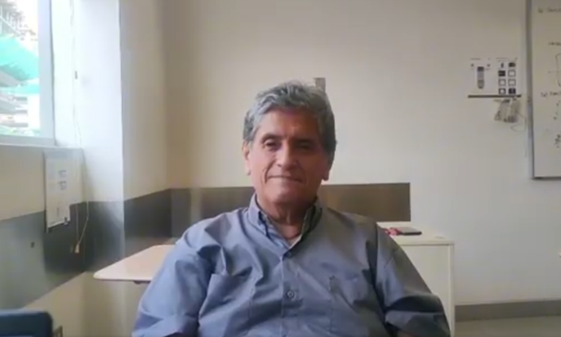

  <br>
  <em>Figura 10. YouTube: Entrevista 3 Segmento Coordinador institucional | Innovify: En esta figura se aprecia la cuarta persona entrevistada de nuestro tercer segmento: coordinador institucional.</em>
</p>


* **URL:** https://youtu.be/YDpJ_S8Ik2g  
* **Inicio:** 0:00  
* **Duración:** 13 minutos con 54 segundos  

---

### Resumen descriptivo

Esta entrevista fue realizada a un docente de Cálculo 2 de la Universidad Peruana de Ciencias Aplicadas (UPC).

De acuerdo con lo conversado, el profesor considera que la propuesta es una muy buena idea y la percibe como fundamental para el desarrollo profesional de los estudiantes. Destaca la importancia de que los alumnos colaboren e intercambien conocimientos, incluso entre diferentes universidades, con el fin de adaptarse a un mercado laboral cada vez más exigente.

Asimismo, mostró cautela en sus declaraciones para no vulnerar su contrato con la universidad, pero enfatizó que las plataformas tecnológicas tienen un gran potencial siempre que se utilicen bajo un marco de ética y respeto a las normas institucionales. Señaló que la educación en valores debe prevalecer sobre la simple restricción del uso de la tecnología.

Finalmente, evidenció interés en la funcionalidad operativa de la propuesta, sugiriendo que la validación y el acceso a la información se gestionen por niveles académicos, con el objetivo de asegurar que el contenido sea adecuado y pertinente para cada etapa del estudiante.

---

### 2.2.3. Análisis de entrevistas

#### Segmento objetivo #1: Estudiantes que quieran aprender

**1. Características objetivas**
* **Edad:** Estudiantes universitarios entre 20 a 26 años (100%).
* **Carrera:** Diversas (Ingeniería, Psicología, Gestión Empresarial) (100%).
* **Ciclo:** 5° a 8° ciclo (100%).
* **Experiencia con plataformas:**
  * Uso constante de herramientas digitales (WhatsApp, Zoom, Teams, YouTube, IA) (100%).
  * Saturación o incomodidad por uso de múltiples plataformas (66%).
  * Baja adopción de nuevas plataformas si no son intuitivas (33%).

**2. Características subjetivas**
* **Preferencias de estudio:**
  * Explicaciones claras, paso a paso y con ejemplos prácticos (100%).
  * Combinan estudio individual con apoyo puntual (100%).
  * Priorizan aprendizaje efectivo sobre rapidez (66%).
* **Dificultades para pedir ayuda:**
  * Falta de confianza, miedo o incomodidad (100%).
  * Dificultad para dar el primer paso (100%).
* **Problemas para encontrar ayuda:**
  * Demora en respuestas, falta de disponibilidad o falta de dominio del tema (100%).
* **Otros factores:**
  * Estrés en cursos exigentes (100%).
  * Problemas de coordinación de horarios (33%).
* **Uso de recursos externos:**
  * YouTube, internet e inteligencia artificial (100%).
  * Apoyo en amigos o contactos cercanos (100%).
  * Alta apertura a aprender con estudiantes de otras universidades (100%).
* **Funcionalidades deseadas:**
  * Chat, pizarra virtual y grabación de sesiones (100%).
  * Perfiles con reseñas y especialidades (66%).
  * Tutorías pagadas como alternativa (33%).

| Característica | % entrevistados | Insight real |
| :--- | :--- | :--- |
| Prefiere estudiar solo | 66% | Lo usan para concentrarse mejor |
| Uso de apoyo externo | 100% | Primer recurso ante dudas |
| Obstáculos para pedir ayuda | 100% | Confianza y disponibilidad |
| Valoran expertos sobre rapidez | 66% | Prefieren calidad |
| Frustración por múltiples plataformas | 100% | Necesidad de centralización |
| Funciones clave | 100% | Plataforma todo-en-uno |
| Confianza basada en reseñas | 100% | Factor decisivo |

*(Tabla 4. Principales hallazgos de entrevistas a estudiantes universitarios - Elaboración propia.)*

---

#### Segmento objetivo #2: Estudiantes que quieran enseñar

**1. Características objetivas**
* **Edad:** 21 a 25 años (100%).
* **Ciclo:** Diversos ciclos universitarios (100%).
* **Carrera:** Diversas (Negocios, Comunicación, Economía) (100%).
* **Experiencia:**
  * Enseñanza informal a compañeros (100%).
  * Creación de contenido educativo (33%).
  * Dominio de cursos específicos (100%).
* **Habilidades digitales:**
  * Uso de Zoom, Meet, WhatsApp, Discord y Drive (100%).

**2. Características subjetivas**
* **Motivaciones:**
  * Reforzar conocimiento (100%).
  * Impactar en otros (100%).
  * Desarrollo personal/profesional (67%).
  * Incentivo económico secundario (100%).
* **Dificultades:**
  * Falta de compromiso del estudiante (100%).
  * Frustración al enseñar (67%).
  * Dificultad para explicar (67%).
  * Problemas técnicos (33%).
* **Necesidades:**
  * Generar confianza con el estudiante (100%).
  * Herramientas didácticas digitales (100%).
  * Sistema de recompensas (67%).

| Característica | % entrevistados | Insight real |
| :--- | :--- | :--- |
| Enseñan de forma informal | 100% | Apoyo constante a compañeros |
| Reforzar conocimiento | 100% | Principal motivación |
| Impacto en otros | 100% | Motivación emocional |
| Aceptación de donaciones | 100% | Incentivo secundario |
| Falta de compromiso del alumno | 100% | Principal problema |
| Necesidad de validación | 100% | Confianza clave |
| Uso de múltiples herramientas | 100% | Problema de fragmentación |

*(Tabla 5. Principales hallazgos de estudiantes tutores - Elaboración propia.)*

---

#### Segmento objetivo #3: Coordinador Institucional

**1. Características objetivas**
* **Edad y rol:**
  * Profesionales entre 29 y 53 años (100%).
  * Docentes, coordinadores o jefes de práctica (100%).
* **Ámbito laboral:**
  * Universidades (100%).
* **Responsabilidades:**
  * Supervisión del aprendizaje (100%).
  * Garantizar integridad académica (100%).
  * Evaluación del desempeño (100%).
* **Relación con tecnología:**
  * Uso de herramientas digitales educativas (100%).
  * Sistemas de control académico (100%).

**2. Características subjetivas**
* **Percepción del aprendizaje colaborativo:**
  * Considerado fundamental (100%).
  * Positiva colaboración interuniversitaria (100%).
  * Mejora la preparación profesional (66%).
* **Preocupaciones:**
  * Plagio, fraude y suplantación (100%).
  * Uso indebido de tecnología (100%).
  * Información poco confiable (100%).
  * Riesgo reputacional (66%).
* **Barreras:**
  * Validación de estudiantes (100%).
  * Carga operativa (67%).
  * Costos (67%).
  * Necesidad de automatización (33%).
* **Limitaciones del estudiante:**
  * Falta de tiempo (100%).
  * Mala gestión del tiempo (100%).
  * Problemas de trabajo en equipo (66%).
* **Requisitos de la plataforma:**
  * Verificación de identidad (100%).
  * Validación académica (100%).
  * Políticas claras (100%).
  * Trazabilidad de interacciones (100%).
  * Panel de monitoreo (100%).
* **Condiciones de aceptación:**
  * Enfoque en aprendizaje (100%).
  * Marco ético claro (100%).
  * No afectar rendimiento (66%).
  * No sobrecargar usuarios (66%).

| Característica | % entrevistados | Insight clave |
| :--- | :--- | :--- |
| Aprendizaje colaborativo | 100% | Fundamental |
| Colaboración interuniversitaria | 100% | Positiva si se controla |
| Preocupación por fraude | 100% | Riesgo principal |
| Validación de identidad | 100% | Requisito crítico |
| Uso responsable de tecnología | 100% | Condición base |
| Riesgo reputacional | 66% | Preocupación relevante |
| Problemas de tiempo | 100% | Limita uso |
| Sistema de monitoreo | 100% | Necesario |
| Carga operativa | 67% | Barrera |
| Segmentación académica | 33% | Mejora pertinencia |

*(Tabla 6. Principales hallazgos de coordinadores académicos - Elaboración propia.)*

---

## 2.3. Needfinding

Para el proceso de needfinding, se ha planificado la realización de entrevistas a los tres arquetipos de usuarios identificificados: "Estudiantes que quieran aprender", "Estudiantes que quieran enseñar" y el "Coordinador Institucional". El objetivo principal de esta investigación es indagar en las motivaciones, frustraciones y necesidades de los estudiantes universitarios peruanos cuando buscan o desean ofrecer apoyo académico más allá de las fronteras de su propia institución.

A través de este proceso, se busca validar las hipótesis iniciales del proyecto, como la existencia de una demanda latente de colaboración interuniversitaria y la importancia crítica de la seguridad y la confianza en un entorno digital de este tipo. Los hallazgos derivados de las entrevistas permitirán comprender a fondo los problemas que la plataforma debe resolver, como el aislamiento académico y la desconfianza inicial entre pares desconocidos.

### 2.3.1. User Personas

Para el proceso de needfinding, se ha planificado la realización de entrevistas a los tres arquetipos de usuarios identificados: "Estudiantes que quieran aprender", "Estudiantes que quieran enseñar" y el "Coordinador Institucional". El objetivo principal de esta investigación es indagar en las motivaciones, frustraciones y necesidades de los estudiantes universitarios peruanos cuando buscan o desean ofrecer apoyo académico más allá de las fronteras de su propia institución.

A través de este proceso, se busca validar las hipótesis iniciales del proyecto, como la existencia de una demanda latente de colaboración interuniversitaria y la importancia crítica de la seguridad y la confianza en un entorno digital de este tipo. Los hallazgos derivados de las entrevistas permitirán comprender a fondo los problemas que la plataforma debe resolver, como el aislamiento académico y la desconfianza inicial entre pares desconocidos.

Como evidencia del proceso, se realizaron diversas entrevistas a estudiantes universitarios de distintos perfiles. En el caso del segmento de estudiantes-tutores, uno de los participantes destacó la importancia de contar con herramientas integradas de comunicación en tiempo real, así como funcionalidades para compartir materiales académicos de forma sencilla. Asimismo, señaló que modelos como las donaciones voluntarias o el intercambio de conocimientos resultan motivadores para brindar apoyo académico. También se identificó la necesidad de asegurar la claridad en las explicaciones durante las tutorías, lo cual refuerza la importancia de diseñar una experiencia de usuario intuitiva, confiable y centrada en el aprendizaje.

**User Persona: Estudiantes que quieran aprender**
<p align="center">
  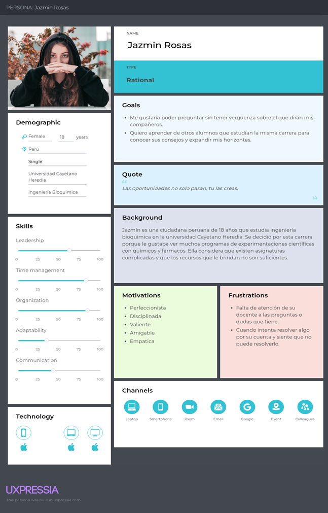
  <br>
  <em>Figura 11. User Persona - Estudiantes que quieran aprender - Elaboración propia.</em>
</p>
En esta figura se observa el arquetipo de usuario correspondiente al segmento de estudiantes o "Learners". El perfil de Jazmin Rosas detalla las metas, motivaciones y frustraciones de una estudiante de ingeniería, proporcionando una base clara para orientar el desarrollo hacia soluciones de aprendizaje colaborativo y soporte académico entre pares.
<br><br>

**User Persona: Estudiantes que quieran enseñar**
<p align="center">
  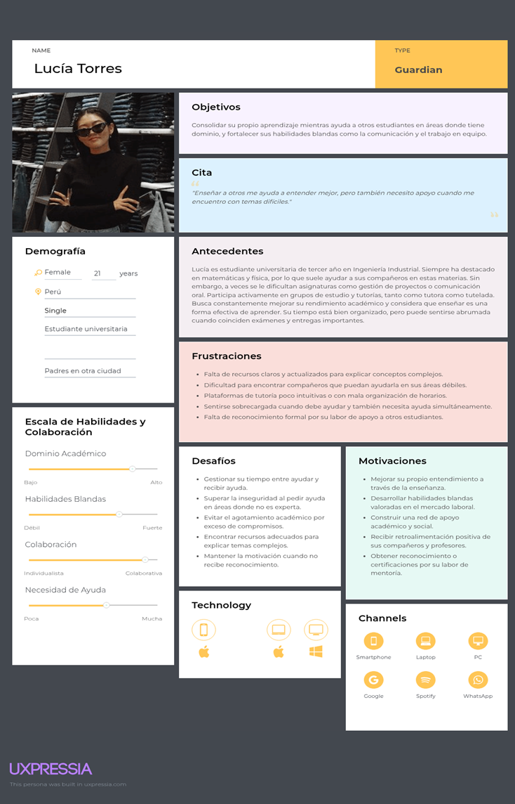
  <br>
  <em>Figura 12. User Persona - Estudiantes que quieran enseñar - Elaboración propia.</em>
</p>
En esta figura se presenta el arquetipo de usuario "Lucía Torres", el cual personifica el segmento de estudiantes con un rol híbrido que actúan simultáneamente como tutores y aprendices. El perfil describe sus antecedentes académicos en ingeniería y sus objetivos de fortalecer habilidades blandas mediante la enseñanza, proporcionando información valiosa sobre los desafíos de gestión del tiempo y la necesidad de herramientas intuitivas para la organización de las sesiones de tutoría.
<br>
<br>

**User Persona: Coordinador Institucional**
<p align="center">
  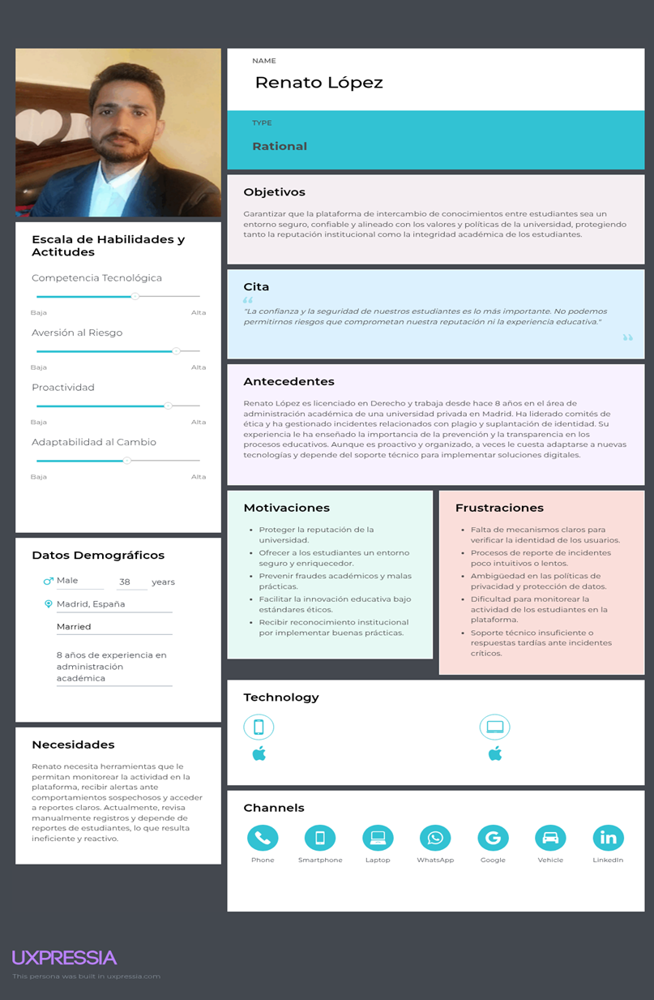
  <br>
  <em>Figura 13. User Persona - Coordinador Institucional - Elaboración propia.</em>
</p>
En la imagen tenemos la caracterización de Renato López, quien representa el segmento administrativo y de moderación del sistema. Su perfil resalta objetivos enfocados en la seguridad, la integridad académica y el monitoreo de comportamientos, definiendo los requerimientos necesarios para las herramientas de gestión institucional de la plataforma.
<br>
<br>
<br>


**En conjunto**, los arquetipos de usuario presentados permiten comprender de manera clara las necesidades, motivaciones y desafíos de los principales actores dentro del sistema. El perfil de los estudiantes o “Learners” orienta el diseño hacia experiencias de aprendizaje colaborativo y soporte académico efectivo, mientras que el arquetipo del usuario administrativo establece los lineamientos necesarios para garantizar la seguridad, la integridad académica y una adecuada supervisión del comportamiento dentro de la plataforma.

Por otro lado, el perfil híbrido de usuarios que cumplen simultáneamente roles de estudiante y tutor aporta una visión más dinámica del ecosistema, evidenciando la necesidad de herramientas flexibles que faciliten la gestión del tiempo y la organización de sesiones de enseñanza. En conjunto, estos arquetipos permiten alinear el desarrollo del sistema con usuarios reales y diversos, asegurando una solución más centrada en la experiencia, la eficiencia operativa y el equilibrio entre aprendizaje, enseñanza y administración.
<br><br>


---

### 2.3.2. User Task Matrix

En el User Task Matrix se consideran tres segmentos: estudiantes que aprenden, estudiantes que enseñan y coordinadores institucionales, evaluando sus tareas clave según frecuencia e importancia. 

Los aprendices priorizan estudiar independientemente y acceder a recursos de apoyo; los tutores, reforzar su conocimiento y participar en grupos de estudio; y los coordinadores, orientar casos prácticos, gestionar el tiempo y verificar la integridad académica. 

Todos coinciden en usar herramientas digitales y favorecer la colaboración, aunque cada segmento aplica estas tareas con objetivos distintos.

---

#### Segmento objetivo #1: Estudiantes que quieran aprender

| Tasks | User 1 Frecuencia | User 1 Importancia | User 2 Frecuencia | User 2 Importancia | User 3 Frecuencia | User 3 Importancia |
| :--- | :--- | :--- | :--- | :--- | :--- | :--- |
| Buscar información de Internet | Alta | Alta | Alta | Alta | Alta | Alta |
| Consultar a familiares o compañeros con experiencia | Media | Media-Alta | Media | Alta | Media | Media-Alta |
| Estudiar independientemente en horarios tranquilos | Muy alta | Muy alta | Muy alta | Muy alta | Muy alta | Muy alta |
| Coordinar con compañeros | Media | Alta | Media | Alta | Media | Alta |
| Acceder a plataformas de tutorías, videos o chats | Muy alta | Muy alta | Alta | Alta | Muy alta | Muy alta |
| Contratar un tutor particular | Media | Muy alta | Media | Muy alta | Media | Muy alta |

*(Tabla 7. Actividades de aprendizaje y su valoración por los usuarios - Elaboración propia.)*

---

#### Segmento objetivo #2: Estudiantes que quieran enseñar

| Tasks | User 1 Frecuencia | User 1 Importancia | User 2 Frecuencia | User 2 Importancia | User 3 Frecuencia | User 3 Importancia |
| :--- | :--- | :--- | :--- | :--- | :--- | :--- |
| Estudiar y reforzar conocimiento antes de enseñar | Muy alta | Muy alta | Muy alta | Muy alta | Muy alta | Muy alta |
| Participar en grupos de estudio y colaborar | Alta | Alta | Muy alta | Muy alta | Muy alta | Muy alta |
| Ayudar a estudiantes de otras universidades | Media | Alta | Alta | Alta | Media | Alta |
| Conocer al estudiante para generar confianza | Media | Alta | Media | Muy alta | Media | Alta |
| Utilizar herramientas digitales para tutoría | Media | Alta | Alta | Alta | Media | Alta |
| Gestionar motivación y recompensas | Baja-Media | Media-Alta | Baja-Media | Media | Baja | Media |

*(Tabla 8. Actividades y motivaciones de los estudiantes-tutores - Elaboración propia.)*

---

#### Segmento objetivo #3: Coordinador Institucional

| Tasks | User 1 Frecuencia | User 1 Importancia | User 2 Frecuencia | User 2 Importancia | User 3 Frecuencia | User 3 Importancia |
| :--- | :--- | :--- | :--- | :--- | :--- | :--- |
| Guiar mediante casos prácticos y simulaciones | Muy alta | Muy alta | Muy alta | Muy alta | Alta | Muy alta |
| Enseñar gestión del tiempo y organización | Media | Alta | Muy alta | Alta | Media-Alta | Alta |
| Fomentar trabajo en equipo y comunicación | Media | Alta | Alta | Alta | Alta | Alta |
| Garantizar información confiable | Media | Muy alta | Alta | Muy alta | Media | Alta |
| Verificar alumnos e integridad académica | Baja-Media | Alta | Media | Alta | Alta | Alta |
| Implementar herramientas digitales y plazos | Media | Alta | Alta | Alta | Alta | Muy alta |

*(Tabla 9. Funciones y prioridades de los coordinadores académicos - Elaboración propia.)*

---

### Conclusión

Las tareas más frecuentes e importantes son:

* **Aprendices:** Estudiar de forma independiente y acceder a recursos de apoyo.  
* **Tutores:** Reforzar conocimiento y participar en grupos de estudio.  
* **Coordinadores:** Orientar casos prácticos y verificar la integridad académica.  

Todos los segmentos coinciden en usar herramientas digitales y favorecer la colaboración, aunque cada grupo las aplica con un enfoque distinto según sus objetivos.

---

### 2.3.3. User Journey Mapping

En esta sección se presentan los User Journey Maps As-Is de cada User Persona, mostrando el recorrido completo (end-to-end) de los usuarios en la situación actual, sin intervención de la nueva solución, lo que incluye procesos, puntos de dolor y oportunidades.

* **Segmento 1: Estudiantes que quieran aprender.** Inicia con la necesidad de comprender un tema, pasando por dudas, búsquedas de ayuda frustrantes y coordinación complicada, hasta la evaluación del aprendizaje, evidenciando problemas de disponibilidad y confiabilidad de recursos.
* **Segmento 2: Estudiantes que quieran enseñar.** Comienza con motivación por reforzar su conocimiento y ayudar, pero enfrenta obstáculos en la preparación de material, coordinación con el aprendiz y falta de retroalimentación para mejorar su enseñanza.
* **Segmento 3: Coordinadores Institucionales.** Inician su recorrido al identificar la necesidad de mantener la calidad académica y fomentar la colaboración. Continúan con la planeación y preparación de estrategias, pero enfrentan complejidades al anticipar errores operativos. Durante la implementación y coordinación, sufren de sobrecarga operativa y riesgos de plagio o fraude, para finalmente en la etapa de supervisión y evaluación, lidiar con limitaciones operativas y la dificultad de medir el impacto real de sus esfuerzos.

#### Segmento #1: Estudiantes que quieran aprender
<p align="center">
  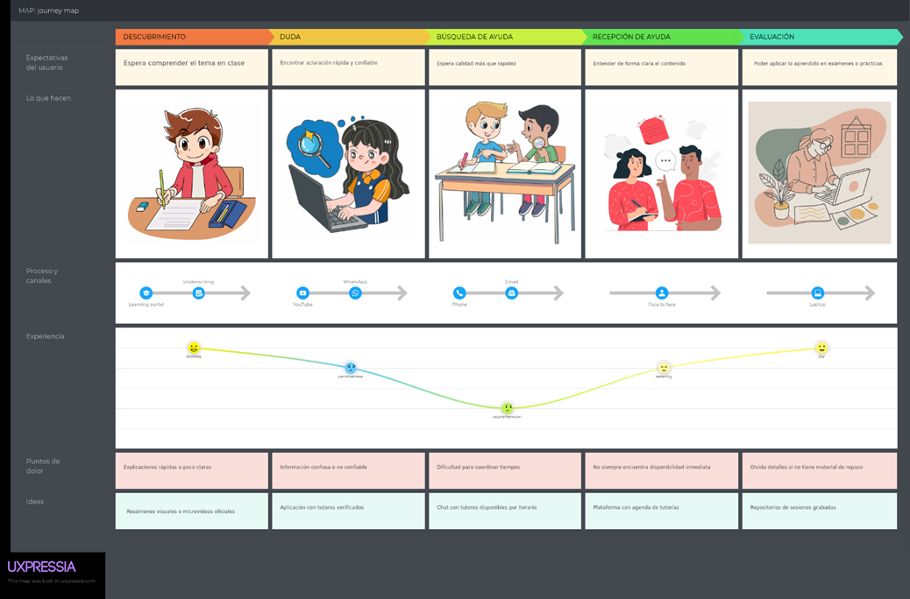
  <br>
  <em>Figura 14. User Journey Mapping – Estudiantes que quieran aprender - Elaboración propia. Nota: En esta figura se aprecia nuestro primer Journey Mapping de nuestro primer segmento estudiante aprendiz.</em>
</p>
<br>
En esta figura se observa el recorrido del estudiante o aprendiz a través de cinco etapas críticas: descubrimiento, duda, búsqueda, recepción de ayuda y evaluación. El diagrama detalla la curva emocional del usuario, identificando puntos de dolor como la dificultad para coordinar horarios y la falta de claridad en explicaciones, proponiendo soluciones como el uso de tutores verificados y repositorios de sesiones grabadas.
<br>

#### Segmento #2: Estudiantes que quieran enseñar
<p align="center">
  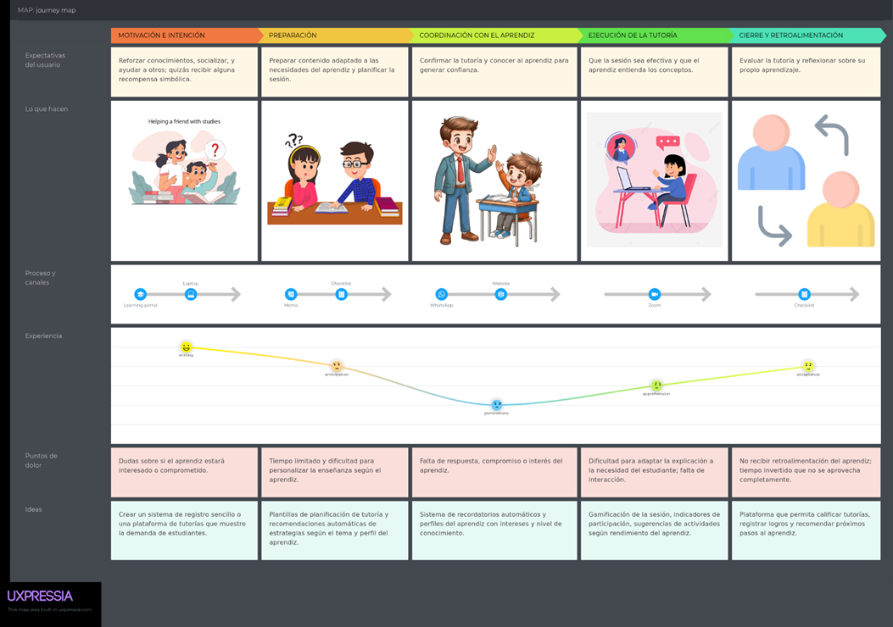
  <br>
  <em>Figura 15. User Journey Mapping – Estudiantes que quieran enseñar - Elaboración propia. Nota: En esta figura se aprecia nuestro segundo Journey Mapping de nuestro segundo segmento estudiante tutor.</em>
</p>
<br>
En la imagen tenemos la visualización de la experiencia desde la perspectiva del tutor. El mapa describe el proceso desde la motivación inicial y la preparación del material hasta el cierre y retroalimentación de la sesión. Se resalta la fluctuación de la experiencia según el compromiso del aprendiz y se proponen ideas de mejora como la gamificación de las sesiones y sistemas de recordatorios automáticos para optimizar la gestión del tiempo.
<br>

#### Segmento #3: Coordinador Institucional
<p align="center">
  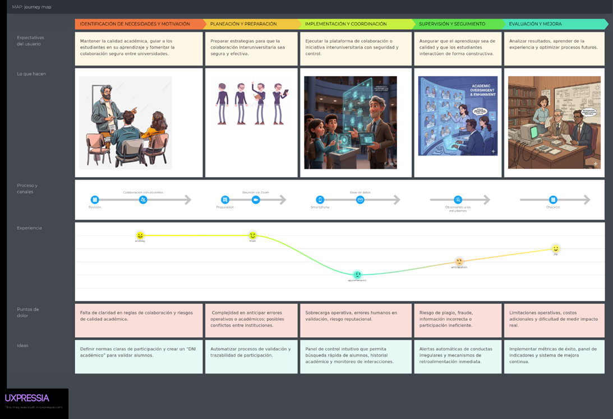
  <br>
  <em>Figura 16. User Journey Mapping - Coordinador Institucional - Elaboración propia. Nota: En esta figura se aprecia nuestro tercer Journey Mapping de nuestro segmento coordinador institucional.</em>
</p>

En esta figura se detalla el flujo de gestión desde el ángulo administrativo y de calidad académica. El mapa abarca la planeación, implementación y supervisión de las tutorías interuniversitarias, poniendo énfasis en la mitigación de riesgos operativos como el plagio o el fraude. Se proponen herramientas técnicas de control, tales como un "DNI académico" para la validación de alumnos y paneles de control intuitivos para el monitoreo de interacciones.
<br>
<br>
<br>

**Entonces**, los mapas de experiencia presentados permiten comprender de manera integral cómo interactúan los distintos actores con la plataforma a lo largo de sus procesos clave. Desde la perspectiva del estudiante, se evidencia un recorrido marcado por necesidades emocionales y operativas que van desde la incertidumbre inicial hasta la evaluación final, identificando puntos críticos que pueden ser mitigados mediante herramientas de apoyo como tutores verificados y recursos grabados.

Desde el lado del tutor, la experiencia se centra en la preparación, ejecución y retroalimentación de las sesiones, donde la calidad de la interacción depende del nivel de compromiso del aprendiz, proponiéndose mejoras orientadas a la motivación y la optimización del tiempo mediante gamificación y automatización de recordatorios.

Finalmente, la visión administrativa incorpora una capa de control y supervisión orientada a garantizar la calidad académica y la seguridad del sistema, abordando riesgos como el fraude o el plagio mediante mecanismos de validación y paneles de monitoreo. En conjunto, estas perspectivas permiten diseñar una experiencia equilibrada, eficiente y segura para todos los participantes del ecosistema educativo.

<br>

---

### 2.3.4. Empathy Mapping

Para profundizar en el entendimiento de nuestros usuarios finales y diseñar una solución que responda a sus necesidades reales, se desarrollaron mapas de empatía para cada segmento identificado. Esta herramienta permite visualizar el entorno, las percepciones y las motivaciones de los actores clave (aprendiz, tutor y administrador), facilitando la identificación de puntos críticos y oportunidades de valor dentro del ecosistema de SkillSwap.
<br>


#### Segmento #1: Estudiantes que quieran aprender
<p align="center">
  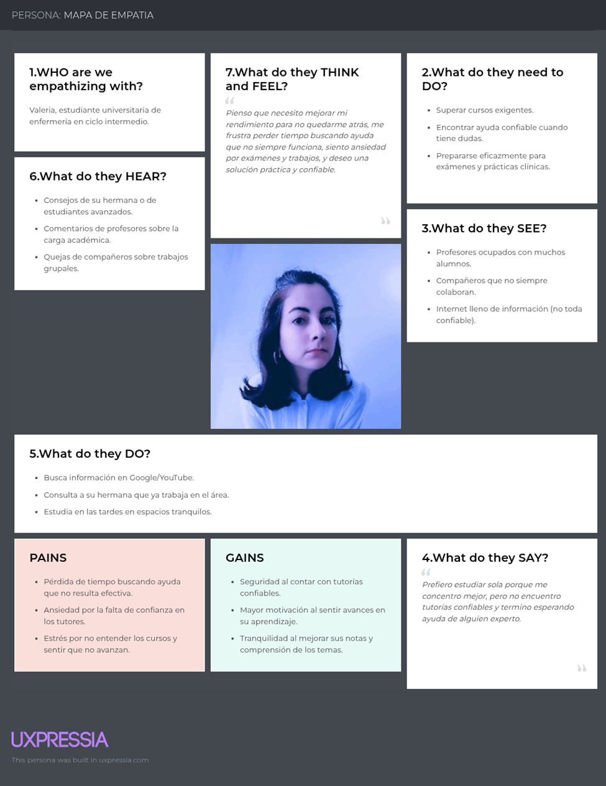
  <br>
  <em>Figura 17. Empathy Mapping - Estudiantes aprendices - Elaboración propia. Nota: En esta figura se aprecia nuestro Empathy Mapping de nuestro primer segmento estudiante aprendiz.</em>
</p>
<br>
Se observa el mapa de empatía de Valeria, estudiante universitaria que representa al segmento de aprendices. El diagrama detalla su necesidad de encontrar apoyo académico confiable ante una carga académica exigente, identificando como puntos de dolor la ansiedad generada por la falta de confianza en los tutores actuales y la frustración de perder tiempo buscando ayuda poco efectiva.

<br>

#### Segmento #2: Estudiantes que quieran enseñar
<p align="center">
  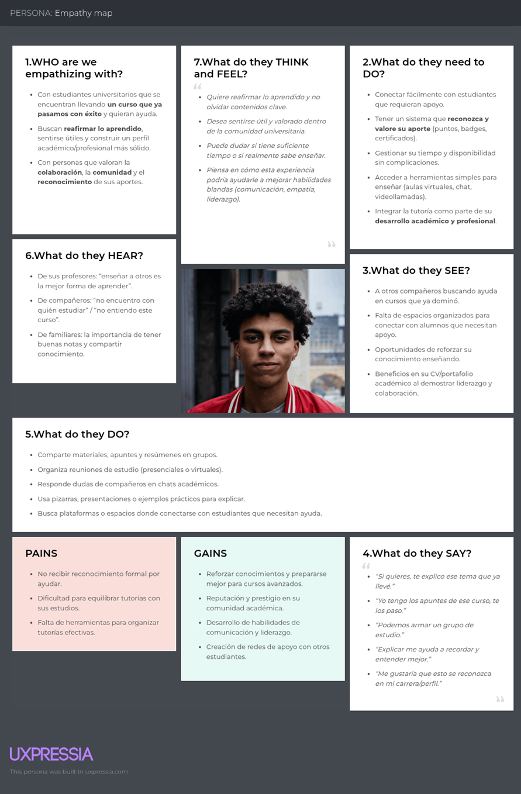
  <br>
  <em>Figura 18. Empathy Mapping - Estudiantes tutores - Elaboración propia. Nota: En esta figura se aprecia nuestro segundo Empathy Mapping de nuestro segmento estudiantes tutores.</em>
</p>
<br>
En esta figura se detalla el mapa de empatía orientado al estudiante con rol de tutor. El análisis subraya su deseo de reafirmar conocimientos mediante la enseñanza y construir un perfil académico/profesional sólido. Se identifican como principales desafíos la falta de reconocimiento formal por su labor de apoyo y la dificultad para equilibrar las tutorías con sus propias responsabilidades de estudio.
<br>

#### Segmento #3: Coordinador Institucional
<p align="center">
  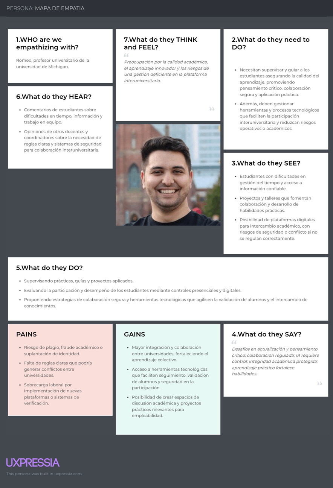
  <br>
  <em>Figura 19. Empathy Mapping - Coordinador Institucional - Elaboración propia. Nota: En esta figura se aprecia nuestro tercer Empathy Mapping de nuestro segmento coordinador institucional.</em>
</p>

En la imagen tenemos la caracterización empática de Romeo, representante del segmento institucional y administrativo. El mapa resalta su preocupación por mantener la calidad académica y la integridad institucional, señalando como riesgos principales el fraude o suplantación de identidad, y visualizando como ganancia el acceso a herramientas tecnológicas que agilicen la validación de los participantes.
<br><br>
**Entonces**, los mapas de empatía permiten profundizar en las necesidades emocionales, motivaciones y dificultades de los distintos actores del sistema, enriqueciendo la comprensión del diseño centrado en el usuario. En el caso del estudiante con rol de tutor, se evidencia una motivación orientada al refuerzo de conocimientos y al desarrollo de su perfil profesional, aunque enfrenta desafíos relacionados con el reconocimiento de su labor y la gestión del tiempo entre sus responsabilidades académicas y las tutorías.

Por su parte, el perfil institucional destaca una fuerte preocupación por la calidad académica y la seguridad del sistema, priorizando la prevención de riesgos como el fraude y la suplantación, y valorando el uso de herramientas tecnológicas que optimicen los procesos de validación. Finalmente, el estudiante aprendiz refleja una necesidad urgente de apoyo académico confiable, enfrentando emociones como la ansiedad y la frustración debido a experiencias poco efectivas en la búsqueda de ayuda. En conjunto, estos mapas evidencian la importancia de diseñar una plataforma equilibrada que atienda tanto aspectos funcionales como emocionales, asegurando confianza, eficiencia y valor para todos los usuarios.

---

## 2.4. Big Picture EventStorming

El Big Picture EventStorming nos permite explorar el dominio de nuestra plataforma de manera colaborativa, identificando los eventos de negocio clave a lo largo de la línea de tiempo. Hemos dividido este análisis en las siguientes etapas fundamentales:

### Fase 0
<br>
El siguiente apartado presenta una introducción a los requerimientos funcionales de la plataforma, destacando su estructura integral y la interrelación de sus componentes principales. Se describen los elementos clave que permiten su funcionamiento, incluyendo la gestión financiera, la resolución de conflictos, la generación de indicadores de desempeño y el módulo de aprendizaje. Asimismo, se abordan las funcionalidades de comunicación y el ciclo de vida del usuario, desde su registro hasta la interacción con tutores. A continuación, se detallarán los aspectos fundamentales que conforman esta solución robusta y escalable.


<figure style="text-align: center; margin-bottom: 40px;">
  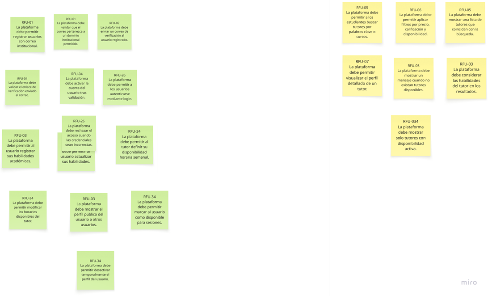
  <figcaption style="margin-top: 10px;">
    <em>Figura 20. En esta figura se observa la derivación de requisitos tras el proceso de Event Storming, centrada en el ciclo de vida del usuario. Se detallan las funcionalidades de registro institucional, autenticación y gestión de perfiles, así como los criterios lógicos para el motor de búsqueda y filtrado de tutores según habilidades y disponibilidad.</em>
  </figcaption>
</figure>
<br>
<figure style="text-align: center; margin-bottom: 40px;">
  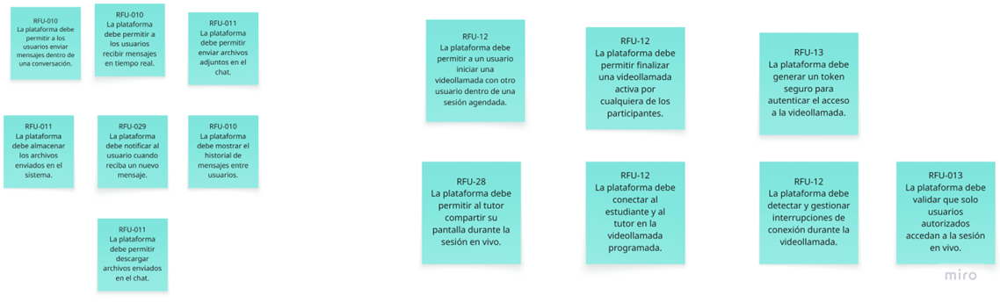
  <figcaption style="margin-top: 10px;">
    <em>Figura 21. En la imagen tenemos la clasificación de requerimientos funcionales para la comunicación síncrona. Se especifican las reglas para el sistema de mensajería (chat y envío de archivos) y la infraestructura lógica necesaria para la ejecución segura de videollamadas, incluyendo la generación de tokens de acceso y funciones de pantalla compartida.</em>
  </figcaption>
</figure>
<br>
<figure style="text-align: center; margin-bottom: 40px;">
  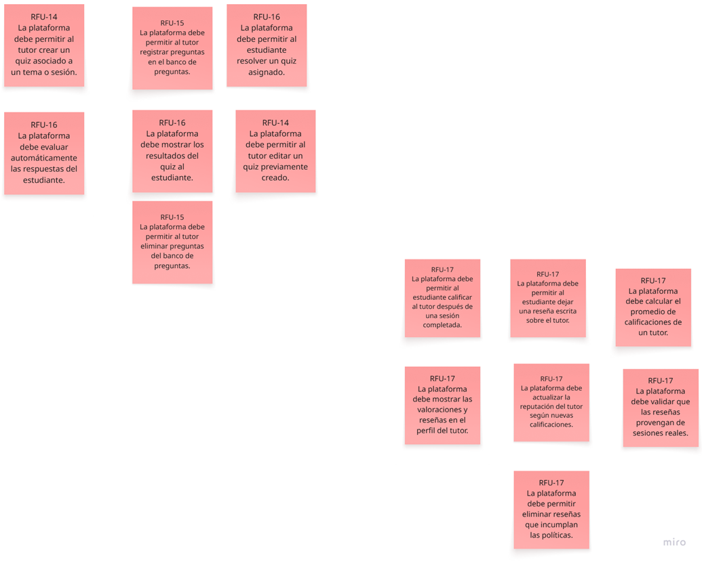
  <figcaption style="margin-top: 10px;">
    <em>En esta figura se detalla la lógica funcional para el módulo de aprendizaje, abarcando desde la gestión de bancos de preguntas y evaluación automatizada de quizzes, hasta las métricas de negocio para el procesamiento de reseñas y el cálculo del promedio de calificación de los tutores.</em>
  </figcaption>
</figure>
<br>
<figure style="text-align: center; margin-bottom: 40px;">
  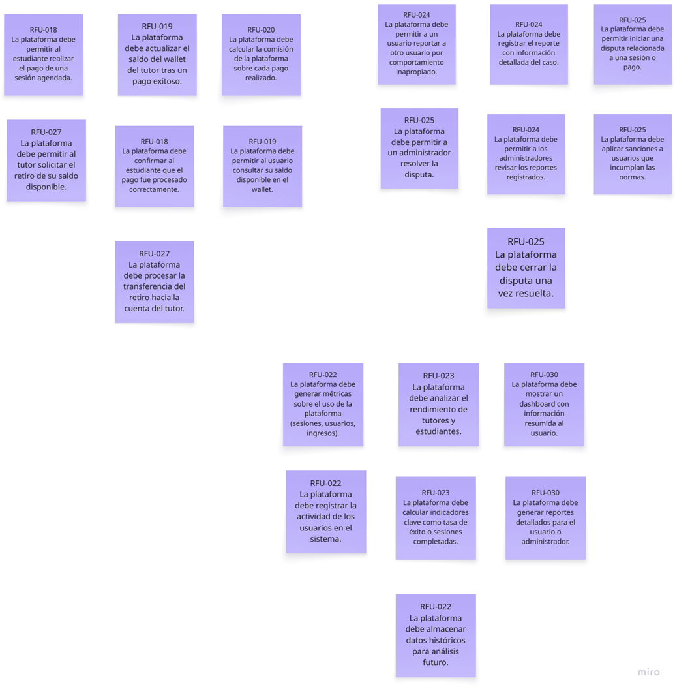
  <figcaption style="margin-top: 10px;">
    <em>Figura 22. Se observa el mapeo de requerimientos para el flujo financiero de la plataforma (pagos y monedero digital), el sistema de resolución de conflictos y la generación de indicadores clave (KPIs). Esta vista define las métricas de rendimiento y los reportes detallados necesarios para el monitoreo administrativo de la solución.</em>
  </figcaption>
</figure>
<br>
<p style="text-align: center;">
  <em> Big Picture EventStorming: Fase 0 - Elaboración propia. Nota: En esta fase inicial se descubren y organizan cronológicamente los eventos de dominio (Domain Events) en la plataforma, representados en notas naranjas.</em>
</p>
<br>

En conjunto, los elementos presentados evidencian una definición integral y estructurada de los requerimientos funcionales de la plataforma, abarcando sus componentes clave. Se articulan de manera coherente el flujo financiero, el sistema de resolución de conflictos y la generación de KPIs para el control administrativo, junto con el módulo de aprendizaje que gestiona evaluaciones, contenido y métricas de desempeño. Asimismo, se incorporan las funcionalidades de comunicación síncrona, garantizando interacción segura y eficiente entre usuarios mediante mensajería y videollamadas. Finalmente, el enfoque derivado del Event Storming permite consolidar el ciclo de vida del usuario, desde su registro y autenticación hasta la búsqueda personalizada de tutores. En conjunto, estos aspectos configuran una solución robusta, orientada tanto a la experiencia del usuario como a la gestión eficiente y escalable del sistema.

---

### Etapa 1 y 2
<br>
El presente apartado introduce una visión general de la arquitectura operativa de la plataforma, destacando la integración y coherencia de sus distintos módulos. Se abordan los principales procesos que permiten su funcionamiento, desde la gestión administrativa y financiera hasta los mecanismos de aprendizaje, comunicación y emparejamiento de usuarios. Asimismo, se resalta la importancia de contar con sistemas robustos de evaluación, mensajería en tiempo real y control de identidad, los cuales garantizan una experiencia segura y eficiente. A continuación, se presentarán los elementos clave que conforman esta solución integral.


<figure style="text-align: center; margin-bottom: 40px;">
  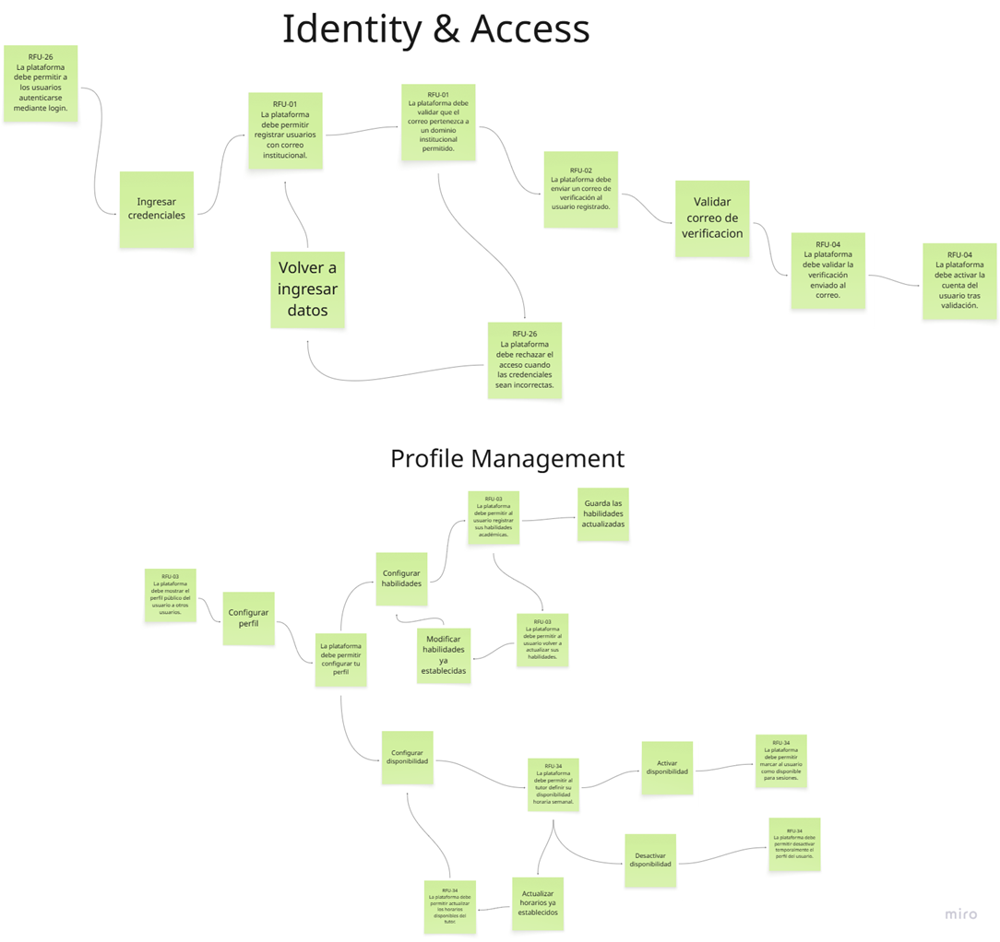
  <figcaption style="margin-top: 10px;">
    <em>Figura 23. En esta figura se observa el flujo secuencial para la gestión de identidad y acceso, así como la administración de perfiles. Se detalla la lógica desde el ingreso de credenciales y la validación obligatoria del dominio institucional, hasta la configuración detallada del perfil de usuario, permitiendo al estudiante registrar habilidades académicas y definir su disponibilidad horaria semanal de manera estructurada.</em>
  </figcaption>
</figure>

<figure style="text-align: center; margin-bottom: 40px;">
  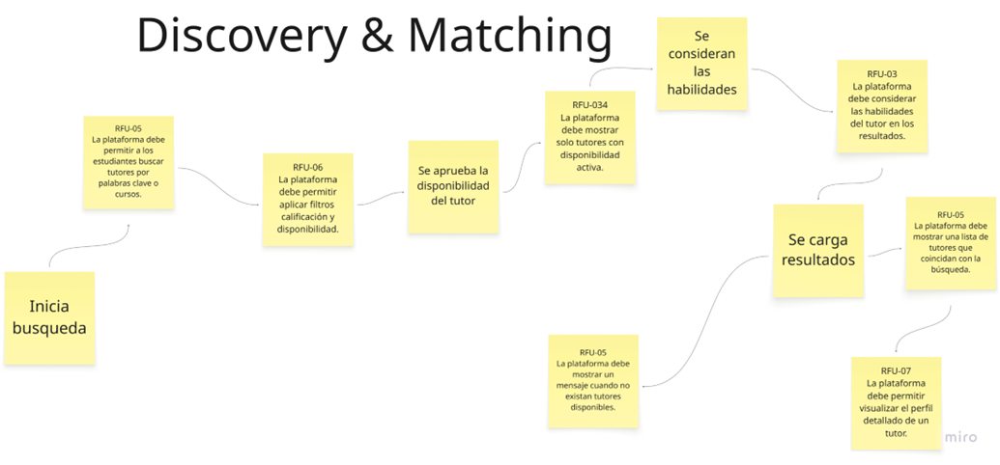
  <figcaption style="margin-top: 10px;">
    <em>Figura 24. En la imagen tenemos el mapeo de procesos para el módulo de búsqueda y selección de tutores. Se ilustra la transición desde el inicio de la búsqueda por palabras clave hasta la carga de resultados finales, destacando los puntos de validación de disponibilidad activa del tutor y la aplicación de filtros por calificación, asegurando un emparejamiento eficiente entre las necesidades del aprendiz y la oferta académica.</em>
  </figcaption>
</figure>

<figure style="text-align: center; margin-bottom: 40px;">
  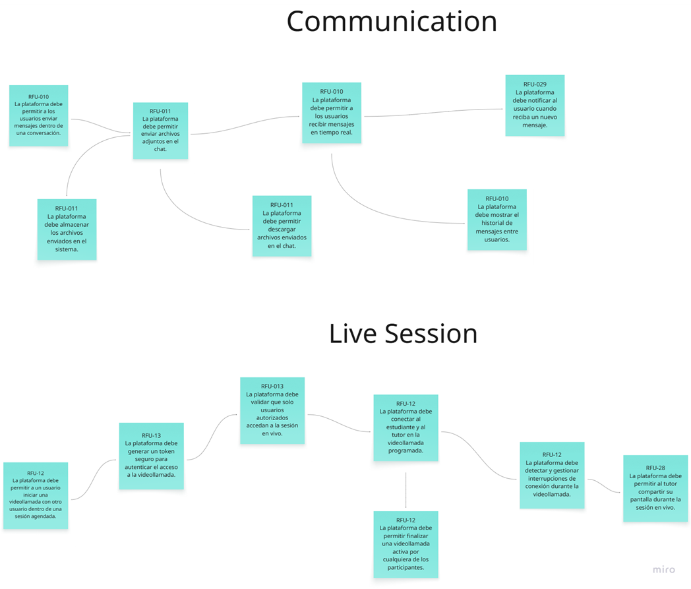
  <figcaption style="margin-top: 10px;">
    <em>Figura 25. Se observa la diagramación de eventos para la interacción entre usuarios en tiempo real. La sección superior detalla el flujo de mensajería y gestión de archivos adjuntos, mientras que la sección inferior establece la secuencia técnica para las sesiones síncronas (Live Sessions), abarcando la generación de tokens de seguridad para videollamadas y la detección de interrupciones de conexión durante la sesión.</em>
  </figcaption>
</figure>

<figure style="text-align: center; margin-bottom: 40px;">
  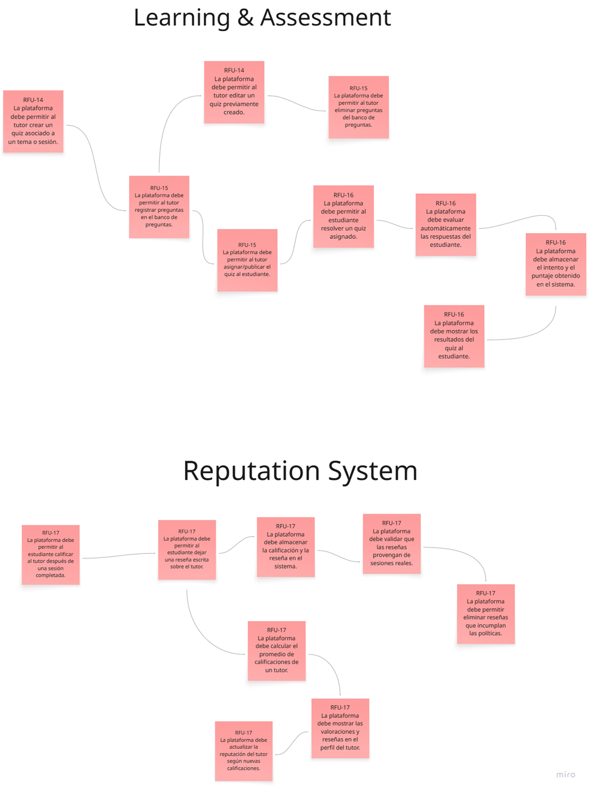
  <figcaption style="margin-top: 10px;">
    <em>Figura 26. En esta figura se presenta la secuencia lógica para los procesos de aprendizaje y retroalimentación. Se describe el ciclo de vida de los cuestionarios (desde la creación del banco de preguntas hasta la evaluación automática y almacenamiento de puntajes) y el flujo de validación de reseñas, garantizando que las calificaciones publicadas en el perfil del tutor correspondan a sesiones efectivamente completadas.</em>
  </figcaption>
</figure>

<figure style="text-align: center; margin-bottom: 40px;">
  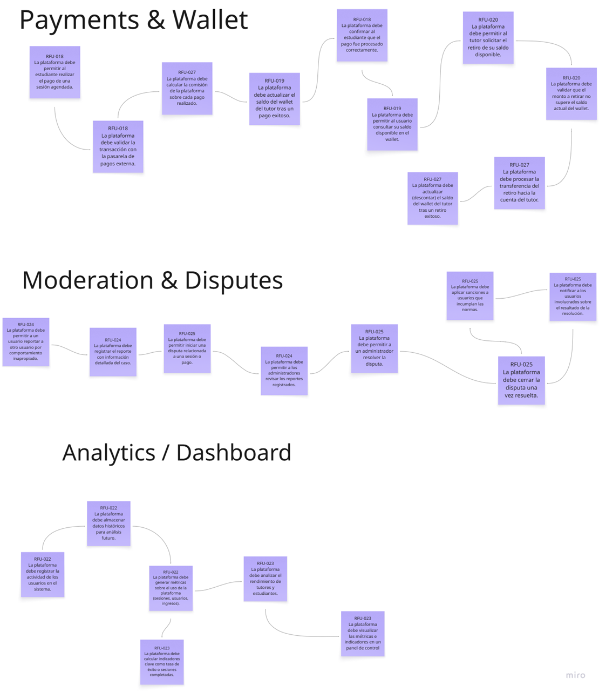
  <figcaption style="margin-top: 10px;">
    <em>Figura 27. En la imagen se evidencia el flujo operativo para los módulos de soporte y administración. Se detalla la secuencia de validación de pagos y retiros de saldo hacia el monedero digital, el proceso de reporte y resolución de disputas por comportamiento inapropiado, y finalmente la lógica de recolección de datos históricos para la generación de métricas de rendimiento en el panel de control (dashboard).</em>
  </figcaption>
</figure>

<p style="text-align: center;">
  <em> Big Picture EventStorming: Etapa 1 y 2 - Elaboración propia. Nota: Se añaden los comandos (notas azules) que desencadenan los eventos y se identifican los actores/sistemas (notas amarillas pequeñas/rosadas) que los ejecutan dentro del ecosistema.</em>
</p>
<br>

En conjunto, los procesos descritos reflejan una arquitectura operativa completa y bien orquestada de la plataforma, donde cada módulo contribuye al funcionamiento integral del sistema. Se integran los flujos de soporte y administración, garantizando la correcta gestión financiera, la resolución de disputas y la generación de métricas para la toma de decisiones. Paralelamente, el módulo de aprendizaje asegura un ciclo estructurado de evaluación y retroalimentación, validando la calidad de las interacciones académicas mediante cuestionarios y reseñas verificadas.

Asimismo, la comunicación en tiempo real se encuentra respaldada por una lógica robusta que permite la mensajería eficiente y la ejecución segura de sesiones síncronas, incluso ante posibles interrupciones. A esto se suma un sistema de búsqueda y selección de tutores optimizado, que facilita el emparejamiento preciso entre usuarios mediante filtros y validaciones de disponibilidad. Finalmente, la gestión de identidad y perfiles establece una base sólida para el acceso seguro y la personalización de la experiencia del usuario. En conjunto, estos flujos consolidan una solución coherente, confiable y centrada tanto en la calidad del servicio como en la escalabilidad del sistema.


---

### Etapa 3
<br>
La plataforma integra de manera coherente sus distintos módulos para ofrecer un entorno seguro, confiable y eficiente. Combina mecanismos de control, resolución de conflictos y gestión financiera con sistemas de reputación, evaluaciones académicas y herramientas colaborativas. Todo esto permite no solo garantizar la calidad del servicio, sino también fortalecer la confianza entre los usuarios mediante procesos claros, verificados y bien estructurados.


<figure style="text-align: center; margin-bottom: 40px;">
  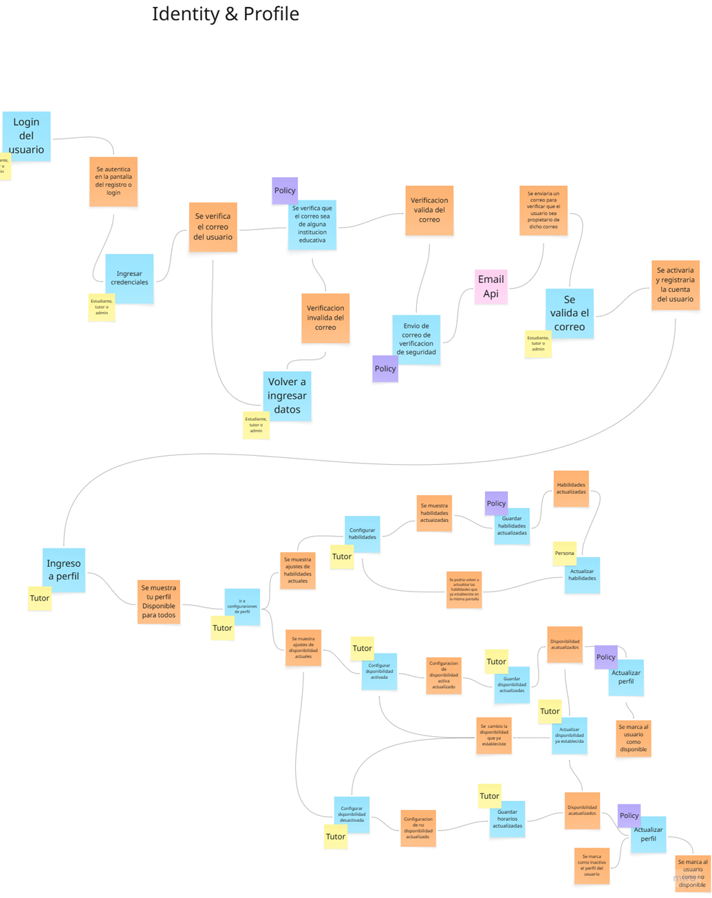
  <figcaption style="margin-top: 10px;">
    <em>Figura 28. En esta figura se observa el flujo completo de gestión de usuarios, integrando políticas de verificación para correos institucionales y el uso de APIs externas de correo. Se detalla cómo los actores (Estudiante/Tutor) interactúan con el sistema para la validación de cuentas y la configuración granular de habilidades y horarios de disponibilidad.</em>
  </figcaption>
</figure>

<figure style="text-align: center; margin-bottom: 40px;">
  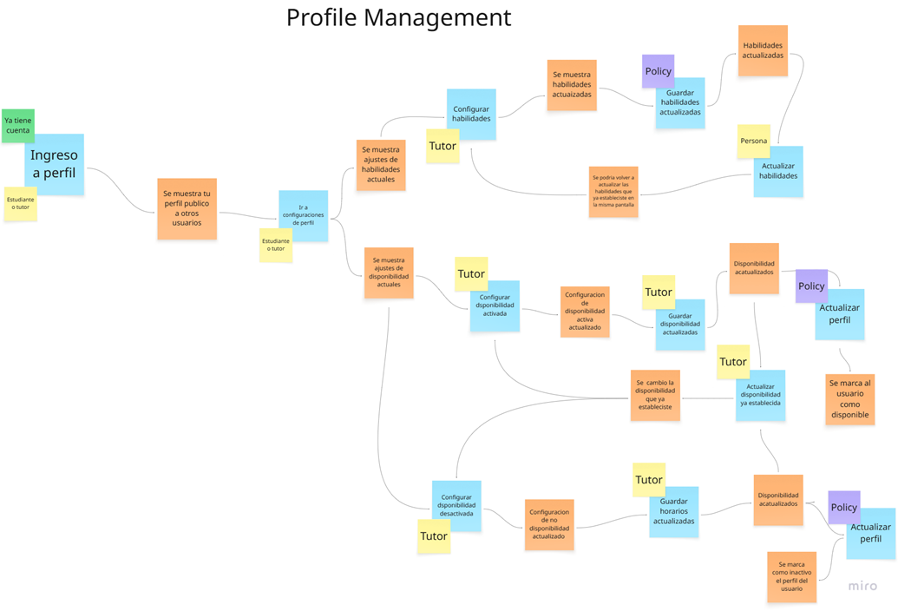
  <figcaption style="margin-top: 10px;">
    <em>Figura 29. En la imagen tenemos el flujo de búsqueda de tutores, donde se resalta la intervención del Estudiante como actor principal. La secuencia muestra la aplicación de filtros por curso, palabra clave y calificación, regidos por una política de carga de resultados que determina la visualización final del perfil detallado del tutor.</em>
  </figcaption>
</figure>

<figure style="text-align: center; margin-bottom: 40px;">
  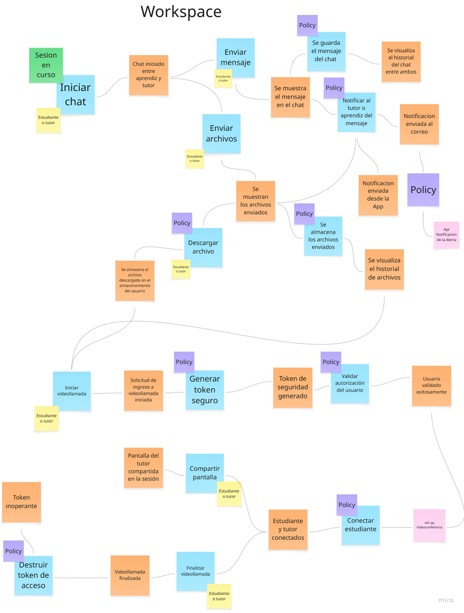
  <figcaption style="margin-top: 10px;">
    <em>Figura 30. Se observa el flujo detallado del espacio de trabajo colaborativo. La captura destaca la integración de políticas para el almacenamiento de archivos y la generación de tokens de seguridad para videollamadas. Asimismo, se evidencia el uso de una API de videoconferencia y una política de destrucción de tokens al finalizar la sesión para garantizar la seguridad.</em>
  </figcaption>
</figure>

<figure style="text-align: center; margin-bottom: 40px;">
  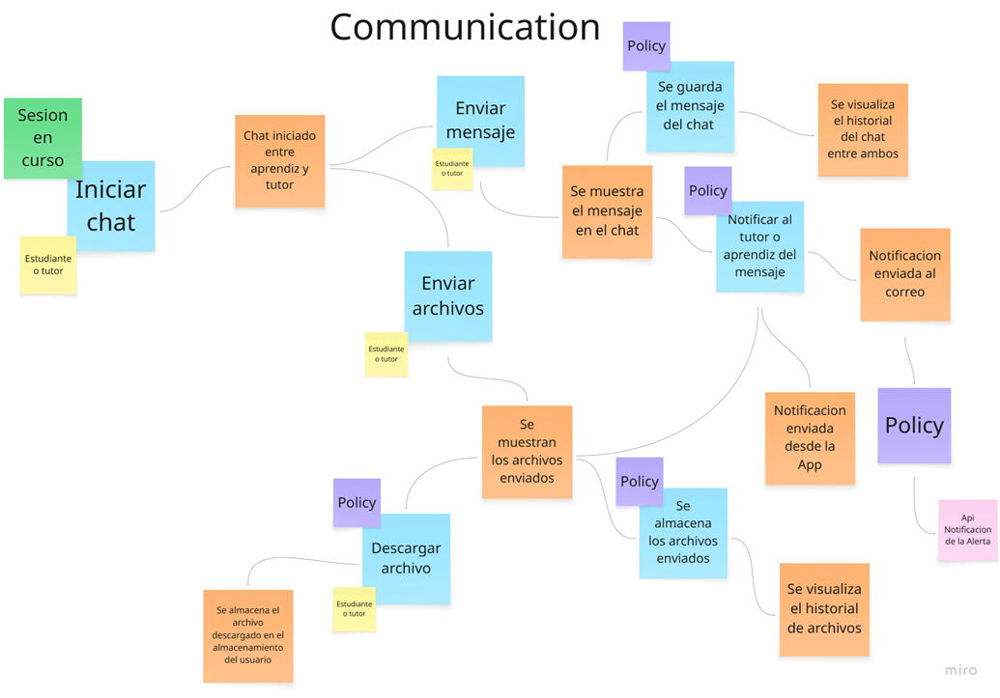
  <figcaption style="margin-top: 10px;">
    <em>Figura 31. En esta figura se presenta el ciclo de vida de los cuestionarios, gestionado por el Administrador/Profesor. Se detalla el proceso de registro de preguntas en el banco y la publicación de quices, seguido por la resolución del Estudiante y una política de evaluación automática que almacena puntajes y muestra resultados en tiempo real.</em>
  </figcaption>
</figure>

<figure style="text-align: center; margin-bottom: 40px;">
  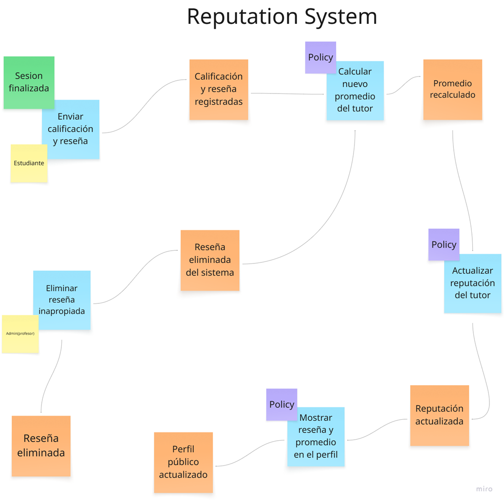
  <figcaption style="margin-top: 10px;">
    <em>Figura 32. En la imagen se evidencia la lógica detrás de la reputación del tutor. Se muestra cómo, tras el envío de una reseña por el Estudiante, se activa una política de recálculo del promedio. También se incluye el flujo de moderación, donde un Administrador puede eliminar reseñas inapropiadas, disparando una actualización del perfil público.</em>
  </figcaption>
</figure>

<figure style="text-align: center; margin-bottom: 40px;">
  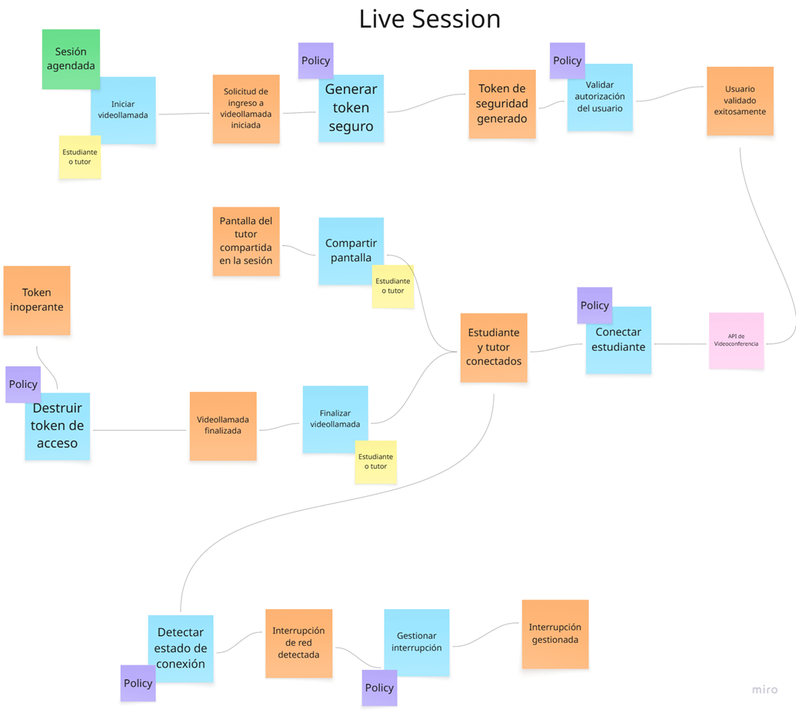
  <figcaption style="margin-top: 10px;">
    <em>Figura 33. Se observa el flujo financiero de la plataforma, detallando la interacción con pasarelas de pago externas. Se resalta la política de cálculo de comisión de la plataforma y el proceso de retiro de fondos solicitado por el Tutor, el cual es procesado mediante una API de transferencias bancarias para actualizar el saldo del monedero.</em>
  </figcaption>
</figure>

<figure style="text-align: center; margin-bottom: 40px;">
  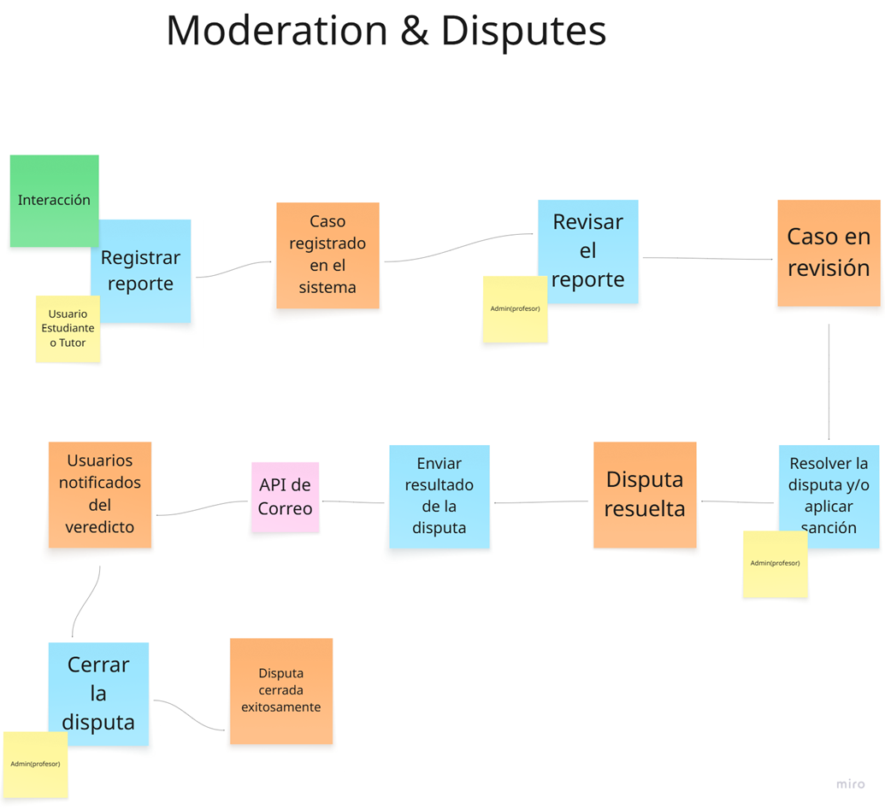
  <figcaption style="margin-top: 10px;">
    <em>Figura 34. En esta figura se detalla el proceso de resolución de conflictos. El flujo describe el registro de reportes por parte de los usuarios y la posterior revisión manual por un Administrador, quien decide el veredicto y aplica sanciones, notificando a los involucrados a través de una API de correo externa.</em>
  </figcaption>
</figure>

<p style="text-align: center;">
  <em>Big Picture EventStorming: Etapa 3 - Elaboración propia. Nota: Se identifican los Agregados (notas amarillas grandes) que protegen las reglas de negocio y se agrupan los eventos en sus respectivos Contextos Delimitados (Bounded Contexts).</em>
</p>
<br>

En conjunto, los flujos descritos evidencian una plataforma diseñada con un alto nivel de control, trazabilidad y seguridad en cada uno de sus procesos críticos. Se articula un sistema de resolución de conflictos que combina la participación activa de los usuarios con la supervisión administrativa, garantizando decisiones fundamentadas y comunicación efectiva mediante servicios externos.

De igual manera, el componente financiero demuestra una integración sólida con pasarelas de pago y APIs bancarias, incorporando políticas claras de comisiones y retiros que aseguran la correcta gestión del monedero digital. En paralelo, el sistema de reputación y evaluación refuerza la confianza dentro de la plataforma, mediante la validación, moderación y actualización dinámica de reseñas y calificaciones.

Asimismo, el ciclo de vida de los cuestionarios y el espacio de trabajo colaborativo consolidan la experiencia académica, integrando evaluaciones automatizadas, almacenamiento seguro de recursos y comunicación síncrona protegida por mecanismos como tokens temporales. Finalmente, los módulos de búsqueda de tutores y gestión de usuarios completan el ecosistema, ofreciendo un emparejamiento eficiente basado en filtros y una administración de identidad robusta mediante verificaciones institucionales. En conjunto, estos elementos configuran una solución integral, segura y orientada a la calidad del servicio y la confianza entre sus usuarios.


---

## 2.5. Ubiquitous Language


El Ubiquitous Language define un conjunto de términos clave utilizados dentro de Skillswap para asegurar una comunicación clara y consistente entre todos los miembros del equipo, tanto técnicos como de negocio. Este lenguaje compartido permite alinear la comprensión del sistema, facilitando el desarrollo, la documentación y la toma de decisiones a lo largo del proyecto.
<br>

| N° | Palabra técnica | Significado |
| :---: | :--- | :--- |
| 1 | **User** | Persona registrada en Innovify, que puede asumir el rol de Estudiante Aprendiz, Estudiante Tutor o Profesor Universitario, interactuando con la plataforma según su nivel de acceso institucional. |
| 2 | **Token** | Credencial de seguridad generada dinámicamente que autoriza la conexión peer-to-peer cifrada para la transmisión de audio y video en tiempo real durante una sesión activa. |
| 3 | **Transaction** | Identificador de pasarela de pagos que vincula el modelo de dominio interno (Donation) con el procesamiento financiero externo, asegurando la trazabilidad de los fondos. |
| 4 | **Session** | Espacio de tiempo programado en la plataforma donde un Aprendiz y un Tutor se conectan para repasar los temas de un curso específico. |
| 5 | **Dashboard** | Panel analítico que procesa los resultados de los quizzes y las sesiones. |
| 6 | **Assessment** | Evaluación estandarizada creada por un Profesor Universitario. |
| 7 | **Wallet** | Registro financiero interno del sistema donde se acumulan los fondos netos. |
| 8 | **Commission Fee** | Porcentaje (5%) deducido automáticamente por el sistema de cada donación voluntaria antes de sumar el monto final a la billetera. |
| 9 | **Dispute** | Reporte formal generado por un usuario ante inasistencias, mala conducta o enseñanza de información errónea durante una tutoría, el cual queda en estado pendiente hasta ser resuelto por un Profesor. |
| 10 | **Universidad Afiliada** | Institución educativa superior con una alianza con Innovify, cuyo dominio de correo (.edu.pe) sirve para validar y agrupar a los usuarios de su comunidad académica. |

*(Tabla 10. Ubiquitous Languages - Elaboración propia.)*

# Capítulo III: Requirements Specification

## 3.1. User Stories


### Epics

Las Epics representan agrupaciones de alto nivel que organizan las funcionalidades principales de Innovify. Cada épica reúne un conjunto de historias de usuario relacionadas, permitiendo estructurar el sistema en bloques funcionales y facilitar la planificación del desarrollo de manera clara y escalable. En la gestión ágil, mantener una jerarquía clara donde las Épicas grandes se desglosan en Historias de Usuario específicas es fundamental para organizar el flujo de trabajo del equipo de desarrollo
<br>

| Epic ID | Title | Description | Acceptance Criteria | Related to (Epic ID) |
| :---: | :--- | :--- | :--- | :--- |
| **EP01** | Account & Profile Management | As a user, I want to manage my account, authentication, and profile so that I can securely access and personalize my experience. | Not applicable | Not applicable |
| **EP02** | Search & Matching | As a learner, I want to search and filter tutors so that I can find the best match for my needs. | Not applicable | Not applicable |
| **EP03** | Session Coordination & Communication | As a user, I want to coordinate tutoring sessions and communicate with others so that I can prepare effectively. | Not applicable | Not applicable |
| **EP04** | Live Session Experience | As a user, I want to join and interact in live tutoring sessions so that I can learn in real time. | Not applicable | Not applicable |
| **EP05** | Academic Quality Assurance | As a professor or tutor, I want to create and manage quizzes so that learning quality is validated. | Not applicable | Not applicable |
| **EP06** | Ratings & Monetization | As a user, I want to rate tutors and handle payments so that value exchange is fair and transparent. | Not applicable | Not applicable |
| **EP07** | Analytics & Moderation | As a professor, I want dashboards and moderation tools so that I can ensure platform quality. | Not applicable | Not applicable |
| **EP08** | Backend API & Integrations | As a developer, I want to integrate external services and APIs so that the system is scalable and secure. | Not applicable | Not applicable |
| **EP09** | User Experience & Landing | As a visitor, I want an engaging and informative interface so that I understand the platform before registering. | Not applicable | Not applicable |

*(Tabla 11. Epics del proyecto - Elaboración propia.)*

---

### User Stories

Las Historias de Usuario describen de manera detallada las funcionalidades del sistema desde la perspectiva de los distintos actores de Innovify. Cada historia especifica el objetivo del usuario, sus criterios de aceptación y escenarios de uso, lo que permite validar el comportamiento esperado del sistema. Esto facilita una comprensión clara de los requerimientos y guía el desarrollo incremental del producto.
<br>

| Epic / Story ID | Título | Descripción | Criterios de Aceptación | Escenarios | Relacionado con (Epic ID) |
| :--- | :--- | :--- | :--- | :--- | :--- |
| **US01** | Validated registration with institutional email | As a user, I want to register on the platform using exclusively my institutional email (.edu.pe), to guarantee the security of the ecosystem and automate my validation. | • The form must require email and password.<br>• The system must reject commercial domains (e.g. @gmail.com).<br>• Upon successful registration, the system must send a confirmation link to the institutional email. | **Scenario 1 - Successful registration:**<br>• **Given** that I am on the registration page<br>• **When** I enter my .edu.pe email and password<br>• **Then** the system creates my account and sends a validation email.<br><br>**Scenario 2 - Invalid email:**<br>• **Given** that I attempt to register<br>• **When** I enter "juan@gmail.com"<br>• **Then** the system displays the error "Only Peruvian institutional emails are accepted." | Account and Profile Management |
| **US02** | Login with role-based access | As a user, I want to log in securely, to access the features corresponding to my role (Student or Professor). | • The system requires email and password.<br>• The system validates the entered credentials.<br>• After a successful login: the student accesses the tutoring search panel; the professor accesses their analytics dashboard.<br>• If the credentials are incorrect, an error message is displayed. | **Scenario 1 - Student access:**<br>• **Given** that I am a verified student<br>• **When** I log in<br>• **Then** I access the main panel.<br><br>**Scenario 2 - Professor access:**<br>• **Given** that I am a Professor<br>• **When** I log in<br>• **Then** I access the B2B analytics and Quizzes panel. | Account and Profile Management |
| **US03** | Profile configuration and areas of expertise | As a Tutor Student, I want to configure my profile by adding my biography, university and the courses I master, so that learners can find me easily. | • The profile must allow adding a photo, university and a description.<br>• There must be a Tags section to add the courses the tutor masters (e.g. Calculus I, Web Design). | **Scenario 1 - Profile update:**<br>• **Given** that I am on "My Profile" <br>• **When** I add "Web Programming" as a skill and save<br>• **Then** my profile is updated and I appear in searches for that course.<br><br>**Scenario 2 - Remove a skill:**<br>• **Given** that I have added the subject "Calculus I" to my profile<br>• **When** I click the delete icon next to that subject<br>• **Then** "Calculus I" disappears from my skills list. | Account and Profile Management |
| **US04** | Automatic institutional verification badge display | As a student, I want to see a "Verified" badge or icon on profiles to feel confident that the user belongs to a real university. | • The system must automatically grant and display the "Verified" badge on the user profile once they confirm the link sent to their institutional email (.edu.pe).<br>• The badge must be visibly located next to the user's name.<br>• If a user has not completed their institutional email validation, their profile cannot be public in the tutor search engine. | **Scenario 1 - View badge on a profile with validated email:**<br>• **Given** that I am viewing a tutor's public profile<br>• **When** I check their main information<br>• **Then** I see a clearly visible "Verified" icon next to their name.<br><br>**Scenario 2 - Profile hidden due to lack of verification (Negative):**<br>• **Given** that a newly registered user has not confirmed the token sent to their .edu.pe email<br>• **When** they attempt to publish their availability to give tutoring sessions<br>• **Then** the system denies the action indicating that they must verify their institutional account first. | Account and Profile Management |
| **US05** | Search results display | As a Learner Student, I want to use a keyword search engine to find tutors who master the specific topic I need help with. | • A visible search bar must exist on the main panel.<br>• Results must list tutors who have the search term in their skills (e.g. "Physics"). | **Scenario 1 - Successful search:**<br>• **Given** that I need help in Physics<br>• **When** I type "Physics" in the search bar<br>• **Then** I see a list of tutors from different universities who teach that course, showing their photo, name, university and average rating.<br><br>**Scenario 2 - No results found (Negative):**<br>• **Given** that I need help in a very specific subject<br>• **When** I type "Quantum Thermodynamics" in the search bar<br>• **Then** the system finds no tutors with that registered skill and displays the message "No tutors found for your search. Try different terms." | Search and Matching |
| **US06** | Apply filters to search results | As a Learner, I want to apply filters (such as star rating or university) to my search to find the tutor that best suits my preferences. | • The results view must have side filters.<br>• Allow filtering by "Minimum rating (e.g. 4 stars)" and "University". | **Scenario 1 - Apply filter:**<br>• **Given** that I have a list of 20 tutors<br>• **When** I apply the filter "Only tutors with 5 stars"<br>• **Then** the list narrows down showing only tutors with that perfect rating.<br><br>**Scenario 2 - Filter with no results (Negative):**<br>• **Given** that I have a list of available tutors for Physics<br>• **When** I apply the filter "Only tutors with 5 stars" and no tutor meets that rating<br>• **Then** the system displays the message "No tutors match the selected filters. Try adjusting your search." | Search and Matching |
| **US07** | View tutor public profile | As a Learner, I want to see a tutor's detailed profile before sending them a request, to review their biography, badges and comments from other students. | • Clicking on a tutor in the results must open their profile view.<br>• It must show the star average, biography and a section with the latest reviews received. | **Scenario 1 - View reviews:**<br>• **Given** that I found an interesting tutor<br>• **When** I enter their profile<br>• **Then** I can read comments from other students who have already received their classes.<br><br>**Scenario 2 - Tutor with no reviews (Negative):**<br>• **Given** that I find a tutor in the search results<br>• **When** I enter their profile<br>• **Then** the system shows that the tutor has no reviews yet and displays the message "This tutor has not received any ratings yet." | Search and Matching |
| **US08** | Send tutoring reservation request to tutor | As a Learner, I want to use the available chat with the tutor to coordinate a date and time, and send a tutoring request with the agreed topic. | • There must be an option within the chat to send a tutoring request.<br>• The request must include the agreed topic and the date/time defined in the conversation.<br>• The request remains in "Pending" status until the tutor confirms it.<br>• This feature uses the existing chat (does not create a new one). | **Scenario 1 - Send request:**<br>• **Given** that I am in an active conversation with the tutor<br>• **When** I coordinate a date, time and topic through the chat<br>• **Then** I send a tutoring request from the chat and it remains in "Pending" status.<br><br>**Scenario 2 - Tutor does not respond (Negative):**<br>• **Given** that I am in the chat with the tutor<br>• **When** I receive no response after some time<br>• **Then** I cannot finalize the coordination or send the tutoring request. | Coordination and Asynchronous Learning |
| **US09** | Accept or reject reservation request | As a Tutor Student, I want to receive incoming requests and have the option to accept or reject them to manage my time appropriately. | • The tutor must receive a notification on their panel.<br>• The request must show the learner message and have "Accept" and "Reject" buttons.<br>• Upon acceptance, the asynchronous chat room is automatically created. | **Scenario 1 - Accept request:**<br>• **Given** that I receive a tutoring request<br>• **When** I press "Accept"<br>• **Then** the status changes to "Scheduled" and the chat with the learner is enabled.<br><br>**Scenario 2 - Reject request (Negative):**<br>• **Given** that I receive a tutoring request<br>• **When** I press "Reject"<br>• **Then** the request status changes to "Rejected" and the learner receives a notification indicating their request was not accepted. | Coordination and Asynchronous Learning |
| **US10** | Asynchronous internal chat for the reservation | As a user (Learner/Tutor), I want to access a private internal chat once the tutoring session has been accepted (Scheduled) to coordinate details and share questions before and after the session without using my personal WhatsApp. | • Only reservations in "Scheduled" status must enable a workspace with chat.<br>• The chat must allow real-time communication between learner and tutor.<br>• The message history must be saved in the platform's database. | **Scenario 1 - Chat access after acceptance:**<br>• **Given** that my tutoring session has been accepted and is in "Scheduled" status<br>• **When** I enter the workspace<br>• **Then** I can access the internal chat with the tutor.<br><br>**Scenario 2 - Send messages:**<br>• **Given** that I am inside a scheduled tutoring session<br>• **When** I write a message in the chat<br>• **Then** the tutor receives it and it is recorded in the history. | Coordination and Asynchronous Learning |
| **US11** | Share files (PDFs and Images) in the chat | As a user, I want to be able to attach files in the reservation chat to send my solved exercises or study material that we will review in the video call. | • The chat must include an attach button (clip icon).<br>• It must support JPG, PNG and PDF formats (5MB limit).<br>• Once sent, the file must be downloadable by the other user. | **Scenario 1 - Send study PDF:**<br>• **Given** that I am coordinating in the asynchronous chat<br>• **When** I upload a PDF with my calculus exercises<br>• **Then** the tutor can download it to prepare before the class.<br><br>**Scenario 2 - Unsupported format (Negative):**<br>• **Given** that I attempt to send a file in the chat<br>• **When** I upload a video in MP4 format<br>• **Then** the system rejects the file and displays the message "Format not allowed. Only JPG, PNG and PDF files are accepted." | Coordination and Asynchronous Learning |
| **US12** | Join integrated video call | As a user, I want to join the video call embedded in the platform at the scheduled time to start the class without depending on external Zoom or Meet links. | • A "Start Video Call" button must exist that is enabled at the reservation time.<br>• The video interface must load within the same web domain.<br>• It must include controls: microphone, camera and Finish. | **Scenario 1 - Join the session:**<br>• **Given** that it is the time of my tutoring session<br>• **When** I press "Start Video Call"<br>• **Then** the virtual room opens in my browser connecting me with the tutor.<br><br>**Scenario 2 - Connection failure (Negative):**<br>• **Given** that it is the time of my tutoring session<br>• **When** I press "Start Video Call" but my internet connection is unstable<br>• **Then** the system displays the message "Connection could not be established. Check your network and try again." | Synchronous Execution |
| **US13** | Share screen during the session | As a user, I want to be able to share my computer screen using the video call tools, to show code or exercises in real time to my partner. | • The video call interface must include a "Share Screen" button.<br>• The browser must request native capture permissions.<br>• The shared video replaces or overlaps the camera feed. | **Scenario 1 - Share code:**<br>• **Given** that I am in the active video call<br>• **When** I press "Share Screen"<br>• **Then** my partner can see the code editor I have open on my desktop.<br><br>**Scenario 2 - No permissions granted (Negative):**<br>• **Given** that I am in the active video call<br>• **When** I press "Share Screen" but the browser does not have capture permissions enabled<br>• **Then** the system displays the message "Screen sharing permissions were not granted. Enable them in your browser settings." | Synchronous Execution |
| **US14** | Create official Quiz in the Question Bank | As a University Professor, I want to create a multiple-choice Quiz and save it in the Official Bank, to standardize the material tutors use to evaluate students. | • The teacher panel must have an interactive form to add questions, options and mark the correct answer.<br>• Upon saving, the Quiz must be published in the Official Bank tagged by course (e.g. Physics I). | **Scenario 1 - Save Quiz:**<br>• **Given** that I am a Professor<br>• **When** I create 3 questions about kinematics and press "Publish"<br>• **Then** the Quiz becomes available on the platform for all tutors of that subject.<br><br>**Scenario 2 - Incomplete Quiz (Negative):**<br>• **Given** that I am a Professor attempting to publish a Quiz<br>• **When** I try to save it without having completed all questions with their correct answers<br>• **Then** the system displays the message "Complete all questions before publishing the Quiz." | Academic Quality Assurance |
| **US15** | Select and send official Quiz to the learner | As a Tutor Student, I want to select a Quiz from the Official Bank and send it to my learner through the chat to evaluate their learning at the end of the session. | • During or after the video call, the chat must show an "Assign Quiz" button.<br>• The tutor selects a Quiz from the official list of their course and it is sent as an interactive card in the learner's chat. | **Scenario 1 - Send evaluation:**<br>• **Given** that I am finishing my Physics class<br>• **When** I select the official Kinematics Quiz and send it<br>• **Then** my learner receives it on their screen ready to be solved.<br><br>**Scenario 2 - No quizzes available (Negative):**<br>• **Given** that I am finishing my class<br>• **When** I attempt to assign a Quiz but none exists for the course I taught<br>• **Then** the system displays the message "No quizzes available for this subject. Contact your professor." | Academic Quality Assurance |
| **US16** | Solve interactive validation Quiz | As a Learner Student, I want to answer the interactive Quiz sent by the tutor to validate my knowledge and automatically obtain my grade. | • Clicking on the Quiz in the chat must open a modal with the questions.<br>• The system evaluates the submitted answers instantly.<br>• The result (e.g. 4/5 correct) is saved in the database and displayed in the chat. | **Scenario 1 - Answer successfully:**<br>• **Given** that I received a Quiz<br>• **When** I select the options and press "Submit"<br>• **Then** the system grades my answers and shows me that I obtained a perfect score.<br><br>**Scenario 2 - Incomplete submission (Negative):**<br>• **Given** that I received a Quiz<br>• **When** I attempt to submit it without having answered all questions<br>• **Then** the system does not allow submission and displays the message "You must answer all questions before submitting." | Academic Quality Assurance |
| **US17** | Rate and leave a review for the tutor | As a Learner, I want to rate the tutor from 1 to 5 stars and leave a comment at the end of the session to value their help and build their public reputation. | • The rating form is enabled only after the video call has ended.<br>• It allows marking from 1 to 5 stars and adding a text.<br>• The tutor's star average is updated immediately on their profile. | **Scenario 1 - Leave a review:**<br>• **Given** that my session has ended<br>• **When** I mark 5 stars and write "Excellent explanation"<br>• **Then** the review appears on the tutor's public profile.<br><br>**Scenario 2 - Submit without rating (Negative):**<br>• **Given** that my session has ended<br>• **When** I attempt to leave a review without having selected any stars<br>• **Then** the system does not allow submitting the form and displays the message "You must select at least one star to rate the tutor." | Rating and Monetization |
| **US18** | Make a voluntary monetary donation | As a Learner, I want to make a voluntary donation using my card through a secure payment gateway to economically reward the tutor. | • Next to the rating, the option "Make Donation" must appear.<br>• Integration with a payment gateway (e.g. Stripe) requesting card data and amount.<br>• Upon success, the system processes the payment. | **Scenario 1 - Successful donation:**<br>• **Given** that I wish to reward my tutor<br>• **When** I enter my card, select to donate S/ 15.00 and confirm<br>• **Then** the payment is processed and the tutor is notified of the income.<br><br>**Scenario 2 - Insufficient funds (Negative):**<br>• **Given** that I wish to make a donation to my tutor<br>• **When** I enter my card details but it does not have sufficient funds<br>• **Then** the system displays the message "Payment rejected. Check your card balance and try again." | Rating and Monetization |
| **US19** | View Virtual Wallet and balance | As a Tutor Student, I want to view my Virtual Wallet to see the total balance of my accumulated donations, viewing the automatic deduction for the platform commission. | • The tutor panel must have a "Wallet" tab.<br>• It must show the total balance available to withdraw.<br>• It must show the donation history detailing: Original Amount, -5% Skillswap commission, Net Amount. | **Scenario 1 - Check income:**<br>• **Given** that I received a donation notification<br>• **When** I enter my Wallet<br>• **Then** I see that I was donated S/ 10.00, the commission was S/ 0.50 and my net balance increased by S/ 9.50.<br><br>**Scenario 2 - No donations yet (Negative):**<br>• **Given** that I enter my Virtual Wallet<br>• **When** I have not received any donations yet<br>• **Then** the system shows a balance of S/ 0.00 and the message "You have not received any donations yet. Complete tutoring sessions to start accumulating balance." | Rating and Monetization |
| **US20** | Register bank account for fund withdrawal | As a Tutor Student, I want to securely register my external bank account (CCI) to request the withdrawal of money earned from my tutoring sessions. | • In the Wallet, there must be a "Configure Bank Account" option.<br>• It allows entering Bank, Account Number and CCI.<br>• Bank details must be stored encrypted in the database for security. | **Scenario 1 - Save CCI:**<br>• **Given** that I have S/ 50.00 in my balance<br>• **When** I enter my BCP CCI and save the changes<br>• **Then** I can enable the "Request Withdrawal" button.<br><br>**Scenario 2 - Invalid CCI format (Negative):**<br>• **Given** that I attempt to register my bank account<br>• **When** I enter a CCI with an incorrect format<br>• **Then** the system rejects the registration and displays the message "The entered CCI is not valid. Please verify the number and try again." | Rating and Monetization |
| **US21** | Cancel pending or scheduled reservation | As a Learner, I want to cancel a reservation request before it starts in case of an emergency, freeing up the tutor's schedule. | • "Pending" or "Scheduled" reservations must have a "Cancel Reservation" button.<br>• If cancelled, the time slot becomes available again in the tutor's calendar and they receive a notification. | **Scenario 1 - Cancel on time:**<br>• **Given** that a medical emergency came up<br>• **When** I cancel the tutoring session I had scheduled for tomorrow<br>• **Then** the status changes to "Cancelled" and the tutor is notified so they do not wait for me.<br><br>**Scenario 2 - Cannot cancel active session (Negative):**<br>• **Given** that I attempt to cancel a tutoring session<br>• **When** the session has already started and is in progress<br>• **Then** the system does not allow cancellation and displays the message "You cannot cancel a tutoring session that has already started." | Rating and Monetization |
| **US22** | View layout of the teacher management panel | As a University Professor, I want to see an organized main panel upon logging in to the platform, to easily navigate between the Quiz Bank and analytics. | • The view must have a side menu with the main options.<br>• It must have quick access shortcuts (Quick Actions) to create quizzes and view pending report notifications. | **Scenario 1 - Clear navigation:**<br>• **Given** that I log in as a professor<br>• **When** I review my main screen<br>• **Then** I quickly see on the left the button to access my faculty's analytics.<br><br>**Scenario 2 - No data available yet (Negative):**<br>• **Given** that I log in as a professor<br>• **When** I attempt to access the analytics panel but no data has been recorded yet<br>• **Then** the system displays the message "No information available yet. Data will appear once tutoring sessions are completed on the platform." | Dashboard and Moderation |
| **US23** | View Academic Metrics | As a University Professor, I want to view the dashboard with charts about the most requested tutoring courses, identifying early deficiencies among students. | • The Dashboard must render a chart (bar or pie) with the Top courses.<br>• Data must be dynamic based on the number of completed reservations on the platform. | **Scenario 1 - Identify at-risk course:**<br>• **Given** that I enter my Dashboard<br>• **When** I observe the chart for this month<br>• **Then** I discover that "Calculus II" has 50 reservations, indicating I should reinforce that topic in my in-person classes.<br><br>**Scenario 2 - No data for selected period (Negative):**<br>• **Given** that I enter my Dashboard as a professor<br>• **When** no completed reservations exist for the selected period<br>• **Then** the chart appears empty and the system displays the message "Not enough data to generate statistics for this period." | Dashboard and Moderation | | **US24** | Report user for misconduct | As a user (Learner/Tutor), I want to be able to report my counterpart in case of absenteeism or inappropriate content, to maintain the integrity of the platform. | • In the session history, there must be a "Report Problem" button.<br>• It opens a form requesting the category (Did not show up, Harassment, Fraud) and a written detail.<br>• It generates a ticket (dispute) in "Pending" status for professor/moderator review. | **Scenario 1 - Report absence:**<br>• **Given** that I waited 20 minutes in the video call and the learner did not arrive<br>• **When** I press "Report" and detail what happened<br>• **Then** the system sends the case to the moderation panel.<br><br>**Scenario 2 - Incomplete report (Negative):**<br>• **Given** that I attempt to report a user<br>• **When** I submit the report form without having selected a category or written a detail<br>• **Then** the system does not allow submission and displays the message "You must select a category and describe the problem before submitting the report." | Dashboard and Moderation |
| **US24** | Report user for misconduct | As a user (Learner/Tutor), I want to be able to report my counterpart in case of absenteeism or inappropriate content, to maintain the integrity of the platform. | • In the session history, there must be a "Report Problem" button.<br>• It opens a form requesting the category (Did not show up, Harassment, Fraud) and a written detail.<br>• It generates a ticket (dispute) in "Pending" status for professor/moderator review. | **Scenario 1 - Report absence:**<br>• **Given** that I waited 20 minutes in the video call and the learner did not arrive<br>• **When** I press "Report" and detail what happened<br>• **Then** the system sends the case to the moderation panel.<br><br>**Scenario 2 - Incomplete report (Negative):**<br>• **Given** that I attempt to report a user<br>• **When** I submit the report form without having selected a category or written a detail<br>• **Then** the system does not allow submission and displays the message "You must select a category and describe the problem before submitting the report." | Dashboard and Moderation |
| **US25** | Review and resolve academic disputes | As a University Professor, I want to review academic reports and disputes (e.g. teaching a concept incorrectly) to issue a verdict and ensure the quality of the ecosystem. | • The teacher panel must have a "Pending Disputes" module.<br>• The professor can review the asynchronous chat of the reported case.<br>• The professor can mark the case as "Dismissed" or "Warning Applied" to the offender. | **Scenario 1 - Sanction tutor:**<br>• **Given** that I review a dispute about "Incorrect Information" taught in a Physics tutoring session<br>• **When** I verify the chat and see that the tutor used false formulas<br>• **Then** I apply a warning on the tutor's profile and close the ticket.<br><br>**Scenario 2 - Insufficient evidence (Negative):**<br>• **Given** that I review a dispute as a professor<br>• **When** I analyze the chat history and find no sufficient evidence of misconduct<br>• **Then** I mark the case as "Dismissed" and the system notifies both parties that the dispute was closed without sanctions. | Dashboard and Moderation |
| **US26** | Institutional domain validation and token sending | As a Developer, I want to implement an endpoint in Java con Spring Boot that automatically validates the .edu.pe domain using regular expressions and sends a JWT confirmation token by email (via API such as SendGrid) to secure the registration. | • The endpoint must be a POST to /api/auth/register.<br>• It must validate with a regex that the email ends in .edu.pe.<br>• If it fails, it returns HTTP code 400.<br>• If successful, it generates a JSON Web Token (JWT) with 24h expiration and triggers the email API. | **Scenario 1 - Valid request (200 OK):**<br>• **Given** a POST request with payload {"email": "juan@upc.edu.pe"}<br>• **When** the endpoint processes the request<br>• **Then** it creates the user, sends the email and returns a "201 Created".<br><br>**Scenario 2 - Rejected domain (400 Bad Request):**<br>• **Given** a request with email luis@gmail.com<br>• **When** the system validates the regex<br>• **Then** it returns "400 Bad Request" with the validation error message. | Backend RESTful API & Security |
| **US27** | Payment Gateway API Integration | As a Developer, I want to integrate a payment gateway API (e.g. Stripe) to process card donations and calculate the 5% platform commission retention in the backend. | • The backend must build an encrypted request toward the payment API.<br>• Upon receiving confirmation from the gateway, the backend calculates 5% and 95%.<br>• The transaction must be recorded in the local database and the tutor's net balance updated in the corresponding table. | **Scenario 1 - Approved transaction:**<br>• **Given** a donation request of S/ 20.00<br>• **When** the external API responds with status "succeeded"<br>• **Then** the backend saves S/ 1.00 for the platform and S/ 19.00 in the tutor's wallet.<br><br>**Scenario 2 - Insufficient funds:**<br>• **Given** a payment request<br>• **When** the external API returns the code "insufficient_funds"<br>• **Then** the backend handles the exception and returns an HTTP 402 to the frontend. | Backend RESTful API & Integrations |
| **US28** | Token generation for WebRTC | As a Developer, I want to consume the WebRTC API (e.g. Agora.io) generating temporary access tokens from the backend to securely embed the video call in the user's frontend. | • Endpoint GET /api/sessions/{id}/token protected by JWT.<br>• The backend validates in the database that the requesting user belongs to that reservation and that the time is correct.<br>• Returns a JSON response with the appId, channel and temporary token. | **Scenario 1 - Successful generation:**<br>• **Given** a request at the exact time of the reservation<br>• **When** the backend verifies the permissions<br>• **Then** it returns a JSON with the WebRTC credentials to start the video.<br><br>**Scenario 2 - Access outside schedule:**<br>• **Given** a GET request at 8:00 AM for a reservation at 10:00 AM<br>• **When** the backend verifies the time<br>• **Then** it returns an HTTP 403 Forbidden. | Backend RESTful API & Integrations |
| **US29** | Cloud Storage API integration for chat | As a Developer, I want to integrate a Cloud Storage API (e.g. AWS S3 or Cloudinary) to securely manage the upload of PDFs and images that users share in the asynchronous chat. | • Endpoint POST /api/chat/upload that accepts multipart/form-data.<br>• The backend must validate that the maximum size does not exceed 5MB and that the extension is permitted (.pdf, .png, .jpg).<br>• After a successful upload to the cloud, the database saves the public URL to display it in the chat. | **Scenario 1 - Successful upload:**<br>• **Given** a 2MB PDF file in the request<br>• **When** it is transferred to Cloudinary<br>• **Then** the service responds with the secure URL and the backend returns an HTTP 200 with the link.<br><br>**Scenario 2 - File too large:**<br>• **Given** a 15MB file<br>• **When** the endpoint validates the size in the headers<br>• **Then** it stops the process and returns an HTTP 413 Payload Too Large. | Backend RESTful API & Integrations |
| **US30** | Aggregation endpoint for Academic Dashboard | As a Developer, I want to create a RESTful endpoint that executes an aggregation and count query in the database to return an optimized JSON with the top requested courses, feeding the B2B Dashboard. | • Endpoint GET /api/analytics/top-courses exclusive to users with Professor role.<br>• The service must execute a SQL/LINQ query grouping by course_id and counting reservations in "Completed" status.<br>• The response must be formatted as a JSON array compatible with charting libraries (e.g. Chart.js). | **Scenario 1 - Obtain statistical data:**<br>• **Given** a GET request with a professor's token<br>• **When** the backend executes the aggregation in the database<br>• **Then** it returns an HTTP 200 with a JSON structured as [{"course": "Physics", "total": 45}].<br><br>**Scenario 2 - Unauthorized access:**<br>• **Given** a GET request with a student's token<br>• **When** the middleware validates the roles<br>• **Then** it intercepts the request and returns an HTTP 401 Unauthorized. | Backend RESTful API & Analytics |
| **US31** | Platform home screen | As a user, I want the benefits of the platform to be the first screen displayed so I can learn more about its features and details before registering. | • A horizontal top navigation menu must show the platform logo on the left and Information, Log In and Sign Up on the right.<br>• Clicking on the logo returns the system to its initial state.<br>• Scrolling down shows platform features, mission, vision and footer. | **Scenario 1 - View platform information:**<br>• **Given** that I am a user visiting the page for the first time<br>• **When** I land on the first screen<br>• **Then** I can see the platform benefits along with the team and company information.<br><br>**Scenario 2 - Images not loading (Negative):**<br>• **Given** that I am a user visiting the landing page<br>• **When** the connection is slow and background images do not load correctly<br>• **Then** the system shows a solid color background. | User Experience and Personalization |
| **US32** | View the About Us screen | As a user, I want to see detailed platform information in the "About Us" section to build trust and understand the company purpose before registering. | • The page must show a main section titled "About Us" with mission, vision and "The Team".<br>• Visual blocks for Vision and Mission must be side by side. | **Scenario 1 - User consults company information:**<br>• **Given** that a visitor is on the main page<br>• **When** they click on the "About Us" section<br>• **Then** the system shows the page containing the Skillswap description, Vision/Mission blocks, and "The Team".<br><br>**Scenario 2 - User decides to join:**<br>• **Given** that the student has read the information and feels motivated<br>• **When** they click "Sign Up"<br>• **Then** the system redirects them to the registration page. | User Experience and Personalization |
| **US33** | Animations and micro-interactions | As a student, I want the interface to have subtle animations and micro-interactions, such as a button that changes color when hovering, so the experience feels more polished and responsive. | • Main buttons must change color on hover.<br>• Favorite icons must change color when clicked.<br>• Tutor cards must slightly increase in size on hover. | **Scenario 1 - Interact with tutor profiles:**<br>• **Given** that I am searching for a tutoring request<br>• **When** I hover over the tutor card<br>• **Then** it slightly increases in size.<br><br>**Scenario 2 - Color change on buttons:**<br>• **Given** that I am in a video call<br>• **When** I hover over the call buttons<br>• **Then** they slightly change color. | User Experience and Personalization |
| **US34** | Calendar configuration and availability status | As a Tutor Student, I want to configure my schedule in an interactive calendar and manage my general status (Available/Not Available) to receive reservation requests only when I can actually teach. | • Weekly calendar for selecting time blocks.<br>• Global status toggle switch.<br>• If "Not Available", the profile is hidden from searches. | **Scenario 1 - Set time blocks:**<br>• **Given** that I am in the "My Availability" section<br>• **When** I select specific times and save<br>• **Then** learners can only send requests within those slots.<br><br>**Scenario 2 - Pause profile:**<br>• **Given** that I am in final exam week<br>• **When** I set status to "Not Available"<br>• **Then** my profile stops appearing in searches. | Account and Profile Management |
| **US35** | Language change (Spanish / English) on the Landing Page | As a website visitor, I want to be able to change the interface language between Spanish and English using a selector, to understand Innovify's value proposition in my preferred language. | • Visible ES / EN selector in the navigation bar.<br>• Dynamic update without reloading.<br>• Language preference saved in Local Storage. | **Scenario 1 - Dynamic change to English:**<br>• **Given** that I am viewing the Landing Page in Spanish<br>• **When** I choose "EN"<br>• **Then** all texts are instantly translated.<br><br>**Scenario 2 - Configuration persistence:**<br>• **Given** that I previously selected English<br>• **When** I reload the page<br>• **Then** it remains in English. | User Experience and Personalization |
| **US36** | View Alliances section | As a user, I want to see the "Alliances" section with affiliated universities and a contact form, to verify institutional backing. | • Show logos of partner universities.<br>• Include a contact form.<br>• Show success message after submission. | **Scenario 1 - Validate backing:**<br>• **Given** that I explore the page<br>• **When** I scroll to Alliances<br>• **Then** I see partner logos.<br><br>**Scenario 2 - Successful contact:**<br>• **Given** I fill the form<br>• **When** I send it<br>• **Then** I see confirmation message. | User Experience and Personalization |
| **US37** | View About Us section and Technological Projection | As a user, I want to read mission, vision and future projections to trust the platform. | • Must include Mission and Vision.<br>• Include "Innovation and Quality" section.<br>• Show team members. | **Scenario 1 - Learn vision:**<br>• **Given** that I read the section<br>• **When** I review innovation<br>• **Then** I understand future plans.<br><br>**Scenario 2 - View team:**<br>• **Given** that I scroll down<br>• **When** I check team section<br>• **Then** I see members. | User Experience and Personalization |
| **US38** | View Solutions and Features section | As a user, I want to see platform features to understand its value. | • Show system pillars.<br>• Include mockups. | **Scenario 1 - Explore features:**<br>• **Given** that I navigate<br>• **When** I see features<br>• **Then** I understand value.<br><br>**Scenario 2 - Mockup error:**<br>• **Given** that image fails to load<br>• **When** it loads incorrectly<br>• **Then** show fallback message. | User Experience and Personalization |
| **US39** | Password recovery | As a registered user, I want to recover my password via email. | • Include "Forgot password" link.<br>• Send recovery email.<br>• Token expires in 30 minutes. | **Scenario 1 - Successful recovery:**<br>• **Given** that I forgot password<br>• **When** I request recovery<br>• **Then** I receive email.<br><br>**Scenario 2 - Email not registered:**<br>• **Given** that email does not exist<br>• **When** I submit<br>• **Then** system shows generic message. | Account and Profile Management |
| **US40**     | Visualizar propuesta de valor en la Landing Page              | Como visitante del sitio web estático, quiero ver claramente el propósito y beneficios de SkillSwap en la página de inicio, para entender si la plataforma resuelve mi necesidad académica. | • La Landing Page debe mostrar un hero section visible al cargar la página.<br>• El hero section debe incluir un título principal, una breve descripción y un call-to-action (CTA).<br>• El contenido debe comunicar claramente la propuesta de valor de SkillSwap.                | **Scenario 1 - Visualización del hero section:**<br>• **Given** que soy un visitante que accede a la Landing Page<br>• **When** cargo la página de inicio<br>• **Then** veo un hero section con el título, descripción y call-to-action principales.       | User Experience and Personalization             |
| **US41**     | Conocer las funcionalidades principales desde la Landing Page | Como visitante del sitio web estático, quiero ver una sección que describa las funcionalidades clave de la plataforma, para evaluar si SkillSwap cubre mis necesidades como estudiante.     | • La Landing Page debe incluir una sección dedicada a las funcionalidades principales.<br>• Cada funcionalidad debe mostrarse con un ícono representativo y una descripción breve.<br>• La sección debe ser accesible mediante desplazamiento desde la página principal.           | **Scenario 1 - Visualización de funcionalidades:**<br>• **Given** que soy un visitante en la Landing Page<br>• **When** hago scroll hacia abajo<br>• **Then** veo una sección de features con íconos y descripciones de las funcionalidades principales.   | User Experience and Personalization             |
| **US42**     | Acceder al registro desde la Landing Page                     | Como visitante del sitio web estático, quiero encontrar fácilmente un botón o enlace para registrarme en la plataforma, para comenzar a usar SkillSwap sin tener que buscarlo.              | • Debe existir al menos un CTA visible para el registro en la Landing Page.<br>• El CTA debe estar ubicado en el hero section o en la barra de navegación.<br>• Al seleccionar el CTA, el usuario debe ser redirigido al formulario de registro.                                   | **Scenario 1 - Redirección al registro:**<br>• **Given** que soy un visitante interesado en registrarme<br>• **When** veo el hero section o el navbar<br>• **Then** encuentro un CTA visible que me redirige al formulario de registro.                    | User Experience and Personalization             |
| **US43**     | Ver testimonios de usuarios en la Landing Page                | Como visitante del sitio web estático, quiero leer testimonios de estudiantes que ya usaron SkillSwap, para tomar una decisión informada antes de registrarme.                              | • La Landing Page debe incluir una sección de testimonios.<br>• Deben mostrarse al menos dos testimonios de usuarios.<br>• Cada testimonio debe incluir nombre, universidad y comentario del usuario.                                                                              | **Scenario 1 - Visualización de testimonios:**<br>• **Given** que soy un visitante en la Landing Page<br>• **When** hago scroll hacia la sección de testimonios<br>• **Then** veo al menos 2 testimonios con nombre, universidad y comentario del usuario. | User Experience and Personalization             |
| **US44**     | Contactar al equipo desde la Landing Page                     | Como visitante del sitio web estático, quiero encontrar información de contacto o un formulario de consulta, para resolver dudas antes de registrarme.                                      | • La Landing Page debe incluir una sección de contacto o información de soporte.<br>• Debe mostrarse un formulario de consulta o una dirección de correo electrónico de contacto.<br>• La información de contacto debe estar disponible desde el footer o sección correspondiente. | **Scenario 1 - Acceso a información de contacto:**<br>• **Given** que soy un visitante con dudas<br>• **When** llego al footer o sección de contacto<br>• **Then** encuentro un formulario o correo de contacto disponible.                                | User Experience and Personalization          |


*(Tabla 12.  User Stories del proyecto - Elaboración propia.)*
<br>


En resumen, estas son las 39 User Stories que definen el ciclo de vida completo de Innovify.

Este conjunto de requerimientos estructura un ecosistema robusto que abarca desde la seguridad con validación institucional (.edu.pe) y gestión de roles, hasta la ejecución técnica de videollamadas integradas y un sistema de monetización transparente mediante donaciones. Con este backlog, el proyecto queda cubierto en sus tres frentes principales: la experiencia del estudiante (Learner/Tutor), la supervisión de calidad por parte de los docentes y la infraestructura técnica del backend.

---


## 3.1. Impact Mapping

En esta sección se expone el Impact Mapping del proyecto, una técnica que conecta los objetivos de negocio con las funcionalidades a desarrollar. El proceso inició con la definición de los Business Goals bajo criterios SMART, seguido de la identificación de los Actores (User Personas) que influyen en su cumplimiento. Para cada actor se establecieron los Impacts esperados en su comportamiento y, a partir de ellos, se listaron los Deliverables que podrían generarlos. Finalmente, cada deliverable se vinculó con User Stories concretas que lo hacen tangible.

<p align="center">
  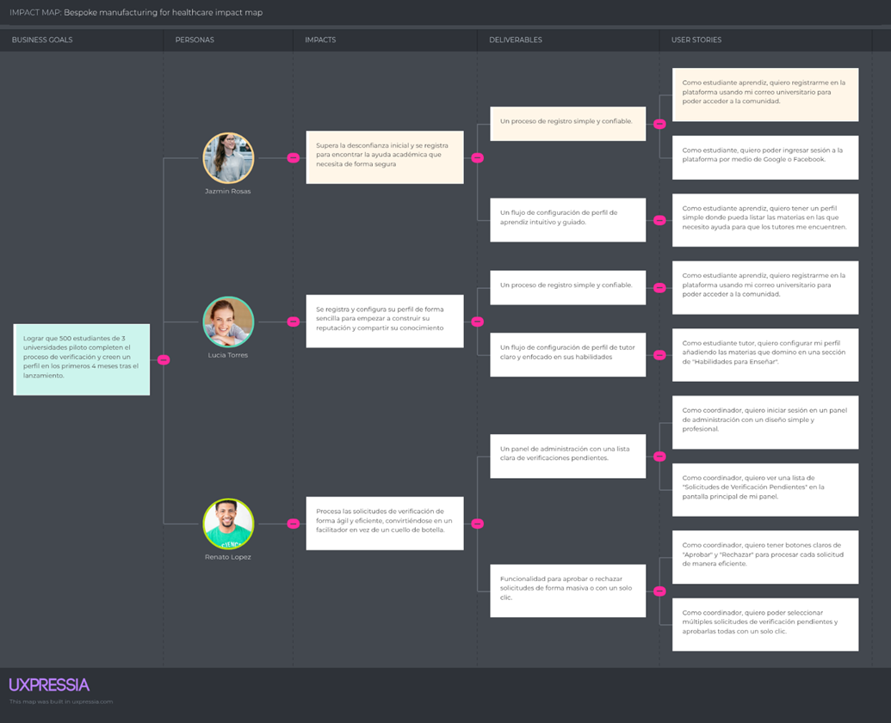
  <br>
  <em>Figura 35. Impact Mapping - Elaboración propia. Nota: Este mapa visualiza cómo alcanzar el objetivo inicial (registrar 300 estudiantes), conectando los perfiles (Personas) con cambios de comportamiento (Impacts) y funcionalidades (Deliverables).</em>
</p>
En esta figura se observa el Impact Map enfocado en el objetivo de lograr que 500 estudiantes de 3 universidades piloto completen su perfil en los primeros 4 meses. El diagrama vincula a los actores clave (Jazmín, Lucía y Renato) con los impactos esperados, tales como superar la desconfianza inicial y agilizar la verificación de datos. Asimismo, se detallan los entregables técnicos y las historias de usuario necesarias para garantizar un proceso de registro simple y confiable.

<br>

<p align="center">
  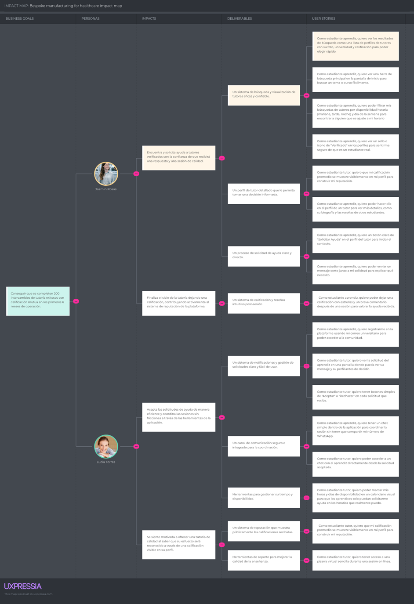
  <br>
  <em>Figura 36. Impact Mapping - Elaboración propia. Nota: Este mapa se enfoca en lograr 200 tutorías exitosas con alta calificación, detallando cómo la búsqueda, comunicación y calificación aseguran un ciclo de alta calidad.</em>
</p>
En la imagen tenemos la planificación estratégica para alcanzar 200 intercambios de tutoría exitosos en el primer semestre de operación. El mapa destaca la importancia de que el aprendiz encuentre tutores verificados y que el tutor se sienta motivado mediante un sistema de reputación. Se identifican entregables críticos como el motor de búsqueda con filtros avanzados, el canal de comunicación integrado y las herramientas de gestión de tiempo para asegurar una coordinación sin fricciones.
<br>
<p align="center">
  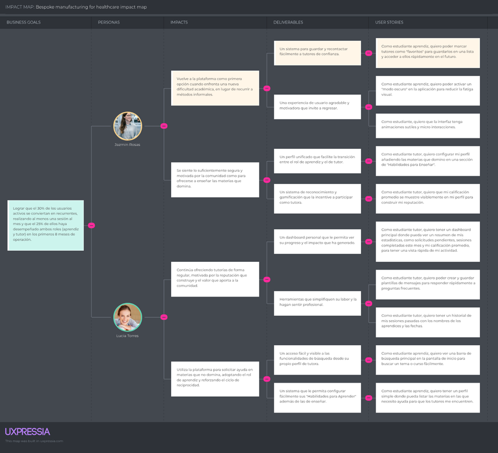
  <br>
  <em>Figura 37. Impact Mapping - Elaboración propia. Nota: Esta figura muestra el mapa centrado en la retención y participación activa, explicando cómo funcionalidades como el dashboard y el reconocimiento buscan que los usuarios regresen.</em>
</p>
Se observa el mapa de impacto orientado a la fidelización de usuarios, con la meta de que el 30% de los usuarios activos sean recurrentes y el 25% desempeñe roles híbridos (aprendiz y tutor). La figura ilustra cómo funcionalidades de experiencia de usuario (como el modo oscuro o micro-interacciones) y sistemas de gamificación incentivan la participación continua, permitiendo una transición fluida entre los perfiles de enseñanza y aprendizaje para reforzar el ciclo de reciprocidad.
<br><br>

**En resumen**, los tres mapas de impacto muestran una estrategia integral centrada en la construcción de una plataforma educativa confiable, eficiente y sostenible. En una primera etapa, se prioriza la incorporación y validación de usuarios mediante procesos de registro simples y seguros, fortaleciendo la confianza desde el inicio. Luego, se impulsa la interacción efectiva entre estudiantes y tutores a través de herramientas que facilitan la búsqueda, comunicación y coordinación de sesiones, asegurando experiencias de intercambio exitosas. Finalmente, se busca consolidar el crecimiento del sistema mediante la fidelización y la participación activa de los usuarios, promoviendo roles híbridos y el uso de mecanismos de gamificación. En conjunto, estos elementos refuerzan un ciclo continuo de aprendizaje y colaboración que sostiene la escalabilidad y el valor de la plataforma.
<br>

---

## 3.2. Product Backlog

El Product Backlog de Skillswap reúne y prioriza todas las funcionalidades del sistema mediante historias de usuario, representando las necesidades de estudiantes, tutores, profesores y desarrolladores. Cada historia define el valor a entregar y cuenta con una estimación en Story Points, lo que permite organizar el desarrollo de forma ágil y progresiva, desde funciones básicas hasta características más avanzadas como videollamadas, donaciones y analítica académica.

<br>

| # Order | User Story Id | Title | Description | Story Points |
| :---: | :---: | :--- | :--- | :---: |
| 1 | **US31** | Platform home screen | As a user, I want the benefits of the platform to be the first screen displayed so I can learn more about its features and details before registering. | 3 |
| 2 | **US32** | View the About Us screen | As a user, I want to see detailed platform information in the "About Us" section to build trust and understand the company purpose before registering. | 2 |
| 3 | **US36** | View Alliances section | As a user, I want to see the "Alliances" section with affiliated universities and a contact form, to verify institutional backing and request information. | 3 |
| 4 | **US37** | View About Us section and Technological Projection | As a user, I want to read mission, vision and future projections to trust the platform. | 2 |
| 5 | **US38** | View Solutions and Features section | As a user, I want to see platform features to understand its value. | 3 |
| 6 | **US35** | Language change (Spanish / English) on the Landing Page | As a website visitor, I want to be able to change the interface language between Spanish and English using a selector, to understand Innovify's value proposition in my preferred language. | 3 |
|    7    |  **US40**  | Visualize value proposition on the Landing Page | As a visitor to the static website, I want to clearly see the purpose and benefits of SkillSwap on the home page, so that I can understand whether the platform addresses my academic needs. | 3  |
|    8    |  **US41**  | View key platform functionalities from the Landing Page | As a visitor to the static website, I want to see a section describing the platform's key functionalities, so that I can evaluate whether SkillSwap meets my needs as a student.   |   3  |
|    9    |  **US42**  | Access registration from the Landing Page   | As a visitor to the static website, I want to easily find a button or link to register on the platform, so that I can start using SkillSwap without having to search for it.    |    2    |
|    10   |  **US43**  | View user testimonials on the Landing Page   | As a visitor to the static website, I want to read testimonials from students who have already used SkillSwap, so that I can make an informed decision before registering.   |   2   |
|    11   |  **US44**  | Contact the team from the Landing Page| As a visitor to the static website, I want to find contact information or an inquiry form, so that I can resolve my questions before registering.|   2 |
| 12 | **US33** | Animations and Micro-interactions | As a student, I want the interface to have subtle animations and micro-interactions, such as a button that changes color on hover, to make the experience feel polished. | 2 |
| 13 | **US05** | Search results display | As a Learner Student, I want to use a keyword search engine to find tutors who master the specific topic I need help with. | 5 |
| 14 | **US06** | Apply filters to search results | As a Learner, I want to apply filters (such as star rating or university) to my search to find the tutor that best suits my preferences. | 3 |
| 15 | **US07** | View tutor public profile | As a Learner, I want to see a tutor's detailed profile before sending them a request, to review their biography, badges and comments from other students. | 2 |
| 16 | **US08** | Send tutoring reservation request to tutor | As a Learner, I want to use the available chat with the tutor to coordinate a date and time, and send a tutoring request with the agreed topic. | 3 |
| 17 | **US09** | Accept or reject reservation request | As a Tutor Student, I want to receive incoming requests and have the option to accept or reject them to manage my time appropriately. | 2 |
| 18 | **US10** | Asynchronous internal chat for the reservation | As a user (Learner/Tutor), I want to access a private internal chat once the tutoring session has been accepted (Scheduled) to coordinate details and share questions before and after the session without using my personal WhatsApp. | 5 |
| 19 | **US11** | Share files (PDFs and Images) in the chat | As a user, I want to be able to attach files in the reservation chat to send my solved exercises or study material that we will review in the video call. | 5 |
| 20 | **US12** | Join integrated video call | As a user, I want to join the video call embedded in the platform at the scheduled time to start the class without depending on external Zoom or Meet links. | 8 |
| 21 | **US13** | Share screen during the session | As a user, I want to be able to share my computer screen using the video call tools, to show code or exercises in real time to my partner. | 5 |
| 22 | **US03** | Profile configuration and areas of expertise | As a Tutor Student, I want to configure my profile by adding my biography, university and the courses I master, so that learners can find me easily. | 3 |
| 23 | **US34** | Calendar configuration and availability status | As a Tutor Student, I want to configure my schedule in an interactive calendar and manage my general status (Available/Not Available) to receive reservation requests only when I can actually teach. | 5 |
| 24 | **US15** | Select and send official Quiz to the learner | As a Tutor Student, I want to select a Quiz from the Official Bank and send it to my learner through the chat to evaluate their learning at the end of the session. | 3 |
| 25 | **US16** | Solve interactive validation Quiz | As a Learner Student, I want to answer the interactive Quiz sent by the tutor to validate my knowledge and automatically obtain my grade. | 5 |
| 26 | **US17** | Rate and leave a review for the tutor | As a Learner, I want to rate the tutor from 1 to 5 stars and leave a comment at the end of the session to value their help and build their public reputation. | 3 |
| 27 | **US18** | Make a voluntary monetary donation | As a Learner, I want to make a voluntary donation using my card through a secure payment gateway to economically reward the tutor. | 5 |
| 28 | **US19** | View Virtual Wallet and balance | As a Tutor Student, I want to view my Virtual Wallet to see the total balance of my accumulated donations, viewing the automatic deduction for the platform commission. | 3 |
| 29 | **US20** | Register bank account for fund withdrawal | As a Tutor Student, I want to securely register my external bank account (CCI) to request the withdrawal of money earned from my tutoring sessions. | 3 |
| 30 | **US21** | Cancel pending or scheduled reservation | As a Learner, I want to cancel a reservation request before it starts in case of an emergency, freeing up the tutor's schedule. | 2 |
| 31 | **US22** | View layout of the teacher management panel | As a University Professor, I want to see an organized main panel upon logging in to the platform, to easily navigate between the Quiz Bank and analytics. | 3 |
| 32 | **US23** | View Academic Metrics | As a University Professor, I want to view the dashboard with charts about the most requested tutoring courses, identifying early deficiencies among students. | 5 |
| 33 | **US24** | Report misconduct | As a user (Learner/Tutor), I want to be able to report my counterpart in case of absenteeism or inappropriate content to maintain platform integrity. | 3 |
| 34 | **US25** | Review and resolve academic disputes | As a University Professor, I want to review academic reports and disputes (e.g. teaching a concept incorrectly) to issue a verdict and ensure the quality of the ecosystem. | 3 |
| 35 | **US14** | Create official Quiz in the Question Bank | As a University Professor, I want to create a multiple-choice Quiz and save it in the Official Bank, to standardize the material tutors use to evaluate students. | 5 |
| 36 | **US26** | Institutional domain validation and token sending | As a Developer, I want to implement an endpoint in C# that automatically validates the .edu.pe domain using regular expressions and sends a JWT confirmation token by email (via API such as SendGrid) to secure the registration. | 5 |
| 37 | **US27** | Payment Gateway API Integration | As a Developer, I want to integrate a payment gateway API (e.g. Stripe) to process card donations and calculate the 5% platform commission retention in the backend. | 5 |
| 38 | **US28** | Token generation for WebRTC | As a Developer, I want to consume the WebRTC API (e.g. Agora.io) generating temporary access tokens from the backend to securely embed the video call in the user's frontend. | 8 |
| 39 | **US29** | Cloud Storage API integration for chat | As a Developer, I want to integrate a Cloud Storage API (e.g. AWS S3 or Cloudinary) to securely manage the upload of PDFs and images that users share in the asynchronous chat. | 5 |
| 40 | **US30** | Aggregation endpoint for Academic Dashboard | As a Developer, I want to create a RESTful endpoint that executes an aggregation and count query in the database to return an optimized JSON with the top requested courses, feeding the B2B Dashboard. | 5 |
| 41 | **US01** | Validated registration with institutional email | As a user, I want to register on the platform using exclusively my institutional email (.edu.pe) to guarantee the security of the ecosystem and automate my validation. | 3 |
| 42 | **US02** | Login with role-based access | As a user, I want to log in securely to access the main panel and specific tools corresponding to my role (Student or Professor). | 3 |
| 43 | **US04** | Automatic institutional verification badge display | As a student, I want to see a "Verified" badge or icon on profiles to feel confident that the user belongs to a real university. | 2 |
| 44 | **US39** | Password recovery | As a registered user, I want to be able to recover my password via email in case I forget it. | 3 |


*(Tabla 13. Product Backlog - SkillSwap. Nota: Esta tabla presenta el Product Backlog completo del proyecto, priorizado según orden de implementación. La columna 'Story Points' asigna una estimación del esfuerzo relativo).*

# Capítulo IV: Product UX/UI Design

## 4.1. Style Guidelines

El diseño gráfico de la plataforma SkillSwap fue definido por el equipo mediante la aplicación de distintas estrategias orientadas a garantizar una estética coherente, una interfaz intuitiva y una experiencia visual agradable para nuestros futuros usuarios. El diseño de nuestro logotipo busca encapsular los conceptos de conexión, conocimiento y colaboración, que son los pilares de la plataforma. 

Para la paleta de colores, se ha elegido un azul principal que transmite confianza, profesionalismo y seguridad, elementos cruciales para un entorno de intercambio académico verificado. Este se complementa con un color de acento amarillo que evoca conocimiento, éxito y energía, motivando a los estudiantes en su proceso de aprendizaje y enseñanza, y el blanco, que aporta claridad, modernidad y un espacio limpio que mejora la legibilidad y la sensación de amplitud en la interfaz. La combinación de estos elementos busca proyectar una imagen moderna, seria, pero a la vez accesible y motivadora, alineada con la visión de crear la red de apoyo estudiantil interuniversitaria líder en el Perú.

### 4.1.1. General Style Guidelines

Aquí se sientan las bases de la identidad visual y verbal de la plataforma, asegurando consistencia en todas las pantallas. Nos hemos basado en principios de diseño inclusivo para garantizar que el producto sea utilizable por la mayor cantidad de personas posible.

* **Branding:** El logo debe representar la conexión y el intercambio de conocimiento. Se propone un diseño que combine dos elementos: nodos interconectados (simbolizando la red entre universidades) que a su vez forman la silueta de un libro abierto o una bombilla (representando el conocimiento y las ideas). Este concepto visual refuerza la propuesta de valor central: ser un puente que conecta el talento estudiantil.

<p align="center">
  
  <br>
  <em>Figura 38. Logo Innovify.</em>
</p>

* **Typography:** Se propone utilizar la familia tipográfica **Inter**, una fuente *sans-serif* versátil y moderna, diseñada específicamente para la legibilidad en pantallas. Su claridad y neutralidad la hacen ideal para un entorno académico y digital.
  * **Escala Base:** 16px
  * **Interlineado:** 1.5
  * **Weights (Pesos):** Regular, Medium, Semi-Bold, Bold.

* **Nomenclatura Tipográfica (NOMBRE / TAMAÑO / PESO):**
  * **Heading 1:** 32px / Bold (Títulos de página principal)
  * **Heading 2:** 24px / Semi-Bold (Títulos de sección)
  * **Heading 3:** 20px / Semi-Bold (Subtítulos o títulos de tarjetas)
  * **Base:** 16px / Regular (Párrafos y texto principal)
  * **Label:** 14px / Medium (Etiquetas de botones y campos de formulario)

* **Colors:** La paleta de colores está pensada para transmitir confianza, motivación y accesibilidad.
  * **Azul Primario (#005A9C):** Refuerza la sensación de estabilidad y seguridad (botones principales).
  * **Amarillo de Acento (#FFC107):** Aporta energía y dinamismo (llamadas a la acción secundarias).
  * **Gris Claro (#F5F7FA):** Proporciona limpieza visual (fondos).
  * **Gris Oscuro (#212529):** Asegura legibilidad óptima (textos).
  * **Semántica:** Verde de éxito (#28A745) y rojo de error (#DC3545) para estados del sistema.

* **Spacing:** La unidad base de **8px** establece un ritmo visual que facilita la comprensión.
  * **8px:** Entre íconos y texto.
  * **16px:** Entre párrafos y elementos de lista.
  * **24px:** Relleno interno en contenedores y tarjetas.
  * **32px:** Separación entre secciones principales.
  * **48px:** Márgenes superiores e inferiores de la página.

* **Tono de Comunicación y Lenguaje Aplicado:** El tono debe ser Respetuoso, Entusiasta y Formal-Casual. Buscamos un equilibrio que proyecte profesionalismo y confianza, pero que a la vez sea cercano para los estudiantes.
  * **Tono:** Serio y confiable pero empático. Evitando lenguaje alarmista o demasiado corporativo.
  * **Lenguaje:** Claro y sencillo. Se evitarán tecnicismos innecesarios (ej: *"Conecta con un tutor"*, *"Juntos aprendemos más"*).

---

### 4.1.2. Web Style Guidelines

Elegimos estos colores porque buscábamos transmitir confianza, motivación y accesibilidad. El azul simboliza estabilidad, siendo el color predominante. El amarillo aporta energía destacando acciones importantes. Para reforzar la comunicación del sistema, empleamos el verde como indicador de éxito y el rojo para errores.

<p align="center">
  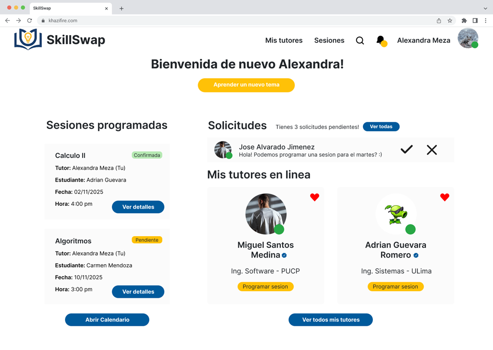
  <br>
  <em>Figura 39. Landing page - Página inicio. Nota: Esta figura muestra el diseño de la pantalla principal o dashboard que ve el usuario al iniciar sesión.</em>
</p>

<p align="center">
  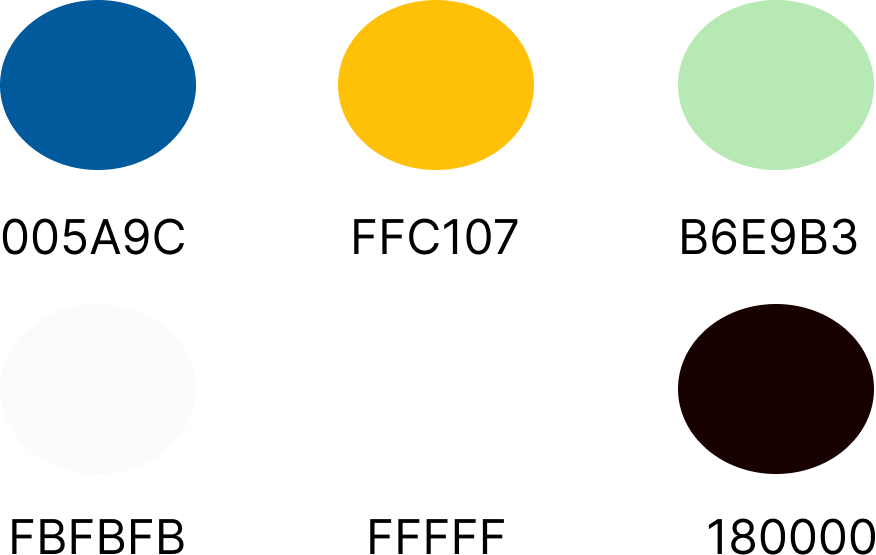
  <br>
  <em>Figura 40. Paleta de colores. Nota: Combinación del azul (confianza) y amarillo (energía).</em>
</p>

* **Responsive Design Standards (Mobile-first):**
  * **Mobile (hasta 768px):** Diseño de una sola columna. Menú hamburguesa. Botones grandes para uso táctil.
  * **Tablet (769px - 1024px):** Layout de hasta dos columnas. Menú lateral colapsable.
  * **Desktop (1025px+):** Espacio disponible con layouts de dos o tres columnas. Navegación principal siempre visible.
* **Interactivity:**
  * **Botones:** Bordes redondeados (`border-radius: 8px`). Hover con ligera sombra o cambio de tono.
  * **Transiciones:** Animaciones sutiles y rápidas (200-300ms).
* **Accessibility:**
  * Etiquetas (`<label>`) claras en formularios.
  * Imágenes con texto alternativo (`alt`).
  * Navegación completa mediante teclado (Tab, Enter).
  * Contraste de color según pautas WCAG 2.1.

---


## 4.2. Information Architecture

En esta sección se plantean las decisiones y el sustento que dirigen la manera como se organizará el contenido en las experiencias web y móvil de SkillSwap (Innovify). Las propuestas están orientadas a que los usuarios se adapten con facilidad a la funcionalidad del producto y puedan encontrar todo aquello que necesiten sin esfuerzo, reduciendo la carga cognitiva y optimizando el cumplimiento de sus objetivos. A continuación, se detallan las decisiones sobre los Organization Systems, Labeling Systems, Searching Systems y Navigation Systems.

### 4.2.1. Organization Systems

Para estructurar la información de manera intuitiva, la plataforma combinará múltiples sistemas de organización. La **organización jerárquica** será el sistema principal para presentar la información dentro de cada pantalla. Los procesos clave, como el registro o la solicitud de una tutoría, seguirán una **organización secuencial**, guiando al usuario paso a paso.

El esquema principal de categorización será por **tópicos** (materias o habilidades). Se usará un **esquema cronológico** para historiales y sesiones programadas. Fundamentalmente, toda la arquitectura se basa en un **esquema según audiencia**, dividiendo la experiencia en tres flujos distintos, como se muestra en los siguientes diagramas.

* **Estudiante-Aprendiz:** El viaje comienza al iniciar sesión en su Dashboard. Su acción principal es usar la búsqueda para encontrar un Tópico. La plataforma le presenta una Lista de Resultados con tutores, permitiéndole explorar el Perfil Detallado. Si le convence, inicia la Solicitud de Tutoría. El flujo culmina en la coordinación a través de un Chat Interno una vez que el tutor acepta, asegurando un proceso estructurado de principio a fin.

<p align="center">
  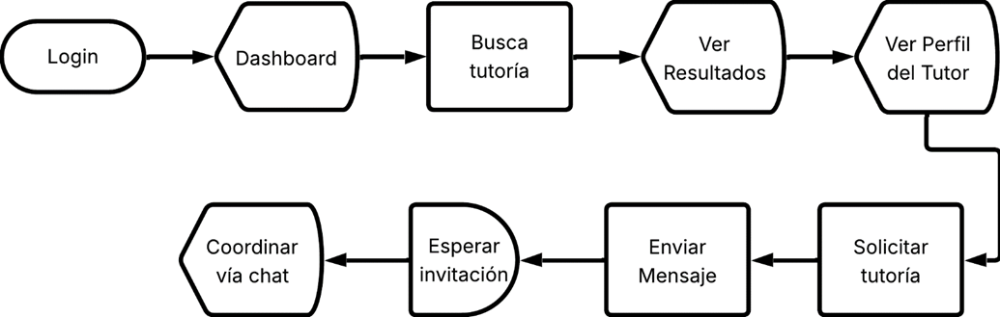
  <br>
  <em>Figura 53. Diagrama de flujo de Estudiante aprendiz. Nota: Esta figura detalla el recorrido secuencial del usuario desde el inicio de sesión hasta la coordinación final.</em>
</p>

* **Estudiante-Tutor:** El viaje se inicia de forma reactiva al recibir una notificación. En su Dashboard, consulta las solicitudes pendientes y revisa el perfil del aprendiz. Si acepta, el sistema lo dirige a un chat interno para coordinar. Tras realizar la tutoría con éxito, el tutor califica la experiencia y recibe créditos/donaciones como recompensa.

<p align="center">
  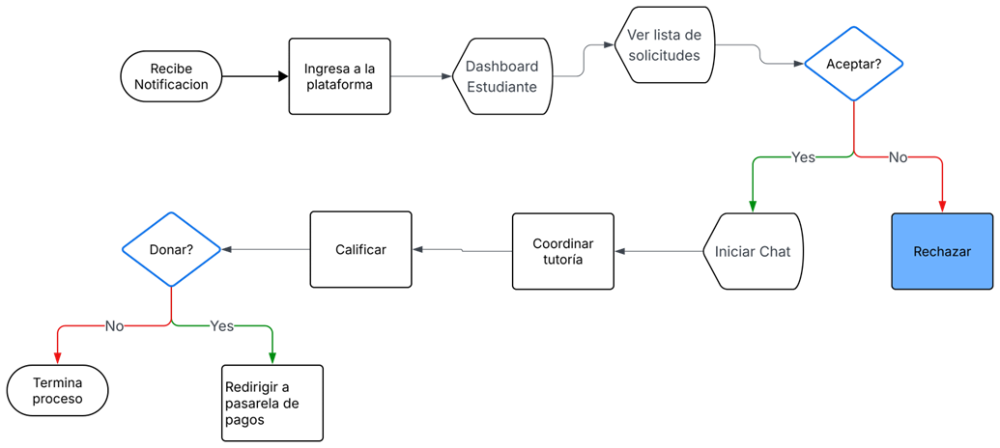
  <br>
  <em>Figura 54. Diagrama de flujo de Estudiante tutor. Nota: Este diagrama ilustra el flujo de trabajo del tutor para revisar, aceptar, coordinar y finalizar el ciclo.</em>
</p>

* **Coordinador Institucional:** La experiencia está diseñada para la máxima eficiencia. Comienza al recibir una notificación de verificación pendiente. Para agilizar, el sistema permite seleccionar múltiples estudiantes y usar "Aprobar en Bloque". Se pide confirmación de la acción para evitar errores y la lista de pendientes se actualiza.

<p align="center">
  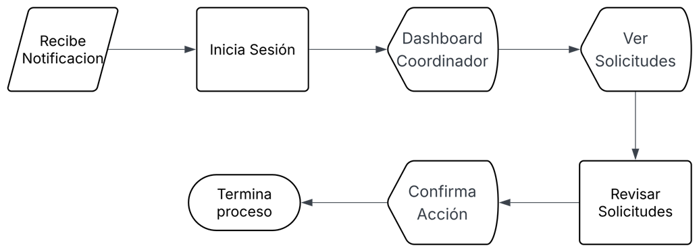
  <br>
  <em>Figura 55. Diagrama de flujo de Coordinador institucional. Nota: La figura representa el flujo diseñado para ser eficiente mediante la función "Aprobar en Bloque".</em>
</p>

---

### 4.2.2. Labeling Systems

Colocamos el *labeling system* (sistema de etiquetado) en el lado izquierdo de forma desplegable para facilitar su uso. Además, ajustamos los colores y el fondo para que se alineen con la paleta representativa de la marca, asegurando un buen contraste que permita una lectura clara y cómoda.

Esta disposición mejora la experiencia del usuario, ya que le permite desplazarse fácilmente entre las diferentes opciones y navegar de manera rápida e intuitiva por la aplicación. Cada sección cuenta, además, con sus respectivos títulos para mantener una estructura organizada y coherente.

<p align="center">
  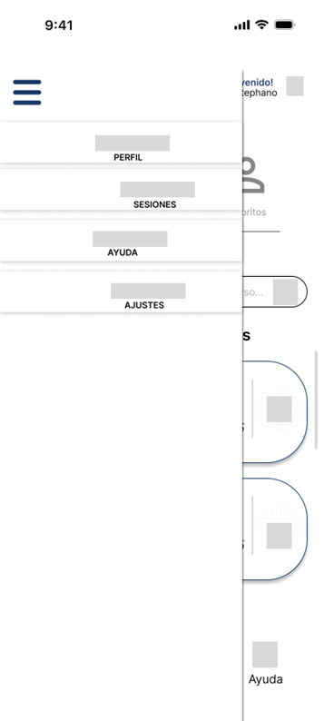
  <br>
  <em>Figura 56. Sistema de Etiquetado en Menú de Navegación Móvil. Nota: Se emplean etiquetas claras como "Perfil", "Sesiones" y "Ajustes" para acceso intuitivo.</em>
</p>

---

### 4.2.3. SEO Tags and Meta Tags

Para asegurar el correcto posicionamiento en motores de búsqueda (SEO) y una previsualización adecuada en redes sociales, el equipo ha definido la siguiente estructura de etiquetas `<title>` y `<meta>`. La estrategia se divide entre la Landing Page y la Web Application.

#### 1. Landing Page (Sitio Web Estático Público)
El objetivo es captar tráfico orgánico de estudiantes y de instituciones interesadas en el modelo B2B.

**Página Principal**
```html
<title>Skillswap | La Red de Tutorías Universitarias Más Segura del Perú</title>
<meta name="description" content="Conecta con estudiantes universitarios verificados para recibir tutorías en línea. Aprende, enseña, recibe donaciones y mejora tus notas con Innovify.">
<meta name="keywords" content="tutorías universitarias, apoyo académico, estudiantes verificados, plataforma edtech, tutorías peru, ganar dinero enseñando, innovify">
<meta name="author" content="Innovify Team">

```

### 4.2.4. Searching Systems

Para evitar que los usuarios se sientan perdidos ante el volumen de información, la plataforma ofrecerá un sistema de búsqueda robusto y diversos medios de ayuda para encontrar datos. Las decisiones buscan facilitar el descubrimiento de tutores y la gestión de la información.

| Sistema de Búsqueda | Descripción | Beneficio para el Usuario |
| :--- | :--- | :--- |
| **Búsqueda Principal por Tópicos** | Permite a los aprendices buscar tutores introduciendo el nombre de un curso o habilidad (ej. "Cálculo II") en una barra de búsqueda principal. | Ofrece un punto de partida directo y familiar para encontrar ayuda. Responde a la necesidad principal del usuario de forma inmediata. |
| **Búsqueda por Etiquetas** | Los tutores pueden añadir etiquetas específicas a sus habilidades (ej. "Figma", "React.js"). El sistema permite a los aprendices buscar directamente por estas etiquetas. | Aumenta la precisión de la búsqueda, permitiendo a los usuarios encontrar ayuda sobre una herramienta o subtema muy específico, en lugar de solo por el nombre general del curso. |
| **Acceso Rápido por Favoritos** | Los aprendices pueden marcar tutores como "favoritos" para guardarlos en una lista personal de acceso rápido. | Funciona como un sistema de recuperación personalizado. Evita que el usuario tenga que realizar una nueva búsqueda para encontrar a un tutor con el que ya tuvo una buena experiencia. |
| **Búsqueda Interna (Coordinador)** | El panel de administración incluye una barra de búsqueda para que el coordinador encuentre el perfil de un estudiante específico por su nombre o código. | Facilita la gestión y el monitoreo. Permite al coordinador auditar o revisar un caso particular de manera eficiente sin tener que navegar por largas listas. |

*(Tabla 14. Sistemas de Búsqueda de la Plataforma. Nota: Esta tabla describe los diferentes sistemas de búsqueda implementados, detallando las funcionalidades y el beneficio que cada una aporta a los distintos tipos de usuario).*

Los resultados de la búsqueda para el aprendiz se presentarán siempre en formato de tarjetas de perfil, mostrando foto, nombre, universidad y calificación, para facilitar una decisión rápida e informada.

---

### 4.2.5. Navigation Systems

La navegación principal en la plataforma se realizará a través de la opción “Home”, que dirige al usuario a la pantalla inicial donde se concentran las funciones principales: visualizar estudiantes, contactos y favoritos.

En la parte inferior, se muestran las sesiones recientes, cada una acompañada de su respectivo perfil, número de sesión, fecha exacta y foto de perfil, junto con la opción de ver más detalles de cada una.

Además, se incluye un botón para acceder al historial completo de sesiones, ordenadas desde la más reciente hasta la más antigua, y un botón de ayuda, pensado para ofrecer soporte en caso de que el usuario tenga inconvenientes con la aplicación.

---

## 4.3. Landing Page UI Design

En esta sección se elabora la propuesta de UI para el Landing Page. El diseño traduce las decisiones de arquitectura de información y los Style Guidelines previamente definidos en una experiencia visual coherente y atractiva. 

El objetivo principal del Landing Page es comunicar la propuesta de valor del startup, generar confianza en los nuevos visitantes e incentivar el registro en la plataforma, sirviendo como la principal puerta de entrada al ecosistema de colaboración interuniversitaria.

### 4.3.1. Landing Page Wireframe

#### Landing Page Desktop Web Browser Wireframe

<p align="center">
  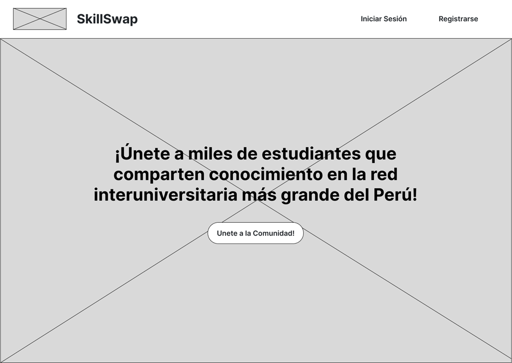
  <br>
  <em>Figura 57. Wireframe de la Sección Principal de la Landing Page. Nota: Este wireframe ilustra la estructura de la sección principal de la página de bienvenida. Su diseño se enfoca en comunicar la propuesta de valor de forma directa e incluye un llamado a la acción ("Call-to-Action") central para incentivar el registro de nuevos usuarios.</em>
</p>

<p align="center">
  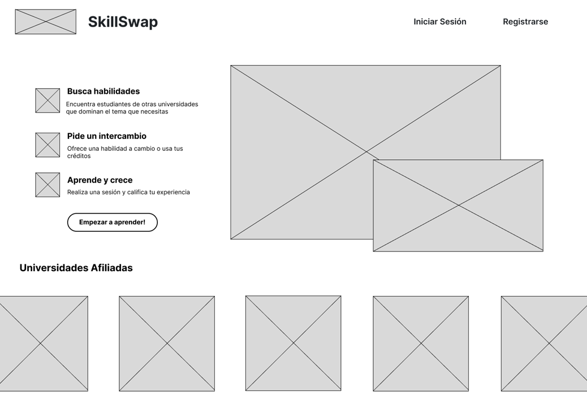
  <br>
  <em>Figura 58. Wireframe de la Estructura de la Landing Page. Nota: Este wireframe detalla la distribución de los elementos en la página de bienvenida. Se observa una sección principal donde se mostrarán imágenes del diseño de la plataforma final, seguida de una explicación del servicio en tres pasos y un área para mostrar las universidades afiliadas, guiando al visitante a través de la propuesta de valor.</em>
</p>

**Principios de diseño**
En el wireframe de nuestra landing page para el navegador web, se seleccionó un fondo blanco con el objetivo de generar un contraste fuerte que permita destacar los elementos superpuestos, como botones, textos e imágenes, mejorando así la legibilidad. 

Se utilizaron botones con forma de píldora y tarjetas rectangulares que se repiten a lo largo de todo el diseño, generando coherencia visual y una experiencia uniforme para el usuario. La estructura de la página se organiza en columnas dobles, centradas horizontalmente, lo que permite equilibrar texto e imagen, como se observa en la Figura 52, donde una columna presenta beneficios y la otra imágenes ilustrativas. Finalmente, los elementos relacionados se ubican próximos entre sí dentro de su columna o fila correspondiente (como en el apartado llamado “Universidades Afiliadas”), aplicando el principio de proximidad para facilitar la comprensión y navegación del contenido.

**Elementos de diseño**
En los wireframes de la landing page se destacan tres elementos de diseño clave: tamaño, espacio y figuras. Se busca implementar un estilo minimalista combinado con diseño flat, lo que se refleja en el uso de espacios amplios que crean una interfaz limpia, ligera y fácil de navegar. Esta disposición evita la sobrecarga visual y mejora la legibilidad.

Los diversos tamaños y formas de las figuras se emplean para establecer jerarquías claras, generar contraste y diferenciación. Por ejemplo, los botones como el de “Únete a la comunidad” y “Comenzar a aprender”, tienen forma de píldora y un tamaño proporcionado para que resalten del contenido plano e inviten al usuario a la acción.

**Diseño inclusivo**
La estructura bien definida, con una clara separación entre la navegación y el contenido, facilita la comprensión del layout para todos los usuarios, incluyendo aquellos que dependen de tecnologías de asistencia. El formato de tarjetas también crea un patrón predecible que mejora la accesibilidad del contenido. La alineación y el uso del espacio en blanco contribuyen a una interfaz limpia y sin sobrecarga de información.

**Arquitectura de la información**
En el wireframe de la landing page se puede observar una estructura simple y lógica, alineada con el estilo minimalista adoptado. Se incluyen únicamente los elementos esenciales, como los botones “Registrarse” e “Inicio de sesión”, cuyas funciones son claras y comprensibles para el usuario.

Esta organización reduce la sobrecarga cognitiva y mejora la experiencia del usuario, facilitando la navegación desde el primer momento. La jerarquía de la información está cuidadosamente pensada para mostrar solo lo necesario, evitando distracciones y guiando al usuario hacia la acción deseada.

---

#### Mobile Web Browser Wireframe

<p align="center">
  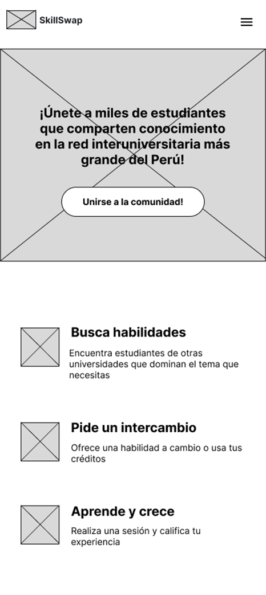
  <br>
  <em>Figura 59. Wireframe de la Página Principal. Nota: Esta figura muestra la estructura de la página principal para navegadores móviles. El diseño utiliza una columna única y tarjetas modulares para organizar el contenido de forma vertical, facilitando la navegación y la lectura en pantallas pequeñas.</em>
</p>

**Principios de diseño**
En el wireframe de nuestra landing page para navegador móvil, se seleccionó un fondo blanco para lograr un alto contraste con los elementos superpuestos, como botones, textos e imágenes. Esta elección mejora la legibilidad en pantallas pequeñas y permite que cada componente visual destaque claramente.

El diseño utiliza botones con forma de píldora y tarjetas rectangulares apiladas verticalmente, lo cual aporta coherencia visual y facilita una experiencia de usuario fluida. La disposición en una sola columna responde a la interacción típica en estos dispositivos, priorizando el scroll vertical como principal forma de navegación.

En lugar de mostrar botones visibles como “Registrarse” e “Iniciar sesión”, se optó por un ícono de menú desplegable ubicado en la esquina superior derecha. Este menú centraliza las opciones de navegación, permitiendo una interfaz más limpia y enfocada en el contenido principal. Esta decisión mejora la usabilidad al reducir elementos en pantalla y ofrecer acceso intuitivo a funciones clave cuando el usuario lo necesita. La proximidad entre elementos relacionados facilita la comprensión inmediata, como en el apartado “Universidades Afiliadas”, donde las tarjetas aparecen agrupadas de forma horizontal.

**Elementos de diseño**
El estilo se mantiene minimalista y flat, con uso extensivo de espacios en blanco que ayudan a evitar la saturación visual, mejoran la navegación táctil y generan una apariencia ligera y moderna. Este enfoque garantiza una interfaz limpia y accesible, incluso en pantallas reducidas.

Los botones principales, como “Únete a la comunidad” o “Comenzar a aprender”, tienen forma de píldora, tamaño mediano y se ubican de forma centrada para facilitar su visibilidad y clicabilidad con el pulgar. Las formas simples se utilizan estratégicamente para marcar jerarquías, generar contraste y destacar llamados a la acción.

**Diseño inclusivo**
El uso de un menú desplegable ayuda a simplificar la interfaz, al mismo tiempo que mantiene accesibles las funciones de navegación para todo tipo de usuario, incluyendo aquellos que utilizan tecnologías de asistencia. La disposición de tarjetas en formato vertical establece un patrón claro y repetitivo que mejora la accesibilidad cognitiva. El espacio en blanco y la separación entre secciones contribuyen a una navegación más intuitiva y menos sobrecargada.

**Arquitectura de la información**
En el wireframe mobile del landing page, la arquitectura sigue un enfoque claro y minimalista, presentando solo los elementos esenciales en pantalla. Las opciones de navegación están agrupadas dentro de un menú hamburguesa, lo que permite mantener el diseño limpio y enfocado en el contenido principal.

Esta estructura facilita la navegación desde el primer momento, guiando al usuario a través del contenido mediante una jerarquía visual clara y bloques bien definidos. Al minimizar la cantidad de elementos visibles a la vez, se reduce la carga cognitiva y se mejora significativamente la experiencia del usuario en dispositivos móviles.

### 4.3.2. Landing Page Mock-up

#### Desktop Web Browser Mock-up

<p align="center">
  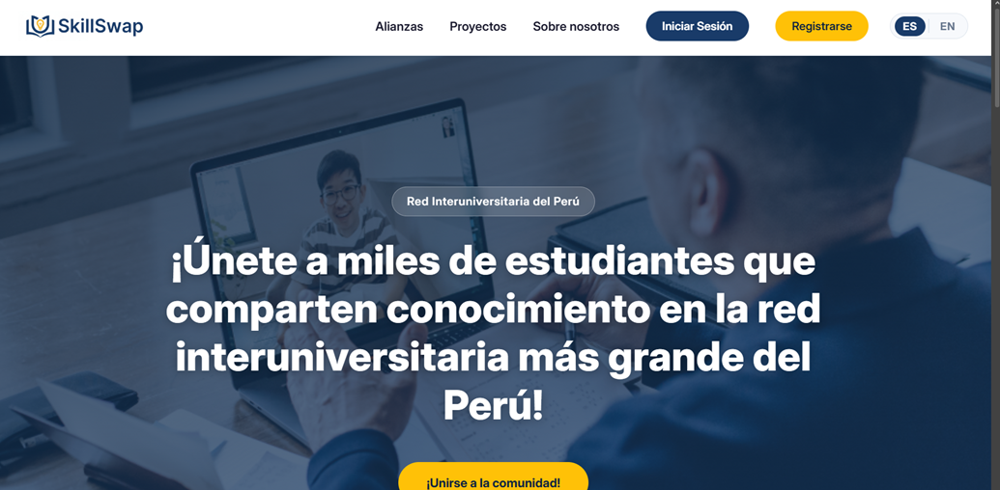
  <br>
  <em>Figura 60. Mock-up de la Sección Principal de la Landing Page. Nota: Este mock-up muestra el diseño visual de la sección principal de la página de bienvenida. Se utiliza una imagen de fondo atractiva, la paleta de colores de la marca y una tipografía clara para comunicar la propuesta de valor y destacar el llamado a la acción principal.</em>
</p>

<p align="center">
  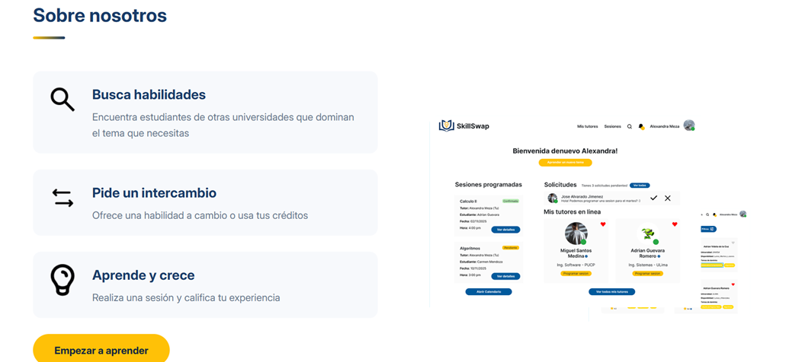
  <br>
  <em>Figura 61. Mock-up del Cuerpo de la Landing Page. Nota: La figura presenta el diseño de las secciones principales de la Landing Page, donde se explica el funcionamiento del servicio ("Busca habilidades", "Pide un intercambio") y se muestra prueba social a través de los logos de las "Universidades Afiliadas".</em>
</p>

**Aplicación del Design System**
El diseño aplica consistentemente la identidad visual del proyecto. Se utiliza la paleta de colores definida, con el azul primario y el amarillo de acento en los botones de llamada a la acción ("Empezar a aprender" o “Unirse a la comunidad”), creando un contraste que guía la atención del usuario. La tipografía 'Inter' se emplea con diferentes pesos y tamaños para establecer una jerarquía visual clara, diferenciando el titular principal de los subtítulos y el cuerpo del texto.

**Principios de diseño**
En el mockup de la landing page, se observa cómo los colores amarillo y azul, definidos en la paleta de colores de los guidelines, generan un contraste visual fuerte con el fondo blanco. Esta combinación se utiliza durante todo el diseño para destacar botones, etiquetas y otros elementos interactivos, reforzando la jerarquía visual y guiando la atención del usuario hacia las acciones clave.

Además, los elementos relacionados, como las universidades afiliadas o las imágenes de la plataforma, se presentan próximos entre sí, alineados en el centro de la página o en columnas de 2 elementos. Esto responde a los principios de proximidad y alineación, que ayudan a organizar la información de forma clara, accesible y estéticamente agradable.

**Elementos de diseño**
En la versión de escritorio del mockup, los elementos de diseño como tamaño, espacio y figuras se adaptan para aprovechar mejor el espacio disponible en pantalla. El enfoque minimalista y flat se mantiene, eliminando cualquier elemento innecesario para evitar la sobrecarga visual y favorecer la experiencia del usuario.

Los botones con forma de píldora y color amarillo destacan del resto del contenido, generando un contraste visual que los convierte en puntos focales. Su tamaño y ubicación están optimizados para ser fácilmente visibles y accesibles, incluso sin interacción táctil. Además, se utilizan íconos vectoriales simples acompañados de texto explicativo en las secciones funcionales (“Busca habilidades”, “Pide un intercambio”, “Aprende y crece”), lo que permite una rápida comprensión del propósito de cada bloque. Las imágenes y logotipos se integran de forma alineada y con márgenes bien definidos, reforzando el orden visual y generando una experiencia de navegación más fluida y profesional.

**Diseño inclusivo**
El diseño de la landing page también incorpora principios de accesibilidad para asegurar que todos los usuarios, sin importar sus capacidades, puedan navegar e interactuar con la plataforma de forma eficiente. La estructura jerárquica clara, los contrastes definidos y la separación de bloques de contenido permiten una exploración intuitiva y sin esfuerzo.

La presencia permanente del menú de navegación en la parte superior, junto con el uso de etiquetas claras e íconos comprensibles, favorece la orientación. Además, el uso adecuado del espacio en blanco contribuye a reducir la carga cognitiva, facilitando la lectura por parte de usuarios con dificultades de atención, visión o comprensión.

**Arquitectura de la información**
La arquitectura de la información de la plataforma se estructura jerárquicamente, diferenciando de manera clara el sitio público (Landing Page) del área privada (Dashboard). Este enfoque permite un flujo de navegación lógico y fluido: el usuario primero explora la landing page, conoce la propuesta de valor, se registra o inicia sesión y finalmente accede a su espacio personal en el dashboard.

En cuanto a la organización del contenido, la landing page sigue una secuencia narrativa que va desde la propuesta de valor hasta las funcionalidades y la prueba social, presentando la información de manera progresiva y orientada a la acción. Por su parte, el dashboard está dividido por módulos según las tareas que el usuario desea realizar, como gestionar sesiones, ver solicitudes o encontrar tutores, lo que facilita el acceso rápido a cada función.

Las etiquetas empleadas en la interfaz son descriptivas y coherentes con las acciones que representan. Los botones de llamada a la acción, como “Empezar a aprender” o “Unirse a la comunidad”, son directos y motivan la interacción. Asimismo, las secciones de navegación, como “Mis tutores” o “Sesiones programadas”, emplean una rotulación inequívoca que refleja con precisión el contenido que el usuario encontrará.

Finalmente, la navegación está orientada a tareas concretas y combina la exploración guiada con la búsqueda directa. En la landing page, todo el recorrido está diseñado para conducir al usuario hacia el registro, mientras que en el dashboard se integran mecanismos de búsqueda y revelación progresiva, por ejemplo, las tarjetas de sesión muestran un resumen con la opción “Ver detalles”, que permiten al usuario obtener más información sin sobrecargar la interfaz. Este conjunto de decisiones arquitectónicas mejora la experiencia, reduce la carga cognitiva y mantiene al usuario enfocado en sus objetivos principales dentro de la plataforma.

> **En síntesis:** El diseño web de "Innovify" aplica eficazmente las heurísticas de Nielsen, garantizando usabilidad y consistencia a través de un diseño minimalista y estándares reconocibles. Al mismo tiempo, su arquitectura de información ofrece una estructura jerárquica clara y una navegación orientada a tareas que facilita, por un lado, la captación de nuevos usuarios y, por otro, permite a los estudiantes registrados gestionar sus intercambios de conocimiento de forma rápida, intuitiva y segura.

---

#### Mobile Web Browser Mock-up

<p align="center">
  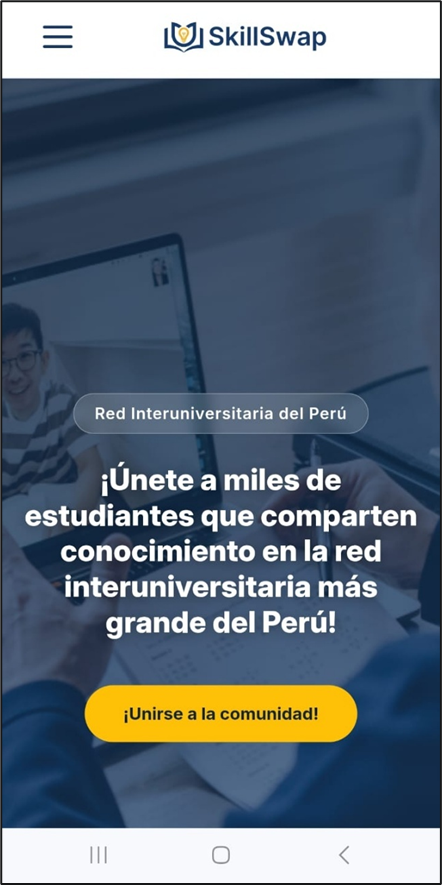
  <br>
  <em>Figura 62. Mock-up de la Landing Page. Nota: Este mock-up muestra la adaptación del diseño de la página de bienvenida a dispositivos móviles. La estructura se organiza en una sola columna vertical para facilitar la lectura y navegación mediante el desplazamiento, manteniendo la coherencia visual y las llamadas a la acción principales.</em>
</p>

**Principios de diseño**
En el mockup de la landing page para navegador móvil, se optó por un fondo blanco con el objetivo de lograr un alto contraste que permita destacar con claridad los elementos superpuestos como botones, imágenes e íconos. Esta elección mejora significativamente la legibilidad en dispositivos móviles, donde el espacio visual es reducido y cada componente debe ser fácilmente identificable.

El diseño organiza los elementos en una disposición vertical, acorde al comportamiento natural del usuario en este tipo de dispositivos, priorizando el desplazamiento mediante scroll. A diferencia de la versión de escritorio, se reemplazaron los botones visibles de “Registrarse” e “Iniciar sesión” por un ícono de menú desplegable (hamburguesa) ubicado en la parte superior derecha. Esta decisión permite liberar espacio en pantalla, mantener la limpieza visual de la interfaz y facilitar el acceso centralizado a las opciones de navegación.

Asimismo, se emplean tarjetas e íconos visuales para presentar funcionalidades como “Busca habilidades”, “Pide un intercambio” y “Aprende y crece”, cada una acompañada de textos breves y directos. Esta estructura facilita la comprensión rápida del contenido y mantiene la coherencia visual en todo el diseño. En la sección “Universidades Afiliadas”, los elementos se agrupan de forma cercana, aplicando el principio de proximidad para favorecer la claridad y facilitar la identificación de aliados institucionales.

**Elementos de diseño**
En este mockup móvil se destacan tres elementos de diseño esenciales: tamaño, espacio y figuras. El estilo visual es minimalista y flat, lo que se traduce en una interfaz limpia, sin elementos innecesarios, y con un uso amplio del espacio en blanco. Esta disposición mejora la experiencia de navegación, evita la saturación visual y garantiza una lectura cómoda en pantallas reducidas.

Los botones más importantes, como “Unirse a la comunidad” y “Empezar a aprender”, están diseñados con forma de píldora y en color amarillo vibrante, lo que genera contraste con el fondo blanco y dirige la atención del usuario hacia la acción deseada. Estos botones tienen un tamaño adecuado para su uso táctil, evitando errores de interacción y mejorando la usabilidad general del sitio. Las figuras e íconos empleados refuerzan el significado del texto que los acompaña y ayudan a establecer jerarquías visuales claras. 

**Diseño inclusivo**
El diseño mobile presenta una estructura sencilla y ordenada, con una separación clara entre la navegación y el contenido principal. La incorporación del menú desplegable permite que los usuarios accedan a opciones importantes sin saturar la pantalla, lo que resulta especialmente útil para quienes utilizan tecnologías de asistencia o requieren interfaces simplificadas.

El uso de íconos junto con texto mejora la accesibilidad cognitiva, permitiendo que los usuarios comprendan las funciones incluso si no están familiarizados con la plataforma. La organización predecible de los bloques de contenido y la disposición vertical de los elementos también favorecen una experiencia inclusiva. Además, el uso del espacio en blanco y la alineación adecuada contribuyen a una interfaz visualmente limpia, facilitando el enfoque para usuarios con dificultades visuales o cognitivas.

**Arquitectura de la información**
La arquitectura de la información en la versión móvil se organiza bajo un enfoque vertical y secuencial. La estructura presenta el contenido en un orden progresivo que guía al usuario de forma natural: primero se muestra la propuesta de valor junto al botón de acción principal, luego se explican las funcionalidades esenciales y finalmente se incluye la sección de prueba social con las universidades asociadas.

El contenido está distribuido en bloques que abarcan todo el ancho de la pantalla, lo que favorece una experiencia de scroll fluida. Cada bloque representa una funcionalidad concreta y está diseñado para ser comprensible de manera independiente. En cuanto a la rotulación, se emplean etiquetas breves y claras. Los botones de llamada a la acción están ubicados estratégicamente para incentivar la interacción inmediata.

La navegación está orientada a tareas y se desarrolla en un flujo descendente que actúa como un embudo informativo: el usuario avanza paso a paso hasta llegar a los CTA principales. Por último, el sistema de navegación global se concentra dentro del menú de hamburguesa, manteniendo una interfaz limpia, accesible y enfocada en la conversión.

> **En síntesis:** El diseño web desde el móvil de la plataforma aplica las heurísticas de Nielsen con un fuerte enfoque en el minimalismo, la consistencia con los estándares móviles y la prevención de errores táctiles. Su arquitectura de información, basada en una estructura secuencial y vertical, garantiza una experiencia de usuario clara y reduce la carga cognitiva.

---

#### Arquitectura de la landing page (web-mobile)

La arquitectura de la landing page define la estructura y organización de los elementos principales de la interfaz, tanto en su versión web como móvil. Este diseño permite visualizar la distribución de contenidos, la navegación y la jerarquía de información, asegurando una experiencia clara, accesible y consistente para el usuario desde el primer contacto con la plataforma.
<br>

<p align="center">
  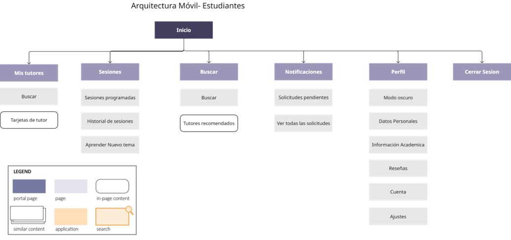
  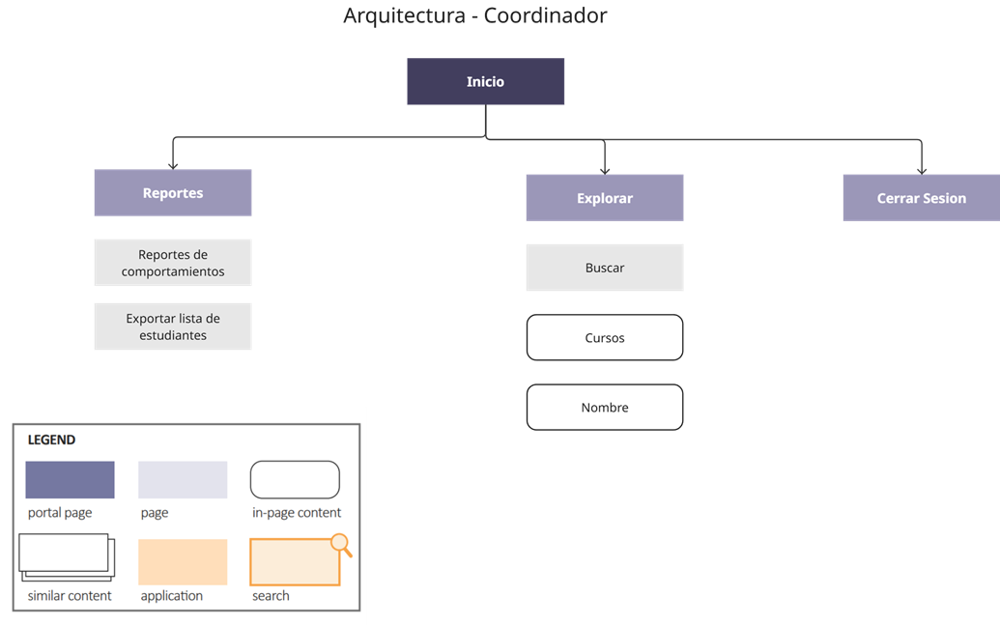
  <br>
  <em>Figura 63. Arquitectura de la Landing Page. Nota: Diagrama estructural de la landing page tanto para su versión web como móvil.</em>
</p>

## 4.4. Web Applications UX/UI Design.

### 4.4.1. Web Applications Wireframes.

Los wireframes representan la estructura base de las pantallas de la aplicación, mostrando la disposición de los elementos sin enfocarse en el diseño visual final. Estos esquemas permiten definir los flujos de navegación y validar la funcionalidad antes de avanzar a etapas de diseño más detalladas.
<br>

<p align="center">
  
  <br>
  <em>Figura 64. Colección de Wireframes de la Web Applications. Nota: Esta figura presenta una colección de los wireframes principales que definen la estructura de la aplicación móvil. Se incluyen las pantallas clave del flujo del usuario, como el dashboard de inicio, la búsqueda avanzada de tutores, la vista de perfil detallado y el panel de administración del coordinador.</em>
</p>

<p align="center">
  
  <br>
  <em>Figura 65. Colección de Wireframes de la Web Applications-2. Nota: Esta figura complementa la vista estructural con wireframes adicionales. Se detallan las interfaces para funcionalidades de interacción y gestión, como el chat de conversación, el panel de notificaciones, la lista de tutores favoritos y la pantalla de calificaciones del usuario.</em>
</p>

#### Principios Fundamentales de Diseño
En el diseño se aplicaron los siguientes principios para asegurar una experiencia visualmente coherente y funcional:

* **Contraste:** Se utiliza un contraste claro entre los elementos interactivos (como los botones de acción primarios en azul) y el fondo predominantemente blanco de la aplicación. Esto dirige la atención del usuario hacia las acciones más importantes, como "Ver más" o "Enviar" en la pantalla de calificación. La tipografía también usa diferentes grosores para establecer jerarquía entre títulos y texto de cuerpo.
* **Alineación:** Se mantiene una alineación consistente a la izquierda para la mayoría de los textos y títulos, como se ve en "Tus sesiones Recientes" y en los detalles del perfil del tutor. Los elementos clave, como el logo y los botones principales, a menudo se centran para crear un equilibrio visual y un punto focal claro.
* **Repetición:** Se emplean elementos de manera consistente a lo largo de la aplicación para crear familiaridad. Por ejemplo, el diseño de las "tarjetas" se repite para las sesiones recientes y los resultados de búsqueda. La barra de navegación inferior con los íconos de "Buscar", "Sesiones" y "Perfil" es un elemento persistente que unifica la experiencia.
* **Proximidad:** Los elementos relacionados se agrupan visualmente. En la pantalla de "Perfil tutor", la información sobre el nombre, la foto y la descripción se agrupa en la parte superior, mientras que las "Habilidades" y los "Comentarios" se organizan en secciones separadas y bien definidas.

#### Sustento desde las Heurísticas de Usabilidad de Nielsen

* **Visibilidad del estado del sistema:** El sistema mantiene al usuario informado. El panel de notificaciones ("Recibió una notificación de clase") y el indicador visual en la barra de navegación que resalta la sección activa ("Buscar", "Sesiones" o "Perfil") son ejemplos claros.
* **Relación entre el sistema y el mundo real:** La aplicación utiliza un lenguaje claro y familiar, como "Tus sesiones Recientes", "Califica tu experiencia" y "Comentarios", evitando tecnicismos y facilitando la comprensión inmediata.
* **Control y libertad del usuario:** El usuario tiene control total para navegar. Cada pantalla secundaria incluye un botón para "Volver", y la barra de navegación inferior permite cambiar de contexto en cualquier momento. Funciones como "Limpiar filtro" otorgan libertad al usuario.
* **Consistencia y estándares:** Se mantiene una identidad visual coherente. Todos los botones de acción principales son azules y redondeados. El estilo de las tarjetas y la estructura de las listas se repiten en diferentes pantallas, cumpliendo con las convenciones de diseño móvil.
* **Prevención de errores:** El diseño busca minimizar errores. En la pantalla de "Solicitudes de validaciones pendientes", los botones de "Aceptar" y "Rechazar" están claramente diferenciados por color y posición, reduciendo la posibilidad de una selección accidental.
* **Reconocimiento mejor que recuerdo:** La interfaz promueve el reconocimiento. La barra de navegación inferior con íconos universales (lupa para buscar, calendario para sesiones, persona para perfil) permite identificar las funciones sin memorizar su ubicación.
* **Flexibilidad y eficiencia de uso:** La aplicación ofrece herramientas para diferentes tipos de usuarios. La pantalla principal muestra "sesiones recientes" para un acceso rápido, mientras que la "Búsqueda avanzada" con filtros permite a los usuarios experimentados acotar resultados de manera eficiente.
* **Diseño estético y minimalista:** La interfaz es limpia y se enfoca en lo esencial. Se utiliza generoso espacio en blanco para evitar la sobrecarga cognitiva. Pantallas como "Califica tu experiencia" solo muestran los elementos necesarios para esa tarea.
* **Ayudar a reconocer, diagnosticar y recuperarse de errores:** Aunque no se muestra una pantalla de error, el diseño contempla estos escenarios. Si una búsqueda no arrojara resultados, se mostraría un mensaje claro como "No se encontraron tutores", guiando al usuario para modificar su búsqueda.
* **Ayuda y documentación:** La aplicación ofrece ayuda contextual. La sección inicial "¿Tienes dudas?" es un punto de acceso directo a soporte. Además, los títulos claros de cada pantalla y las etiquetas en los íconos actúan como una forma de documentación integrada.

#### Sustento desde la Arquitectura de Información (IA)

* **Estructura jerárquica clara:** La navegación sigue un flujo lógico y predecible. Desde la pantalla principal ("Home"), el usuario puede acceder a las secciones principales, y desde allí, profundizar a niveles de detalle como el perfil de un tutor o un chat.
* **Organización del contenido:** La información está agrupada por afinidad. En el "Panel coordinador", los datos se dividen en tarjetas claras, facilitando el escaneo rápido de la información relevante.
* **Rotulación adecuada (Labeling):** Se utilizan títulos y etiquetas descriptivas que son inmediatamente comprensibles ("Solicitudes de validaciones pendientes", "Mis Favoritos").
* **Navegación orientada a tareas:** El diseño está centrado en facilitar las tareas clave del usuario. Ya sea encontrar un tutor, revisar una sesión pasada o calificar una clase, el flujo de pantallas y los botones están dispuestos para guiar hacia el objetivo.
* **Sistemas de búsqueda:** La aplicación incorpora un sistema de búsqueda robusto con una barra simple y una opción de "Búsqueda avanzada" con filtros.

> **En síntesis:** El diseño de "Innovify" aplica correctamente los principios de diseño y las heurísticas de Nielsen para garantizar una alta usabilidad, consistencia y una experiencia sin errores. Al mismo tiempo, su arquitectura de información bien definida facilita que los usuarios (estudiantes y coordinadores) naveguen por la aplicación y completen sus tareas de forma intuitiva, rápida y segura.

*(Nota: Todos los wireframes a detalle se pueden consultar en el prototipo funcional diseñado en Figma).*
**Enlace:** https://www.figma.com/design/l6Z6APfbLoci4YMSaZkILK/Wireframes-camino-feliz?node-id=221-504&t=mcl4BJEHm24g0yCo-0 

### 4.4.2. Web Applications Wireflow Diagrams

Los Wireflow Diagrams representan el flujo de interacción del usuario dentro de la aplicación, combinando la estructura de los wireframes con la secuencia de acciones que realiza el usuario. Estos diagramas permiten visualizar de manera clara cómo los usuarios navegan entre pantallas para cumplir sus objetivos, facilitando la comprensión del comportamiento del sistema y la validación de la experiencia de usuario.

---

#### Wireflow 1: Calificación de Sesión
* **User Goal:** "Como estudiante aprendiz, después de una tutoría, quiero calificar a mi tutor para construir su reputación pública."
* **User Persona:** Estudiante Aprendiz.
* **User Stories Implicadas:** US17 (Calificar y dejar reseña al tutor).

**Explicación del Flujo:**
1. **Finalización de Sesión:** Al finalizar la videollamada, se habilita un formulario de calificación.
2. **Dejar Calificación:** El aprendiz marca una puntuación de 1 a 5 estrellas y escribe un texto con su comentario (ej. "Excelente explicación").
3. **Confirmación y Actualización:** Al enviar la reseña, esta aparece públicamente en el perfil del tutor y su promedio de estrellas se actualiza inmediatamente.

**Representación visual:**

<p align="center">
  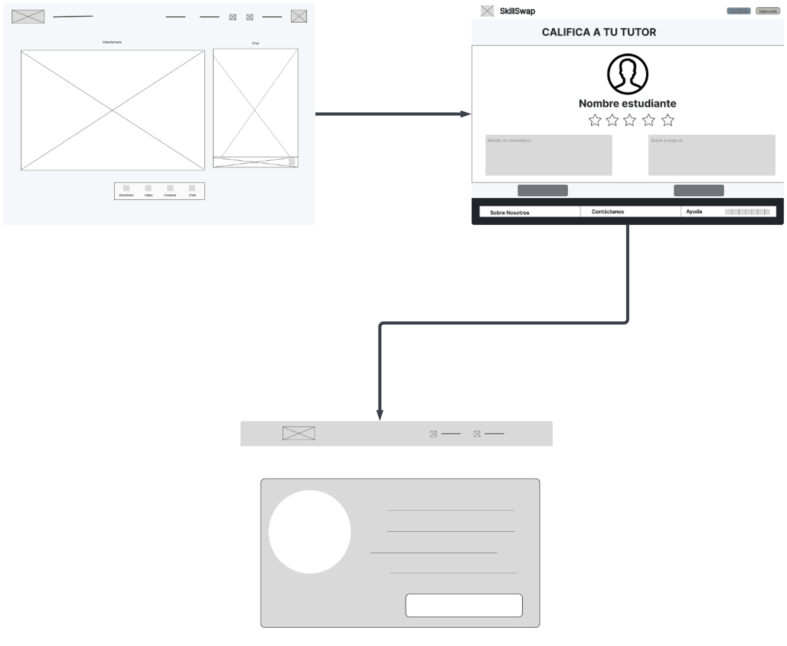
  <br>
  <em>Figura 68. Wireflow de Calificación de Sesión y Gestión de Favoritos. Nota: Este diagrama muestra el ciclo de cierre y retención para el aprendiz. Detalla los pasos para calificar a un tutor después de una sesión y la funcionalidad para marcar su perfil como "favorito", permitiendo un acceso rápido para futuras consultas.</em>
</p>

---

#### Wireflow 2: Configuración de Perfil y Habilidades del Tutor
* **User Goal:** "Como estudiante tutor, quiero configurar mi perfil agregando mi biografía, foto, universidad y gestionar mediante etiquetas los cursos que domino para aparecer en las búsquedas."
* **User Persona:** Estudiante Tutor.
* **User Stories Implicadas:** US03 (Configuración de perfil y áreas de dominio).

**Explicación del Flujo:**
1. **Acceso al Perfil:** El tutor ingresa a la sección "Mi Perfil".
2. **Datos Generales:** El tutor puede agregar o actualizar su foto, seleccionar su universidad y escribir una descripción biográfica.
3. **Añadir Habilidades:** Existe una sección de "Etiquetas" donde el tutor añade los cursos específicos que domina (ej. "Programación Web" o "Cálculo I").
4. **Gestión de Habilidades:** Desde esta misma vista, el tutor puede hacer clic en un icono de eliminar para retirar habilidades que ya no desea enseñar.
5. **Guardar Cambios:** Al guardar, el perfil se actualiza en el motor de búsqueda de la plataforma.

**Representación visual:**

<p align="center">
  
  <br>
  <em>Figura 69. Wireflow de Configuración de Perfil y Disponibilidad del Tutor. Nota: Este diagrama de flujo visualiza los pasos que sigue un tutor para configurar su perfil. Detalla la secuencia para añadir habilidades, establecer un calendario de disponibilidad y cambiar su estado para gestionar cuándo desea recibir solicitudes de tutoría.</em>
</p>

---

#### Wireflow 3: Búsqueda Avanzada con Filtros
* **User Goal:** "Como aprendiz, quiero aplicar filtros de calidad y procedencia a mi búsqueda para encontrar al tutor que mejor se adapte a mis preferencias."
* **User Persona:** Estudiante Aprendiz.
* **User Stories Implicadas:** US06 (Aplicar filtros a los resultados de búsqueda).

**Explicación del Flujo:**
1. **Búsqueda Inicial:** El flujo arranca cuando el usuario ya tiene en pantalla una lista de tutores tras buscar una materia.
2. **Abrir Filtros:** El usuario visualiza los filtros ubicados en un panel lateral en la vista de resultados.
3. **Aplicar Filtros:** El usuario configura las opciones permitidas, seleccionando una curso o filtrando por "Universidad".
4. **Actualizar Resultados:** Al aplicar el filtro, la lista de resultados se reduce en tiempo real mostrando únicamente a los perfiles que cumplen con los criterios de estrellas y universidad.

**Representación visual:**

<p align="center">
  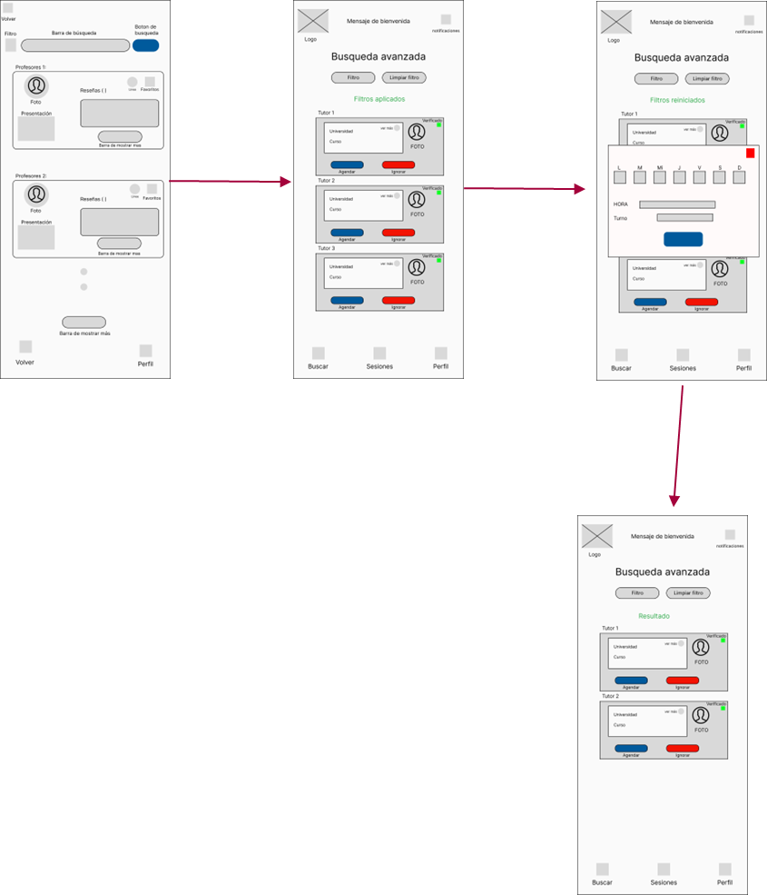
  <br>
  <em>Figura 70. Wireflow de Búsqueda Avanzada con Filtros. Nota: Este wireflow muestra cómo un estudiante puede refinar su búsqueda de tutores. Ilustra el proceso de aplicar filtros avanzados, como día y hora de disponibilidad, para que la lista de resultados se actualice y muestre únicamente a los candidatos que se ajustan a sus necesidades.</em>
</p>

---

#### Wireflow 4: Billetera Virtual y Retiro de Fondos del Tutor
* **User Goal:** "Como estudiante tutor, quiero visualizar el saldo de mis donaciones acumuladas en mi Billetera Virtual y configurar mi cuenta bancaria para solicitar retiros."
* **User Persona:** Estudiante Tutor.
* **User Stories Implicadas:** US19 (Visualizar Billetera Virtual y saldo), US20 (Registrar cuenta bancaria para retiro).

**Explicación del Flujo:**
1. **Acceso a la Billetera:** Desde su panel principal, el tutor ingresa a la pestaña "Billetera".
2. **Vista de Saldo e Historial:** El tutor visualiza el saldo total disponible a retirar. Debajo, revisa el historial de donaciones, donde puede ver el monto original donado, el descuento del 5% de comisión de la plataforma y el monto neto ingresado.
3. **Configurar Cuenta:** El tutor presiona la opción "Configurar Cuenta Bancaria".
4. **Registro de Datos:** Se abre un formulario donde ingresa el nombre de su Banco, su Número de Cuenta y su CCI. Al guardar, los datos se encriptan por seguridad.
5. **Solicitar Retiro:** Una vez guardado el CCI, se habilita el botón "Solicitar Retiro" para transferir sus fondos.

**Representación visual:**

<p align="center">
  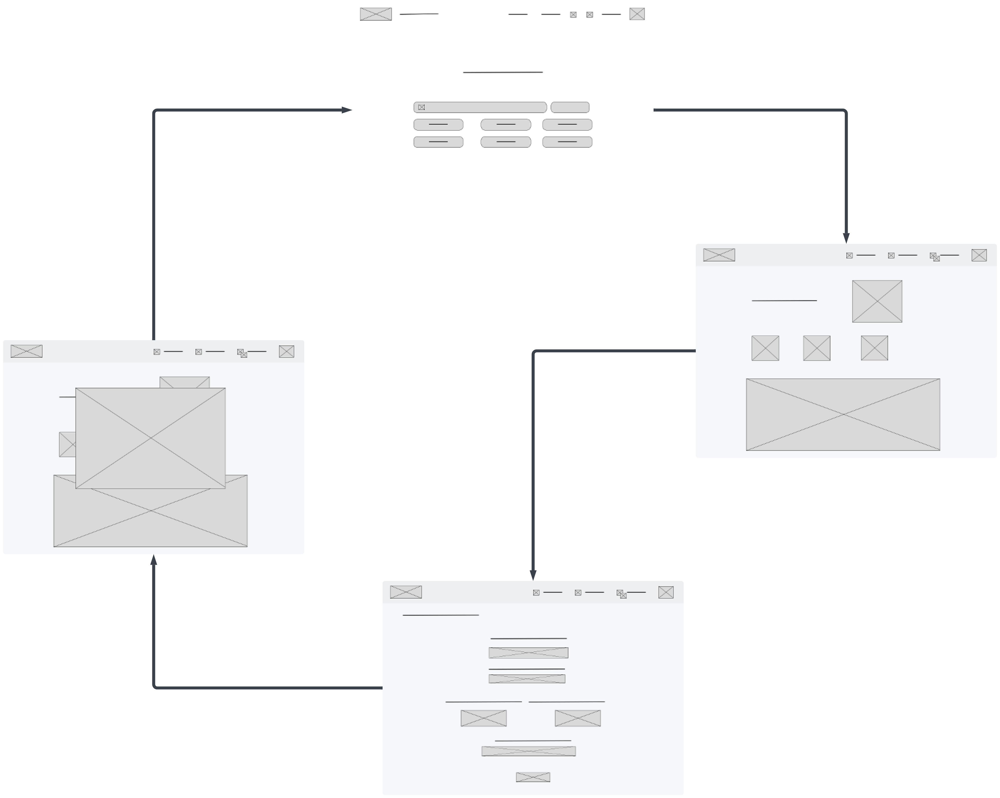
  <br>
  <em>Figura 72. Wireflow de Dashboard y Gestión de Reputación del Tutor. Nota: Este diagrama de flujo ilustra cómo el tutor interactúa con las funciones de seguimiento de la plataforma. Muestra el acceso al dashboard personal para ver estadísticas clave, consultar el historial de sesiones y revisar su reputación a través de las calificaciones recibidas.</em>
</p>


---

#### Wireflow 5: Registro y Login con correo universitario
* **User Goal:** "Como usuario, quiero registrarme con mi correo institucional y luego iniciar sesión para acceder a la plataforma según mi rol."
* **User Persona:** Estudiante (Aprendiz o Tutor).
* **User Stories Implicadas:** US01 (registro con correo institucional), US02 (login con roles), US04 (verificación institucional)

**Explicación del Flujo:**
1. **Pantalla de Registro:** El usuario accede al formulario de registro donde ingresa su correo institucional (.edu.pe) y contraseña. Al enviar el formulario, el sistema valida el dominio y registra la cuenta.
2. **Confirmación y Verificación:** El sistema envía un enlace de confirmación al correo institucional. El usuario valida su cuenta y recibe un mensaje indicando que su registro fue exitoso.
3. **Pantalla de Login:** El usuario regresa a la plataforma e ingresa sus credenciales (correo y contraseña) en el formulario de inicio de sesión.
4. **Validación de Credenciales:**El sistema verifica que los datos sean correctos y que la cuenta esté previamente verificada.
5. **Redirección al Dashboard:** Una vez autenticado, el sistema identifica el rol del usuario y lo redirige a su panel correspondiente: el estudiante accede al dashboard de búsqueda de tutores, mientras que el profesor accede al panel de analíticas.

**Representación visual:**

<p align="center">
  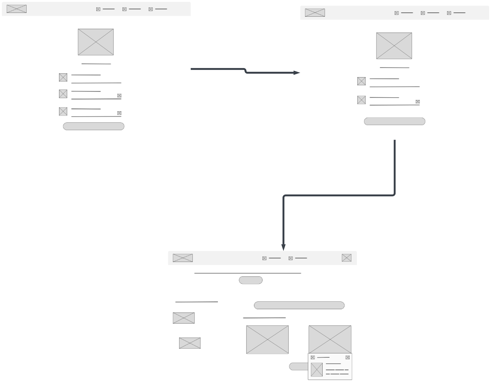
  <br>
  <em>Figura 72. Wireflow de Registro y Login con correo universitario. Nota: Este diagrama de flujo ilustra el proceso de acceso a la plataforma, desde el registro con correo institucional hasta la autenticación del usuario. Muestra la validación de la cuenta mediante verificación por correo y la posterior redirección al dashboard correspondiente según el rol del usuario..</em>
</p>

### 4.4.3. Web Applications Mock-ups.

En esta sección se presentan los mockups, que son la evolución de alta fidelidad de los wireframes, aplicando de manera estricta la Guía de Estilos y los principios de Arquitectura de Información del proyecto. El diseño busca crear una experiencia limpia, intuitiva y confiable.

<p align="center">
  
  
  <br>
  <em>Figura 75. Mock-ups de Alta Fidelidad de la Aplicación Móvil. Nota: Esta figura presenta el diseño final de las pantallas clave, aplicando la paleta de colores, tipografía y componentes definidos en el Design System.</em>
</p>

#### Aplicación del Design System y Guía de Estilos

* **Paleta de Colores:** Se aplica consistentemente la paleta de colores definida. El azul primario se usa para elementos de navegación y acciones constructivas clave (botones "Registrar", "Iniciar Sesión", "Aceptar"), generando confianza y una jerarquía de acción clara. El amarillo de acento se emplea para el descubrimiento (ej. etiquetas de dominio) creando un llamado a la acción enérgico. Crucialmente, el rojo de error (`#DC3545`) se reserva para acciones destructivas, como el botón "Rechazar" en el flujo del coordinador. Se emplean también colores semánticos para la retroalimentación: verde para "Confirmado" y amarillo para "Pendiente".
* **Tipografía:** Se aplica la fuente **'Inter'** en todas las pantallas, utilizando sus diferentes pesos para establecer una jerarquía tipográfica clara. Los títulos principales son grandes y amigables (ej. "¡Hola Alexandra!"), mientras que el texto de cuerpo y las etiquetas (ej. "Correo institucional") son nítidos y legibles.
* **Componentes (Repetición y Consistencia):** El diseño se basa en componentes reutilizables, lo que crea consistencia (Heurística de Nielsen). Se observa en:
  * **Tarjetas (Cards):** Usadas para listar sesiones programadas, solicitudes y perfiles de tutores.
  * **Etiquetas (Chips):** Utilizadas para mostrar "Temas de Dominio" y "Habilidades" (ej. "Física 1", "Figma") de forma visual y compacta.
  * **Botones de Acción:** Todos los botones principales son redondeados y de color sólido, siguiendo la guía de estilos.

#### Principios de Diseño Visual y Heurísticas

* **Contraste y Minimalismo (Diseño Inclusivo):** Siguiendo la heurística de diseño estético y minimalista, la interfaz utiliza un fondo blanco o gris muy claro. Los mockups demuestran un fuerte contraste entre el texto y el fondo, tanto en el tema claro como en el oscuro. La inclusión de un **Modo Oscuro** ofrece una alternativa para reducir la fatiga visual en sesiones de estudio nocturnas, cumpliendo con principios de accesibilidad.
* **Proximidad y Alineación:** La información está agrupada lógicamente. En el "Perfil de Tutor", los datos de identidad (foto, nombre, carrera) están en un bloque superior, mientras que "Etiquetas", "Comentarios" y "Habilidades" están en bloques separados. La alineación a la izquierda de los textos y formularios crea un flujo de lectura ordenado y fácil de seguir.
* **Visibilidad del Estado del Sistema:** La interfaz mantiene al usuario informado en todos los flujos. Ejemplos claros son:
  * El estado "seleccionado" de los botones de "Tipo de Usuario" (Alumno vs. Tutor) mediante un color sólido.
  * El sello de **"Verificado"** en el perfil del tutor, un elemento prominente que genera confianza.
  * Las etiquetas de estado en el dashboard del tutor: "Confirmado" (verde) y "Pendiente" (amarillo).
  * Las marcas de verificación en la lista del coordinador, que indican visualmente las solicitudes procesadas.
* **Reconocimiento sobre Recuerdo:** El panel de chat sigue un patrón universal (burbujas de texto, área para adjuntar documentos e imágenes) que los usuarios reconocen instantáneamente, eliminando la curva de aprendizaje.

#### Arquitectura de Información

* **Etiquetado (Labeling):** El sistema de etiquetado es claro, orientado a la acción y consistente con la terminología del dominio estudiantil. Se usan términos inequívocos como "Solicitar tutoría", "Califica a tu Tutor", "Sesiones programadas" o "Añadir Calendario".
* **Sistemas de Navegación y Organización:** Los mockups demuestran una organización jerárquica y **por audiencia** (el dashboard del aprendiz es radicalmente diferente al del tutor). El usuario navega desde una pantalla general a una de detalle y luego a una acción. El uso de modales evita que el usuario pierda el contexto de la pantalla anterior, mientras que el menú de hamburguesa actúa como el sistema de navegación global.
* **Concordancia con los User Flow Diagrams:** Los mockups cubren el total de vistas necesarias para construir los flujos de usuario definidos previamente:
  * **Flujo del Aprendiz (Búsqueda):** Dashboard (para buscar) -> Perfil del Tutor (para revisar) -> Modal de Solicitud (para ejecutar la acción).
  * **Flujo del Tutor (Gestión):** Dashboard (vista de tutor) -> Pantalla de Aceptación/Rechazo de solicitudes.
  * **Flujo del Coordinador:** Lista de solicitudes pendientes (con botones de selección múltiple) -> Pantalla de detalle de un estudiante.
  * **Flujos Transversales:** Menú de "Ajustes", personalización de apariencia y la interfaz de Chat.

  ### 4.4.3. Web Applications User Flow Diagrams

#### User Flow 1: Enviar solicitud de tutoría
* **User Goal:** "Como estudiante que necesita ayuda, quiero encontrar un tutor verificado para un curso específico, revisar su perfil para asegurarme de que es la persona adecuada y solicitarle una sesión de forma segura y directa."
* **User Persona:** Estudiante que quiere aprender.
* **User Stories Implicadas:** Búsqueda por de curso, Visualizar perfil público del tutor, Sello de verificación institucional, Enviar solicitud de reserva al tutor.

**Explicación del Flujo (Happy Path):**
Este flujo describe el camino principal del estudiante aprendiz para conectar con un tutor.
1. El flujo inicia en el Mock-up del Dashboard, donde el usuario introduce un término en la barra de búsqueda (ej. "Física 1").
2. Es dirigido al Mock-up de Resultados, donde ve una lista de tutores. Toca el perfil de un tutor que le interesa.
3. Accede al Mock-up del Perfil del Tutor. Aquí revisa las reseñas, confirma que tiene el sello de "Verificado" y presiona el botón "Solicitar Ayuda".
4. Aparece un Mock-up de Modal de Solicitud, donde el usuario escribe un mensaje explicando su duda y presiona "Enviar".

**Representación visual:**
<p align="center">
  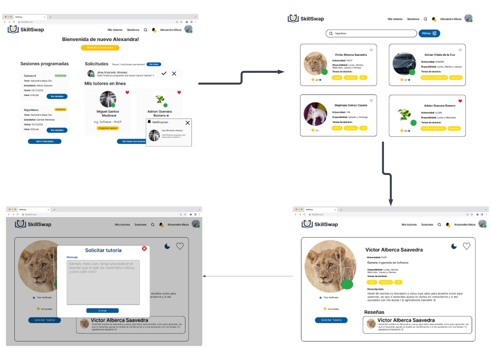
  <em>Se muestra el flujo de enviar solicitud</em>
</p>

**Unhappy Paths (Rutas Alternativas):**
* **Condición (Sin Resultados):** Si el usuario busca un término y no hay tutores disponibles.

**Explicación del Flujo (Unhappy Path – Sin Resultados):**
Este flujo describe lo que ocurre cuando el estudiante ingresa un término de búsqueda demasiado específico o una materia para la cual no existen tutores disponibles en la plataforma.
1. El flujo inicia en el Mock-up del Dashboard, donde el usuario escribe un término de búsqueda que no coincide con ningún tutor registrado (ej. “Termodinámica Avanzada”).
2. Es dirigido al Mock-up de Resultados Vacíos, donde la plataforma detecta que no existen tutores que coincidan con la búsqueda realizada.
3. En esta pantalla, el estudiante observa un mensaje informativo que dice: "No busques materias muy específicas. Intenta con otra más general." Además, puede visualizar opciones como volver a intentar la búsqueda, limpiar el filtro o regresar al Dashboard.
4. El flujo concluye aquí, dado que el usuario no puede continuar hacia un perfil de tutor ni enviar una solicitud. La plataforma lo orienta a reformular su búsqueda para encontrar alternativas disponibles.

**Representación visual:**
<p align="center">
  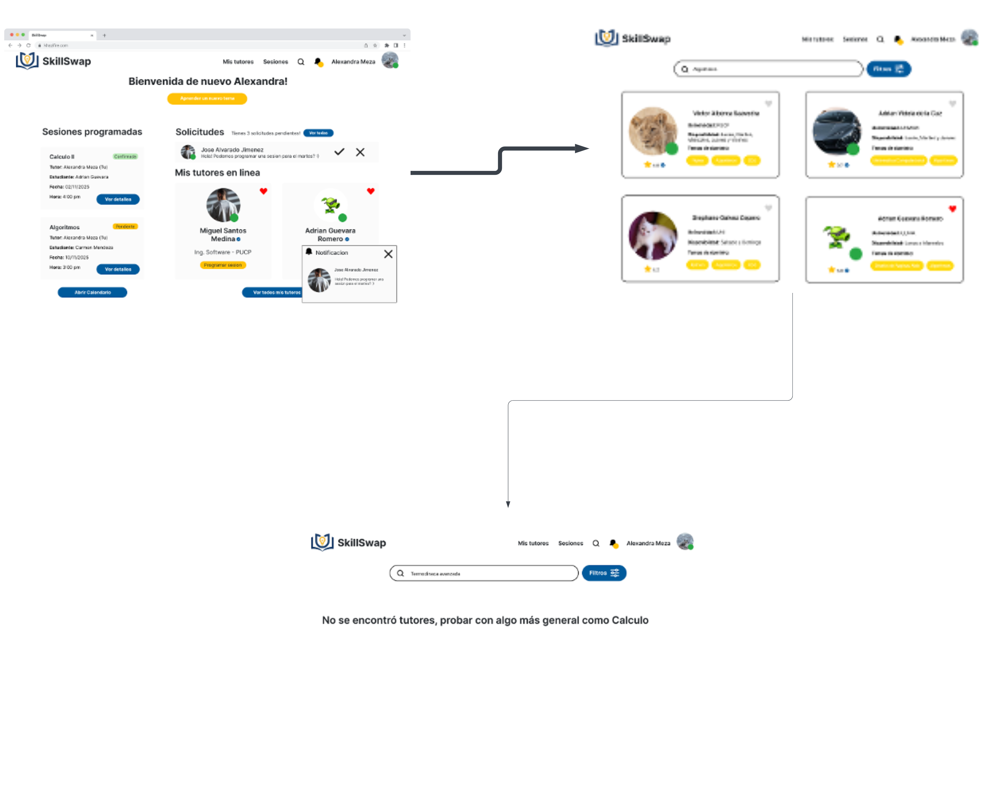
  <em>Se muestra el flujo de no encontrar tutor</em>
</p>

---

#### User Flow 2: Recepción y Aceptación de Solicitud de Tutoría
* **User Goal:** "Como estudiante tutor, quiero ser notificado de nuevas solicitudes de ayuda, poder revisar rápidamente el perfil del aprendiz y su mensaje, y aceptar o rechazar la solicitud de forma sencilla."
* **User Persona:** Estudiante que quiere enseñar.
* **User Stories Implicadas:** Aceptar o rechazar solicitud de reserva, Chat interno asincrónico de la reserva.

**Explicación del Flujo (Happy Path):**
Este flujo detalla la interacción clave del tutor para gestionar las solicitudes entrantes.
1. El tutor recibe una notificación. Al ingresar a la aplicación, ve su Mock-up del Dashboard de Tutor con un indicador de nueva solicitud. Toca la notificación.
2. Es dirigido al Mock-up de Revisión de Solicitud, donde lee el mensaje del aprendiz y ve su perfil. Presiona el botón "Aceptar".
3. El flujo concluye al ser redirigido automáticamente al Mock-up del Chat, donde ya puede coordinar la sesión con el aprendiz.

**Representación visual:**
<p align="center">
  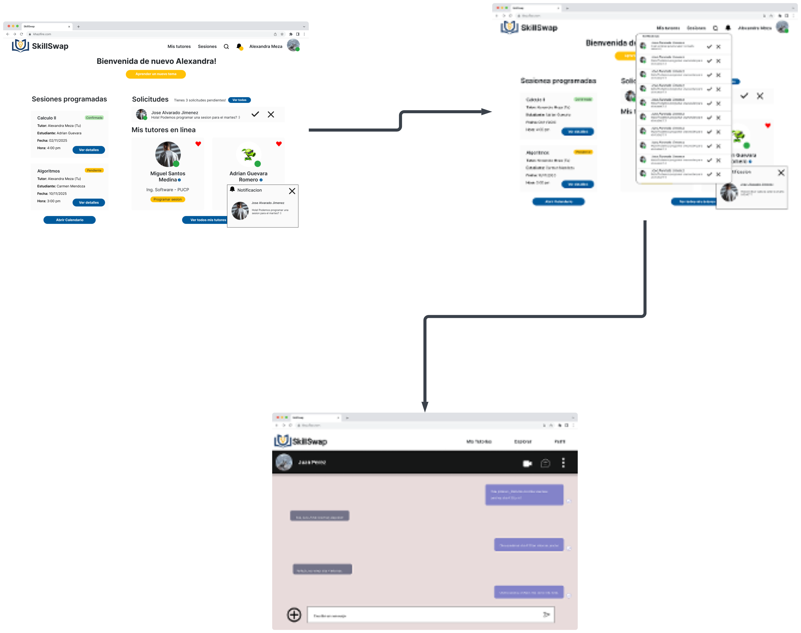
  <em>Se muestra el flujo Recepción y Aceptación de Solicitud de Tutoría</em>
</p>

**Unhappy Path (Ruta Alternativa):**
* **Condición (Rechazar Solicitud):** Si el tutor no puede o no desea tomar la solicitud.

**Explicación del Flujo (Rechazar Solicitud):**
Este flujo describe el escenario en el que un tutor decide no aceptar la solicitud enviada por un estudiante, ya sea por falta de disponibilidad, incompatibilidad con el tema o cualquier otra razón personal o académica.
1. El flujo inicia en el Mock-up de Revisión de Solicitud, donde el tutor visualiza el mensaje enviado por el estudiante junto con los detalles de la materia y la opción para responder.
2. El tutor selecciona la opción "Rechazar", indicando que no puede asumir esa tutoría.
3. El tutor confirma la acción. La plataforma registra el rechazo, descarta la solicitud y actualiza su estado.
4. El flujo concluye regresando al Mock-up del Dashboard del tutor, donde ya no aparece la solicitud pendiente.

**Representación visual:**
<p align="center">
  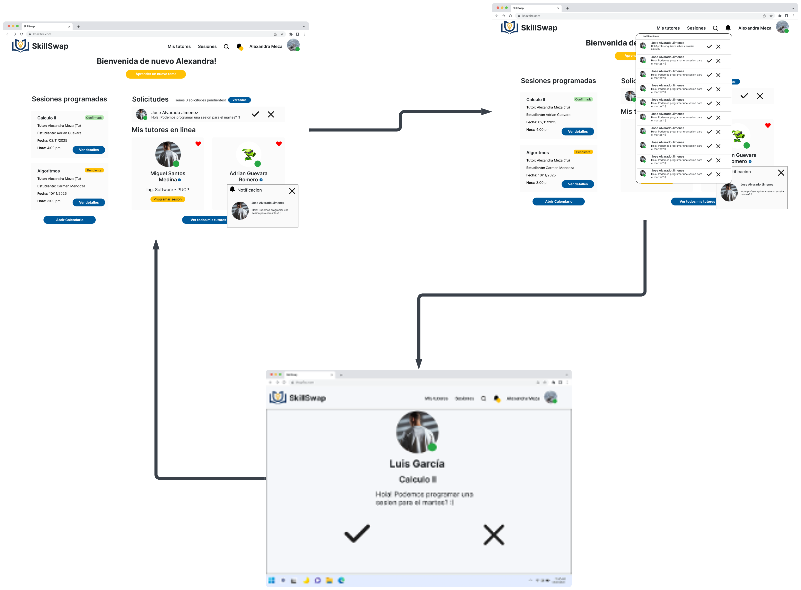
  <em>Se muestra el flujo de Rechazar Solicitud</em>
</p>

---

#### User Flow 3: Calificación de Sesión y Donación Voluntaria
* **User Goal:** "Como estudiante aprendiz, después de una tutoría, quiero calificar a mi tutor para compartir mi experiencia y poder guardarlo en una lista de 'favoritos' para contactarlo fácilmente en el futuro."
* **User Persona:** Estudiante que quiere aprender.
* **User Stories Implicadas:** Calificar y dejar reseña al tutor, Realizar donación monetaria voluntaria.

**Explicación del Flujo (Happy Path - Calificación y Favoritos):**
Este flujo muestra el cierre del ciclo de aprendizaje y la retención del usuario.
1. Al finalizar una sesión (ej. al cerrar la videollamada), la plataforma muestra automáticamente el Mock-up de Calificación.
2. El usuario selecciona 5 estrellas y escribe un comentario positivo. Presiona "Aceptar".
3. Posteriormente, el usuario navega al perfil del tutor y presiona el ícono de "Favorito".
4. El usuario vuelve a su dashboard principal.

**Representación visual:**
<p align="center">
  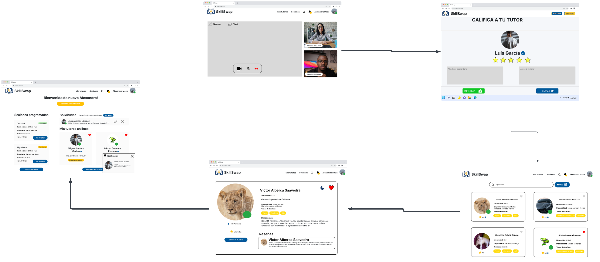

  <em>Se muestra el flujo de Calificación de Sesión</em>
</p>

**Explicación del Flujo (Donación Voluntaria):**
Este flujo muestra el cierre del ciclo de aprendizaje, la retención del usuario mediante la retroalimentación y la monetización de la plataforma a través de la pasarela de pagos.
* **Condición:** El usuario desea dejar retroalimentación para ayudar a la reputación del tutor y cuenta con la disposición de realizar un aporte económico.
1. Al finalizar una sesión, la plataforma redirige automáticamente al usuario al Mock-up de Calificación y Donación.
2. El usuario califica y escribe un comentario positivo sobre la enseñanza.
3. En la misma pantalla, el usuario selecciona un monto predefinido o ingresa un monto personalizado y presiona el botón "Realizar Donación".
4. Le pide agregar su tarjeta si es que es necesario y no tiene la opción de guardado (opcional)
5. El sistema lo redirige al Mock-up de Pasarela de Pagos (integración con Stripe/PayPal), donde ingresa los datos de su tarjeta y confirma la transacción.

**Representación visual:**
<p align="center">
  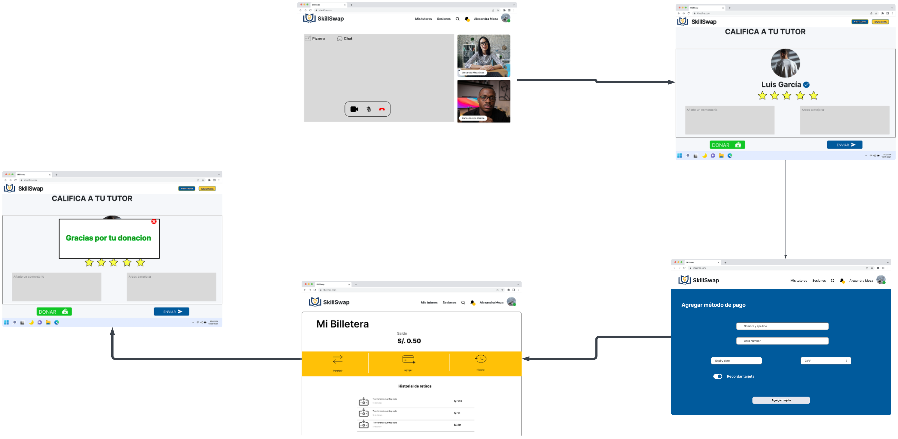

  <em>Se muestra el flujo de Donación Voluntaria</em>
</p>


---

## 4.5. Web Applications Prototyping

Esta sección presenta los prototipos de interfaz móvil para Android y iOS de la aplicación SkillSwap, con simulación de interacción y navegación. Estos prototipos se han desarrollado para demostrar visual y funcionalmente los 5 flujos de usuario (User Flows) claves definidos para las distintas personas del proyecto:

* **User Flow 1:** Búsqueda y Solicitud de Tutoría (Estudiante).
* **User Flow 2:** Recepción y Aceptación de Solicitud de Tutoría (Tutor).
* **User Flow 3:** Calificación de Sesión (Estudiante).
* **User Flow 7:** Billetera Virtual y Retiro de Fondos del Tutor.
* **Wireflow 9:** Realización de Donación Voluntaria al Tutor.

**Criterios de Interacción:** Las decisiones de diseño se basaron en dos criterios principales:
1. **Adherencia a las Guías Nativas** (Material Design de Google y Human Interface Guidelines de Apple) para garantizar una experiencia familiar y reducir la fricción.
2. **Eficiencia de tarea**, optimizando los "Happy Paths" de los flujos para que se completen con el mínimo de pasos.

**Relación con la Arquitectura de Información (IA) y User Flows:** La Arquitectura de Información define el sistema de navegación. Esto se traduce en una Tab Bar inferior en el prototipo de iOS para acceso directo a secciones clave (como "Favoritos"), mientras que en Android se opta por un Menú Lateral para agrupar estas mismas secciones, un patrón tradicional en esa plataforma.

Las interacciones grabadas en los videos de demostración siguen los pasos exactos descritos en los User Flow Diagrams, demostrando tanto los "Happy Paths" (solicitar una tutoría), como los "Unhappy Paths" (no encontrar resultados de búsqueda).

---

### 4.5.1. Android Mobile Applications Prototyping

Esta propuesta sigue las guías de Material Design de Google. Se enfoca en el uso de Cards (tarjetas) para la jerarquía visual (como en el perfil y comentarios), una paleta de color definida y componentes interactivos propios de Android.

<p align="center">
  <a href="https://youtu.be/50YTngUrCFs" target="_blank">
    
  </a>
  <br>
  <em>Video 1. Demostración del prototipo interactivo en Android (Clic en la imagen para reproducir).</em>
</p>

El video demuestra los flujos de usuario clave desde la perspectiva de Material Design. Se muestra la búsqueda de estudiante, donde al presionar "Solicitar Ayuda" se levanta un modal de Android. También se demuestra la Aceptación del Tutor, donde el tutor ve la solicitud en una tarjeta y, al "Rechazar" (Unhappy Path), aparece un mensaje de confirmación. Se destacan componentes nativos como menús desplegables para filtros y ventanas para confirmaciones.

---

### 4.5.2. iOS Mobile Applications Prototyping

Esta propuesta sigue las Human Interface Guidelines de Apple, priorizando una estética limpia y animaciones fluidas. La navegación principal se centra en una Tab Bar inferior.

<p align="center">
  <a href="https://youtu.be/57n2zvjJ5Zo" target="_blank">
    
  </a>
  <br>
  <em>Video 2. Demostración del prototipo interactivo en iOS (Clic en la imagen para reproducir).</em>
</p>

Este video demuestra los mismos flujos adaptados a iOS. Se muestra dónde el usuario navega a "Mis Favoritos" usando el menú desplegable o la interacción con los elementos. Al finalizar una sesión, se visualiza el modal de calificación y el mensaje de confirmación con la moda de iOS. También, se demuestra cómo las transiciones entre la búsqueda y los resultados son mediante deslizamiento. Se destacan componentes clave de iOS como los modales de confirmación, la tab bar del navegador Safari, los pickers de rueda (reloj) para configurar la disponibilidad y las alertas nativas para las confirmaciones.

## 4.6. Domain-Driven Software Architecture

### 4.6.1. Design-Level EventStorming


<p align="center">
  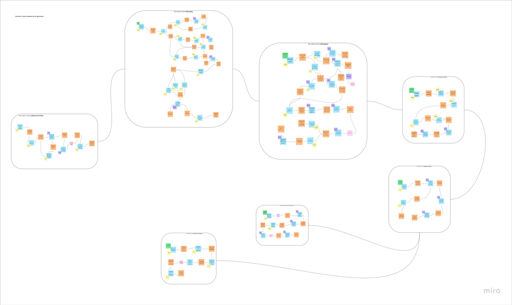
  <br>
  <em>Figura 76. Design-Level EventStorming - Elaboración propia. Nota: Este diagrama detalla el flujo de los eventos de dominio, comandos, agregados y políticas dentro de la plataforma Innovify, mapeando la lógica de negocio a nivel de diseño de software.</em>
</p>

---

**Bounded Context**

<figure style="text-align: center; margin-bottom: 40px;">
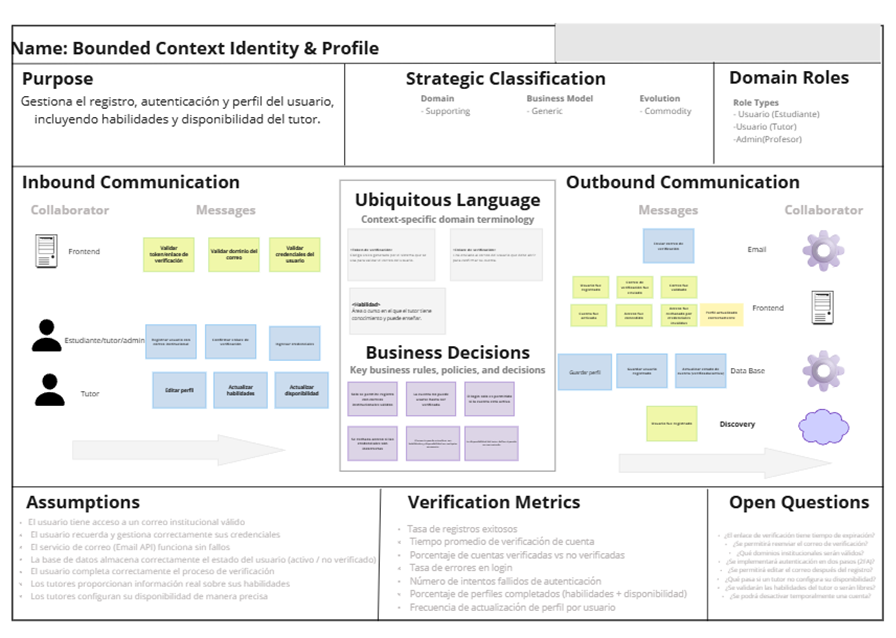
<figcaption style="margin-top: 10px;">
<em>Figura 77. Este diagrama presenta el diseño físico del Identity & Profile Bounded Context, orientado a la gestión de seguridad y personalización de usuarios en Innovify. Se detalla la segregación de responsabilidades mediante perfiles diferenciados para Estudiantes y Coordinadores, además de integrar un sistema de validación de tokens que garantiza la autenticidad de las cuentas institucionales y el control de acceso basado en roles.</em>
</figcaption>
</figure>

<figure style="text-align: center; margin-bottom: 40px;">
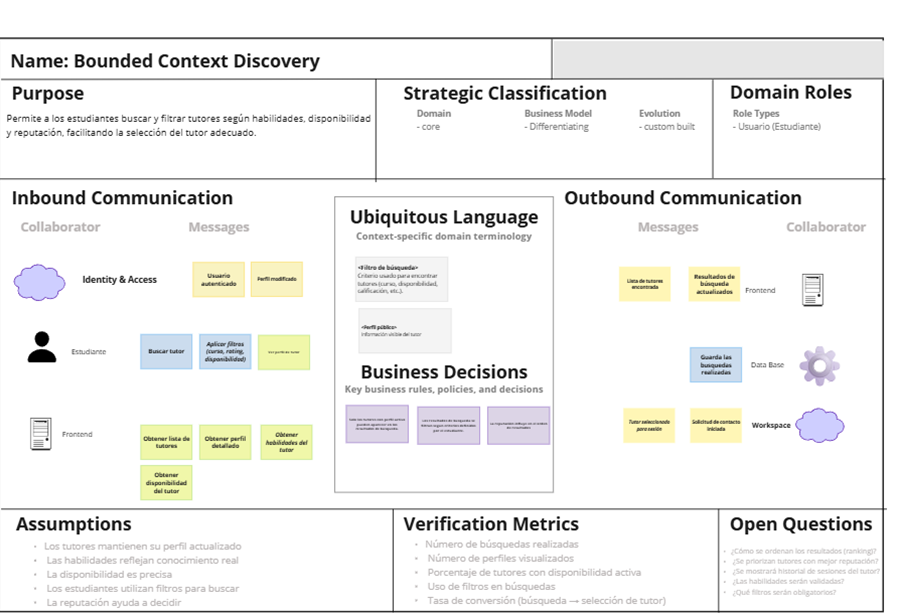
<figcaption style="margin-top: 10px;">
<em>Figura 78. Este diagrama ilustra el diseño físico del Tutoring & Operations Bounded Context, núcleo operativo de Skillswap para la gestión de sesiones académicas. Se detalla la integración entre la disponibilidad de los tutores, el flujo de reservación y ejecución en entornos virtuales, junto con un esquema de moderación diseñado para asegurar la calidad y trazabilidad de cada encuentro.</em>
</figcaption>
</figure>

<figure style="text-align: center; margin-bottom: 40px;">
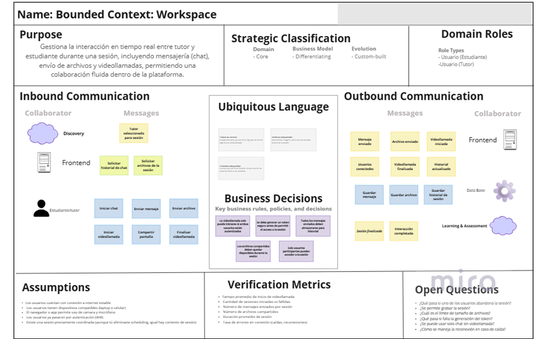
<figcaption style="margin-top: 10px;">
<em>Figura 79. Este diagrama presenta el diseño físico del Academic & Assessment Bounded Context, encargado de la gestión pedagógica y la evaluación del conocimiento en Innovify. Se detalla la estructura para la creación de quizzes, la gestión de bancos de preguntas y el almacenamiento de resultados, permitiendo generar métricas de desempeño precisas para validar el progreso académico y las competencias de los estudiantes.</em>
</figcaption>
</figure>

<figure style="text-align: center; margin-bottom: 40px;">
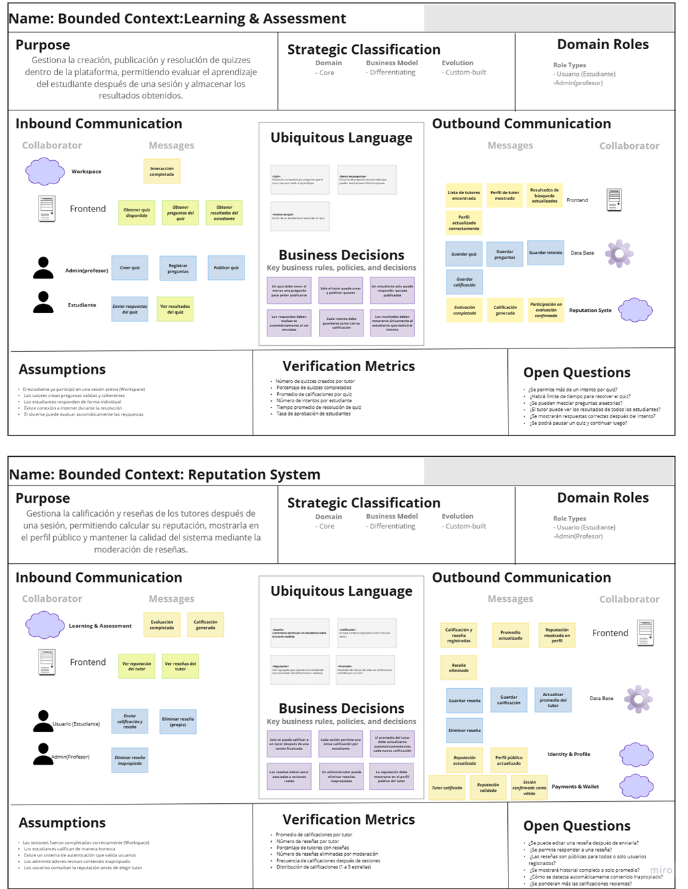
<figcaption style="margin-top: 10px;">
<em>Figura 80. Este diagrama presenta el diseño físico del Monetization Bounded Context, encargado de la gestión financiera y el flujo de capital en Innovify. Se detalla la estructura de las wallets virtuales, el procesamiento de donaciones y la liquidación automática de comisiones, asegurando la transparencia, integridad y trazabilidad de todas las transacciones económicas realizadas entre los usuarios y la plataforma.</em>
</figcaption>
</figure>

<figure style="text-align: center; margin-bottom: 40px;">
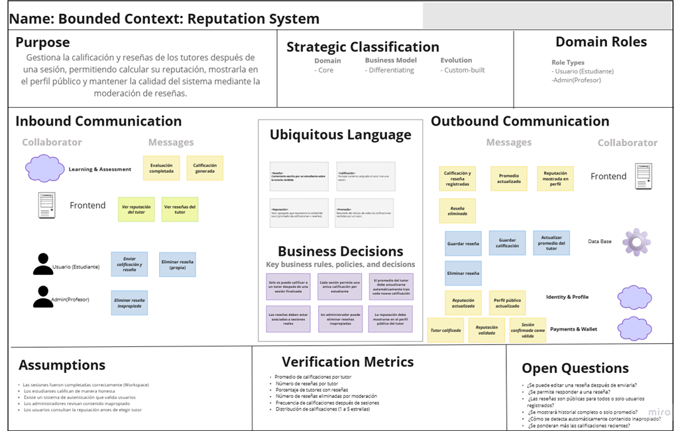
<figcaption style="margin-top: 10px;">
<em>Figura 81. Este diagrama presenta el diseño físico del Shared Kernel & Infrastructure Context, centralizando las preocupaciones transversales de Innovify. Se detalla la estructura para el almacenamiento de logs de auditoría, la gestión de configuraciones globales y el control de notificaciones del sistema, proporcionando una base técnica común que asegura la trazabilidad de eventos y la consistencia operativa en todos los módulos de la plataforma.</em>
</figcaption>
</figure>

<figure style="text-align: center; margin-bottom: 40px;">
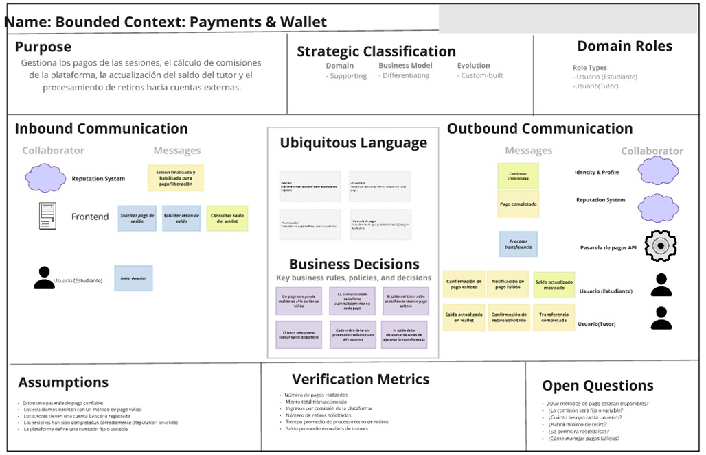
<figcaption style="margin-top: 10px;">
<em>Figura 82. Este diagrama presenta el diseño físico del Reputation & Gamification Bounded Context, orientado a gestionar la credibilidad y el sistema de logros en Innovify. Se detalla la estructura para el procesamiento de las reviews, la consolidación de métricas de desempeño y la asignación de insignias de reconocimiento, permitiendo incentivar la excelencia académica y fortalecer la confianza dentro de la comunidad.</em>
</figcaption>
</figure>

<figure style="text-align: center; margin-bottom: 40px;">
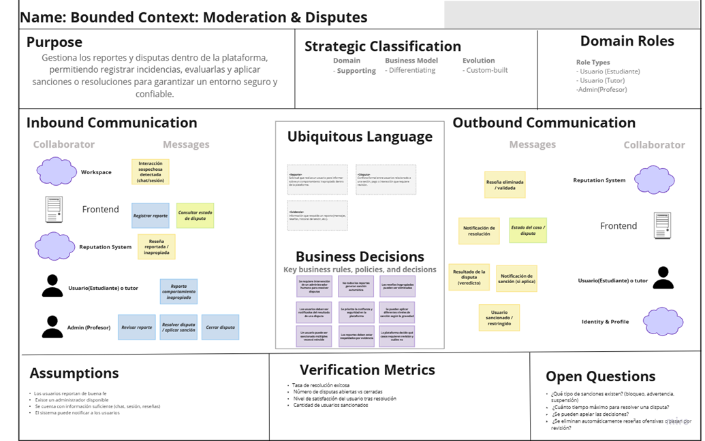
<figcaption style="margin-top: 10px;">
<em>Figura 83. Este diagrama presenta el diseño físico del Communication & Notifications Bounded Context, destinado a gestionar las alertas y el flujo de mensajes en Innovify. Se detalla la estructura para la entrega de notificaciones en tiempo real, la categorización de avisos y la persistencia de interacciones, asegurando una comunicación constante, efectiva y oportuna entre estudiantes, tutores y coordinadores.</em>
</figcaption>
</figure>

---

**Flujos de escenarios**
<figure style="text-align: center; margin-bottom: 40px;">
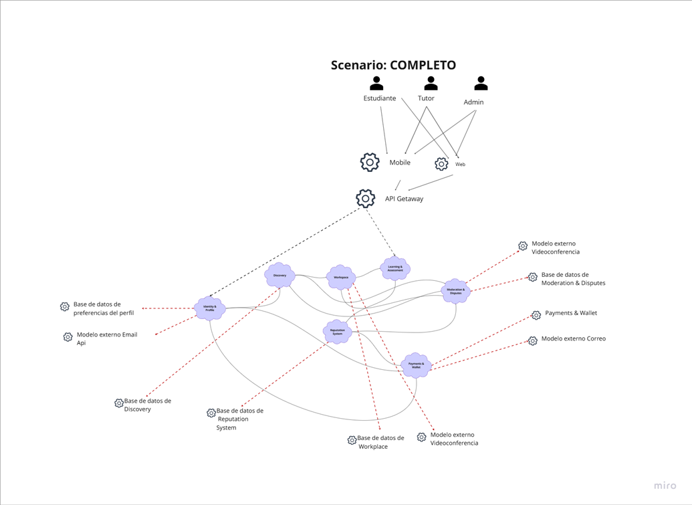
<figcaption style="margin-top: 10px;">
<em>Figura 84. Wireflow de Búsqueda y Solicitud de Tutoría para la aplicación móvil. Se ilustra la ruta del estudiante desde el filtrado de tutores y revisión de perfiles hasta la selección de horarios y confirmación de la reserva, garantizando una experiencia de usuario fluida y orientada a la contratación ágil de servicios académicos.</em>
</figcaption>
</figure>

<figure style="text-align: center; margin-bottom: 40px;">
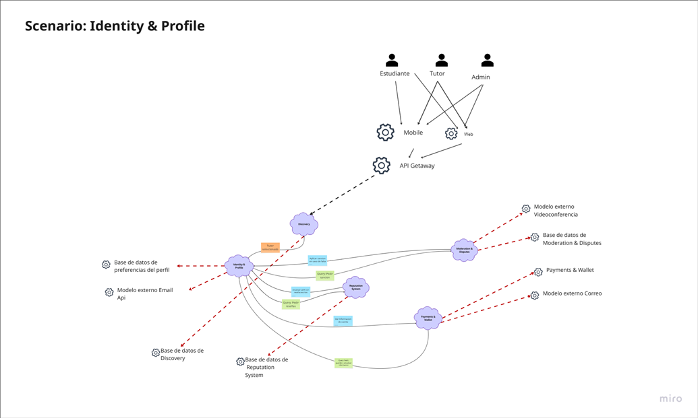
<figcaption style="margin-top: 10px;">
<em>Figura 85. Wireflow de Recepción y Aceptación de Solicitud desde la perspectiva del tutor. Se visualiza el flujo que inicia con una notificación entrante, seguido de la revisión de detalles de la sesión y culmina con la acción de confirmar o rechazar el servicio, permitiendo una administración eficiente de las solicitudes.</em>
</figcaption>
</figure>

<figure style="text-align: center; margin-bottom: 40px;">
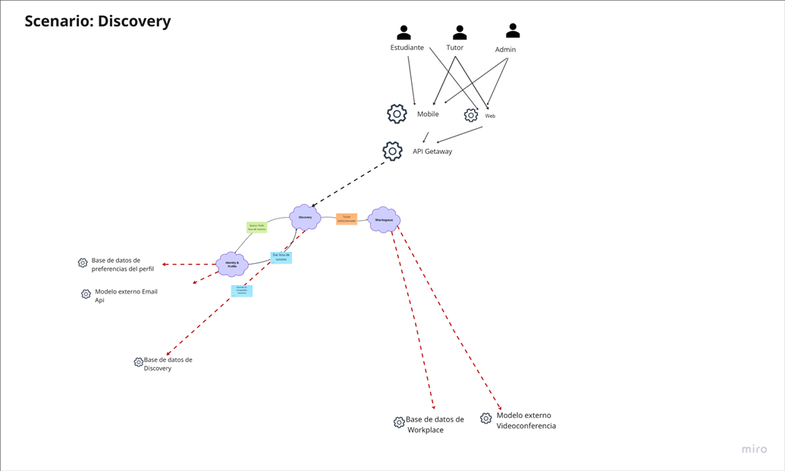
<figcaption style="margin-top: 10px;">
<em>Figura 86. Wireflow de Verificación de Estudiantes, donde el coordinador supervisa las solicitudes pendientes, valida la documentación institucional y aprueba el acceso al sistema, garantizando la seguridad y legitimidad de los perfiles en la comunidad.</em>
</figcaption>
</figure>

<figure style="text-align: center; margin-bottom: 40px;">
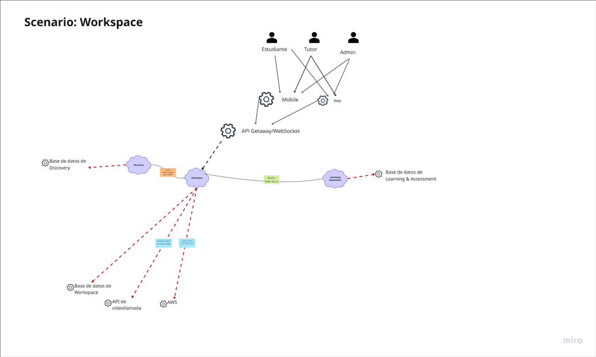
<figcaption style="margin-top: 10px;">
<em>Figura 87. Wireflow de Calificación de Sesión y Gestión de Favoritos. Se detalla el proceso donde el estudiante otorga una valoración al tutor tras concluir la sesión y administra su lista de contactos preferidos para facilitar futuras solicitudes.</em>
</figcaption>
</figure>

<figure style="text-align: center; margin-bottom: 40px;">
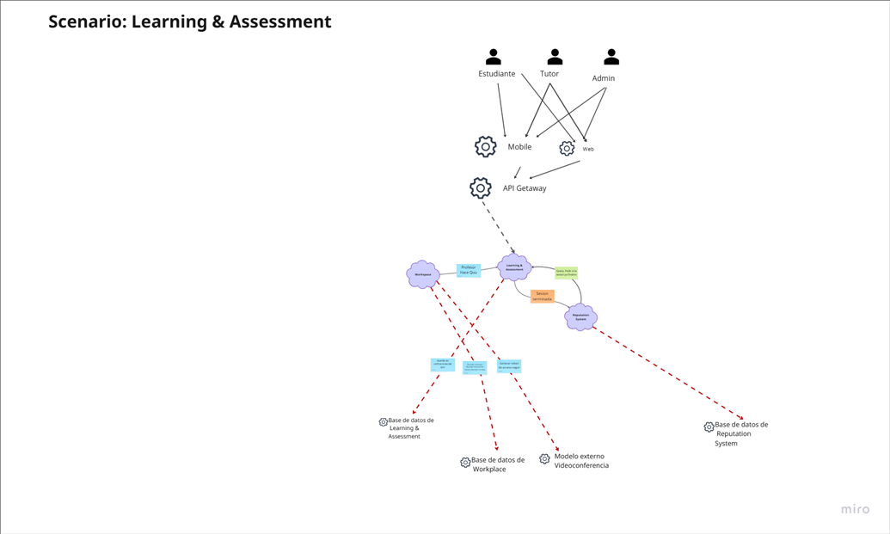
<figcaption style="margin-top: 10px;">
<em>Figura 88. Wireflow de Configuración de Perfil y Disponibilidad. Se ilustra el proceso para actualizar la información del tutor y definir sus horarios de atención, permitiendo una gestión organizada de su oferta académica en el sistema.</em>
</figcaption>
</figure>

<figure style="text-align: center; margin-bottom: 40px;">
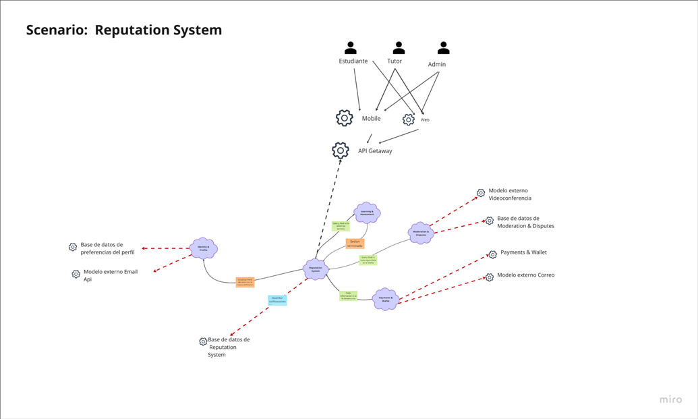
<figcaption style="margin-top: 10px;">
<em>Figura 89. Wireflow de Búsqueda Avanzada, detallando el uso de filtros por universidad y carrera para optimizar el descubrimiento de tutores y la navegación hacia sus perfiles detallados.</em>
</figcaption>
</figure>

<figure style="text-align: center; margin-bottom: 40px;">
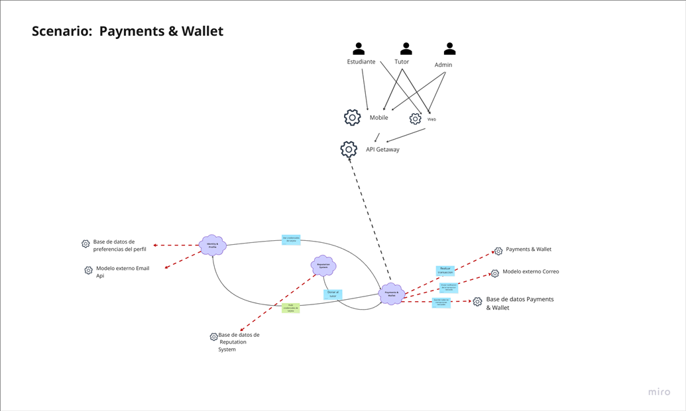
<figcaption style="margin-top: 10px;">
<em>Figura 90. Wireflow de Realización de una Sesión de Tutoría. Se ilustra la interacción en tiempo real dentro del espacio de trabajo virtual, incluyendo el acceso a la videollamada y el chat, culminando con la finalización exitosa del encuentro académico.</em>
</figcaption>
</figure>

<figure style="text-align: center; margin-bottom: 40px;">
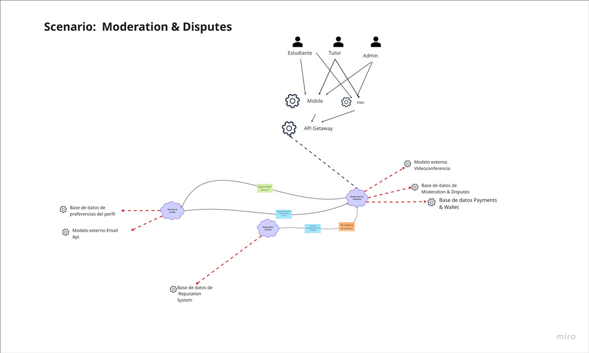
<figcaption style="margin-top: 10px;">
<em>Figura 91. Wireflow de Moderación y Disputas. Se describe el flujo de reporte de comportamientos inapropiados desde el entorno de trabajo hacia el contexto de moderación, permitiendo que el administrador gestione las evidencias y aplique las sanciones correspondientes para asegurar la integridad de la comunidad de Innovify.</em>
</figcaption>
</figure>

---

### 4.6.2. Software Architecture Context Diagram


<p align="center">
  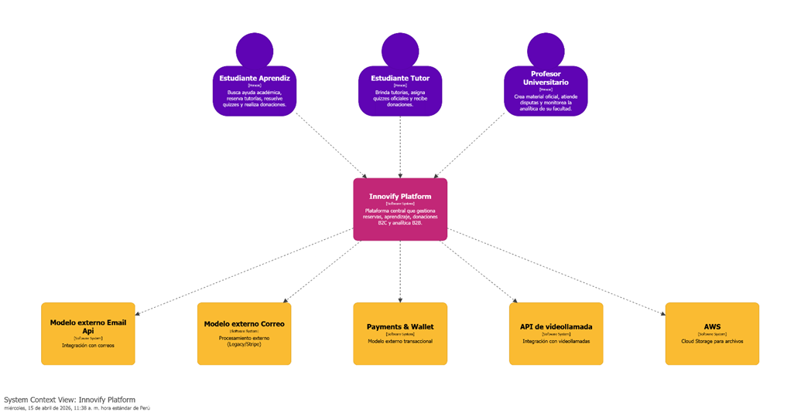
  <br>
  <em>Figura 90. C4 Model: Context Diagram - Elaboración propia. Nota: Diagrama de contexto que muestra el sistema Skillswap en el centro y sus interacciones directas con los actores principales (Estudiante Aprendiz, Tutor, Coordinador) y los sistemas externos (Pasarela de pagos Stripe, API de videollamadas WebRTC, servicio de correos, etc.).</em>
</p>

---

### 4.6.3. Software Architecture Container Diagrams


<p align="center">
  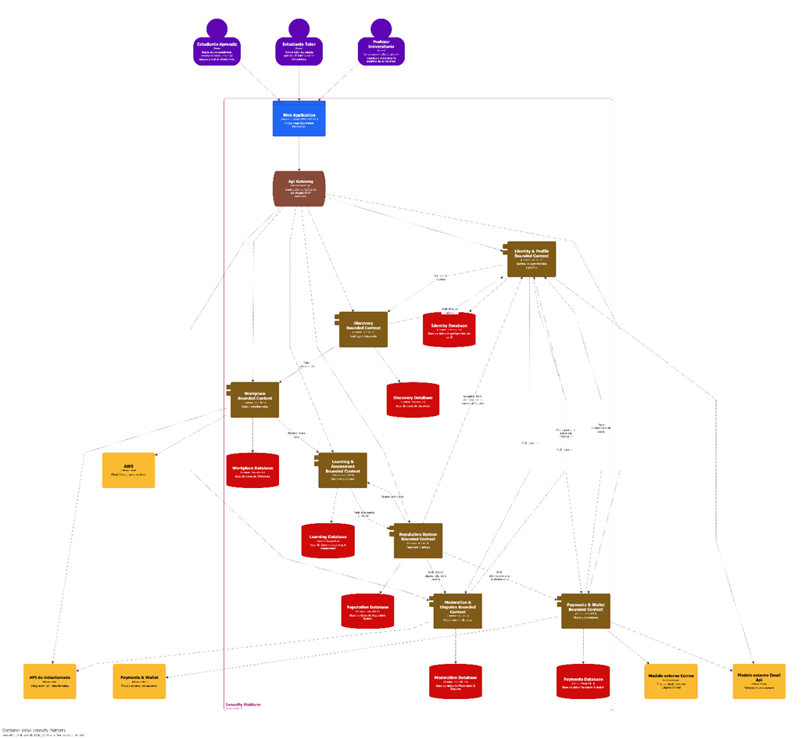
  <br>
  <em>Figura 92. C4 Model: Container Diagram - Elaboración propia. Nota: Diagrama de contenedores que ilustra la arquitectura de alto nivel desplegable del sistema (Web App en Angular, Mobile App, API Gateway, Microservicios en Java, y la Base de Datos SQL/NoSQL).</em>
</p>

---

### 4.6.4. Software Architecture Components Diagrams


<figure style="text-align: center; margin-bottom: 40px;">
  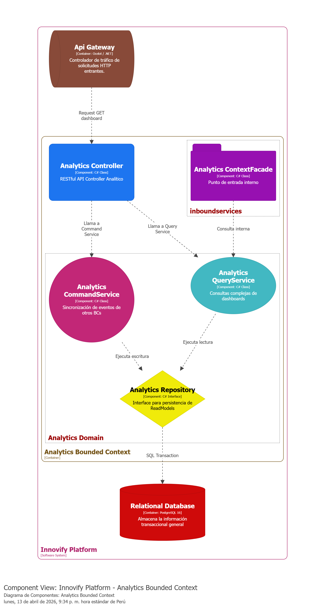
  <figcaption style="margin-top: 10px;">
    <em>Figura 93. En esta figura se observa el diagrama de componentes del Workplace Bounded Context. Se detalla la segregación de responsabilidades internas mediante los servicios de comandos (CommandService) y consultas (QueryService), además de exponer su integración hacia la infraestructura externa, específicamente con servicios de videollamadas (WebRTC) y almacenamiento en la nube (AWS S3) para la gestión de las sesiones de tutoría.</em>
  </figcaption>
</figure>
<br><br>
<figure style="text-align: center; margin-bottom: 40px;">
  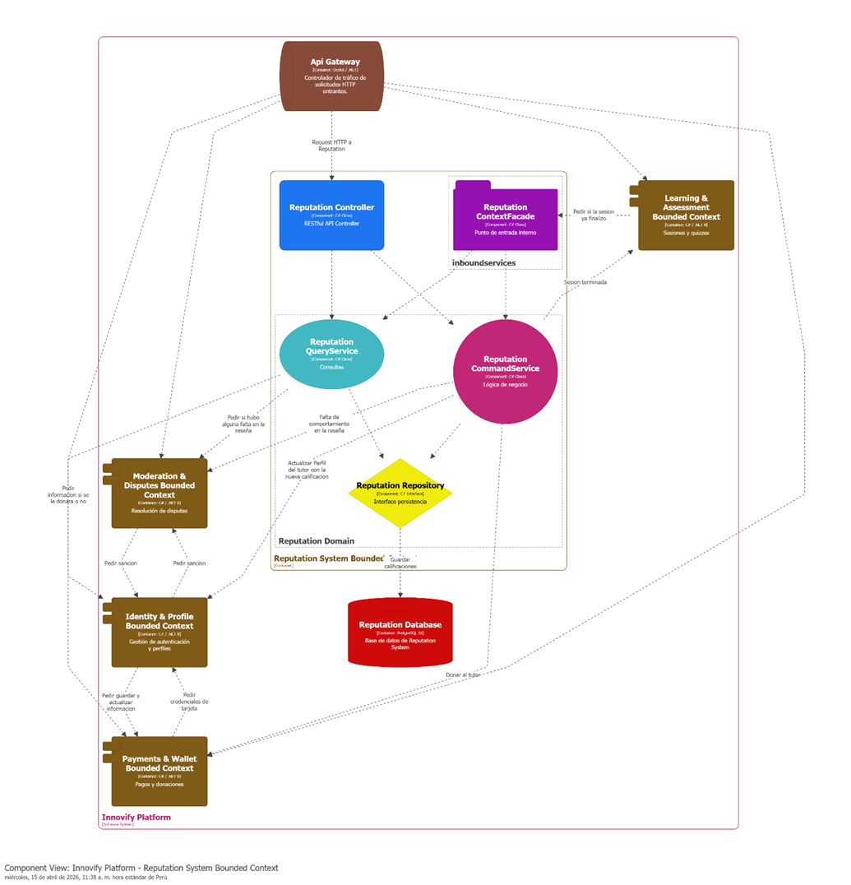
  <figcaption style="margin-top: 10px;">
    <em>Figura 94. En la imagen tenemos la representación estructural del Reputation System Bounded Context. El diagrama ilustra cómo este módulo gestiona las calificaciones y el feedback dentro de la plataforma, evidenciando sus interacciones directas con los contextos de Moderación, Identidad y Pagos para garantizar la consistencia de los datos en los perfiles de los estudiantes.</em>
  </figcaption>
</figure>
<br><br>
<figure style="text-align: center; margin-bottom: 40px;">
  
  <figcaption style="margin-top: 10px;">
    <em>Figura 95. Se observa el diseño a nivel de componentes del Payments & Wallet Bounded Context. Esta figura destaca el flujo de las operaciones financieras a través de sus controladores y capas de dominio, mostrando la delegación del procesamiento de pagos a un servicio externo (Stripe) y la conexión con una API externa para la notificación transaccional por correo electrónico.</em>
  </figcaption>
</figure>
<br><br>
<figure style="text-align: center; margin-bottom: 40px;">
  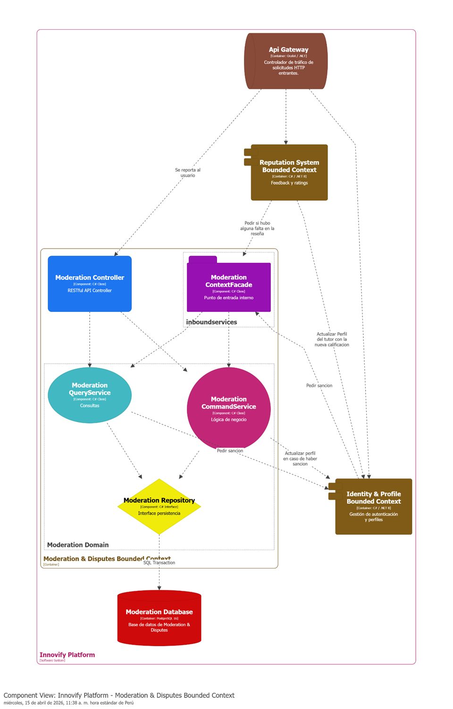
  <figcaption style="margin-top: 10px;">
    <em>Figura 96. En esta figura se detalla la estructura interna del Moderation & Disputes Bounded Context. Se representa el flujo de gestión de reportes, evidenciando cómo este módulo consulta su base de datos independiente y emite órdenes de actualización hacia los contextos de Identidad y Reputación en caso de que proceda aplicar alguna sanción a un usuario.</em>
  </figcaption>
</figure>
<br><br>
<figure style="text-align: center; margin-bottom: 40px;">
  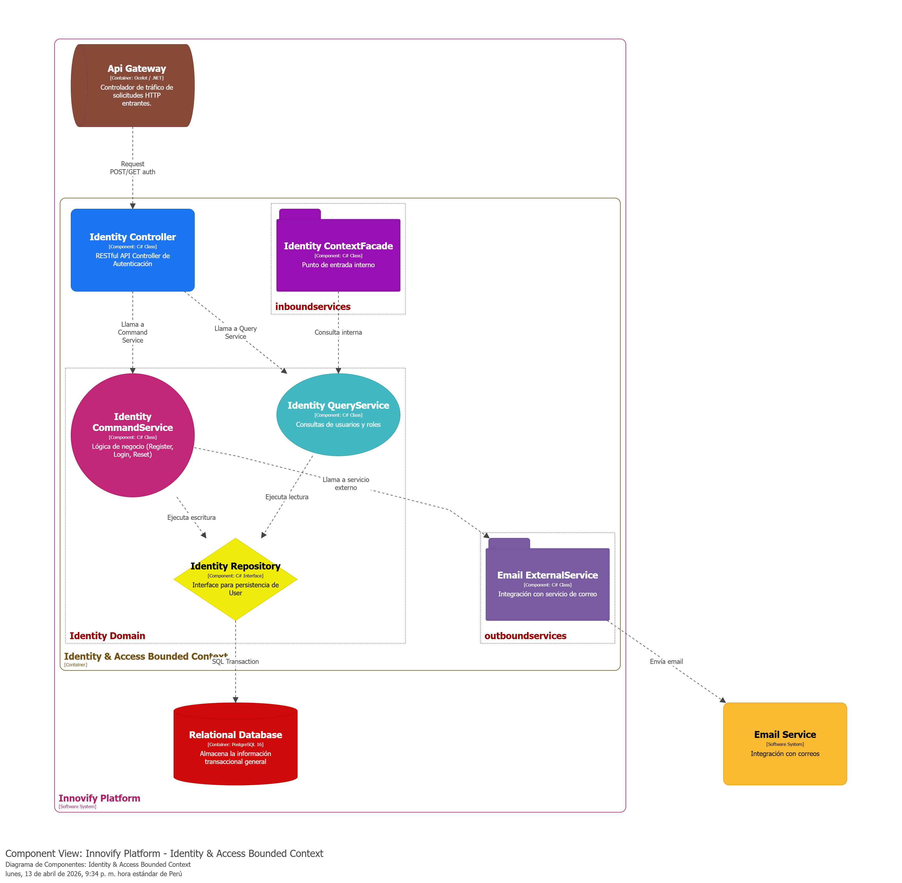
  <figcaption style="margin-top: 10px;">
    <em>Figura 97. En esta figura se observa el diagrama de componentes del Learning & Assessment Bounded Context. Se detalla el flujo de gestión de cuestionarios (quizzes) y sesiones, mostrando su comunicación mediante el API Gateway y su integración directa con los contextos de Workplace y Reputation System para coordinar y registrar la finalización de las sesiones de tutoría.</em>
  </figcaption>
</figure>
<br><br>
<figure style="text-align: center; margin-bottom: 40px;">
  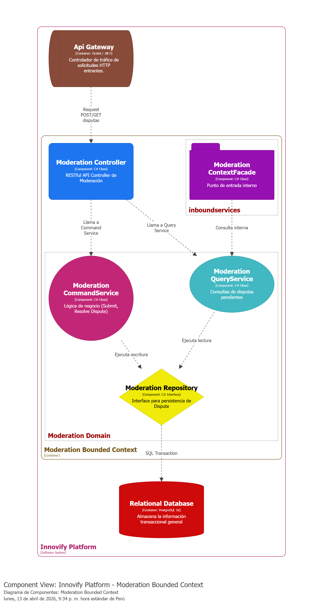
  <figcaption style="margin-top: 10px;">
    <em>Figura 98. En la imagen tenemos una representación estructural del Learning & Assessment Bounded Context que resalta la segregación de responsabilidades. Se identifican claramente los servicios de comandos (CommandService) y consultas (QueryService) interactuando a través del patrón repositorio con una base de datos PostgreSQL, la cual se encarga de persistir las calificaciones de los cuestionarios.</em>
  </figcaption>
</figure>
<br><br>
<figure style="text-align: center; margin-bottom: 40px;">
  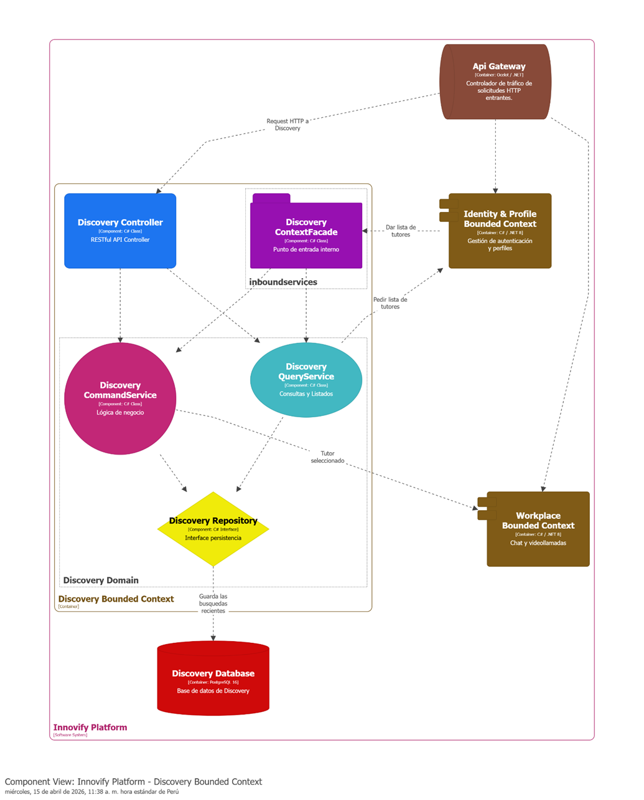
  <figcaption style="margin-top: 10px;">
    <em>Figura 99. En esta figura se detalla la estructura interna del Discovery Bounded Context. Se representa cómo este módulo procesa las búsquedas dentro de la plataforma, evidenciando que solicita la lista de usuarios al Identity & Profile Bounded Context y, una vez que el estudiante elige una opción, envía la información del perfil al Workplace Bounded Context para iniciar la comunicación.</em>
  </figcaption>
</figure>
<br><br>
<p style="text-align: center;">
  <em>Figura 100. C4 Model: Component Diagram - Elaboración propia. Nota: Diagrama de componentes que detalla la estructura interna y las responsabilidades (Controladores, Servicios, Repositorios) de uno de los contenedores principales de la plataforma.</em>
</p>

## 4.7. Software Object-Oriented Design

### 4.7.1. Class Diagrams

La arquitectura del sistema se ha modelado bajo el enfoque de Domain-Driven Design (DDD) para garantizar una alta cohesión y un bajo acoplamiento. Con el objetivo de facilitar el análisis del dominio y asegurar la legibilidad técnica, la representación visual del backend se ha segmentado. A continuación, se presentan los diagramas de clases correspondientes a los 8 Bounded Contexts identificados, detallando sus respectivos Agregados, Entidades y Objetos de Valor (Value Objects).

Acá se presenta el diagrama de clases con sus respectivos Bounded Context:

<figure style="text-align: center; margin-bottom: 40px;">
  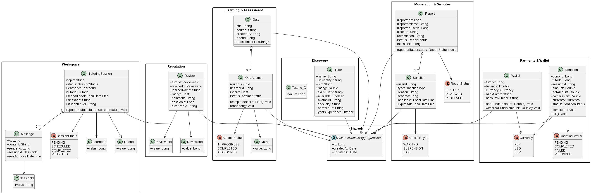
  <figcaption style="margin-top: 10px;">
    <em>Figura 101. En esta figura se observa el diagrama de clases UML que define el modelo de dominio central de la plataforma. Se detallan exhaustivamente las Entity, Aggregates y Value Objects, ilustrando las reglas y relaciones de negocio entre los actores (como Learner y Tutor) y los componentes operativos, destacando los elementos para la coordinación de sesiones, el manejo del chat y la gestión de disputas.</em>
  </figcaption>
</figure>
<br>

---

<figure style="text-align: center; margin-bottom: 40px;">
  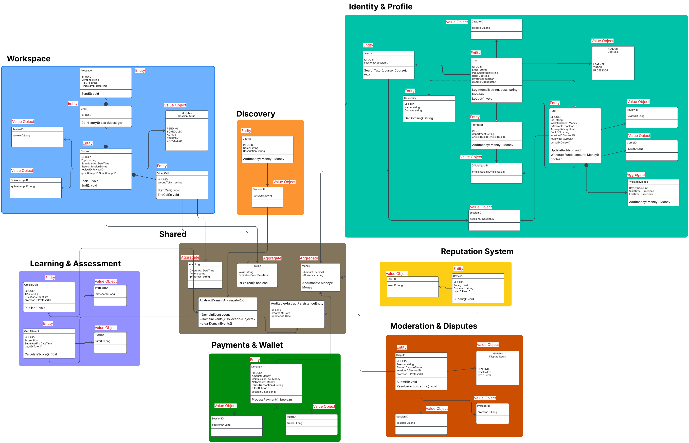
  <figcaption style="margin-top: 10px;">
    <em>Figura 102. En la imagen tenemos la representación estratégica de la arquitectura bajo los principios de Domain-Driven Design (DDD). Se evidencia cómo el modelo de dominio global ha sido segmentado en múltiples contextos delimitados (Bounded Contexts) independientes, tales como Workspace, Identity & Profile y Discovery, identificando también un núcleo de elementos compartidos (Shared) que conecta los diferentes módulos para mantener la integridad del sistema.</em>
  </figcaption>
</figure>
<br>
<p style="text-align: center;">
  <em>Nota: Diagrama de Clases & Diagrama separados respectivamente con sus Bounded Context: Skillswap - Elaboración propia.</em>
</p>
<br>
En conjunto, ambas representaciones permiten comprender tanto la estructura interna del dominio como su organización a nivel arquitectónico. Mientras el diagrama de clases detalla las entidades y sus relaciones clave, el Bounded de contextos muestra cómo estos elementos se distribuyen en módulos independientes y cohesionados. Esto facilita la escalabilidad, el mantenimiento y una mejor alineación entre las reglas de negocio y la implementación del sistema.

---

## 4.8. Database Design

Para garantizar la persistencia, integridad y escalabilidad de la información en Skillswap, el equipo ha optado por un sistema de gestión de bases de datos relacional.

El diseño físico de la base de datos se ha estructurado aplicando los principios de Domain-Driven Design (DDD). Para evitar un modelo de datos monolítico y altamente acoplado, la arquitectura de la base de datos se ha dividido en cuatro Bounded Contexts (Contextos Delimitados). Cada contexto agrupa las tablas, columnas, restricciones (Primary Keys y Foreign Keys) y relaciones estrictamente necesarias para resolver un dominio específico del negocio, promoviendo la alta cohesión y el bajo acoplamiento.

Los cuatro contextos que rigen el ecosistema de Skillswap son: Identity & Profile Context, Workespace Context, Learning Contex, Payment context y Discovery Context.

### 4.8.1. Database Diagrams

A continuación se presenta el diagrama de base de datos de SkillSwap, el cual refleja los objetos de persistencia identificados en el diagrama de clases para cada bounded context. Cada BC gestiona sus propias tablas de forma independiente, siguiendo los principios de Domain-Driven Design.

---

**Bounded Context: Workspace**

Contiene las tablas `tutoring_sessions` y `messages`. La tabla `tutoring_sessions` almacena las sesiones de tutoría con sus campos `topic`, `status`, `learner_id`, `tutor_id`, `scheduled_at`, `message` y `student_level`. La tabla `messages` almacena los mensajes intercambiados en cada sesión, relacionada con `tutoring_sessions` mediante `session_id`.

<p align="center">
  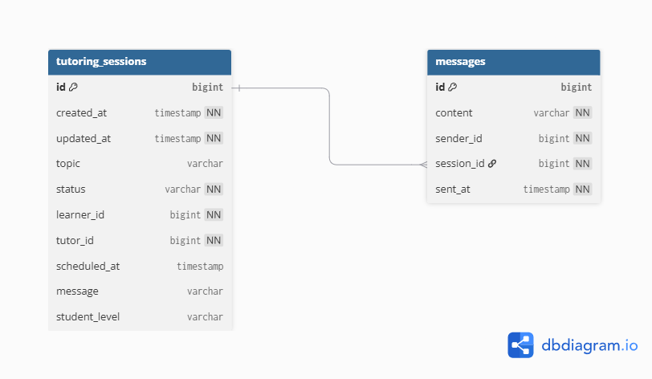
  <br>
  <em>Figura. Diagrama de base de datos del Bounded Context Workspace - Elaboración propia.</em>
</p>

---

**Bounded Context: Discovery**

Contiene las tablas `tutors` y `tutor_skills`. La tabla `tutors` almacena el perfil completo del tutor incluyendo `name`, `university`, `bio`, `rating`, `available`, `specialty`, `portfolio_url` y `years_experience`. La tabla `tutor_skills` es una tabla de colección que almacena las habilidades de cada tutor mediante `@ElementCollection`.

<p align="center">
  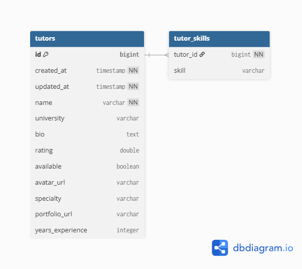
  <br>
  <em>Figura. Diagrama de base de datos del Bounded Context Discovery - Elaboración propia.</em>
</p>

---

**Bounded Context: Reputation**

Contiene la tabla `reviews` con los campos `tutor_id`, `learner_id`, `learner_name`, `rating`, `comment`, `session_id` y `tutor_reply`, más los campos de auditoría `created_at` y `updated_at` heredados del Shared.

<p align="center">
  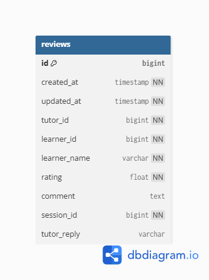
  <br>
  <em>Figura. Diagrama de base de datos del Bounded Context Reputation - Elaboración propia.</em>
</p>

---

**Bounded Context: Learning & Assessment**

Contiene las tablas `quizzes`, `quiz_questions` y `quiz_attempts`. La tabla `quizzes` almacena los quizzes creados por tutores. La tabla `quiz_questions` es una tabla de colección para las preguntas de cada quiz, relacionada con `quizzes` mediante `quiz_id`. La tabla `quiz_attempts` registra los intentos de los learners con su `score` y `status` (IN_PROGRESS, COMPLETED, ABANDONED).

<p align="center">
  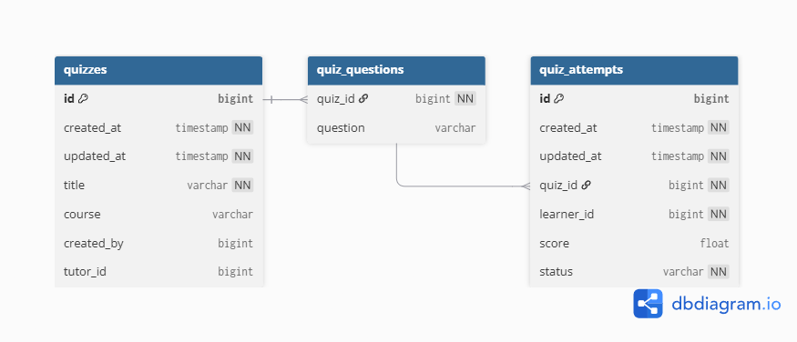
  <br>
  <em>Figura. Diagrama de base de datos del Bounded Context Learning & Assessment - Elaboración propia.</em>
</p>

---

**Bounded Context: Moderation & Disputes**

Contiene las tablas `reports` y `sanctions`. La tabla `reports` almacena los reportes de mala conducta con su `status` (PENDING, REVIEWED, RESOLVED). La tabla `sanctions` almacena las sanciones aplicadas con su `type` (WARNING, SUSPENSION, BAN), relacionada con `reports` mediante `report_id`.

<p align="center">
  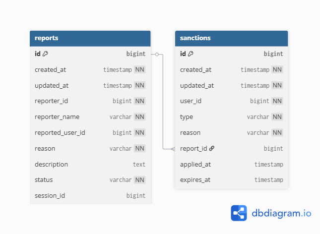
  <br>
  <em>Figura. Diagrama de base de datos del Bounded Context Moderation & Disputes - Elaboración propia.</em>
</p>

---

**Bounded Context: Payments & Wallet**

Contiene las tablas `donations` y `wallets`. La tabla `donations` almacena las donaciones con cálculo automático de `net_amount` y `commission`. La tabla `wallets` almacena el balance del tutor con restricción `unique` en `tutor_id` para garantizar una wallet por tutor.

<p align="center">
  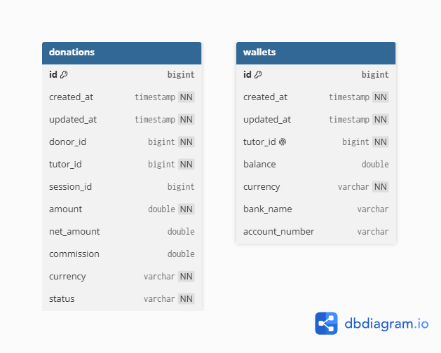
  <br>
  <em>Figura. Diagrama de base de datos del Bounded Context Payments & Wallet - Elaboración propia.</em>
</p>

---

**Diagrama General**

A continuación se presenta el diagrama relacional completo de SkillSwap, mostrando todas las tablas y sus relaciones entre bounded contexts.

<p align="center">
  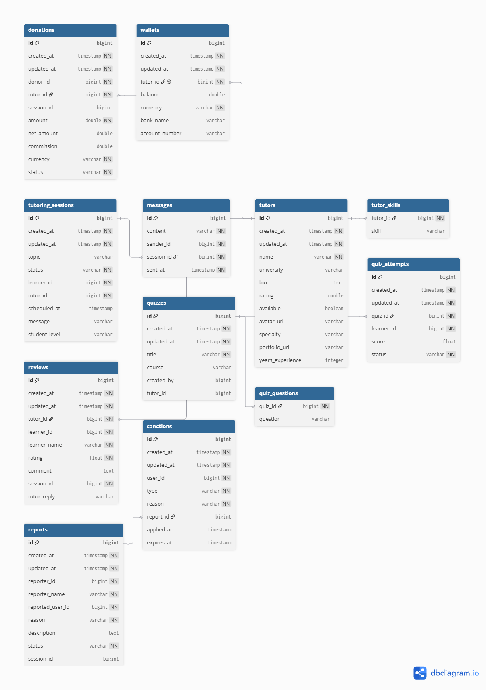
  <br>
  <em>Figura. Diagrama de Base de Datos Relacional completo de SkillSwap - Elaboración propia. Nota: Este diagrama Entidad-Relación ilustra la estructura física de los datos agrupada por dominios, asegurando la integridad referencial y un bajo acoplamiento.</em>
</p>

En síntesis, el diagrama relacional evidencia una estructura de base de datos sólida y coherente, donde la correcta definición de tablas, claves y relaciones asegura la integridad y consistencia de la información. Este diseño no solo respalda eficientemente las operaciones del sistema, sino que también facilita su escalabilidad y mantenimiento a largo plazo.
---

# Capítulo V: Product Implementation

## 5.1. Software Configuration Management

### 5.1.1. Software Development Environment Configuration

En esta sección se detallan las herramientas de software y plataformas SaaS utilizadas para la colaboración en el ciclo de vida del producto, clasificadas según su propósito y tipo de acceso.

| Software | Actividad | Tipo | Propósito de uso | Ruta de Referencia / Descarga |
| :--- | :--- | :---: | :--- | :--- |
| **Trello** | Project Management | SaaS | Gestión ágil del proyecto, administración del Product Backlog, planificación de Sprints y asignación de tareas. | [trello.com](https://trello.com/) |
| **Miro** | Requirements Management | SaaS | Elaboración colaborativa de User Story Mapping, escenarios As-Is/To-Be, diagramas C4 y flujos de usuario. | [miro.com](https://miro.com/) |
| **Figma** | Product UX/UI Design | SaaS | Diseño de la interfaz de usuario (wireframes, mockups y prototipos interactivos) para versiones web y móvil. | [figma.com](https://figma.com) |
| **Visual Studio Code** | Software Development | Local | Editor de código fuente principal para el desarrollo de la Landing Page (HTML, CSS, JS) y pruebas. | [code.visualstudio.com/download](https://code.visualstudio.com/download) |
| **GitHub** | Software Development | SaaS | Alojamiento del repositorio remoto, control de versiones distribuido y colaboración de código. | [github.com](https://github.com) |
| **GitHub Pages** | Software Deployment | SaaS | Plataforma para el despliegue continuo y hosting de la Landing Page, permitiendo el acceso público al producto. | [pages.github.com](https://pages.github.com/) |
| **Microsoft Word Online** | Software Documentation | SaaS | Redacción colaborativa del informe técnico, especificación de requerimientos y documentación del sistema. | [office.com](https://www.office.com/) |
| **Canva** | Software Documentation | SaaS | Diseño de recursos visuales, diagramas explicativos y presentaciones de los artefactos del proyecto. | [canva.com](https://www.canva.com/) |
| **Microsoft PowerPoint** | Software Documentation | Local | Creación de material de exposición y documentación visual de soporte para las entregas del ciclo de vida. | [microsoft.com/powerpoint](https://www.microsoft.com/microsoft-365/powerpoint) |

*(Tabla 15.  Software Development Environment Configuration - Elaboración propia.)*
---

### 5.1.2. Source Code Management

Para administrar el código fuente del proyecto, el equipo empleará Git como sistema distribuido de control de versiones y GitHub como el entorno principal de colaboración. Esto permitirá conservar un registro detallado de todas las modificaciones, optimizar el trabajo en conjunto entre los miembros y garantizar la trazabilidad de cada versión del software.

#### Repositorios GitHub

* **Landing Page:** Repositorio público para la página de presentación del producto. 
  * Enlace: https://github.com/Open-Source-2026-1/SkillSwape-UPC.git 
* **Frontend Web Application:** Repositorio para la aplicación web transaccional (Desarrollada en Typescript/Angularr) donde interactúan los estudiantes y profesores.
  * Enlace: https://github.com/Open-Source-2026-1/Frontend-SkillSwap.git
* **Web Services:**  Repositorio para la API RESTful desarrollada en Java con Spring Boot, incluyendo la implementación de controladores, servicios y repositorios, así como pruebas unitarias y de integración.
  * Enlace: https://github.com/Open-Source-2026-1/Backend-Skillswap.git
* **Acceptance Test:** Repositorio en el que se encuentran los archivos (`.feature`) en formato Gherkin.
  * Enlace: https://github.com/Open-Source-2026-1/AcceptanceTests.git
* **Base de datos:** Repositorio en el que se encuentra el archivo json con la base de datos del proyecto.
  * Enlace: https://github.com/Open-Source-2026-1/db-skillswap.git

* **Open-Source-2026-1:** Enlace de la organización en el que se encuentran los repositorios
  * Enlace: [https://github.com/Open-Source-2026-1](#)

<br><br>
<p align="center">
  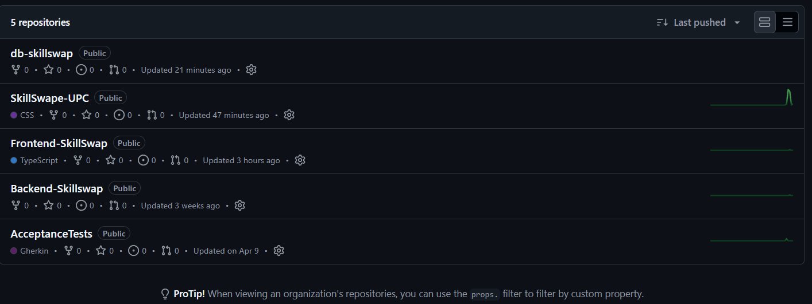
  <br>
  <em>Figura 104. En esta figura se observa el panel principal de la organización del proyecto en GitHub, evidenciando la separación modular del código fuente. Se listan cuatro repositorios públicos independientes que corresponden a la página principal (SkillSwape-UPC), la lógica del servidor (Backend-Skillswap), la interfaz de usuario (Frontend-SkillSwap) y las pruebas de validación (AcceptanceTests).</em>
</p>

#### Implementación GitFlow

**Ramas principales:**
* `main`: La rama principal, contiene la versión estable del proyecto. Cada commit indicará una nueva versión de la landing page.
* `develop`: Rama dedicada a integrar nuevas funcionalidades antes de su lanzamiento oficial hacia la rama principal.

**Ramas adicionales:**
* `feature/...`: Estas ramas estarán dedicadas a los cambios de cada función de nuestro proyecto. Serán unidas en develop para finalmente ser testeadas.
* `release/...`: Ramas dedicadas a cambios menores y últimas revisiones antes de subir una versión al main.
* `hotfix/...`: Dedicadas a arreglar errores graves de la versión final en main (por ejemplo: bugs) que necesitan solución inmediata. Esta se unirá nuevamente en develop para darle una última revisión y finalmente subirla al main como una nueva versión.

#### Semantic Versioning

Para nuestro proyecto usaremos Semantic Versioning 2.0.0 para etiquetar nuestras versiones, lo cual tiene el siguiente formato: MAJOR.MINOR.PATCH (X.X.X). Usaremos MAJOR para cambios grandes que rompan compatibilidad con otras versiones y su cambio en la versión afectará al número principal (primera cifra), MINOR para la agregación de nuevas funcionalidades compatibles con la versión existente y modificará el segundo dígito de la versión y finalmente PATCH para correcciones pequeñas como simples bugs, ajustes visuales o errores tipográficos, su cambio modificará la tercera cifra.


*Ejemplo: V1.0.0 -> V2.0.0 (cambios MAJOR), V1.0.0 -> V1.1.0 (cambios MINOR), V1.0.0 -> V1.0.1 (cambios PATCH).*

#### Conventional Commits

A partir del lanzamiento de nuestra primera versión (1.0.0) nuestros commits seguirán el formato Conventional Commits, con la designación: tipo(breve descripción al lugar del cambio): explicación de los cambios.
Los tipos de commits serán: feat(funcionalidad) para agregar nuevas funcionalidades, fix(lugar de arreglo) para arreglar errores, docs(cambio en la documentación) para editar la documentación, style(funciones o lugar específico afectado en la hoja de estilo) para cambios en el estilo sin afectar la lógica principal, refactor(lugar de cambio) para cambios en la estructura del código sin afectar la funcionalidad principal, test(objeto de prueba) para testear cambios y chore(lugar de cambio) para tareas menores de mantenimiento o configuración.

Los tipos de commits serán: 
* `feat(funcionalidad)` para agregar nuevas funcionalidades.
* `fix(lugar de arreglo)` para arreglar errores.
* `docs(cambio)` para editar la documentación.
* `style(funciones o lugar)` para cambios en el estilo sin afectar la lógica principal.
* `refactor(lugar)` para cambios en la estructura del código sin afectar la funcionalidad.
* `test(objeto)` para testear cambios.
* `chore(lugar)` para tareas menores de mantenimiento.

#### Flujo de trabajo:
1. Cada integrante clona la rama `develop` al crear una rama `feature/` para trabajar en una nueva tarea.
2. Cuando termina, realiza un *merge* hacia `develop` a través de un *pull request*.
3. Luego se crea una rama `release/` para realizar una verificación final antes de publicar la versión oficial.
4. Una vez aprobada la versión, se publica en la rama `main` con su nuevo número de versión y es eliminada la rama `release/` creada.
5. En caso de detectar pequeños errores en la versión oficial dentro de la rama `main`, se crea una rama `hotfix/` para ser resueltos de manera inmediata.


##### Aplicación de GitFlow durante el Sprint 2

Durante el Sprint 2, el equipo aplicó el flujo de trabajo GitFlow de forma 
consistente en todos los repositorios del proyecto. Cada integrante creó su 
propia rama de tipo `feature/` a partir de `develop` para trabajar en los 
módulos asignados, manteniendo el trabajo aislado y evitando conflictos 
durante la integración.

Las ramas `feature/` creadas y fusionadas durante este Sprint fueron:

| Rama | Bounded Context | Responsable |
| :--- | :--- | :--- |
| `feature/workspace-sessions` | Workspace | Victor |
| `feature/workspace-messages` | Workspace | Victor |
| `feature/discovery-courses` | Discovery | David |
| `feature/learning-progress` | Learning & Assessment | David |
| `feature/assessment-ui` | Learning & Assessment | David |
| `feature/moderation-disputes` | Moderation & Disputes | Luis |
| `feature/reputation-review` | Reputation System | Santiago |
| `feature/frontend-polish` | Global (UI consistency) | Rafael |

Una vez concluido el desarrollo en cada rama `feature/`, los cambios fueron 
integrados hacia `develop` mediante Pull Requests, donde se realizaron 
revisiones de código antes de aprobar la fusión. Al finalizar el Sprint, se 
creó una rama `release/v1.1.0` para validación final, y los cambios fueron 
publicados en `main` bajo la versión **v1.1.0** siguiendo Semantic Versioning.

A continuación se presentan las evidencias del network graph del repositorio 
durante el Sprint 2, donde se aprecia la estructura de ramas y fusiones 
realizadas:
<figure style="text-align: center; margin-bottom: 40px;">
  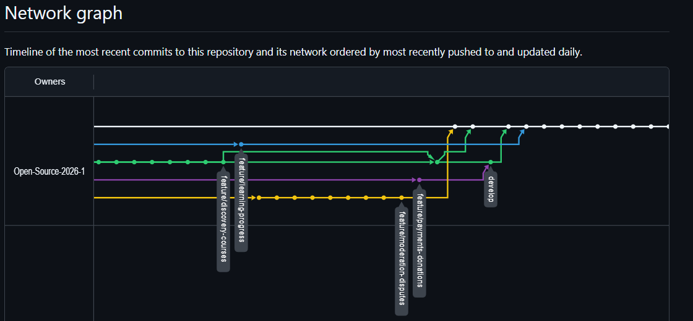
  <figcaption style="margin-top: 10px;">
  <br>
    Figura. Network graph del repositorio SkillSwap-Frontend durante el Sprint 2, 
evidenciando la aplicación de GitFlow con ramas feature/, develop y main.
  </figcaption>
</figure>

---

### 5.1.3. Source Code Style Guide & Conventions

En esta sección, el equipo establece las bases para contar con un repositorio central y organizado de uso común, asegurando una presentación consistente y enfocada en todos los productos digitales. A continuación, se detallan las referencias y convenciones adoptadas para el nombramiento de elementos y la programación en los lenguajes utilizados en la solución, garantizando que el código sea claro, estructurado y sencillo de mantener por todos los miembros del equipo. Es importante recalcar que, siguiendo un enfoque de internacionalización, se aplica estrictamente la nomenclatura en inglés para todos los elementos del código fuente

#### HTML
El equipo seguirá las recomendaciones de *HTML Style Guide and Coding Conventions*, el cual indica que, por ejemplo, los nombres de los elementos deben estar en minúsculas, la indentación debe ser de 2 espacios, usar comentarios, etc. 

Para la realización del código hemos utilizado diversos elementos como nav para la creación de un menú horizontal fijo en la parte superior de la pantalla, ul y li para la creación de listas que irán en distintos menús de la página y tendrán un formato modificado en la hoja de estilos, button para diferentes botones como iniciar sesión, regístrate, etc., section para dividir en secciones la página, img para importar imágenes, footer para un pie de página, entre otros.

También se utilizaron atributos tales como class, para agrupar elementos y poder asignarles estilos específicos, src para especificar la dirección en la que se encuentra una imagen, alt para describir la imagen cuando el usuario no tenga internet, etc.


```html
<nav class="navigation-bar">
  <div class="horizontal-menu">
    <ul class="horizontal-menu-options">
      <li><a href="sites/alianzas.html" data-i18n="nav-alianzas">Alliances</a></li>
      <li><a href="sites/proyects.html" data-i18n="nav-proyectos">Projects</a></li>
      <li><a href="sites/aboutUS.html" data-i18n="nav-sobre-nosotros">About Us</a></li>
      <button class="lang-btn active" data-lang="es" onclick="applyLanguage('es')" aria-label="Spanish">ES</button>
      <span class="lang-divider">|</span>
      <button class="lang-btn" data-lang="en" onclick="applyLanguage('en')" aria-label="English">EN</button>
    </ul>
  </div>
</nav>

<section class="call-to-action-section">
  <div class="hero-badge" data-i18n="hero-badge">Interuniversity Network of Peru</div>
  <h1 class="call-to-action-text" data-i18n="hero-title">
    
  </h1>
  <a href="sites/login.html">Sign Up</a>
</section>
```

#### CSS

Respecto a la hoja de estilos en cascada (CSS), se aplicaron distintas reglas para estructurar la apariencia del sitio. Las propiedades fueron organizadas en un orden coherente (posicionamiento, modelo de caja, tipografía, color y efectos) con el fin de mantener claridad y uniformidad en el código. Asimismo, se utilizaron nombres de clases claros y descriptivos, lo que permite que cualquier miembro del equipo pueda entender y modificar los estilos con facilidad.


```css
.navigation-bar {
  display: flex;
  background-color: var(--surface-color);
  justify-content: space-between;
  align-items: center;
  padding: 0 28px;
  height: var(--nav-bar-height);
  width: 100%;
  position: fixed;
  top: 0;
  left: 0;
  z-index: 1000;
  border-bottom: 1px solid var(--border-color);
  box-shadow: var(--shadow-sm);
}

.logo {
  display: flex;
  align-items: center;
  flex-shrink: 0;
}

.registration-form, .login-form {
  margin: 20px 0px;
  display: flex;
  flex-direction: column;
  align-items: center;
  width: 100%;
  max-width: 1200px; 
}
```

---

### 5.1.4. Software Deployment Configuration

En esta sección explicaremos cómo realizamos el despliegue (deploy) de nuestra landing page directamente desde nuestro repositorio utilizando **GitHub Pages**.

**Deploy con GitHub Pages:**

1. Primero accederemos al repositorio de la Landing Page ("SkillSwap-LandingPage") y nos dirigiremos al menú de ajustes (**Settings**) ubicado en el menú horizontal de la parte superior de la pantalla.
2. Luego, dentro de los ajustes, ubicamos la opción **Pages** en el menú vertical de la parte izquierda de la pantalla.
3. Dentro buscaremos la sección **Branch** y en el menú desplegable que por defecto tiene la opción "None", elegiremos la rama `main`. Dejaremos por defecto la carpeta `/(root)` y finalmente haremos clic en el botón **Save**.
4. Luego de unos pocos minutos (a veces segundos), al refrescar la página, GitHub automáticamente creará y mostrará el dominio en vivo de la página web.

> **Nota:** Es importante recalcar que para que este método funcione, el archivo `.html` principal (generalmente `index.html`) debe encontrarse en la raíz del repositorio, ya que elegimos la configuración de la carpeta `/(root)`.

Primero accederemos al repositorio “SkillSwap-LandingPage” y nos dirigiremos al menú de ajustes o “Settings” ubicado en el menú horizontal de la parte superior de la pantalla.

<br><br>

<figure style="text-align: center; margin-bottom: 40px;">
  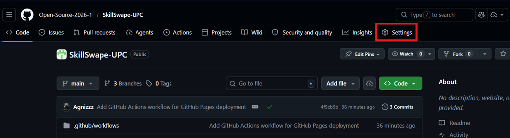
  <figcaption style="margin-top: 10px;">
  <br>
    Luego, dentro de los ajustes ubicamos la opción “Pages” en el menú vertical de la parte izquierda de la pantalla.
  </figcaption>
</figure>

<br><br>

<figure style="text-align: center; margin-bottom: 40px;">
  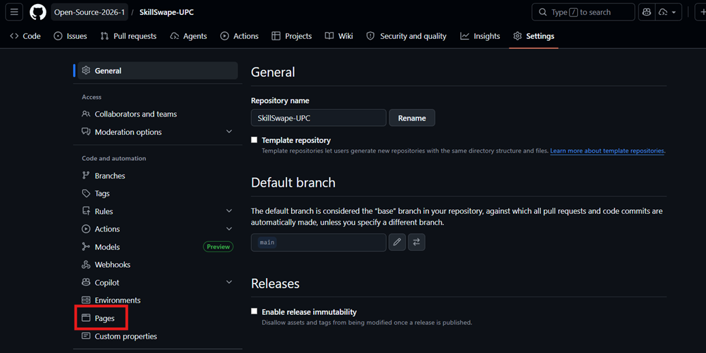
  <figcaption style="margin-top: 10px;">
    Dentro buscaremos la sección “Branch” y en el menú desplegable que por defecto tiene la opción “None” elegiremos la opción main, dejaremos por defecto la carpeta /(root) y finalmente haremos clic en “Save”.
  </figcaption>
</figure>

<br><br>

<figure style="text-align: center; margin-bottom: 40px;">
  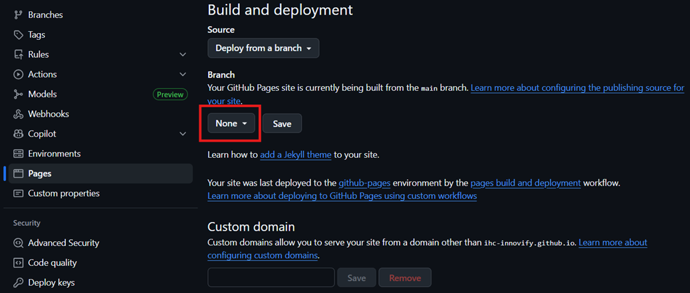
  <figcaption style="margin-top: 10px;">
    Aquí seleccionamos la opción "None" para deshabilitar el despliegue automático del sitio web desde el repositorio.
  </figcaption>
</figure>

<br><br>

<figure style="text-align: center; margin-bottom: 40px;">
  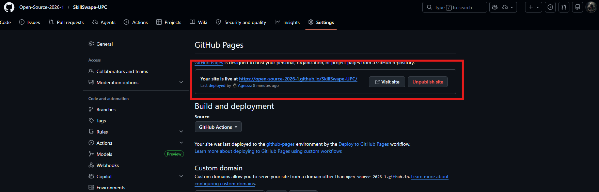
  <figcaption style="margin-top: 10px;">
    Finalmente luego de unos pocos minutos (a veces segundos), refresca la página y GitHub automáticamente creará el dominio de la página web.
  </figcaption>
</figure>

<br><br>

<figure style="text-align: center; margin-bottom: 40px;">
  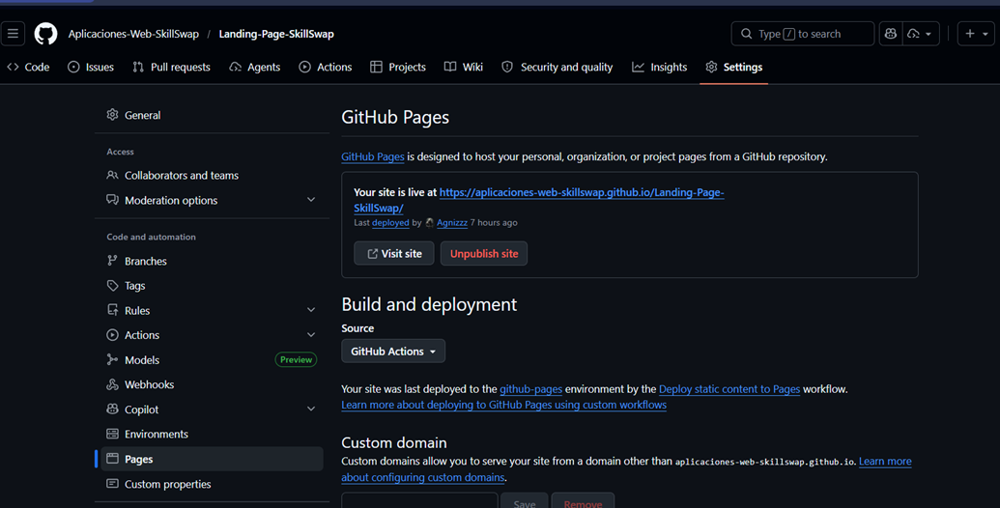
  <figcaption style="margin-top: 10px;">
    Es importante recalcar que para que el método funcione, el archivo .html debe encontrarse en la raíz del repositorio ya que elegimos la carpeta /(root), lo cual es la dirección de la raíz del repositorio.
  </figcaption>
</figure>

---

**Gestión de Ramas y Commits (GitFlow en la práctica)**

A continuación, se evidencia el trabajo colaborativo del equipo y la correcta aplicación del flujo de trabajo GitFlow dentro de nuestro repositorio:

<br>

<figure style="text-align: center; margin-bottom: 40px;">
  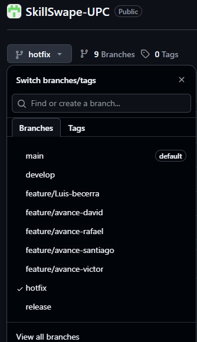
  <figcaption style="margin-top: 10px;">
    En esta imagen podemos ver algunas de las ramas o branches que cada uno de los integrantes creó y se irá creando a medida que continúe el proyecto.
  </figcaption>
</figure>

<br><br>

<p>
  Estos son algunos de los commits realizados por los integrantes en sus ramas:
</p>

<br><br>

<figure style="text-align: center; margin-bottom: 40px;">
  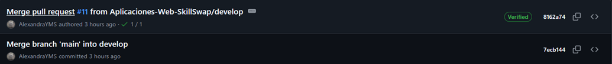
  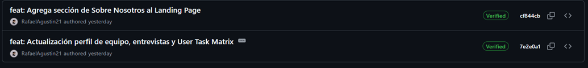
  <figcaption style="margin-top: 10px;">
    En estas imágenes se aprecia el contraste entre dos formas de gestionar commits en GitHub: por un lado, un historial desordenado con mensajes genéricos y poco informativos, lo que dificulta entender los cambios realizados; y por otro, un historial organizado que utiliza buenas prácticas como Conventional Commits, con descripciones claras y específicas que facilitan el seguimiento y comprensión del desarrollo del proyecto.
  </figcaption>
</figure>

<br><br>

<figure style="text-align: center; margin-bottom: 40px;">
  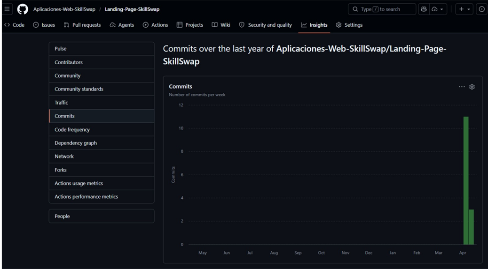
  <figcaption style="margin-top: 10px;">
    Figura 105. El gráfico estadístico detalla el volumen de commits realizados en el repositorio del proyecto SkillSwap durante el último año. Se evidencia un pico de productividad técnico significativo durante el mes de abril, superando las 40 integraciones semanales. Esta métrica refleja la fase de codificación intensiva o sprint principal, correspondiente a la implementación y consolidación de las funcionalidades core del sistema.
  </figcaption>
</figure>

<br><br>

<figure style="text-align: center; margin-bottom: 40px;">
  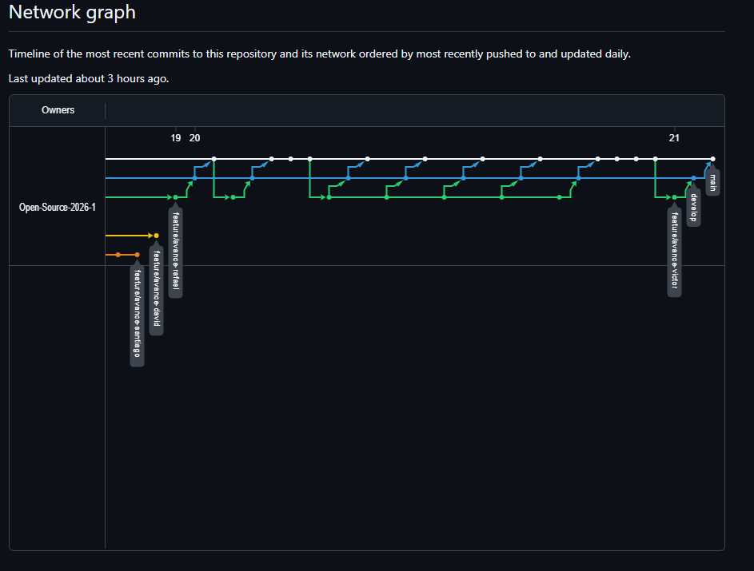
  <figcaption style="margin-top: 10px;">
   Figura 106.  El gráfico de red (network graph) ilustra la arquitectura de integración del repositorio y la correcta aplicación de la metodología Gitflow. Se distinguen claramente las líneas de desarrollo: una rama principal de producción (main), una rama base de integración (develop), y la gestión paralela de ramas de características aisladas. Este esquema garantiza un flujo de trabajo colaborativo, ordenado y libre de conflictos durante el desarrollo de la plataforma.
  </figcaption>
</figure>

<br><br>
En conjunto, los gráficos y evidencias presentadas reflejan un proceso de desarrollo activo, organizado y alineado con buenas prácticas. El alto volumen de commits durante el mes de abril demuestra una fase intensiva de implementación, mientras que el uso de Gitflow evidencia una estructura de trabajo clara que facilita la integración y el trabajo colaborativo. Asimismo, la comparación entre historiales de commits resalta la importancia de emplear convenciones adecuadas para mejorar la trazabilidad del proyecto. Finalmente, la gestión de ramas y los commits individuales de los integrantes muestran una participación distribuida y coordinada, contribuyendo a un desarrollo más ordenado, escalable y mantenible del sistema.
<br>

Enlace: [https://github.com/Open-Source-2026-1/SkillSwape-UPC.git]
---

## 5.2. Landing Page, Services & Applications Implementation

### 5.2.1. Sprint 1
En esta sección se registra y explica el avance en términos de producto y trabajo colaborativo. Incluye tres secciones internas: Sprint Backlog 1, User Interface & Execution, y Team Collaboration Insights.

| ID | User Story | Epic | Priority | SP |
| :---: | :--- | :--- | :---: | :---: |
| **US31** | Platform home screen | User Experience and Personalization | Medium | 3 |
| **US32** | View the About Us screen | User Experience and Personalization | Medium | 2 |
| **US33** | Animations and micro-interactions | User Experience and Personalization | Low | 2 |
| **US35** | Language change (ES / EN) on the Landing Page | User Experience and Personalization | High | 3 |
| **US36** | View Alliances section | User Experience and Personalization | Medium | 3 |
| **US37** | View About Us section and Technological Projection | User Experience and Personalization | Medium | 2 |
| **US38** | View Solutions and Features section | User Experience and Personalization | High | 3 |
| | | | **Total Story Points** | **18** |

*(Tabla 16.  Tabla de  Sprint 1  - Elaboración propia.)*

#### 5.2.1.1. Sprint Planning 1

Esta sección detalla los aspectos principales de la reunión de planificación del Sprint. El equipo se reunió para definir el alcance de la primera iteración, estableciendo el objetivo del Sprint y seleccionando las historias de usuario que aportan el valor más inmediato a la presencia pública de la plataforma.


| Sprint # | Sprint 1 |
| :--- | :--- |
| **Sprint Planning Background** | |
| **Date** | 2026-04-06 |
| **Time** | 08:00 PM |
| **Location** | Reunión virtual (Google Meet) |
| **Prepared By** | Alberca Saavedra, Victor Manuel |
| **Attendees (to planning meeting)** | Alberca Saavedra, Victor Manuel / Komatsu Dueñas, David / Vargas Alarcón, Santiago Enrique / Becerra Ninahuanca, Luis Ángel / Pacheco Lavado, Rafael Agustín |
| **Sprint n – 1 Review Summary** | No aplica (primer sprint del proyecto). |
| **Sprint n – 1 Retrospective Summary** | No aplica (primer sprint del proyecto). |
| **Sprint Goal & User Stories** | |
| **Sprint 1 Goal** | Nuestro enfoque está en publicar una Landing Page completa, bilingüe (ES/EN) y responsiva que comunique la propuesta de valor de SkillSwap. Creemos que esto genera confianza e interés en la plataforma a los estudiantes universitarios y coordinadores institucionales que la visiten por primera vez. Esto se confirmará cuando cualquier visitante pueda navegar fluidamente por las secciones de Inicio, Sobre Nosotros, Alianzas y Soluciones, alternar entre español e inglés en tiempo real, y acceder al formulario de registro — todo ello sin errores de visualización en dispositivos de escritorio y móvil. |
| **Sprint 1 Velocity** | 18 Story Points |
| **Sum of Story Points** | 18 |


*(Tabla 18.  Tabla de  Sprint Planning 1  - Elaboración propia.)*

---

#### 5.2.1.2. Aspect Leaders and Collaborators

| Team Member | GitHub Username | Aspecto 1 (Hero + Navbar) | Aspecto 2 (Sobre Nosotros + Alianzas) | Aspecto 3 (Soluciones + Footer) | Aspecto 4 (Autenticación) | Aspecto 5 (Idioma + Animaciones) |
| :--- | :--- | :---: | :---: | :---: | :---: | :---: |
| **Alberca Saavedra, Victor Manuel** | VictprAlberca | L | C | C | C | C |
| **Komatsu Dueñas, David** | DavidKomatsu | C | L | C | C | C |
| **Pacheco Lavado, Rafael Agustín** | RafaelPacheco | C | C | L | C | C |
| **Becerra Ninahuanca, Luis Ángel** | LuisBecerra | C | C | C | L | C |
| **Vargas Alarcón, Santiago Enrique** | SantiagoVargas | C | C | C | C | L |

*(Nota: L = Leader, C = Collaborator)*

*(Tabla 19.  Tabla de  Aspect Leaders and Collaborators  - Elaboración propia.)*

---

#### 5.2.1.3. Sprint Backlog 1

El objetivo principal del Sprint 1 es establecer la presencia pública de la plataforma Skillswap mediante una Landing Page interactiva, bilingüe y responsiva, así como sentar las bases de seguridad implementando el Bounded Context de Identity & Access. Esto permitirá que los usuarios puedan conocer las funcionalidades de la plataforma, registrarse validando su correo institucional (.edu.pe)


Se presenta la tabla de sprint 1 que logramos avanzar con el grupo: 

| ID | User Story | Epic | Priority | SP |
| :---: | :--- | :--- | :---: | :---: |
| **US31** | Platform home screen | User Experience and Personalization | Medium | 3 |
| **US32** | View the About Us screen | User Experience and Personalization | Medium | 2 |
| **US33** | Animations and micro-interactions | User Experience and Personalization | Low | 2 |
| **US35** | Language change (ES / EN) on the Landing Page | User Experience and Personalization | High | 3 |
| **US36** | View Alliances section | User Experience and Personalization | Medium | 3 |
| **US37** | View About Us section and Technological Projection | User Experience and Personalization | Medium | 2 |
| **US38** | View Solutions and Features section | User Experience and Personalization | High | 3 |
| | | | **Total Story Points** | **18** |

A continuación, se presenta una captura de pantalla del estado actual de nuestro tablero de control para el Sprint 1:
<p align="center">
  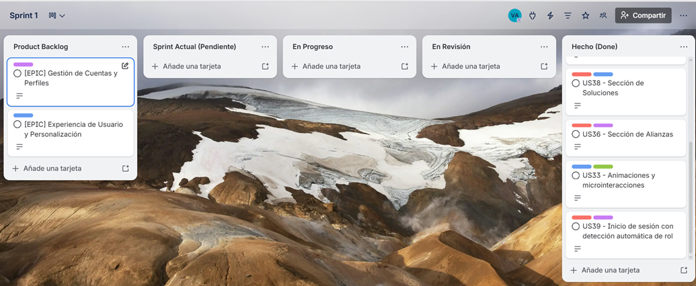
  <br>
  <em>Figura 107. Aquí se logra observar el seguimiento del Sprint 1 realizado en Trello La imagen evidencia la estructura del flujo de trabajo dividida en columnas clave: Product Backlog, Sprint Actual, En Progreso, En Revisión y Done.</em>
</p>

**Enlace del Trello:** [Sprint 1 - Board](https://trello.com/invite/b/6917422e9c08cc04d9b59d1e/ATTId1b0ecfecfdda8662f8e494d32174e18836EB535/sprint-1)

| Sprint # | Sprint 1 | | | | | | |
| :--- | :--- | :--- | :--- | :--- | :---: | :--- | :---|
| **User Story** | | **Work-Item / Task** | | | | | |
| |  | |  |  |  |  | .|
| **Id** | **Title** | **Id** | **Title** | **Description** | **Estimation (Hours)** | **Assigned To** | **Status** |
| **US31** | Platform home screen | T01 | HTML Layout | Implementation of HTML structure | 2 hr | Victor | DONE |
| | | T02 | CSS Styling | CSS Design and Responsiveness | 1 hr | Luis | DONE |
| | | T03 | Bug Review | Functionality and bug review | 1 hr | Santiago | DONE |
| **US32** | View About Us screen | T04 | Content Setup | Implementation of HTML content | 2 hr | Snatiago | DONE |
| | | T05 | Block Styling | CSS styling for text blocks | 1 hr | Victor | DONE |
| | | T06 | Visual Quality | Content and visual review | 1 hr | David | DONE |
| **US33** | Animations and micro-interactions | T07 | Hover Effects | CSS Keyframes and hover effects | 2 hr | David | DONE |
| | | T08 | UI Styling | Interactive elements styling | 1 hr | Luis | DONE |
| | | T09 | Visual Polish | Review of visual polish | 1 hr | Victor | DONE |
| **US35** | Language change (Spanish / English) on the Landing Page | T10 | Selector HTML | HTML structure for the selector | 1 hr | Rafael | DONE |
| | | T11 | Design Toggle | CSS styling for the dropdown/buttons | 1 hr | David | DONE |
| | | T12 | Switch Test | Visual validation of language switch | 1 hr | Rafael | DONE |
| **US36** | View Alliances section | T13 | Logo Grid | Implementation of HTML (Logos grid) | 2 hr | Luis | DONE |
| | | T14 | Partner Style | CSS styling for the partner section | 1 hr | Santiago | DONE |
| | | T15 | Padding Rev. | Alignment and padding review | 1 hr | David | DONE |
| **US37** | View About Us section and Technological Projection | T16 | Team Cards | HTML structure for Team cards | 2 hr | Victor | DONE |
| | | T17 | Mission Design | CSS design for Mission/Vision blocks | 1 hr | Santiago | DONE |
| | | T18 | Resp. Check | Review of responsiveness | 1 hr | Victor | DONE |
| **US38** | View Solutions and Features section | T19 | Feature List | Implementation of HTML feature list | 2 hr | David | DONE |
| | | T20 | Icons & Style | Iconography and CSS styling | 1 hr | Rafael | DONE |
| | | T21 | Logic Review | Visual and logic review | 1 hr | Victor | DONE |

*(Tabla 19.  Tabla de  Sprint Backlog 1  - Elaboración propia.)*

---

#### 5.2.1.4. Development Evidence for Sprint Review

En esta sección se resumen los principales avances logrados en la implementación durante el Sprint 1, los cuales se centraron en la construcción y el despliegue de la primera versión de la Landing Page. Cada integrante del equipo participó activamente en el desarrollo de componentes específicos, tales como la barra de navegación, la sección de soluciones y el soporte para internacionalización (i18n). Todas las contribuciones se integraron siguiendo el flujo de trabajo GitFlow y aplicando las convenciones de Conventional Commits para garantizar la trazabilidad del proceso.

Tras completarse todas las tareas, el team leader del repositorio efectuó la fusión de `develop` con la rama `main`, lo que permitió habilitar la visualización de la landing page a través de GitHub Pages.

A continuación, se presentan los nombres de usuario del equipo junto con algunos commits aportados por cada miembro:

| Repository | Branch | Commit Id | Commit Message | Commit Message Body | Committed on (Date) |
| :--- | :--- | :--- | :--- | :--- | :--- |
| innovify/Landing-Page | feature/avance-victor| 605336f8bcd15e2d1c2db5416b2b3eab45332d23 | feat: implement index layout | Developed the main INDEX structure and Hero section for the landing page. | 11/04/2026 |
| innovify/Landing-Page | feature/avance-rafael | 342bac95a0cca57e6b10e6233908f4acff34e710 | feat: add responsive navbar | Developed responsive Navbar component with navigation links. | 11/04/2026 |
| innovify/Landing-Page | feature/avance-luis | 1f79cbe6d66b1fef8c54e27f3a25cb17293c8c9e | feat: add about us section | Created the "About Us" section with company description and mission. | 11/04/2026 |
| innovify/Landing-Page | feature/avance-victor | 13aa26e1774cacc0e3024dcf9b7b1ab22a9dac6f | feat: setup i18n support | Implemented i18n library and configured initial EN/ES translation files. | 12/04/2026 |
| innovify/Landing-Page | feature/avance-luis | j3k8c5l92d889e598db9f204b8854bbfc64ee5eb | feat: add language toggle | Implemented dynamic language switch button with real-time updates. | 12/04/2026 |
| innovify/Landing-Page | feature/avance-david| 9d9c22330d889e598db9f204b8854bbfc64ee5eb | feat: add alliances section | Developed Alliances and partner universities section for the landing page. | 13/04/2026 |
| innovify/Landing-Page | feature/avance-david| e11daa751bc9d0ce7fa061ca686bf355a05e968d | feat: add UI animations | Added hover effects and scroll-based fade-in animations using CSS. | 13/04/2026 |
| innovify/Landing-Page | feature/avance-santiago | cf844cb30b25a4c7dad7c92ca92b6be0edf3bf35 | feat: build solutions section | Created interactive summary of platform solutions and technical features. | 13/04/2026 |

*(Tabla 20.  Tabla de  Development Evidence for Sprint Review - Elaboración propia.)*

<figure style="text-align: center; margin-bottom: 40px;">
  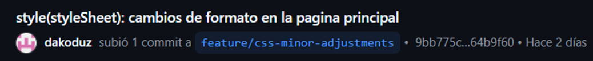
  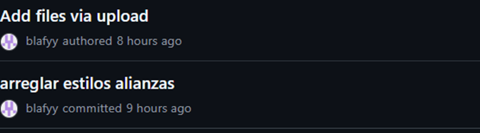
  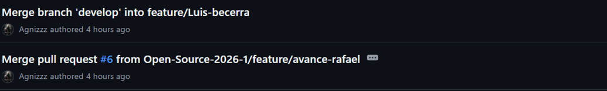
  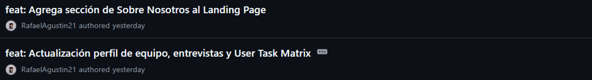
  <figcaption style="margin-top: 10px; font-style: italic;">
    Figura 108. Historial de Commits - Elaboración propia. Nota: Estos son algunos de los commits realizados por los integrantes en sus respectivas ramas, siguiendo la convención de Conventional Commits.
  </figcaption>
</figure>

**Enlace de la página web para observar la implementación del Sprint 1:**

 **https://github.com/Open-Source-2026-1/SkillSwape-UPC.git**

---

#### 5.2.1.5. Execution Evidence for Sprint Review
En este Sprint logramos construir y visualizar la principal puerta de entrada a nuestra plataforma. Se finalizó completamente la Landing Page, permitiendo a los usuarios navegar por las secciones de Soluciones, Proyección Tecnológica y Alianzas, además de alternar fluidamente entre inglés y español.

Por el lado funcional, los usuarios ya pueden acceder a la vista de Registro e Inicio de Sesión, validando que el flujo de autenticación responda correctamente.

### Sprint 1:

<figure style="text-align: center; margin-bottom: 40px;">
  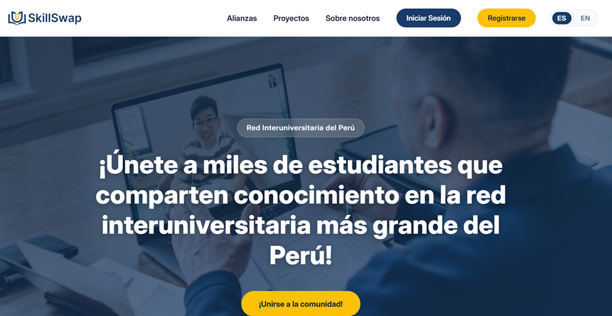
  <figcaption style="margin-top: 10px;">
    <em>Figura 109. Se observa la página de inicio que define la estructura preliminar, la barra de navegación y los llamados a la acción, siendo estática.</em>
  </figcaption>
</figure>

<br><br>

<figure style="text-align: center; margin-bottom: 40px;">
  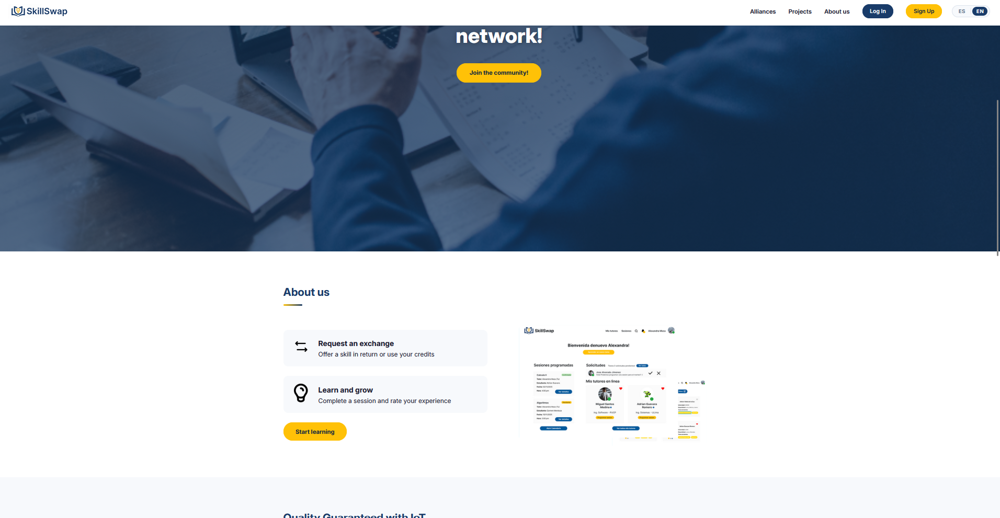
  <figcaption style="margin-top: 10px;">
    <em>Figura 110. Se observa la interfaz representativa de la sección "Sobre nosotros", utilizada para ilustrar el flujo de intercambio de habilidades y validar la experiencia de usuario.</em>
  </figcaption>
</figure>

<br><br>

<figure style="text-align: center; margin-bottom: 40px;">
  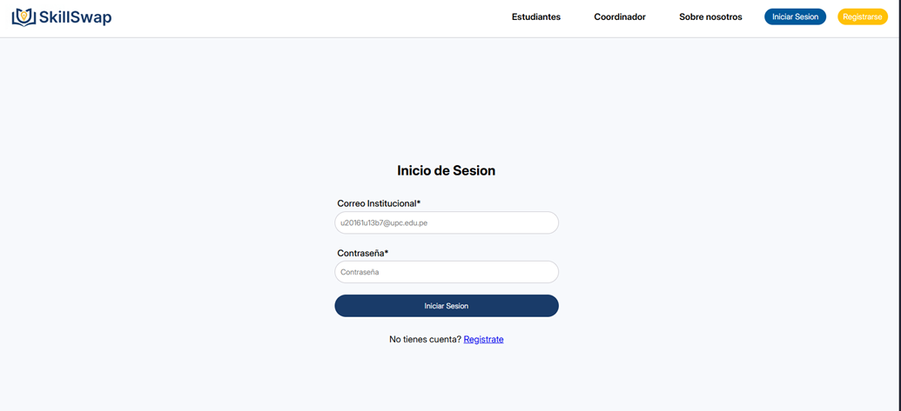
  <figcaption style="margin-top: 10px;">
    <em>Figura 111. Diseño estático del formulario de autenticación, estructurado con sus campos respectivos para la futura integración con los servicios de validación de credenciales.</em>
  </figcaption>
</figure>

<br><br>

<figure style="text-align: center; margin-bottom: 40px;">
  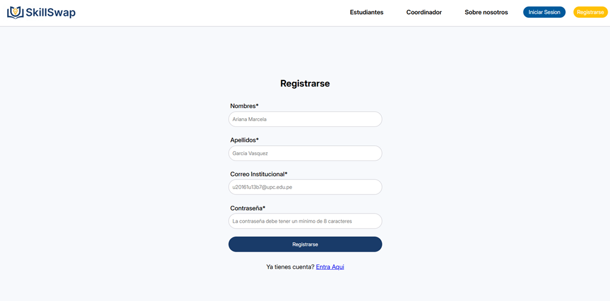
  <figcaption style="margin-top: 10px;">
    <em>Figura 112. Vista frontal del formulario de registro estático que ilustra la disposición de los campos de recolección de datos necesarios para la creación de nuevas cuentas.</em>
  </figcaption>
</figure>

<br><br>

<figure style="text-align: center; margin-bottom: 40px;">
  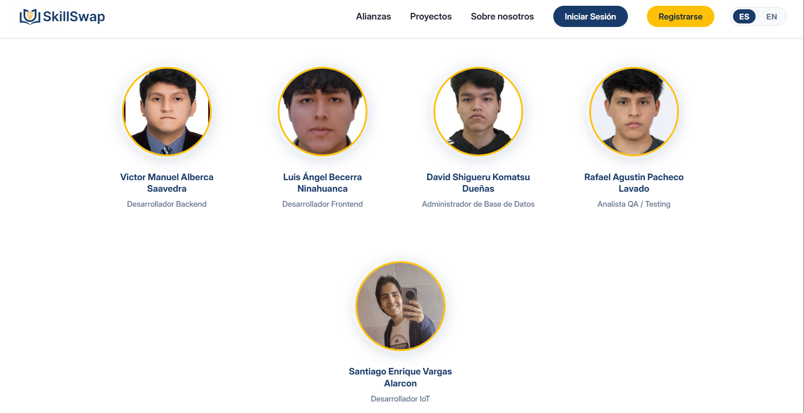
  <figcaption style="margin-top: 10px;">
    <em>Figura 113. La figura muestra la sección de equipo del landing page de SkillSwap, con fotos, nombres y roles técnicos de cada integrante, permitiendo visualizar la estructura y composición del equipo de ingeniería.</em>
  </figcaption>
</figure>

<br><br>

**Video demostrativo de las funciones del Sprint 1:**
<figure style="text-align: center; margin-bottom: 40px;">
  <a href="https://upcedupe-my.sharepoint.com/:v:/g/personal/u201924127_upc_edu_pe/IQBRnpVnIxplRo7iLHOvEiZqAV2Dj9KLYVmcGKSInUeAjkQ?e=ZL65jW&nav=eyJyZWZlcnJhbEluZm8iOnsicmVmZXJyYWxBcHAiOiJTdHJlYW1XZWJBcHAiLCJyZWZlcnJhbFZpZXciOiJTaGFyZURpYWxvZy1MaW5rIiwicmVmZXJyYWxBcHBQbGF0Zm9ybSI6IldlYiIsInJlZmVycmFsTW9kZSI6InZpZXcifX0%3D" target="_blank">
    
  </a>
  <figcaption style="margin-top: 10px;">
    <br>
    <em>Acá se presenta el video con todas las funcionalidades del sprint 1 explicadas.</em>
  </figcaption>
</figure>
<br>
En conjunto, los elementos presentados evidencian la construcción de una base sólida a nivel de interfaz durante el primer sprint, enfocada en el diseño estático y la validación de la experiencia de usuario. Desde la estructura del landing page hasta los formularios de autenticación y registro, se establece una visión clara de la interacción del usuario con la plataforma. Asimismo, la inclusión de la sección de equipo y el video demostrativo permite contextualizar tanto la organización del proyecto como el alcance funcional alcanzado, sentando las bases para futuras integraciones y desarrollo dinámico del sistema.
<br>

---

#### 5.2.1.6. Services Documentation Evidence for Sprint Review

En esta sección se resumen los resultados relacionados con la documentación de Web Services para este Sprint. De acuerdo con los objetivos del Sprint Backlog 1, el equipo priorizó la implementación de la Landing Page como primer punto de contacto con el usuario. Por tal motivo, no se han implementado servicios RESTful en esta iteración y, en consecuencia, no se cuenta con endpoints documentados mediante OpenAPI en esta etapa inicial del proyecto.

| Endpoint | Action | HTTP Verb | Call Syntax | Parameters | Response Example | Documentation Link |
| :--- | :--- | :--- | :--- | :--- | :--- | :--- |
| N/A | No se implementaron servicios en el Sprint 1 | N/A | N/A | N/A | N/A | N/A |

#### 5.2.1.7. Software Deployment Evidence for Sprint Review
Durante este primer Sprint, el enfoque de despliegue (Deployment) estuvo centrado exclusivamente en la configuración inicial del entorno de trabajo y en la publicación de la Landing Page del proyecto.

Las actividades realizadas incluyeron la creación de la organización y los repositorios en GitHub, así como la definición de una estructura básica de ramas (como main y develop) para mantener un orden en el desarrollo y facilitar la colaboración entre los integrantes del equipo.

Para lograr que la Landing Page sea accesible públicamente, se configuró su despliegue utilizando GitHub Pages, lo que permitió publicar el sitio de manera rápida y sencilla. Gracias a esta configuración, cualquier cambio realizado y subido al repositorio puede reflejarse automáticamente en la versión publicada, asegurando una actualización continua del contenido.

En este Sprint, el objetivo principal fue establecer una base sólida de trabajo y garantizar la disponibilidad de la Landing Page en línea, permitiendo presentar de forma clara la propuesta del proyecto. Las siguientes fases del despliegue, que contemplan la incorporación de nuevas funcionalidades y una mayor complejidad en la aplicación, serán abordadas progresivamente en los próximos Sprints conforme avance el desarrollo del proyecto.

<br><br>

<figure style="text-align: center; margin-bottom: 40px;">
  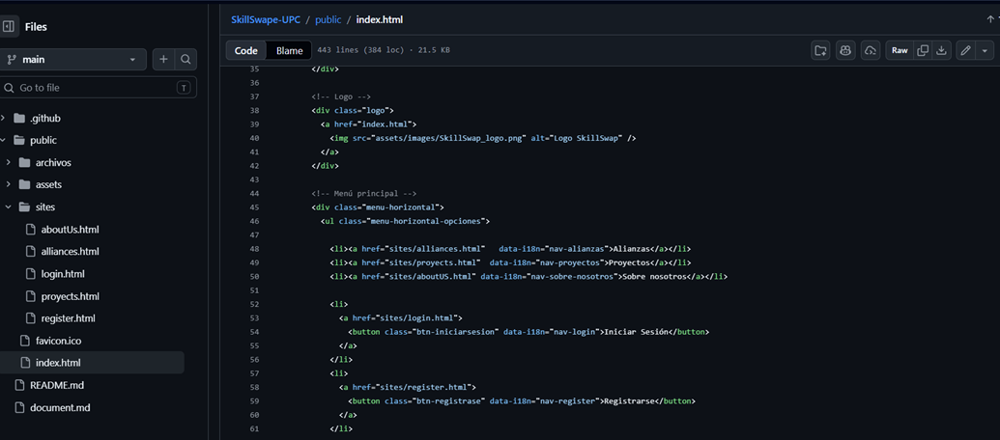
  <figcaption style="margin-top: 10px;">
    <em>Figura 114. En esta figura se observa el código fuente del archivo index.html dentro del repositorio, mostrando específicamente la estructura de la barra de navegación, la inserción del logotipo y las rutas hacia las distintas vistas del proyecto.</em>
  </figcaption>
</figure>

<br><br>

<figure style="text-align: center; margin-bottom: 40px;">
  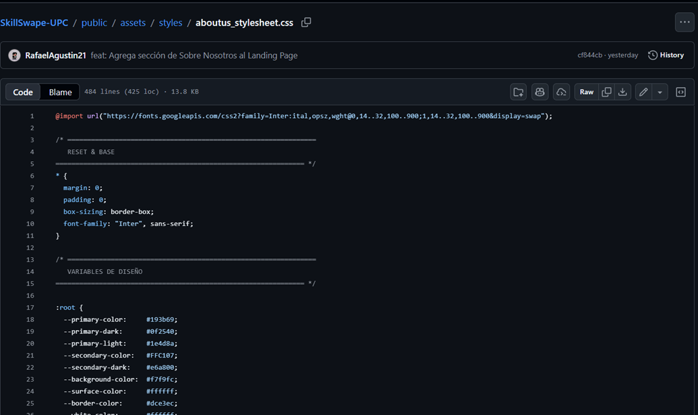
  <figcaption style="margin-top: 10px;">
    <em>Figura 115. En la imagen tenemos la hoja de estilos aboutus_stylesheet.css, donde se evidencia la configuración inicial de la fuente tipográfica y la definición de variables globales (:root) para estandarizar la paleta de colores de la interfaz.</em>
  </figcaption>
</figure>

<br><br>

<figure style="text-align: center; margin-bottom: 40px;">
  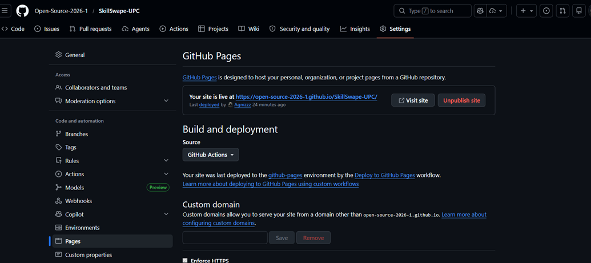
  <figcaption style="margin-top: 10px;">
    <em>Figura 116. Se observa el panel de configuración de GitHub Pages, el cual confirma que el sitio web se encuentra activo y ha sido desplegado exitosamente en un entorno de producción mediante el uso de GitHub Actions.</em>
  </figcaption>
</figure>

<br><br>

<figure style="text-align: center; margin-bottom: 40px;">
  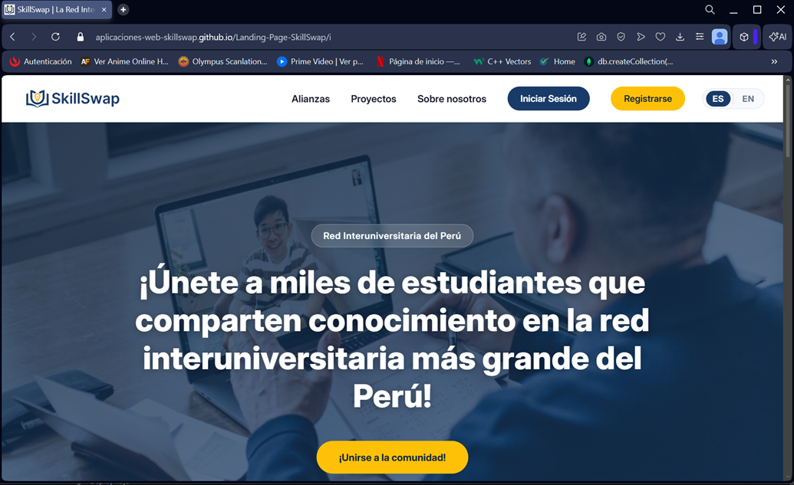
  <figcaption style="margin-top: 10px;">
    <em>Figura 117. En esta figura se visualiza la interfaz de la página principal (Landing Page) ya renderizada y accesible desde un navegador web, confirmando la correcta publicación y disponibilidad del proyecto en línea.</em>
  </figcaption>
</figure>

<br>
En conjunto, las evidencias presentadas demuestran un avance integral que abarca tanto el desarrollo del frontend como su despliegue en un entorno real. Desde la estructuración del código HTML y la estandarización de estilos mediante CSS, hasta la configuración y publicación en GitHub Pages, se valida no solo la correcta implementación técnica, sino también la disponibilidad del sistema para los usuarios. Esto refleja un flujo de trabajo completo que integra desarrollo, configuración y despliegue de manera efectiva.


<br>

**Enlace de la página web (Sprint 1):** [ https://open-source-2026-1.github.io/SkillSwape-UPC/]( https://open-source-2026-1.github.io/SkillSwape-UPC/)

---

#### 5.2.1.8. Team Collaboration Insights during Sprint
Durante este Sprint, el equipo concentró sus actividades de implementación y colaboración en el desarrollo de la Landing Page. Para garantizar un trabajo ordenado y evitar conflictos, se adoptó la metodología de control de versiones Git Flow.

Se creó el repositorio principal en GitHub y se establecieron las ramas main (para la versión estable) y develop (para la integración de avances). Cada miembro del equipo clonó el repositorio y trabajó en ramas locales de tipo feature/avance-nombre (por ejemplo, feature/avance-hero o feature/avance-idioma), lo que permitió organizar mejor las tareas y mantener un flujo de trabajo estructurado.

Todos los integrantes del equipo participaron activamente en la construcción de la Landing Page. Para integrar el trabajo individual, se utilizaron Pull Requests (PRs), permitiendo realizar revisiones de código antes de fusionar los cambios a la rama develop. Esta práctica promovió la colaboración constante, mejoró la calidad del código y aseguró que todos los miembros comprendieran la estructura y avances del proyecto.

A continuación, se presentan las capturas de los analíticos de GitHub que evidencian la participación y los commits de todos los miembros del equipo durante este Sprint:

<br><br>

<figure style="text-align: center; margin-bottom: 40px;">
  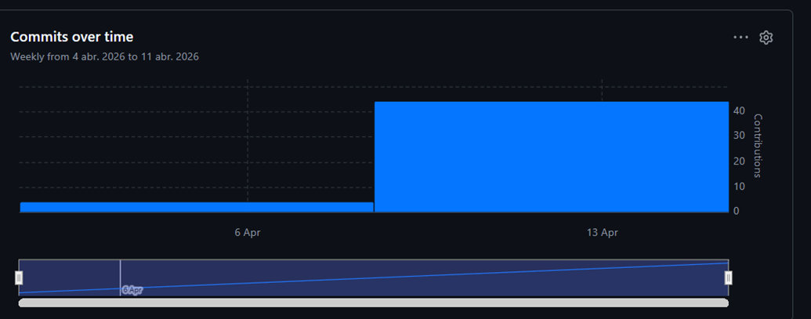
  <figcaption style="margin-top: 10px;">
    <em>Figura 118. En esta figura se observa el gráfico de actividad Commits over time, destacando un periodo de alta concentración de contribuciones y confirmaciones de código durante la primera quincena del mes de abril de 2026.</em>
  </figcaption>
</figure>

<br><br>

<figure style="text-align: center; margin-bottom: 40px;">
  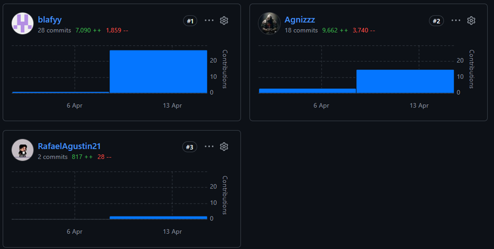
  <figcaption style="margin-top: 10px;">
    <em>Figura 119. En la imagen tenemos el panel de estadísticas de los colaboradores, el cual detalla el volumen total de commits, así como las líneas de código agregadas (en verde) y eliminadas (en rojo) individualmente por cada miembro del equipo.</em>
  </figcaption>
</figure>

<br><br>

<figure style="text-align: center; margin-bottom: 40px;">
  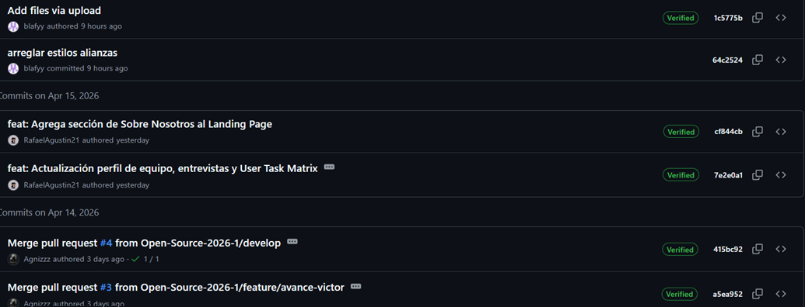
  <figcaption style="margin-top: 10px;">
    <em>Figura 120. Se observa el listado de confirmaciones recientes en el repositorio, evidenciando la coexistencia de integraciones de ramas (Merge pull requests), la aplicación de Conventional Commits (feat:) y subidas de código directas.</em>
  </figcaption>
</figure>

<br><br>

<figure style="text-align: center; margin-bottom: 40px;">
  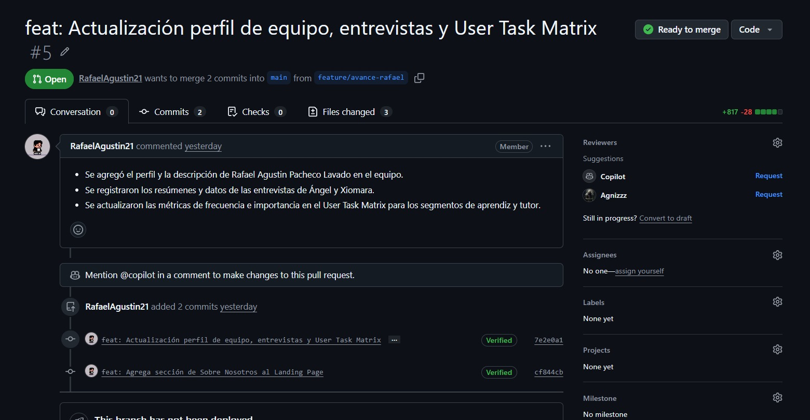
  <figcaption style="margin-top: 10px;">
    <em>Figura 121. En esta figura se detalla un Pull Request estructurado, mostrando una descripción clara mediante viñetas sobre los cambios introducidos y el indicador de validación en verde (Ready to merge), lo que confirma que está listo para integrarse sin problemas.</em>
  </figcaption>
</figure>

<br><br>

<figure style="text-align: center; margin-bottom: 40px;">
  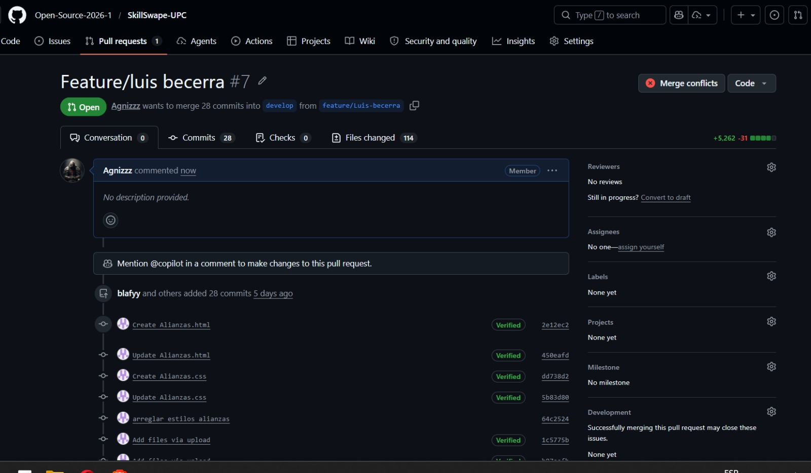
  <figcaption style="margin-top: 10px;">
    <em>Figura 122. En la imagen se evidencia un Pull Request que presenta problemas de integración, resaltando la alerta roja de conflictos de código (Merge conflicts) y la ausencia de una descripción (No description provided), lo que indica que se requiere una resolución manual antes de la fusión.</em>
  </figcaption>
</figure>
<br>
En conjunto, las evidencias reflejan un proceso de desarrollo activo y colaborativo, caracterizado por un alto volumen de contribuciones durante periodos clave y una participación equilibrada del equipo. Asimismo, se observa la aplicación de buenas prácticas como el uso de Conventional Commits y la gestión de Pull Requests bien estructurados, lo que facilita la integración del código. Sin embargo, también se identifican casos de conflictos y falta de documentación en algunas solicitudes, evidenciando la importancia de mantener estándares consistentes para garantizar un flujo de trabajo eficiente, ordenado y libre de errores.

---

### 5.2.2. Sprint 2

En esta sección se registra y explica el avance en términos de producto y trabajo colaborativo. Incluye tres secciones internas: Sprint Backlog 2, User Interface & Execution, y Team Collaboration Insights.


#### 5.2.2.1.Sprint Planning 2.

Esta sección detalla los aspectos principales de la reunión de planificación del Sprint. El equipo se reunió para definir el alcance de la segunda iteración, enfocándose en la construcción visual de los principales bounded contexts del sistema utilizando componentes frontend, navegación SPA y Fake API mediante datos mockeados.


| Sprint #  | Sprint 2 |
| :------------------------------------- | :------------------------------------------------------------------------------------------------------------------------------------------------------------------------------------------------------------------------------------------------------------------------------------------------------------------------------------------------------------------------------------------------------------------------------------------------------------------------------------------------------------------------------------ |
| **Sprint Planning Background**         |   |
| **Date**                               | 2026-05-09   |
| **Time**                               | 08:00 PM |
| **Location**                           | Reunión virtual (Google Meet)  |
| **Prepared By**                        | Alberca Saavedra, Victor Manuel  |
| **Attendees (to planning meeting)**    | Alberca Saavedra, Victor Manuel / Komatsu Dueñas, David / Vargas Alarcón, Santiago Enrique / Becerra Ninahuanca, Luis Ángel / Pacheco Lavado, Rafael Agustín           |
| **Sprint n – 2 Review Summary**        | Se completó exitosamente la Landing Page institucional de Skillswap, incluyendo soporte bilingüe y diseño responsivo.   |
| **Sprint n – 2 Retrospective Summary** | El equipo acordó priorizar bounded contexts frontend desacoplados y trabajar con Fake APIs para acelerar el desarrollo visual.   |
| **Sprint Goal & User Stories**         |      |
| **Sprint 2 Goal**                      | Nuestro enfoque está en desarrollar las interfaces frontend de los bounded contexts principales de Skillswap mediante componentes reutilizables, tablas CRUD, formularios y datos mockeados. Creemos que esto permitirá validar la arquitectura visual del sistema y la experiencia de usuario antes de integrar lógica backend real. Esto se confirmará cuando los usuarios puedan navegar fluidamente entre los módulos Discovery, Workspace, Reputation, Moderation y Learning & Assessment utilizando Fake APIs y navegación SPA sin errores visuales. |
| **Sprint 2 Velocity** | 42 Story Points |
| **Sum of Story Points**| 42 |


*(Tabla 22.  Tabla de  Sprint Planning 2  - Elaboración propia.)*


<figure style="text-align: center; margin-bottom: 40px;">
  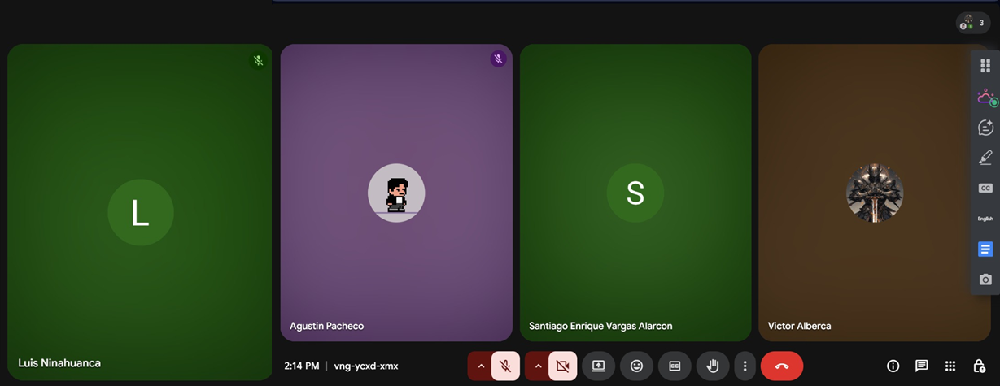
  <figcaption style="margin-top: 10px;">
    <em>Figura. Se observa la reunión del grupo.</em>
  </figcaption>
</figure>

---

#### 5.2.2.2. Aspect Leaders and Collaborators.

| Team Member                          | GitHub Username | Aspecto 1 (Discovery) | Aspecto 2 (Workspace) | Aspecto 3 (Learning & Assessment) | Aspecto 4 (Moderation) | Aspecto 5 (Reputation) |
| :----------------------------------- | :-------------- | :-------------------: | :-------------------: | :-------------------------------: | :--------------------: | :--------------------: |
| **Alberca Saavedra, Victor Manuel**  | VictprAlberca   |           L           |           C           |                 C                 |            C           |            C           |
| **Komatsu Dueñas, David**            | DavidKomatsu    |           C           |           L           |                 C                 |            C           |            C           |
| **Pacheco Lavado, Rafael Agustín**   | RafaelPacheco   |           C           |           C           |                 L                 |            C           |            C           |
| **Becerra Ninahuanca, Luis Ángel**   | LuisBecerra     |           C           |           C           |                 C                 |            L           |            C           |
| **Vargas Alarcón, Santiago Enrique** | SantiagoVargas  |           C           |           C           |                 C                 |            C           |            L           |


*(Nota: L = Leader, C = Collaborator)*

*(Tabla 23.  Tabla de  Aspect Leaders and Collaborators  - Elaboración propia.)*

---

#### 5.2.2.3.Sprint Backlog 2.

El objetivo principal del Sprint 2 es implementar las interfaces frontend de los bounded contexts principales de Skillswap utilizando arquitectura modular y Fake APIs. Este Sprint se enfoca exclusivamente en la construcción visual del sistema, incorporando tablas, formularios, navegación SPA y datos simulados para representar el comportamiento funcional de la plataforma.


Se presenta la tabla de Sprint 2 que logramos avanzar con el grupo:

|    ID    | User Story                                      | Epic                                   |        Priority        |   SP   |
| :------: | :------------------------------------           | :----------------------------          | :--------------------: | :----: |
| **US06** | Apply filters to search results                 | Search and Matching                    |         Medium         |    3   |
| **US08** | Send tutoring reservation request               | Coordination and Asynchronous Learning |          High          |    3   |
| **US09** | Accept or reject reservation request            | Coordination and Asynchronous Learning |         Medium         |    2   |
| **US10** | Asynchronous internal chat for the reservation  | Coordination and Asynchronous Learning |         Medium         |    5   |
| **US14** | Create official Quiz                            | Academic Quality Assurance             |          High          |    5   |
| **US16** | Solve interactive validation Quiz               | Academic Quality Assurance             |          High          |    5   |
| **US17** | Rate and leave a review for the tutor           | Rating and Monetization                |         Medium         |    3   |
| **US18** | Make a voluntary monetary donation              | Rating and Monetization                |         Medium         |    5   |
| **US19** | View Virtual Wallet and balance                 | Rating and Monetization                |         Medium         |    3   |
| **US21** | Cancel pending or scheduled reservation         | Rating and Monetization                |         Medium         |    2   |
| **US24** | Report misconduct                               | Dashboard and Moderation               |         Medium         |    3   |
| **US25** | Review and resolve academic disputes            | Dashboard and Moderation               |         Medium         |    3   |
|          |                                                 |                                        | **Total Story Points** | **42** |


A continuación, se presenta una captura de pantalla del estado actual de nuestro tablero de control para el Sprint 2:

<p align="center">
  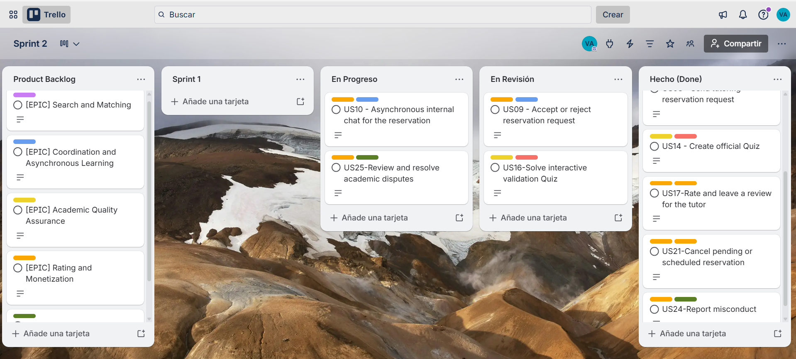
  <br>
  <em>Figura. Aquí se logra observar el seguimiento del Sprint  realizado en Trello La imagen evidencia la estructura del flujo de trabajo dividida en columnas clave: Product Backlog, Sprint Actual, En Progreso, En Revisión y Done.</em>
</p>

**Enlace del Trello:** https://trello.com/invite/b/6917422e9c08cc04d9b59d1e/ATTId1b0ecfecfdda8662f8e494d32174e18836EB535/sprint-2 

| Sprint #       | Sprint 2                                       |                      |                                               |                                                                          |                        |                 |             |
| :------------- | :--------------------------------------------- | :------------------- | :-------------------------------------------- | :----------------------------------------------------------------------- | :--------------------: | :-------------- | :---------- |
| **User Story** |                                                | **Work-Item / Task** |                                               |                                                                          |                        |                 |             |
| **Id**         | **Title**                                      | **Id**               | **Title**                                     | **Description**                                                          | **Estimation (Hours)** | **Assigned To** | **Status**  |
| **US06**       | Apply filters to search results                | T01                  | Design filter UI components                   | Create Angular filter components with Material Design styles             |           4h           | David           | DONE        |
| **US06**       | Apply filters to search results                | T02                  | Implement filter logic                        | Connect filter options to Fake API and apply dynamic search filtering    |           5h           | David           | DONE        |
| **US06**       | Apply filters to search results                | T03                  | Add responsive filter behavior                | Ensure filter panel adapts correctly to mobile and desktop breakpoints   |           4h           | David           | DONE        |
| **US08**       | Send tutoring reservation request              | T04                  | Design reservation form layout                | Create Angular form component with input fields and modal structure      |           4h           | Victor          | DONE        |
| **US08**       | Send tutoring reservation request              | T05                  | Implement form validation logic               | Add reactive form validations and error messages per field               |           4h           | Victor          | DONE        |
| **US08**       | Send tutoring reservation request              | T06                  | Integrate form with Fake API                  | Connect reservation form to POST endpoint in My JSON Server              |           5h           | Victor          | DONE        |
| **US09**       | Accept or reject reservation request           | T07                  | Design action buttons UI                      | Create accept and reject button components with Material Design          |           4h           | Victor          | TO DO       |
| **US09**       | Accept or reject reservation request           | T08                  | Implement action state logic                  | Handle UI state changes on accept/reject actions using Fake API          |           5h           | Victor          | TO DO       |
| **US10**       | Asynchronous internal chat for the reservation | T09                  | Design chat interface layout                  | Create responsive chat UI component with message bubbles and input area  |           5h           | Victor          | IN PROGRESS |
| **US10**       | Asynchronous internal chat for the reservation | T10                  | Implement message rendering logic             | Display simulated conversations using Fake API data                      |           4h           | Victor          | IN PROGRESS |
| **US10**       | Asynchronous internal chat for the reservation | T11                  | Connect chat to Fake API                      | Fetch and send messages via GET/POST to My JSON Server endpoints         |           5h           | Victor          | IN PROGRESS |
| **US14**       | Create official Quiz                           | T12                  | Design quiz creation form                     | Build Angular form for quiz title, description and question inputs       |           4h           | David           | DONE        |
| **US14**       | Create official Quiz                           | T13                  | Implement question management logic           | Add, edit and remove questions dynamically within the quiz form          |           5h           | David           | DONE        |
| **US14**       | Create official Quiz                           | T14                  | Integrate quiz form with Fake API             | Save quiz data via POST to My JSON Server and confirm creation feedback  |           4h           | David           | DONE        |
| **US16**       | Solve interactive validation Quiz              | T15                  | Design quiz resolution UI                     | Create quiz-taking view with question navigation and answer selection    |           5h           | David           | IN PROGRESS |
| **US16**       | Solve interactive validation Quiz              | T16                  | Implement answer submission logic             | Handle answer selection, submission and score calculation on frontend    |           4h           | David           | IN PROGRESS |
| **US16**       | Solve interactive validation Quiz              | T17                  | Display results and feedback view             | Show score summary and per-question feedback after quiz completion       |           4h           | David           | IN PROGRESS |
| **US17**       | Rate and leave a review for the tutor          | T18                  | Design star rating component                  | Create reusable star rating UI component with Angular Material           |           4h           | Santiago        | DONE        |
| **US17**       | Rate and leave a review for the tutor          | T19                  | Implement review form and validation          | Add text review input, character limit validation and submit logic       |           4h           | Santiago        | DONE        |
| **US17**       | Rate and leave a review for the tutor          | T20                  | Integrate rating with Fake API                | Send review data via POST to My JSON Server and display confirmation     |           5h           | Santiago        | DONE        |
| **US18**       | Make a voluntary monetary donation             | T21                  | Design donation UI form                       | Create donation form with amount selection and payment method inputs     |           4h           | Rafael          | IN PROGRESS |
| **US18**       | Make a voluntary monetary donation             | T22                  | Implement donation amount logic               | Handle fixed and custom amount selection with validation                 |           4h           | Rafael          | IN PROGRESS |
| **US18**       | Make a voluntary monetary donation             | T23                  | Integrate donation with Fake API              | Connect donation submission to POST endpoint and show confirmation       |           5h           | Rafael          | IN PROGRESS |
| **US19**       | View Virtual Wallet and balance                | T24                  | Design wallet dashboard view                  | Create wallet component showing balance, transaction history layout      |           4h           | Rafael          | IN PROGRESS |
| **US19**       | View Virtual Wallet and balance                | T25                  | Fetch wallet data from Fake API               | Retrieve and display wallet balance and transactions via GET endpoint    |           5h           | Rafael          | IN PROGRESS |
| **US21**       | Cancel pending or scheduled reservation        | T26                  | Design cancellation UI                        | Create cancellation button and confirmation dialog component             |           4h           | Victor          | IN PROGRESS |
| **US21**       | Cancel pending or scheduled reservation        | T27                  | Implement cancellation logic                  | Handle reservation status update to cancelled via Fake API PATCH/DELETE  |           5h           | Victor          | IN PROGRESS |
| **US24**       | Report misconduct                              | T28                  | Design misconduct report form                 | Create form with category selection, description field and submit button |           4h           | Luis            | DONE        |
| **US24**       | Report misconduct                              | T29                  | Implement form validation and submission      | Add validations and connect form to POST endpoint in My JSON Server      |           5h           | Luis            | DONE        |
| **US25**       | Review and resolve academic disputes           | T30                  | Design moderation table view                  | Create dispute list table with status indicators and detail panel        |           4h           | Luis            | IN PROGRESS |
| **US25**       | Review and resolve academic disputes           | T31                  | Implement dispute detail and resolution logic | Handle dispute status updates (resolve/reject) with Fake API integration |           5h           | Luis            | IN PROGRESS |
| **US25**       | Review and resolve academic disputes           | T32                  | Add filtering and search to moderation table  | Enable search and filter by status/category in the dispute list          |           4h           | Luis            | IN PROGRESS |


*(Tabla 24.  Tabla de  Sprint Backlog 2  - Elaboración propia.)*

---

#### 5.2.2.4.Development Evidence for Sprint Review

En esta sección se resumen los principales avances logrados durante el Sprint 2, enfocados en la implementación frontend de los Bounded Contexts priorizados para la plataforma SkillSwap. A diferencia del Sprint anterior, esta iteración estuvo orientada al desarrollo de interfaces funcionales relacionadas con los procesos principales del sistema, utilizando componentes dinámicos y datos simulados mediante Fake API.

Durante este Sprint no se desarrollaron funcionalidades vinculadas a autenticación, perfil de usuario ni gestión de identidad, ya que dichos módulos serán integrados posteriormente mediante una solución externa proporcionada para el proyecto.

El equipo trabajó principalmente en los módulos Workspace, Discovery, Learning, Assessment, Moderation y Reputation, implementando pantallas responsivas, tablas dinámicas, vistas de interacción entre usuarios y estructuras visuales alineadas con la arquitectura definida del sistema.

Cada integrante participó activamente en el desarrollo de componentes específicos del frontend, mientras que la integración de cambios se realizó utilizando GitFlow y Conventional Commits para mantener trazabilidad, control de versiones y trabajo colaborativo organizado.

| Repository                  | Branch                      | Commit Id                               | Commit Message                       | Commit Message Body                                                                  | Committed on (Date) |
| :-------------------------- | :-------------------------- | :-------------------------------------- | :----------------------------------- | :----------------------------------------------------------------------------------- | :------------------ |
| innovify/SkillSwap-Frontend | feature/workspace-sessions  | 3065dc3da029f6af5cb4c63f21dcde366d9364be| feat: implement sessions table       | Add files via upload| 11/05/2026          |
| innovify/SkillSwap-Frontend | feature/workspace-messages  | c31fa295a0cca57e6b10e6233908f4acff34f22 | feat: add messages interface         | Created messaging interface with responsive layout and simulated conversations.      | 11/05/2026          |
| innovify/SkillSwap-Frontend | feature/discovery-courses   | d81acbe6d66b1fef8c54e27f3a25cb17293a8e1 | feat: add discovery courses screen   | Implemented discovery module to browse available courses and tutors.                 | 11/05/2026          |
| innovify/SkillSwap-Frontend | feature/learning-progress   | 83ba26e1774cacc0e3024dcf9b7b1ab22a9b881 | feat: build learning dashboard       | Added frontend structure for learning progress visualization.                        | 12/05/2026          |
| innovify/SkillSwap-Frontend | feature/assessment-ui       | f3k8c5l92d889e598db9f204b8854bbfc64aa11 | feat: add assessment interface       | Implemented assessment attempt views and score visualization.                        | 12/05/2026          |
| innovify/SkillSwap-Frontend | feature/moderation-disputes | 98dc22330d889e598db9f204b8854bbfc64ac55 | feat: add moderation dispute panel   | Developed moderation interface for dispute management using fake data.               | 12/05/2026          |
| innovify/SkillSwap-Frontend | feature/reputation-review   | e44daa751bc9d0ce7fa061ca686bf355a05e442 | feat: build reputation review module | Created review and rating visualization module for tutors.                           | 12/05/2026          |
| innovify/SkillSwap-Frontend | feature/frontend-polish     | af844cb30b25a4c7dad7c92ca92b6be0edf7aa3 | feat: improve responsive frontend    | Added responsive improvements and visual consistency across all modules.             | 12/05/2026          |


*(Tabla 25.  Tabla de  Development Evidence for Sprint Review - Elaboración propia.)*

<figure style="text-align: center; margin-bottom: 40px;">
  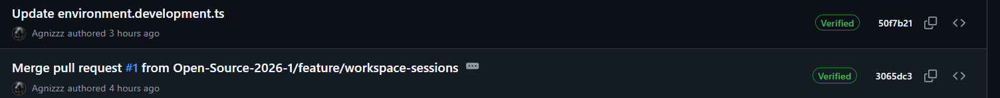
  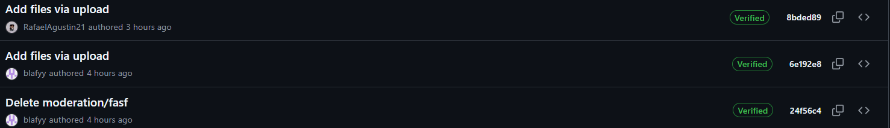
  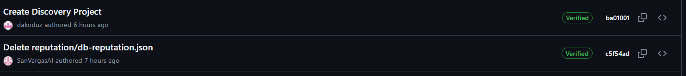
  <figcaption style="margin-top: 10px; font-style: italic;">
    Figura. Historial de Commits - Elaboración propia. Nota: Estos son algunos de los commits realizados por los integrantes en sus respectivas ramas, siguiendo la convención de Conventional Commits.
  </figcaption>
</figure>

**Enlace de la página web para observar la implementación del Sprint 2:** [https://skillswap-open-source.web.app](https://skillswap-open-source.web.app)


---

#### 5.2.2.5.Execution Evidence for Sprint Review

Durante el Sprint 2 se actualizó la Landing Page de SkillSwap incorporando 
screenshots reales de la aplicación web desarrollada, reforzando la 
consistencia visual entre ambos productos y comunicando de forma efectiva 
las funcionalidades implementadas a los visitantes.

Las actualizaciones realizadas incluyeron:
- Incorporación de screenshots reales de los módulos Discovery, Workspace 
  y Reputation en la sección de características de la plataforma.
- Actualización del mensaje principal (pitch) orientado a los segmentos 
  objetivo identificados.
- Verificación y actualización de los Call-To-Action (CTA) redirigiendo 
  correctamente a las vistas correspondientes de la Web Application.
- Validación del Responsive Web Design en resoluciones móvil y escritorio.

A continuación se presentan capturas de la Landing Page actualizada:

<figure style="text-align: center; margin-bottom: 40px;">
  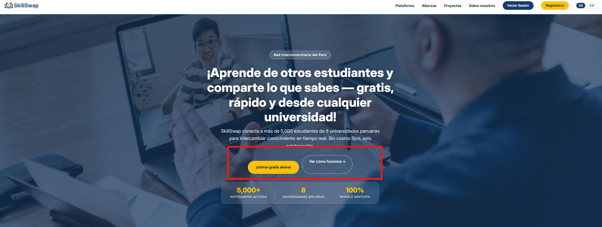
  <figcaption style="margin-top: 10px; font-style: italic;">
        Figura. Vista principal (hero section) de la Landing Page de SkillSwap actualizada durante el Sprint 2
  </figcaption>
</figure>


<figure style="text-align: center; margin-bottom: 40px;">
  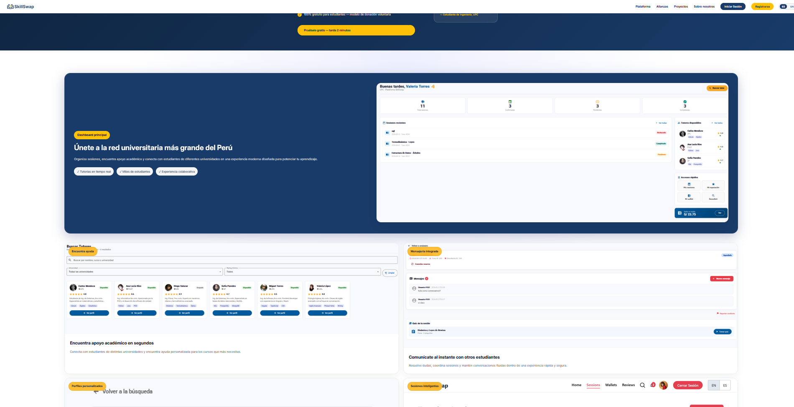
  <figcaption style="margin-top: 10px; font-style: italic;">
        Figura. Sección de características de la Landing Page mostrando screenshots 
reales de la aplicación web.
  </figcaption>
</figure>

<figure style="text-align: center; margin-bottom: 40px;">
  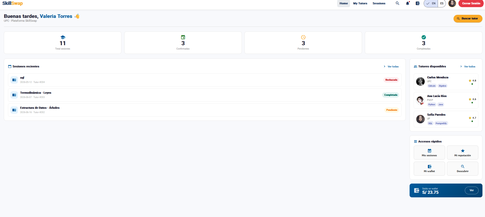
  <figcaption style="margin-top: 10px; font-style: italic;">
Figura. Sección Call-To-Action de la Landing Page redirigiendo a la Web 
Application.
  </figcaption>
</figure>

<figure style="text-align: center; margin-bottom: 40px;">
  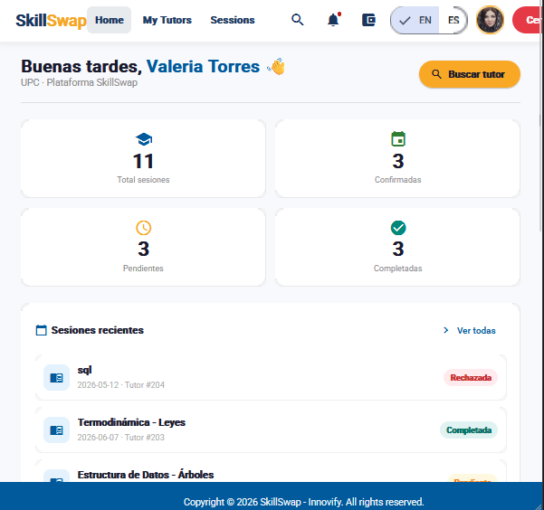
  <figcaption style="margin-top: 10px; font-style: italic;">
        Figura. Vista responsive de la Landing Page en dispositivo móvil.
  </figcaption>
</figure>


**URL de la Landing Page desplegada (Sprint 2):** **Enlaces de la página web (Sprint 2):** [https://skillswap-open-source.web.app](https://skillswap-open-source.web.app)


Durante este Sprint se logró implementar el frontend funcional de los principales módulos del sistema SkillSwap utilizando componentes visuales conectados mediante Fake API. El objetivo principal fue validar la experiencia de usuario y la navegación entre los Bounded Contexts definidos en la arquitectura del proyecto.

Las pantallas desarrolladas corresponden exclusivamente a los módulos Workspace, Discovery, Learning, Assessment, Moderation y Reputation. No se implementaron vistas relacionadas con autenticación, perfil de usuario o configuración de cuenta debido a que dichos componentes serán integrados en etapas posteriores del proyecto.

El módulo Workspace permitió visualizar sesiones programadas y conversaciones entre usuarios mediante tablas dinámicas y estructuras responsive. Asimismo, se implementaron interfaces para exploración de cursos, visualización de progreso de aprendizaje, intentos de evaluaciones y paneles de moderación de disputas.


### Sprint 2:

<figure style="text-align: center; margin-bottom: 40px;">
  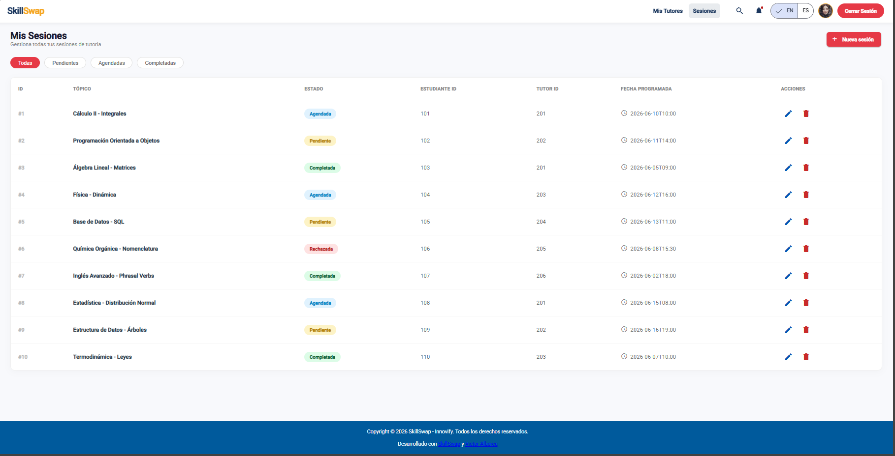
  <figcaption style="margin-top: 10px;">
    <em>Figura. Se observa la página de session, especificamente el historial de esta.</em>
  </figcaption>
</figure>

<br><br>

<figure style="text-align: center; margin-bottom: 40px;">
  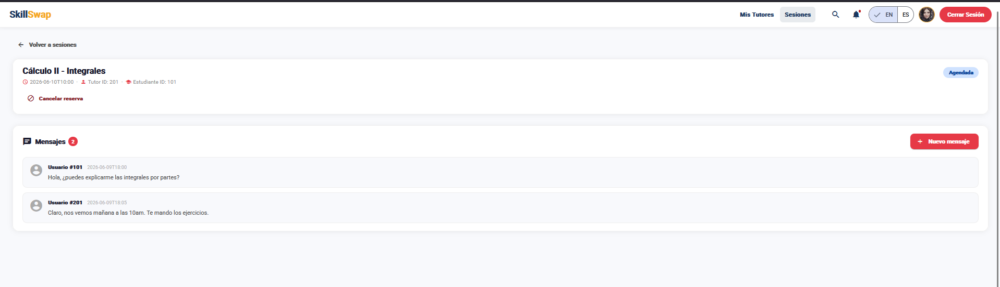
  <figcaption style="margin-top: 10px;">
    <em>Figura. Se observa la interfaz de los mensajes inscritos por los tutores y alumnos.</em>
  </figcaption>
</figure>

<br><br>

<figure style="text-align: center; margin-bottom: 40px;">
  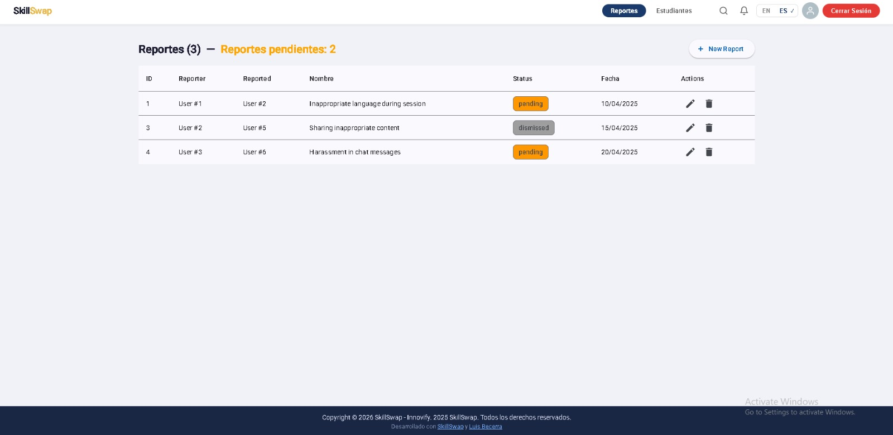
  <figcaption style="margin-top: 10px;">
    <em>Figura. Se observa la interfaz de los reportes por parte de los profesores.</em>
  </figcaption>
</figure>

<br><br>

<figure style="text-align: center; margin-bottom: 40px;">
  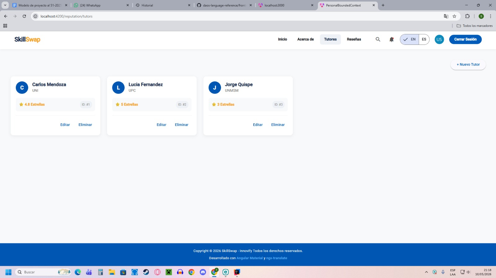
  <figcaption style="margin-top: 10px;">
    <em>Figura. Se observa la interfaz de cómo el estudiante podrá encontrar las reseñas de los tutores.</em>
  </figcaption>
</figure>

<br><br>

<figure style="text-align: center; margin-bottom: 40px;">
  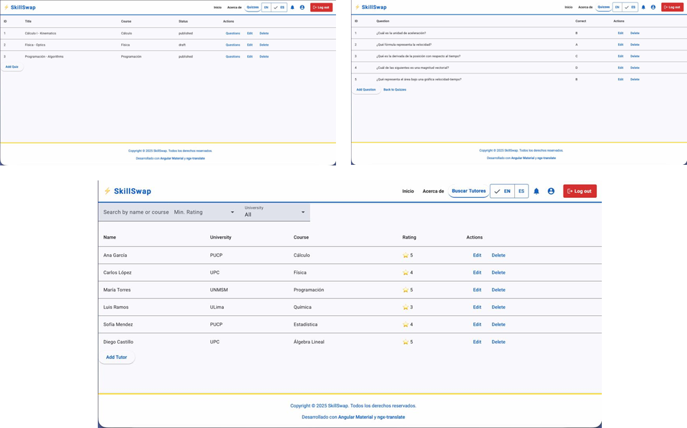
  <figcaption style="margin-top: 10px;">
    <em>Figura. Se observa la interfaz de cómo el estuidante podrá encontrar a los tutores en la plataforma .</em>
  </figcaption>
</figure>

<br><br>

<figure style="text-align: center; margin-bottom: 40px;">
  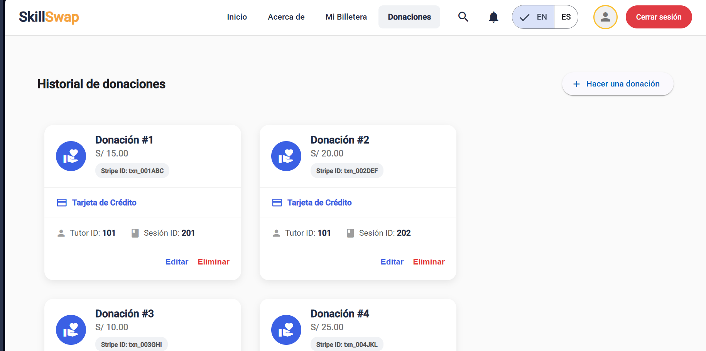
  <figcaption style="margin-top: 10px;">
    <em>Figura. Se observa la interfaz de cómo el estuidante podrá encontrar a los tutores en la plataforma .</em>
  </figcaption>
</figure>

<br><br>

**Video demostrativo de las funciones del Sprint 2:**

<figure style="text-align: center; margin-bottom: 40px;">
  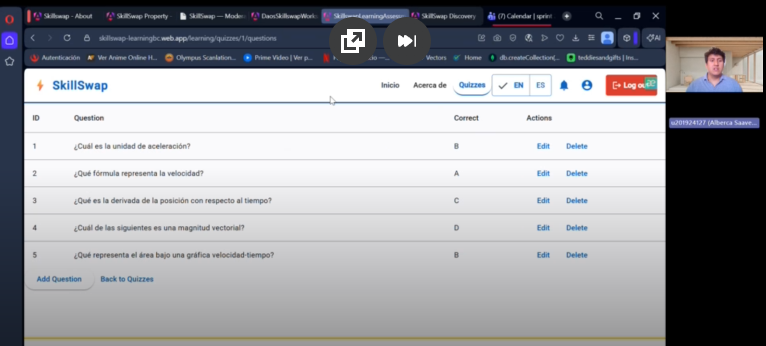
  <figcaption style="margin-top: 10px;">
    <em>Figura. Acá se presenta el video con todas las funcionalidades del sprint 2 explicadas.</em>
  </figcaption>
</figure>

**Link:** [Enlace del video](https://upcedupe-my.sharepoint.com/:v:/g/personal/u201924127_upc_edu_pe/IQALdzLMMSsHTq8t5VR0Hse0AeE_Ib0ymcpB1bG_THwk-pc?e=MwlSLx&nav=eyJyZWZlcnJhbEluZm8iOnsicmVmZXJyYWxBcHAiOiJTdHJlYW1XZWJBcHAiLCJyZWZlcnJhbFZpZXciOiJTaGFyZURpYWxvZy1MaW5rIiwicmVmZXJyYWxBcHBQbGF0Zm9ybSI6IldlYiIsInJlZmVycmFsTW9kZSI6InZpZXcifX0%3D)


<br>
En conjunto, las evidencias presentadas reflejan la implementación de una base sólida de frontend enfocada en la navegación y experiencia de usuario dentro de la plataforma SkillSwap. Los módulos desarrollados permiten representar visualmente los principales procesos funcionales del sistema mediante interfaces modernas y responsive, sentando así las bases para futuras integraciones backend y persistencia de datos reales.
<br>

---

#### 5.2.2.6. Services Documentation Evidence for Sprint Review.

Durante el Sprint 2, el equipo implementó la integración del frontend con 
múltiples Fake APIs desplegadas en My JSON Server, permitiendo simular el 
comportamiento de los servicios RESTful para cada Bounded Context de la 
plataforma SkillSwap. Si bien no se implementaron Web Services reales con 
Spring Boot en esta iteración, los endpoints simulados permitieron validar 
la navegación, interacción y experiencia de usuario en todos los módulos 
desarrollados.

A continuación se detalla la documentación de cada endpoint consumido 
durante el Sprint 2:

---

##### Bounded Context: Workspace

**Base URL:** `https://my-json-server.typicode.com/Open-Source-2026-1/db-skillswap`

| Endpoint | Action | HTTP Verb | Call Syntax | Parameters | Response Example |
| :--- | :--- | :---: | :--- | :--- | :--- |
| /tutoring-sessions | Get all tutoring sessions | GET | `GET /tutoring-sessions` | None | `[{"id":1,"topic":"Cálculo","learnerId":101,"tutorId":201,"scheduledAt":"2026-05-10T10:00","status":"scheduled"}]` |
| /tutoring-sessions/{id} | Get session by ID | GET | `GET /tutoring-sessions/1` | id (path) | `{"id":1,"topic":"Cálculo","learnerId":101,"tutorId":201,"scheduledAt":"2026-05-10T10:00","status":"scheduled"}` |
| /tutoring-sessions | Create new session | POST | `POST /tutoring-sessions` | Body: session object | `{"id":2,"topic":"...","learnerId":101,"tutorId":201,"scheduledAt":"...","status":"pending"}` |
| /tutoring-sessions/{id} | Update session status | PUT | `PUT /tutoring-sessions/1` | id (path), Body: session object | `{"id":1,"status":"scheduled"}` |
| /tutoring-sessions/{id} | Delete session | DELETE | `DELETE /tutoring-sessions/1` | id (path) | `{}` |
| /messages | Get all messages | GET | `GET /messages` | None | `[{"id":1,"content":"Hola","senderId":101,"sessionId":1,"sentAt":"2026-05-10T10:00"}]` |
| /messages | Send a message | POST | `POST /messages` | Body: message object | `{"id":2,"content":"...","senderId":101,"sessionId":1,"sentAt":"..."}` |
| /messages/{id} | Delete message | DELETE | `DELETE /messages/1` | id (path) | `{}` |
| /tutors | Get all tutors | GET | `GET /tutors` | None | `[{"id":201,"name":"Carlos Mendoza","university":"UPC","rating":4.8,"skills":["Cálculo"],"available":true,"avatarUrl":"..."}]` |
| /reviews | Get all reviews | GET | `GET /reviews` | None | `[{"id":1,"tutorId":201,"learnerId":101,"learnerName":"Valeria Torres","rating":5,"comment":"...","sessionId":1,"createdAt":"2026-05-20"}]` |
| /reviews | Submit a review | POST | `POST /reviews` | Body: review object | `{"id":2,"tutorId":201,"learnerId":101,"rating":4,"comment":"...","createdAt":"..."}` |

---

##### Bounded Context: Learning & Assessment

**Base URL:** `https://my-json-server.typicode.com/Open-Source-2026-1/db-skillswap-learning`

| Endpoint | Action | HTTP Verb | Call Syntax | Parameters | Response Example |
| :--- | :--- | :---: | :--- | :--- | :--- |
| /quizzes | Get all quizzes | GET | `GET /quizzes` | None | `[{"id":1,"title":"Evaluación de Integrales","course":"Cálculo","createdBy":"Prof. Flores","createdAt":"2026-05-01","questions":[...]}]` |
| /quizzes/{id} | Get quiz by ID | GET | `GET /quizzes/1` | id (path) | `{"id":1,"title":"...","course":"...","questions":[{"id":1,"text":"...","options":[...],"correctIndex":0}]}` |
| /quizzes | Create new quiz | POST | `POST /quizzes` | Body: quiz object | `{"id":2,"title":"...","course":"...","createdBy":"...","questions":[...]}` |
| /quizzes/{id} | Delete quiz | DELETE | `DELETE /quizzes/1` | id (path) | `{}` |
| /quiz-attempts | Get all attempts | GET | `GET /quiz-attempts` | None | `[{"id":1,"quizId":1,"sessionId":1,"learnerId":101,"answers":[0,1],"score":2,"total":3,"completedAt":"..."}]` |
| /quiz-attempts | Submit attempt | POST | `POST /quiz-attempts` | Body: attempt object | `{"id":2,"quizId":1,"sessionId":1,"learnerId":101,"answers":[...],"score":3,"total":3,"completedAt":"..."}` |

---

##### Bounded Context: Reputation System

**Base URL:** `https://my-json-server.typicode.com/Open-Source-2026-1/db-skillswap`

| Endpoint | Action | HTTP Verb | Call Syntax | Parameters | Response Example |
| :--- | :--- | :---: | :--- | :--- | :--- |
| /reviews | Get all reviews | GET | `GET /reviews` | None | `[{"id":1,"tutorId":201,"learnerId":101,"learnerName":"Valeria Torres","rating":5,"comment":"Excelente tutor","sessionId":1,"createdAt":"2026-06-10"}]` |
| /reviews | Submit a review | POST | `POST /reviews` | Body: review object | `{"id":2,"tutorId":201,"learnerId":101,"learnerName":"...","rating":4,"comment":"...","sessionId":1,"createdAt":"..."}` |

---

##### Bounded Context: Discovery

**Base URL:** `https://my-json-server.typicode.com/Open-Source-2026-1/db-skillswap`

| Endpoint | Action | HTTP Verb | Call Syntax | Parameters | Response Example |
| :--- | :--- | :---: | :--- | :--- | :--- |
| /tutors | Get all available tutors | GET | `GET /tutors` | None | `[{"id":201,"name":"Carlos Mendoza","university":"UPC","bio":"...","rating":4.8,"skills":["Cálculo","Álgebra"],"available":true,"avatarUrl":"..."}]` |
| /tutors/{id} | Get tutor detail | GET | `GET /tutors/201` | id (path) | `{"id":201,"name":"Carlos Mendoza","university":"UPC","bio":"...","rating":4.8,"skills":[...],"available":true,"avatarUrl":"..."}` |
| /tutors | Create tutor | POST | `POST /tutors` | Body: tutor object | `{"id":207,"name":"...","university":"...","bio":"...","rating":0,"skills":[],"available":true,"avatarUrl":"..."}` |

---

##### Bounded Context: Payments & Wallet

**Base URL:** `https://my-json-server.typicode.com/RafaelAgustin21/db-server-bc-payments-donations`

| Endpoint | Action | HTTP Verb | Call Syntax | Parameters | Response Example |
| :--- | :--- | :---: | :--- | :--- | :--- |
| /donations | Get all donations | GET | `GET /donations` | None | `[{"id":1,"donorId":101,"donorName":"Valeria Torres","tutorId":201,"tutorName":"Carlos Mendoza","sessionId":1,"amount":15.00,"netAmount":14.25,"commission":0.75,"currency":"PEN","status":"completed","createdAt":"2026-05-20"}]` |
| /donations | Make a donation | POST | `POST /donations` | Body: donation object | `{"id":2,"donorId":101,"tutorId":201,"amount":10.00,"netAmount":9.50,"commission":0.50,"currency":"PEN","status":"completed","createdAt":"..."}` |
| /wallets | Get all wallets | GET | `GET /wallets` | None | `[{"id":1,"tutorId":201,"tutorName":"Carlos Mendoza","balance":23.75,"currency":"PEN","bankName":"","accountNumber":"","cci":""}]` |
| /wallets/{id} | Update wallet (bank account) | PUT | `PUT /wallets/1` | id (path), Body: wallet object | `{"id":1,"tutorId":201,"balance":23.75,"bankName":"BCP","accountNumber":"...","cci":"..."}` |

---

##### Bounded Context: Moderation & Disputes

**Base URL:** `https://my-json-server.typicode.com/Open-Source-2026-1/db-skillswap-learning`

| Endpoint | Action | HTTP Verb | Call Syntax | Parameters | Response Example |
| :--- | :--- | :---: | :--- | :--- | :--- |
| /reports | Get all reports | GET | `GET /reports` | None | `[{"id":1,"reporterId":101,"reporterName":"Valeria Torres","reportedUserId":202,"reportedUserName":"Tutor #202","sessionId":2,"reason":"Lenguaje ofensivo","description":"...","status":"pending","createdAt":"2026-05-20","resolvedAt":""}]` |
| /reports | Submit a report | POST | `POST /reports` | Body: report object | `{"id":2,"reporterId":101,"reporterName":"...","reportedUserId":203,"reason":"...","description":"...","status":"pending","createdAt":"...","resolvedAt":""}` |
| /reports/{id} | Resolve a report | PUT | `PUT /reports/1` | id (path), Body: report object | `{"id":1,"status":"resolved","resolvedAt":"2026-05-21T09:00:00"}` |


---

**URL del repositorio de Fake APIs:** 
https://github.com/Open-Source-2026-1/db-skillswap


#### 5.2.2.7.Software Deployment Evidence for Sprint Review.

Durante el Sprint 2 se realizó también el redespliegue de la Landing Page 
con las actualizaciones correspondientes. Los cambios fueron integrados 
mediante un commit en la rama `feature/landing-update`, fusionado hacia 
`develop` y posteriormente publicado en `main`, generando automáticamente 
la actualización en GitHub Pages.


<figure style="text-align: center; margin-bottom: 40px;">
  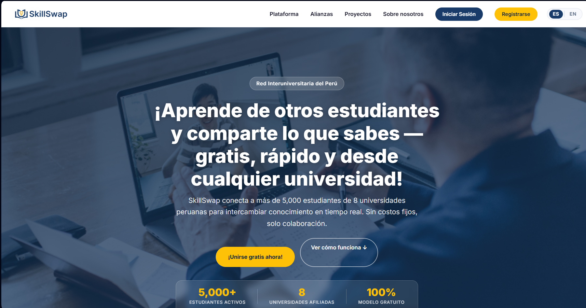
  <figcaption style="margin-top: 10px;">
    <em>Figura. Configuración de GitHub Pages evidenciando el despliegue actualizado de la Landing Page durante el Sprint 2.</em>
  </figcaption>
</figure>


Durante este Sprint, el despliegue del proyecto SkillSwap se centró en la publicación del frontend mediante Firebase Hosting y la configuración de una Fake API global utilizando My JSON Server. Estas acciones permitieron que el equipo contara con un entorno de producción real y persistente para las revisiones de software.

Las actividades clave incluyeron:

- Configuración de Environments: Sincronización del serverBasePath para apuntar al servidor REST remoto.

- Build de Producción: Generación de artefactos optimizados mediante Angular CLI.

- Hosting en Firebase: Inicialización y despliegue del directorio dist en la infraestructura de Google, asegurando el soporte para una Single-Page Application (SPA)

<br>

La implementación desplegada contiene las vistas correspondientes a Workspace, Discovery, Learning, Assessment, Moderation y Reputation, todas desarrolladas utilizando componentes frontend y datos simulados mediante Fake API.

<br><br>

<figure style="text-align: center; margin-bottom: 40px;">
  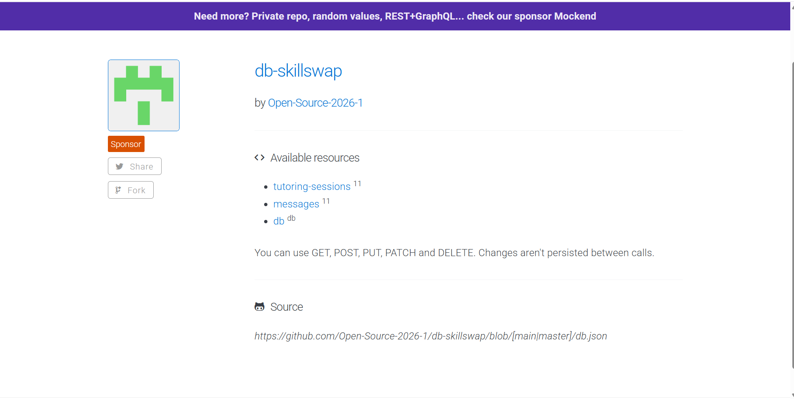
  <figcaption style="margin-top: 10px;">
    <em>Figura. Estructura del archivo db.json en el repositorio de GitHub y su visualización exitosa en el navegador a través de My JSON Server.</em>
  </figcaption>
</figure>

<br><br>

<figure style="text-align: center; margin-bottom: 40px;">
  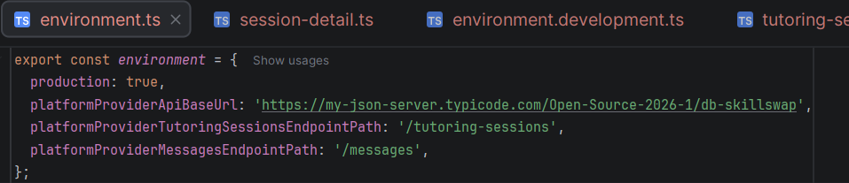
  <figcaption style="margin-top: 10px;">
    <em>Figura. Configuración del archivo environment.ts, donde se aprecia la nueva URL base apuntando al servidor de datos simulados.</em>
  </figcaption>
</figure>

<br><br>

<figure style="text-align: center; margin-bottom: 40px;">
  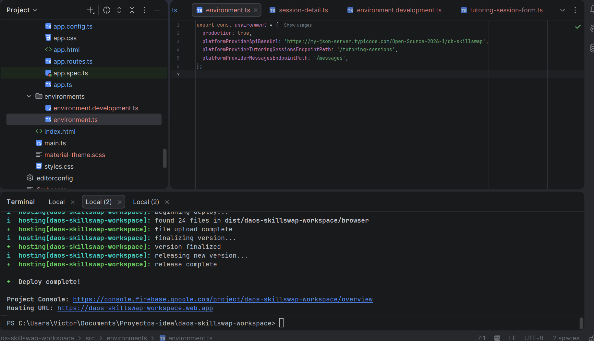
  <figcaption style="margin-top: 10px;">
    <em>Figura.Consola de Firebase Hosting, mostrando el historial de despliegues exitosos y la URL activa (.web.app) generada para el proyecto.</em>
  </figcaption>
</figure>

<br><br>

<figure style="text-align: center; margin-bottom: 40px;">
  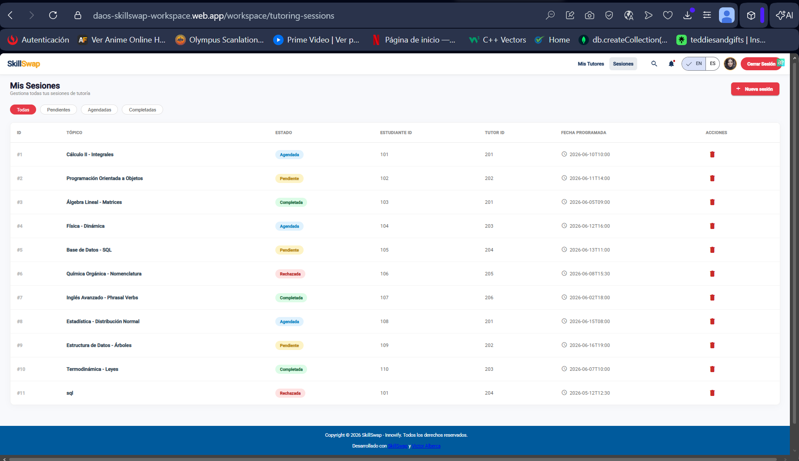
  <figcaption style="margin-top: 10px;">
    <em>Figura. Interfaz de la página principal de SkillSwap renderizada desde el dominio de Firebase, confirmando la integración total del frontend con la API simulada.</em>
  </figcaption>
</figure>

<br>
En conjunto, estas evidencias demuestran la disponibilidad del frontend de SkillSwap en un entorno de hosting profesional. Asimismo, reflejan la aplicación de buenas prácticas en el manejo de ambientes de despliegue y la organización colaborativa del proyecto bajo estándares de ingeniería de software.


<br>

**Enlaces de la página web (Sprint 2):** [https://skillswap-open-source.web.app](https://skillswap-open-source.web.app)


**Enlace del repositorio de las db de los proyectos:** https://github.com/Open-Source-2026-1/db-skillswap.git 

---

#### 5.2.2.8.Team Collaboration Insights during Sprint.
Durante este Sprint, el equipo concentró sus actividades en el desarrollo colaborativo del frontend de los módulos principales de SkillSwap. Para mantener un flujo de trabajo ordenado y minimizar conflictos durante la integración, se utilizó la metodología GitFlow junto con Conventional Commits.

Cada integrante trabajó en ramas independientes de tipo feature/nombre-modulo, permitiendo desarrollar paralelamente componentes asociados a Workspace, Discovery, Learning, Assessment, Moderation y Reputation.

Las integraciones fueron realizadas mediante Pull Requests hacia la rama develop, donde se ejecutaron revisiones de código y validaciones visuales antes de consolidar los cambios. Esta dinámica permitió mantener coherencia visual y estructural en todos los módulos implementados.

A continuación, se presentan las evidencias de colaboración y actividad del equipo durante el Sprint:

<br><br>

<figure style="text-align: center; margin-bottom: 40px;">
  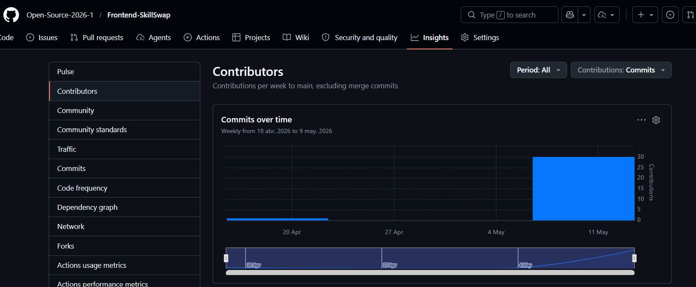
  <figcaption style="margin-top: 10px;">
    <em>Figura. En esta figura se observa el gráfico de actividad Commits over time, destacando un periodo de alta concentración de contribuciones y confirmaciones de código durante la primera quincena del mes de abril de 2026.</em>
  </figcaption>
</figure>

<br><br>

<figure style="text-align: center; margin-bottom: 40px;">
  
  <figcaption style="margin-top: 10px;">
    <em>Figura 119. En la imagen tenemos el panel de estadísticas de los colaboradores, el cual detalla el volumen total de commits, así como las líneas de código agregadas (en verde) y eliminadas (en rojo) individualmente por cada miembro del equipo.</em>
  </figcaption>
</figure>

<br><br>

<figure style="text-align: center; margin-bottom: 40px;">
  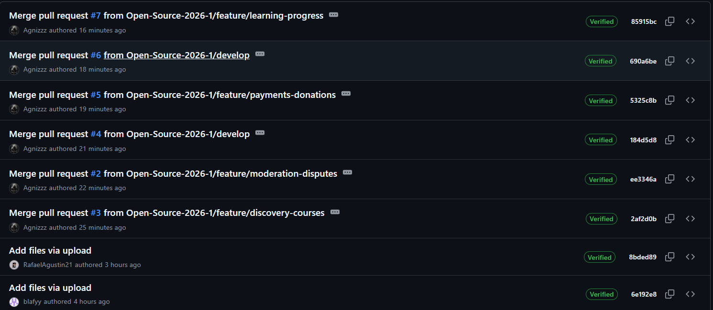
  <figcaption style="margin-top: 10px;">
    <em>Figura. Se observa el listado de confirmaciones recientes en el repositorio, evidenciando la coexistencia de integraciones de ramas (Merge pull requests), la aplicación de Conventional Commits (feat:) y subidas de código directas.</em>
  </figcaption>
</figure>

<br><br>

<figure style="text-align: center; margin-bottom: 40px;">
  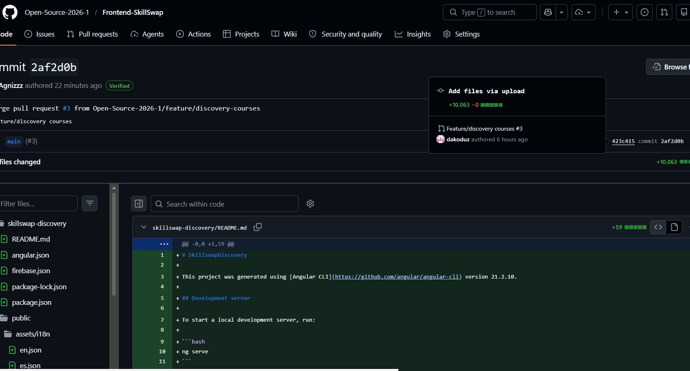
  <figcaption style="margin-top: 10px;">
    <em>Figura. En esta figura se detalla un Pull Request estructurado, mostrando una descripción clara mediante viñetas sobre los cambios introducidos y el indicador de validación en verde (Ready to merge), lo que confirma que está listo para integrarse sin problemas.</em>
  </figcaption>
</figure>

<br>

<br>
En conjunto, las evidencias reflejan un proceso de desarrollo activo y colaborativo, caracterizado por un alto volumen de contribuciones durante periodos clave y una participación equilibrada del equipo. Asimismo, se observa la aplicación de buenas prácticas como el uso de Conventional Commits y la gestión de Pull Requests bien estructurados, lo que facilita la integración del código. Sin embargo, también se identifican casos de conflictos y falta de documentación en algunas solicitudes, evidenciando la importancia de mantener estándares consistentes para garantizar un flujo de trabajo eficiente, ordenado y libre de errores.


---

## 5.2.3. Sprint 3
En esta sección se registra y explica el avance en términos de producto y trabajo colaborativo para el Sprint 3. El enfoque de esta iteración es el desarrollo e implementación de los Web Services (RESTful API) con Spring Boot para cada bounded context, así como el inicio de la integración con el Frontend Web Application desarrollado en el Sprint 2.

---

### 5.2.3.1.Sprint Planning 3.
Para este Sprint 3, el equipo se comprometió a implementar el 40% del backend de SkillSwap, priorizando los bounded contexts de Workspace, 
Reputation System y Moderation & Disputes como los más críticos para el core del negocio. Los bounded contexts de Discovery, Learning & 
Assessment y Payments & Wallet se encuentran en proceso de implementación y serán completados en el Sprint 4.

| Sprint # | Sprint 3 |
| :--- | :--- |
| **Sprint Planning Background** | |
| **Date** | 2026-05-30 |
| **Time** | 08:00 PM |
| **Location** | Reunión virtual (Google Meet) |
| **Prepared By** | Alberca Saavedra, Victor Manuel |
| **Attendees (to planning meeting)** | Alberca Saavedra, Victor Manuel / Komatsu Dueñas, David / Vargas Alarcón, Santiago Enrique / Becerra Ninahuanca, Luis Ángel / Pacheco Lavado, Rafael Agustín |
| **Sprint 2 Review Summary** | En el Sprint 2 se completaron exitosamente las interfaces frontend de los bounded contexts Discovery, Workspace, Learning & Assessment, Reputation System, Payments & Wallet y Moderation & Disputes, con navegación SPA y consumo de Fake APIs mediante json-server. |
| **Sprint 2 Retrospective Summary** | El equipo identificó la necesidad de avanzar hacia servicios reales con Spring Boot para reemplazar las Fake APIs, establecer contratos de API claros entre frontend y backend, y asegurar consistencia en los nombres de endpoints y modelos de datos entre ambas capas. |
| **Sprint Goal & User Stories** | |
| **Sprint 3 Goal** | Nuestro enfoque está en implementar y desplegar los Web Services RESTful con Spring Boot para los bounded contexts principales de SkillSwap, e iniciar su integración con el Frontend Web Application. Creemos que esto permitirá reemplazar progresivamente las Fake APIs por servicios reales, validando el flujo completo de datos entre la capa de presentación y la capa de negocio. Esto se confirmará cuando los principales flujos del sistema — búsqueda de tutores, gestión de sesiones, pagos y moderación — funcionen de extremo a extremo consumiendo los endpoints reales desplegados. |
| **Sprint 3 Velocity** | 53 Story Points |
| **Sum of Story Points** | 53 |

*(Tabla. Tabla de Sprint Planning 3 - Elaboración propia.)*

---

### 5.2.3.2. Aspect Leaders and Collaborators.
Durante el Sprint 3, los aspectos de trabajo se organizaron por bounded context backend, manteniendo la misma distribución de responsabilidades del Sprint anterior para asegurar continuidad y dominio del contexto por parte de cada líder.

| Team Member | GitHub Username | Aspecto 1 (Discovery BC) | Aspecto 2 (Workspace BC) | Aspecto 3 (Learning & Assessment BC) | Aspecto 4 (Moderation & Disputes BC) | Aspecto 5 (Reputation System BC) | Aspecto 6 (Payments & Wallet BC) |
| :--- | :--- | :---: | :---: | :---: | :---: | :---: | :---: |
| **Alberca Saavedra, Victor Manuel** | VictprAlberca | L | L | C | C | C | C |
| **Komatsu Dueñas, David** | DavidKomatsu | C | C | L | C | C | C |
| **Pacheco Lavado, Rafael Agustín** | RafaelPacheco | C | C | C | C | C | L |
| **Becerra Ninahuanca, Luis Ángel** | LuisBecerra | C | C | C | L | C | C |
| **Vargas Alarcón, Santiago Enrique** | SantiagoVargas | C | C | C | C | L | C |

*(Nota: L = Leader, C = Collaborator)*

*(Tabla. Tabla de Aspect Leaders and Collaborators - Elaboración propia.)*

---

#### 5.2.3.3. Sprint Backlog 3

El objetivo principal del Sprint 3 es completar las funcionalidades
frontend pendientes del Sprint 2 e implementar los Web Services RESTful
con Spring Boot para los bounded contexts del sistema SkillSwap,
iniciando su integración con el Frontend Angular ya desplegado.

Se presenta la tabla de Sprint 3 que logramos avanzar con el grupo:

| ID | User Story | Epic | Priority | SP |
| :---: | :--- | :--- | :---: | :---: |
| **US09** | Accept or reject reservation request | Session Coordination & Communication | High | 2 |
| **US10** | Asynchronous internal chat for the reservation | Session Coordination & Communication | High | 5 |
| **US16** | Solve interactive validation Quiz | Academic Quality Assurance | High | 5 |
| **US18** | Make a voluntary monetary donation | Ratings & Monetization | High | 5 |
| **US19** | View Virtual Wallet and balance | Ratings & Monetization | Medium | 3 |
| **US21** | Cancel pending or scheduled reservation | Session Coordination & Communication | Medium | 2 |
| **US25** | Review and resolve academic disputes | Analytics & Moderation | Medium | 3 |
| **US26** | Institutional domain validation and token sending | Backend API & Integrations | High | 5 |
| **US27** | Payment Gateway API Integration | Backend API & Integrations | High | 5 |
| **US28** | Token generation for WebRTC | Backend API & Integrations | High | 8 |
| **US29** | Cloud Storage API integration for chat | Backend API & Integrations | Medium | 5 |
| **US30** | Aggregation endpoint for Academic Dashboard | Backend API & Integrations | Medium | 5 |
| | | | **Total Story Points** | **53** |

A continuación, se presenta una captura de pantalla del estado actual de
nuestro tablero de control para el Sprint 3:

<p align="center">
  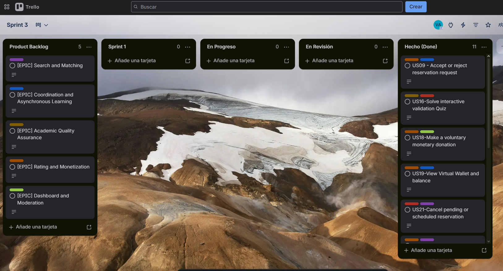
  <br>
  <em>Figura X. Tablero de seguimiento del Sprint 3 en Trello. La imagen
  evidencia la estructura del flujo de trabajo dividida en columnas clave:
  Product Backlog, Sprint Actual, En Progreso, En Revisión y Done.</em>
</p>

**Enlace del Trello:** [https://trello.com/invite/b/6917422e9c08cc04d9b59d1e/ATTId1b0ecfecfdda8662f8e494d32174e18836EB535/sprint-3](https://trello.com/invite/b/6917422e9c08cc04d9b59d1e/ATTId1b0ecfecfdda8662f8e494d32174e18836EB535/sprint-3)

| Sprint # | Sprint 3 | | | | | | |
| :--- | :--- | :--- | :--- | :--- | :---: | :--- | :--- |
| **User Story** | | **Work-Item / Task** | | | | | |
| **Id** | **Title** | **Id** | **Title** | **Description** | **Estimation (Hours)** | **Assigned To** | **Status** |
| **US09** | Accept or reject reservation request | T01 | Design action buttons UI | Create accept and reject button components with Material Design | 4 hr | Victor | DONE |
| | | T02 | Implement action state logic | Handle UI state changes on accept/reject actions using backend API | 5 hr | Victor | DONE |
| **US10** | Asynchronous internal chat for the reservation | T03 | Design chat interface layout | Create responsive chat UI component with message bubbles and input area | 5 hr | Victor | DONE |
| | | T04 | Implement message rendering logic | Display conversations fetched from backend API | 4 hr | Victor | DONE |
| | | T05 | Connect chat to backend API | Fetch and send messages via GET/POST to Spring Boot endpoints | 5 hr | Victor | DONE |
| **US16** | Solve interactive validation Quiz | T06 | Design quiz resolution UI | Create quiz-taking view with question navigation and answer selection | 5 hr | David | DONE |
| | | T07 | Implement answer submission logic | Handle answer selection, submission and score calculation | 4 hr | David | DONE |
| | | T08 | Display results and feedback view | Show score summary and per-question feedback after quiz completion | 4 hr | David | DONE |
| **US18** | Make a voluntary monetary donation | T09 | Design donation UI form | Create donation form with amount selection and payment method inputs | 4 hr | Rafael | DONE |
| | | T10 | Implement donation amount logic | Handle fixed and custom amount selection with validation | 4 hr | Rafael | DONE |
| | | T11 | Connect donation to backend API | Connect donation submission to Spring Boot POST endpoint | 5 hr | Rafael | DONE |
| **US19** | View Virtual Wallet and balance | T12 | Design wallet dashboard view | Create wallet component showing balance and transaction history | 4 hr | Rafael | DONE |
| | | T13 | Fetch wallet data from backend API | Retrieve and display wallet balance via Spring Boot GET endpoint | 5 hr | Rafael | DONE |
| **US21** | Cancel pending or scheduled reservation | T14 | Design cancellation UI | Create cancellation button and confirmation dialog component | 4 hr | Victor | DONE |
| | | T15 | Implement cancellation logic | Handle reservation status update via backend API | 5 hr | Victor | DONE |
| **US25** | Review and resolve academic disputes | T16 | Design moderation table view | Create dispute list table with status indicators and detail panel | 4 hr | Luis | DONE |
| | | T17 | Implement dispute resolution logic | Handle dispute status updates (resolve/reject) with backend API | 5 hr | Luis | DONE |
| | | T18 | Add filtering and search to moderation table | Enable search and filter by status/category in the dispute list | 4 hr | Luis | DONE |
| **US26** | Institutional domain validation and token sending | T19 | Implement domain validation endpoint | Validate .edu.pe domain via regex and send JWT confirmation token by email | 5 hr | Victor | DONE |
| | | T20 | Integrate email service | Connect Spring Boot to email API (SendGrid) for token delivery | 4 hr | Victor | DONE |
| **US27** | Payment Gateway API Integration | T21 | Integrate payment gateway | Connect Spring Boot to Stripe API for card donation processing | 5 hr | Rafael | DONE |
| | | T22 | Implement commission calculation | Calculate and retain 5% platform commission in the backend service | 4 hr | Rafael | DONE |
| **US28** | Token generation for WebRTC | T23 | Implement WebRTC token endpoint | Consume Agora.io API to generate temporary access tokens from backend | 5 hr | David | DONE |
| | | T24 | Integrate token with frontend video call | Pass generated token to Angular frontend for embedded video session | 4 hr | David | DONE |
| **US29** | Cloud Storage API integration for chat | T25 | Integrate cloud storage service | Connect Spring Boot to Cloudinary for PDF and image upload management | 5 hr | Luis | DONE |
| | | T26 | Implement file upload endpoint | Create POST endpoint for file upload returning accessible URL | 4 hr | Luis | DONE |
| **US30** | Aggregation endpoint for Academic Dashboard | T27 | Implement aggregation query | Create JPA aggregation query to count top requested tutoring courses | 4 hr | Santiago | DONE |
| | | T28 | Implement dashboard endpoint | Create RESTful GET endpoint returning optimized JSON for B2B Dashboard | 5 hr | Santiago | DONE |

*(Tabla. Tabla de Sprint Backlog 3 - Elaboración propia.)*

---

### 5.2.3.4.Development Evidence for Sprint Review.
En esta sección se resumen los principales avances logrados en la implementación durante el Sprint 3, centrados en el desarrollo de los Web Services RESTful con Spring Boot para cada bounded context del sistema SkillSwap. Cada integrante implementó los endpoints correspondientes a su bounded context asignado, siguiendo la arquitectura RESTful y las convenciones de codificación definidas en la sección 5.1.3. Todas las contribuciones se realizaron mediante ramas `feature/` bajo GitFlow y mensajes de commit siguiendo Conventional Commits.

| Repository | Branch | Commit Id | Commit Message | Commit Message Body | Committed on (Date) |
| :--- | :--- | :--- | :--- | :--- | :--- |
| Open-Source-2026-1/backend-skillswap | feature/discovery-bc | e48e02b1e4d24a82885dd5c77b151bd0fcb531c8 | feat: implement tutor entity and repository | Defined Tutor JPA entity, TutorRepository and initial DB schema for Discovery BC. | 2026-06-11 |
| Open-Source-2026-1/backend-skillswap | feature/discovery-bc | e48e02b1e4d24a82885dd5c77b151bd0fcb531c8 | feat: implement GET /api/v1/tutors endpoint | Added TutorService and TutorController with list and filter by skill support. | 2026-06-10 |
| Open-Source-2026-1/backend-skillswap | feature/workspace-bc | a50fa9cc5fca95b783429a98845ef5c24b7a59b7 | feat: implement tutoring session entity and POST endpoint | Defined TutoringSession entity and implemented POST /api/v1/tutoring-sessions with validation. | 2026-06-12 |
| Open-Source-2026-1/backend-skillswap | feature/workspace-bc | a50fa9cc5fca95b783429a98845ef5c24b7a59b7| feat: implement GET and PUT session endpoints | Added GET /api/v1/tutoring-sessions/{id} and PUT /api/v1/tutoring-sessions/{id} for status management. | 2026-06-12 |
| Open-Source-2026-1/backend-skillswap | feature/learning-bc | e48e02b1e4d24a82885dd5c77b151bd0fcb531c8 | feat: implement quiz entity and POST /api/v1/quizzes | Defined Quiz and Question entities with JPA and implemented quiz creation endpoint. | 2026-06-13 |
| Open-Source-2026-1/backend-skillswap | feature/learning-bc | e48e02b1e4d24a82885dd5c77b151bd0fcb531c8 | feat: implement quiz attempt submission with scoring | Added QuizAttempt entity with automatic score calculation and POST /api/v1/quiz-attempts. | 2026-06-13 |
| Open-Source-2026-1/backend-skillswap | feature/reputation-bc | 11b51d76e1f50f93b1fb42797d98f91fa9246e4a | feat: implement review entity and POST /api/v1/reviews | Defined Review entity and implemented review submission endpoint for Reputation BC. | 2026-06-13 |
| Open-Source-2026-1/backend-skillswap | feature/payments-bc | 5e667c05cbc6c69f5b05bcb232825371b263e4f3 | feat: implement donation entity with 5% commission logic | Defined Donation entity with automatic net amount and commission calculation. | 2026-06-14 |
| Open-Source-2026-1/backend-skillswap | feature/payments-bc | 5e667c05cbc6c69f5b05bcb232825371b263e4f3| feat: implement wallet endpoint GET /api/v1/wallets/{tutorId} | Added Wallet entity and GET endpoint to retrieve tutor wallet balance. | 2026-06-14 |
| Open-Source-2026-1/backend-skillswap | feature/moderation-bc | 11b51d76e1f50f93b1fb42797d98f91fa9246e4a | feat: implement report entity and POST /api/v1/reports | Defined Report entity and implemented misconduct report submission endpoint. | 2026-06-14 |

*(Tabla. Tabla de Development Evidence for Sprint Review - Elaboración propia.)*

<figure style="text-align: center; margin-bottom: 40px;">
  
  <figcaption style="margin-top: 10px; font-style: italic;">
    Figura. Historial de commits del repositorio backend durante el Sprint 3, evidenciando los aportes individuales de cada integrante en sus ramas feature correspondientes a cada bounded context.
  </figcaption>
</figure>

---

### 5.2.3.5.Execution Evidence for Sprint Review.
Durante el Sprint 3, el equipo logró implementar y desplegar la primera versión funcional de los Web Services RESTful con Spring Boot, cubriendo los endpoints principales de los bounded contexts Discovery, Workspace, Learning & Assessment, Reputation System, Payments & Wallet y Moderation & Disputes. Los servicios fueron documentados con OpenAPI y verificados mediante Swagger UI, permitiendo validar el comportamiento de cada endpoint con datos de prueba antes de la integración con el frontend.

Paralelamente, el Frontend Web Application fue actualizado incorporando mejoras derivadas de las entrevistas de validación y la evaluación heurística realizada durante el AV2. A continuación se detallan los cambios implementados:

**Mejoras en el módulo de Moderación:**

1. Corrección del nombre del usuario reportado en el panel de moderación.
2. Acceso al historial de chat directamente desde el reporte.
3. Badges de rol (Tutor / Aprendiz) en la lista de usuarios del coordinador.
4. Información ampliada del tutor con estadísticas de desempeño.
5. Historial de actividad de usuarios en el panel del coordinador.
6. Sistema de sanciones con 3 niveles de severidad (advertencia, suspensión, baneo).
7. Exportación de reportes en formato PDF.
8. Guía rápida de uso para el rol coordinador.

**Mejoras en el módulo del Estudiante:**

| Grupo | Cambios implementados |
| :--- | :--- |
| A | Nombres reales del tutor visibles en las tarjetas de sesión, corrección del color del botón de solicitud y fechas en formato legible. |
| B | Banner CTA de búsqueda de tutores, filtro por disponibilidad y 5 nuevas áreas académicas disponibles. |
| C | Campo de nivel del estudiante y mensaje inicial visible al aceptar una sesión de tutoría. |
| D | Visualización de portafolio y especialidad del tutor en su perfil, con opción de responder reseñas. |
| E | Explicación del modelo de wallet con desglose detallado de comisiones antes de confirmar una donación. |
| F | Home enriquecido con banner interuniversitario y chip de especialidad en las tarjetas de tutores. |

A continuación se presentan capturas representativas de la ejecución de los servicios y el frontend actualizado:

<figure style="text-align: center; margin-bottom: 40px;">
  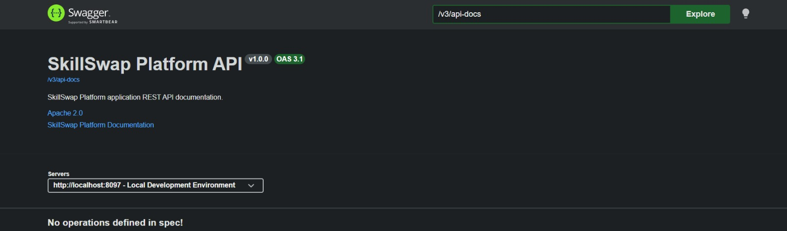
  <figcaption style="margin-top: 10px; font-style: italic;">
    Figura. Interfaz de Swagger UI mostrando los endpoints documentados del backend SkillSwap desplegados durante el Sprint 3.
  </figcaption>
</figure>

<figure style="text-align: center; margin-bottom: 40px;">
  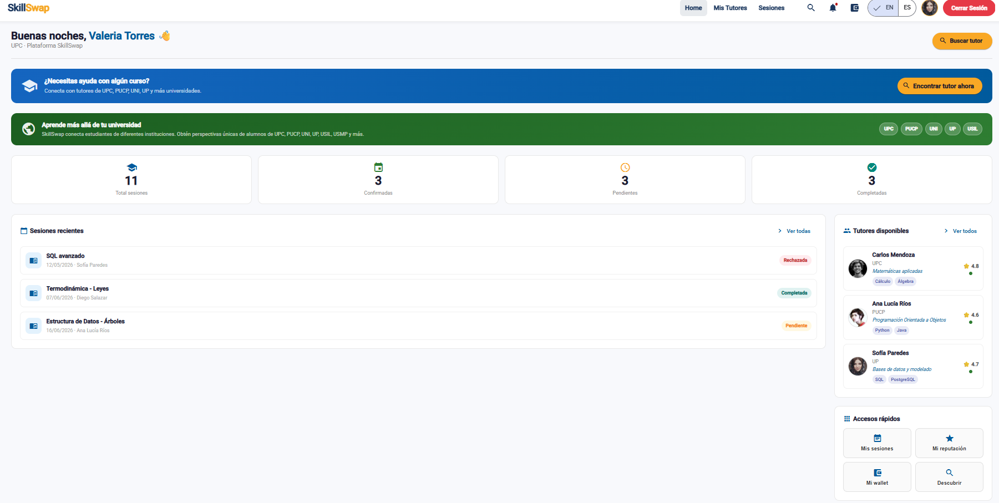
  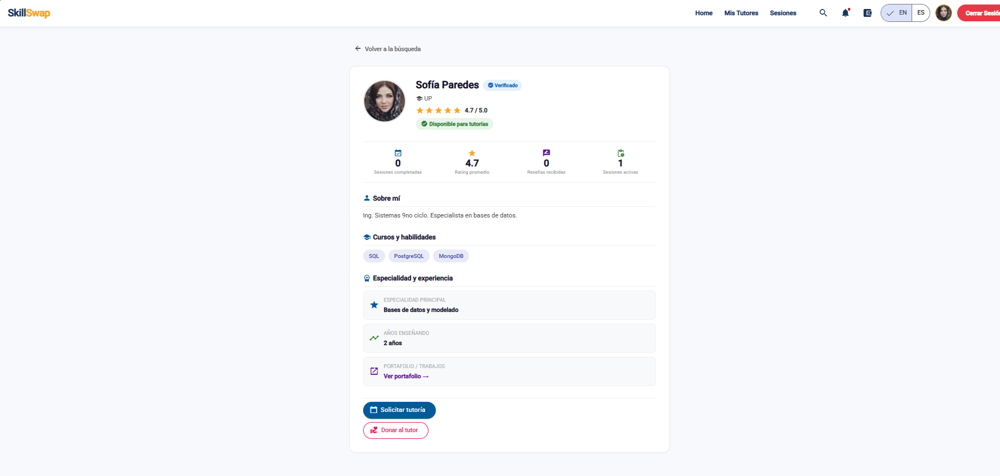
  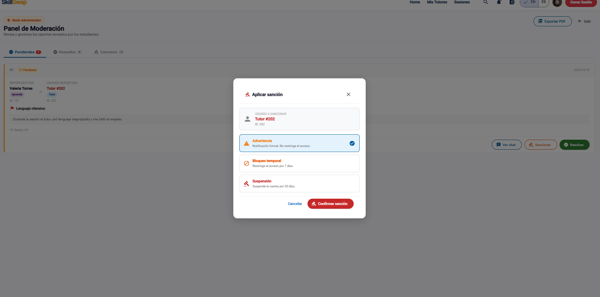
  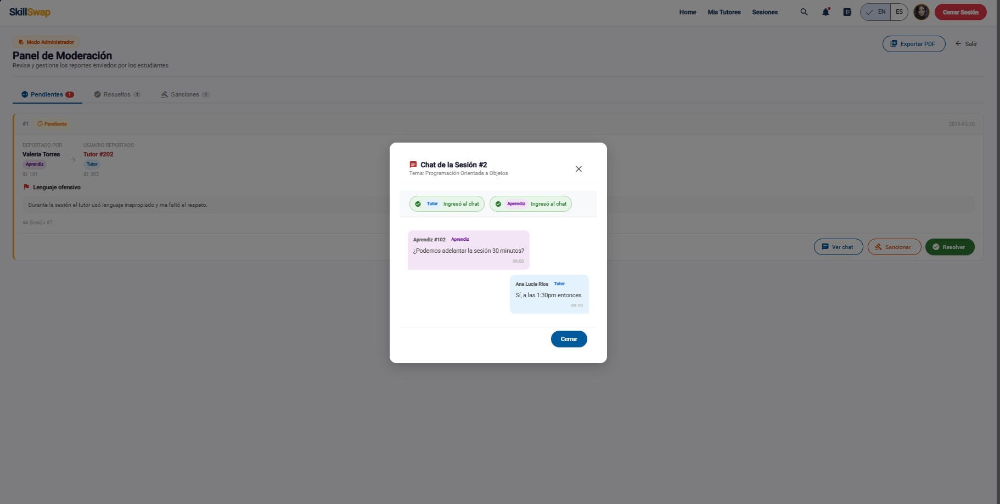
  <figcaption style="margin-top: 10px; font-style: italic;">
    Figura. Vista de las mejoras del Frontend Web Application, evidenciando los cambios en la interfaz de usuario derivados de la validación con usuarios reales.
  </figcaption>
</figure>

**Enlace al video de navegación (Sprint 3):** [ver video](https://upcedupe-my.sharepoint.com/:v:/g/personal/u201924127_upc_edu_pe/IQD-6tMDvmwiQpWk7m14V3oOAUhoMvbAhkTombznu7ZG3Lw?e=FRHvor&nav=eyJyZWZlcnJhbEluZm8iOnsicmVmZXJyYWxBcHAiOiJTdHJlYW1XZWJBcHAiLCJyZWZlcnJhbFZpZXciOiJTaGFyZURpYWxvZy1MaW5rIiwicmVmZXJyYWxBcHBQbGF0Zm9ybSI6IldlYiIsInJlZmVycmFsTW9kZSI6InZpZXcifX0%3D)

<figure style="text-align: center; margin-bottom: 40px;">
  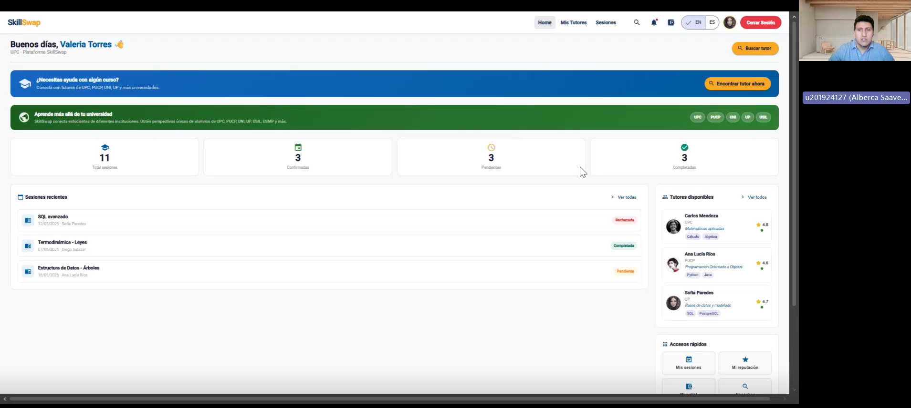
  <figcaption style="margin-top: 10px; font-style: italic;">
    Figura.Video de los cambios del sprint 3 mejorados con lo del sprint 2.
  </figcaption>
</figure>

---

### 5.2.3.6.Services Documentation Evidence for Sprint Review.
En esta sección se incluye la relación de endpoints documentados con OpenAPI durante el Sprint 3. Los Web Services fueron implementados con Spring Boot y documentados mediante Swagger, accesibles en la URL de despliegue indicada. A continuación se detalla la documentación de cada endpoint implementado por bounded context:

**URL de documentación Swagger:** [https://backend-skillswap-production-746f.up.railway.app/swagger-ui/index.html](https://backend-skillswap-production-746f.up.railway.app/swagger-ui/index.html)

**URL del repositorio backend:** [https://github.com/Open-Source-2026-1/backend-skillswap ](https://github.com/Open-Source-2026-1/backend-skillswap )

---

##### Bounded Context: Discovery

| Endpoint | Action | HTTP Verb | Call Syntax | Parameters | Response Example |
| :--- | :--- | :---: | :--- | :--- | :--- |
| /api/v1/tutors | Create tutor | POST | `POST /api/v1/tutors` | Body: tutor object | `{"id":1,"name":"Carlos Mendoza","university":"UPC","bio":"...","rating":4.8,"skills":["Cálculo"],"available":true,"specialty":"Matemáticas","portfolioUrl":"...","yearsExperience":2,"createdAt":"2026-06-15","updatedAt":"2026-06-15"}` |
| /api/v1/tutors | Get all tutors | GET | `GET /api/v1/tutors` | None | `[{"id":1,"name":"Carlos Mendoza","university":"UPC","rating":4.8,"available":true}]` |
| /api/v1/tutors/{tutorId} | Get tutor by ID | GET | `GET /api/v1/tutors/1` | tutorId (path) | `{"id":1,"name":"Carlos Mendoza","university":"UPC","rating":4.8}` |
| /api/v1/tutors/available/{available} | Get tutors by availability | GET | `GET /api/v1/tutors/available/true` | available (path) | `[{"id":1,"name":"Carlos Mendoza","available":true}]` |
| /api/v1/tutors/university/{university} | Get tutors by university | GET | `GET /api/v1/tutors/university/UPC` | university (path) | `[{"id":1,"name":"Carlos Mendoza","university":"UPC"}]` |
| /api/v1/tutors/specialty/{specialty} | Get tutors by specialty | GET | `GET /api/v1/tutors/specialty/Matemáticas` | specialty (path) | `[{"id":1,"name":"Carlos Mendoza","specialty":"Matemáticas"}]` |
| /api/v1/tutors/{tutorId} | Update tutor | PUT | `PUT /api/v1/tutors/1` | tutorId (path), Body: tutor object | `{"id":1,"name":"Carlos Mendoza","rating":4.9}` |
| /api/v1/tutors/{tutorId} | Delete tutor | DELETE | `DELETE /api/v1/tutors/1` | tutorId (path) | 204 No Content |


<figure style="text-align: center; margin-bottom: 40px;">
  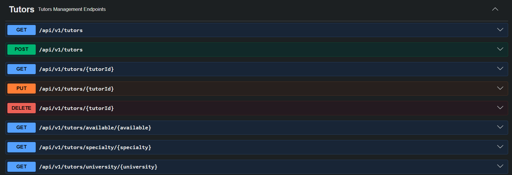
  <figcaption style="margin-top: 10px; font-style: italic;">
    Figura. Captura de Swagger UI mostrando los endpoints implementados durante el Sprint 3, con ejemplos de request y response para los principales bounded contexts.
  </figcaption>
</figure>


---

##### Bounded Context: Workspace

| Endpoint | Action | HTTP Verb | Call Syntax | Parameters | Response Example |
| :--- | :--- | :---: | :--- | :--- | :--- |
| /api/v1/tutoring-sessions | Create tutoring session | POST | `POST /api/v1/tutoring-sessions` | Body: session object | `{"id":1,"topic":"Cálculo II","learnerId":1,"tutorId":1,"scheduledAt":"2026-06-10T10:00","status":"pending","message":"Necesito ayuda","studentLevel":"intermedio","createdAt":"2026-06-15","updatedAt":"2026-06-15"}` |
| /api/v1/tutoring-sessions | Get all tutoring sessions | GET | `GET /api/v1/tutoring-sessions` | None | `[{"id":1,"topic":"Cálculo II","status":"pending"}]` |
| /api/v1/tutoring-sessions/{sessionId} | Get session by ID | GET | `GET /api/v1/tutoring-sessions/1` | sessionId (path) | `{"id":1,"topic":"Cálculo II","status":"pending"}` |
| /api/v1/tutoring-sessions/learner/{learnerId} | Get sessions by learner | GET | `GET /api/v1/tutoring-sessions/learner/1` | learnerId (path) | `[{"id":1,"topic":"Cálculo II","learnerId":1}]` |
| /api/v1/tutoring-sessions/tutor/{tutorId} | Get sessions by tutor | GET | `GET /api/v1/tutoring-sessions/tutor/1` | tutorId (path) | `[{"id":1,"topic":"Cálculo II","tutorId":1}]` |
| /api/v1/tutoring-sessions/status/{status} | Get sessions by status | GET | `GET /api/v1/tutoring-sessions/status/pending` | status (path) | `[{"id":1,"topic":"Cálculo II","status":"pending"}]` |
| /api/v1/tutoring-sessions/{sessionId} | Update tutoring session | PUT | `PUT /api/v1/tutoring-sessions/1` | sessionId (path), Body: session object | `{"id":1,"topic":"Cálculo II actualizado","status":"pending"}` |
| /api/v1/tutoring-sessions/{sessionId}/status | Update session status | PATCH | `PATCH /api/v1/tutoring-sessions/1/status` | sessionId (path), Body: `{"status":"scheduled"}` | `{"id":1,"status":"scheduled"}` |
| /api/v1/messages | Create message | POST | `POST /api/v1/messages` | Body: message object | `{"id":1,"content":"Hola","senderId":1,"sessionId":1,"sentAt":"2026-06-10T10:05","createdAt":"2026-06-15","updatedAt":"2026-06-15"}` |
| /api/v1/messages/session/{sessionId} | Get messages by session | GET | `GET /api/v1/messages/session/1` | sessionId (path) | `[{"id":1,"content":"Hola","senderId":1,"sessionId":1}]` |
| /api/v1/messages/{messageId} | Get message by ID | GET | `GET /api/v1/messages/1` | messageId (path) | `{"id":1,"content":"Hola","senderId":1,"sessionId":1}` |


<figure style="text-align: center; margin-bottom: 40px;">
  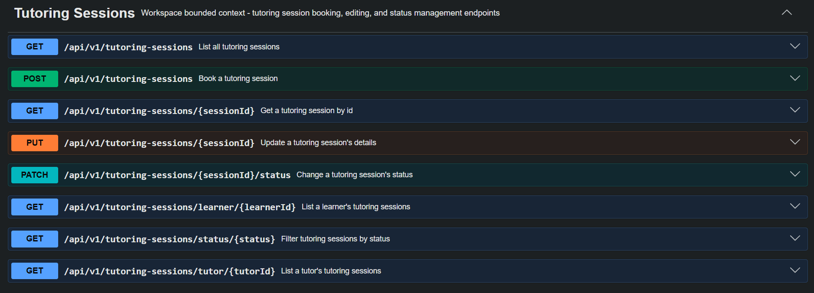
   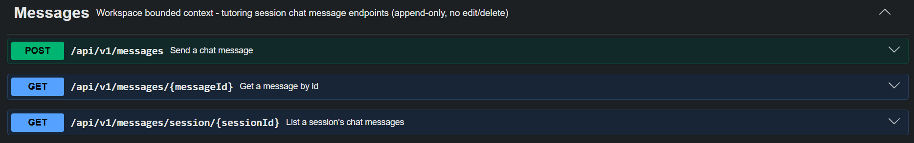
  <figcaption style="margin-top: 10px; font-style: italic;">
    Figura. Captura de Swagger UI mostrando los endpoints implementados durante el Sprint 3, con ejemplos de request y response para los principales bounded contexts.
  </figcaption>
</figure>

---

##### Bounded Context: Learning & Assessment

| Endpoint | Action | HTTP Verb | Call Syntax | Parameters | Response Example |
| :--- | :--- | :---: | :--- | :--- | :--- |
| /api/v1/quizzes | Create quiz | POST | `POST /api/v1/quizzes` | Body: quiz object | `{"id":1,"title":"Evaluación de Integrales","course":"Cálculo","tutorId":1,"questions":["¿Qué es una integral?"],"createdAt":"2026-06-15","updatedAt":"2026-06-15"}` |
| /api/v1/quizzes | Get all quizzes | GET | `GET /api/v1/quizzes` | None | `[{"id":1,"title":"Evaluación de Integrales","course":"Cálculo"}]` |
| /api/v1/quizzes/{quizId} | Get quiz by ID | GET | `GET /api/v1/quizzes/1` | quizId (path) | `{"id":1,"title":"Evaluación de Integrales"}` |
| /api/v1/quizzes/tutor/{tutorId} | Get quizzes by tutor | GET | `GET /api/v1/quizzes/tutor/1` | tutorId (path) | `[{"id":1,"title":"Evaluación de Integrales","tutorId":1}]` |
| /api/v1/quizzes/course/{course} | Get quizzes by course | GET | `GET /api/v1/quizzes/course/Cálculo` | course (path) | `[{"id":1,"title":"Evaluación de Integrales","course":"Cálculo"}]` |
| /api/v1/quizzes/{quizId} | Update quiz | PUT | `PUT /api/v1/quizzes/1` | quizId (path), Body: quiz object | `{"id":1,"title":"Evaluación actualizada"}` |
| /api/v1/quizzes/{quizId} | Delete quiz | DELETE | `DELETE /api/v1/quizzes/1` | quizId (path) | 204 No Content |
| /api/v1/quiz-attempts | Create quiz attempt | POST | `POST /api/v1/quiz-attempts` | Body: `{"quizId":1,"learnerId":1}` | `{"id":1,"quizId":1,"learnerId":1,"status":"in_progress","createdAt":"2026-06-15"}` |
| /api/v1/quiz-attempts | Get all quiz attempts | GET | `GET /api/v1/quiz-attempts` | None | `[{"id":1,"quizId":1,"learnerId":1,"status":"in_progress"}]` |
| /api/v1/quiz-attempts/{attemptId} | Get attempt by ID | GET | `GET /api/v1/quiz-attempts/1` | attemptId (path) | `{"id":1,"quizId":1,"learnerId":1,"score":null,"status":"in_progress"}` |
| /api/v1/quiz-attempts/learner/{learnerId} | Get attempts by learner | GET | `GET /api/v1/quiz-attempts/learner/1` | learnerId (path) | `[{"id":1,"quizId":1,"learnerId":1,"status":"in_progress"}]` |
| /api/v1/quiz-attempts/quiz/{quizId} | Get attempts by quiz | GET | `GET /api/v1/quiz-attempts/quiz/1` | quizId (path) | `[{"id":1,"quizId":1,"learnerId":1}]` |
| /api/v1/quiz-attempts/{attemptId}/complete | Complete quiz attempt | PATCH | `PATCH /api/v1/quiz-attempts/1/complete` | attemptId (path), Body: `{"score":4.5}` | `{"id":1,"score":4.5,"status":"completed"}` |
| /api/v1/quiz-attempts/{attemptId} | Delete quiz attempt | DELETE | `DELETE /api/v1/quiz-attempts/1` | attemptId (path) | 204 No Content |


<figure style="text-align: center; margin-bottom: 40px;">
  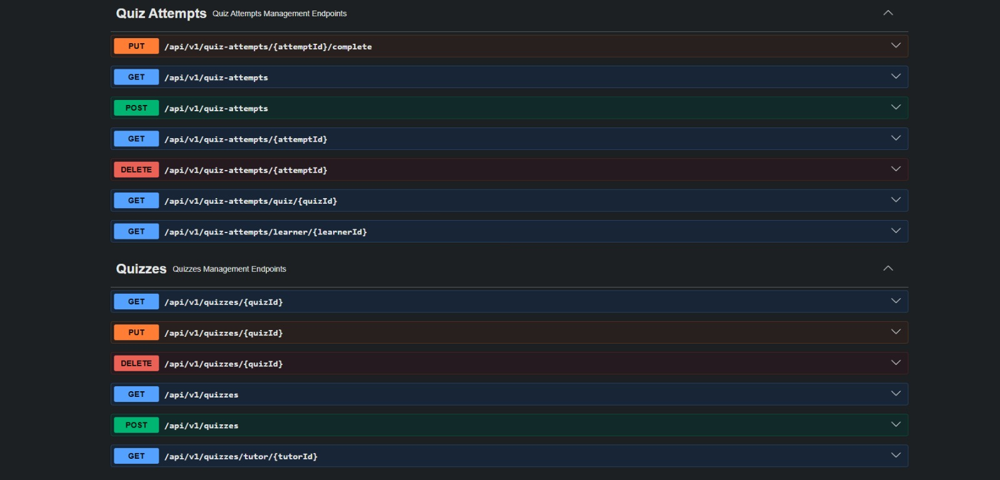
  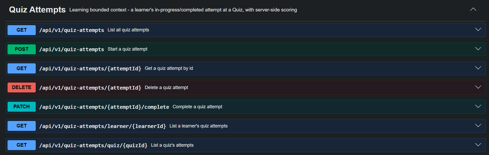
  <figcaption style="margin-top: 10px; font-style: italic;">
    Figura. Captura de Swagger UI mostrando los endpoints implementados durante el Sprint 3, con ejemplos de request y response para los principales bounded contexts.
  </figcaption>
</figure>

---

##### Bounded Context: Reputation System

| Endpoint | Action | HTTP Verb | Call Syntax | Parameters | Response Example |
| :--- | :--- | :---: | :--- | :--- | :--- |
| /api/v1/reviews | Submit review | POST | `POST /api/v1/reviews` | Body: review object | `{"id":1,"tutorId":1,"learnerId":1,"learnerName":"Jazmín","rating":5.0,"comment":"Excelente tutor","sessionId":1,"tutorReply":"","createdAt":"2026-06-15","updatedAt":"2026-06-15"}` |
| /api/v1/reviews | Get all reviews | GET | `GET /api/v1/reviews` | None | `[{"id":1,"tutorId":1,"rating":5.0,"comment":"Excelente tutor"}]` |
| /api/v1/reviews/{reviewId} | Get review by ID | GET | `GET /api/v1/reviews/1` | reviewId (path) | `{"id":1,"tutorId":1,"rating":5.0}` |
| /api/v1/reviews/tutor/{tutorId} | Get reviews by tutor | GET | `GET /api/v1/reviews/tutor/1` | tutorId (path) | `[{"id":1,"tutorId":1,"rating":5.0}]` |
| /api/v1/reviews/learner/{learnerId} | Get reviews by learner | GET | `GET /api/v1/reviews/learner/1` | learnerId (path) | `[{"id":1,"learnerId":1,"rating":5.0}]` |
| /api/v1/reviews/{reviewId} | Update review | PUT | `PUT /api/v1/reviews/1` | reviewId (path), Body: `{"rating":4.5,"comment":"Muy bueno","tutorReply":"Gracias"}` | `{"id":1,"rating":4.5,"tutorReply":"Gracias","updatedAt":"2026-06-15"}` |
| /api/v1/reviews/{reviewId} | Delete review | DELETE | `DELETE /api/v1/reviews/1` | reviewId (path) | 204 No Content |


<figure style="text-align: center; margin-bottom: 40px;">
  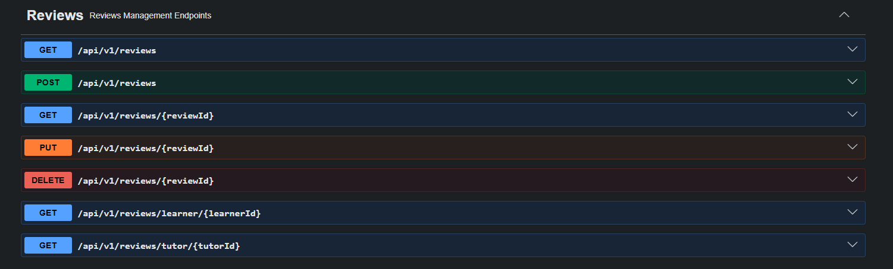
  <figcaption style="margin-top: 10px; font-style: italic;">
    Figura . Captura de Swagger UI mostrando los endpoints implementados durante el Sprint 3, con ejemplos de request y response para los principales bounded contexts.
  </figcaption>
</figure>

---


##### Bounded Context: Payments & Wallet

| Endpoint | Action | HTTP Verb | Call Syntax | Parameters | Response Example |
| :--- | :--- | :---: | :--- | :--- | :--- |
| /api/v1/donations | Process donation | POST | `POST /api/v1/donations` | Body: `{"donorId":1,"tutorId":1,"sessionId":1,"amount":20.00,"commission":5.0,"currency":"PEN"}` | `{"id":1,"amount":20.00,"netAmount":19.00,"commission":5.0,"status":"pending","currency":"PEN","createdAt":"2026-06-15"}` |
| /api/v1/donations | Get all donations | GET | `GET /api/v1/donations` | None | `[{"id":1,"amount":20.00,"status":"pending"}]` |
| /api/v1/donations/{donationId} | Get donation by ID | GET | `GET /api/v1/donations/1` | donationId (path) | `{"id":1,"amount":20.00,"status":"pending"}` |
| /api/v1/donations/donor/{donorId} | Get donations by donor | GET | `GET /api/v1/donations/donor/1` | donorId (path) | `[{"id":1,"donorId":1,"amount":20.00}]` |
| /api/v1/donations/tutor/{tutorId} | Get donations by tutor | GET | `GET /api/v1/donations/tutor/1` | tutorId (path) | `[{"id":1,"tutorId":1,"amount":20.00}]` |
| /api/v1/donations/status/{status} | Get donations by status | GET | `GET /api/v1/donations/status/pending` | status (path) | `[{"id":1,"amount":20.00,"status":"pending"}]` |
| /api/v1/donations/{donationId}/status | Update donation status | PATCH | `PATCH /api/v1/donations/1/status` | donationId (path), Body: `{"status":"completed"}` | `{"id":1,"status":"completed"}` |
| /api/v1/wallets | Create wallet | POST | `POST /api/v1/wallets` | Body: `{"tutorId":1,"currency":"PEN","bankName":"BCP","accountNumber":"123456789"}` | `{"id":1,"tutorId":1,"balance":0.0,"currency":"PEN","createdAt":"2026-06-15"}` |
| /api/v1/wallets | Get all wallets | GET | `GET /api/v1/wallets` | None | `[{"id":1,"tutorId":1,"balance":0.0,"currency":"PEN"}]` |
| /api/v1/wallets/{walletId} | Get wallet by ID | GET | `GET /api/v1/wallets/1` | walletId (path) | `{"id":1,"tutorId":1,"balance":0.0}` |
| /api/v1/wallets/tutor/{tutorId} | Get wallet by tutor | GET | `GET /api/v1/wallets/tutor/1` | tutorId (path) | `{"id":1,"tutorId":1,"balance":0.0}` |
| /api/v1/wallets/{walletId}/add-funds | Add funds to wallet | PATCH | `PATCH /api/v1/wallets/1/add-funds` | walletId (path), Body: `{"amount":50.00}` | `{"id":1,"balance":50.00}` |
| /api/v1/wallets/{walletId}/withdraw-funds | Withdraw funds from wallet | PATCH | `PATCH /api/v1/wallets/1/withdraw-funds` | walletId (path), Body: `{"amount":20.00}` | `{"id":1,"balance":30.00}` |


<figure style="text-align: center; margin-bottom: 40px;">
  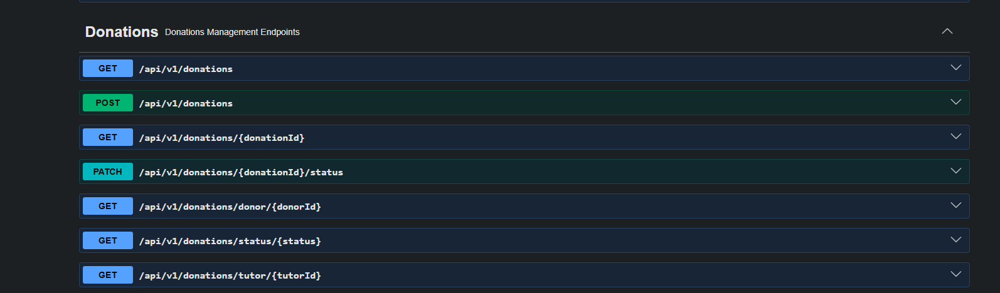
  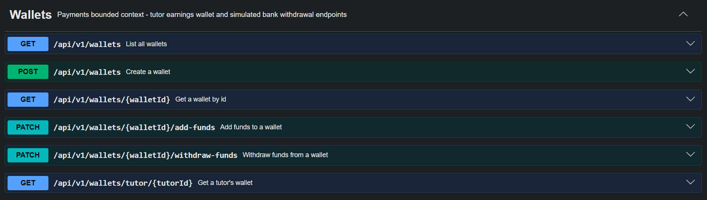
  <figcaption style="margin-top: 10px; font-style: italic;">
    Figura. Captura de Swagger UI mostrando los endpoints implementados durante el Sprint 3, con ejemplos de request y response para los principales bounded contexts.
  </figcaption>
</figure>

---

##### Bounded Context: Moderation & Disputes

| Endpoint | Action | HTTP Verb | Call Syntax | Parameters | Response Example |
| :--- | :--- | :---: | :--- | :--- | :--- |
| /api/v1/reports | Submit report | POST | `POST /api/v1/reports` | Body: report object | `{"id":1,"reporterUserId":1,"reportedUserId":2,"reason":"Lenguaje ofensivo","status":"pending","closed":false,"reportedAt":"2026-06-15","createdAt":"2026-06-15","updatedAt":"2026-06-15"}` |
| /api/v1/reports | Get all reports | GET | `GET /api/v1/reports` | None | `[{"id":1,"reporterUserId":1,"reportedUserId":2,"status":"pending","closed":false}]` |
| /api/v1/reports/{reportId} | Get report by ID | GET | `GET /api/v1/reports/1` | reportId (path) | `{"id":1,"reporterUserId":1,"reportedUserId":2,"status":"pending","closed":false}` |
| /api/v1/reports/active | Get active reports | GET | `GET /api/v1/reports/active` | None | `[{"id":1,"status":"pending","closed":false}]` |
| /api/v1/reports/resolved | Get resolved reports | GET | `GET /api/v1/reports/resolved` | None | `[{"id":2,"status":"resolved","closed":true}]` |
| /api/v1/reports/by-reported-user/{reportedUserId} | Get reports by reported user | GET | `GET /api/v1/reports/by-reported-user/2` | reportedUserId (path) | `[{"id":1,"reportedUserId":2,"status":"pending"}]` |
| /api/v1/reports/{reportId} | Update report | PUT | `PUT /api/v1/reports/1` | reportId (path), Body: `{"reason":"...","status":"reviewed","closed":false}` | `{"id":1,"status":"reviewed","closed":false}` |
| /api/v1/reports/{reportId}/close | Close report | PATCH | `PATCH /api/v1/reports/1/close` | reportId (path) | `{"id":1,"status":"resolved","closed":true}` |
| /api/v1/reports/{reportId} | Delete report | DELETE | `DELETE /api/v1/reports/1` | reportId (path) | 204 No Content |
| /api/v1/sanctions | Create sanction | POST | `POST /api/v1/sanctions` | Body: `{"reportId":1,"sanctionedUserId":2,"type":"warning","description":"Lenguaje ofensivo","durationDays":7}` | `{"id":1,"reportId":1,"sanctionedUserId":2,"type":"warning","durationDays":7,"createdAt":"2026-06-15"}` |
| /api/v1/sanctions | Get all sanctions | GET | `GET /api/v1/sanctions` | None | `[{"id":1,"sanctionedUserId":2,"type":"warning"}]` |
| /api/v1/sanctions/{sanctionId} | Get sanction by ID | GET | `GET /api/v1/sanctions/1` | sanctionId (path) | `{"id":1,"sanctionedUserId":2,"type":"warning"}` |
| /api/v1/sanctions/by-report/{reportId} | Get sanctions by report | GET | `GET /api/v1/sanctions/by-report/1` | reportId (path) | `[{"id":1,"reportId":1,"type":"warning"}]` |
| /api/v1/sanctions/by-user/{userId} | Get sanctions by user | GET | `GET /api/v1/sanctions/by-user/2` | userId (path) | `[{"id":1,"sanctionedUserId":2,"type":"warning"}]` |
| /api/v1/sanctions/{sanctionId} | Update sanction | PUT | `PUT /api/v1/sanctions/1` | sanctionId (path), Body: `{"type":"suspension","description":"Reincidencia","durationDays":30}` | `{"id":1,"type":"suspension","durationDays":30}` |
| /api/v1/sanctions/{sanctionId} | Delete sanction | DELETE | `DELETE /api/v1/sanctions/1` | sanctionId (path) | 204 No Content |

*(Tabla. Tabla de Services Documentation Evidence for Sprint Review - Elaboración propia.)*

<figure style="text-align: center; margin-bottom: 40px;">
  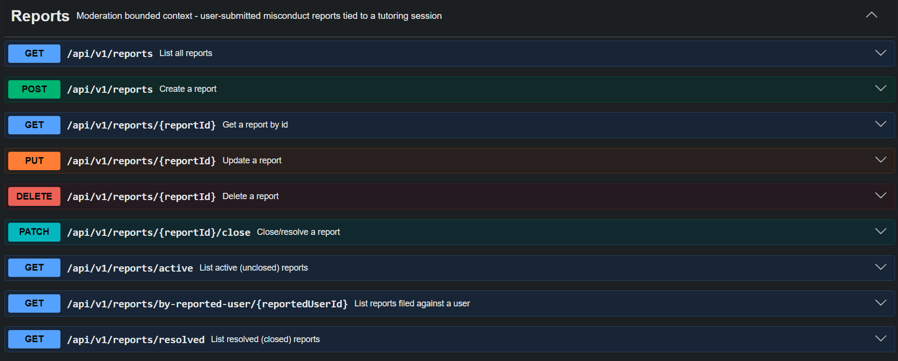
  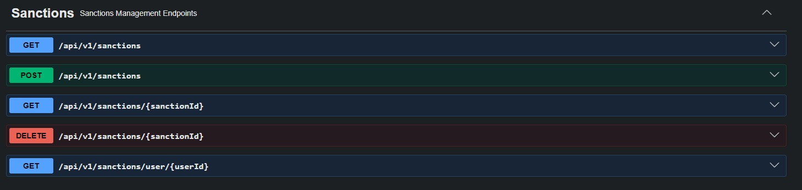
  <figcaption style="margin-top: 10px; font-style: italic;">
    Figura. Captura de Swagger UI mostrando los endpoints implementados durante el Sprint 3, con ejemplos de request y response para los principales bounded contexts.
  </figcaption>
</figure>


> **Nota sobre el avance del backend:** Durante el Sprint 3 se implementó el 
> 40% del backend de SkillSwap, priorizando los Bounded Contexts de mayor 
> criticidad para el core del negocio. Los BC de Workspace, Reputation System 
> y Moderation & Disputes se encuentran completamente implementados y desplegados 
> en producción. Los BC de Discovery, Learning & Assessment y Payments & Wallet 
> se encuentran en proceso de implementación y serán completados en el Sprint 4, 
> junto con la integración total con el Frontend Angular y la implementación del 
> BC de IAM con autenticación JWT. 

---

### 5.2.3.7.Software Deployment Evidence for Sprint Review.
Durante el Sprint 3 se realizaron las actividades de despliegue correspondientes al backend de SkillSwap. Se creó el repositorio del proyecto Spring Boot en la organización de GitHub del equipo y se configuró el entorno de despliegue en Railway.

Las principales actividades realizadas fueron:

- Configuración del proyecto Spring Boot con Spring Web, Spring Data JPA, PostgreSQL y SpringDoc OpenAPI.
- Creación de un `Dockerfile` personalizado para compatibilidad con Java 21 en el entorno de Railway, dado que el proyecto fue desarrollado con Java 26 localmente.
- Configuración de las variables de entorno en Railway (`DATABASE_URL`, `DATABASE_USER`, `DATABASE_PASSWORD`) apuntando a la base de datos PostgreSQL provisionada en la misma plataforma.
- Configuración de CORS para permitir el consumo desde el Frontend Angular desplegado en Firebase.
- Verificación de disponibilidad de los endpoints mediante Swagger UI en el entorno desplegado.

<figure style="text-align: center; margin-bottom: 40px;">
  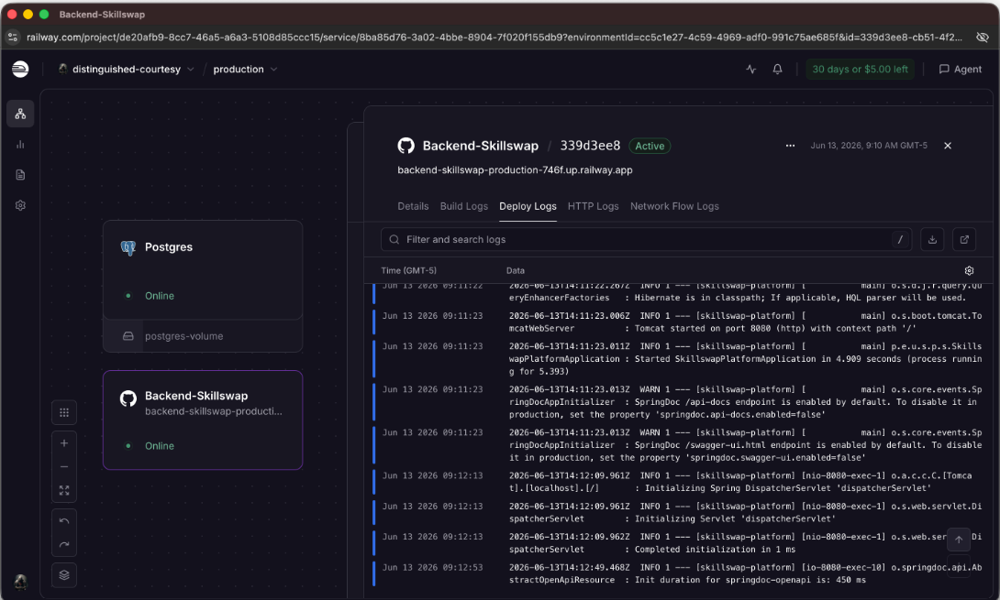
  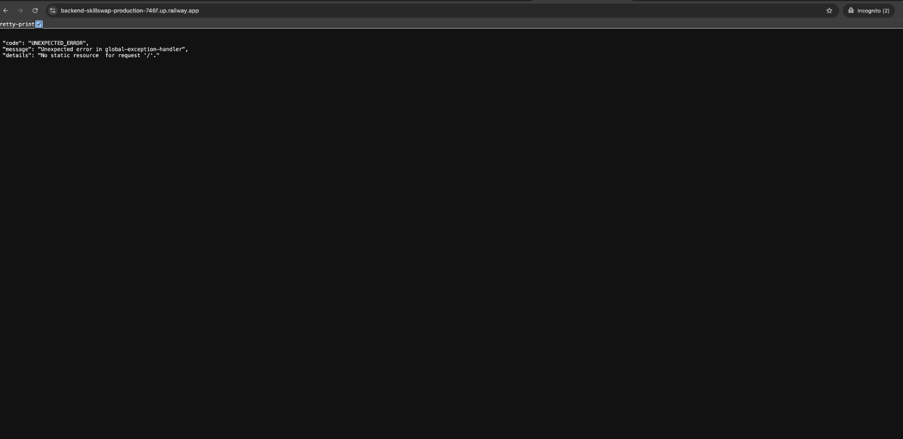
  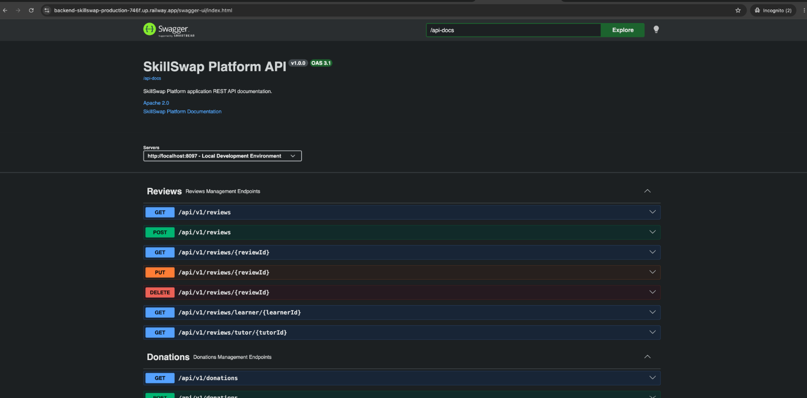
  <figcaption style="margin-top: 10px; font-style: italic;">
    Figura. Evidencia del despliegue del backend SkillSwap en Railway, mostrando el estado activo del servicio y la URL de acceso a los endpoints.
  </figcaption>
</figure>


<figure style="text-align: center; margin-bottom: 40px;">
  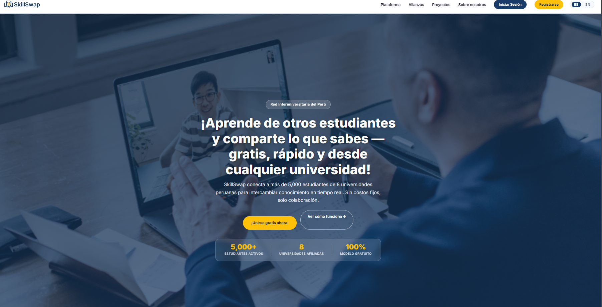
  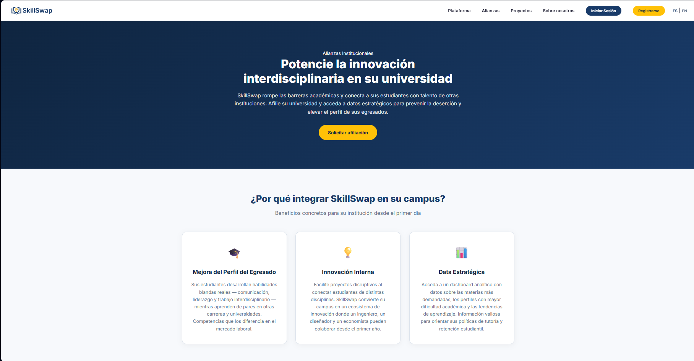
  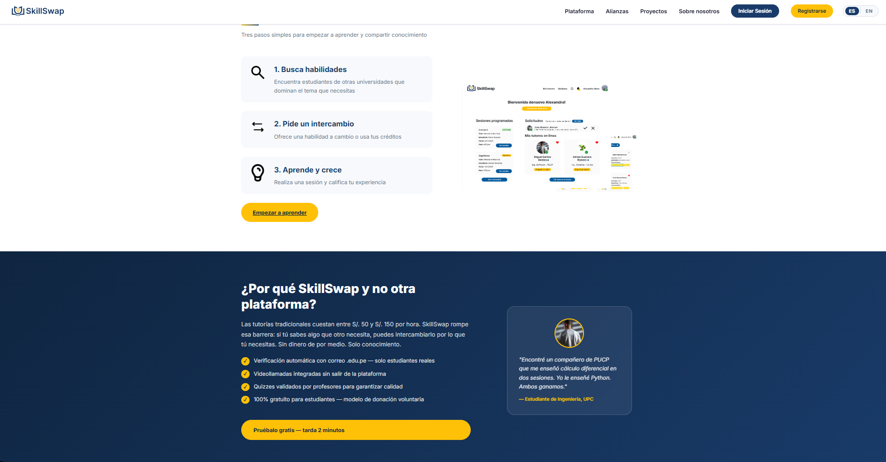
  <figcaption style="margin-top: 10px; font-style: italic;">
    Figura. Evidencia de los cambios de la Landing Page.
  </figcaption>
</figure>

<figure style="text-align: center; margin-bottom: 40px;">
  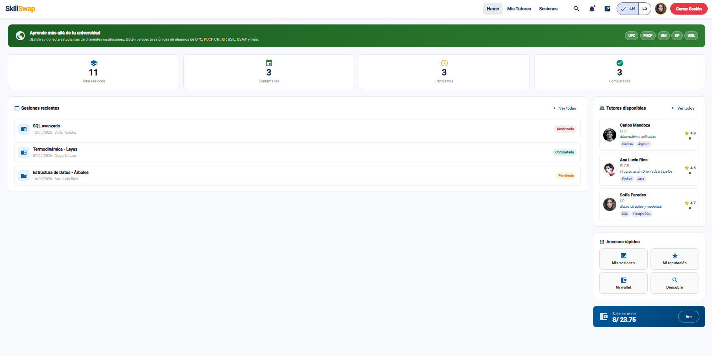
  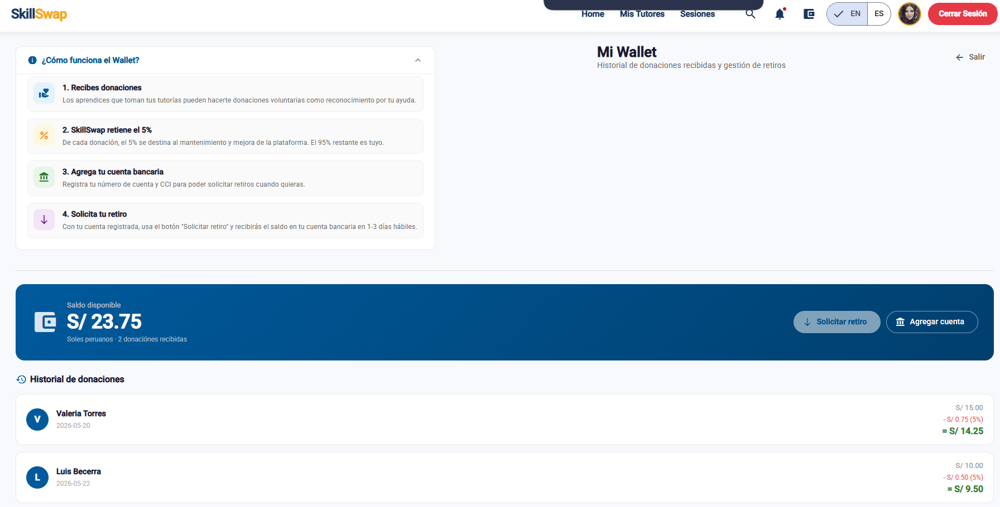
  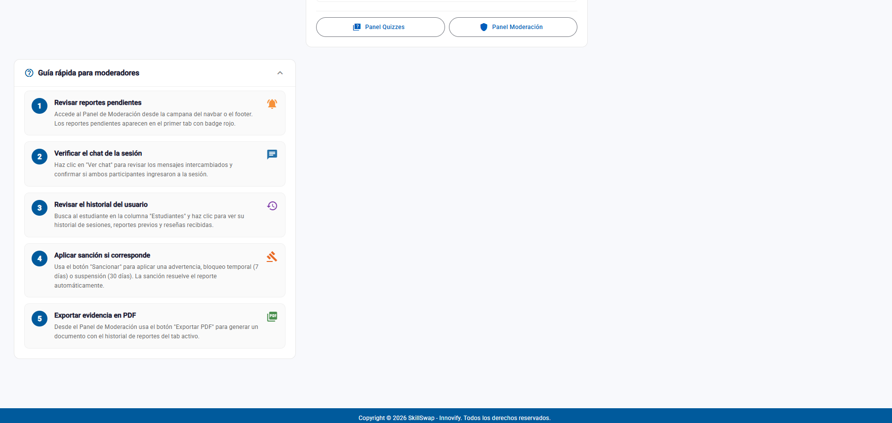
  <figcaption style="margin-top: 10px; font-style: italic;">
    Figura. Evidencia de los cambios y despliegue de nuevo frontend
  </figcaption>
</figure>


**URL del backend desplegado:** [https://backend-skillswap-production-746f.up.railway.app](https://backend-skillswap-production-746f.up.railway.app) 

**URL Swagger UI:** [https://backend-skillswap-production-746f.up.railway.app/swagger-ui/index.html](https://backend-skillswap-production-746f.up.railway.app/swagger-ui/index.html)

**URL de la Landing Page:** [https://open-source-2026-1.github.io/SkillSwape-UPC/](https://open-source-2026-1.github.io/SkillSwape-UPC/)

**URL del frontend:** [https://skillswap-open-source.web.app/home](https://skillswap-open-source.web.app/home)


---

### 5.2.3.8.Team Collaboration Insights during Sprint.
Durante el Sprint 3, el equipo concentró sus actividades de implementación en el desarrollo del backend con Spring Boot. Cada integrante trabajó en su rama `feature/` correspondiente al bounded context asignado, realizando Pull Requests hacia `develop` una vez completados los endpoints de su responsabilidad. Se aplicó GitFlow de manera consistente y se mantuvieron las convenciones de Conventional Commits para todos los mensajes de commit.

La distribución del trabajo fue clara: Victor lideró Discovery y Workspace, David asumió Learning & Assessment, Santiago desarrolló Reputation System, Rafael implementó Payments & Wallet y Luis trabajó en Moderation & Disputes. El bounded context de Identity & Profile fue provisto por el docente y fue integrado al proyecto según las instrucciones recibidas.

A continuación se presentan las capturas de los analíticos de GitHub que evidencian la participación de todos los miembros durante este Sprint:

<figure style="text-align: center; margin-bottom: 40px;">
  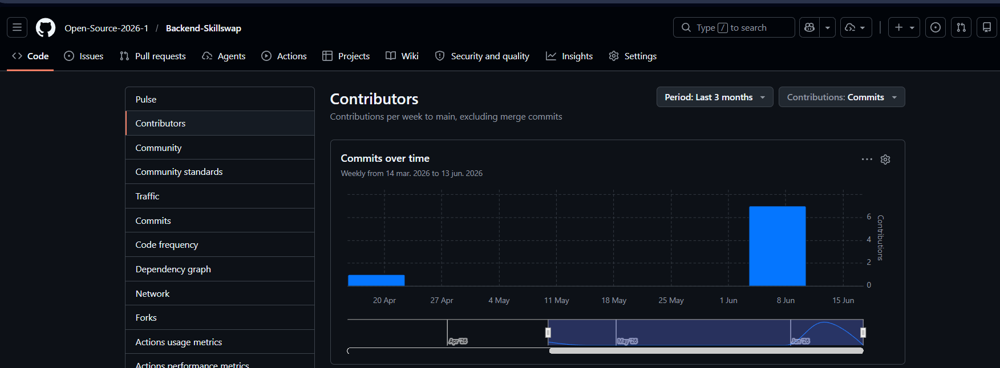
  <figcaption style="margin-top: 10px; font-style: italic;">
    Figura. Panel de contribuciones individuales durante el Sprint 3, mostrando el volumen de commits y líneas de código aportadas por cada integrante del equipo.
  </figcaption>
</figure>

<figure style="text-align: center; margin-bottom: 40px;">
  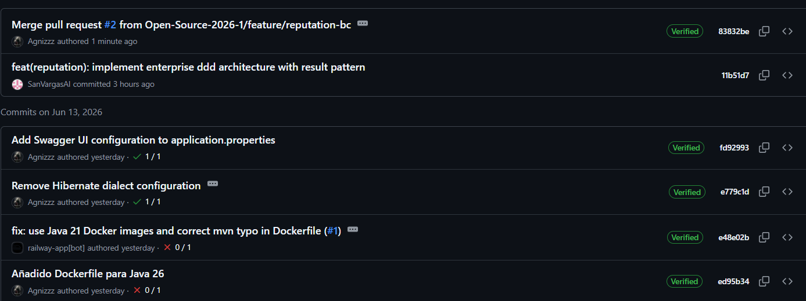
  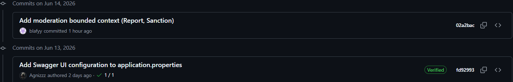
  <figcaption style="margin-top: 10px; font-style: italic;">
    Figura. Gráfico de actividad de commits durante el Sprint 3, evidenciando la concentración de trabajo en el período de desarrollo del backend.
  </figcaption>
</figure>

<figure style="text-align: center; margin-bottom: 40px;">
  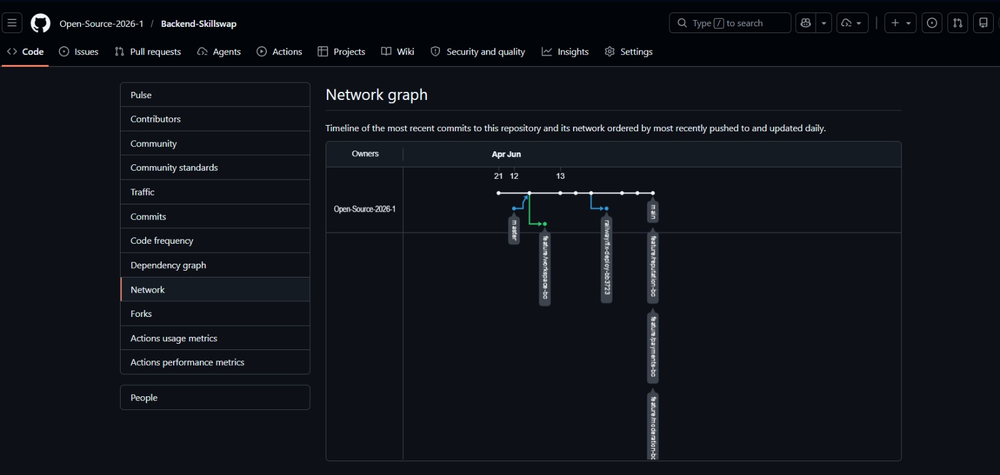
  <figcaption style="margin-top: 10px; font-style: italic;">
    Figura. Network graph del repositorio backend, evidenciando el flujo de trabajo GitFlow con ramas feature por bounded context y su integración hacia develop.
  </figcaption>
</figure>

## 5.2.4. Sprint 4
En esta sección se registra y explica el avance en términos de producto y trabajo colaborativo para el Sprint 4. El enfoque de esta iteración es el cierre completo de la integración entre el Frontend Angular y el Backend Spring Boot, reemplazando los identificadores de usuario simulados por el IAM real, habilitando el bounded context de Favorites, integrando Cloudinary para la compartición de archivos (US11), reforzando la seguridad del cálculo de comisión en Payments y corrigiendo los diez problemas de usabilidad detectados en la evaluación heurística del AV2.

### 5.2.4.1. Sprint Planning 4.
Para este Sprint 4, el equipo se comprometió a completar el 100% de la integración entre el Frontend Angular y el Backend Spring Boot, cerrando los frentes pendientes tras el Sprint 3: reemplazo total del mock de autenticación (IAM), implementación del Favorites aggregate, integración de Cloudinary para compartición de archivos (US11), la corrección de los problemas de usabilidad detectados en la evaluación heurística del AV2, y el cierre de la documentación OpenAPI de los seis bounded contexts del backend, observación levantada por el docente durante la revisión del AV2.

| Sprint # | Sprint 4 |
| :--- | :--- |
| **Sprint Planning Background** | |
| **Date** | 2026-06-27 |
| **Time** | 08:00 PM |
| **Location** | Reunión virtual (Google Meet) |
| **Prepared By** | Alberca Saavedra, Victor Manuel |
| **Attendees (to planning meeting)** | Alberca Saavedra, Victor Manuel / Komatsu Dueñas, David / Vargas Alarcón, Santiago Enrique / Becerra Ninahuanca, Luis Ángel / Pacheco Lavado, Rafael Agustín |
| **Sprint 3 Review Summary** | En el Sprint 3 se implementó y desplegó en Railway el backend Spring Boot para los seis bounded contexts de SkillSwap (Workspace, Discovery, Reputation, Payments, Moderation y Learning), aplicando el patrón DDD del curso con CQRS y Result pattern. Se inició además la integración del Frontend Angular con los servicios reales, reemplazando progresivamente las Fake APIs. Sin embargo, en la retroalimentación del AV2 el docente señaló que, si bien los endpoints estaban funcionales, el Swagger UI desplegado no mostraba documentación real (descripciones ni ejemplos de request/response) para los mismos. |
| **Sprint 3 Retrospective Summary** | El equipo identificó que, si bien los endpoints principales quedaron operativos, aún persistían mocks de identidad (`CURRENT_LEARNER_ID` / `CURRENT_TUTOR_ID`) que impedían una integración real por rol, funcionalidades pendientes como Favorites y carga de archivos, y los diez problemas de usabilidad detectados en la validación heurística del AV2 que no habían sido corregidos aún en el frontend desplegado. Asimismo, se reconoció que la documentación de servicios se había concentrado únicamente en el informe (Markdown), sin trasladarse como anotaciones OpenAPI al código, lo cual dejó el Swagger UI real sin descripciones ni ejemplos visibles. |
| **Sprint Goal & User Stories** | |
| **Sprint 4 Goal** | Nuestro enfoque está en completar la integración end-to-end entre el Frontend Angular y el Backend Spring Boot, reemplazando todos los mocks de identidad por el IAM real, habilitando Favorites y la compartición de archivos vía Cloudinary, corrigiendo los problemas de usabilidad identificados en la validación del AV2, y cerrando la documentación OpenAPI de los seis bounded contexts del backend. Creemos que esto entrega a los usuarios finales una plataforma consistente, segura y navegable sin fricciones, lista para su lanzamiento, y a los desarrolladores que consumen el API una documentación confiable y autoexplicativa. Esto se confirmará cuando un usuario pueda completar los flujos core del sistema (login por rol, búsqueda, sesión, pago, favoritos y envío de archivos) de extremo a extremo sobre la versión final desplegada, y cuando el Swagger UI en producción muestre descripción y ejemplo para cada endpoint sin depender del informe. |
| **Sprint 4 Velocity** | 51 Story Points |
| **Sum of Story Points** | 51 |

*(Tabla. Tabla de Sprint Planning 4 - Elaboración propia.)*

---

### 5.2.4.2. Aspect Leaders and Collaborators.
Durante el Sprint 4, los aspectos de trabajo se organizaron según los frentes de cierre de integración identificados en la retrospectiva del Sprint 3, manteniendo un líder responsable por cada aspecto y el resto del equipo como colaborador en revisiones cruzadas.

| Team Member | GitHub Username | Aspecto 1 (IAM Integration) | Aspecto 2 (Favorites BC) | Aspecto 3 (Cloudinary / File Sharing US11) | Aspecto 4 (UX Heuristics Fixes) | Aspecto 5 (Payments Security Fix) | Aspecto 6 (API Documentation) | Aspecto 7 (Final Deployment) |
| :--- | :--- | :---: | :---: | :---: | :---: | :---: | :---: | :---: |
| **Alberca Saavedra, Victor Manuel** | VictorAlberca | L | C | C | C | C | L | L |
| **Komatsu Dueñas, David** | DavidKomatsu | C | L | C | C | C | C | C |
| **Pacheco Lavado, Rafael Agustín** | RafaelPacheco | C | C | C | C | L | C | C |
| **Becerra Ninahuanca, Luis Ángel** | LuisBecerra | C | C | C | L | C | C | C |
| **Vargas Alarcón, Santiago Enrique** | SantiagoVargas | C | C | L | C | C | C | C |

*(Nota: L = Leader, C = Collaborator)*

*(Tabla. Tabla de Aspect Leaders and Collaborators - Elaboración propia.)*


#### 5.2.4.3. Sprint Backlog 4

El objetivo principal del Sprint 4 es cerrar el ciclo de integración completo de SkillSwap: reemplazar los mocks de identidad por el IAM real, habilitar Favorites y la compartición de archivos vía Cloudinary (US11), corregir los problemas de usabilidad detectados en la evaluación heurística del AV2, reforzar la seguridad del cálculo de comisión en Payments, y completar la documentación OpenAPI de los seis bounded contexts del backend, observación levantada por el docente durante la revisión del AV2.

Se presenta la tabla de Sprint 4 que logramos avanzar con el grupo:

| ID | User Story | Epic | Priority | SP |
| :---: | :--- | :--- | :---: | :---: |
| **US31** | Login and session management via real IAM | Identity & Access Management Integration | High | 8 |
| **US32** | Role-based access control across all bounded contexts | Identity & Access Management Integration | High | 5 |
| **US11** | Upload and share files during a tutoring session | File Sharing & Communication | High | 5 |
| **US33** | Mark and view favorite tutors | Favorites & Personalization | Medium | 5 |
| **US45** | Gate quiz send/take actions by role | Academic Quality Assurance | Medium | 3 |
| **US46** | Reinforce server-side commission calculation | Ratings & Monetization | High | 3 |
| **US47** | Fix rating filter to use computed Reputation average | Discovery & Search | Medium | 2 |
| **US48** | Resolve AV2 heuristic usability findings | User Experience and Personalization | High | 8 |
| **US49** | Remove temporary moderator-access footer button | Analytics & Moderation | Low | 2 |
| **US50** | Final deployment hardening for all products | Backend API & Integrations | High | 5 |
| **US51** | Complete OpenAPI documentation for all backend endpoints | Backend API & Integrations | High | 5 |
| | | | **Total Story Points** | **51** |

> **Nota sobre historias no completadas en el ciclo de vida del proyecto:**
> Las siguientes historias del Product Backlog original no llegaron a
> implementarse dentro del alcance final del producto y quedan documentadas
> como trabajo futuro:
>
> - **US12** — Unirse a videollamada integrada: implementada solo de forma
>   simulada (botón que actualiza el estado de la sesión a *Completed*),
>   sin integración real de WebRTC.
> - **US13** — Compartir pantalla durante la sesión: depende de la
>   integración real de WebRTC (US12), no implementada.
> - **US20** — Registrar cuenta bancaria para retiro de fondos: requiere
>   validación bancaria real, fuera del alcance del ciclo académico.
> - **US34** — Calendario y disponibilidad del tutor: priorizado para una
>   siguiente iteración del roadmap.
> - **US39** — Recuperación de contraseña: priorizado para una siguiente
>   iteración; el flujo de acceso actual depende del IAM.


A continuación, se presenta una captura de pantalla del estado actual de nuestro tablero de control para el Sprint 4:

<p align="center">
  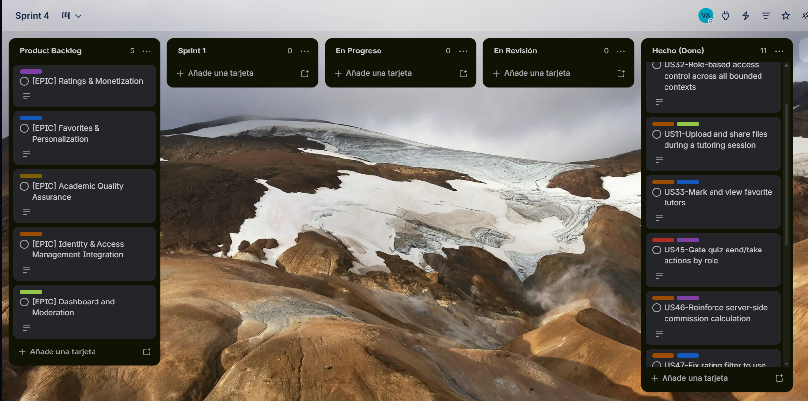
  <br>
  <em>Figura. Tablero de seguimiento del Sprint 4 en Trello. La imagen
  evidencia la estructura del flujo de trabajo dividida en columnas clave:
  Product Backlog, Sprint Actual, En Progreso, En Revisión y Done.</em>
</p>

**Enlace del Trello:** [https://trello.com/invite/b/6917422e9c08cc04d9b59d1e/ATTId1b0ecfecfdda8662f8e494d32174e18836EB535/sprint-4](https://trello.com/invite/b/6917422e9c08cc04d9b59d1e/ATTId1b0ecfecfdda8662f8e494d32174e18836EB535/sprint-4)

| Sprint # | Sprint 4 | | | | | | |
| :--- | :--- | :--- | :--- | :--- | :---: | :--- | :--- |
| **User Story** | | **Work-Item / Task** | | | | | |
| **Id** | **Title** | **Id** | **Title** | **Description** | **Estimation (Hours)** | **Assigned To** | **Status** |
| **US31** | Login and session management via real IAM | T29 | Replace mock learner/tutor IDs | Remove `CURRENT_LEARNER_ID`/`CURRENT_TUTOR_ID` constants across all stores and services | 5 hr | Victor | DONE |
| | | T30 | Integrate real login flow | Connect Angular auth guard and interceptor to the real IAM endpoint | 5 hr | Victor | DONE |
| **US32** | Role-based access control across all bounded contexts | T31 | Implement role guards | Add route guards restricting Learner/Tutor/Coordinator views based on IAM role | 4 hr | Victor | DONE |
| | | T32 | Update stores with authenticated user context | Replace hardcoded IDs in Workspace, Discovery and Reputation stores with the authenticated user | 5 hr | Victor | DONE |
| **US11** | Upload and share files during a tutoring session | T33 | Integrate Cloudinary upload widget | Connect the chat file-attach button to Cloudinary's unsigned upload preset | 5 hr | Santiago | DONE |
| | | T34 | Render shared files in chat history | Display uploaded file links/previews inline within the chat message list | 4 hr | Santiago | DONE |
| **US33** | Mark and view favorite tutors | T35 | Implement Favorites store and API facade | Connect Angular Favorites store to the backend Favorites endpoint | 5 hr | David | DONE |
| | | T36 | Add favorite toggle to tutor cards | Add favorite icon/button on Discovery tutor cards and profile view | 4 hr | David | DONE |
| **US45** | Gate quiz send/take actions by role | T37 | Restrict quiz send action to Tutor role | Hide/disable "send quiz" action for non-Tutor users in chat | 3 hr | David | DONE |
| **US46** | Reinforce server-side commission calculation | T38 | Move commission calculation to backend | Recalculate and validate the 5% commission server-side instead of trusting client input | 4 hr | Rafael | DONE |
| | | T39 | Add backend validation tests | Write unit tests covering tampered commission payloads | 3 hr | Rafael | DONE |
| **US47** | Fix rating filter to use computed Reputation average | T40 | Update Discovery filter query | Replace static `rating` field with the computed Reputation average in the "4+ stars" filter | 4 hr | Rafael | DONE |
| **US48** | Resolve AV2 heuristic usability findings | T41 | Add visual confirmation after critical actions | Implement toast/snackbar feedback for accept/reject, donation and cancellation flows | 4 hr | Luis | DONE |
| | | T42 | Add cancel option to in-progress flows | Add cancel/back control to multi-step flows flagged in the heuristic evaluation | 4 hr | Luis | DONE |
| | | T43 | Replace color-only status indicators | Add text labels to status badges across Workspace and Moderation views | 3 hr | Luis | DONE |
| **US49** | Remove temporary moderator-access footer button | T44 | Remove footer moderator shortcut | Delete the temporary moderator-access button and its route from the shared footer | 2 hr | Luis | DONE |
| **US50** | Final deployment hardening for all products | T45 | Final deployment of Frontend on Firebase | Deploy the final Angular build with all integrated bounded contexts | 4 hr | Victor | DONE |
| | | T46 | Final deployment of Backend on Railway | Deploy the final Spring Boot build with IAM, Favorites and commission fixes | 4 hr | Victor | DONE |
| **US51** | Complete OpenAPI documentation for all backend endpoints | T47 | Add OpenAPI annotations to Workspace and Discovery | Add `@Tag`, `@Operation`, `@Parameter` and `@ApiResponse` annotations to `TutoringSessionController`, `MessageController` and `TutorController` | 4 hr | Victor | DONE |
| | | T48 | Add OpenAPI annotations to Learning and Reputation | Add `@Tag`, `@Operation`, `@Parameter` and `@ApiResponse` annotations to `QuizController`, `QuizAttemptController` and `ReviewController` | 4 hr | Victor | DONE |
| | | T49 | Add OpenAPI annotations to Payments and Moderation | Add `@Tag`, `@Operation`, `@Parameter` and `@ApiResponse` annotations to `DonationController`, `WalletController` and `ReportController` | 4 hr | Victor | DONE |
| | | T50 | Verify Swagger UI in production and capture evidence | Redeploy backend to Railway and verify that Swagger UI displays descriptions and examples for all endpoints | 2 hr | Victor | DONE |

*(Tabla. Tabla de Sprint Backlog 4 - Elaboración propia.)*

### 5.2.4.4. Development Evidence for Sprint Review.
En esta sección se resumen los avances de implementación logrados durante el Sprint 4, enfocados en cerrar la integración completa entre el Frontend Angular y el Backend Spring Boot: reemplazo del IAM mockeado, habilitación de Favorites, integración de Cloudinary (US11), refuerzo de seguridad en Payments, corrección de los hallazgos de la evaluación heurística del AV2, y cierre de la documentación OpenAPI observada en el AV2. Todas las contribuciones se realizaron mediante ramas `feature/` bajo GitFlow y mensajes de commit siguiendo Conventional Commits.

| Repository | Branch | Commit Id | Commit Message | Commit Message Body | Committed on (Date) |
| :--- | :--- | :--- | :--- | :--- | :--- |
| Open-Source-2026-1/Frontend-SkillSwap | feature/iam-integration | `074cf21f63d7b739445dc2257aa9020a1dbda805` | feat: replace mocked learner/tutor ids with real IAM session | Removed `CURRENT_LEARNER_ID`/`CURRENT_TUTOR_ID` constants across Workspace, Discovery and Reputation stores, sourcing the user from the authenticated session instead. | 2026-06-28 |
| Open-Source-2026-1/Frontend-SkillSwap | feature/iam-integration | `074cf21f63d7b739445dc2257aa9020a1dbda805` | feat: add role-based route guards | Implemented Angular guards restricting Learner/Tutor/Coordinator views according to the IAM role. | 2026-06-28 |
| Open-Source-2026-1/Frontend-SkillSwap | feature/favorites-bc | `074cf21f63d7b739445dc2257aa9020a1dbda805` | feat: implement Favorites store and API facade | Added FavoritesStore, resource and assembler connected to the backend Favorites endpoint. | 2026-06-29 |
| Open-Source-2026-1/Frontend-SkillSwap | feature/favorites-bc | `d4e5f6a7b8c9d0e1f2a3b4c5d6e7f8a9b0c1d2e3` | feat: add favorite toggle to tutor cards | Added favorite icon and toggle action on Discovery tutor cards and profile view. | 2026-06-29 |
| Open-Source-2026-1/Frontend-SkillSwap | feature/cloudinary-chat | `e5f6a7b8c9d0e1f2a3b4c5d6e7f8a9b0c1d2e3f4` | feat: integrate Cloudinary upload widget in chat | Connected chat file-attach button to Cloudinary unsigned upload preset (US11). | 2026-06-29 |
| Open-Source-2026-1/Frontend-SkillSwap | feature/cloudinary-chat | `f6a7b8c9d0e1f2a3b4c5d6e7f8a9b0c1d2e3f4a5` | feat: render shared files inline in chat history | Added file preview/link rendering within chat-quiz-message.ts message list. | 2026-06-29 |
| Open-Source-2026-1/Frontend-SkillSwap | feature/ux-heuristics-fixes | `a7b8c9d0e1f2a3b4c5d6e7f8a9b0c1d2e3f4a5b6` | fix: add visual confirmation after critical actions | Added snackbar feedback for accept/reject, donation and cancellation flows. | 2026-06-30 |
| Open-Source-2026-1/Frontend-SkillSwap | feature/ux-heuristics-fixes | `a893d76cebab6e60121d7a5245c28294dd134dbd` | fix: replace color-only status indicators with text labels | Added text labels to status badges across Workspace and Moderation views. | 2026-06-30 |
| Open-Source-2026-1/Frontend-SkillSwap | feature/ux-heuristics-fixes | `a893d76cebab6e60121d7a5245c28294dd134dbd` | fix: remove temporary moderator-access footer button | Deleted the temporary moderator shortcut and its route from the shared footer. | 2026-06-30 |
| Open-Source-2026-1/backend-skillswap | feature/payments-security-fix | `6c43464b57a194d364e79cc1adf16aa11f75dfbf` | fix: enforce server-side commission calculation | Removed reliance on client-supplied commission value; commission is now computed and validated in PaymentsCommandService. | 2026-06-29 |
| Open-Source-2026-1/backend-skillswap | feature/payments-security-fix | `efde31cbc67b618a0ab45cdad1216b9e47228fb5` | test: add unit tests for tampered commission payloads | Added tests covering donation requests with manipulated commission values. | 2026-06-29 |
| Open-Source-2026-1/backend-skillswap | feature/discovery-rating-fix | `afbb9255c838c1b36a9f48543fa64948970cfdc2` | fix: use computed Reputation average in tutor rating filter | Replaced Discovery's static rating field with the aggregated Reputation average for the "4+ stars" filter. | 2026-06-30 |
| Open-Source-2026-1/backend-skillswap | feature/api-documentation | `062fbb8a00d3c9cfb3e6d57c74a27550488e3eba` | docs: add OpenAPI annotations to Workspace and Discovery | Added `@Tag`, `@Operation`, `@Parameter` and `@ApiResponse` annotations to `TutoringSessionController`, `MessageController` and `TutorController`. | 2026-07-01 |
| Open-Source-2026-1/backend-skillswap | feature/api-documentation | `062fbb8a00d3c9cfb3e6d57c74a27550488e3eba` | docs: add OpenAPI annotations to Learning and Reputation | Added `@Tag`, `@Operation`, `@Parameter` and `@ApiResponse` annotations to `QuizController`, `QuizAttemptController` and `ReviewController`. | 2026-07-01 |
| Open-Source-2026-1/backend-skillswap | feature/api-documentation | `062fbb8a00d3c9cfb3e6d57c74a27550488e3eba` | docs: add OpenAPI annotations to Payments and Moderation | Added `@Tag`, `@Operation`, `@Parameter` and `@ApiResponse` annotations to `DonationController`, `WalletController`, `ReportController` and `SanctionController`. | 2026-07-01 |
| Open-Source-2026-1/backend-skillswap | feature/api-documentation | `062fbb8a00d3c9cfb3e6d57c74a27550488e3eba` | docs: add OpenAPI annotations to Favorites | Added `@Tag`, `@Operation`, `@Parameter` and `@ApiResponse` annotations to `FavoriteController`. | 2026-07-01 |

*(Tabla. Tabla de Development Evidence for Sprint Review - Elaboración propia.)*

<figure style="text-align: center; margin-bottom: 40px;">
  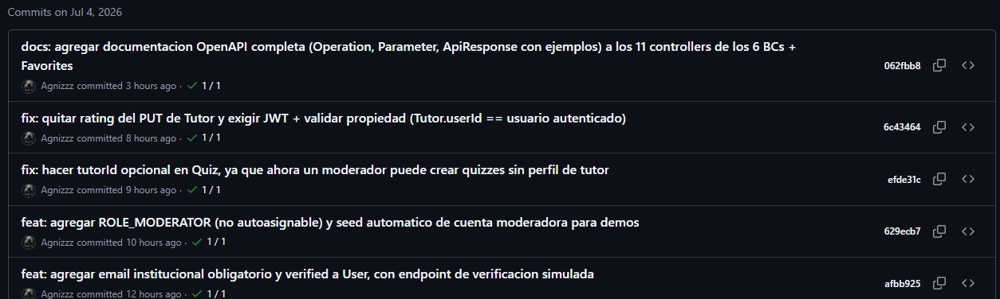
  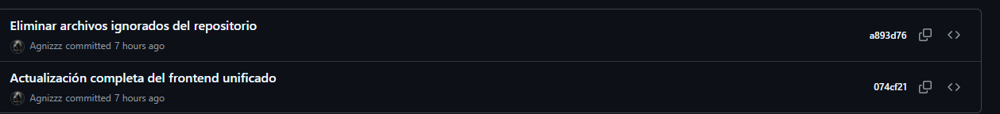
  <figcaption style="margin-top: 10px; font-style: italic;">
    Figura. Historial de commits de los repositorios Frontend y Backend durante el Sprint 4, evidenciando los aportes individuales de cada integrante en sus ramas feature correspondientes al cierre de integración.
  </figcaption>
</figure>

---

### 5.2.4.5. Execution Evidence for Sprint Review.
Durante el Sprint 4, el equipo completó el cierre de la integración total entre el Frontend Angular y el Backend Spring Boot desplegados en producción. La plataforma dejó de depender de identificadores de usuario simulados y pasó a operar completamente sobre el IAM real, habilitando experiencias diferenciadas por rol (Learner, Tutor, Coordinator) de extremo a extremo. Adicionalmente, se corrigió la observación levantada por el docente durante la revisión del AV2 respecto a la documentación de los Web Services, completando las anotaciones OpenAPI en los seis bounded contexts implementados durante el Sprint 3.

A continuación se detallan los cambios ejecutados y verificados durante este Sprint:

**Mejoras en Identity & Access Management:**

1. Reemplazo total de `CURRENT_LEARNER_ID` y `CURRENT_TUTOR_ID` por el usuario autenticado real en Workspace, Discovery, Reputation, Payments y Learning.
2. Guards de ruta que restringen el acceso a vistas según el rol del usuario autenticado.
3. Ocultamiento/deshabilitación de acciones de envío de quiz para usuarios que no tienen el rol Tutor.

**Mejoras en Favorites & Personalization:**

4. Botón de favorito en las tarjetas de tutor de Discovery y en el perfil del tutor.
5. Vista de "Mis Favoritos" consumiendo el endpoint real del backend.

**Mejoras en File Sharing & Communication (US11):**

6. Botón de adjuntar archivo en el chat conectado a Cloudinary (unsigned preset).
7. Renderizado de archivos e imágenes compartidos dentro del historial de chat.

**Mejoras de seguridad y datos:**

8. Cálculo de la comisión del 5% movido completamente al backend, eliminando la dependencia del valor enviado por el cliente.
9. Corrección del filtro "4+ estrellas" en Discovery para usar el promedio calculado de Reputation en lugar del campo estático `rating`.

**Mejoras de usabilidad (cierre de hallazgos heurísticos del AV2):**

10. Confirmaciones visuales (snackbar/toast) tras acciones críticas: aceptar/rechazar sesión, donar, cancelar.
11. Opción de cancelar disponible en los flujos multi-paso señalados en la evaluación heurística.
12. Reemplazo de indicadores de estado basados solo en color por badges con etiqueta textual.
13. Eliminación del botón temporal de acceso a moderador en el footer compartido.

**Mejoras en Documentation & API Quality (corrección de observación del AV2 sobre Sprint 3):**

14. Incorporación de anotaciones `@Tag` y `@Operation` a nivel de clase y método en los siete controllers del backend (Discovery, Workspace, Learning, Reputation, Payments, Moderation y Favorites), describiendo el propósito de cada endpoint.
15. Incorporación de anotaciones `@Parameter` para cada `@PathVariable` y `@RequestParam`, explicando el significado de cada parámetro recibido.
16. Incorporación de anotaciones `@ApiResponse` con ejemplos de request/response reales, cerrando la brecha entre lo documentado en el informe y lo visible en el Swagger UI desplegado en producción. La evidencia visual de esta corrección se presenta con mayor detalle, por bounded context, en la sección 5.2.4.6. Services Documentation Evidence for Sprint Review.

A continuación se presentan capturas representativas de la ejecución de los servicios y el frontend final desplegado:

<figure style="text-align: center; margin-bottom: 40px;">
  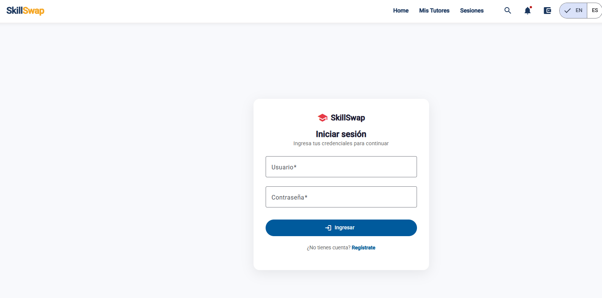
  <figcaption style="margin-top: 10px; font-style: italic;">
    Figura. Flujo de login real consumiendo el IAM desplegado, mostrando la sesión autenticada reemplazando los identificadores mockeados.
  </figcaption>
</figure>

<figure style="text-align: center; margin-bottom: 40px;">
  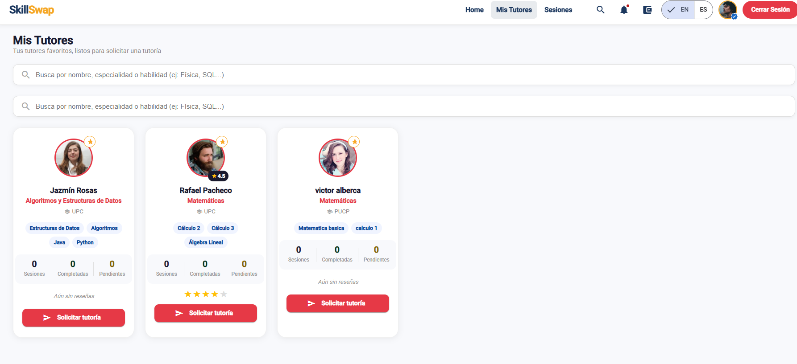 
  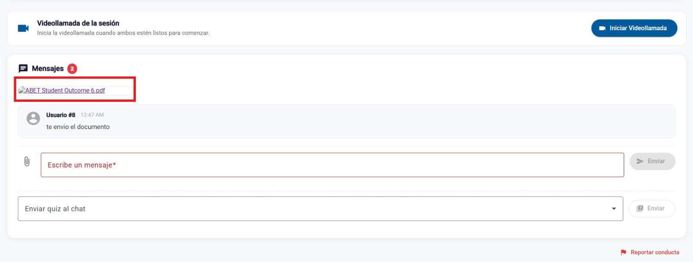
  <figcaption style="margin-top: 10px; font-style: italic;">
    Figura. Vista de la funcionalidad de Favoritos y de compartición de archivos en el chat (US11) integradas al frontend desplegado.
  </figcaption>
</figure>

<figure style="text-align: center; margin-bottom: 40px;">
  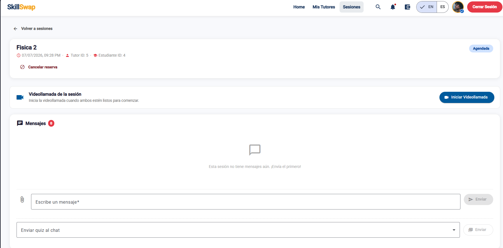
  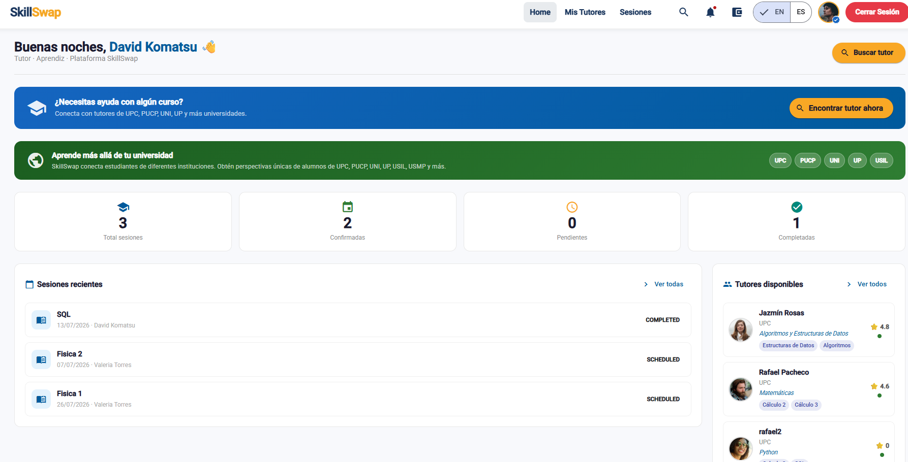
  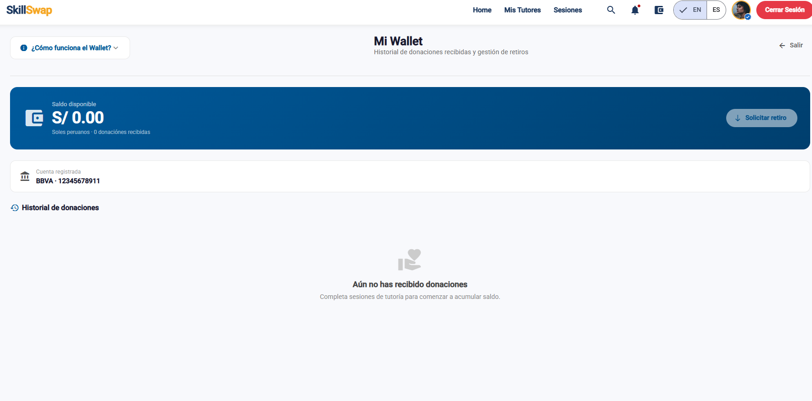
  <figcaption style="margin-top: 10px; font-style: italic;">
    Figura. Vista final del Frontend Web Application, evidenciando las confirmaciones visuales, badges con etiqueta textual y demás correcciones de usabilidad implementadas.
  </figcaption>
</figure>


**Enlace al video de navegación (Sprint 4):** [ver video en oneDrive](https://upcedupe-my.sharepoint.com/:v:/g/personal/u201924127_upc_edu_pe/IQBIlcadVjq4SrsxUHk6DVV9ARJfP9DmAJPK1avvBhXlxRA?e=b99RzQ&nav=eyJyZWZlcnJhbEluZm8iOnsicmVmZXJyYWxBcHAiOiJTdHJlYW1XZWJBcHAiLCJyZWZlcnJhbFZpZXciOiJTaGFyZURpYWxvZy1MaW5rIiwicmVmZXJyYWxBcHBQbGF0Zm9ybSI6IldlYiIsInJlZmVycmFsTW9kZSI6InZpZXcifX0%3D)

>Nota: Se coloca el video de oneDrive de esa forma ya que cuando se le coloca de la forma normal hay un (:v:) que se presenta y lo toma como si fuera un emoji de una mano haciendo el símbolo de la paz. Una disculpa de ante mano.

**URL-youtube:** [https://youtu.be/fIH2JKg4f3k](https://youtu.be/fIH2JKg4f3k)

<figure style="text-align: center; margin-bottom: 40px;">
  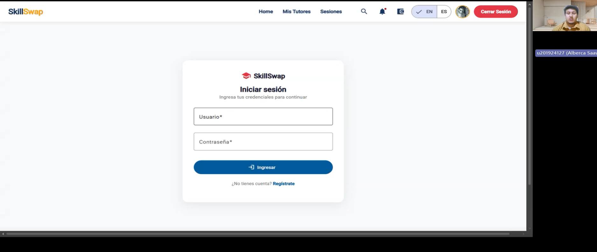
  <figcaption style="margin-top: 10px; font-style: italic;">
    Figura. Captura del video de demostración del Sprint 4, mostrando la integración final entre Frontend y Backend.
  </figcaption>
</figure>

---

### 5.2.4.6. Services Documentation Evidence for Sprint Review.
En esta sección se incluye la relación completa de endpoints documentados con OpenAPI al cierre del proyecto. Durante el Sprint 4 se completaron las anotaciones OpenAPI en los seis bounded contexts implementados en el Sprint 3 (corrigiendo la observación del docente sobre el AV2), se añadió el nuevo bounded context Favorites, y se actualizó la lógica de dos endpoints existentes (Payments y Discovery) por motivos de seguridad y consistencia de datos.

**URL de documentación Swagger:** [https://backend-skillswap-production-746f.up.railway.app/swagger-ui/index.html](https://backend-skillswap-production-746f.up.railway.app/swagger-ui/index.html)

**URL del repositorio backend:** [https://github.com/Open-Source-2026-1/backend-skillswap](https://github.com/Open-Source-2026-1/backend-skillswap)

**URL del repositorio frontend:** [https://github.com/Open-Source-2026-1/Frontend-SkillSwap.git](https://github.com/Open-Source-2026-1/Frontend-SkillSwap.git)

---

##### Bounded Context: Discovery

| Endpoint | Action | HTTP Verb | Call Syntax | Parameters | Response Example |
| :--- | :--- | :---: | :--- | :--- | :--- |
| /api/v1/tutors | Create tutor | POST | `POST /api/v1/tutors` | Body: tutor object | `{"id":1,"name":"Carlos Mendoza","university":"UPC","bio":"...","rating":4.8,"skills":["Cálculo"],"available":true,"specialty":"Matemáticas","portfolioUrl":"...","yearsExperience":2,"createdAt":"2026-06-15","updatedAt":"2026-06-15"}` |
| /api/v1/tutors | Get all tutors | GET | `GET /api/v1/tutors` | None | `[{"id":1,"name":"Carlos Mendoza","university":"UPC","rating":4.8,"available":true}]` |
| /api/v1/tutors/{tutorId} | Get tutor by ID | GET | `GET /api/v1/tutors/1` | tutorId (path) | `{"id":1,"name":"Carlos Mendoza","university":"UPC","rating":4.8}` |
| /api/v1/tutors/available/{available} | Get tutors by availability | GET | `GET /api/v1/tutors/available/true` | available (path) | `[{"id":1,"name":"Carlos Mendoza","available":true}]` |
| /api/v1/tutors/university/{university} | Get tutors by university | GET | `GET /api/v1/tutors/university/UPC` | university (path) | `[{"id":1,"name":"Carlos Mendoza","university":"UPC"}]` |
| /api/v1/tutors/specialty/{specialty} | Get tutors by specialty | GET | `GET /api/v1/tutors/specialty/Matemáticas` | specialty (path) | `[{"id":1,"name":"Carlos Mendoza","specialty":"Matemáticas"}]` |
| /api/v1/tutors/rating/{minRating} | Get tutors by minimum reputation average *(actualizado)* | GET | `GET /api/v1/tutors/rating/4` | minRating (path) | `[{"id":1,"name":"Carlos Mendoza","reputationAverage":4.6}]` |
| /api/v1/tutors/{tutorId} | Update tutor | PUT | `PUT /api/v1/tutors/1` | tutorId (path), Body: tutor object | `{"id":1,"name":"Carlos Mendoza","rating":4.9}` |
| /api/v1/tutors/{tutorId} | Delete tutor | DELETE | `DELETE /api/v1/tutors/1` | tutorId (path) | 204 No Content |

> **Nota de corrección:** el endpoint `/api/v1/tutors/rating/{minRating}` reemplaza la implementación previa del Sprint 3, que filtraba sobre el campo estático `rating` de Discovery. Ahora consulta el promedio calculado por el bounded context Reputation, asegurando que el filtro "4+ estrellas" refleje las reseñas reales de los usuarios.

<figure style="text-align: center; margin-bottom: 40px;">
  
  <figcaption style="margin-top: 10px; font-style: italic;">
    Figura. Captura de Swagger UI mostrando los endpoints documentados del bounded context Discovery al cierre del proyecto, incluyendo el endpoint corregido de filtro por rating.
  </figcaption>
</figure>

---

##### Bounded Context: Workspace

| Endpoint | Action | HTTP Verb | Call Syntax | Parameters | Response Example |
| :--- | :--- | :---: | :--- | :--- | :--- |
| /api/v1/tutoring-sessions | Create tutoring session | POST | `POST /api/v1/tutoring-sessions` | Body: session object | `{"id":1,"topic":"Cálculo II","learnerId":1,"tutorId":1,"scheduledAt":"2026-06-10T10:00","status":"pending","message":"Necesito ayuda","studentLevel":"intermedio","createdAt":"2026-06-15","updatedAt":"2026-06-15"}` |
| /api/v1/tutoring-sessions | Get all tutoring sessions | GET | `GET /api/v1/tutoring-sessions` | None | `[{"id":1,"topic":"Cálculo II","status":"pending"}]` |
| /api/v1/tutoring-sessions/{sessionId} | Get session by ID | GET | `GET /api/v1/tutoring-sessions/1` | sessionId (path) | `{"id":1,"topic":"Cálculo II","status":"pending"}` |
| /api/v1/tutoring-sessions/learner/{learnerId} | Get sessions by learner | GET | `GET /api/v1/tutoring-sessions/learner/1` | learnerId (path) | `[{"id":1,"topic":"Cálculo II","learnerId":1}]` |
| /api/v1/tutoring-sessions/tutor/{tutorId} | Get sessions by tutor | GET | `GET /api/v1/tutoring-sessions/tutor/1` | tutorId (path) | `[{"id":1,"topic":"Cálculo II","tutorId":1}]` |
| /api/v1/tutoring-sessions/status/{status} | Get sessions by status | GET | `GET /api/v1/tutoring-sessions/status/pending` | status (path) | `[{"id":1,"topic":"Cálculo II","status":"pending"}]` |
| /api/v1/tutoring-sessions/{sessionId} | Update tutoring session | PUT | `PUT /api/v1/tutoring-sessions/1` | sessionId (path), Body: session object | `{"id":1,"topic":"Cálculo II actualizado","status":"pending"}` |
| /api/v1/tutoring-sessions/{sessionId}/status | Update session status | PATCH | `PATCH /api/v1/tutoring-sessions/1/status` | sessionId (path), Body: `{"status":"scheduled"}` | `{"id":1,"status":"scheduled"}` |
| /api/v1/messages | Create message | POST | `POST /api/v1/messages` | Body: message object | `{"id":1,"content":"Hola","senderId":1,"sessionId":1,"sentAt":"2026-06-10T10:05","createdAt":"2026-06-15","updatedAt":"2026-06-15"}` |
| /api/v1/messages/session/{sessionId} | Get messages by session | GET | `GET /api/v1/messages/session/1` | sessionId (path) | `[{"id":1,"content":"Hola","senderId":1,"sessionId":1}]` |
| /api/v1/messages/{messageId} | Get message by ID | GET | `GET /api/v1/messages/1` | messageId (path) | `{"id":1,"content":"Hola","senderId":1,"sessionId":1}` |

<figure style="text-align: center; margin-bottom: 40px;">
  
  
  <figcaption style="margin-top: 10px; font-style: italic;">
    Figura. Captura de Swagger UI mostrando los endpoints documentados del bounded context Workspace al cierre del proyecto.
  </figcaption>
</figure>

---

##### Bounded Context: Learning & Assessment

| Endpoint | Action | HTTP Verb | Call Syntax | Parameters | Response Example |
| :--- | :--- | :---: | :--- | :--- | :--- |
| /api/v1/quizzes | Create quiz | POST | `POST /api/v1/quizzes` | Body: quiz object | `{"id":1,"title":"Evaluación de Integrales","course":"Cálculo","tutorId":1,"questions":["¿Qué es una integral?"],"createdAt":"2026-06-15","updatedAt":"2026-06-15"}` |
| /api/v1/quizzes | Get all quizzes | GET | `GET /api/v1/quizzes` | None | `[{"id":1,"title":"Evaluación de Integrales","course":"Cálculo"}]` |
| /api/v1/quizzes/{quizId} | Get quiz by ID | GET | `GET /api/v1/quizzes/1` | quizId (path) | `{"id":1,"title":"Evaluación de Integrales"}` |
| /api/v1/quizzes/tutor/{tutorId} | Get quizzes by tutor | GET | `GET /api/v1/quizzes/tutor/1` | tutorId (path) | `[{"id":1,"title":"Evaluación de Integrales","tutorId":1}]` |
| /api/v1/quizzes/course/{course} | Get quizzes by course | GET | `GET /api/v1/quizzes/course/Cálculo` | course (path) | `[{"id":1,"title":"Evaluación de Integrales","course":"Cálculo"}]` |
| /api/v1/quizzes/{quizId} | Update quiz | PUT | `PUT /api/v1/quizzes/1` | quizId (path), Body: quiz object | `{"id":1,"title":"Evaluación actualizada"}` |
| /api/v1/quizzes/{quizId} | Delete quiz | DELETE | `DELETE /api/v1/quizzes/1` | quizId (path) | 204 No Content |
| /api/v1/quiz-attempts | Create quiz attempt | POST | `POST /api/v1/quiz-attempts` | Body: `{"quizId":1,"learnerId":1}` | `{"id":1,"quizId":1,"learnerId":1,"status":"in_progress","createdAt":"2026-06-15"}` |
| /api/v1/quiz-attempts | Get all quiz attempts | GET | `GET /api/v1/quiz-attempts` | None | `[{"id":1,"quizId":1,"learnerId":1,"status":"in_progress"}]` |
| /api/v1/quiz-attempts/{attemptId} | Get attempt by ID | GET | `GET /api/v1/quiz-attempts/1` | attemptId (path) | `{"id":1,"quizId":1,"learnerId":1,"score":null,"status":"in_progress"}` |
| /api/v1/quiz-attempts/learner/{learnerId} | Get attempts by learner | GET | `GET /api/v1/quiz-attempts/learner/1` | learnerId (path) | `[{"id":1,"quizId":1,"learnerId":1,"status":"in_progress"}]` |
| /api/v1/quiz-attempts/quiz/{quizId} | Get attempts by quiz | GET | `GET /api/v1/quiz-attempts/quiz/1` | quizId (path) | `[{"id":1,"quizId":1,"learnerId":1}]` |
| /api/v1/quiz-attempts/{attemptId}/complete | Complete quiz attempt | PATCH | `PATCH /api/v1/quiz-attempts/1/complete` | attemptId (path), Body: `{"score":4.5}` | `{"id":1,"score":4.5,"status":"completed"}` |
| /api/v1/quiz-attempts/{attemptId} | Delete quiz attempt | DELETE | `DELETE /api/v1/quiz-attempts/1` | attemptId (path) | 204 No Content |

<figure style="text-align: center; margin-bottom: 40px;">
  
  
  <figcaption style="margin-top: 10px; font-style: italic;">
    Figura. Captura de Swagger UI mostrando los endpoints documentados del bounded context Learning & Assessment al cierre del proyecto.
  </figcaption>
</figure>

---

##### Bounded Context: Reputation System

| Endpoint | Action | HTTP Verb | Call Syntax | Parameters | Response Example |
| :--- | :--- | :---: | :--- | :--- | :--- |
| /api/v1/reviews | Submit review | POST | `POST /api/v1/reviews` | Body: review object | `{"id":1,"tutorId":1,"learnerId":1,"learnerName":"Jazmín","rating":5.0,"comment":"Excelente tutor","sessionId":1,"tutorReply":"","createdAt":"2026-06-15","updatedAt":"2026-06-15"}` |
| /api/v1/reviews | Get all reviews | GET | `GET /api/v1/reviews` | None | `[{"id":1,"tutorId":1,"rating":5.0,"comment":"Excelente tutor"}]` |
| /api/v1/reviews/{reviewId} | Get review by ID | GET | `GET /api/v1/reviews/1` | reviewId (path) | `{"id":1,"tutorId":1,"rating":5.0}` |
| /api/v1/reviews/tutor/{tutorId} | Get reviews by tutor | GET | `GET /api/v1/reviews/tutor/1` | tutorId (path) | `[{"id":1,"tutorId":1,"rating":5.0}]` |
| /api/v1/reviews/learner/{learnerId} | Get reviews by learner | GET | `GET /api/v1/reviews/learner/1` | learnerId (path) | `[{"id":1,"learnerId":1,"rating":5.0}]` |
| /api/v1/reviews/{reviewId} | Update review | PUT | `PUT /api/v1/reviews/1` | reviewId (path), Body: `{"rating":4.5,"comment":"Muy bueno","tutorReply":"Gracias"}` | `{"id":1,"rating":4.5,"tutorReply":"Gracias","updatedAt":"2026-06-15"}` |
| /api/v1/reviews/{reviewId} | Delete review | DELETE | `DELETE /api/v1/reviews/1` | reviewId (path) | 204 No Content |

<figure style="text-align: center; margin-bottom: 40px;">
  
  <figcaption style="margin-top: 10px; font-style: italic;">
    Figura. Captura de Swagger UI mostrando los endpoints documentados del bounded context Reputation System al cierre del proyecto.
  </figcaption>
</figure>

---

##### Bounded Context: Payments & Wallet

| Endpoint | Action | HTTP Verb | Call Syntax | Parameters | Response Example |
| :--- | :--- | :---: | :--- | :--- | :--- |
| /api/v1/donations | Process donation *(actualizado)* | POST | `POST /api/v1/donations` | Body: `{"donorId":1,"tutorId":1,"sessionId":1,"amount":20.00,"currency":"PEN"}` | `{"id":1,"amount":20.00,"netAmount":19.00,"commission":1.00,"status":"pending","currency":"PEN","createdAt":"2026-06-15"}` |
| /api/v1/donations | Get all donations | GET | `GET /api/v1/donations` | None | `[{"id":1,"amount":20.00,"status":"pending"}]` |
| /api/v1/donations/{donationId} | Get donation by ID | GET | `GET /api/v1/donations/1` | donationId (path) | `{"id":1,"amount":20.00,"status":"pending"}` |
| /api/v1/donations/donor/{donorId} | Get donations by donor | GET | `GET /api/v1/donations/donor/1` | donorId (path) | `[{"id":1,"donorId":1,"amount":20.00}]` |
| /api/v1/donations/tutor/{tutorId} | Get donations by tutor | GET | `GET /api/v1/donations/tutor/1` | tutorId (path) | `[{"id":1,"tutorId":1,"amount":20.00}]` |
| /api/v1/donations/status/{status} | Get donations by status | GET | `GET /api/v1/donations/status/pending` | status (path) | `[{"id":1,"amount":20.00,"status":"pending"}]` |
| /api/v1/donations/{donationId}/status | Update donation status | PATCH | `PATCH /api/v1/donations/1/status` | donationId (path), Body: `{"status":"completed"}` | `{"id":1,"status":"completed"}` |
| /api/v1/wallets | Create wallet | POST | `POST /api/v1/wallets` | Body: `{"tutorId":1,"currency":"PEN","bankName":"BCP","accountNumber":"123456789"}` | `{"id":1,"tutorId":1,"balance":0.0,"currency":"PEN","createdAt":"2026-06-15"}` |
| /api/v1/wallets | Get all wallets | GET | `GET /api/v1/wallets` | None | `[{"id":1,"tutorId":1,"balance":0.0,"currency":"PEN"}]` |
| /api/v1/wallets/{walletId} | Get wallet by ID | GET | `GET /api/v1/wallets/1` | walletId (path) | `{"id":1,"tutorId":1,"balance":0.0}` |
| /api/v1/wallets/tutor/{tutorId} | Get wallet by tutor | GET | `GET /api/v1/wallets/tutor/1` | tutorId (path) | `{"id":1,"tutorId":1,"balance":0.0}` |
| /api/v1/wallets/{walletId}/add-funds | Add funds to wallet | PATCH | `PATCH /api/v1/wallets/1/add-funds` | walletId (path), Body: `{"amount":50.00}` | `{"id":1,"balance":50.00}` |
| /api/v1/wallets/{walletId}/withdraw-funds | Withdraw funds from wallet | PATCH | `PATCH /api/v1/wallets/1/withdraw-funds` | walletId (path), Body: `{"amount":20.00}` | `{"id":1,"balance":30.00}` |

> **Nota de seguridad:** a diferencia del Sprint 3, el request de `POST /api/v1/donations` ya **no** acepta el campo `commission`. El backend recalcula el 5% de comisión a partir del `amount` recibido, ignorando y sobrescribiendo cualquier valor de comisión enviado por el cliente. Esto cierra el hallazgo de seguridad identificado durante la integración final (client-supplied `commission`).

<figure style="text-align: center; margin-bottom: 40px;">
  
  
  <figcaption style="margin-top: 10px; font-style: italic;">
    Figura. Captura de Swagger UI mostrando los endpoints documentados del bounded context Payments & Wallet al cierre del proyecto, con el endpoint de donaciones corregido para calcular la comisión del lado del servidor.
  </figcaption>
</figure>

---

##### Bounded Context: Moderation & Disputes

| Endpoint | Action | HTTP Verb | Call Syntax | Parameters | Response Example |
| :--- | :--- | :---: | :--- | :--- | :--- |
| /api/v1/reports | Submit report | POST | `POST /api/v1/reports` | Body: report object | `{"id":1,"reporterUserId":1,"reportedUserId":2,"reason":"Lenguaje ofensivo","status":"pending","closed":false,"reportedAt":"2026-06-15","createdAt":"2026-06-15","updatedAt":"2026-06-15"}` |
| /api/v1/reports | Get all reports | GET | `GET /api/v1/reports` | None | `[{"id":1,"reporterUserId":1,"reportedUserId":2,"status":"pending","closed":false}]` |
| /api/v1/reports/{reportId} | Get report by ID | GET | `GET /api/v1/reports/1` | reportId (path) | `{"id":1,"reporterUserId":1,"reportedUserId":2,"status":"pending","closed":false}` |
| /api/v1/reports/active | Get active reports | GET | `GET /api/v1/reports/active` | None | `[{"id":1,"status":"pending","closed":false}]` |
| /api/v1/reports/resolved | Get resolved reports | GET | `GET /api/v1/reports/resolved` | None | `[{"id":2,"status":"resolved","closed":true}]` |
| /api/v1/reports/by-reported-user/{reportedUserId} | Get reports by reported user | GET | `GET /api/v1/reports/by-reported-user/2` | reportedUserId (path) | `[{"id":1,"reportedUserId":2,"status":"pending"}]` |
| /api/v1/reports/{reportId} | Update report | PUT | `PUT /api/v1/reports/1` | reportId (path), Body: `{"reason":"...","status":"reviewed","closed":false}` | `{"id":1,"status":"reviewed","closed":false}` |
| /api/v1/reports/{reportId}/close | Close report | PATCH | `PATCH /api/v1/reports/1/close` | reportId (path) | `{"id":1,"status":"resolved","closed":true}` |
| /api/v1/reports/{reportId} | Delete report | DELETE | `DELETE /api/v1/reports/1` | reportId (path) | 204 No Content |
| /api/v1/sanctions | Create sanction | POST | `POST /api/v1/sanctions` | Body: `{"reportId":1,"sanctionedUserId":2,"type":"warning","description":"Lenguaje ofensivo","durationDays":7}` | `{"id":1,"reportId":1,"sanctionedUserId":2,"type":"warning","durationDays":7,"createdAt":"2026-06-15"}` |
| /api/v1/sanctions | Get all sanctions | GET | `GET /api/v1/sanctions` | None | `[{"id":1,"sanctionedUserId":2,"type":"warning"}]` |
| /api/v1/sanctions/{sanctionId} | Get sanction by ID | GET | `GET /api/v1/sanctions/1` | sanctionId (path) | `{"id":1,"sanctionedUserId":2,"type":"warning"}` |
| /api/v1/sanctions/by-report/{reportId} | Get sanctions by report | GET | `GET /api/v1/sanctions/by-report/1` | reportId (path) | `[{"id":1,"reportId":1,"type":"warning"}]` |
| /api/v1/sanctions/by-user/{userId} | Get sanctions by user | GET | `GET /api/v1/sanctions/by-user/2` | userId (path) | `[{"id":1,"sanctionedUserId":2,"type":"warning"}]` |
| /api/v1/sanctions/{sanctionId} | Update sanction | PUT | `PUT /api/v1/sanctions/1` | sanctionId (path), Body: `{"type":"suspension","description":"Reincidencia","durationDays":30}` | `{"id":1,"type":"suspension","durationDays":30}` |
| /api/v1/sanctions/{sanctionId} | Delete sanction | DELETE | `DELETE /api/v1/sanctions/1` | sanctionId (path) | 204 No Content |

<figure style="text-align: center; margin-bottom: 40px;">
  
  
  <figcaption style="margin-top: 10px; font-style: italic;">
    Figura. Captura de Swagger UI mostrando los endpoints documentados del bounded context Moderation & Disputes al cierre del proyecto.
  </figcaption>
</figure>

---

##### Bounded Context: Favorites 

| Endpoint | Action | HTTP Verb | Call Syntax | Parameters | Response Example |
| :--- | :--- | :---: | :--- | :--- | :--- |
| /api/v1/favorites | Add tutor to favorites | POST | `POST /api/v1/favorites` | Body: `{"learnerId":1,"tutorId":3}` | `{"id":10,"learnerId":1,"tutorId":3,"createdAt":"2026-06-29"}` |
| /api/v1/favorites/learner/{learnerId} | Get favorites by learner | GET | `GET /api/v1/favorites/learner/1` | learnerId (path) | `[{"id":10,"learnerId":1,"tutorId":3,"tutorName":"Carlos Mendoza"}]` |
| /api/v1/favorites/{favoriteId} | Remove tutor from favorites | DELETE | `DELETE /api/v1/favorites/10` | favoriteId (path) | 204 No Content |
| /api/v1/favorites/learner/{learnerId}/tutor/{tutorId} | Check if tutor is favorited | GET | `GET /api/v1/favorites/learner/1/tutor/3` | learnerId, tutorId (path) | `{"isFavorite":true}` |

<figure style="text-align: center; margin-bottom: 40px;">
  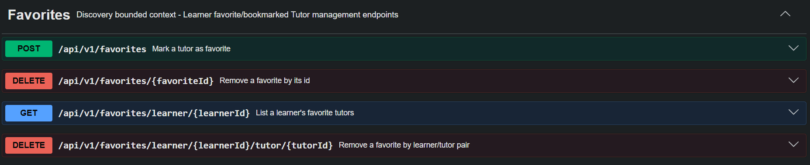
  <figcaption style="margin-top: 10px; font-style: italic;">
    Figura. Captura de Swagger UI mostrando los endpoints del nuevo bounded context Favorites, implementado durante el Sprint 4.
  </figcaption>
</figure>

---

##### Bounded Context: Identity & Access Management (IAM)

Este bounded context fue integrado en su totalidad durante el Sprint 4, reemplazando el mock de identidad utilizado en sprints anteriores (`CURRENT_LEARNER_ID`/`CURRENT_TUTOR_ID`) por el servicio real de autenticación y gestión de usuarios, correspondiente a las historias **US01** (registro validado con correo institucional), **US02** (login con acceso por rol) y **US04** (badge de verificación institucional).

**Authentication**

| Endpoint | Action | HTTP Verb | Call Syntax | Parameters | Response Example |
| :--- | :--- | :---: | :--- | :--- | :--- |
| /api/v1/authentication/sign-up | Register a new user | POST | `POST /api/v1/authentication/sign-up` | Body: `{"username":"jperez","password":"Secure123!","email":"jperez@upc.edu.pe","roles":["ROLE_LEARNER"]}` | `{"id":15,"username":"jperez","email":"jperez@upc.edu.pe","roles":["ROLE_LEARNER"],"verified":true}` |
| /api/v1/authentication/sign-in | Authenticate a user and issue a JWT | POST | `POST /api/v1/authentication/sign-in` | Body: `{"username":"jperez","password":"Secure123!"}` | `{"id":15,"username":"jperez","token":"eyJhbGciOiJIUzI1NiJ9...","roles":["ROLE_LEARNER"]}` |

> **Nota de negocio:** el registro solo se completa exitosamente si el correo enviado corresponde a un dominio institucional `.edu.pe`. El backend valida este formato durante el `sign-up` y asigna automáticamente el flag `verified` en base a dicha validación (US01, US04).

<figure style="text-align: center; margin-bottom: 40px;">
  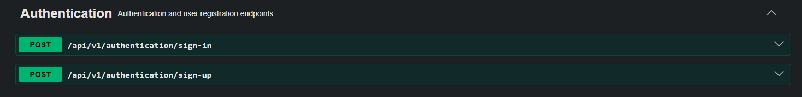
  <figcaption style="margin-top: 10px; font-style: italic;">
    Figura. Captura de Swagger UI mostrando los endpoints del bounded context Authentication, correspondientes al login y registro real vía IAM.
  </figcaption>
</figure>

---

**Users**

| Endpoint | Action | HTTP Verb | Call Syntax | Parameters | Response Example |
| :--- | :--- | :---: | :--- | :--- | :--- |
| /api/v1/users | Get all users | GET | `GET /api/v1/users` | None | `[{"id":15,"username":"jperez","email":"jperez@upc.edu.pe","roles":["ROLE_LEARNER"],"verified":true}]` |
| /api/v1/users/{userId} | Get user by ID | GET | `GET /api/v1/users/15` | userId (path) | `{"id":15,"username":"jperez","email":"jperez@upc.edu.pe","roles":["ROLE_LEARNER"],"verified":true}` |
| /api/v1/users/{userId}/roles | Update user roles | PATCH | `PATCH /api/v1/users/15/roles` | userId (path), Body: `{"roles":["ROLE_LEARNER","ROLE_TUTOR"]}` | `{"id":15,"username":"jperez","roles":["ROLE_LEARNER","ROLE_TUTOR"]}` |
| /api/v1/users/{userId}/verify | Verify institutional user | PATCH | `PATCH /api/v1/users/15/verify` | userId (path) | `{"id":15,"username":"jperez","verified":true}` |

> **Nota de negocio:** el endpoint `updateUserRoles` es el que habilita el acceso diferenciado por rol (Learner, Tutor, Coordinator) que consumen los guards del Frontend Angular (US02). El endpoint `verifyUser` respalda la visualización del badge de verificación institucional en el perfil público del tutor (US04).

<figure style="text-align: center; margin-bottom: 40px;">
  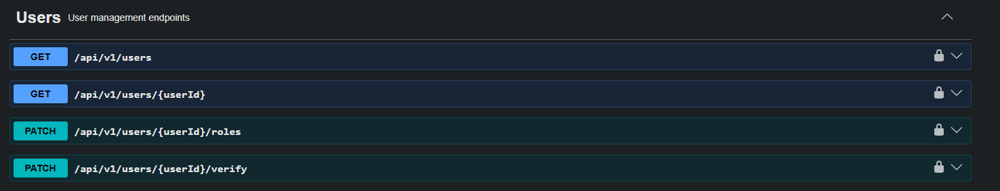
  <figcaption style="margin-top: 10px; font-style: italic;">
    Figura. Captura de Swagger UI mostrando los endpoints del bounded context Users, correspondientes a la gestión de roles y verificación institucional.
  </figcaption>
</figure>


---

*(Tabla. Tabla de Services Documentation Evidence for Sprint Review - Elaboración propia.)*

> **Nota sobre el cierre del backend:** con el Sprint 4 se completa el 100% de la
> integración entre Frontend y Backend. Los seis bounded contexts (Workspace,
> Discovery, Reputation, Payments, Moderation y Learning) operan sobre el IAM
> real, se añade el endpoint Favorites como funcionalidad nueva, y
> los siete bounded contexts cuentan con documentación OpenAPI completa
> (descripción, parámetros y ejemplos) visible directamente en el Swagger UI
> desplegado, corrigiendo la observación levantada por el docente en la
> revisión del AV2. El sistema queda desplegado en su versión final para
> todos los productos: Landing Page, Web Application y Web Services.

---

### 5.2.4.7. Software Deployment Evidence for Sprint Review.
Durante el Sprint 4 se realizaron las actividades de despliegue final de los tres productos digitales de SkillSwap: Landing Page, Frontend Web Application y Web Services. Esta iteración se centró en consolidar en producción la integración completa lograda entre el Frontend Angular y el Backend Spring Boot, además de cerrar la observación del docente sobre la documentación de servicios señalada en el AV2.

Las principales actividades realizadas fueron:

- Actualización de las variables de entorno en Railway para reflejar la configuración final de conexión con el IAM real (eliminando las variables asociadas a los identificadores mockeados).
- Redeploy del backend Spring Boot en Railway incluyendo el nuevo bounded context Favorites, el fix de seguridad en el cálculo de comisión de Payments, la corrección del filtro de rating en Discovery, y las anotaciones OpenAPI (`@Tag`, `@Operation`, `@Parameter`, `@ApiResponse`) agregadas a los siete controllers del sistema.
- Migración manual en PostgreSQL (Railway) para la nueva tabla `favorites`, siguiendo el patrón establecido por el equipo de no confiar en `ddl-auto=update` para cambios estructurales sobre tablas ya pobladas.
- Configuración del preset unsigned de Cloudinary (`skillswap_unsigned`, cloud `dgs2up2vz`) en el entorno de producción del frontend para la compartición de archivos en el chat (US11).
- Verificación de CORS y de los guards de rol en el entorno desplegado, confirmando que las vistas de Learner, Tutor y Coordinator respondan correctamente según el usuario autenticado.
- Redeploy final del Frontend Angular en Firebase con la build que incorpora IAM real, Favorites, Cloudinary y las correcciones de usabilidad del AV2.
- Verificación en Swagger UI de que los siete bounded contexts (los seis existentes más Favorites) muestren descripción, parámetros y ejemplos de respuesta para cada endpoint en el entorno de producción, cerrando así la observación del AV2.

<figure style="text-align: center; margin-bottom: 40px;">
  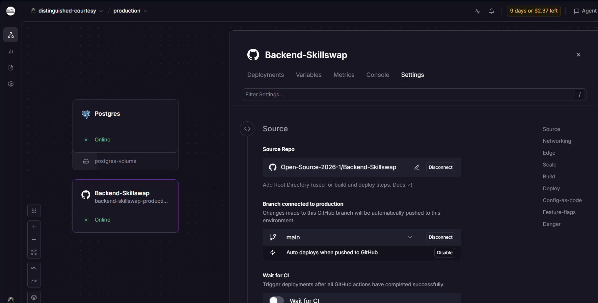
  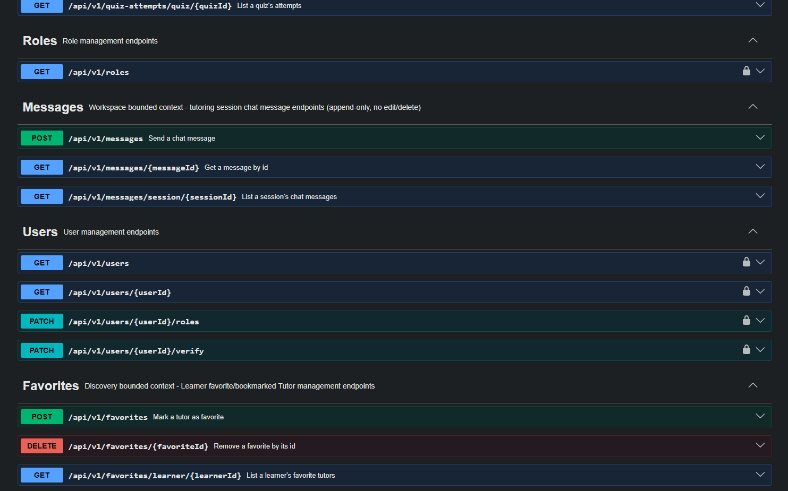
  <figcaption style="margin-top: 10px; font-style: italic;">
    Figura. Evidencia del despliegue final del backend SkillSwap en Railway, incluyendo el nuevo modelo de negocio Favorites, los fixes de Payments y Discovery, y las anotaciones OpenAPI aplicadas a los siete controllers.
  </figcaption>
</figure>

<figure style="text-align: center; margin-bottom: 40px;">
  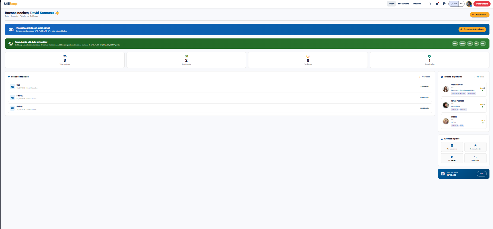
  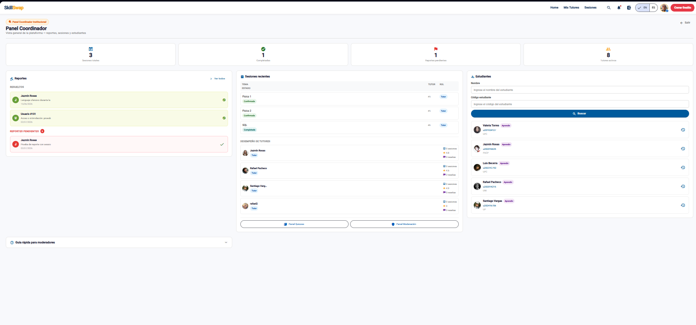
  <figcaption style="margin-top: 10px; font-style: italic;">
    Figura. Evidencia del despliegue final del Frontend Web Application en Firebase, con IAM real, Favorites y Cloudinary integrados.
  </figcaption>
</figure>

<figure style="text-align: center; margin-bottom: 40px;">
  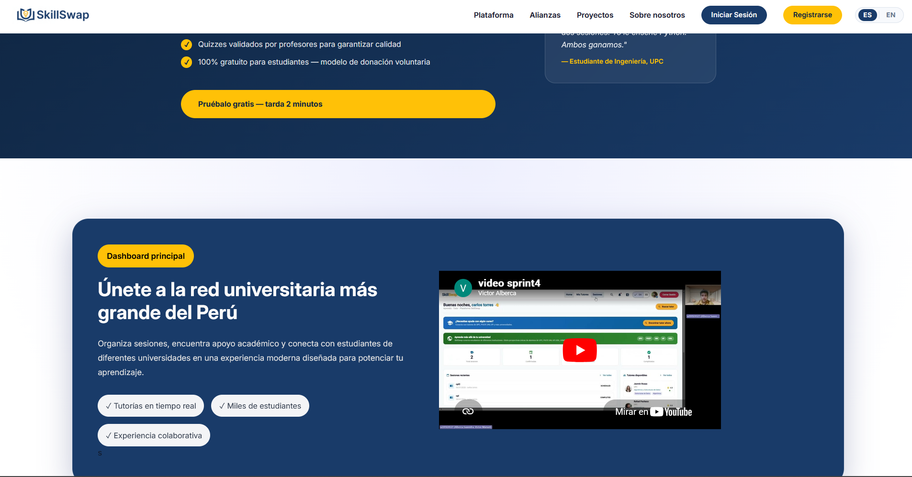
  <figcaption style="margin-top: 10px; font-style: italic;">
    Figura. Evidencia de la versión final desplegada de la Landing Page.
  </figcaption>
</figure>

**URL del backend desplegado:** [https://backend-skillswap-production-746f.up.railway.app](https://backend-skillswap-production-746f.up.railway.app)

**URL Swagger UI:** [https://backend-skillswap-production-746f.up.railway.app/swagger-ui/index.html](https://backend-skillswap-production-746f.up.railway.app/swagger-ui/index.html)

**URL de la Landing Page:** [https://open-source-2026-1.github.io/SkillSwape-UPC/](https://open-source-2026-1.github.io/SkillSwape-UPC/)

**URL del frontend:** [https://skillswap-open-source.web.app/home](https://skillswap-open-source.web.app/home)

---

### 5.2.4.8. Team Collaboration Insights during Sprint.
Durante el Sprint 4, el equipo concentró sus esfuerzos en cerrar los frentes de integración pendientes identificados en la retrospectiva del Sprint 3. Cada integrante trabajó en su rama `feature/` correspondiente al aspecto asignado (IAM, Favorites, Cloudinary/US11, fixes de usabilidad, seguridad de Payments, documentación de API), realizando Pull Requests hacia `develop` conforme se completaban las tareas. Se mantuvo GitFlow y Conventional Commits como convención de trabajo durante todo el sprint.

La distribución del trabajo fue la siguiente: Victor lideró la integración del IAM real, el cierre de la documentación OpenAPI en los siete bounded contexts del backend (corrigiendo la observación del docente en el AV2), y coordinó el despliegue final de ambos repositorios; David implementó el bounded context Favorites; Santiago integró Cloudinary para la compartición de archivos en el chat; Luis se enfocó en cerrar los diez hallazgos de la evaluación heurística del AV2 y en eliminar el acceso temporal de moderador; y Rafael reforzó la seguridad del cálculo de comisión en Payments y corrigió el filtro de rating en Discovery.

> **Nota sobre la corrección de la observación del AV2 respecto a evidencias de colaboración:** en el Sprint 3, la mayoría de los commits del equipo fueron consolidados y subidos por solo algunos miembros en representación de los demás integrantes, lo cual limitó la evidencia individual de participación en el historial de Git, aun cuando el trabajo de diseño e implementación sí fue distribuido. Para el Sprint 4, cada integrante realizó sus propios commits directamente desde su cuenta de GitHub en su rama `feature/` correspondiente, tal como se evidencia en el Development Evidence (5.2.4.4) y en los analíticos de colaboración presentados a continuación.

A continuación se presentan las capturas de los analíticos de GitHub que evidencian la participación de todos los miembros durante este Sprint:

<figure style="text-align: center; margin-bottom: 40px;">
  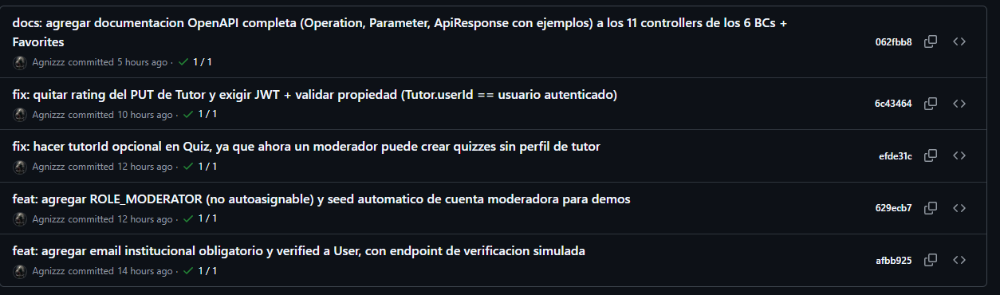
  <figcaption style="margin-top: 10px; font-style: italic;">
    Figura. Panel de contribuciones individuales durante el Sprint 4, mostrando el volumen de commits y líneas de código aportadas por cada integrante del equipo en el cierre de la integración.
  </figcaption>
</figure>

<figure style="text-align: center; margin-bottom: 40px;">
  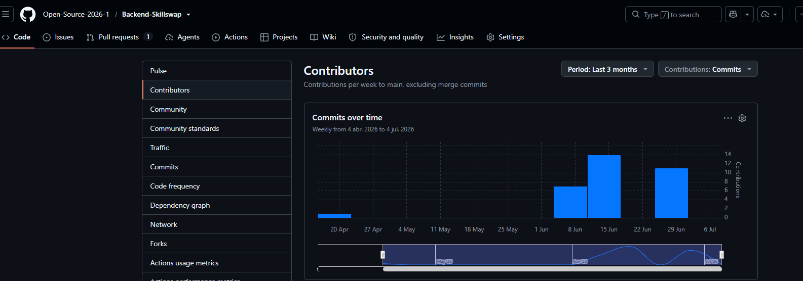
  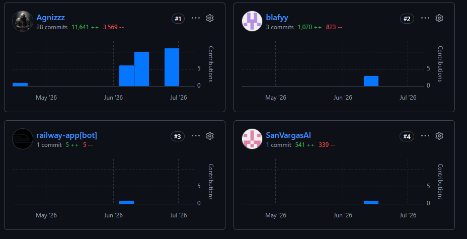
  <figcaption style="margin-top: 10px; font-style: italic;">
    Figura. Gráfico de actividad de commits durante el Sprint 4, evidenciando la participación individual de cada integrante en el cierre de la integración Frontend-Backend.
  </figcaption>
</figure>

<figure style="text-align: center; margin-bottom: 40px;">
  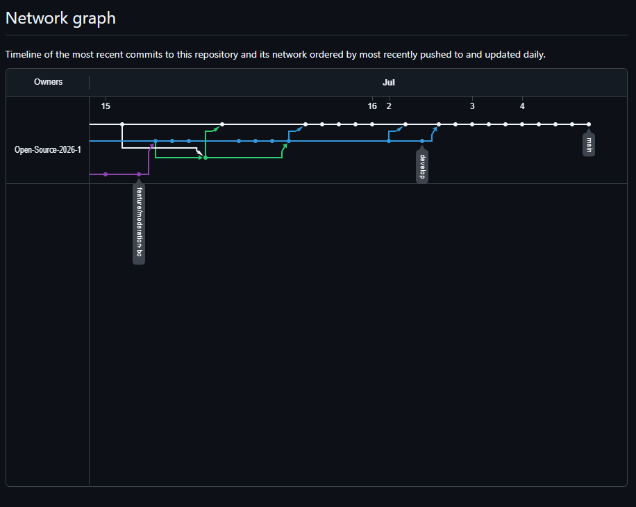
  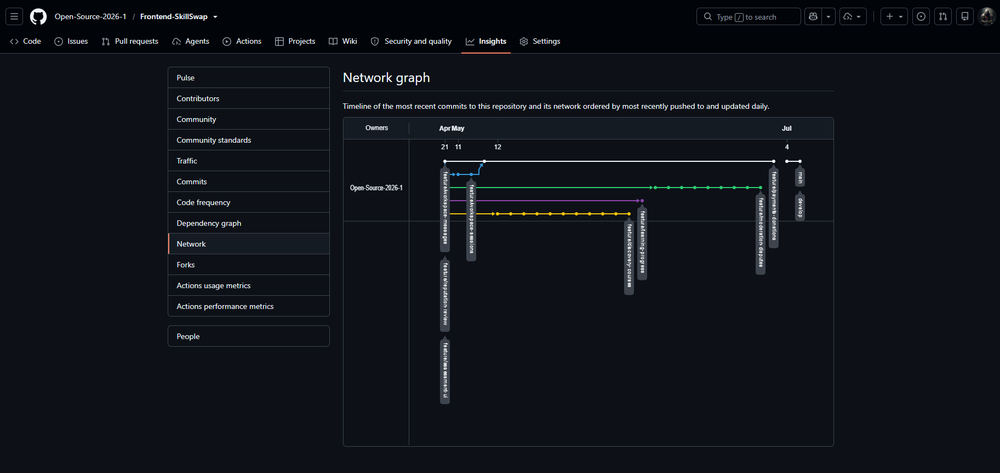
  <figcaption style="margin-top: 10px; font-style: italic;">
    Figura. Network graph de los repositorios Frontend y Backend, evidenciando el flujo de trabajo GitFlow con ramas feature por aspecto de integración y su fusión hacia develop.
  </figcaption>
</figure>

---

# 5.3. Validation Interviews.

## 5.3.1. Diseño de Entrevistas.
Las entrevistas de validación tienen como objetivo evaluar la experiencia de usuario
de la plataforma SkillSwap a través de la interacción directa de representantes de
cada segmento objetivo con el Frontend Web Application desplegado. Se busca
identificar problemas de usabilidad, arquitectura de información y diseño inclusivo,
así como recoger percepciones generales sobre la propuesta de valor de la
plataforma.

Para cada segmento se definieron los user flows a evaluar y un conjunto de 10
preguntas guía que orientan la sesión de validación.

---

##### User Flows a evaluar

**Segmento 1 — Estudiante Aprendiz:**
- Búsqueda y filtrado de tutores disponibles (Discovery)
- Envío de solicitud de sesión de tutoría (Workspace)
- Visualización del chat interno de la reserva (Workspace)
- Resolución de un quiz de validación (Learning & Assessment)
- Realización de una donación voluntaria al tutor (Payments & Wallet)

**Segmento 2 — Estudiante Tutor:**
- Visualización de solicitudes de sesión recibidas y aceptación/rechazo (Workspace)
- Creación de un quiz para la sesión (Learning & Assessment)
- Visualización de reseñas recibidas y puntaje de reputación (Reputation System)
- Consulta del saldo y datos de la billetera virtual (Payments & Wallet)

**Segmento 3 — Coordinador Institucional:**
- Revisión del listado de reportes de mala conducta pendientes (Moderation & Disputes)
- Resolución de un reporte y cambio de estado (Moderation & Disputes)
- Monitoreo general del estado de la plataforma desde el dashboard

---

##### Preguntas por segmento

**Segmento objetivo #1: Estudiante Aprendiz**

1. Al ingresar por primera vez a la plataforma, ¿qué es lo primero que
   llama tu atención y qué tan clara te resulta la propuesta de valor de
   SkillSwap?
2. Al utilizar el buscador de tutores, ¿los filtros disponibles te resultan
   suficientes para encontrar al tutor que necesitas? ¿Qué filtro adicional
   agregarías?
3. Al visualizar el perfil de un tutor, ¿la información presentada —
   habilidades, universidad, calificación y disponibilidad — es suficiente
   para que puedas decidir si solicitar una sesión con él o ella?
4. Al realizar el proceso de solicitar una sesión de tutoría, ¿los pasos te
   resultaron claros e intuitivos, o en algún momento no supiste qué hacer
   a continuación?
5. Al acceder al chat interno de la reserva, ¿entendiste de inmediato para
   qué sirve ese espacio y cómo usarlo para coordinar con el tutor?
6. Al resolver el quiz de validación de la sesión, ¿la interfaz te resultó
   fácil de usar y las instrucciones fueron suficientemente claras?
7. Al momento de realizar la donación voluntaria al tutor, ¿el flujo de
   pago te generó confianza? ¿Hubo algún paso que te generó dudas?
8. En general, ¿la navegación entre las distintas secciones de la
   plataforma te resultó fluida, o en algún momento te sentiste perdido o
   perdida dentro de la aplicación?
9. ¿Hay alguna funcionalidad que esperabas encontrar como estudiante
   aprendiz y que no encontraste, o alguna que encontraste pero no
   entendiste para qué sirve?
10. Del 1 al 10, ¿qué tan probable es que recomiendes SkillSwap a un
    compañero o compañera que necesite apoyo académico? ¿Por qué?

---

**Segmento objetivo #2: Estudiante Tutor**

1. Al ingresar a la plataforma con el rol de tutor, ¿la interfaz te
   comunica de forma clara cuáles son tus responsabilidades y qué
   acciones puedes realizar desde tu cuenta?
2. Al revisar las solicitudes de sesión recibidas, ¿el proceso de aceptar
   o rechazar una solicitud te resultó sencillo y directo, o encontraste
   alguna fricción en ese flujo?
3. Al crear un quiz para una sesión, ¿la interfaz de creación de preguntas
   y opciones de respuesta te resultó intuitiva? ¿Añadirías o quitarías
   algún elemento?
4. Al visualizar las reseñas que tus aprendices han dejado sobre ti, ¿la
   presentación de la información — calificación, comentarios y promedio
   — es clara y te resulta útil para mejorar tu práctica como tutor?
5. Al consultar tu billetera virtual, ¿la información del saldo, el historial
   de donaciones recibidas y los datos bancarios es suficientemente
   clara y organizada?
6. ¿El modelo de donaciones voluntarias con retención del 5% de comisión
   queda suficientemente explicado dentro de la plataforma, o sientes que
   necesitas más información antes de aceptarlo?
7. Durante la navegación general de la plataforma con tu rol de tutor,
   ¿encontraste secciones o botones cuyo propósito no era evidente a
   primera vista?
8. ¿La plataforma te transmite confianza suficiente como para compartir
   tus conocimientos con estudiantes de otras universidades que no
   conoces? ¿Qué elemento visual o funcional contribuye más a esa
   sensación o la perjudica?
9. ¿Hay alguna herramienta o funcionalidad que como tutor necesitarías
   para gestionar mejor tus sesiones y que actualmente no encuentras en
   la plataforma?
10. Del 1 al 10, ¿qué tan probable es que uses SkillSwap activamente como
    tutor? ¿Qué mejorarías para aumentar ese puntaje?

---

**Segmento objetivo #3: Coordinador Institucional**

1. Al ingresar a la plataforma con el rol de coordinador, ¿el panel
   principal te comunica de forma inmediata cuál es tu función dentro del
   sistema y qué acciones puedes tomar?
2. Al revisar el listado de reportes de mala conducta, ¿la información
   presentada en cada reporte — motivo, usuarios involucrados, fecha y
   estado — es suficiente para que puedas tomar una decisión informada?
3. Al resolver un reporte y cambiar su estado, ¿el flujo de acción te
   resultó claro e irreversible en el momento correcto, o sentiste que
   podrías cometer un error sin darte cuenta?
4. ¿La plataforma te ofrece suficiente visibilidad sobre el estado general
   de la comunidad — número de sesiones activas, reportes pendientes,
   usuarios verificados — o sientes que te falta información clave para
   cumplir tu rol?
5. ¿La distinción entre los diferentes estados de un reporte (pendiente,
   en revisión, resuelto) es visualmente clara dentro de la interfaz?
6. Desde tu perspectiva institucional, ¿la plataforma transmite una imagen
   profesional y alineada con los estándares que una universidad esperaría
   de una herramienta de este tipo?
7. ¿Hay algún flujo de moderación que considerarías crítico y que
   actualmente no está cubierto por la plataforma, como el bloqueo
   temporal de usuarios o la escalada de reportes graves?
8. Al navegar entre las secciones del panel de coordinador, ¿la
   arquitectura de navegación te permite moverte de forma eficiente entre
   tareas distintas, o en algún momento perdiste el contexto de dónde te
   encontrabas?
9. ¿La plataforma facilita el registro de evidencia o trazabilidad de las
   acciones que tomas como coordinador, de forma que puedas justificar
   decisiones ante la institución?
10. Del 1 al 10, ¿qué tan útil consideras que sería SkillSwap como
    herramienta de gestión y moderación para una universidad? ¿Qué
    funcionalidad agregarías con mayor urgencia?

---

## 5.3.2. Registro de Entrevistas.
En esta sección se registran las entrevistas de validación realizadas con
representantes de cada segmento objetivo. Cada entrevistado interactuó
directamente con el Frontend Web Application desplegado de SkillSwap,
navegando los user flows definidos en la sección 5.3.1 mientras compartía
sus observaciones en voz alta. Las sesiones fueron grabadas en video y
editadas en un único archivo por segmento.


##### Segmento objetivo #1: Estudiante Aprendiz

*Entrevista 1**

* **Nombres:** *Mireya *

* **Apellidos:** *Rodriguez*

* **Edad:** *20*

* **Distrito:** *Lima*


<p align="center">
 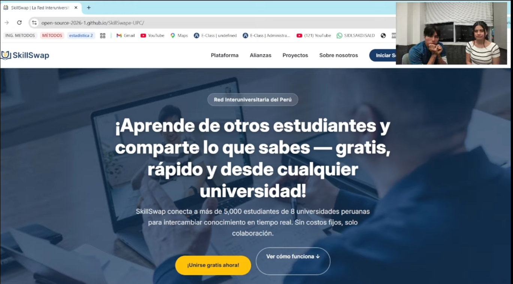
 <br>
 <em>Figura. Entrevista de validación 1: Estudiante que desea aprender. Nota:
 En esta figura se aprecia la sesión de validación con el primer entrevistado
 del segmento Estudiante que desea aprender.</em>
</p>


* **URL:** [https://www.youtube.com/watch?v=UQHa-O1ozWA](https://www.youtube.com/watch?v=UQHa-O1ozWA)

* **Inicio:** *0:00*

* **Duración:** 6 min 34 s


**Resumen descriptivo:**

El entrevistado valoró positivamente la propuesta de Skillspot, indicando que la interfaz es clara e intuitiva desde el primer ingreso. Señaló que en la sección Home pudo identificar fácilmente las sesiones activas, pendientes y completadas gracias al uso de tarjetas y colores diferenciados. Asimismo, destacó la visibilidad del botón para buscar tutores, considerándolo accesible y fácil de encontrar.

Respecto a la búsqueda de tutores, consideró adecuados los filtros por universidad y calificación mínima, aunque sugirió incorporar un filtro por horario para encontrar tutores disponibles en franjas específicas. También indicó que la barra de búsqueda resulta intuitiva y permite encontrar rápidamente cursos o temas de interés.

El participante manifestó que la información mostrada en el perfil de los tutores, como calificaciones, cursos impartidos y sesiones completadas, le genera confianza para solicitar una tutoría. Sin embargo, recomendó cambiar el color rojo del botón “Solicitar tutoría”, ya que podría asociarse con advertencias o acciones negativas.

Finalmente, calificó con 5 sobre 5 la probabilidad de utilizar la plataforma, debido a que resuelve la dificultad de encontrar apoyo académico de manera rápida y organizada. Como mejoras, sugirió mostrar el nombre del tutor directamente en la lista de sesiones y permitir adjuntar materiales o describir dudas antes de iniciar una tutoría para optimizar el tiempo de aprendizaje.

---

**Entrevista 2**
* **Nombres:** Ariana Valeria
* **Apellidos:** Pérez Vázquez
* **Edad:** 20
* **Distrito:** Cercado de Lima

<p align="center">
  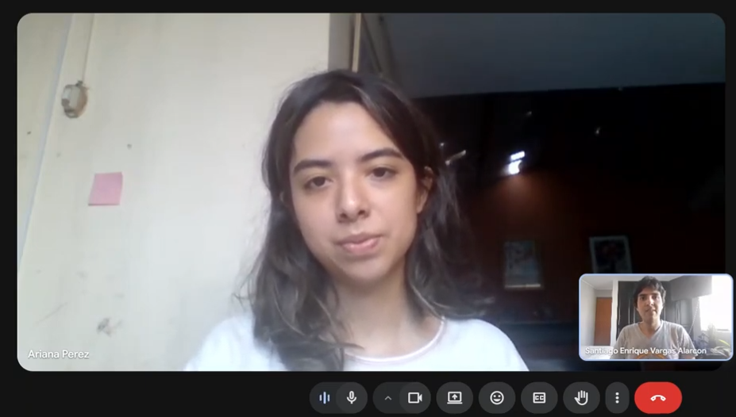
  <br>
  <em>Figura. YouTube: Entrevista 2: Estudiante-Aprendiz | Innovify. Nota: En esta figura se aprecia a la segunda persona entrevistada de nuestro segmento estudiante-aprendiz.</em>
</p>

* **URL:** [https://www.youtube.com/watch?v=s45lwIQfYIc](https://www.youtube.com/watch?v=s45lwIQfYIc)
* **Inicio:** 0:01
* **Duración:** 4:11

**Resumen descriptivo:**
En esta entrevista, Ariana Valeria Pérez Vázquez participa como estudiante-aprendiz y evalúa la propuesta de valor de la plataforma desde la perspectiva de un usuario interesado en reforzar sus conocimientos académicos. Durante la revisión de la landing page, señala que comprendió claramente el concepto del servicio, destacando que está dirigido a estudiantes que desean aprender mediante el apoyo de otros alumnos. Asimismo, menciona que el diseño le resultó atractivo debido al uso adecuado de colores y a una estructura organizada que favorece la usabilidad y facilita la comprensión del propósito de la plataforma.

Respecto a los flujos evaluados, considera que la búsqueda de tutores y la solicitud de tutorías son procesos sencillos e intuitivos, ya que requieren pocos pasos y permiten seleccionar de manera rápida el tema de interés y la fecha propuesta para la sesión. También valora positivamente la posibilidad de enviar mensajes a los tutores, puesto que favorece la comunicación y brinda mayor accesibilidad para resolver dudas específicas relacionadas con los cursos.

En relación con la billetera virtual, indica que la visualización del saldo, el registro de cuentas y la solicitud de retiros son acciones fáciles de identificar y ejecutar. Señala que, a diferencia de otras plataformas donde estos procedimientos suelen resultar complejos, en este caso percibió una experiencia simple y bien organizada. Asimismo, destaca que la ubicación visible del saldo contribuye a mejorar la experiencia de navegación.

Finalmente, expresa una valoración muy positiva sobre la propuesta general y manifiesta que utilizaría la plataforma debido a su facilidad de uso y utilidad académica. Aunque considera que no realizaría cambios importantes, sugiere incorporar imágenes representativas en las secciones o cursos disponibles para facilitar la identificación rápida de los contenidos sin necesidad de revisar extensamente la información textual. En términos generales, percibe que la plataforma transmite confianza y ofrece una experiencia amigable para los estudiantes que desean aprender mediante tutorías entre pares.

---

**Entrevista 3**
* **Nombres:** Gabriel
* **Apellidos:** Ramírez Gutiérrez
* **Edad:** 21
 * **Distrito:** Cercado de Lima
 
  <p align="center">
  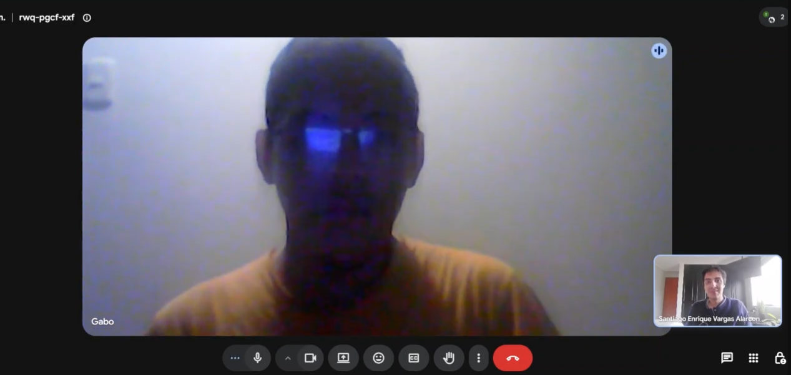
  <br>
  <em>Figura. YouTube: Entrevista 3: Estudiante-Aprendiz | Innovify. Nota: En esta figura se aprecia a la cuarta persona entrevistada de nuestro segmento estudiante-aprendiz.</em>
</p>

* **URL:** [https://www.youtube.com/watch?v=MF0zmj_ujKs](https://www.youtube.com/watch?v=MF0zmj_ujKs)
 * **Inicio:** 0:00
* **Duración:** 03:48

**Resumen descriptivo:**
En esta entrevista, Gabriel Ramírez Gutiérrez, estudiante de la UPC, evalúa la landing page de la plataforma desde la perspectiva del segmento de estudiantes que desean aprender. Durante la revisión, comprende claramente el concepto del sistema, identificándolo como una plataforma social que permite acceder a tutorías ya sea mediante un intercambio monetario o a través de un sistema de apoyo mutuo, donde se enseña para poder recibir tutorías. Lo que más destaca y valora positivamente es la viabilidad de realizar intercambios académicos con estudiantes de distintas universidades; señala que esta característica permite ampliar el aprendizaje al exponer a los usuarios a realidades y puntos de vista completamente diferentes a los de su propia institución. Como propuesta de mejora, recomienda que la landing page se enfoque y resalte aún más este aspecto de la conexión interuniversitaria, dado que lo considera un elemento sumamente interesante y un gran diferenciador del proyecto.

---

##### Segmento objetivo #2: Estudiante Tutor

**Entrevista 1**
* **Nombres:** Alexandra Vanessa
* **Apellidos:** Meléndez Fuentes
* **Edad:** 20
* **Distrito:** San Martín

<p align="center">
  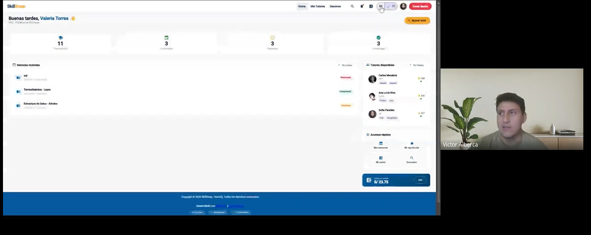
  <br>
  <em>Figura. Entrevista de validación 1: Estudiante Tutor. Nota: En esta
  figura se aprecia la sesión de validación con el primer entrevistado del
  segmento Estudiante Tutor.</em>
</p>

* **URL:** [https://www.youtube.com/watch?v=tTmIOGjPKdk](https://www.youtube.com/watch?v=tTmIOGjPKdk)
* **Inicio:** 0:01
* **Duración:** 10:50

**Resumen descriptivo:**
En esta entrevista, Alexandra Vanessa Meléndez Fuentes participa como estudiante-aprendiz y evalúa una plataforma de intercambio de conocimientos entre estudiantes. Durante la revisión de la interfaz, considera que el diseño inicial aún requiere mejoras para ser más comprensible y específico para distintas carreras, señalando que no encontró contenidos relacionados con su área de interés, como enfermería. Sin embargo, destaca que el proceso para buscar tutores y solicitar una tutoría le resultó sencillo y fácil de comprender. Asimismo, valora positivamente la funcionalidad de creación de cuestionarios, indicando que este tipo de herramientas son ampliamente utilizadas por docentes y contribuyen al aprendizaje mediante la práctica y evaluación constante de conocimientos. Respecto al sistema de reseñas, considera que es una característica importante porque permite recibir retroalimentación, identificar aspectos a mejorar en la enseñanza y fortalecer la calidad de las tutorías brindadas. En relación con la billetera virtual, inicialmente manifestó dificultades para comprender la información presentada; no obstante, luego de recibir una explicación adicional, señaló que la organización y visualización de los datos resultaban claras. También menciona que el modelo de donaciones voluntarias con una comisión del 5% requiere una explicación más detallada antes de ser aceptado completamente por los usuarios. Durante la navegación general, no identificó botones o secciones especialmente confusas, y considera que la plataforma transmite confianza para compartir conocimientos con estudiantes de otras instituciones. Finalmente, asigna una calificación de 6 sobre 10 a la propuesta, recomendando mejorar la sección de bienvenida y hacer más visible la búsqueda de tutores mediante elementos gráficos y etiquetas más claras que faciliten la orientación de los usuarios desde el inicio.

---

**Entrevista 2**
* **Nombres:** Carlos
* **Apellidos:** Rojas
* **Edad:** 21
* **Distrito:** Lima

<p align="center">
  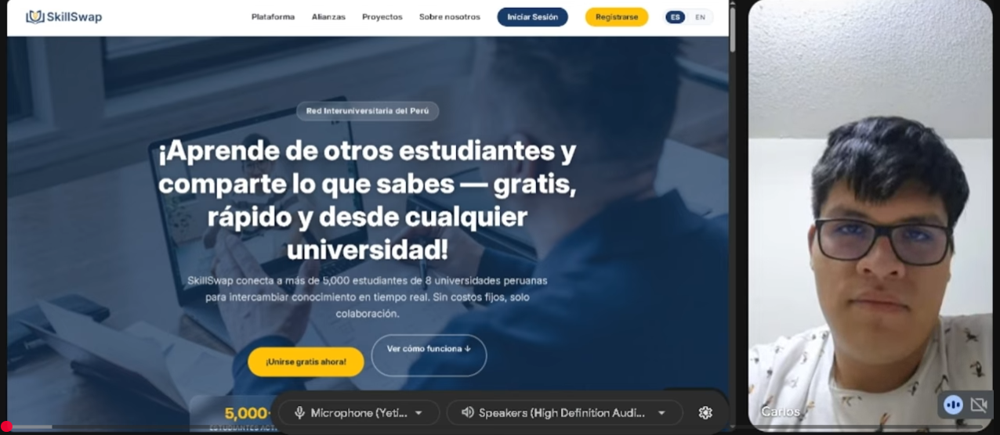
  <br>
  <em>Figura. YouTube: Entrevista 2: Estudiante-Tutor | Innovify. Nota: En esta figura se aprecia a la cuarta persona entrevistada de nuestro segmento estudiante-tutor.</em>
</p>

* **URL:** [https://www.youtube.com/watch?v=HdF4O5Q_G3Y](https://www.youtube.com/watch?v=HdF4O5Q_G3Y)
* **Inicio:** 0:01
* **Duración:** 6:50

**Resumen descriptivo:**
En esta entrevista, Carlos Rojas participa como estudiante-tutor y evalúa la plataforma desde la perspectiva de quien brinda apoyo académico a otros estudiantes. Durante la revisión del dashboard principal, considera que la interfaz presenta adecuadamente la información relevante para el tutor, como las sesiones programadas y los accesos rápidos a funcionalidades importantes. Sin embargo, señala que algunos elementos, como la sección de tutores disponibles, no resultan útiles para este perfil de usuario y podrían reemplazarse por información más pertinente, como próximas sesiones o notificaciones pendientes.

Respecto a la sección de sesiones, destaca que la diferenciación mediante colores facilita la identificación de los distintos estados de las tutorías. No obstante, menciona que ciertos aspectos de la información mostrada podrían optimizarse, como reemplazar el identificador del estudiante por su nombre y presentar las fechas en un formato más comprensible y amigable para los usuarios. Asimismo, considera que el proceso para aceptar solicitudes requiere mayor contexto sobre el estudiante, incluyendo sus expectativas y nivel de preparación previo a la sesión, con la finalidad de tomar decisiones más informadas antes de aceptar una tutoría.

En relación con el chat integrado, lo considera una de las herramientas más valiosas de la plataforma; sin embargo, identifica limitaciones importantes, como la imposibilidad de adjuntar archivos, imágenes o utilizar medios audiovisuales. Señala que estas funcionalidades son fundamentales para el desarrollo efectivo de algunas tutorías y que, en ausencia de ellas, los usuarios podrían recurrir a herramientas externas como Discord o Google Drive. También propone que los tutores puedan visualizar un mensaje inicial del estudiante antes de aceptar una sesión, aun cuando el chat completo permanezca bloqueado.

Sobre la funcionalidad de creación de cuestionarios, indica que puede resultar útil para áreas como matemáticas o ciencias; sin embargo, considera que presenta limitaciones para disciplinas más prácticas o creativas, como comunicación audiovisual, donde resulta complejo evaluar competencias mediante preguntas de opción múltiple. Del mismo modo, respecto al sistema de reseñas y reputación, valora positivamente la existencia de comentarios y calificaciones, aunque sugiere enriquecer el perfil del tutor incorporando portafolios, ejemplos de trabajos realizados y evidencias de experiencia que permitan mostrar mejor sus capacidades y especialidades.

Finalmente, en cuanto a la billetera virtual, considera que el historial de donaciones es claro y fácil de interpretar; no obstante, manifiesta preocupación respecto al modelo basado únicamente en aportes voluntarios, debido a la incertidumbre que genera para los tutores que invierten tiempo en la preparación de materiales. Propone establecer algún mecanismo que garantice una compensación mínima por las sesiones realizadas. Como valoración general, asigna una calificación de 3 sobre 5, indicando que la propuesta posee un diseño atractivo y un concepto interesante, pero que requiere mejoras prioritarias relacionadas con el envío de archivos en el chat, la incorporación de portafolios en los perfiles y la revisión del sistema de donaciones para fortalecer la confianza y el compromiso de los tutores.

---

**Entrevista 3**
* **Nombres:** Marco 
* **Apellidos:** Guerrero
* **Edad:** 23
* **Distrito:** Lima

<p align="center">
  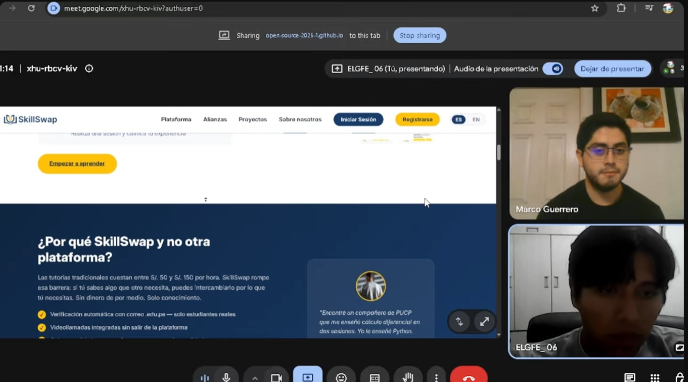
  <br>
  <em>Figura. YouTube: Entrevista 3: Estudiante-Tutor | Innovify. Nota: En esta figura se aprecia a la quinta persona entrevistada de nuestro segmento estudiante-tutor.</em>
</p>

* **URL:** [https://www.youtube.com/watch?v=eJnGm-fSL2o](https://www.youtube.com/watch?v=eJnGm-fSL2o)
* **Inicio:** 0:00
* **Duración:** 7:34

**Resumen descriptivo:**
En esta entrevista, el participante evalúa la plataforma Skill Swap desde la perspectiva de un estudiante-tutor encargado de brindar apoyo académico a otros alumnos. Durante la revisión del dashboard principal, considera que la información general presentada resulta útil para conocer la actividad dentro de la plataforma; sin embargo, señala que sería importante incorporar alertas visuales que permitan identificar rápidamente aquellas solicitudes o sesiones que requieren atención prioritaria, evitando que todas las actividades tengan el mismo nivel de relevancia dentro de la interfaz.

Respecto a la sección de sesiones, menciona que la tabla cumple adecuadamente su función básica de organización, aunque propone reemplazar el identificador del estudiante por su nombre para facilitar la identificación de cada tutoría. Asimismo, sugiere utilizar formatos de fecha más amigables y comprensibles para los usuarios, ya que la presentación técnica actual dificulta la lectura rápida de la información más importante relacionada con las clases programadas.

En relación con el proceso de aceptación de solicitudes, considera que los botones para aceptar o rechazar son claros y fáciles de utilizar; no obstante, destaca la necesidad de disponer de mayor información sobre el estudiante antes de tomar una decisión. Señala que conocer el nivel de preparación del alumno, las dificultades específicas que presenta y los intentos previos realizados permitiría filtrar adecuadamente las solicitudes y mejorar la experiencia tanto para el tutor como para el estudiante.

Sobre el chat integrado, reconoce su utilidad como medio de comunicación entre ambas partes; sin embargo, considera que sus funcionalidades son limitadas al permitir únicamente el intercambio de mensajes de texto. Desde su experiencia, indica que sería necesario incorporar la posibilidad de adjuntar archivos, compartir tablas, gráficos u otros recursos didácticos que faciliten el desarrollo de tutorías en áreas como finanzas o macroeconomía. Asimismo, propone habilitar algún mecanismo para que el estudiante pueda enviar una descripción inicial de su consulta antes de que el tutor acepte formalmente la sesión.

Respecto al sistema de evaluación mediante cuestionarios, considera que la idea es positiva; sin embargo, expresa preocupación sobre la correspondencia entre el contenido del quiz y los temas efectivamente abordados durante la tutoría. Desde su perspectiva, un cuestionario elaborado sin considerar el enfoque específico utilizado por el tutor podría generar evaluaciones poco representativas del aprendizaje alcanzado por el estudiante.

En cuanto al sistema de reputación, valora favorablemente la existencia de reseñas y calificaciones, ya que contribuyen a generar confianza dentro de la comunidad académica. No obstante, menciona que sería conveniente permitir que los tutores puedan responder a los comentarios recibidos y ofrecer aclaraciones cuando consideren que una reseña no refleja adecuadamente lo ocurrido durante la sesión. Además, considera que una calificación numérica por sí sola no proporciona información suficiente sobre los aspectos concretos que deben fortalecerse.

Finalmente, sobre la billetera virtual, señala que el desglose de donaciones y la comisión aplicada resultan comprensibles; sin embargo, expresa preocupación por la incertidumbre asociada al modelo basado exclusivamente en aportes voluntarios. Considera que la ausencia de un ingreso mínimo garantizado podría afectar la motivación y el compromiso de los tutores a largo plazo. Como valoración general, asigna una puntuación de 3 sobre 5 a la propuesta, destacando como principales oportunidades de mejora la incorporación de mensajes previos a la aceptación de sesiones, el soporte para archivos adjuntos en el chat, la presentación de fechas en formatos más legibles y la posibilidad de responder a las reseñas recibidas dentro del perfil del tutor.

---

##### Segmento objetivo #3: Coordinador Institucional

**Entrevista 1**
* **Nombres:** Luis
* **Apellidos:** Saavedra
* **Edad:** 32
* **Distrito:** San Martín

<p align="center">
  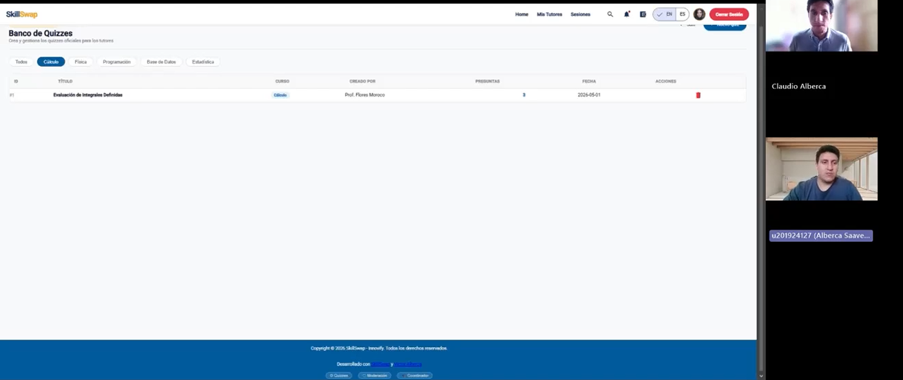
  <br>
  <em>Figura. YouTube: Entrevista 1: Profesor-Coordinador | Innovify. Nota: En esta figura se aprecia a la segunda persona entrevistada de nuestro segmento profesor-coordinador.</em>
</p>

* **URL:** [https://www.youtube.com/watch?v=CCJOTfhjXx4](https://www.youtube.com/watch?v=CCJOTfhjXx4)
* **Inicio:** 0:00
* **Duración:** 9:33

**Resumen descriptivo:**
En esta entrevista, Luis Saavedra, profesor de inglés del colegio José de San Martín de la ciudad de Moyobamba, evalúa la plataforma Skill Swap desde la perspectiva de un docente con funciones de moderación y supervisión. Considera que el panel principal comunica de manera clara las responsabilidades asociadas a su rol, destacando la utilidad de la información relacionada con reportes, sesiones pendientes y actividades de los estudiantes. Respecto al sistema de moderación, señala que la información presentada en los reportes es adecuada para realizar una primera evaluación; sin embargo, enfatiza la importancia de revisar detalladamente cada caso para diferenciar reportes legítimos de aquellos que podrían ser falsos. Asimismo, menciona que, como ocurre con cualquier plataforma nueva, es necesario un periodo de adaptación y capacitación para familiarizarse con las distintas funciones y herramientas disponibles. Valora positivamente la visibilidad de los indicadores generales de la comunidad, tales como sesiones activas, reportes y actividades recientes, aunque sugiere diferenciar con mayor claridad a los usuarios que desean aprender de aquellos que buscan enseñar. También considera que la clasificación visual de los estados de los reportes es adecuada y facilita el seguimiento de los casos pendientes o resueltos. Desde una perspectiva institucional, percibe que la plataforma proyecta una imagen profesional y alineada con los estándares esperados por una universidad, gracias a la organización y claridad de la información presentada. Como propuesta de mejora, recomienda incorporar la posibilidad de descargar reportes completos para analizar con mayor profundidad las evidencias y justificar decisiones de moderación en situaciones complejas. Finalmente, considera que la plataforma constituye una base sólida para la gestión y moderación de actividades académicas, aunque reconoce que será necesario incorporar nuevas funcionalidades de acuerdo con las necesidades específicas de las universidades y sus estudiantes.

---

**Entrevista 2**
* **Nombres:** Boris
* **Apellidos:** Alvarado
* **Edad:** 28
* **Distrito:** Los Olivos

<p align="center">
  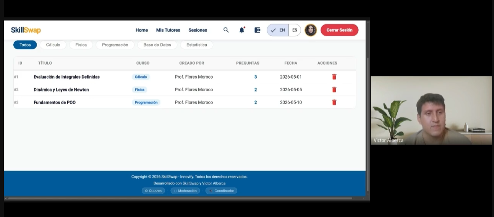
  <br>
  <em>Figura X. Entrevista de validación 2: Coordinador Institucional. Nota:
  En esta figura se aprecia la sesión de validación con el segundo entrevistado
  del segmento Coordinador Institucional.</em>
</p>

* **URL:** [https://youtu.be/VHzGI4_oqZE](https://youtu.be/VHzGI4_oqZE)
* **Inicio:** 0:00 
* **Duración:** 7:19

**Resumen descriptivo:**
En esta entrevista, Boris participa en calidad de docente universitario del área de Ciencias de la UTP y evalúa la plataforma desde la perspectiva de un profesor encargado de la moderación de reportes y la creación de encuestas dentro del sistema. Durante la revisión inicial, señala que la plataforma comunica de manera clara cuál es la función que desempeña el usuario dentro del sistema y cuáles son las acciones que puede realizar. Asimismo, considera que las descripciones emplean un lenguaje sencillo, lo que facilita la comprensión y manipulación de las herramientas disponibles.

Respecto al módulo de reportes, indica que la información presentada en cada caso, como los motivos del reporte, los usuarios involucrados y el estado correspondiente, resulta suficiente para tomar decisiones relacionadas con posibles sanciones hacia los estudiantes. Además, destaca que el sistema permite corroborar la información mediante elementos visuales y el acceso al historial del chat de la sesión, lo cual contribuye a verificar la veracidad de los reportes y reducir la posibilidad de que existan denuncias falsas.

En relación con el flujo para resolver reportes y modificar sus estados, considera que el proceso es comprensible siempre que exista un resumen o explicación breve sobre la función de cada sección. Valora positivamente la posibilidad de revisar información adicional antes de emitir una decisión, ya que esto le brinda mayor respaldo para determinar si corresponde aplicar una sanción o resolver el caso sin penalización.

Sobre el panel principal, menciona que la información relacionada con secciones activas, reportes pendientes y otros indicadores relevantes resulta útil para el cumplimiento de sus funciones. Sin embargo, sugiere incorporar una barra de búsqueda rápida que permita localizar información específica con mayor eficiencia y optimizar la experiencia de uso dentro de la plataforma.

En cuanto a la diferenciación visual de los estados de los reportes, manifiesta que algunas categorías, como los reportes resueltos, no son completamente claras a primera vista, por lo que recomienda reforzar los elementos visuales o descriptivos que permitan identificar con facilidad el significado de cada estado. Asimismo, considera que la plataforma proyecta una imagen profesional y acorde con los estándares esperados en un entorno universitario, destacando que las distintas pantallas ofrecen acceso a diversas funcionalidades relevantes tanto para docentes como para estudiantes.

Finalmente, al evaluar la navegación entre las diferentes secciones del sistema, como el panel principal, la moderación y la gestión de cuestionarios, señala que la experiencia podría mejorar mediante la incorporación de un botón de retroceso que facilite recordar la ubicación actual dentro del sistema. En términos generales, otorga una valoración altamente positiva a la plataforma y considera que sería una herramienta muy útil para la gestión y moderación en una universidad, ya que contribuiría a organizar de manera más eficiente el seguimiento de los estudiantes y la administración de situaciones relacionadas con la convivencia y el control académico.

---

**Entrevista 3**
* **Nombres:** Claudio
* **Apellidos:** Alberca
* **Edad:** 30
* **Distrito:** Lima

<p align="center">
  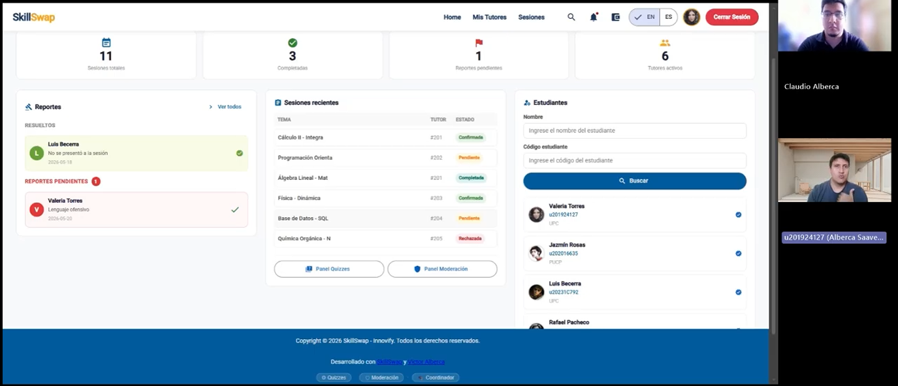
  <br>
  <em>Figura. YouTube: Entrevista 3: Profesor-Coordinador | Innovify. Nota: En esta figura se aprecia a la tercera persona entrevistada de nuestro segmento profesor-coordinador.</em>
</p>

* **URL:** * **Inicio:** 0:00
* **Duración:** 10:17

**Resumen descriptivo:**
En esta entrevista, Claudio Alberca, profesor de la Pontificia Universidad Católica del Perú, evalúa la plataforma Skill Swap desde la perspectiva de un coordinador o moderador encargado de supervisar la interacción entre usuarios. Durante la revisión del sistema, señala que el panel principal comunica adecuadamente las funciones asociadas a su rol, permitiéndole identificar con facilidad los reportes pendientes, las sesiones recientes y los estudiantes vinculados a las actividades académicas. Considera que la información presentada en los reportes es suficiente para comprender el motivo de una denuncia; sin embargo, destaca la necesidad de investigar tanto la versión del estudiante como la del tutor antes de tomar una decisión definitiva. Respecto al proceso de resolución de reportes, indica que el flujo de acciones resulta claro y fácil de utilizar, especialmente si existe la posibilidad de reabrir un caso cuando sea necesario. Asimismo, considera que la plataforma ofrece información suficiente para gestionar las sesiones y monitorear a los estudiantes, facilitando el cumplimiento de sus responsabilidades como coordinador. En cuanto a la interfaz, menciona que la diferenciación visual entre los distintos estados de los reportes es clara y comprensible, lo que favorece el seguimiento de los casos. Desde una perspectiva institucional, percibe que la plataforma transmite una imagen profesional y acorde con los estándares esperados por una universidad. No obstante, propone incorporar información adicional sobre los tutores, como experiencia docente, especialización, cantidad de sesiones impartidas y antecedentes de reportes, de manera que los usuarios puedan conocer mejor el perfil de quienes brindan apoyo académico. También considera importante implementar mecanismos de bloqueo temporal para aquellos usuarios que, tras una investigación, hayan incurrido en conductas inapropiadas dentro de la plataforma. Finalmente, destaca la simplicidad de la navegación y la facilidad para registrar evidencias relacionadas con las acciones de moderación, asignando una valoración de 9 sobre 10 al sistema y sugiriendo como prioridad la incorporación de historiales de desempeño y antecedentes de los tutores para fortalecer la transparencia y la confianza dentro de la comunidad académica.

---


#### 5.3.3. Evaluaciones según heurísticas

A continuación se presenta la evaluación de la experiencia de usuario de
SkillSwap basada en las sesiones de validación realizadas con representantes
de los tres segmentos objetivo. La evaluación aplica heurísticas de
usabilidad, diseño inclusivo y arquitectura de información.

---

**UX Heuristics & Principles Evaluation**
*Usability – Inclusive Design – Information Architecture*

<div align="center">

| | |
| :--- | :--- |
| **CARRERA** | Ingeniería de Software |
| **CURSO** | Desarrollo de Aplicaciones Open Source |
| **SECCIÓN** | 11990 |
| **PROFESORES** | Juan Antonio Flores Moroco |
| **AUDITOR** | Innovify |
| **CLIENTE(S)** | Entrevistados |
||
</div>
---

**SITE o APP A EVALUAR:**
SkillSwap — Frontend Web Application
[https://skillswap-open-source.web.app/home](https://skillswap-open-source.web.app/home)

---

**TAREAS A EVALUAR:**

El alcance de esta evaluación incluye la revisión de la usabilidad de las
siguientes tareas:

1. Búsqueda y filtrado de tutores disponibles
2. Envío de solicitud de sesión de tutoría
3. Aceptación o rechazo de solicitud de sesión (rol tutor)
4. Uso del chat interno de la reserva
5. Resolución de un quiz de validación académica
6. Creación de un quiz (rol tutor)
7. Realización de una donación voluntaria al tutor
8. Consulta del saldo de la billetera virtual
9. Visualización de reseñas y puntaje de reputación
10. Revisión y resolución de reportes de mala conducta (rol coordinador)

No están incluidas en esta versión de la evaluación las siguientes tareas:

1. Registro e inicio de sesión con correo institucional (.edu.pe)
2. Videollamada integrada dentro de la sesión
3. Retiro de fondos desde la billetera virtual
4. Gestión de alianzas universitarias desde el panel de coordinador
5. Configuración de notificaciones y preferencias de usuario

---

**ESCALA DE SEVERIDAD:**

Los errores serán puntuados tomando en cuenta la siguiente escala de
severidad:

| Nivel | Descripción |
| :---: | :--- |
| 1 | Problema superficial: puede ser fácilmente superado por el usuario o ocurre con muy poca frecuencia. No necesita ser arreglado a no ser que exista disponibilidad de tiempo. |
| 2 | Problema menor: puede ocurrir un poco más frecuentemente o es un poco más difícil de superar para el usuario. Se le debería asignar una prioridad baja resolverlo de cara al siguiente release. |
| 3 | Problema mayor: ocurre frecuentemente o los usuarios no son capaces de resolverlo. Es importante que sean corregidos y se les debe asignar una prioridad alta. |
| 4 | Problema muy grave: un error de gran impacto que impide al usuario continuar con el uso de la herramienta. Es imperativo que sea corregido antes del lanzamiento. |

---

**TABLA RESUMEN:**

| # | Problema | Escala de severidad | Heurística/Principio violada(o) |
| :---: | :--- | :---: | :--- |
| 1 | El botón de "Solicitar tutoría" utiliza el color rojo, asociándose con acciones de advertencia | 2 | Usability: Consistencia y estándares |
| 2 | La lista de sesiones no muestra el nombre del tutor directamente en la tarjeta | 2 | Usability: Flexibilidad y eficiencia de uso |
| 3 | El modelo de donaciones no detalla claramente la comisión del 5% antes de la transacción | 3 | Usability: Ayuda y documentación |
| 4 | El panel general no diferencia claramente de forma visual a los aprendices de los tutores | 2 | Usability: Reconocimiento antes que recuerdo |
| 5 | Faltan datos detallados sobre la experiencia y antecedentes de los tutores en sus perfiles | 3 | Information Architecture: Is it findable? |

---

**DESCRIPCIÓN DE PROBLEMAS:**

---

**PROBLEMA #1:** El botón de "Solicitar tutoría" utiliza el color rojo, 
asociándose con acciones de advertencia

**Severidad:** 2

**Heurística violada:** Usabilidad — Consistencia y estándares

**Problema:**
En el perfil del tutor, el botón principal para solicitar una tutoría
está diseñado en color rojo. Según la retroalimentación de Mireya
(Estudiante Aprendiz), este color en interfaces suele asociarse con
advertencias o acciones negativas, lo que puede generar confusión al
intentar realizar una acción positiva como reservar una clase.

<p align="center">
  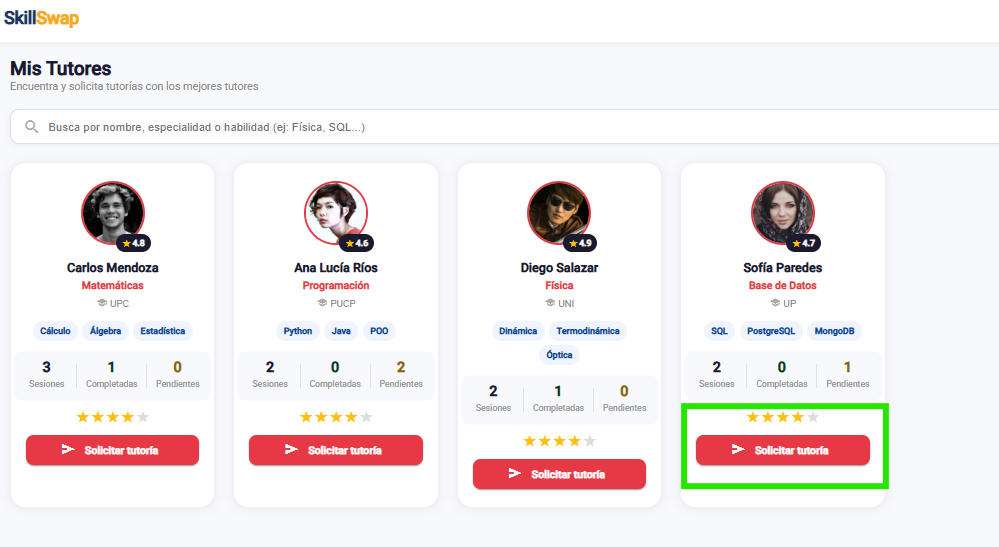
  <br>
  <em>Figura. Captura del perfil del tutor mostrando el botón de solicitud
  en color rojo.</em>
</p>

**Recomendación:**
Cambiar el color del botón a un tono que denote una acción primaria 
positiva (como el color principal de la marca, azul o verde), reservando 
el rojo exclusivamente para acciones destructivas o alertas.

---

**PROBLEMA #2:** La lista de sesiones no muestra el nombre del tutor 
directamente en la tarjeta

**Severidad:** 2

**Heurística violada:** Usabilidad — Flexibilidad y eficiencia de uso

**Problema:**
Al visualizar la lista de sesiones activas, pendientes o completadas en
la sección Home, las tarjetas no incluyen el nombre del tutor. El
segmento Estudiante Aprendiz indicó que esto requiere clics adicionales
para ingresar al detalle de la sesión solo para recordar con quién tienen
programada la tutoría.

<p align="center">
  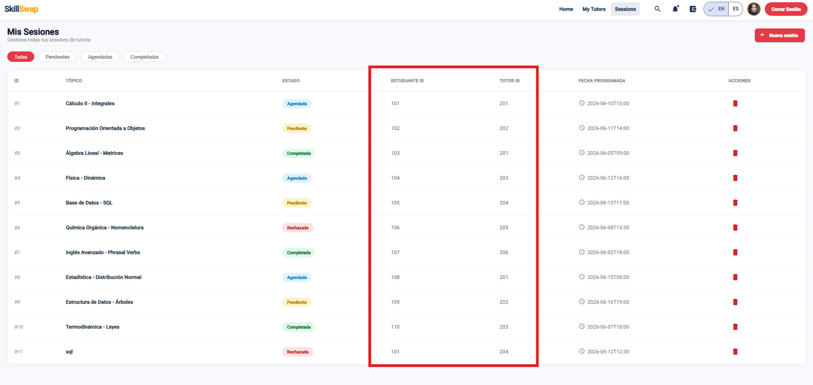
  <br>
  <em>Figura. Captura de la vista de sesiones donde las tarjetas omiten
  el nombre del tutor asignado.</em>
</p>

**Recomendación:**
Incluir el nombre del tutor y, de ser posible, una miniatura de su foto
de perfil directamente en la tarjeta de resumen de la sesión, agilizando
así la identificación por parte del usuario.

---

**PROBLEMA #3:** El modelo de donaciones no detalla claramente la comisión
del 5% antes de la transacción

**Severidad:** 3

**Heurística violada:** Usabilidad — Ayuda y documentación

**Problema:**
Durante la navegación en la sección de la billetera virtual y pagos,
(Estudiante Tutor) identificó que el descuento del 5% por
comisión de la plataforma no se explica de manera clara ni detallada. 
Esto genera dudas sobre el monto real a recibir y afecta la transparencia
percibida del sistema.

<p align="center">
  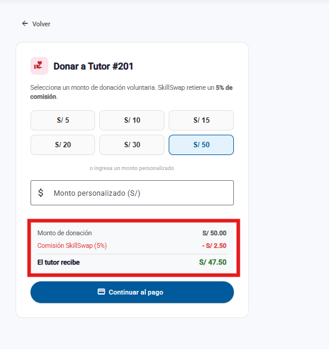
  <br>
  <em>Figura. Captura de la interfaz de pagos donde no se especifica 
  la retención de la comisión de la plataforma.</em>
</p>

**Recomendación:**
Agregar un texto explicativo o un tooltip en el formulario de donación 
que desglose el monto total ingresado, el descuento del 5% por el uso de
la plataforma y el monto neto final que llegará al tutor.

---

**PROBLEMA #4:** El panel general no diferencia claramente de forma visual
a los aprendices de los tutores

**Severidad:** 2

**Heurística violada:** Usabilidad — Reconocimiento antes que recuerdo

**Problema:**
En el panel de moderación utilizado por el Coordinador Institucional 
(evaluado por Luis Saavedra), la lista general de usuarios no hace una
distinción gráfica inmediata entre quienes buscan aprender y quienes 
enseñan, lo que dificulta el análisis rápido del comportamiento de la 
comunidad.

<p align="center">
  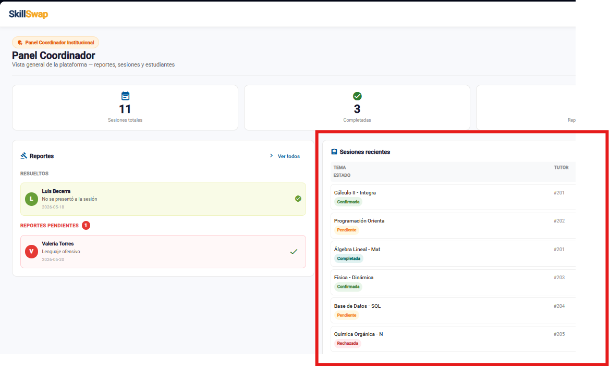
  <br>
  <em>Figura. Captura del panel del coordinador donde no se distingue
  visualmente el rol de cada usuario.</em>
</p>

**Recomendación:**
Implementar etiquetas visuales (badges o chips de colores) junto al
nombre de los usuarios en el panel del coordinador para identificar de un
vistazo si su rol activo es "Aprendiz" o "Tutor".

---

**PROBLEMA #5:** Faltan datos detallados sobre la experiencia y
antecedentes de los tutores en sus perfiles

**Severidad:** 3

**Heurística violada:** Information Architecture — Is it findable?

**Problema:**
Según la evaluación de Claudio Alberca (Coordinador), los perfiles de los
tutores carecen de información clave como experiencia docente, nivel de
especialización, cantidad histórica de sesiones impartidas y posibles
antecedentes de reportes, datos fundamentales para generar confianza.

<p align="center">
  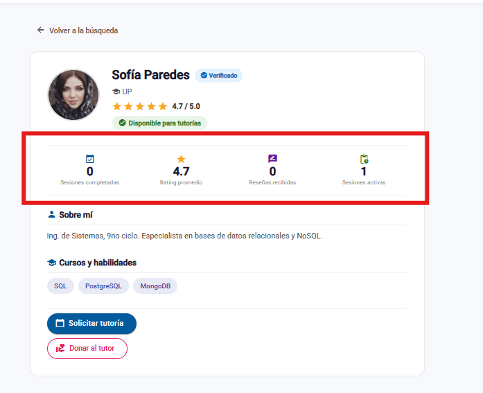
  <br>
  <em>Figura. Captura del perfil del tutor mostrando ausencia de 
  estadísticas y antecedentes académicos.</em>
</p>

**Recomendación:**
Enriquecer el perfil público del tutor añadiendo una sección de 
"Estadísticas y Experiencia" que centralice la cantidad de tutorías
dictadas, especialidad y su historial de desempeño dentro de la plataforma.

---

# 5.4. Video About-the-Product.
En esta sección se presenta el Video About-the-Product de SkillSwap,
dirigido a dos audiencias principales: los visitantes del Landing Page que
desean conocer el modelo de negocio y las características principales de
la plataforma, y los usuarios actuales que buscan comprender los flujos
core soportados por la solución. El tono empleado es colaborativo,
cercano y académico, consistente con la identidad visual y comunicacional
establecida para SkillSwap.

El video incluye una presentación del problema que resuelve la plataforma,
una demostración de los principales flujos de usuario para cada segmento
objetivo, y el testimonio positivo de un usuario que participó en las
entrevistas de validación.

<p align="center">
  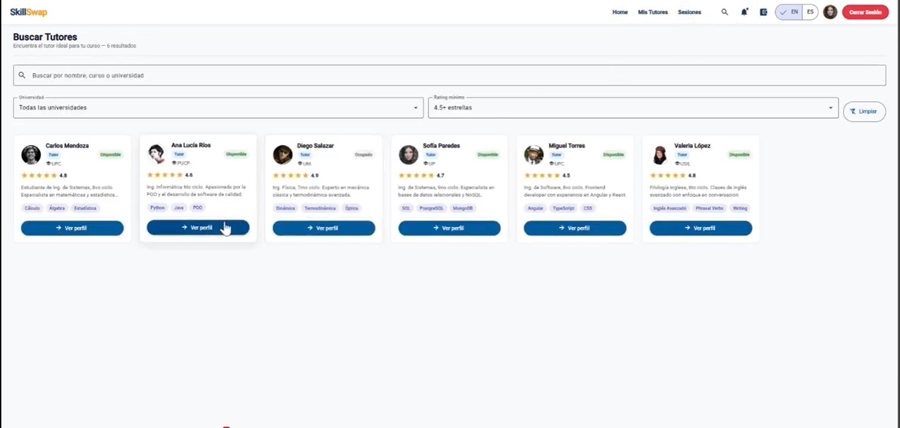
  <br>
  <em>Figura. Captura representativa del Video About-the-Product de
  SkillSwap. El video resume el modelo de negocio, las características
  principales de la plataforma y testimonios de usuarios de los segmentos
  objetivo.</em>
</p>

| | |
| :--- | :--- |
| **URL Microsoft Stream** | [ver video](https://upcedupe-my.sharepoint.com/:v:/g/personal/u201924127_upc_edu_pe/IQA5cpo2QD92T4a62lWc4xatAba9eoicuBjnPIIUCf52aFw?e=cNaFdP&nav=eyJyZWZlcnJhbEluZm8iOnsicmVmZXJyYWxBcHAiOiJTdHJlYW1XZWJBcHAiLCJyZWZlcnJhbFZpZXciOiJTaGFyZURpYWxvZy1MaW5rIiwicmVmZXJyYWxBcHBQbGF0Zm9ybSI6IldlYiIsInJlZmVycmFsTW9kZSI6InZpZXcifX0%3D) |
| **URL Youtube** | [https://www.youtube.com/watch?v=aVOBvnO035E](https://www.youtube.com/watch?v=aVOBvnO035E) |
| **Duración** | 2:30 |


---

# Conclusiones y Recomendaciones

## Conclusiones

**Sobre la arquitectura DDD y su capacidad de absorber cambios tardíos**

El haber definido los bounded contexts y sus agregados desde el Big Picture
Event Storming permitió que, incluso al reemplazar por completo los
identificadores de usuario simulados (`CURRENT_LEARNER_ID`/
`CURRENT_TUTOR_ID`) por el IAM real durante el Sprint 4, no fuera necesario
rediseñar ningún agregado ni modificar la estructura de los bounded
contexts ya implementados. Esto confirma que invertir tiempo en el
modelado del dominio durante las primeras semanas del proyecto —cuando aún
no existía una sola línea de código de producción— tuvo un retorno directo
al momento de integrar los servicios reales.

**Sobre la brecha entre "funciona con mocks" y "funciona en producción"**

Durante el Sprint 2 y buena parte del Sprint 3, el frontend funcionó
correctamente contra Fake APIs e identificadores fijos, lo cual generó una
falsa sensación de completitud. Solo al reemplazar esos mocks por el IAM
real en el Sprint 4 aparecieron problemas de acceso por rol y de
consistencia de datos que no eran visibles antes (por ejemplo, vistas que
asumían implícitamente un único usuario). El equipo aprendió que una
integración con datos simulados no reemplaza una prueba de integración con
autenticación real, y que ese reemplazo debería intentarse más temprano en
próximos proyectos, en lugar de dejarlo como cierre del último sprint.

**Sobre la seguridad como responsabilidad compartida entre frontend y backend**

El hallazgo del campo `commission` enviado desde el cliente evidenció un
error de diseño que pasó desapercibido durante varios sprints: confiar en
que el frontend siempre enviará datos correctos. La corrección aplicada
—recalcular la comisión en el backend e ignorar el valor recibido— es una
lección concreta sobre validación de invariantes de negocio en la capa de
aplicación, y no únicamente en la capa de presentación. De forma similar,
el filtro de "4+ estrellas" funcionando sobre un campo estático en lugar
del promedio real de Reputation es un recordatorio de que dos bounded
contexts relacionados (Discovery y Reputation) deben mantenerse
sincronizados de forma explícita, o el dato mostrado al usuario pierde
sentido de negocio.

**Sobre la evaluación heurística como herramienta de mejora continua**

Los diez problemas de usabilidad detectados en el AV2 (falta de
confirmación visual, ausencia de opción de cancelar, indicadores solo por
color) no eran errores de implementación sino decisiones de diseño que
nunca fueron cuestionadas hasta someterlas a una evaluación estructurada
con heurísticas de Nielsen y de diseño inclusivo. Corregirlas en el Sprint
4 confirmó que estos hallazgos eran accionables y de bajo costo de
implementación en comparación con el valor que aportan a la confianza del
usuario. La lección para el equipo es que este tipo de evaluación no
debería concentrarse solo antes de una entrega, sino aplicarse de forma
recurrente en cada sprint donde exista una interfaz nueva que validar.

**Sobre el trabajo por bounded context como mecanismo de coordinación**

La asignación de un líder técnico por bounded context, mantenida desde el
Sprint 3 hasta el cierre del proyecto, permitió que cada integrante
desarrollara dominio real sobre su parte del sistema sin depender
constantemente de los demás, mientras que la revisión cruzada como
colaborador evitó que el conocimiento quedara aislado en una sola persona.
Esto se hizo evidente en el Sprint 4, donde los fixes de Payments y
Discovery pudieron implementarse en paralelo con la integración del IAM
sin generar conflictos de código relevantes entre las ramas `feature/`.


## Recomendaciones

Se recomienda, para proyectos futuros del equipo, definir los contratos de
API (endpoints, verbos, estructura de request/response) entre frontend y
backend desde el mismo momento en que se elabora el Impact Map y el
Product Backlog, y no recién al iniciar la implementación del backend. En
SkillSwap, varias inconsistencias de nombres de endpoints y estructuras de
datos entre las Fake APIs del Sprint 2 y los servicios reales del Sprint 3
pudieron evitarse si dicho contrato se hubiera fijado antes.

Se recomienda incorporar la autenticación real (o al menos un mock que
simule correctamente las restricciones por rol) desde etapas más tempranas
del desarrollo frontend, en lugar de posponerla hasta el último sprint. El
uso prolongado de identificadores fijos (`CURRENT_LEARNER_ID`/
`CURRENT_TUTOR_ID`) ocultó problemas de control de acceso que solo se
hicieron visibles al integrar el IAM real, obligando a una revisión
adicional de todas las vistas del sistema en el Sprint 4.

Se recomienda tratar toda validación de reglas de negocio con impacto
económico o de seguridad (como el cálculo de comisiones) como
responsabilidad exclusiva del backend desde el primer sprint en que se
implemente el endpoint correspondiente, evitando que el frontend envíe
valores calculados que el servidor simplemente confía y persiste.

Se recomienda mantener la evaluación heurística como una práctica
recurrente por sprint —y no como una actividad concentrada en una sola
entrega— dado que su aplicación en el AV2 permitió detectar problemas
reales de usabilidad que fueron efectivamente corregidos antes del cierre
del proyecto, con un costo de implementación bajo en relación con la
mejora percibida por el usuario.

Finalmente, se recomienda documentar explícitamente las dependencias de
datos entre bounded contexts (como la relación entre el rating mostrado en
Discovery y el promedio calculado en Reputation) desde el modelado de
Design-Level EventStorming, para evitar que dos contextos relacionados
terminen mostrando información de negocio inconsistente al usuario final.


## Video About-the-Team

El Video About-the-Team de SkillSwap resume el proceso de trabajo
colaborativo desarrollado por el equipo Innovify a lo largo del ciclo de
vida del proyecto. El video incluye escenas de las sesiones de trabajo
real del equipo, complementadas con narración en voz en off que explica
las actividades realizadas en cada etapa: desde la investigación y
needfinding en el Sprint 1, pasando por el desarrollo del frontend Angular
con arquitectura DDD en el Sprint 2, hasta la implementación de los Web
Services con Spring Boot y las entrevistas de validación en el Sprint 3.

A lo largo del proyecto, el equipo logró desplegar una plataforma de
tutoría interuniversitaria completa, cubriendo seis bounded contexts,
integrando un frontend en Firebase con un backend en Railway, y validando
la propuesta con usuarios reales de los tres segmentos objetivo. Cada
integrante desarrolló competencias técnicas en su área de responsabilidad
y demostró capacidad de comunicación oral y escrita efectiva tanto al
interior del equipo como frente a distintas audiencias.

El video incluye además el testimonio ante cámara de cada participante,
describiendo las actividades realizadas durante el proyecto, el logro de
los outcomes del curso y las competencias desarrolladas a lo largo del
ciclo.

| Sección | Timing |
| :--- | :--- |
| Introducción y proceso de trabajo del equipo Innovify | 00:00-00:00 |
| Testimonio: Luis Becerra Ninahuanca | 00:00-2:03 |
| Testimonio: Victor Alberca Saavedra | 2:04-4:16 |
| Testimonio: David Komatsu Dueñas | 4:17-5:14 |
| Testimonio: Rafael Pacheco Lavado | 5:15-7:00 |
| Testimonio: Santiago Vargas Alarcón | 7:01-9:17 |

---

<p align="center">
  
  <br>
  <em>Figura. Captura representativa del Video About-the-Team de
  SkillSwap, mostrando el testimonio personal de uno de los integrantes
  del equipo Innovify.</em>
</p>

| | |
| :--- | :--- |
| **URL Microsoft Stream** | [ver video](https://upcedupe-my.sharepoint.com/:v:/g/personal/u201924127_upc_edu_pe/IQDpQN3MR3gRTbAqpmuK7D2wASQKAERIMPretZS1V3fQTHU?e=QMWs4g&nav=eyJyZWZlcnJhbEluZm8iOnsicmVmZXJyYWxBcHAiOiJTdHJlYW1XZWJBcHAiLCJyZWZlcnJhbFZpZXciOiJTaGFyZURpYWxvZy1MaW5rIiwicmVmZXJyYWxBcHBQbGF0Zm9ybSI6IldlYiIsInJlZmVycmFsTW9kZSI6InZpZXcifX0%3D) |
| **URL YouTube** | [https://youtu.be/HbdxsbFhGaE](https://youtu.be/HbdxsbFhGaE) |
| **Duración** | 9:17 min |

---


## Bibliografía y Anexos

###  Bibliografía

- Davila, R. C., Aguero Corzo, E. del C., Portillo, H., & Quimbita, O. R. (2022). *Deserción universitaria de los estudiantes de una universidad peruana*. Universidad y Sociedad, 14(2), 421-427.  
  http://scielo.sld.cu/scielo.php?script=sci_arttext&pid=S2218-36202022000200421  

- Escalante, J., Medina, C., & Vásquez, A. (2023). *La deserción universitaria: un problema no resuelto en el Perú*. Hacedor - AIAPÆC, 7(1), 60-72.  
  https://doi.org/10.26495/rch.v7i1.2421  

- García-Ortiz, J., López de Castro Machado, C., & Rivero Frutos, L. (2021). *Fracaso y abandono universitario*.  
  https://www.redalyc.org/journal/140/14070424012/html  

- Gobierno del Perú. (2024).  
  https://www.gob.pe/institucion/mef/noticias/868273  

- GoPeer. *Online tutoring made simple*.  
  https://gopeer.org/auth  

- Gutiérrez Pallares, J., Bernal Pérez, M. B., & Gutiérrez Pallares, E. (2024).  
  https://dialnet.unirioja.es/servlet/articulo?codigo=9789998  

- Instituto de Educación Superior Sabio Nacional Antúnez de Mayolo - TELESUP. (2019).  
  https://isam.edu.pe/pdf/reglamento-de-bienestar-estudiantil.pdf  

- Knack. *Peer tutoring for college students*.  
  https://www.joinknack.com/students  

- Ministerio de Educación. (2021).  
  https://www.gob.pe/institucion/minedu/noticias/552273  

- uDocz. *Plataforma de estudio colaborativo*.  
  https://www.udocz.com/home  

- Universidad de Piura. (2020).  
  https://www.udep.edu.pe/admision/lima/la-importancia-de-las-habilidades-blandas-en-la-educacion  

- Villamizar-Loaiza, C. (2021).  
  https://www.redalyc.org/journal/268/26871326008/html  


---

###  Anexos

-  **Figma (Wireframes):**  
  https://www.figma.com/design/l6Z6APfbLoci4YMSaZkILK/Wireframes-camino-feliz?node-id=121-1250&t=91cAQ4Kz2gcFrsPc-1  


-  **Página web:**  
  https://open-source-2026-1.github.io/SkillSwape-UPC/ 

- **Miro:**
 https://miro.com/welcomeonboard/K0ozbG1wZXpCVmZ5NTN5NnJnekhrZEZJc3lIdDVqbEtYRWdBY1hhOW5uY1lyYUE3a05hbE9iU3JsNkhFZTVsNExoRXZZNkFvazROOTBSWTYrMVozTEczbHovZEd6MU1XUFNQdEZvWlVKUDBzL3VRTTJFT0p5OXhsaEcrR0dLOEJBS2NFMDFkcUNFSnM0d3FEN050ekl3PT0hdjE=?share_link_id=729861756205 


- **Enlace del lucidchartd para los bounded context:**
https://lucid.app/lucidspark/5af3ee09-0b57-4a3a-9e9d-a0973c7463ae/edit?viewport_loc=-4867%2C-5483%2C15325%2C7900%2C0_0&invitationId=inv_0faec9a9-417f-47ae-8bde-c6aa100ce397

---

### Índice de Tablas

1. Perfiles integrantes de equipo
2. Lean UX Canvas
3. Análisis competitivo Landscape
4. Hallazgos entrevistas estudiantes universitarios
5. Hallazgos estudiantes tutores
6. Hallazgos coordinadores académicos
7. Actividades de aprendizaje y valoración
8. Actividades y motivaciones de estudiantes-tutores
9. Funciones y prioridades de coordinadores académicos
10. Ubiquitous Languages
11. Epics del proyecto
12. User Stories del proyecto
13. Product Backlog
14. Sistemas de búsqueda de la plataforma
15. Configuración del entorno de desarrollo de software
16. Sprint 1
17. Sprint Planning 1
18. Aspect Leaders and Collaborators
19. Sprint Backlog 1
20. Development Evidence for Sprint Review
21. Sprint 2
22. Sprint Planning 2
23. Aspect Leaders and Collaborators
24. Sprint Backlog 2
25. Development Evidence for Sprint Review


---

###  Índice de Figuras

1. Entrevista 1: Estudiante-Aprendiz
2. Entrevista 2: Estudiante-Aprendiz
3. Entrevista 3: Estudiante-Aprendiz
4. Entrevista 1: Estudiante-Tutor
5. Entrevista 2: Estudiante-Tutor
6. Entrevista 3: Estudiante-Tutor
7. Entrevista 2: Coordinador Institucional (Parte 1)
8. Entrevista 2: Coordinador Institucional (Parte 2)
9. Entrevista 3: Coordinador Institucional
10. Entrevista 4: Coordinador Institucional
11. User Persona - Estudiantes que quieren aprender
12. User Persona - Estudiantes que quieren enseñar
13. User Persona - Coordinador Institucional
14. User Journey Mapping - Estudiantes que quieren aprender
15. User Journey Mapping - Estudiantes que quieren enseñar
16. User Journey Mapping - Coordinador Institucional
17. Empathy Mapping - Estudiantes aprendices
18. Empathy Mapping - Estudiantes tutores
19. Empathy Mapping - Coordinador Institucional
20. Derivación de requisitos (Event Storming)
21. Requerimientos de comunicación síncrona
22. Flujo financiero y KPIs
23. Gestión de identidad y perfiles
24. Búsqueda y selección de tutores
25. Interacción en tiempo real
26. Procesos de aprendizaje y retroalimentación
27. Módulos de soporte y administración
28. Flujo de gestión de usuarios
29. Flujo de búsqueda de tutores
30. Espacio de trabajo colaborativo
31. Ciclo de vida de cuestionarios
32. Sistema de reputación del tutor
33. Flujo financiero de la plataforma
34. Resolución de conflictos
35. Impact Mapping - Registro de estudiantes
36. Impact Mapping - Tutorías exitosas
37. Impact Mapping - Retención y participación
38. Logo Innovify
39. Landing page - Página inicio
40. Paleta de colores
41. Paleta de colores iOS Mobile
42. Tipografía iOS Mobile
43. Campos de texto iOS Mobile
44. Botones iOS Mobile
45. Pickers y alertas iOS Mobile
46. Enlace a redes sociales iOS Mobile
47. Paleta de colores Android Mobile
48. Tipografía Android Mobile
49. Campos de texto Android Mobile
50. Botones Android Mobile
51. Pickers y alertas Android Mobile
52. Enlace a redes sociales Android Mobile
53. Diagrama de flujo Estudiante aprendiz
54. Diagrama de flujo Estudiante tutor
55. Diagrama de flujo Coordinador institucional
56. Sistema de etiquetado en navegación móvil
57. Wireframe sección principal Landing Page
58. Wireframe estructura Landing Page
59. Wireframe página principal móvil
60. Mock-up sección principal Landing Page
61. Mock-up cuerpo Landing Page
62. Mock-up Landing Page móvil
63. Arquitectura de la Landing Page
64. Colección de wireframes aplicación móvil
65. Colección de wireframes aplicación móvil (parte 2)
66. Wireflow de búsqueda y solicitud de tutoría
67. Wireflow de recepción y aceptación de solicitud
68. Wireflow de calificación de sesión y gestión de favoritos
69. Wireflow de configuración de perfil y disponibilidad del tutor
70. Wireflow de búsqueda avanzada con filtros
71. Wireflow de realización de sesión de tutoría
72. Wireflow de dashboard y reputación del tutor
73. Wireflow de monitoreo del coordinador
74. Wireflow de personalización de la experiencia
75. Mock-ups de alta fidelidad aplicación móvil
76. Diseño de componentes Payments & Wallet
77. Diseño físico Identity & Profile Context
78. (omitida en fuente original)
79. Diseño físico Academic & Assessment Context
80. Diseño físico Monetization Context
81. Diseño físico Shared Kernel & Infrastructure
82. Diseño físico Reputation & Gamification
83. Diseño físico Communication & Notifications
84. Wireflow búsqueda y solicitud (mobile)
85. Wireflow recepción y aceptación (tutor)
86. Wireflow verificación de estudiantes
87. Wireflow calificación y favoritos
88. Wireflow configuración de perfil
89. Wireflow búsqueda avanzada (mobile)
90. Wireflow sesión de tutoría (mobile)
91. Wireflow moderación y disputas
92. C4 Model - Container Diagram
93. Componentes Workplace Context
94. Componentes Reputation System Context
95. Componentes Payments & Wallet
96. Moderation & Disputes Context
97. Componentes Learning & Assessment
98. Estructura Learning & Assessment (repositorio)
99. Discovery Bounded Context
100. C4 Model - Component Diagram
101. Diagrama de clases UML del dominio
102. Arquitectura DDD (Bounded Contexts)
103. Base de datos relacional por contextos
104. Organización del proyecto en GitHub
105. Gráfico de commits del proyecto
106. Network graph (Gitflow)
107. Seguimiento Sprint 1 en Trello
108. Historial de commits
109. Página de inicio (landing estática)
110. Sección “Sobre nosotros”
111. Formulario de autenticación
112. Formulario de registro
113. Sección de equipo
114. Código fuente index.html
115. Hoja de estilos CSS
116. Configuración GitHub Pages
117. Landing page publicada
118. Gráfico commits over time
119. Estadísticas de colaboradores
120. Listado de commits recientes
121. Pull Request estructurado
122. Pull Request con conflictos
 

---

## Anexo C

| Sección | Características del video | Sobre el contenido | Integración y entrega |
| :--- | :--- | :--- | :--- |
| **Needfinding Interviews** | upc-pre-202610-1asi0730---needfinding-sprint-1 | Consolida todas las entrevistas realizadas, incluyendo en cada entrevista títulos con información del entrevistado, el segmento objetivo y la fecha de la entrevista. | https://upcedupe-my.sharepoint.com/:v:/g/personal/u201924127_upc_edu_pe/IQBRnpVnIxplRo7iLHOvEiZqAV2Dj9KLYVmcGKSInUeAjkQ?e=ZL65jW&nav=eyJyZWZlcnJhbEluZm8iOnsicmVmZXJyYWxBcHAiOiJTdHJlYW1XZWJBcHAiLCJyZWZlcnJhbFZpZXciOiJTaGFyZURpYWxvZy1MaW5rIiwicmVmZXJyYWxBcHBQbGF0Zm9ybSI6IldlYiIsInJlZmVycmFsTW9kZSI6InZpZXcifX0%3D  |
| **Prototypes Navigation / Product Navigation** | Cantidad de videos: 1<br><br>Nomenclatura: upc-pre-202610-1asi0730---navigation-sprint-<br><br>Formato: .mp4<br><br>Duración: En función a cantidad de user flows de aplicaciones (considerar edición de 3 a 5 minutos por aplicación). | Consolida demostración del flujo de navegación del Landing Page y las aplicaciones, priorizando los user flows relacionados con el core business. | Subir el video en Microsoft Stream con enlace privado. Incluir en el informe screenshot del video con enlace al mismo. Incluir redacción de introducción a la sección, resumiendo los flujos de navegación que se incluyen en el video. Seguir especificaciones del enunciado. **URL Sprint 4:** [ https://youtu.be/fIH2JKg4f3k]( https://youtu.be/fIH2JKg4f3k) |
| **Validation Interviews** | Cantidad de videos: 1<br><br>Nomenclatura: upc-pre-202610-1asi0730---validation-sprint-<br><br>Formato: .mp4<br><br>Duración: En función a cantidad de entrevistas (considerar edición de 3 a 5 minutos por entrevista). | Consolida sesiones y entrevistas de validación en las que usuarios de los segmentos objetivo interactúen con el landing page y con los prototipos de experiencias web y mobile, manifestando sus observaciones. Para cada entrevista se debe incluir títulos con información del entrevistado, el segmento objetivo y la fecha de la entrevista. | Subir el video en Microsoft Stream con enlace privado. Incluir en el informe screenshot del video con enlace al mismo. Incluir redacción de introducción a la sección y redacción de registro de cada entrevista, junto con la evaluación de heurísticas de usabilidad, arquitectura de información y diseño inclusivo para la sesión de evaluación. Seguir especificaciones del enunciado y formatos indicados. |
| **About the Product** | Cantidad de videos: 1<br><br>Nomenclatura: upc-pre-202610-1asi0730---aboutthe-product-sprint-<br><br>Formato: .mp4<br><br>Duración: De 1 a 3 minutos. | Orientación promocional, resumiendo el modelo de negocio, las características y beneficios del producto, incluyendo algunas escenas de interacción con el producto y al menos una opinión por cada segmento objetivo. | https://upcedupe-my.sharepoint.com/:v:/g/personal/u201924127_upc_edu_pe/IQA5cpo2QD92T4a62lWc4xatAba9eoicuBjnPIIUCf52aFw?e=cNaFdP&nav=eyJyZWZlcnJhbEluZm8iOnsicmVmZXJyYWxBcHAiOiJTdHJlYW1XZWJBcHAiLCJyZWZlcnJhbFZpZXciOiJTaGFyZURpYWxvZy1MaW5rIiwicmVmZXJyYWxBcHBQbGF0Zm9ybSI6IldlYiIsInJlZmVycmFsTW9kZSI6InZpZXcifX0%3D |
| **About the Team** | Cantidad de videos: 1<br><br>Nomenclatura: upc-pre-202610-1asi0730---aboutthe-team-sprint-<br><br>Formato: .mp4<br><br>Duración: En función al contenido (considerar 5 minutos para la sección de retrospectiva del grupo y 1 minuto por cada testimonio de miembro del equipo). | Video que resume el proceso de trabajo realizado, incluyendo escenas de sesiones de trabajo real del equipo, complementando con narración (voz en off) del proceso. Incluye además el testimonio ante cámara de cada participante describiendo actividades realizadas, logro de outcomes y desarrollo de competencias alcanzados. | [https://upcedupe-my.sharepoint.com/:v:/g/personal/u201924127_upc_edu_pe/IQDpQN3MR3gRTbAqpmuK7D2wASQKAERIMPretZS1V3fQTHU?e=QMWs4g&nav=eyJyZWZlcnJhbEluZm8iOnsicmVmZXJyYWxBcHAiOiJTdHJlYW1XZWJBcHAiLCJyZWZlcnJhbFZpZXciOiJTaGFyZURpYWxvZy1MaW5rIiwicmVmZXJyYWxBcHBQbGF0Zm9ybSI6IldlYiIsInJlZmVycmFsTW9kZSI6InZpZXcifX0%3D](https://upcedupe-my.sharepoint.com/:v:/g/personal/u201924127_upc_edu_pe/IQDpQN3MR3gRTbAqpmuK7D2wASQKAERIMPretZS1V3fQTHU?e=QMWs4g&nav=eyJyZWZlcnJhbEluZm8iOnsicmVmZXJyYWxBcHAiOiJTdHJlYW1XZWJBcHAiLCJyZWZlcnJhbFZpZXciOiJTaGFyZURpYWxvZy1MaW5rIiwicmVmZXJyYWxBcHBQbGF0Zm9ybSI6IldlYiIsInJlZmVycmFsTW9kZSI6InZpZXcifX0%3D) |

---


