<p align="center">
  
</p>
# UNIVERSIDAD PERUANA DE CIENCIAS APLICADAS
## Ingeniería de Software

**Período:** 2026-1  
**Curso:** 1ASI0730 | Aplicaciones Web  
**NRC:** 12190  
**Docente:** Hugo Allan Mori Paiva  

---

# INFORME DE TRABAJO FINAL

## Relación de integrantes

| Código | Apellidos y nombres |
| :--- | :--- |
| U201924127 | Alberca Saavedra, Victor Manuel |
| U201724692 | Komatsu Dueñas, David |
| U202014215 | Pacheco Lavado, Rafael Agustin |
| [Completar] | [Completar] |

---

## Registro de Versiones del Informe

| Versión | Fecha | Autor | Descripción de modificación |
| :--- | :--- | :--- | :--- |
| **v.01.Tb1** | 19/04/2026 | Alberca Saavedra, Víctor Manuel<br>Komatsu Dueñas, David<br>Pacheco Lavado, Rafael Agustin | Se agregaron los tópicos correspondientes a los Capítulos I, II, III, IV y V, abarcando desde el Startup Profile y Requirements Elicitation, hasta la arquitectura, diseño UI/UX (Landing Page y Mobile) y el Sprint 1. |
| **v.01.Tp1** | [Fecha] | [Autor] | Se agregaron los siguientes tópicos: [Completar] |
| **v.01.Tb2** | [Fecha] | [Autor] | Se agregaron los siguientes tópicos: [Completar] |
| **v.01.Tf** | [Fecha] | [Autor] | Se agregaron los siguientes tópicos: [Completar] |

*(Nota: En la versión v.01.Tb1 he resumido la lista de capítulos para que la tabla sea legible en GitHub. Si necesitas el listado exhaustivo de cada subcapítulo, te recomiendo ponerlo fuera de la tabla).*

---

## Student Outcome

| Criterio específico | Acciones realizadas | Conclusiones |
| :--- | :--- | :--- |
| **Trabaja en equipo para proporcionar liderazgo en forma conjunta** | **Victor Alberca:**<br>TB1: Participé en todo el proceso de desarrollo del proyecto, desde la investigación hasta la validación final...<br><br>**David Komatsu:**<br>TB1: Realicé entrevistas para obtener información de la problemática...<br>TP1: Encontré requerimientos de las funcionalidades...<br>TB2: Realicé entrevistas de validación y analicé detalladamente...<br>TF: Identifique partes del código con errores y duplicados...<br><br>**Rafael Pacheco:**<br>TB1: Realicé y registré las entrevistas de validación con los segmentos objetivo para identificar las necesidades críticas y problemas de los usuarios. | En la TB1, el equipo realizó diversas actividades clave: análisis competitivo, entrevistas, diseño de User Personas y validación del documento...<br><br>En el TP1, el equipo se enfocó en analizar y estructurar de manera más profunda los problemas mediante To-Be Scenario Mapping, Impact Mapping, Historias de Usuario, Wireframes y Mockups...<br><br>En la TB2, el equipo realizó entrevistas de validación, detectó oportunidades de mejora en navegación y aplicó evaluaciones heurísticas...<br><br>En el TF, el equipo identificó y resolvió problemas complejos en navegación, consistencia visual, estructura de clases y código. |
| **Crea un entorno colaborativo e inclusivo, establece metas, planifica tareas y cumple objetivos** | **Victor Alberca:**<br>TB1: Organicé y analicé la información de entrevistas...<br><br>**David Komatsu:**<br>TB1: Con la información obtenida diseñe el empathy map...<br>TP1: Alineamos las historias de usuario acorde a las necesidades...<br>TB2: Con la información obtenida, precisé los requerimientos...<br>TF: Registré el avance grupal de las nuevas funcionalidades...<br><br>**Rafael Pacheco:**<br>TB1: Analicé los datos de las entrevistas para estructurar la User Task Matrix y diseñé la sección "Sobre Nosotros" del Landing Page para comunicar la visión del equipo. | En esta etapa, el equipo organizó la información para nutrir el User Task Matrix, el Empathy Map y los User Personas, y definió la problemática y el modelo de negocio...<br><br>Durante esta etapa, se formularon criterios de aceptación, el Product Backlog y flujos de navegación lógicos...<br><br>En la TB2, el equipo profundizó en la definición técnica mediante entrevistas y mejoró la arquitectura de la landing page...<br><br>En esta etapa final, se convirtieron problemas detectados en requisitos claros y se corrigieron fallas en diseño responsive y código. |

---

# Capítulo I: Introducción

## 1.1. Startup Profile

### 1.1.1. Descripción de la Startup

**Innovify** es una startup cuyo propósito es reducir la deserción académica conectando a estudiantes universitarios para que compartan conocimientos a través de sesiones de tutoría. Esta iniciativa resuelve de manera ágil las dudas específicas de los alumnos mediante dos modalidades integradas: un aprendizaje sincrónico, llevado a cabo en tiempo real a través de videollamadas incrustadas en la misma plataforma (mediante el consumo de APIs de video externas), y un aprendizaje asincrónico, que facilita el intercambio de materiales y recursos de estudio directamente en el entorno de la reserva.

A diferencia de los modelos tradicionales, nuestra plataforma se sostiene bajo un modelo de negocio mixto (B2C y B2B). Por el lado del estudiante (B2C), operamos bajo un sistema colaborativo de donaciones voluntarias; al finalizar una tutoría, el aprendiz puede realizar un aporte económico al tutor como agradecimiento, procesado mediante una pasarela de pagos segura, de la cual Innovify retiene una comisión del 5% para garantizar su sostenibilidad. Por el lado institucional (B2B), Innovify ofrece alianzas estratégicas a las universidades, brindándoles acceso a un Dashboard Analítico ("Termómetro Académico") que les permite visualizar estadísticas en tiempo real sobre los cursos con mayor demanda de tutorías, ayudándolas a prevenir la deserción estudiantil.

Todo este ecosistema se mantiene seguro y escalable gracias a un proceso de validación automatizada que exige el uso de correos institucionales (`.edu.pe` o `upc.edu.pe`, `pupc.edu.pe`) para garantizar que los usuarios sean estudiantes reales. Asimismo, la calidad académica está respaldada por la participación de los Profesores Universitarios, quienes actúan como garantes de excelencia al crear el banco oficial de quizzes y retos que los tutores utilizan para evaluar a sus aprendices, fomentando un entorno confiable, profesional y altamente colaborativo.

Asimismo, pensando en la escalabilidad y el aseguramiento de la calidad a futuro, Innovify contempla la integración de tecnología IoT en su ecosistema. El roadmap tecnológico incluye el desarrollo de un **'Sensor de Calidad de Entorno'**: un dispositivo miniatura basado en un microcontrolador (ej. ESP32) equipado con sensores de luz y ruido, diseñado para ubicarse en el área de estudio del tutor. Durante el aprendizaje sincrónico, este hardware enviará métricas ambientales en tiempo real al backend. Si el entorno presenta contaminación auditiva o iluminación deficiente, la plataforma alertará al tutor para que mejore sus condiciones. Por el contrario, parámetros óptimos otorgarán automáticamente un 'Badge de Excelencia Técnica' a la sesión. Esta proyección IoT asegura que el servicio por el cual el aprendiz realiza su donación económica mantenga siempre un estándar de alta calidad profesional.

### Visión
Ser la plataforma líder en educación colaborativa universitaria a nivel nacional, reconocida por ser el principal aliado estratégico de las instituciones en la prevención de la deserción académica, potenciando el aprendizaje mediante tecnología escalable, entornos validados por IoT y un ecosistema económicamente sostenible.

### Misión
Facilitar el aprendizaje sincrónico y asincrónico entre estudiantes universitarios proporcionando herramientas digitales integradas, seguras y automatizadas. Promovemos la excelencia académica, la mejora de habilidades blandas y la recompensa justa al esfuerzo del tutor mediante donaciones voluntarias, operando bajo un entorno validado institucionalmente que brinda data de valor a las universidades para optimizar sus planes de estudio.
### 1.1.2. Perfiles de integrantes del equipo

| Foto | Integrante | Carrera | Descripción |
| :---: | :--- | :--- | :--- |
|  | **Alberca Saavedra, Victor Manuel**<br>(U201924127) | Ingeniería de Software | Puedo aportar mis conocimientos básicos de investigación para los temas y tengo experiencia en el leguaje C++. También puedo aportar al grupo con el aspecto comunicativo y organizativo para si poder realizar un mejor trabajo. |
|  | **Komatsu Dueñas, David**<br>(U201724692) | Ingeniería de Software | Me gustaría aportar a este proyecto con mis conocimientos adquiridos en investigación y sus respectivas metodologías, y la experiencia universitaria adquirida en el lenguaje C++ y JavaScript. También, aportare con mis habilidades de comunicación asertiva y buen trabajo en equipo. |
|  | **Pacheco Lavado, Rafael Agustin**<br>(U202014215) | Ingeniería de Software | Puedo aportar al proyecto con mi experiencia en desarrollo web y el despliegue de aplicaciones, así como mi interés en el diseño de software y bases de datos. Además, contribuiré activamente en la maquetación de interfaces limpias y en el análisis de nuestros usuarios mediante herramientas de investigación. |
|  | **[Nombre Integrante 4]**<br>([Código]) | Ingeniería de Sistemas de Información | Estudiante de la carrera de ingeniería de sistemas en la UPC. Domino C#, Java, C++ y me gusta trabajar en equipo para lograr un objetivo. Tengo habilidades además de programar con el diseño. En el equipo aportaré a nuestra landing page con mis conocimientos, un diseño limpio y agradable para el usuario. |
|  | **[Nombre Integrante 5]**<br>([Código]) | Ingeniería de Sistemas de Información | Puedo aportar mis conocimientos en C++ y Python. Además de la generación de tablas y gráficos estadísticos desde la depuración de un mismo código y el acceso a una base de datos desde las hojas de cálculo de Excel en sus diferentes formatos hasta base de datos en SQL Server. |
|  | **[Nombre Integrante 6]**<br>([Código]) | Ingeniería de Software | Me gustaría aportar a este proyecto con mis conocimientos en programación en los lenguajes C++, Python, HTML y CSS. Asimismo, puedo contribuir al equipo con habilidades en trabajo colaborativo, organización y resolución de problemas. |

*(Tabla 1. Perfiles integrantes de equipo - Elaboración propia. Nota: En esta tabla se aprecia los perfiles de los integrantes de equipo).*

---

## 1.2. Solution Profile

### 1.2.1. Antecedentes y problemática

En el Perú, el fracaso académico, manifestado mediante un bajo rendimiento académico, la reprobación de cursos y la deserción, es un problema que afecta a varios estudiantes de diversas universidades, tanto públicas como privadas. De acuerdo con el Minedu (2021), la tasa de interrupción de estudios en universidades licenciadas llegó a 11,5% en el ciclo 2021-1, siendo Lima una de las regiones con tasas de deserción más altas, con un 12,4%.

Diversos estudios asocian un ambiente de aprendizaje inadecuado y una enseñanza poco satisfactoria como parte de las causas de este problema, así como factores mentales y emocionales como la falta de apoyo social, bajos niveles de motivación intrínseca y falta de autoestima (Escalante et al., 2023).

Si bien estas causas son multifactoriales, nuestra investigación identifica un problema subyacente y desatendido: **el aislamiento del conocimiento**. Cada universidad, con sus fortalezas y debilidades, funciona como una isla académica. El talento y la pericia de sus estudiantes permanecen encapsulados dentro de sus propios campus, desaprovechando una vasta red de conocimiento distribuido a nivel nacional. Actualmente, no existe un puente formal, seguro y confiable que permita a un estudiante de una universidad A, que necesita ayuda en un tema específico, conectar con un par de la universidad B que domine esa área. Los estudiantes se ven limitados a su círculo inmediato o a grupos informales en redes sociales que carecen de seguridad y verificación.

Esto no solo impacta negativamente en el bienestar social y económico de los mismos estudiantes sino también en la capacidad productiva del país por falta de mano de obra calificada, agravando problemas socioeconómicos como los niveles de vida deficientes, las altas tasas de desempleo y el incremento de comportamientos disruptivos en la sociedad (Escalante et al., 2023).

Para conocer aún más la problemática usaremos la técnica de las **5W y 2H**:

#### What (¿Qué? / ¿Cuál?)
* **¿Cuál es el problema?** El problema es la deserción universitaria ocasionada por diversos factores tales como falta de aprendizaje, estrés académico, bajos niveles económicos, etc. Por consecuencia, muchos estudiantes terminan suspendiendo sus estudios universitarios y, en el peor de los casos, muchos de ellos nunca llegan a terminarlos.
* **¿Qué soluciones existen actualmente?** Actualmente existen plataformas académicas como *[Colocar las empresas aquí]*. Sin embargo, en el país no han alcanzado gran popularidad debido al limitado impacto que han tenido en la comunidad universitaria peruana. Con nuestra propuesta de valor buscamos generar ese impacto a través de un sistema de conexión entre estudiantes, facilitando un aprendizaje sincrónico mediante videollamadas integradas y asincrónico a través de recursos compartidos, todo esto bajo un modelo sostenible de donaciones voluntarias.
* **¿Cuál es la relación con el usuario?** El usuario es el eje central de nuestra plataforma, ya que es quien le da vida mediante la realización de consultas y el intercambio de conocimientos. En caso de asumir el rol de tutor, también tendrá la responsabilidad de guiar al aprendiz, recibiendo donaciones monetarias por su tiempo invertido, lo que aporta mayor seguridad y confianza al ecosistema.

#### Why (¿Por qué?)
* **¿Cuál es la causa principal del problema?** Consideramos que, si bien en la primera pregunta del segmento "What" se mencionaron diversas causas, todas confluyen en un mismo problema principal: no todos los estudiantes logran comprender completamente los temas en clase. Con frecuencia, el tiempo resulta insuficiente y varios de ellos quedan con dudas sin resolver debido a distintos factores. Por esta razón, muchos recurren a estrategias de aprendizaje que no siempre se adaptan a ellos.

#### Who (¿Quién?)
* **¿Quiénes están involucrados?** Está involucrada toda la comunidad universitaria, incluidos estudiantes y profesores, así como los rectores.
* **¿A quiénes les sucede el problema?** Estudiantes universitarios hispanohablantes que necesiten ayuda para resolver dudas inconclusas de sus clases, así como tutores que deseen ayudar a otros alumnos a concluir sus estudios de manera satisfactoria.

#### When (¿Cuándo?)
* **¿Cuándo sucede el problema?** Constantemente, en el Perú las cifras de deserción universitaria son inmensas y más en estos últimos años en que los trabajos y las empresas en general se mueven más por contactos y experiencia, dejando en un segundo plano e infravalorando a los estudios universitarios.
* **¿Cuándo el cliente usa el producto?** Cuando uno de los muchos estudiantes universitarios tiene dudas que no fueron resueltas en clase y no disponen de mucho tiempo para leerse libros inmensos con toda la teoría o necesitan ejemplos que se adaptan más a su velocidad de aprendizaje.

#### Where (¿Dónde?)
* **¿Dónde está el usuario cuando usa la plataforma?** En su lugar favorito dedicado al estudio, no es un lugar en específico y en su mayoría depende mucho de las preferencias y disponibilidad del estudiante. Comúnmente son espacios universitarios dedicados al estudio, salas de estudio dentro de las casas o habitaciones en silencio para la concentración del estudiante o tutor.
* **¿Dónde surge el problema?** En las universidades y sus sistemas que muchas veces no terminan de complementarse bien con el estudiante.

#### How (¿Cómo?)
* **¿En qué condiciones los clientes usan nuestro producto?** Los clientes usan nuestro producto cuando tienen dudas que necesiten resolver, cuando deseen estudiar para un examen o simplemente tengan tiempo libre y quieran ayudar a otros universitarios, ya que de todas maneras serán recompensados.
* **¿Cómo se enteran de la aplicación?** A través de redes sociales, pruebas piloto dentro de nuestra universidad y la recomendación de su uso por parte de contactos o profesores.

#### How much (¿Cuánto?)
* **¿Cuánto le cuesta este problema a la economía, sociedad o institución del Perú actualmente?** Actualmente la educación universitaria está siendo respaldada en gran parte por el gobierno, ya que se conoce que se realizó un incremento de presupuesto del 24% respecto al año 2023, lo que significan unos S/8 416 millones en total (Gobierno del Perú, 2024).
* **¿Cuánto costaría implementar la solución propuesta?**
  * Desarrollo web MVP: S/ 19,000 - S/38,000
  * Aplicación móvil (híbrida): S/19,000 - S/30,400
  * Integración de APIs, videollamada y pasarela de pagos: S/ 3,000 - S/6,000
  * Diseño UI/UX: S/ 3,040 - S/7,600
  * Dominio + hosting: S/570 - S/1,900
  * Seguridad y soporte: S/ 2,280 - S/6,080

---

### 1.2.2. Lean UX Process

#### 1.2.2.1. Lean UX Problem Statements
Nuestra plataforma se enfoca en crear una red de aprendizaje colaborativo e intercambio de conocimientos exclusivamente entre estudiantes de distintas universidades peruanas. Buscamos romper los silos académicos tradicionales para que los estudiantes puedan complementar su formación, resolver dudas y desarrollar nuevas competencias con pares que de otra manera no conocerían. La plataforma facilitará un entorno de apoyo mutuo: los estudiantes podrán recibir ayuda sincrónica (videollamadas) o asincrónica (materiales compartidos), y los tutores serán recompensados con donaciones voluntarias de las cuales la plataforma retendrá un 5% de comisión para asegurar su sostenibilidad.

La problemática que abordamos es el fracaso y la deserción académica en el sistema universitario peruano, un fenómeno agravado por el aislamiento estudiantil y la falta de acceso a perspectivas académicas. Según datos del MINEDU (2021), la tasa de interrupción de estudios alcanzó el 11.5%, siendo Lima una de las regiones más afectadas (12.4%). Este fenómeno se relaciona con bajos niveles de motivación y entornos de aprendizaje poco satisfactorios, donde muchos estudiantes no encuentran el soporte necesario para superar cursos o desarrollar habilidades específicas.

Hemos observado que, si bien cada universidad cuenta con talento y fortalezas específicas, este conocimiento permanece encapsulado dentro de sus propios campus. Un estudiante de la UNI puede tener una habilidad en cálculo que un estudiante de la UPC necesita, y viceversa, este último puede dominar una herramienta de diseño crucial para el primero. El problema central es la inexistencia de un puente formal y seguro que conecte a estos estudiantes, lo que genera una brecha de oportunidad y desaprovecha un valioso capital de conocimiento distribuido en el país. Las soluciones informales actuales, como los grupos en redes sociales, carecen de sistemas de verificación y confianza, exponiendo a los alumnos a riesgos e interacciones de baja calidad.

A raíz de esta problemática, nuestra propuesta busca responder a la siguiente pregunta: **¿Cómo podríamos crear un ecosistema digital que conecte a estudiantes de distintas universidades peruanas para que enseñen y aprendan de forma segura, fomentando el apoyo mutuo de forma sincrónica y asincrónica, bajo un modelo de negocio sostenible de donaciones voluntarias?**

#### 1.2.2.2. Lean UX Assumptions
Para abordar de manera efectiva la problemática del fracaso académico y la deserción universitaria, es fundamental partir de una serie de supuestos sobre nuestros usuarios y su contexto. El éxito de Innovify depende de qué tan acertadas sean estas hipótesis centradas en el usuario tecnológico y en nuestro modelo de negocio sostenible.

Nuestro análisis del entorno universitario peruano revela que los estudiantes enfrentan barreras académicas que limitan su progreso. Suponemos que existe un vacío en su experiencia de aprendizaje, y que muchos buscan activamente apoyo personalizado. Creemos que los estudiantes valoran recibir clases de pares de otras universidades, siempre que el entorno cuente con herramientas integradas que faciliten un aprendizaje sincrónico (en vivo) y asincrónico (intercambio de materiales).

Asimismo, identificamos que la falta de incentivos reales frena la colaboración continua. En cuanto a la motivación, creemos que los estudiantes con buen rendimiento académico (Tutores) están dispuestos a invertir su tiempo si pueden reforzar su propio aprendizaje y, a la vez, ser recompensados mediante un sistema de donaciones voluntarias por su esfuerzo.

Nuestra propuesta se distinguirá al ofrecer una plataforma centralizada y verificada. Innovify integrará funcionalidades clave mediante servicios de terceros (APIs de videollamada y pasarelas de pago) para que los estudiantes no tengan que salir de la aplicación, generando así un ecosistema seguro, estructurado y económicamente sostenible gracias a la retención de una pequeña comisión (5%) por cada donación procesada.

##### Assumptions Worksheet

| Pregunta | Respuesta |
| :--- | :--- |
| **¿Quién es el usuario?** | Nuestros usuarios son estudiantes universitarios peruanos de diversas carreras que se dividen en dos roles principales:<br>1. **El Aprendiz:** Estudiante universitario que se siente estancado en ciertos temas y valora la ayuda en tiempo real (sincrónica) o mediante materiales compartidos (asincrónica).<br>2. **El Tutor:** Estudiante que domina una materia, motivado por ayudar a otros, consolidar sus conocimientos y recibir donaciones económicas voluntarias por su tiempo. |
| **¿Dónde encaja nuestro producto en su trabajo o vida?** | Creemos que los estudiantes buscarán apoyo fuera de su horario de clases regular, prefiriendo organizar videollamadas en horarios flexibles sin tener que depender de aplicaciones externas inseguras. |
| **¿Qué problemas tiene nuestro producto a resolver?** | • **Problema de Herramientas Fragmentadas:** Asumimos que los estudiantes se frustran al tener que usar WhatsApp para coordinar, Drive para materiales y Zoom para la clase. Todo debe estar integrado.<br>• **Problema de Sostenibilidad e Incentivo:** Asumimos que los tutores se desmotivan si no ven un beneficio tangible. El sistema de donaciones resuelve esto, y la comisión del 5% resuelve la sostenibilidad del negocio.<br>• **Problema de Seguridad:** Asumimos que interactuar con estudiantes de otras universidades genera fricción si no hay un Administrador/Verificador validando las cuentas y moderando reportes. |
| **¿Cuándo y cómo es nuestro producto usado?** | El uso se intensificará en picos de estrés académico (semanas de parciales/finales). Los alumnos agendarán sesiones en vivo (sincrónicas) o enviarán documentos para revisión (asincrónico) de manera centralizada. |
| **¿Qué características son importantes?** | • **Videollamada Integrada:** Es fundamental que la clase ocurra dentro de la plataforma usando una API externa.<br>• **Pasarela de Pagos Confiable:** Para procesar las donaciones de forma rápida y segura.<br>• **Seguridad y Moderación:** Un panel donde el Verificador pueda atender reportes y asegurar la calidad. |
| **¿Cómo debe verse nuestro producto y cómo comportarse?** | Creemos que la experiencia debe sentirse segura, confiable y colaborativa. El usuario debe percibir la plataforma como un entorno académico serio, pero a la vez solidario y de apoyo mutuo, no como una red social informal. |

##### Definición de Objetivos

**Business outcomes**
* Fomentar la colaboración y reducir el aislamiento académico entre universidades.
* Contribuir a la disminución de la tasa de deserción estudiantil por fracaso académico.
* Posicionar la plataforma como la red de apoyo estudiantil interuniversitaria líder en el Perú.
* Establecer alianzas estratégicas con universidades para facilitar los procesos de validación.
* Lograr un modelo de negocio sostenible captando el 5% de comisión de las donaciones.
* Fomentar el aprendizaje interuniversitario sincrónico y asincrónico.

**User outcomes**
* Mejorar el rendimiento académico y la comprensión de temas complejos.
* Reducir el estrés y la ansiedad asociados a los desafíos académicos.
* Adquirir nuevas habilidades prácticas y teóricas de forma accesible.
* Ampliar su red de contactos con pares de otras disciplinas y universidades.
* Aumentar su confianza al poder enseñar y validar sus propios conocimientos.
* Generar ingresos económicos extra para los tutores a través de su esfuerzo.

**Features**
* Sistema de registro y verificación de identidad gestionado por un Coordinador.
* Creación de perfiles de estudiante con secciones diferenciadas para "Habilidades para Enseñar" y "Habilidades para Aprender".
* Motor de búsqueda con filtros por habilidad y universidad, con bloqueo de emparejamiento para la misma institución.
* Sistema de solicitudes de intercambio con mensajería personalizada.
* Chat integrado para la coordinación segura entre los estudiantes emparejados.
* Sistema de calificación mutua y reseñas visibles en los perfiles de usuario.
* Integración de API de videollamadas (ej. Agora o Zoom SDK) para el aprendizaje sincrónico.
* Chat interno con soporte para subir archivos (aprendizaje asincrónico).
* Integración de API de pasarela de pagos (ej. Stripe o MercadoPago) para procesar las donaciones voluntarias y retener automáticamente el 5% de comisión.

#### 1.2.2.3. Lean UX Hypothesis Statements

**Hipótesis de Negocio**
* Creemos que al implementar un sistema de registro y verificación automática exclusiva con correos institucionales (".edu.pe") para todos los estudiantes, resultará en una superación de la barrera de desconfianza inicial y un ingreso más ágil sin validación manual, lo que facilitará la adopción de la plataforma; sabremos que esto es cierto cuando el 90% de los nuevos usuarios complete su registro en las primeras 24 horas y la tasa de reportes por cuentas falsas o suplantación sea cercana a 0%. 
* Creemos que al diseñar un modelo de donaciones voluntarias mediante una pasarela de pagos con una comisión del 5%, resultará en un modelo de negocio sostenible y en una comunidad donde los tutores se mantengan motivados, evidenciándose cuando al menos el 60% de las sesiones incluyan una donación y los ingresos cubran los costos operativos al finalizar el primer año. 
* Finalmente, creemos que al implementar un sistema de calificaciones y reseñas mutuas tras cada sesión, resultará en una comunidad basada en la reputación y la meritocracia, incentivando la calidad de las tutorías; sabremos que esto es cierto cuando más del 75% de las sesiones reciban calificaciones de ambas partes y los tutores con promedio superior a 4.5 estrellas obtengan un 30% más de solicitudes y donaciones.

**Hipótesis de Usuario**
* Creemos que al ofrecer un motor de búsqueda con filtros por habilidad y universidad para los estudiantes "aprendices", resultará en la capacidad de encontrar apoyo específico que no hallan en su entorno inmediato, facilitando conexiones más precisas dentro de la plataforma; sabremos que esto es cierto cuando el 70% de las búsquedas con filtros conduzcan a una solicitud de ayuda y el 60% de los nuevos aprendices completen una sesión exitosa en sus primeras dos semanas.
* Creemos que al integrar un sistema de aprendizaje sincrónico (videollamadas incrustadas vía API) y asincrónico (chat para intercambio de materiales), resultará en una mayor retención, comodidad y percepción de seguridad al no depender de enlaces externos vulnerables; sabremos que esto es cierto cuando más del 90% de las tutorías programadas se realicen exclusivamente dentro de la sala virtual y la satisfacción técnica de la llamada alcance una calificación promedio de 4.5/5.
* Creemos que al facilitar conexiones de tutoría interuniversitarias, los estudiantes "aprendices" lograrán mejorar su rendimiento académico en cursos de alta dificultad, fortaleciendo su confianza y comprensión; sabremos que esto es cierto cuando el 75% de los aprendices reporte en encuestas posteriores un aumento significativo en su confianza y dominio del tema. 
* Finalmente, creemos que al ofrecer una plataforma estructurada y monetizable para enseñar, los estudiantes "tutores" podrán desarrollar competencias académicas y blandas mientras generan ingresos extra, lo que incentivará su participación continua; sabremos que esto es cierto cuando el 80% de los tutores activos reporte que enseñar les ayudó a consolidar su conocimiento y cuando el 50% de los tutores recurrentes logre generar al menos una donación mensual.
#### 1.2.2.4. Lean UX Canvas

| LEAN UX CANVAS | |
| :--- | :--- |
| **Título:** SkillSwap Lean UX Canvas | **Fecha:** 03/04/2026 |
| **Iteración:** 1 | |
| **1. Problema de negocio**<br>Las plataformas actuales fragmentan el aprendizaje (usan links externos inseguros) y carecen de un modelo de negocio sostenible. Además, no garantizan la identidad de los usuarios, generando desconfianza. | **5. Solución**<br>La plataforma integra una API de videollamadas que permite un entorno sincrónico directamente en la web, junto con un espacio asincrónico mediante un chat interno donde se pueden adjuntar materiales de estudio. Además, incorpora un modelo de donaciones a través de una API de pagos que facilita propinas voluntarias, reteniendo un 5% de comisión, y cuenta con un panel de verificador que funciona como dashboard para aprobar usuarios y moderar la comunidad. |
| **2. Resultados comerciales**<br>Se busca lograr ingresos sostenibles mediante el cobro del 5% de comisión sobre cada donación, asegurar que el 100% de las sesiones sincrónicas se realicen dentro de la plataforma y alcanzar la verificación de la mayoría de los usuarios activos. | **6. Hipótesis**<br>• Creemos que, al integrar una API de videollamadas, aumentará la retención de usuarios al no tener que salir de la página.<br>• Creemos que un modelo de donaciones voluntarias incentivará a los tutores a dar un mejor servicio.<br>• Creemos que cobrar un 5% de comisión a las donaciones hará que el software sea un negocio sostenible.<br>• Creemos que el rol de Verificador mantendrá la tasa de reportes por fraude al mínimo.<br>• Creemos que permitir a un usuario cambiar fácilmente entre los roles de tutor y aprendiz, incrementará la participación y el tiempo en la plataforma.<br>• Creemos que incorporar un sistema de reportes visible y fácil de usar, reducirá los incidentes negativos y aumentará la tasa de retención de usuarios a largo plazo al sentirse más protegidos.<br>• Creemos que diseñar una interfaz sencilla con un guiado para usuarios con poca experiencia digital, disminuirá la tasa de abandono durante el registro en un 30% y mejorará la calificación de satisfacción general. |
| **3. Usuarios y clientes**<br>• Joven peruano que busca mejorar sus notas, aprender nuevas habilidades o ganar experiencia enseñando.<br>• Personal administrativo o académico designado por la universidad. | **7. ¿Qué es lo más importante que necesitamos aprender primero?**<br>• ¿Están dispuestos los alumnos peruanos a donar dinero real por una buena tutoría de un par?<br>• ¿Una comisión del 5% será aceptada por los tutores sin generar rechazo?<br>• ¿Las APIs de videollamada funcionarán fluidamente en las conexiones a internet promedio de los estudiantes? |
| **4. Beneficios del usuario**<br>La plataforma permite un aprendizaje integral en un solo lugar sin depender de aplicaciones de terceros, facilita la generación de ingresos extra para los tutores en función de la calidad de su enseñanza y garantiza un entorno completamente verificado y moderado. | **8. ¿Cuál es la menor cantidad de trabajo que necesitamos hacer para aprender la siguiente cosa más importante?**<br>• Realizar entrevistas para validar la disposición a donar.<br>• Desarrollar un MVP web que conecte las APIs de videollamada y pasarela de pago para probar la funcionalidad técnica y la fluidez del aprendizaje sincrónico. |

*(Tabla 2. Lean Ux Canvas - Elaboración propia. Nota: Este Lean UX Canvas resume la propuesta de diseño centrado en el usuario para la plataforma SkillSwap, que busca conectar estudiantes de distintas universidades peruanas mediante tutorías seguras y validadas institucionalmente).*

---

## 1.3. Segmentos objetivo

### Segmento objetivo #1: Estudiantes que quieran aprender
Son estudiantes universitarios, generalmente entre 18 y 25 años, de pregrado, residentes en zonas urbanas con acceso a internet y dispositivos digitales, pertenecientes a universidades privadas o públicas. Enfrentan dificultades académicas en materias específicas y suelen sentirse estancados con los métodos de enseñanza de su propia institución o no encuentran ayuda personalizada dentro de su círculo cercano.

Están dispuestos a compensar económicamente el esfuerzo de sus pares mediante donaciones voluntarias a cambio de una tutoría de calidad, ya sea en formato sincrónico (videollamadas) o asincrónico (materiales). Según un estudio académico (García Ortiz, López de Castro Machado y Rivero Frutos, 2020), el 40 % de los estudiantes considera insuficiente el tiempo que dedica al estudio, casi un tercio mantiene asignaturas pendientes y el 37 % ha pensado en abandonar el grado. Entre las soluciones más mencionadas por los propios alumnos se encuentran las tutorías personalizadas y la organización de grupos de estudio, lo que confirma la necesidad de un acompañamiento académico más cercano.

### Segmento objetivo #2: Estudiantes que quieran enseñar
Son estudiantes universitarios con un dominio notable en ciertas áreas académicas, generalmente entre 19 y 27 años, en ciclos intermedios o avanzados de la carrera, proactivos y motivados por la experiencia docente. Buscan reforzar su propio aprendizaje y generar ingresos económicos extra mediante las donaciones que reciben en la plataforma, al mismo tiempo que desarrollan habilidades blandas como liderazgo, comunicación efectiva y creatividad, que son altamente valoradas en el mercado laboral. 

Según un estudio de Gutiérrez Pallares, Bernal Pérez y Gutiérrez Pallares (2024), en Latinoamérica los egresados universitarios presentan debilidades en la comunicación, el manejo emocional y la creatividad, pese a que estas competencias son consideradas esenciales por los empleadores. Por ello, las universidades están llamadas a promover proyectos colaborativos, tutorías y prácticas que fortalezcan dichas competencias.

### Segmento objetivo #3: Coordinador Institucional
Es personal académico, administrativo o de soporte técnico, generalmente entre 30 y 55 años, con formación en educación, psicología o gestión de plataformas digitales. Su principal objetivo ya no es la validación manual de cuentas (puesto que esto se realiza automáticamente mediante el correo: `.edu.pe`), sino velar por la integridad, seguridad y moderación del ecosistema. 

Se encargan de atender reportes de mala conducta, monitorear el correcto flujo de las donaciones y garantizar que la plataforma sea un entorno confiable. Según un análisis sobre legitimidad organizacional (Suchman, 1995; Ruef & Scott, 1998), la reputación de una institución depende de la percepción de sus acciones como correctas, deseables y alineadas a normas aceptadas socialmente. En este sentido, los coordinadores institucionales juegan un papel clave en asegurar que las universidades mantengan legitimidad y confianza frente a estudiantes y otros grupos de interés.
# Capítulo II: Requirements Elicitation & Analysis

## 2.1. Competidores

**uDocz (Competidor Directo)**
uDocz es una plataforma de origen peruano que se ha expandido por toda Latinoamérica, posicionándose como una de las comunidades de estudio más grandes para universitarios de habla hispana. Su modelo se centra en que los estudiantes compartan y encuentren material de estudio, como apuntes de clase, resúmenes, guías y solucionarios, específicos para su universidad y carrera. Aunque su fuerte es el intercambio de documentos, también ha incorporado funciones para hacer preguntas y recibir respuestas de la comunidad.

**Knack (Competidor Directo)**
Knack es una red de tutoría universitaria norteamericana que conecta a estudiantes con tutores pares que han sobresalido en cursos específicos. La plataforma se asocia directamente con las universidades, las cuales a menudo subsidian el costo, haciendo que las tutorías sean gratuitas para los estudiantes. Su modelo se enfoca en que los alumnos reciban ayuda de compañeros que ya han aprobado (generalmente con excelentes notas) las mismas materias en la misma institución.

**GoPeer (Competidor Indirecto)**
GoPeer es una plataforma en línea que conecta a estudiantes de primaria y secundaria con tutores que son estudiantes universitarios de instituciones prestigiosas. Su modelo de negocio se basa en ofrecer tutorías asequibles y de alta calidad, aprovechando el conocimiento y la cercanía generacional de los universitarios para enseñar a alumnos más jóvenes. Si bien utiliza a estudiantes universitarios como la fuente de conocimiento (los tutores), su mercado objetivo (los aprendices) es completamente diferente.

---

### 2.1.1. Análisis competitivo

| Criterio de Análisis | <br>**SkillSwap / Innovify** | <br>**uDocz** | <br>**Knack** | <br>**GoPeer** |
| :--- | :--- | :--- | :--- | :--- |
| **Overview** | Plataforma de aprendizaje colaborativo mediante videollamadas integradas. Ecosistema de donaciones voluntarias (B2C), calidad garantizada, validación automática (`.edu.pe`) y modelo B2B analítico. | Comunidad masiva para universitarios, centrada en el intercambio de material de estudio (apuntes, resúmenes) para cursos y universidades específicas. | Red de tutoría *peer-to-peer* que opera dentro de una misma universidad. Conecta estudiantes con tutores que aprobaron los mismos cursos, a menudo con subsidio de la universidad. | Conecta estudiantes universitarios (tutores) con alumnos de primaria y secundaria para sesiones en línea. Servicio unidireccional. |
| **Ventaja competitiva** | **Recompensa Económica:** Donaciones que reconocen el valor.<br>**Calidad Validada:** Quizzes aplicados por profesores.<br>**Data Estratégica:** Dashboards B2B para prevenir deserción. | Acceso a un repositorio masivo y específico. Fuerte efecto de red: a más usuarios, más valiosa se vuelve la plataforma. | Hiper-conveniencia y confianza (tutor es un compañero de la misma universidad). Suele ser gratuito para el estudiante (financiado por la universidad). | Tutores de alta calidad a un costo asequible. Aprovecha la cercanía generacional entre universitarios y escolares. |
| **Mercado objetivo** | Estudiantes universitarios de pregrado (B2C) y Universidades/Profesores que buscan analítica de rendimiento (B2B). | Estudiantes universitarios de habla hispana que buscan material de apoyo. Enfoque masivo para todas las carreras. | **Primario:** Estudiantes de universidades asociadas.<br>**Secundario (el que paga):** Universidades que contratan la plataforma. | **Primario (el que paga):** Padres de escolares.<br>**Secundario:** Universitarios que buscan un trabajo flexible. |
| **Estrategias de marketing** | Venta directa B2B a universidades. Marketing digital dirigido en redes sociales. Programa de Embajadores en cada campus. | Fuerte marketing de contenidos y SEO. Modelo viral ("sube un documento para descargar otro") y publicidad en redes. | Estrategia B2B de venta directa a administraciones universitarias. Promoción a través de canales de comunicación internos. | Estrategia B2C con publicidad digital dirigida a padres. Relaciones públicas y marketing de referidos. |
| **Productos & Servicios** | Emparejamiento de estudiantes. Roles flexibles (Tutor/Aprendiz). Videollamadas integradas (API), Chat, Banco de Quizzes y Dashboard Analítico. | Repositorio de documentos, comunidad de preguntas/respuestas, y herramientas de estudio básicas (ej. flashcards). | Plataforma SaaS para gestionar programas de tutorías, agendamiento, comunicación y analítica de datos. | Marketplace de tutorías con aula virtual integrada (videochat, pizarra). Gestionan agendamiento y pagos. |
| **Precios & Costos** | **Plan Gratuito:** Monetización vía retención del 5% de donaciones.<br>**Licencia B2B:** Membresía a universidades por el Dashboard. | **Freemium:** Acceso básico gratuito con descargas limitadas. Premium pagando suscripción o subiendo documentos. | Suscripción o licencia anual pagada por la universidad. Para el estudiante es gratuito. Los tutores reciben pago por hora. | Los padres pagan tarifa por hora. GoPeer toma comisión de esa tarifa o cobra membresía. |
| **Canales de distribución** | Móvil y web | Móvil y web | Web | Web |
| **Fortalezas (SWOT)** | Registro sin fricción (`.edu.pe`).<br>Donaciones incentivan calidad.<br>Validación académica por profesores.<br>Modelo B2C y B2B sostenible. | Enorme base de usuarios y contenido.<br>Fuerte reconocimiento de marca.<br>Crecimiento orgánico de bajo costo. | Modelo B2B estable.<br>Alta confianza garantizada por la universidad.<br>Máxima adopción estudiantil. | Mercado muy grande y constante.<br>Propuesta de valor atractiva para padres.<br>Tutores prestigiosos generan confianza. |
| **Debilidades (SWOT)** | Requiere masa crítica de usuarios inicial.<br>Depende de la cooperación universitaria.<br>Dependencia de APIs externas. | Calidad de contenido sin verificar.<br>No ofrece tutorías personalizadas en tiempo real.<br>Riesgo de uso antiético (fraude). | Crecimiento lento (largos ciclos de venta).<br>Modelo cerrado que impide networking interuniversitario. | Mercado K-12 muy competitivo.<br>Baja retención si no hay necesidad constante.<br>No ataca nicho universitario. |
| **Oportunidades (SWOT)** | Aumento del aprendizaje en línea.<br>Desarrollo de habilidades blandas.<br>Escalable a Latinoamérica.<br>Universidades invierten en retención. | Expandirse a tutorías en vivo.<br>Implementar IA para verificar calidad.<br>Alianzas con creadores de contenido. | Expandirse a mercados internacionales.<br>Ofrecer mentoría profesional o preparación para posgrados. | Expandirse a exámenes de admisión.<br>Alianzas con colegios.<br>Tutorías grupales para reducir costos. |
| **Amenazas (SWOT)** | Grupos de WhatsApp/Discord.<br>Burocracia universitaria y lentitud de adopción.<br>Reto de rentabilidad en modelo gratuito. | Políticas universitarias estrictas.<br>Nuevos competidores con IA.<br>Dependencia de contenido de usuarios. | Recortes presupuestarios en universidades.<br>Burocracia para adopción.<br>Soluciones más flexibles. | Intensa competencia online.<br>Alta sensibilidad al precio por padres.<br>Costos de marketing elevados. |

*(Tabla 3. Análisis competitivo-Landscape - Elaboración propia. Nota: Esta tabla presenta una comparación detallada entre SkillSwap y otras plataformas para consolidar su propuesta única).*

---

### 2.1.2. Estrategias y tácticas frente a competidores

A continuación, se presentan las estrategias y tácticas que Innovify / SkillSwap puede implementar para destacarse frente a competidores que ofrecen apoyo académico, capitalizando su modelo único de colaboración interuniversitaria, su sostenibilidad financiera y su rigor académico.

#### Estrategias

* **Diferenciación por Exclusividad y Networking:** A diferencia de Knack (limitado a un solo campus) y de uDocz (intercambio impersonal de documentos), Innovify se posiciona como una red nacional de talento universitario validado. Nuestro valor diferencial no es solo conectar estudiantes, sino garantizar que la enseñanza sea de alta calidad mediante el uso del Banco Oficial de Quizzes creado exclusivamente por Profesores Universitarios.
* **Construcción de Confianza a través de la Verificación:** A diferencia de la anonimidad de uDocz o los grupos de WhatsApp, garantizaremos la identidad de cada usuario mediante un sistema de validación automática con correos institucionales (`.edu.pe`). Esto nos posicionará como la opción más segura del mercado.
* **Sostenibilidad mediante un Modelo Mixto:** Buscaremos un ecosistema económicamente viable desde el primer día. Fomentaremos la retención recompensando a los tutores mediante un sistema de donaciones voluntarias (B2C, reteniendo un 5%). Por el lado institucional (B2B), comercializaremos el acceso a nuestro Dashboard Analítico.
* **Modelo de Adopción Enfocado y Escalable:** Para atraer una masa crítica de usuarios, la estrategia será evitar un lanzamiento masivo y, en su lugar, concentrarse en crear un ecosistema denso y funcional en un grupo reducido de universidades para luego escalar.
* **Accesibilidad y Experiencia de Usuario Superior:** La plataforma será diseñada para ser radicalmente fácil de usar, con una interfaz que permita encontrar ayuda, acceder a videollamadas y realizar pagos en la misma ventana, sin depender de aplicaciones de terceros.

#### Tácticas

* **Alianzas Estratégicas con Universidades:** Establecer convenios formales con las administraciones universitarias ofreciéndoles acceso a nuestro Dashboard Analítico ("Termómetro Académico"), convirtiéndolas en socias estratégicas.
* **Lanzamiento por Clústeres Estratégicos:** Iniciar operaciones en un grupo selecto de 3-4 universidades con fortalezas académicas complementarias, asegurando oferta y demanda real de conocimiento diverso desde el primer día.
* **Programa de Miembros Fundadores:** Ofrecer incentivos potentes y exclusivos, como 0% de retención de comisión durante los primeros 3 meses a los primeros 200 tutores validados del clúster inicial.
* **Implementación del Sistema de Donaciones y Monetización Directa:** Integrar una pasarela de pagos fluida (como Stripe o MercadoPago) que permita a los aprendices donar con un solo clic al finalizar la sesión, haciendo el proceso transparente y sin fricciones.
* **Marketing de Nicho y Contenido de Valor:** Realizar campañas en TikTok e Instagram enfocadas en la monetización y en cursos de alta dificultad (ej: *"Genera ingresos enseñando Cálculo"* o *"Aprende diseño con un experto de la PUCP"*).
* **Énfasis en el Rigor Académico (Sello de Calidad):** Hacer que el uso de los Quizzes creados por profesores otorgue a los tutores una "Insignia de Calidad" visible en sus perfiles, complementado con un sistema de calificaciones de 1 a 5 estrellas para construir reputación basada en el mérito.
## 2.2. Entrevistas

### 2.2.1. Diseño de entrevistas

**Segmento objetivo #1: Estudiantes que quieran aprender**
1. Para empezar, cuéntame un poco sobre ti. ¿Qué carrera estudias, en qué ciclo y en qué universidad?
2. ¿Cómo describirías tu último ciclo académico? ¿Hubo algún curso que te resultara particularmente desafiante?
3. Fuera de las clases, ¿cómo organizas normalmente tu tiempo de estudio? ¿Prefieres estudiar solo o en grupo?
4. Cuando te encuentras atascado en un tema o un problema, ¿qué es lo primero que sueles hacer? ¿A quién o a qué recurres?
5. Piensa en la mejor ayuda que has recibido para un curso. ¿Qué hizo que esa ayuda fuera tan buena? ¿Qué características tenía la persona que te ayudó?
6. ¿Qué te parecería la idea de recibir ayuda de un estudiante de otra universidad que sea experto en el tema? ¿Qué ventajas crees que podría tener?
7. Cuéntame sobre alguna vez que necesitaste ayuda urgente para un examen o trabajo y te fue difícil encontrarla. ¿Qué pasó y cómo te sentiste?
8. ¿Qué es lo más complicado de pedir ayuda a tus propios compañeros de clase? ¿Y a tus profesores?
9. ¿Has usado herramientas como uDocz, WhatsApp o enlaces de Zoom/Meet para resolver dudas con otros? ¿Qué es lo que más te frustra de tener que usar tantas aplicaciones distintas para coordinar y recibir ayuda?
10. Actualmente las tutorías particulares suelen tener tarifas fijas altas. ¿Qué opinas de un sistema donde recibas ayuda de un compañero experto y, al finalizar, tengas la opción de enviarle una donación económica voluntaria (con tarjeta) como agradecimiento por su tiempo?
11. Imagina que tienes dos opciones: recibir ayuda inmediata de alguien que "sabe más o menos" o esperar un poco para coordinar con alguien que "realmente domina" el tema. ¿Cuál prefieres y por qué?
12. Si existiera una aplicación exclusiva para universitarios (registrados con su correo `.edu.pe`), ¿qué información necesitarías ver en el perfil de un tutor para animarte a contactarlo y confiar en él?
13. En lugar de que te envíen un enlace externo de Google Meet o Zoom, ¿qué te parecería si la videollamada se realiza directamente dentro de la misma plataforma? ¿Te generaría mayor comodidad o seguridad?
14. ¿Qué tan útil te resultaría tener un espacio (chat) previo a la videollamada donde puedas adjuntarle tus PDFs, fotos o ejercicios al tutor para que los revise antes de la sesión en vivo?

**Segmento objetivo #2: Estudiantes que quieran enseñar**
1. Para comenzar, cuéntame un poco sobre ti: ¿qué estudias, en qué ciclo estás y en qué universidad?
2. ¿En qué cursos o temas sientes que tienes un dominio sólido? ¿Cómo llegaste a desarrollar esa habilidad?
3. Cuéntame sobre una vez que ayudaste a alguien a entender un tema difícil. ¿Cómo fue esa experiencia?
4. ¿Qué te motiva a querer enseñar a otros estudiantes, más allá de una compensación económica?
5. ¿Cómo sueles adaptar tu forma de explicar según el ritmo o estilo de aprendizaje de quien te está escuchando?
6. ¿Qué herramientas usas actualmente cuando ayudas a otros a distancia? Por ejemplo, WhatsApp, Zoom, Drive u otras.
7. Imagina que tuvieras que ayudar a un compañero de otra universidad a través de una videollamada integrada directamente en una plataforma. ¿Cómo te sentirías con eso?
8. ¿Con qué dispositivos accedes normalmente a plataformas digitales para estudiar o comunicarte? ¿Hay alguno que prefieras y por qué?
9. ¿Qué es lo que más te frustra cuando intentas ayudar a alguien a entender un tema, ya sea en persona o de forma virtual?
10. ¿Has tenido alguna experiencia negativa al interactuar con personas que no conocías en plataformas digitales o grupos de estudio?
11. Si alguien te ofreciera una donación voluntaria a cambio de una tutoría, ¿cómo te sentirías al respecto? ¿Te parecería justo, incómodo o motivador?
12. ¿Qué importancia tiene para ti generar ingresos extra mientras estudias? ¿Tienes alguna experiencia previa haciendo algo así?
13. ¿Qué tan dispuesto estarías a conectarte con estudiantes de otras universidades que no conoces a través de una plataforma digital?
14. Si pudieras diseñar la plataforma ideal para enseñar a otros estudiantes universitarios, ¿cómo sería? ¿Qué no podría faltarle?

**Segmento objetivo #3: Coordinador Institucional**
1. Para comenzar, ¿podría describir brevemente su rol en la universidad y sus principales responsabilidades relacionadas con el alumnado?
2. Desde su posición, ¿cuáles considera que son los mayores desafíos que enfrentan los estudiantes para tener éxito académico hoy en día?
3. ¿De qué maneras fomenta actualmente la universidad la colaboración académica entre sus estudiantes?
4. ¿Qué beneficios u oportunidades cree que podría traer para sus estudiantes una plataforma que les permita colaborar con alumnos verificados de otras universidades del país?
5. ¿Qué características o políticas debería tener una herramienta de este tipo para que la universidad se sintiera cómoda apoyándola?
6. ¿Cuál es la principal preocupación de la universidad respecto al uso que los alumnos dan a las herramientas de estudio en línea existentes, como grupos de WhatsApp o repositorios de documentos? (ej. plagio, fraude, seguridad).
7. Nuestra plataforma propone un sistema donde un coordinador de la universidad valida que el usuario es un alumno activo. ¿Qué dificultades operativas o burocráticas anticipa para implementar un proceso así en su día a día?
8. ¿Qué riesgos para la reputación de la universidad o la seguridad de los estudiantes le preocuparían más en un sistema que conecta a sus alumnos con "externos", aunque sean de otras universidades?
9. Actualmente, ¿qué tan simple o complejo es para su equipo verificar el estatus de un alumno (si está matriculado, activo, etc.) para un trámite administrativo común?
10. ¿Utilizan algún software o plataforma específica para la gestión de la identidad y los datos de los estudiantes?
11. Imaginemos que le damos acceso a un "Panel de Coordinador". Para que su labor de validación fuera eficiente y segura, ¿qué funciones serían indispensables? (ej. búsqueda por código/DNI, un solo clic para aprobar, historial de validaciones, etc.).
12. Más allá de solo validar la identidad, ¿qué otro tipo de información o control (anonimizado, por supuesto) le gustaría tener para asegurar que la participación de sus estudiantes es positiva y segura?

---

### 2.2.2. Registro de entrevistas

#### Segmento objetivo 1: Estudiantes que quieran aprender

**Entrevista 1**
* **Nombres:** Boris
* **Apellidos:** Alvarado Milan
* **Edad:** 26 años
* **Distrito:** Cercado de Lima

<p align="center">
  
  <br>
  <em>Figura 1. YouTube: Entrevista 1: Estudiante-Aprendiz | Innovify. Nota: En esta figura se aprecia la entrevista a una persona de segmento estudiante-aprendiz.</em>
</p>

* **URL:** [https://youtu.be/7ffbEWaAAts](https://youtu.be/7ffbEWaAAts)
* **Inicio:** 0:03
* **Duración:** 10 minutos con 10 segundos

**Resumen descriptivo:**
En esta entrevista, Boris es estudiante de la Universidad Nacional Mayor de San Marcos y comenta que su último ciclo académico (quinto ciclo) fue más exigente en comparación con los anteriores, debido al aumento en la dificultad de los cursos, la presión de los profesores y cierta indiferencia en la enseñanza. Prefiere estudiar en grupo, ya que considera que el aprendizaje se fortalece cuando el conocimiento se comparte entre todos. Cuando se encuentra atascado en algún tema, recurre principalmente a recursos en línea como YouTube o busca materiales relacionados para apoyarse. Valora mucho la ayuda de otros estudiantes, especialmente de aquellos que son dedicados, exigentes consigo mismos y a la vez sociables y empáticos, ya que esto facilita tanto el aprendizaje como la confianza. Respecto a recibir ayuda de estudiantes de otras universidades, considera que podría ser beneficioso si existen similitudes en los contenidos, aunque no siempre está garantizado. Señala que una de las principales dificultades al pedir ayuda es dar el primer paso y luego coordinar horarios con la otra persona. En cuanto a herramientas digitales, menciona que utiliza principalmente WhatsApp, pero le resulta incómodo tener que adaptarse a nuevas plataformas como Discord. Sobre el modelo de tutorías con donación voluntaria, opina que puede funcionar, especialmente en situaciones donde el estudiante necesita ayuda con urgencia. Frente a la elección entre ayuda inmediata o esperar por alguien más capacitado, reconoce ventajas en ambas, aunque valora la tranquilidad de saber que recibirá una ayuda más adecuada, incluso si debe esperar. Finalmente, considera importante que una plataforma de apoyo académico muestre información clara sobre la especialidad y nivel de conocimiento del tutor, y que integre funciones como videollamadas dentro de la misma aplicación y un chat previo para compartir materiales.

**Entrevista 2**
* **Nombres:** Angel Gabriel
* **Apellidos:** Pacheco Lavado
* **Edad:** 21 años
* **Distrito:** Comas

<p align="center">
  
  <br>
  <em>Figura 2. YouTube: Entrevista 2: Estudiante-Aprendiz | Innovify. Nota: En esta figura se aprecia la segunda entrevista al segmento estudiante-aprendiz.</em>
</p>

* **URL:** [Entrevista 2: Estudiante-Aprendiz | Innovify](https://www.youtube.com/watch?v=vs16dcws0eo)
* **Inicio:** 0:00
* **Duración:** 11 minutos con 21 segundos

**Resumen descriptivo:**
En esta entrevista, Angel es estudiante de Psicología en la Universidad Científica del Sur, actualmente en su octavo ciclo, y experimentó gran exigencia en cursos teóricos como Neuropsicología. Prefiere estudiar solo para concentrarse mejor, aunque valora resolver dudas puntuales en grupo. Cuando tiene dificultades, consulta primero a sus amigos o profesores, y si persiste el problema, recurre a internet o IA en busca de ejemplos prácticos. Valora enormemente la tutoría personalizada y ve con buenos ojos recibir ayuda de estudiantes de otras universidades para obtener nuevas perspectivas. Señala que encontrar compañeros que dominen el tema o profesores que den ejemplos claros es un obstáculo frecuente. Respecto a las herramientas digitales, le resulta estresante alternar entre múltiples aplicaciones (Zoom, Teams, Discord), por lo que considera clave tener videollamadas y chat integrados en una sola plataforma. Prefiere esperar por un tutor experto antes que recibir ayuda inmediata básica, se guiaría por las recomendaciones de otros usuarios y apoya el modelo de donaciones voluntarias.

**Entrevista 3**
* **Nombres:** Stephanie
* **Apellidos:** Romero
* **Edad:** 19 años
* **Distrito:** San Miguel

<p align="center">
  
  <br>
  <em>Figura 3. YouTube: Entrevista 3: Estudiante-Aprendiz | Innovify. Nota: En esta figura se aprecia a la tercera persona siendo entrevistada de nuestro segmento estudiante-aprendiz.</em>
</p>

* **URL:** [ENTREVISTA SECTOR ESTUDIANTE - YouTube](#) *(Añadir enlace real)*
* **Inicio:** 0:10
* **Duración:** 9 minutos con 17 segundos

**Resumen descriptivo:**
En esta tercera entrevista Stefanie estudia Negocios Internacionales en la Universidad de Lima y se encuentra en el sexto ciclo. Considera su último ciclo académico muy demandante, destacando el curso de Inteligencia de Negocios de Big Data como especialmente difícil por la programación involucrada. Prefiere estudiar sola para comprender los temas a su ritmo antes de colaborar en grupo. Cuando enfrenta dificultades, recurre primero a recursos en línea, luego a familiares y, si es necesario, a compañeros que dominen el tema. Valora recibir ayuda de estudiantes de otras universidades, ya que permite contrastar perspectivas y métodos distintos. Señala que el miedo a ser juzgada es un obstáculo al pedir ayuda a compañeros o profesores. Ha utilizado herramientas digitales como Script para complementar sus estudios y considera útiles tutorías pagadas cuando no puede resolver dudas por sí misma. Destaca que prefiere esperar para recibir ayuda de alguien que realmente domine el tema, priorizando la calidad del aprendizaje sobre la inmediatez. Sugiere que una aplicación de tutorías incluya perfiles con especialidades, cursos previos y mini-ejercicios para reforzar lo aprendido.

#### Segmento objetivo #2: Estudiantes que quieran enseñar

**Entrevista 1**
* **Nombres:** Lucero Tatiana
* **Apellidos:** Campos
* **Edad:** 28 años
* **Distrito:** Tarapoto

<p align="center">
  
  <br>
  <em>Figura 4. YouTube: Entrevista 1: Estudiante-Tutor | Innovify. Nota: En esta figura se aprecia a la primera persona entrevista de nuestro segmento estudiante-tutor.</em>
</p>

* **URL:** [https://www.youtube.com/watch?v=fMeHUnvO4rA](https://www.youtube.com/watch?v=fMeHUnvO4rA)
* **Inicio:** 0:00
* **Duración:** 6 minutos con 32 segundos

**Resumen descriptivo:**
En esta entrevista, Lucero Campos cursa el octavo ciclo en la Universidad César Vallejo de Tarapoto y muestra especial interés en el área de atención al desarrollo de la primera infancia. Sus compañeros suelen buscarla antes de los exámenes para que les explique temas, lo cual disfruta porque le permite compartir ideas y reforzar su aprendizaje. Se siente motivada a enseñar con el fin de adquirir experiencia y valora que su tiempo sea reconocido. Considera positiva la posibilidad de ayudar a estudiantes de otras universidades, ya que le permitiría ampliar sus ideas y experiencias, aunque reconoce que la falta de interés de los aprendices o no sentirse valorada serían factores desmotivadores. No esperaría una recompensa material por sus tutorías, sino simplemente gratitud. Como apoyo, sugiere herramientas como pizarra virtual, borrador interactivo y un sistema de reputación que permita generar confianza en la plataforma. También resalta la importancia de expresar emociones en las clases para evitar la monotonía y fomentar una interacción más dinámica.

**Entrevista 2**
* **Nombres:** Abigail
* **Apellidos:** Carbajal
* **Edad:** 18 años
* **Distrito:** Pueblo Libre

<p align="center">
  
  <br>
  <em>Figura 5. YouTube: Entrevista 2: Estudiante-Tutor | Innovify. Nota: En esta figura se aprecia la segunda entrevista de nuestro segundo segmento estudiante-tutor.</em>
</p>

* **URL:** [Entrevista 2: Estudiante-Tutor | Innovify](#) *(Añadir enlace real)*
* **Inicio:** 0:12
* **Duración:** 10 minutos con 28 segundos

**Resumen descriptivo:**
En esta segunda entrevista, Abigail estudia Psicología en la Universidad Peruana Cayetano Heredia y cursa el cuarto ciclo. Se siente especialmente interesada en psicopatología y destaca en este curso, aunque ha brindado apoyo a compañeros principalmente en estadística, usando apuntes y explicaciones adaptadas a sus necesidades. Su motivación principal para enseñar es reforzar su conocimiento, aunque no descarta recibir un pago. Señala que lo más difícil de ser tutor es encontrar la estrategia de enseñanza adecuada para cada persona y que la falta de disposición o interés del aprendiz, la distancia o el tiempo limitado pueden desanimarla. Considera útiles herramientas como pizarras virtuales, agendas, Canvas, Notion o Kahoot para organizar y hacer más didáctica la enseñanza, y resalta que la disposición del estudiante es clave para generar confianza al enseñar a personas de otras universidades.

**Entrevista 3**
* **Nombres:** Xiomara Alexa
* **Apellidos:** Rodriguez Vergaray
* **Edad:** 22 años
* **Distrito:** Comas

<p align="center">
  
  <br>
  <em>Figura 6. YouTube: Entrevista 3 Segmento Estudiante-Tutor | Innovify. Nota: En esta figura se aprecia a la tercera persona entrevistada de nuestro segundo segmento estudiante-tutor.</em>
</p>

* **URL:** [Entrevista 3: Estudiante-Tutor | Innovify](https://www.youtube.com/watch?v=ZmmghmKgdEE)
* **Inicio:** 0:00
* **Duración:** 7 minutos con 38 segundos

**Resumen descriptivo:**
En esta entrevista, Xiomara es estudiante de Economía en la PUC y posee un sólido dominio en el área de finanzas e inversiones. Disfruta enseñar adaptándose al ritmo del aprendiz y su principal motivación es promover una buena educación financiera en el país. Considera muy enriquecedor ayudar a estudiantes de otras universidades, ya que las distintas mallas curriculares aportan nuevas perspectivas y aprendizajes para ambos. Señala que su principal reto como tutora es lograr que sus explicaciones se entiendan a la perfección desde el inicio. Respecto a herramientas digitales, utiliza principalmente Zoom para videollamadas y Drive para compartir material, apoyándose en una tablet como pizarra virtual. Aunque suele enseñar de forma gratuita, le parece justo y motivador el modelo de donaciones voluntarias y el trueque de conocimientos como recompensa a su tiempo. Finalmente, considera indispensable que la plataforma ofrezca canales de comunicación rápida y priorice las asesorías virtuales en vivo integradas en el sistema.

#### Segmento objetivo #3: Coordinador Institucional

**Entrevista 1 (Parte 1 y 2)**
* **Nombres:** Carlos Alberto
* **Apellidos:** Gonzales Mendoza
* **Edad:** 53 años
* **Distrito:** Surco

<p align="center">
  
  <br>
  <em>Figura 7 y 8. YouTube: Entrevista 1 Segmento Coordinador Institucional | Innovify. Nota: Entrevista dividida en dos partes por longitud.</em>
</p>

* **URL Parte 1:** [https://youtu.be/-sObCCOuD-o](https://youtu.be/-sObCCOuD-o) | **Inicio:** 0:00 | **Duración:** 10m 27s
* **URL Parte 2:** [https://youtu.be/CFcFcg2ZEu8](https://youtu.be/CFcFcg2ZEu8) | **Inicio:** 0:00 | **Duración:** 9m 50s

**Resumen descriptivo:**
El profesor Carlos Alberto González Mendoza expone que los principales desafíos para los estudiantes actualmente son mantenerse actualizados frente a los rápidos cambios, desarrollar un pensamiento crítico, y adaptarse a una realidad en construcción. Advierte que el uso de IA puede fomentar la pereza intelectual si no se ajustan las evaluaciones para exigir análisis. Respecto a la plataforma interuniversitaria, destaca como beneficio la integración de esfuerzos y el intercambio de conocimientos. Resaltó que uno de los principales riesgos al conectar estudiantes es la falta de reglas claras, proponiendo explorar herramientas como blockchain para algoritmos imparciales. Sobre la verificación, sugirió un "DNI académico" que certifique al alumno y evite la burocracia de las validaciones humanas. Recomendó niveles de acceso diferenciados y la creación de espacios de debate sobre problemas reales para mejorar el apoyo estudiantil.

**Entrevista 2 (Parte 1 y 2)**
* **Nombres:** Jesús
* **Apellidos:** Hernández
* **Edad:** 29 años
* **Distrito:** Cercado de Lima

<p align="center">
  
  <br>
  <em>Figura 9 y 10. YouTube: Entrevista 2 Segmento Coordinador Institucional | Innovify. Nota: Entrevista dividida en dos partes.</em>
</p>

* **URL Parte 1:** [https://youtu.be/oRoAbwVAjxI](https://youtu.be/oRoAbwVAjxI) | **Inicio:** 0:00 | **Duración:** 10m 12s
* **URL Parte 2:** [https://youtu.be/tWd_sJHLAak](https://youtu.be/tWd_sJHLAak) | **Inicio:** 0:00 | **Duración:** 11m 50s

**Resumen descriptivo:**
Jesús Hernández, jefe de prácticas, señala que los principales desafíos de los alumnos son la gestión del tiempo, el acceso a información confiable y la dificultad en el trabajo en equipo. Sobre una plataforma interuniversitaria, considera esencial la verificación de alumnos, políticas claras de integridad académica y un sistema de trazabilidad. Destacó que la universidad se preocupa por evitar plagio, fraude académico y suplantación de identidad. Advirtió que la implementación de una plataforma con validación manual podría generar carga laboral y costos, sugiriendo procesos automatizados como reconocimiento facial. Propuso que el panel del coordinador permita buscar y aprobar alumnos fácilmente, acceder a su historial y monitorear interacciones para asegurar una participación segura.

**Entrevista 3**
* **Nombres:** Raúl
* **Apellidos:** Pardo
* **Edad:** 34 años
* **Distrito:** San Borja

<p align="center">
  
  <br>
  <em>Figura 11. YouTube: Entrevista 3 Segmento Coordinador Institucional | Innovify. Nota: En esta figura se aprecia la tercera persona entrevistada de nuestro tercer segmento coordinador institucional.</em>
</p>

* **URL:** [https://youtu.be/cP_YiYr2VD8](https://youtu.be/cP_YiYr2VD8)
* **Inicio:** 0:00
* **Duración:** 10 minutos con 40 segundos

**Resumen descriptivo:**
El profesor Raúl Pardo, docente en la Universidad de Lima, considera una muy buena idea y parte fundamental del estudio universitario que los alumnos compartan opiniones y se ayuden mutuamente. Destacó que las herramientas tecnológicas son productivas para la colaboración siempre que se les dé un buen uso, priorizando el aprendizaje sobre ventajas deshonestas. También mostró cierta preocupación por la carga de los alumnos tutores, ya que siente que brindar ayuda constante podría impactar negativamente en su propio tiempo y productividad, especialmente en alumnos con muchas responsabilidades académicas.


### 2.2.3. Análisis de entrevistas

#### Segmento objetivo #1: Estudiantes que quieran aprender

**1. Características objetivas**
* **Edad:** Estudiantes universitarios, generalmente entre 18 y 24 años (100%).
* **Carrera:** Diversas carreras universitarias (Enfermería, Ingeniería, Negocios Internacionales) (100%).
* **Ciclo:** 3° a 6° ciclo (100%).
* **Experiencia con plataformas:**
  * Poca experiencia con tutorías online formales (2 de 3).
  * Uso de herramientas digitales para estudio (Meet, WhatsApp, Script) (100%).
  * Estudio individual: Prefieren estudiar solos la mayor parte del tiempo (100%).

**2. Características subjetivas**
* **Preferencias de estudio:**
  * Estudio individual para concentración y calma ante estrés (100%).
  * Estudio en horarios específicos: tardes o noches (66%).
  * Prefieren un lugar sin distracciones (33%).
* **Dificultades académicas:**
  * Obstáculos para pedir ayuda a compañeros o profesores: demora de respuestas, falta de disponibilidad, miedo a ser juzgado (100%).
  * Problemas de coordinación en grupos y comunicación (33%).
  * Cursos demandantes y prácticos aumentan estrés (66%).
* **Uso de recursos externos:**
  * Buscan apoyo en internet y familiares (100%).
  * Valoran recibir ayuda de estudiantes expertos de otras universidades (100%).
  * Prioridad en la calidad de aprendizaje sobre la inmediatez de la ayuda (33%).
* **Herramientas digitales y funcionalidades deseadas:**
  * Chat, pizarra virtual y grabación de sesiones (100%).
  * Perfiles con reseñas, especialidades y mini-ejercicios (66%).
  * Tutorías pagadas si no pueden resolver dudas por sí mismos (33%).

| Característica | % Entrevistados | Fuente / Frase de entrevista |
| :--- | :--- | :--- |
| Prefiere estudiar solo | 100% | Prefiere estudiar sola por las tardes/noches. |
| Valoración ayuda de otros estudiantes | 100% | Valora recibir apoyo de estudiantes expertos de otras universidades. |
| Obstáculos pedir ayuda | 100% | Demora de respuestas / falta de disponibilidad / miedo a ser juzgada. |
| Uso de herramientas digitales | 100% | Utiliza plataformas como Meet, WhatsApp, Script. |
| Funciones deseadas en aplicación | 66% | Perfiles con reseñas, chat, pizarra virtual, mini-ejercicios. |
| Tutorías pagadas | 33% | Considera útiles tutorías pagadas cuando no puede resolver dudas por sí misma. |
| Ciclo universitario | 100% | 3° a 6° ciclo de diversas carreras. |

*(Tabla 4. Principales hallazgos de entrevistas a estudiantes universitarios - Elaboración propia. Nota: La tabla resume los comportamientos, percepciones y preferencias identificadas en las entrevistas).*

---

#### Segmento objetivo #2: Estudiantes que quieran enseñar

**1. Características objetivas**
* **Edad y ciclo:** Estudiantes universitarios de diversos ciclos (100%).
* **Carrera:** Diversas carreras (Psicología, Educación, Ingeniería Civil) (100%).
* **Experiencia:** Participan en grupos de estudio y ayudan a compañeros de manera informal antes de los exámenes (100%).
* **Habilidades digitales:** Mencionan y sugieren el uso de herramientas digitales para tutorías (agenda, pizarra virtual, Canvas, Notion, Kahoot, sistemas de reputación) (100%).

**2. Características subjetivas**
* **Motivaciones para enseñar:**
  * Reforzar el propio conocimiento (100%).
  * Incentivos o recompensas tangibles (pago, créditos universitarios) (67%).
  * Compartir ideas y adquirir experiencia (67%).
* **Dificultades percibidas:**
  * Falta de interés o compromiso del aprendiz (100%).
  * Encontrar la estrategia de enseñanza adecuada para cada persona (67%).
  * Tiempo limitado, distancia y mala organización de horarios (67%).
* **Preferencias y necesidades en la tutoría:**
  * Necesidad de conocer al estudiante para generar confianza (100%).
  * Herramientas digitales para organizar y hacer didáctica la enseñanza (100%).
  * Sistema de recompensas (créditos canjeables o pago) para incentivar la participación (67%).

| Característica | % Entrevistados | Fuente / Frase de entrevista |
| :--- | :--- | :--- |
| Motivo principal: reforzar conocimiento | 100% | Su motivación principal para enseñar es reforzar su conocimiento. |
| Participa en tutorías | 100% | Todos tienen experiencia ayudando a sus compañeros de manera ocasional o regular. |
| Uso de herramientas digitales | 100% | Herramientas como agenda, pizarra virtual, Canvas, Notion, Kahoot. |
| Necesidad de generar confianza | 100% | Todas necesitan percibir interés o tener un sistema que valide al otro usuario. |
| Motivación económica/recompensas | 67% | Sugiere un sistema de recompensas / no descarta recibir un pago. |
| Dificultad: tiempo y organización | 67% | La mala gestión de horarios, el tiempo limitado y la distancia son barreras importantes. |
| Dificultad: estrategia de enseñanza | 67% | Consideran un reto encontrar la metodología de enseñanza adecuada para cada alumno. |

*(Tabla 5. Principales hallazgos de entrevistas a estudiantes tutores - Elaboración propia. Nota: La tabla sintetiza las motivaciones, desafíos y necesidades expresadas por los estudiantes que ofrecen tutorías).*

---

#### Segmento objetivo #3: Coordinador Institucional

**1. Características objetivas**
* **Cargo:** Jefes de prácticas o profesores universitarios (100% de los entrevistados).
* **Experiencia:** Supervisión y acompañamiento de estudiantes en proyectos prácticos (100%).
* **Uso de tecnología:** Familiarizados con herramientas digitales académicas, incluidas plataformas de colaboración y software de verificación de estudiantes (100%).

**2. Características subjetivas**
* **Desafíos percibidos de los estudiantes:**
  * Gestión del tiempo frente a carga académica (50%).
  * Acceso a información confiable (50%).
  * Trabajo en equipo y habilidades de comunicación (50%).
  * Necesidad de desarrollar pensamiento crítico y adaptabilidad ante cambios rápidos (50%).
* **Beneficios percibidos de la plataforma interuniversitaria:**
  * Integración de esfuerzos entre universidades y estudiantes (100%).
  * Intercambio seguro y confiable de conocimientos (50%).
  * Fortalecimiento de habilidades para enfrentar la cuarta revolución industrial (50%).
* **Riesgos y preocupaciones:**
  * Posible riesgo reputacional por contenidos incorrectos o mal validados (50%).
  * Falta de reglas claras y conflictos entre instituciones (50%).
  * Sobrecarga laboral para coordinadores si no se automatizan procesos (50%).
  * Peligros de pereza intelectual si los estudiantes dependen demasiado de herramientas tecnológicas (50%).
* **Recomendaciones para la plataforma:**
  * Verificación de identidad de alumnos mediante DNI académico o reconocimiento facial (100%).
  * Políticas claras de integridad académica y trazabilidad de actividades (100%).
  * Panel de coordinador con historial académico, monitoreo de interacciones y aprobación de participantes (50%).
  * Diferenciación de niveles de acceso según especialización de los espacios (50%).
  * Espacios de discusión y debate académico sobre problemas reales, promoviendo innovación y colaboración (50%).

| Característica | % Entrevistados | Fuente / Frase de entrevista |
| :--- | :--- | :--- |
| Cargo coordinador | 100% | Se desempeña como jefe de prácticas / profesor. |
| Gestión del tiempo estudiante | 50% | Los principales desafíos que enfrentan los alumnos son la gestión del tiempo. |
| Acceso a información confiable | 50% | Dado que no toda la información disponible en internet es válida. |
| Trabajo en equipo | 50% | Dificultad en el trabajo en equipo, que requiere habilidades de comunicación. |
| Pensamiento crítico y adaptabilidad | 50% | Desarrollar un pensamiento crítico y adaptarse a una realidad en construcción. |
| Beneficios de la plataforma | 100% | La integración de esfuerzos y el intercambio de conocimientos. |
| Riesgos de reputación | 50% | Existe un riesgo reputacional si los contenidos o cursos se imparten incorrectamente. |
| Verificación de alumnos | 100% | Panel de coordinador que permita buscar y aprobar alumnos fácilmente. |

*(Tabla 6. Principales hallazgos de entrevistas a coordinadores académicos - Elaboración propia. Nota: Resultados obtenidos en las entrevistas con coordinadores o jefes de práctica).*

---

## 2.3. Needfinding

Para el proceso de needfinding, se ha planificado la realización de entrevistas a los tres arquetipos de usuarios identificificados: "Estudiantes que quieran aprender", "Estudiantes que quieran enseñar" y el "Coordinador Institucional". El objetivo principal de esta investigación es indagar en las motivaciones, frustraciones y necesidades de los estudiantes universitarios peruanos cuando buscan o desean ofrecer apoyo académico más allá de las fronteras de su propia institución.

A través de este proceso, se busca validar las hipótesis iniciales del proyecto, como la existencia de una demanda latente de colaboración interuniversitaria y la importancia crítica de la seguridad y la confianza en un entorno digital de este tipo. Los hallazgos derivados de las entrevistas permitirán comprender a fondo los problemas que la plataforma debe resolver, como el aislamiento académico y la desconfianza inicial entre pares desconocidos.

### 2.3.1. User Personas

Para iniciar esta sección del documento, el equipo seleccionó las características más relevantes de todas las que ofrece la plataforma UXPressia, diferenciando entre aquellas de carácter global (comunes a los tres segmentos) y las específicas que resultaban más pertinentes para determinados perfiles. Cada integrante compartió sus aportes, siempre a partir de los resultados obtenidos y analizados en las entrevistas previas. Finalmente, consensuamos la opción que consideramos más adecuada, adaptándola para que fuese más precisa y representativa del perfil que buscamos.

**User Persona: Estudiantes que quieran aprender**
<p align="center">
  
  <br>
  <em>Figura 12. User Persona - Estudiantes que quieran aprender - Elaboración propia.</em>
</p>

**User Persona: Estudiantes que quieran enseñar**
<p align="center">
  
  <br>
  <em>Figura 13. User Persona - Estudiantes que quieran enseñar - Elaboración propia.</em>
</p>

**User Persona: Coordinador Institucional**
<p align="center">
  
  <br>
  <em>Figura 14. User Persona - Coordinador Institucional - Elaboración propia.</em>
</p>

---

### 2.3.2. User Task Matrix

En el User Task Matrix se considera a los tres segmentos evaluando sus tareas clave según frecuencia e importancia. Los aprendices priorizan estudiar independientemente y acceder a recursos de apoyo; los tutores, reforzar su conocimiento y participar en grupos de estudio; y los coordinadores, orientar casos prácticos, gestionar el tiempo y verificar la integridad académica. Todos coinciden en usar herramientas digitales y favorecer la colaboración, aunque cada segmento aplica estas tareas con objetivos distintos.

#### Segmento objetivo #1: Estudiantes que quieran aprender

| Tareas | Boris | Angel | Stephanie |
| :--- | :--- | :--- | :--- |
| **Buscar información de Internet** | Frec: Alta<br>Imp: Alta | Frec: Alta<br>Imp: Alta | Frec: Alta<br>Imp: Alta |
| **Consultar a familiares o compañeros con experiencia** | Frec: Media<br>Imp: Media-Alta | Frec: Alta<br>Imp: Media | Frec: Media<br>Imp: Media-Alta |
| **Estudiar independientemente en horarios tranquilos** | Frec: Muy alta<br>Imp: Muy alta | Frec: Muy alta<br>Imp: Muy alta | Frec: Muy alta<br>Imp: Muy alta |
| **Coordinar con compañeros** | Frec: Media<br>Imp: Alta | Frec: Media<br>Imp: Alta | Frec: Media<br>Imp: Alta |
| **Acceder a plataformas de tutorías, videos grabados o chats** | Frec: Muy alta<br>Imp: Muy alta | Frec: Alta<br>Imp: Alta | Frec: Muy alta<br>Imp: Muy alta |
| **Contratar un tutor particular** | Frec: Media<br>Imp: Muy alta | Frec: Baja<br>Imp: Muy alta | Frec: Media<br>Imp: Muy alta |

*(Tabla 7. Actividades de aprendizaje y su valoración por los usuarios - Elaboración propia).*

#### Segmento objetivo #2: Estudiantes que quieran enseñar

| Tareas | Lucero | Abigail | Xiomara |
| :--- | :--- | :--- | :--- |
| **Estudiar y reforzar su conocimiento antes de enseñar** | Frec: Muy alta<br>Imp: Muy alta | Frec: Muy alta<br>Imp: Muy alta | Frec: Muy alta<br>Imp: Muy alta |
| **Participar en grupos de estudio y colaborar con compañeros** | Frec: Alta<br>Imp: Alta | Frec: Muy alta<br>Imp: Alta | Frec: Alta<br>Imp: Alta |
| **Ayudar a estudiantes de otras universidades** | Frec: Media<br>Imp: Alta | Frec: Alta<br>Imp: Alta | Frec: Baja<br>Imp: Muy alta |
| **Conocer al estudiante antes de brindar ayuda para generar confianza** | Frec: Media<br>Imp: Alta | Frec: Media<br>Imp: Muy alta | Frec: Media<br>Imp: Muy alta |
| **Utilizar herramientas digitales para tutoría** | Frec: Media<br>Imp: Alta | Frec: Alta<br>Imp: Alta | Frec: Muy Alta<br>Imp: Muy Alta |
| **Gestionar motivación y recompensas de la tutoría** | Frec: Baja-Media<br>Imp: Media-Alta | Frec: Baja-Media<br>Imp: Media | Frec: Baja<br>Imp: Media-Alta |

*(Tabla 8. Actividades y motivaciones de los estudiantes-tutores – Elaboración propia).*

#### Segmento objetivo #3: Coordinador Institucional

| Tareas | Carlos | Jesús | Raúl |
| :--- | :--- | :--- | :--- |
| **Guiar a los estudiantes en la aplicación práctica de conceptos mediante casos...** | Frec: Muy alta<br>Imp: Muy alta | Frec: Muy alta<br>Imp: Muy alta | Frec: Alta<br>Imp: Muy alta |
| **Enseñar a los estudiantes a gestionar el tiempo y organizarse...** | Frec: Media<br>Imp: Alta | Frec: Muy alta<br>Imp: Alta | Frec: Media-Alta<br>Imp: Alta |
| **Fomentar el trabajo en equipo y habilidades de comunicación** | Frec: Media<br>Imp: Alta | Frec: Alta<br>Imp: Alta | Frec: Alta<br>Imp: Alta |
| **Garantizar acceso a información confiable y enseñar a evaluarla...** | Frec: Media<br>Imp: Muy alta | Frec: Alta<br>Imp: Muy alta | Frec: Media<br>Imp: Alta |
| **Verificar alumnos y asegurar integridad académica en la plataforma...** | Frec: Baja-Media<br>Imp: Alta | Frec: Media<br>Imp: Alta | Frec: Alta<br>Imp: Alta |
| **Implementar herramientas digitales y plazos que faciliten la organización...** | Frec: Media<br>Imp: Alta | Frec: Alta<br>Imp: Alta | Frec: Alta<br>Imp: Muy alta |

*(Tabla 9. Funciones y prioridades de los coordinadores académicos – Elaboración propia).*

**Conclusión:**
Las tareas más frecuentes e importantes son estudiar de forma independiente y acceder a recursos de apoyo para los aprendices; reforzar conocimiento y participar en grupos de estudio para los tutores; y orientar casos prácticos y verificar integridad académica para los coordinadores. Todos los segmentos coinciden en usar herramientas digitales y favorecer la colaboración, aunque cada grupo las aplica con un enfoque distinto según sus objetivos.

### 2.3.3. User Journey Mapping

En esta sección se presentan los User Journey Maps As-Is de cada User Persona, mostrando el recorrido completo (end-to-end) de los usuarios en la situación actual, sin intervención de la nueva solución, lo que incluye procesos, puntos de dolor y oportunidades.

* **Segmento 1: Estudiantes que quieran aprender.** Inicia con la necesidad de comprender un tema, pasando por dudas, búsquedas de ayuda frustrantes y coordinación complicada, hasta la evaluación del aprendizaje, evidenciando problemas de disponibilidad y confiabilidad de recursos.
* **Segmento 2: Estudiantes que quieran enseñar.** Comienza con motivación por reforzar su conocimiento y ayudar, pero enfrenta obstáculos en la preparación de material, coordinación con el aprendiz y falta de retroalimentación para mejorar su enseñanza.
* **Segmento 3: Coordinadores Institucionales.** Inician su recorrido al identificar la necesidad de mantener la calidad académica y fomentar la colaboración. Continúan con la planeación y preparación de estrategias, pero enfrentan complejidades al anticipar errores operativos. Durante la implementación y coordinación, sufren de sobrecarga operativa y riesgos de plagio o fraude, para finalmente en la etapa de supervisión y evaluación, lidiar con limitaciones operativas y la dificultad de medir el impacto real de sus esfuerzos.

#### Segmento #1: Estudiantes que quieran aprender
<p align="center">
  
  <br>
  <em>Figura 15. User Journey Mapping – Estudiantes que quieran aprender - Elaboración propia. Nota: En esta figura se aprecia nuestro primer Journey Mapping de nuestro primer segmento estudiante aprendiz.</em>
</p>

#### Segmento #2: Estudiantes que quieran enseñar
<p align="center">
  
  <br>
  <em>Figura 16. User Journey Mapping – Estudiantes que quieran enseñar - Elaboración propia. Nota: En esta figura se aprecia nuestro segundo Journey Mapping de nuestro segundo segmento estudiante tutor.</em>
</p>

#### Segmento #3: Coordinador Institucional
<p align="center">
  
  <br>
  <em>Figura 17. User Journey Mapping - Coordinador Institucional - Elaboración propia. Nota: En esta figura se aprecia nuestro tercer Journey Mapping de nuestro segmento coordinador institucional.</em>
</p>

---

### 2.3.4. Empathy Mapping

#### Segmento #1: Estudiantes que quieran aprender
<p align="center">
  
  <br>
  <em>Figura 18. Empathy Mapping - Estudiantes aprendices - Elaboración propia. Nota: En esta figura se aprecia nuestro Empathy Mapping de nuestro primer segmento estudiante aprendiz.</em>
</p>

#### Segmento #2: Estudiantes que quieran enseñar
<p align="center">
  
  <br>
  <em>Figura 19. Empathy Mapping - Estudiantes tutores - Elaboración propia. Nota: En esta figura se aprecia nuestro segundo Empathy Mapping de nuestro segmento estudiantes tutores.</em>
</p>

#### Segmento #3: Coordinador Institucional
<p align="center">
  
  <br>
  <em>Figura 20. Empathy Mapping - Coordinador Institucional - Elaboración propia. Nota: En esta figura se aprecia nuestro tercer Empathy Mapping de nuestro segmento coordinador institucional.</em>
</p>

---

## 2.4. Big Picture EventStorming

El Big Picture EventStorming nos permite explorar el dominio de nuestra plataforma de manera colaborativa, identificando los eventos de negocio clave a lo largo de la línea de tiempo. Hemos dividido este análisis en las siguientes etapas fundamentales:

### Fase 0


<p align="center">
  
  
  
  
  <br>
  <em>Figura 21. Big Picture EventStorming: Fase 0 - Elaboración propia. Nota: En esta fase inicial se descubren y organizan cronológicamente los eventos de dominio (Domain Events) en la plataforma, representados en notas naranjas.</em>
</p>

---

### Etapa 1 y 2


<p align="center">
  
  
  
  
  
  <br>
  <em>Figura 22. Big Picture EventStorming: Etapa 1 y 2 - Elaboración propia. Nota: Se añaden los comandos (notas azules) que desencadenan los eventos y se identifican los actores/sistemas (notas amarillas pequeñas/rosadas) que los ejecutan dentro del ecosistema.</em>
</p>

---

### Etapa 3


<p align="center">
  
  <br>
  
  <br>
  
  <br>
  
  <br>
  
  <br>
  
  <br>
  
  <br>
  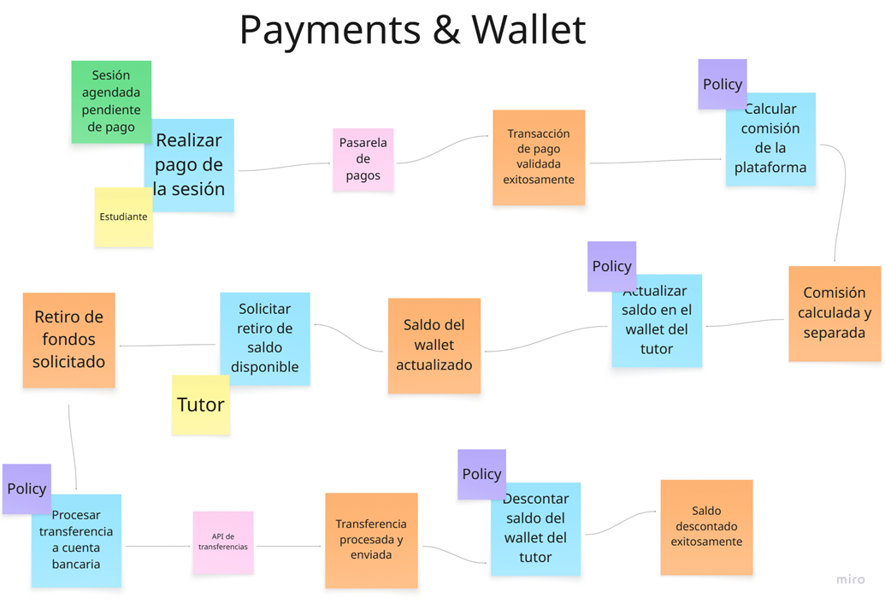
  <br>
  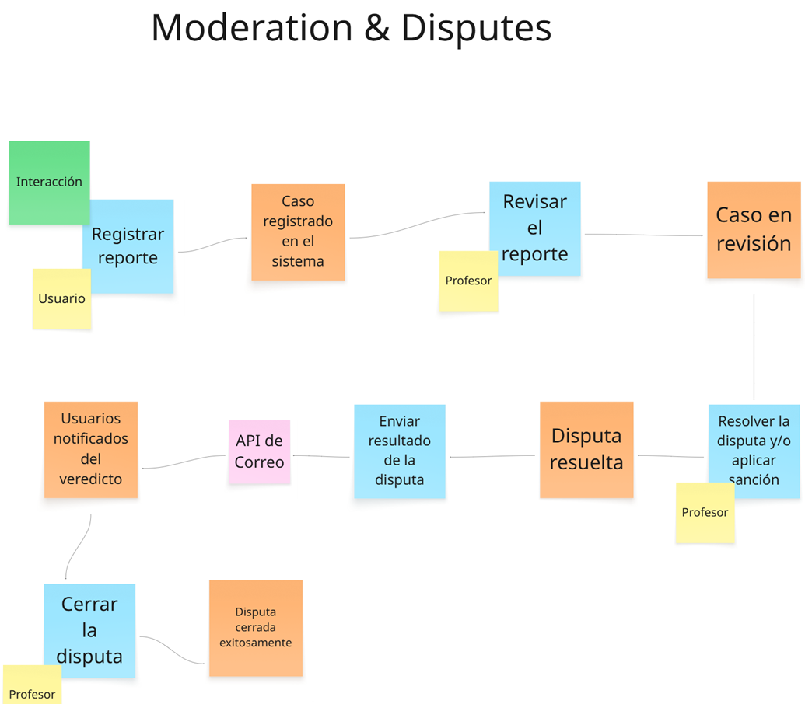
  <br>
  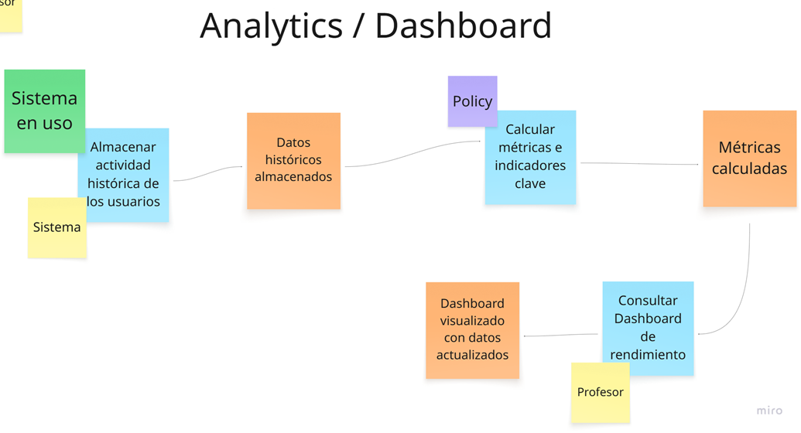
  <br>
  <em>Figura 23. Big Picture EventStorming: Etapa 3 - Elaboración propia. Nota: Se identifican los Agregados (notas amarillas grandes) que protegen las reglas de negocio y se agrupan los eventos en sus respectivos Contextos Delimitados (Bounded Contexts).</em>
</p>

---

## 2.5. Ubiquitous Language

| N° | Palabra técnica | Significado |
| :---: | :--- | :--- |
| 1 | **Usuario** | Persona registrada en Innovify, que puede asumir el rol de Estudiante Aprendiz, Estudiante Tutor o Profesor Universitario, interactuando con la plataforma según su nivel de acceso institucional. |
| 2 | **WebRTC Token** | Credencial de seguridad generada dinámicamente (WebrtcToken) que autoriza la conexión peer-to-peer cifrada para la transmisión de audio y video en tiempo real durante una sesión activa. |
| 3 | **Stripe Transaction** | Identificador de pasarela de pagos que vincula el modelo de dominio interno (Donation) con el procesamiento financiero externo, asegurando la trazabilidad de los fondos. |
| 4 | **Session** | Espacio de tiempo programado en la plataforma donde un Aprendiz y un Tutor se conectan para repasar los temas de un curso específico. |
| 5 | **Dashboard** | Panel analítico que procesa los resultados de los quizzes y las sesiones. |
| 6 | **Assessment** | Evaluación estandarizada creada por un Profesor Universitario. |
| 7 | **Wallet** | Registro financiero interno del sistema donde se acumulan los fondos netos. |
| 8 | **Commission Fee** | Porcentaje (5%) deducido automáticamente por el sistema de cada donación voluntaria antes de sumar el monto final a la billetera. |
| 9 | **Dispute** | Reporte formal generado por un usuario ante inasistencias, mala conducta o enseñanza de información errónea durante una tutoría, el cual queda en estado pendiente hasta ser resuelto por un Profesor. |
| 10 | **Universidad Afiliada** | Institución educativa superior con una alianza con Innovify, cuyo dominio de correo (.edu.pe) sirve para validar y agrupar a los usuarios de su comunidad académica. |

# Capítulo III: Requirements Specification

## 3.1. User Stories


*(Nota: En la gestión ágil, mantener una jerarquía clara donde las Épicas grandes se desglosan en Historias de Usuario específicas es fundamental para organizar el flujo de trabajo del equipo de desarrollo).*

### Epics

| Epic ID | Title | Description | Acceptance Criteria | Related to (Epic ID) |
| :---: | :--- | :--- | :--- | :--- |
| **EP01** | Account & Profile Management | As a user, I want to manage my account, authentication, and profile so that I can securely access and personalize my experience. | Not applicable | Not applicable |
| **EP02** | Search & Matching | As a learner, I want to search and filter tutors so that I can find the best match for my needs. | Not applicable | Not applicable |
| **EP03** | Session Coordination & Communication | As a user, I want to coordinate tutoring sessions and communicate with others so that I can prepare effectively. | Not applicable | Not applicable |
| **EP04** | Live Session Experience | As a user, I want to join and interact in live tutoring sessions so that I can learn in real time. | Not applicable | Not applicable |
| **EP05** | Academic Quality Assurance | As a professor or tutor, I want to create and manage quizzes so that learning quality is validated. | Not applicable | Not applicable |
| **EP06** | Ratings & Monetization | As a user, I want to rate tutors and handle payments so that value exchange is fair and transparent. | Not applicable | Not applicable |
| **EP07** | Analytics & Moderation | As a professor, I want dashboards and moderation tools so that I can ensure platform quality. | Not applicable | Not applicable |
| **EP08** | Backend API & Integrations | As a developer, I want to integrate external services and APIs so that the system is scalable and secure. | Not applicable | Not applicable |
| **EP09** | User Experience & Landing | As a visitor, I want an engaging and informative interface so that I understand the platform before registering. | Not applicable | Not applicable |


### User Stories

| User Story ID | Title | Description | Acceptance Criteria | Related to (Epic ID) |
| :---: | :--- | :--- | :--- | :---: |
| **US01** | Register with Institutional Email | As a user, I want to register using my institutional email so that the platform ensures a secure academic environment. | **Scenario:** Successful registration<br>**Given** I am on the registration page<br>**When** I enter a valid .edu.pe email and password<br>**Then** the system creates my account and sends a confirmation email<br><br>**Scenario:** Invalid email<br>**Given** I enter a non-institutional email<br>**When** I submit the form<br>**Then** the system rejects it and shows an error | EP01 |
| **US02** | Login with Role-Based Access | As a user, I want to log in securely so that I can access features based on my role. | **Scenario:** Student login<br>**Given** I am a student<br>**When** I log in<br>**Then** I access the student dashboard<br><br>**Scenario:** Teacher login<br>**Given** I am a teacher<br>**When** I log in<br>**Then** I access the analytics dashboard | EP01 |
| **US03** | Configure Profile | As a tutor, I want to configure my profile so that learners can find me easily. | **Scenario:** Update profile<br>**Given** I am in my profile<br>**When** I add skills and save<br>**Then** my profile is updated and visible in search | EP01 |
| **US04** | Verified Badge | As a user, I want to see verified users so that I trust the platform. | **Scenario:** Verified user<br>**Given** a user has confirmed email<br>**When** I view their profile<br>**Then** I see a verified badge | EP01 |
| **US34** | Manage Availability | As a tutor, I want to manage my availability so that I control when I receive requests. | **Scenario:** Set availability<br>**Given** I configure time slots<br>**When** I save<br>**Then** learners can only book those times | EP01 |
| **US39** | Password Recovery | As a user, I want to recover my password so that I regain access. | **Scenario:** Recovery email<br>**Given** I forgot my password<br>**When** I request recovery<br>**Then** I receive a reset link | EP01 |
| **US05** | Search Tutors | As a learner, I want to search tutors so that I find help. | **Scenario:** Search<br>**Given** I type "Physics"<br>**When** I search<br>**Then** I see tutors related to that subject | EP02 |
| **US06** | Filter Results | As a learner, I want to filter tutors so that I find the best option. | **Scenario:** Apply filter<br>**Given** search results<br>**When** I filter by rating<br>**Then** results update accordingly | EP02 |
| **US07** | View Tutor Profile | As a learner, I want to view profiles so that I evaluate tutors. | **Scenario:** View profile<br>**Given** I select a tutor<br>**When** I open profile<br>**Then** I see details and reviews | EP02 |
| **US08** | Send Tutoring Request | As a learner, I want to request sessions so that I schedule tutoring. | **Scenario:** Send request<br>**Given** tutor profile<br>**When** I send request<br>**Then** status becomes "Pending" | EP03 |
| **US09** | Accept or Reject Requests | As a tutor, I want to manage requests so that I control my schedule. | **Scenario:** Accept request<br>**Given** a request<br>**When** I accept<br>**Then** it becomes "Scheduled" | EP03 |
| **US10** | Internal Chat | As a user, I want chat so that I coordinate sessions. | **Scenario:** Send message<br>**Given** chat open<br>**When** I send message<br>**Then** other user receives it | EP03 |
| **US11** | Share Files | As a user, I want to share files so that I exchange materials. | **Scenario:** Upload file<br>**Given** chat open<br>**When** I upload PDF<br>**Then** other user can download it | EP03 |
| **US12** | Join Video Call | As a user, I want to join calls so that I attend sessions. | **Scenario:** Join call<br>**Given** session time<br>**When** I click start<br>**Then** I connect to video call | EP04 |
| **US13** | Share Screen | As a user, I want to share my screen so that I explain content. | **Scenario:** Share screen<br>**Given** active call<br>**When** I click share<br>**Then** my screen is visible | EP04 |
| **US14** | Create Quiz | As a professor, I want to create quizzes so that learning is standardized. | **Scenario:** Create quiz<br>**Given** professor panel<br>**When** I publish quiz<br>**Then** it is available | EP05 |
| **US15** | Send Quiz | As a tutor, I want to send quizzes so that I evaluate learners. | **Scenario:** Send quiz<br>**Given** chat<br>**When** I assign quiz<br>**Then** learner receives it | EP05 |
| **US16** | Solve Quiz | As a learner, I want to solve quizzes so that I validate knowledge. | **Scenario:** Submit quiz<br>**Given** quiz open<br>**When** I submit answers<br>**Then** system grades it | EP05 |
| **US17** | Rate Tutor | As a learner, I want to rate tutors so that I share feedback. | **Scenario:** Submit rating<br>**Given** session ended<br>**When** I rate<br>**Then** review is saved | EP06 |
| **US18** | Make Donation | As a learner, I want to donate so that I reward tutors. | **Scenario:** Payment success<br>**Given** payment form<br>**When** I pay<br>**Then** transaction is processed | EP06 |
| **US19** | View Wallet | As a tutor, I want to see earnings so that I track income. | **Scenario:** View balance<br>**Given** wallet page<br>**When** I open it<br>**Then** I see balance and history | EP06 |
| **US20** | Register Bank Account | As a tutor, I want to add bank account so that I withdraw funds. | **Scenario:** Save account<br>**Given** form<br>**When** I submit<br>**Then** account is saved | EP06 |
| **US21** | Cancel Reservation | As a learner, I want to cancel sessions so that I handle conflicts. | **Scenario:** Cancel<br>**Given** a session<br>**When** I cancel<br>**Then** status becomes "Cancelled" | EP06 |
| **US22** | Teacher Dashboard | As a teacher, I want a dashboard so that I manage platform data. | **Scenario:** View dashboard<br>**Given** login<br>**When** I access panel<br>**Then** I see tools and metrics | EP07 |
| **US23** | View Analytics | As a teacher, I want analytics so that I detect trends. | **Scenario:** View chart<br>**Given** dashboard<br>**When** data loads<br>**Then** I see top courses | EP07 |
| **US24** | Report User | As a user, I want to report issues so that platform stays safe. | **Scenario:** Report<br>**Given** issue<br>**When** I submit report<br>**Then** ticket is created | EP07 |
| **US25** | Resolve Disputes | As a teacher, I want to resolve disputes so that quality is ensured. | **Scenario:** Resolve case<br>**Given** a report<br>**When** I review<br>**Then** I close it | EP07 |
| **US26** | Validate Email API | As a developer, I want email validation so that registration is secure. | **Scenario:** Valid request<br>**Given** API call<br>**When** valid email<br>**Then** JWT is generated | EP08 |
| **US27** | Payment Integration | As a developer, I want payment API so that transactions are processed. | **Scenario:** Payment success<br>**Given** payment request<br>**When** API responds success<br>**Then** transaction is stored | EP08 |
| **US28** | WebRTC Token | As a developer, I want tokens so that video calls are secure. | **Scenario:** Generate token<br>**Given** valid request<br>**When** verified<br>**Then** token is returned | EP08 |
| **US29** | File Storage API | As a developer, I want storage integration so that files are handled. | **Scenario:** Upload file<br>**Given** valid file<br>**When** uploaded<br>**Then** URL is stored | EP08 |
| **US30** | Analytics Endpoint | As a developer, I want analytics API so that dashboards work. | **Scenario:** Get data<br>**Given** teacher request<br>**When** query runs<br>**Then** JSON is returned | EP08 |
| **US31** | Landing Page | As a visitor, I want to see platform info so that I understand it. | **Scenario:** View landing<br>**Given** homepage<br>**When** I open it<br>**Then** I see benefits and sections | EP09 |
| **US32** | About Page | As a user, I want to see company info so that I trust it. | **Scenario:** View about<br>**Given** navigation<br>**When** I click<br>**Then** I see mission and team | EP09 |
| **US33** | UI Animations | As a user, I want animations so that UI feels interactive. | **Scenario:** Hover effect<br>**Given** UI<br>**When** I hover<br>**Then** elements animate | EP09 |
| **US35** | Language Switch | As a user, I want language toggle so that I understand content. | **Scenario:** Change language<br>**Given** page<br>**When** I switch<br>**Then** content updates | EP09 |
| **US36** | Partnerships Section | As a user, I want to see partners so that I trust platform. | **Scenario:** View partners<br>**Given** section<br>**When** I scroll<br>**Then** I see logos | EP09 |
| **US37** | About + Innovation | As a user, I want to see vision and tech so that I trust future. | **Scenario:** View innovation<br>**Given** section<br>**When** I read<br>**Then** I understand roadmap | EP09 |
| **US38** | Solutions Section | As a user, I want to see features so that I understand value. | **Scenario:** View features<br>**Given** section<br>**When** I explore<br>**Then** I see platform capabilities | EP09 |


## 3.1. Impact Mapping

En esta sección se expone el Impact Mapping del proyecto, una técnica que conecta los objetivos de negocio con las funcionalidades a desarrollar. El proceso inició con la definición de los Business Goals bajo criterios SMART, seguido de la identificación de los Actores (User Personas) que influyen en su cumplimiento. Para cada actor se establecieron los Impacts esperados en su comportamiento y, a partir de ellos, se listaron los Deliverables que podrían generarlos. Finalmente, cada deliverable se vinculó con User Stories concretas que lo hacen tangible.

<p align="center">
  
  <br>
  <em>Figura 27. Impact Mapping - Elaboración propia. Nota: Este mapa visualiza cómo alcanzar el objetivo inicial (registrar 300 estudiantes), conectando los perfiles (Personas) con cambios de comportamiento (Impacts) y funcionalidades (Deliverables).</em>
</p>

<p align="center">
  
  <br>
  <em>Figura 28. Impact Mapping - Elaboración propia. Nota: Este mapa se enfoca en lograr 200 tutorías exitosas con alta calificación, detallando cómo la búsqueda, comunicación y calificación aseguran un ciclo de alta calidad.</em>
</p>

<p align="center">
  
  <br>
  <em>Figura 29. Impact Mapping - Elaboración propia. Nota: Esta figura muestra el mapa centrado en la retención y participación activa, explicando cómo funcionalidades como el dashboard y el reconocimiento buscan que los usuarios regresen.</em>
</p>

---

## 3.2. Product Backlog

| Orden | US ID | Description | Story Points |
| :---: | :---: | :--- | :---: |
| 1 | **US01** | Como usuario, quiero registrarme en la plataforma usando exclusivamente mi correo institucional (`.edu.pe`), para garantizar la seguridad del ecosistema y automatizar mi validación. | 3 |
| 2 | **US02** | Como usuario, quiero iniciar sesión de forma segura para acceder al panel principal y a las herramientas específicas correspondientes a mi rol (Estudiante o Profesor). | 3 |
| 3 | **US03** | Como Estudiante Tutor, quiero configurar mi perfil agregando mi biografía, universidad y los cursos que domino, para que los aprendices puedan encontrarme fácilmente. | 3 |
| 4 | **US04** | Como estudiante, quiero ver un sello o ícono de "Verificado" en los perfiles para sentirme seguro de que el usuario pertenece a una universidad real. | 2 |
| 5 | **US05** | Como Estudiante Aprendiz, quiero utilizar un motor de búsqueda por palabras clave para encontrar tutores que dominen el tema específico en el que necesito ayuda. | 5 |
| 6 | **US06** | Como Aprendiz, quiero aplicar filtros (como reputación de estrellas o universidad) a mi búsqueda para encontrar al tutor que mejor se adapte a mis preferencias. | 3 |
| 7 | **US07** | Como Aprendiz, quiero ver el perfil detallado de un tutor antes de enviarle una solicitud, para revisar su biografía, insignias y comentarios de otros alumnos. | 2 |
| 8 | **US08** | Como Aprendiz, quiero seleccionar una fecha/hora disponible en el perfil del tutor y enviarle una solicitud de reserva indicando el tema a tratar. | 3 |
| 9 | **US09** | Como Estudiante Tutor, quiero recibir las solicitudes entrantes y tener la opción de aceptarlas o rechazarlas para gestionar mi tiempo adecuadamente. | 2 |
| 10 | **US10** | Como usuario (Aprendiz/Tutor), quiero acceder a un chat interno privado antes y después de la sesión para coordinar detalles y compartir dudas sin usar mi WhatsApp personal. | 5 |
| 11 | **US11** | Como usuario, quiero poder adjuntar archivos en el chat de la reserva para enviar mis ejercicios resueltos o el material de estudio que revisaremos en la videollamada. | 5 |
| 12 | **US12** | Como usuario, quiero unirme a la videollamada incrustada en la plataforma a la hora agendada para iniciar la clase sin depender de enlaces sueltos de Zoom o Meet. | 8 |
| 13 | **US13** | Como usuario, quiero poder compartir la pantalla de mi computadora utilizando las herramientas de la videollamada, para mostrar código o ejercicios en tiempo real a mi compañero. | 5 |
| 14 | **US14** | Como Profesor Universitario, quiero crear un Quiz de opción múltiple y guardarlo en el Banco Oficial, para estandarizar el material con el que los tutores evalúan a los alumnos. | 5 |
| 15 | **US15** | Como Estudiante Tutor, quiero seleccionar un Quiz del Banco Oficial y enviárselo a mi aprendiz por el chat para evaluar su aprendizaje al final de la sesión. | 3 |
| 16 | **US16** | Como Estudiante Aprendiz, quiero responder el Quiz interactivo que me envió el tutor para validar mis conocimientos y obtener mi nota automáticamente. | 5 |
| 17 | **US17** | Como Aprendiz, quiero calificar al tutor de 1 a 5 estrellas y dejar un comentario al finalizar la sesión para valorar su ayuda y construir su reputación pública. | 3 |
| 18 | **US18** | Como Aprendiz, quiero realizar una donación voluntaria utilizando mi tarjeta a través de una pasarela segura para recompensar económicamente al tutor. | 5 |
| 19 | **US19** | Como Estudiante Tutor, quiero visualizar mi Billetera Virtual para ver el saldo total de mis donaciones acumuladas, visualizando el descuento automático por comisión de la plataforma. | 3 |
| 20 | **US20** | Como Estudiante Tutor, quiero registrar los datos de mi cuenta bancaria (CCI) externa de forma segura para solicitar el retiro del dinero recaudado en mis tutorías. | 3 |
| 21 | **US21** | Como Aprendiz, quiero cancelar una solicitud de reserva antes de que inicie en caso de tener un imprevisto, liberando el horario del tutor. | 2 |
| 22 | **US22** | Como Profesor Universitario, quiero ver un panel principal organizado al ingresar a la plataforma, para navegar fácilmente entre el Banco de Quizzes y las analíticas. | 3 |
| 23 | **US23** | Como Profesor Universitario, quiero visualizar el "Termómetro Académico" con gráficos sobre los cursos más solicitados para tutorías, identificando así deficiencias tempranas. | 5 |
| 24 | **US24** | Como usuario (Aprendiz/Tutor), quiero poder reportar a mi contraparte en caso de ausentismo o contenido inapropiado, para mantener la integridad de la plataforma. | 3 |
| 25 | **US25** | Como Profesor Universitario, quiero revisar los reportes y disputas académicas (ej. enseñar mal un concepto) para emitir un veredicto y asegurar la calidad del ecosistema. | 3 |
| 26 | **US26** | Como Developer, quiero implementar un endpoint en C# que valide automáticamente el dominio `.edu.pe` mediante expresiones regulares y envíe un token JWT por email (vía SendGrid). | 5 |
| 27 | **US27** | Como Developer, quiero integrar la API de una pasarela de pagos (ej. Stripe) para procesar las donaciones con tarjeta y calcular en el backend la retención del 5% de comisión. | 5 |
| 28 | **US28** | Como Developer, quiero consumir la API de WebRTC (ej. Agora.io) generando tokens de acceso temporales desde el backend para incrustar la videollamada de forma segura. | 8 |
| 29 | **US29** | Como Developer, quiero integrar una API de Cloud Storage (ej. AWS S3 o Cloudinary) para gestionar la subida segura de los PDFs e imágenes que los usuarios comparten en el chat. | 5 |
| 30 | **US30** | Como Developer, quiero crear un endpoint RESTful que ejecute un query de agregación y conteo en la BD para devolver un JSON optimizado con el top de cursos, alimentando el Dashboard B2B. | 5 |
| 31 | **US31** | Como usuario quiero que los beneficios de la plataforma sea la primera pantalla que se aprecie para conocer mejor las funciones y detalles antes de registrarme. | 3 |
| 32 | **US32** | Como usuario, quiero ver la información detallada de la plataforma de la sección "sobre nosotros" para generar confianza y entender el propósito de la empresa antes de registrarme. | 2 |
| 33 | **US33** | Como estudiante, quiero que la interfaz tenga animaciones sutiles y micro interacciones, como un botón que cambia de color al pasar el cursor, para que la experiencia se sienta pulida. | 2 |
| 34 | **US34** | Como Estudiante Tutor, quiero configurar mis horarios en un calendario interactivo y gestionar mi estado general (Disponible/No Disponible) para recibir solicitudes de reserva. | 5 |
| 35 | **US35** | Como visitante del sitio web, quiero poder cambiar el idioma de la interfaz entre español e inglés mediante un selector, para comprender la propuesta de valor de Innovify en mi idioma. | 3 |
| 36 | **US36** | Como usuario, quiero ver la sección de "Alianzas" con las universidades afiliadas y un formulario de contacto, para comprobar el respaldo institucional y solicitar información. | 3 |
| 37 | **US37** | Como usuario, quiero leer la misión, visión, conocer al equipo desarrollador e informarme sobre la proyección de sensores IoT, para confiar en la solidez y visión a futuro de Innovify. | 2 |
| 38 | **US38** | Como usuario, quiero ver un resumen interactivo de las "Soluciones" tecnológicas que ofrece la plataforma, para entender cómo resolverá mis problemas académicos antes de registrarme. | 3 |

*(Tabla 11. Product Backlog - SkillSwap. Nota: Esta tabla presenta el Product Backlog completo del proyecto, priorizado según orden de implementación. La columna 'Story Points' asigna una estimación del esfuerzo relativo).*

# Capítulo IV: Product UX/UI Design

## 4.1. Style Guidelines

El diseño gráfico de la plataforma Innovify (SkillSwap) fue definido por el equipo mediante la aplicación de distintas estrategias orientadas a garantizar una estética coherente, una interfaz intuitiva y una experiencia visual agradable para nuestros futuros usuarios. El diseño de nuestro logotipo busca encapsular los conceptos de conexión, conocimiento y colaboración, que son los pilares de la plataforma. 

Para la paleta de colores, se ha elegido un azul principal que transmite confianza, profesionalismo y seguridad, elementos cruciales para un entorno de intercambio académico verificado. Este se complementa con un color de acento amarillo que evoca conocimiento, éxito y energía, motivando a los estudiantes en su proceso de aprendizaje y enseñanza, y el blanco, que aporta claridad, modernidad y un espacio limpio que mejora la legibilidad y la sensación de amplitud en la interfaz. La combinación de estos elementos busca proyectar una imagen moderna, seria, pero a la vez accesible y motivadora, alineada con la visión de crear la red de apoyo estudiantil interuniversitaria líder en el Perú.

### 4.1.1. General Style Guidelines

Aquí se sientan las bases de la identidad visual y verbal de la plataforma, asegurando consistencia en todas las pantallas. Nos hemos basado en principios de diseño inclusivo para garantizar que el producto sea utilizable por la mayor cantidad de personas posible.

* **Branding:** El logo debe representar la conexión y el intercambio de conocimiento. Se propone un diseño que combine dos elementos: nodos interconectados (simbolizando la red entre universidades) que a su vez forman la silueta de un libro abierto o una bombilla (representando el conocimiento y las ideas). Este concepto visual refuerza la propuesta de valor central: ser un puente que conecta el talento estudiantil.

<p align="center">
  
  <br>
  <em>Figura 30. Logo Innovify.</em>
</p>

* **Typography:** Se propone utilizar la familia tipográfica **Inter**, una fuente *sans-serif* versátil y moderna, diseñada específicamente para la legibilidad en pantallas. Su claridad y neutralidad la hacen ideal para un entorno académico y digital.
  * **Escala Base:** 16px
  * **Interlineado:** 1.5
  * **Weights (Pesos):** Regular, Medium, Semi-Bold, Bold.

* **Nomenclatura Tipográfica (NOMBRE / TAMAÑO / PESO):**
  * **Heading 1:** 32px / Bold (Títulos de página principal)
  * **Heading 2:** 24px / Semi-Bold (Títulos de sección)
  * **Heading 3:** 20px / Semi-Bold (Subtítulos o títulos de tarjetas)
  * **Base:** 16px / Regular (Párrafos y texto principal)
  * **Label:** 14px / Medium (Etiquetas de botones y campos de formulario)

* **Colors:** La paleta de colores está pensada para transmitir confianza, motivación y accesibilidad.
  * **Azul Primario (#005A9C):** Refuerza la sensación de estabilidad y seguridad (botones principales).
  * **Amarillo de Acento (#FFC107):** Aporta energía y dinamismo (llamadas a la acción secundarias).
  * **Gris Claro (#F5F7FA):** Proporciona limpieza visual (fondos).
  * **Gris Oscuro (#212529):** Asegura legibilidad óptima (textos).
  * **Semántica:** Verde de éxito (#28A745) y rojo de error (#DC3545) para estados del sistema.

* **Spacing:** La unidad base de **8px** establece un ritmo visual que facilita la comprensión.
  * **8px:** Entre íconos y texto.
  * **16px:** Entre párrafos y elementos de lista.
  * **24px:** Relleno interno en contenedores y tarjetas.
  * **32px:** Separación entre secciones principales.
  * **48px:** Márgenes superiores e inferiores de la página.

* **Tono de Comunicación y Lenguaje Aplicado:** El tono debe ser Respetuoso, Entusiasta y Formal-Casual. Buscamos un equilibrio que proyecte profesionalismo y confianza, pero que a la vez sea cercano para los estudiantes.
  * **Tono:** Serio y confiable pero empático. Evitando lenguaje alarmista o demasiado corporativo.
  * **Lenguaje:** Claro y sencillo. Se evitarán tecnicismos innecesarios (ej: *"Conecta con un tutor"*, *"Juntos aprendemos más"*).

---

### 4.1.2. Web Style Guidelines

Elegimos estos colores porque buscábamos transmitir confianza, motivación y accesibilidad. El azul simboliza estabilidad, siendo el color predominante. El amarillo aporta energía destacando acciones importantes. Para reforzar la comunicación del sistema, empleamos el verde como indicador de éxito y el rojo para errores.

<p align="center">
  
  <br>
  <em>Figura 31. Landing page - Página inicio. Nota: Esta figura muestra el diseño de la pantalla principal o dashboard que ve el usuario al iniciar sesión.</em>
</p>

<p align="center">
  
  <br>
  <em>Figura 32. Paleta de colores. Nota: Combinación del azul (confianza) y amarillo (energía).</em>
</p>

* **Responsive Design Standards (Mobile-first):**
  * **Mobile (hasta 768px):** Diseño de una sola columna. Menú hamburguesa. Botones grandes para uso táctil.
  * **Tablet (769px - 1024px):** Layout de hasta dos columnas. Menú lateral colapsable.
  * **Desktop (1025px+):** Espacio disponible con layouts de dos o tres columnas. Navegación principal siempre visible.
* **Interactivity:**
  * **Botones:** Bordes redondeados (`border-radius: 8px`). Hover con ligera sombra o cambio de tono.
  * **Transiciones:** Animaciones sutiles y rápidas (200-300ms).
* **Accessibility:**
  * Etiquetas (`<label>`) claras en formularios.
  * Imágenes con texto alternativo (`alt`).
  * Navegación completa mediante teclado (Tab, Enter).
  * Contraste de color según pautas WCAG 2.1.

---

### 4.1.3. Mobile Style Guidelines

Aquí se ilustran los estándares visuales para la aplicación móvil, considerando las particularidades de iOS y Android para ofrecer una experiencia nativa y familiar.

#### 4.1.3.1. iOS Mobile Style Guidelines

* **Colores:** Se emplea la paleta general para respetar los lineamientos de la marca.

<p align="center">
  
  <br>
  <em>Figura 33. Paleta de colores - iOS Mobile.</em>
</p>

* **Tipografía:** Se seguirán los General Style Guidelines (Inter).

<p align="center">
  
  <br>
  <em>Figura 34. Tipografía iOS Mobile. Nota: Jerarquía tipográfica asegurando consistencia visual.</em>
</p>

* **Componentes:** Se adoptarán los patrones de diseño propios de iOS (barras de pestañas inferiores, transiciones de derecha a izquierda).

<p align="center">
  
  <br>
  <em>Figura 35. Campos de texto iOS Mobile.</em>
</p>

<p align="center">
  
  <br>
  <em>Figura 36. Botones iOS Mobile. Nota: Guía de estilos con jerarquías visuales (primarios, secundarios, iconográficos).</em>
</p>

<p align="center">
  
  <br>
  <em>Figura 37. Pickers y Alertas iOS Mobile. Nota: Uso de componentes nativos de iOS para selectores y notificaciones.</em>
</p>

<p align="center">
  
  <br>
  <em>Figura 38. Enlace a redes Sociales iOS Mobile.</em>
</p>

---

#### 4.1.3.2. Android Mobile Style Guidelines

* **Colores:** Para la aplicación en dispositivos Android, se emplea la misma paleta de colores.

<p align="center">
  
  <br>
  <em>Figura 39. Paleta de colores Android Mobile.</em>
</p>

* **Tipografía:** Se aplicará la jerarquía de la fuente Inter para asegurar legibilidad en el ecosistema Android.

<p align="center">
  
  <br>
  <em>Figura 40. Tipografía Android Mobile.</em>
</p>

* **Componentes:** Se adoptarán los patrones de diseño nativos de Material Design / Android.

<p align="center">
  
  <br>
  <em>Figura 41. Campos de texto Android Mobile.</em>
</p>

<p align="center">
  
  <br>
  <em>Figura 42. Botones Android Mobile.</em>
</p>

<p align="center">
  
  <br>
  <em>Figura 43. Pickers y Alertas Android Mobile.</em>
</p>

<p align="center">
  
  <br>
  <em>Figura 44. Enlace a Redes sociales Android Mobile.</em>
</p>

## 4.2. Information Architecture

En esta sección se plantean las decisiones y el sustento que dirigen la manera como se organizará el contenido en las experiencias web y móvil de SkillSwap (Innovify). Las propuestas están orientadas a que los usuarios se adapten con facilidad a la funcionalidad del producto y puedan encontrar todo aquello que necesiten sin esfuerzo, reduciendo la carga cognitiva y optimizando el cumplimiento de sus objetivos. A continuación, se detallan las decisiones sobre los Organization Systems, Labeling Systems, Searching Systems y Navigation Systems.

### 4.2.1. Organization Systems

Para estructurar la información de manera intuitiva, la plataforma combinará múltiples sistemas de organización. La **organización jerárquica** será el sistema principal para presentar la información dentro de cada pantalla. Los procesos clave, como el registro o la solicitud de una tutoría, seguirán una **organización secuencial**, guiando al usuario paso a paso.

El esquema principal de categorización será por **tópicos** (materias o habilidades). Se usará un **esquema cronológico** para historiales y sesiones programadas. Fundamentalmente, toda la arquitectura se basa en un **esquema según audiencia**, dividiendo la experiencia en tres flujos distintos, como se muestra en los siguientes diagramas.

* **Estudiante-Aprendiz:** El viaje comienza al iniciar sesión en su Dashboard. Su acción principal es usar la búsqueda para encontrar un Tópico. La plataforma le presenta una Lista de Resultados con tutores, permitiéndole explorar el Perfil Detallado. Si le convence, inicia la Solicitud de Tutoría. El flujo culmina en la coordinación a través de un Chat Interno una vez que el tutor acepta, asegurando un proceso estructurado de principio a fin.

<p align="center">
  
  <br>
  <em>Figura 45. Diagrama de flujo de Estudiante aprendiz. Nota: Esta figura detalla el recorrido secuencial del usuario desde el inicio de sesión hasta la coordinación final.</em>
</p>

* **Estudiante-Tutor:** El viaje se inicia de forma reactiva al recibir una notificación. En su Dashboard, consulta las solicitudes pendientes y revisa el perfil del aprendiz. Si acepta, el sistema lo dirige a un chat interno para coordinar. Tras realizar la tutoría con éxito, el tutor califica la experiencia y recibe créditos/donaciones como recompensa.

<p align="center">
  
  <br>
  <em>Figura 46. Diagrama de flujo de Estudiante tutor. Nota: Este diagrama ilustra el flujo de trabajo del tutor para revisar, aceptar, coordinar y finalizar el ciclo.</em>
</p>

* **Coordinador Institucional:** La experiencia está diseñada para la máxima eficiencia. Comienza al recibir una notificación de verificación pendiente. Para agilizar, el sistema permite seleccionar múltiples estudiantes y usar "Aprobar en Bloque". Se pide confirmación de la acción para evitar errores y la lista de pendientes se actualiza.

<p align="center">
  
  <br>
  <em>Figura 47. Diagrama de flujo de Coordinador institucional. Nota: La figura representa el flujo diseñado para ser eficiente mediante la función "Aprobar en Bloque".</em>
</p>

---

### 4.2.2. Labeling Systems

Colocamos el *labeling system* (sistema de etiquetado) en el lado izquierdo de forma desplegable para facilitar su uso. Además, ajustamos los colores y el fondo para que se alineen con la paleta representativa de la marca, asegurando un buen contraste que permita una lectura clara y cómoda.

Esta disposición mejora la experiencia del usuario, ya que le permite desplazarse fácilmente entre las diferentes opciones y navegar de manera rápida e intuitiva por la aplicación. Cada sección cuenta, además, con sus respectivos títulos para mantener una estructura organizada y coherente.

<p align="center">
  
  <br>
  <em>Figura 48. Sistema de Etiquetado en Menú de Navegación Móvil. Nota: Se emplean etiquetas claras como "Perfil", "Sesiones" y "Ajustes" para acceso intuitivo.</em>
</p>

---

### 4.2.3. SEO Tags and Meta Tags

Para asegurar el correcto posicionamiento en motores de búsqueda (SEO) y una previsualización adecuada en redes sociales, el equipo ha definido la siguiente estructura de etiquetas `<title>` y `<meta>`. La estrategia se divide entre la Landing Page y la Web Application.

#### 1. Landing Page (Sitio Web Estático Público)
El objetivo es captar tráfico orgánico de estudiantes y de instituciones interesadas en el modelo B2B.

**Página Principal**
```html
<title>Innovify | La Red de Tutorías Universitarias Más Segura del Perú</title>
<meta name="description" content="Conecta con estudiantes universitarios verificados para recibir tutorías en línea. Aprende, enseña, recibe donaciones y mejora tus notas con Innovify.">
<meta name="keywords" content="tutorías universitarias, apoyo académico, estudiantes verificados, plataforma edtech, tutorías peru, ganar dinero enseñando, innovify">
<meta name="author" content="Innovify Team">

```

### 4.2.4. Searching Systems

Para evitar que los usuarios se sientan perdidos ante el volumen de información, la plataforma ofrecerá un sistema de búsqueda robusto y diversos medios de ayuda para encontrar datos. Las decisiones buscan facilitar el descubrimiento de tutores y la gestión de la información.

| Sistema de Búsqueda | Descripción | Beneficio para el Usuario |
| :--- | :--- | :--- |
| **Búsqueda Principal por Tópicos** | Permite a los aprendices buscar tutores introduciendo el nombre de un curso o habilidad (ej. "Cálculo II") en una barra de búsqueda principal. | Ofrece un punto de partida directo y familiar para encontrar ayuda. Responde a la necesidad principal del usuario de forma inmediata. |
| **Búsqueda por Etiquetas** | Los tutores pueden añadir etiquetas específicas a sus habilidades (ej. "Figma", "React.js"). El sistema permite a los aprendices buscar directamente por estas etiquetas. | Aumenta la precisión de la búsqueda, permitiendo a los usuarios encontrar ayuda sobre una herramienta o subtema muy específico, en lugar de solo por el nombre general del curso. |
| **Acceso Rápido por Favoritos** | Los aprendices pueden marcar tutores como "favoritos" para guardarlos en una lista personal de acceso rápido. | Funciona como un sistema de recuperación personalizado. Evita que el usuario tenga que realizar una nueva búsqueda para encontrar a un tutor con el que ya tuvo una buena experiencia. |
| **Búsqueda Interna (Coordinador)** | El panel de administración incluye una barra de búsqueda para que el coordinador encuentre el perfil de un estudiante específico por su nombre o código. | Facilita la gestión y el monitoreo. Permite al coordinador auditar o revisar un caso particular de manera eficiente sin tener que navegar por largas listas. |

*(Tabla 12. Sistemas de Búsqueda de la Plataforma. Nota: Esta tabla describe los diferentes sistemas de búsqueda implementados, detallando las funcionalidades y el beneficio que cada una aporta a los distintos tipos de usuario).*

Los resultados de la búsqueda para el aprendiz se presentarán siempre en formato de tarjetas de perfil, mostrando foto, nombre, universidad y calificación, para facilitar una decisión rápida e informada.

---

### 4.2.5. Navigation Systems

La navegación principal en la plataforma se realizará a través de la opción “Home”, que dirige al usuario a la pantalla inicial donde se concentran las funciones principales: visualizar estudiantes, contactos y favoritos.

En la parte inferior, se muestran las sesiones recientes, cada una acompañada de su respectivo perfil, número de sesión, fecha exacta y foto de perfil, junto con la opción de ver más detalles de cada una.

Además, se incluye un botón para acceder al historial completo de sesiones, ordenadas desde la más reciente hasta la más antigua, y un botón de ayuda, pensado para ofrecer soporte en caso de que el usuario tenga inconvenientes con la aplicación.

---

## 4.3. Landing Page UI Design

En esta sección se elabora la propuesta de UI para el Landing Page. El diseño traduce las decisiones de arquitectura de información y los Style Guidelines previamente definidos en una experiencia visual coherente y atractiva. 

El objetivo principal del Landing Page es comunicar la propuesta de valor del startup, generar confianza en los nuevos visitantes e incentivar el registro en la plataforma, sirviendo como la principal puerta de entrada al ecosistema de colaboración interuniversitaria.

### 4.3.1. Landing Page Wireframe

#### Landing Page Desktop Web Browser Wireframe

<p align="center">
  
  <br>
  <em>Figura 51. Wireframe de la Sección Principal de la Landing Page. Nota: Este wireframe ilustra la estructura de la sección principal de la página de bienvenida. Su diseño se enfoca en comunicar la propuesta de valor de forma directa e incluye un llamado a la acción ("Call-to-Action") central para incentivar el registro de nuevos usuarios.</em>
</p>

<p align="center">
  
  <br>
  <em>Figura 52. Wireframe de la Estructura de la Landing Page. Nota: Este wireframe detalla la distribución de los elementos en la página de bienvenida. Se observa una sección principal donde se mostrarán imágenes del diseño de la plataforma final, seguida de una explicación del servicio en tres pasos y un área para mostrar las universidades afiliadas, guiando al visitante a través de la propuesta de valor.</em>
</p>

**Principios de diseño**
En el wireframe de nuestra landing page para el navegador web, se seleccionó un fondo blanco con el objetivo de generar un contraste fuerte que permita destacar los elementos superpuestos, como botones, textos e imágenes, mejorando así la legibilidad. 

Se utilizaron botones con forma de píldora y tarjetas rectangulares que se repiten a lo largo de todo el diseño, generando coherencia visual y una experiencia uniforme para el usuario. La estructura de la página se organiza en columnas dobles, centradas horizontalmente, lo que permite equilibrar texto e imagen, como se observa en la Figura 52, donde una columna presenta beneficios y la otra imágenes ilustrativas. Finalmente, los elementos relacionados se ubican próximos entre sí dentro de su columna o fila correspondiente (como en el apartado llamado “Universidades Afiliadas”), aplicando el principio de proximidad para facilitar la comprensión y navegación del contenido.

**Elementos de diseño**
En los wireframes de la landing page se destacan tres elementos de diseño clave: tamaño, espacio y figuras. Se busca implementar un estilo minimalista combinado con diseño flat, lo que se refleja en el uso de espacios amplios que crean una interfaz limpia, ligera y fácil de navegar. Esta disposición evita la sobrecarga visual y mejora la legibilidad.

Los diversos tamaños y formas de las figuras se emplean para establecer jerarquías claras, generar contraste y diferenciación. Por ejemplo, los botones como el de “Únete a la comunidad” y “Comenzar a aprender”, tienen forma de píldora y un tamaño proporcionado para que resalten del contenido plano e inviten al usuario a la acción.

**Diseño inclusivo**
La estructura bien definida, con una clara separación entre la navegación y el contenido, facilita la comprensión del layout para todos los usuarios, incluyendo aquellos que dependen de tecnologías de asistencia. El formato de tarjetas también crea un patrón predecible que mejora la accesibilidad del contenido. La alineación y el uso del espacio en blanco contribuyen a una interfaz limpia y sin sobrecarga de información.

**Arquitectura de la información**
En el wireframe de la landing page se puede observar una estructura simple y lógica, alineada con el estilo minimalista adoptado. Se incluyen únicamente los elementos esenciales, como los botones “Registrarse” e “Inicio de sesión”, cuyas funciones son claras y comprensibles para el usuario.

Esta organización reduce la sobrecarga cognitiva y mejora la experiencia del usuario, facilitando la navegación desde el primer momento. La jerarquía de la información está cuidadosamente pensada para mostrar solo lo necesario, evitando distracciones y guiando al usuario hacia la acción deseada.

---

#### Mobile Web Browser Wireframe

<p align="center">
  
  <br>
  <em>Figura 53. Wireframe de la Página Principal. Nota: Esta figura muestra la estructura de la página principal para navegadores móviles. El diseño utiliza una columna única y tarjetas modulares para organizar el contenido de forma vertical, facilitando la navegación y la lectura en pantallas pequeñas.</em>
</p>

**Principios de diseño**
En el wireframe de nuestra landing page para navegador móvil, se seleccionó un fondo blanco para lograr un alto contraste con los elementos superpuestos, como botones, textos e imágenes. Esta elección mejora la legibilidad en pantallas pequeñas y permite que cada componente visual destaque claramente.

El diseño utiliza botones con forma de píldora y tarjetas rectangulares apiladas verticalmente, lo cual aporta coherencia visual y facilita una experiencia de usuario fluida. La disposición en una sola columna responde a la interacción típica en estos dispositivos, priorizando el scroll vertical como principal forma de navegación.

En lugar de mostrar botones visibles como “Registrarse” e “Iniciar sesión”, se optó por un ícono de menú desplegable ubicado en la esquina superior derecha. Este menú centraliza las opciones de navegación, permitiendo una interfaz más limpia y enfocada en el contenido principal. Esta decisión mejora la usabilidad al reducir elementos en pantalla y ofrecer acceso intuitivo a funciones clave cuando el usuario lo necesita. La proximidad entre elementos relacionados facilita la comprensión inmediata, como en el apartado “Universidades Afiliadas”, donde las tarjetas aparecen agrupadas de forma horizontal.

**Elementos de diseño**
El estilo se mantiene minimalista y flat, con uso extensivo de espacios en blanco que ayudan a evitar la saturación visual, mejoran la navegación táctil y generan una apariencia ligera y moderna. Este enfoque garantiza una interfaz limpia y accesible, incluso en pantallas reducidas.

Los botones principales, como “Únete a la comunidad” o “Comenzar a aprender”, tienen forma de píldora, tamaño mediano y se ubican de forma centrada para facilitar su visibilidad y clicabilidad con el pulgar. Las formas simples se utilizan estratégicamente para marcar jerarquías, generar contraste y destacar llamados a la acción.

**Diseño inclusivo**
El uso de un menú desplegable ayuda a simplificar la interfaz, al mismo tiempo que mantiene accesibles las funciones de navegación para todo tipo de usuario, incluyendo aquellos que utilizan tecnologías de asistencia. La disposición de tarjetas en formato vertical establece un patrón claro y repetitivo que mejora la accesibilidad cognitiva. El espacio en blanco y la separación entre secciones contribuyen a una navegación más intuitiva y menos sobrecargada.

**Arquitectura de la información**
En el wireframe mobile del landing page, la arquitectura sigue un enfoque claro y minimalista, presentando solo los elementos esenciales en pantalla. Las opciones de navegación están agrupadas dentro de un menú hamburguesa, lo que permite mantener el diseño limpio y enfocado en el contenido principal.

Esta estructura facilita la navegación desde el primer momento, guiando al usuario a través del contenido mediante una jerarquía visual clara y bloques bien definidos. Al minimizar la cantidad de elementos visibles a la vez, se reduce la carga cognitiva y se mejora significativamente la experiencia del usuario en dispositivos móviles.

### 4.3.2. Landing Page Mock-up

#### Desktop Web Browser Mock-up

<p align="center">
  
  <br>
  <em>Figura 54. Mock-up de la Sección Principal de la Landing Page. Nota: Este mock-up muestra el diseño visual de la sección principal de la página de bienvenida. Se utiliza una imagen de fondo atractiva, la paleta de colores de la marca y una tipografía clara para comunicar la propuesta de valor y destacar el llamado a la acción principal.</em>
</p>

<p align="center">
  
  <br>
  <em>Figura 55. Mock-up del Cuerpo de la Landing Page. Nota: La figura presenta el diseño de las secciones principales de la Landing Page, donde se explica el funcionamiento del servicio ("Busca habilidades", "Pide un intercambio") y se muestra prueba social a través de los logos de las "Universidades Afiliadas".</em>
</p>

**Aplicación del Design System**
El diseño aplica consistentemente la identidad visual del proyecto. Se utiliza la paleta de colores definida, con el azul primario y el amarillo de acento en los botones de llamada a la acción ("Empezar a aprender" o “Unirse a la comunidad”), creando un contraste que guía la atención del usuario. La tipografía 'Inter' se emplea con diferentes pesos y tamaños para establecer una jerarquía visual clara, diferenciando el titular principal de los subtítulos y el cuerpo del texto.

**Principios de diseño**
En el mockup de la landing page, se observa cómo los colores amarillo y azul, definidos en la paleta de colores de los guidelines, generan un contraste visual fuerte con el fondo blanco. Esta combinación se utiliza durante todo el diseño para destacar botones, etiquetas y otros elementos interactivos, reforzando la jerarquía visual y guiando la atención del usuario hacia las acciones clave.

Además, los elementos relacionados, como las universidades afiliadas o las imágenes de la plataforma, se presentan próximos entre sí, alineados en el centro de la página o en columnas de 2 elementos. Esto responde a los principios de proximidad y alineación, que ayudan a organizar la información de forma clara, accesible y estéticamente agradable.

**Elementos de diseño**
En la versión de escritorio del mockup, los elementos de diseño como tamaño, espacio y figuras se adaptan para aprovechar mejor el espacio disponible en pantalla. El enfoque minimalista y flat se mantiene, eliminando cualquier elemento innecesario para evitar la sobrecarga visual y favorecer la experiencia del usuario.

Los botones con forma de píldora y color amarillo destacan del resto del contenido, generando un contraste visual que los convierte en puntos focales. Su tamaño y ubicación están optimizados para ser fácilmente visibles y accesibles, incluso sin interacción táctil. Además, se utilizan íconos vectoriales simples acompañados de texto explicativo en las secciones funcionales (“Busca habilidades”, “Pide un intercambio”, “Aprende y crece”), lo que permite una rápida comprensión del propósito de cada bloque. Las imágenes y logotipos se integran de forma alineada y con márgenes bien definidos, reforzando el orden visual y generando una experiencia de navegación más fluida y profesional.

**Diseño inclusivo**
El diseño de la landing page también incorpora principios de accesibilidad para asegurar que todos los usuarios, sin importar sus capacidades, puedan navegar e interactuar con la plataforma de forma eficiente. La estructura jerárquica clara, los contrastes definidos y la separación de bloques de contenido permiten una exploración intuitiva y sin esfuerzo.

La presencia permanente del menú de navegación en la parte superior, junto con el uso de etiquetas claras e íconos comprensibles, favorece la orientación. Además, el uso adecuado del espacio en blanco contribuye a reducir la carga cognitiva, facilitando la lectura por parte de usuarios con dificultades de atención, visión o comprensión.

**Arquitectura de la información**
La arquitectura de la información de la plataforma se estructura jerárquicamente, diferenciando de manera clara el sitio público (Landing Page) del área privada (Dashboard). Este enfoque permite un flujo de navegación lógico y fluido: el usuario primero explora la landing page, conoce la propuesta de valor, se registra o inicia sesión y finalmente accede a su espacio personal en el dashboard.

En cuanto a la organización del contenido, la landing page sigue una secuencia narrativa que va desde la propuesta de valor hasta las funcionalidades y la prueba social, presentando la información de manera progresiva y orientada a la acción. Por su parte, el dashboard está dividido por módulos según las tareas que el usuario desea realizar, como gestionar sesiones, ver solicitudes o encontrar tutores, lo que facilita el acceso rápido a cada función.

Las etiquetas empleadas en la interfaz son descriptivas y coherentes con las acciones que representan. Los botones de llamada a la acción, como “Empezar a aprender” o “Unirse a la comunidad”, son directos y motivan la interacción. Asimismo, las secciones de navegación, como “Mis tutores” o “Sesiones programadas”, emplean una rotulación inequívoca que refleja con precisión el contenido que el usuario encontrará.

Finalmente, la navegación está orientada a tareas concretas y combina la exploración guiada con la búsqueda directa. En la landing page, todo el recorrido está diseñado para conducir al usuario hacia el registro, mientras que en el dashboard se integran mecanismos de búsqueda y revelación progresiva, por ejemplo, las tarjetas de sesión muestran un resumen con la opción “Ver detalles”, que permiten al usuario obtener más información sin sobrecargar la interfaz. Este conjunto de decisiones arquitectónicas mejora la experiencia, reduce la carga cognitiva y mantiene al usuario enfocado en sus objetivos principales dentro de la plataforma.

> **En síntesis:** El diseño web de "Innovify" aplica eficazmente las heurísticas de Nielsen, garantizando usabilidad y consistencia a través de un diseño minimalista y estándares reconocibles. Al mismo tiempo, su arquitectura de información ofrece una estructura jerárquica clara y una navegación orientada a tareas que facilita, por un lado, la captación de nuevos usuarios y, por otro, permite a los estudiantes registrados gestionar sus intercambios de conocimiento de forma rápida, intuitiva y segura.

---

#### Mobile Web Browser Mock-up

<p align="center">
  
  <br>
  <em>Figura 56. Mock-up de la Landing Page. Nota: Este mock-up muestra la adaptación del diseño de la página de bienvenida a dispositivos móviles. La estructura se organiza en una sola columna vertical para facilitar la lectura y navegación mediante el desplazamiento, manteniendo la coherencia visual y las llamadas a la acción principales.</em>
</p>

**Principios de diseño**
En el mockup de la landing page para navegador móvil, se optó por un fondo blanco con el objetivo de lograr un alto contraste que permita destacar con claridad los elementos superpuestos como botones, imágenes e íconos. Esta elección mejora significativamente la legibilidad en dispositivos móviles, donde el espacio visual es reducido y cada componente debe ser fácilmente identificable.

El diseño organiza los elementos en una disposición vertical, acorde al comportamiento natural del usuario en este tipo de dispositivos, priorizando el desplazamiento mediante scroll. A diferencia de la versión de escritorio, se reemplazaron los botones visibles de “Registrarse” e “Iniciar sesión” por un ícono de menú desplegable (hamburguesa) ubicado en la parte superior derecha. Esta decisión permite liberar espacio en pantalla, mantener la limpieza visual de la interfaz y facilitar el acceso centralizado a las opciones de navegación.

Asimismo, se emplean tarjetas e íconos visuales para presentar funcionalidades como “Busca habilidades”, “Pide un intercambio” y “Aprende y crece”, cada una acompañada de textos breves y directos. Esta estructura facilita la comprensión rápida del contenido y mantiene la coherencia visual en todo el diseño. En la sección “Universidades Afiliadas”, los elementos se agrupan de forma cercana, aplicando el principio de proximidad para favorecer la claridad y facilitar la identificación de aliados institucionales.

**Elementos de diseño**
En este mockup móvil se destacan tres elementos de diseño esenciales: tamaño, espacio y figuras. El estilo visual es minimalista y flat, lo que se traduce en una interfaz limpia, sin elementos innecesarios, y con un uso amplio del espacio en blanco. Esta disposición mejora la experiencia de navegación, evita la saturación visual y garantiza una lectura cómoda en pantallas reducidas.

Los botones más importantes, como “Unirse a la comunidad” y “Empezar a aprender”, están diseñados con forma de píldora y en color amarillo vibrante, lo que genera contraste con el fondo blanco y dirige la atención del usuario hacia la acción deseada. Estos botones tienen un tamaño adecuado para su uso táctil, evitando errores de interacción y mejorando la usabilidad general del sitio. Las figuras e íconos empleados refuerzan el significado del texto que los acompaña y ayudan a establecer jerarquías visuales claras. 

**Diseño inclusivo**
El diseño mobile presenta una estructura sencilla y ordenada, con una separación clara entre la navegación y el contenido principal. La incorporación del menú desplegable permite que los usuarios accedan a opciones importantes sin saturar la pantalla, lo que resulta especialmente útil para quienes utilizan tecnologías de asistencia o requieren interfaces simplificadas.

El uso de íconos junto con texto mejora la accesibilidad cognitiva, permitiendo que los usuarios comprendan las funciones incluso si no están familiarizados con la plataforma. La organización predecible de los bloques de contenido y la disposición vertical de los elementos también favorecen una experiencia inclusiva. Además, el uso del espacio en blanco y la alineación adecuada contribuyen a una interfaz visualmente limpia, facilitando el enfoque para usuarios con dificultades visuales o cognitivas.

**Arquitectura de la información**
La arquitectura de la información en la versión móvil se organiza bajo un enfoque vertical y secuencial. La estructura presenta el contenido en un orden progresivo que guía al usuario de forma natural: primero se muestra la propuesta de valor junto al botón de acción principal, luego se explican las funcionalidades esenciales y finalmente se incluye la sección de prueba social con las universidades asociadas.

El contenido está distribuido en bloques que abarcan todo el ancho de la pantalla, lo que favorece una experiencia de scroll fluida. Cada bloque representa una funcionalidad concreta y está diseñado para ser comprensible de manera independiente. En cuanto a la rotulación, se emplean etiquetas breves y claras. Los botones de llamada a la acción están ubicados estratégicamente para incentivar la interacción inmediata.

La navegación está orientada a tareas y se desarrolla en un flujo descendente que actúa como un embudo informativo: el usuario avanza paso a paso hasta llegar a los CTA principales. Por último, el sistema de navegación global se concentra dentro del menú de hamburguesa, manteniendo una interfaz limpia, accesible y enfocada en la conversión.

> **En síntesis:** El diseño web desde el móvil de la plataforma aplica las heurísticas de Nielsen con un fuerte enfoque en el minimalismo, la consistencia con los estándares móviles y la prevención de errores táctiles. Su arquitectura de información, basada en una estructura secuencial y vertical, garantiza una experiencia de usuario clara y reduce la carga cognitiva.

---

#### Arquitectura de la landing page (web-mobile)

<p align="center">
  
  
  <br>
  <em>Figura 57. Arquitectura de la Landing Page. Nota: Diagrama estructural de la landing page tanto para su versión web como móvil.</em>
</p>

## 4.4. Mobile Applications UI Design

### 4.4.1. Mobile Applications Wireframes

<p align="center">
  
  <br>
  <em>Figura 59. Colección de Wireframes de la Aplicación Móvil. Nota: Esta figura presenta una colección de los wireframes principales que definen la estructura de la aplicación móvil. Se incluyen las pantallas clave del flujo del usuario, como el dashboard de inicio, la búsqueda avanzada de tutores, la vista de perfil detallado y el panel de administración del coordinador.</em>
</p>

<p align="center">
  
  <br>
  <em>Figura 60. Colección de Wireframes de la Aplicación Móvil-2. Nota: Esta figura complementa la vista estructural con wireframes adicionales. Se detallan las interfaces para funcionalidades de interacción y gestión, como el chat de conversación, el panel de notificaciones, la lista de tutores favoritos y la pantalla de calificaciones del usuario.</em>
</p>

#### Principios Fundamentales de Diseño
En el diseño se aplicaron los siguientes principios para asegurar una experiencia visualmente coherente y funcional:

* **Contraste:** Se utiliza un contraste claro entre los elementos interactivos (como los botones de acción primarios en azul) y el fondo predominantemente blanco de la aplicación. Esto dirige la atención del usuario hacia las acciones más importantes, como "Ver más" o "Enviar" en la pantalla de calificación. La tipografía también usa diferentes grosores para establecer jerarquía entre títulos y texto de cuerpo.
* **Alineación:** Se mantiene una alineación consistente a la izquierda para la mayoría de los textos y títulos, como se ve en "Tus sesiones Recientes" y en los detalles del perfil del tutor. Los elementos clave, como el logo y los botones principales, a menudo se centran para crear un equilibrio visual y un punto focal claro.
* **Repetición:** Se emplean elementos de manera consistente a lo largo de la aplicación para crear familiaridad. Por ejemplo, el diseño de las "tarjetas" se repite para las sesiones recientes y los resultados de búsqueda. La barra de navegación inferior con los íconos de "Buscar", "Sesiones" y "Perfil" es un elemento persistente que unifica la experiencia.
* **Proximidad:** Los elementos relacionados se agrupan visualmente. En la pantalla de "Perfil tutor", la información sobre el nombre, la foto y la descripción se agrupa en la parte superior, mientras que las "Habilidades" y los "Comentarios" se organizan en secciones separadas y bien definidas.

#### Sustento desde las Heurísticas de Usabilidad de Nielsen

* **Visibilidad del estado del sistema:** El sistema mantiene al usuario informado. El panel de notificaciones ("Recibió una notificación de clase") y el indicador visual en la barra de navegación que resalta la sección activa ("Buscar", "Sesiones" o "Perfil") son ejemplos claros.
* **Relación entre el sistema y el mundo real:** La aplicación utiliza un lenguaje claro y familiar, como "Tus sesiones Recientes", "Califica tu experiencia" y "Comentarios", evitando tecnicismos y facilitando la comprensión inmediata.
* **Control y libertad del usuario:** El usuario tiene control total para navegar. Cada pantalla secundaria incluye un botón para "Volver", y la barra de navegación inferior permite cambiar de contexto en cualquier momento. Funciones como "Limpiar filtro" otorgan libertad al usuario.
* **Consistencia y estándares:** Se mantiene una identidad visual coherente. Todos los botones de acción principales son azules y redondeados. El estilo de las tarjetas y la estructura de las listas se repiten en diferentes pantallas, cumpliendo con las convenciones de diseño móvil.
* **Prevención de errores:** El diseño busca minimizar errores. En la pantalla de "Solicitudes de validaciones pendientes", los botones de "Aceptar" y "Rechazar" están claramente diferenciados por color y posición, reduciendo la posibilidad de una selección accidental.
* **Reconocimiento mejor que recuerdo:** La interfaz promueve el reconocimiento. La barra de navegación inferior con íconos universales (lupa para buscar, calendario para sesiones, persona para perfil) permite identificar las funciones sin memorizar su ubicación.
* **Flexibilidad y eficiencia de uso:** La aplicación ofrece herramientas para diferentes tipos de usuarios. La pantalla principal muestra "sesiones recientes" para un acceso rápido, mientras que la "Búsqueda avanzada" con filtros permite a los usuarios experimentados acotar resultados de manera eficiente.
* **Diseño estético y minimalista:** La interfaz es limpia y se enfoca en lo esencial. Se utiliza generoso espacio en blanco para evitar la sobrecarga cognitiva. Pantallas como "Califica tu experiencia" solo muestran los elementos necesarios para esa tarea.
* **Ayudar a reconocer, diagnosticar y recuperarse de errores:** Aunque no se muestra una pantalla de error, el diseño contempla estos escenarios. Si una búsqueda no arrojara resultados, se mostraría un mensaje claro como "No se encontraron tutores", guiando al usuario para modificar su búsqueda.
* **Ayuda y documentación:** La aplicación ofrece ayuda contextual. La sección inicial "¿Tienes dudas?" es un punto de acceso directo a soporte. Además, los títulos claros de cada pantalla y las etiquetas en los íconos actúan como una forma de documentación integrada.

#### Sustento desde la Arquitectura de Información (IA)

* **Estructura jerárquica clara:** La navegación sigue un flujo lógico y predecible. Desde la pantalla principal ("Home"), el usuario puede acceder a las secciones principales, y desde allí, profundizar a niveles de detalle como el perfil de un tutor o un chat.
* **Organización del contenido:** La información está agrupada por afinidad. En el "Panel coordinador", los datos se dividen en tarjetas claras, facilitando el escaneo rápido de la información relevante.
* **Rotulación adecuada (Labeling):** Se utilizan títulos y etiquetas descriptivas que son inmediatamente comprensibles ("Solicitudes de validaciones pendientes", "Mis Favoritos").
* **Navegación orientada a tareas:** El diseño está centrado en facilitar las tareas clave del usuario. Ya sea encontrar un tutor, revisar una sesión pasada o calificar una clase, el flujo de pantallas y los botones están dispuestos para guiar hacia el objetivo.
* **Sistemas de búsqueda:** La aplicación incorpora un sistema de búsqueda robusto con una barra simple y una opción de "Búsqueda avanzada" con filtros.

> **En síntesis:** El diseño de "Innovify" aplica correctamente los principios de diseño y las heurísticas de Nielsen para garantizar una alta usabilidad, consistencia y una experiencia sin errores. Al mismo tiempo, su arquitectura de información bien definida facilita que los usuarios (estudiantes y coordinadores) naveguen por la aplicación y completen sus tareas de forma intuitiva, rápida y segura.

*(Nota: Todos los wireframes a detalle se pueden consultar en el prototipo funcional diseñado en Figma).*
**Enlace:** https://www.figma.com/design/l6Z6APfbLoci4YMSaZkILK/Wireframes-camino-feliz?node-id=221-504&t=mcl4BJEHm24g0yCo-0 

### 4.4.2. Mobile Applications Wireflow Diagrams

#### Wireflow 1: Búsqueda y Solicitud de Tutoría
* **User Goal:** "Como estudiante que necesita ayuda, quiero encontrar un tutor verificado para un curso específico, revisar su perfil detallado y solicitarle una reserva en una fecha y hora disponible."
* **User Persona:** Estudiante que quiere aprender.
* **User Stories Implicadas:** US05 (Búsqueda por palabras clave), US07 (Visualizar perfil público del tutor), US04 (Sello de verificación institucional), US08 (Enviar solicitud de reserva al tutor).

**Explicación del Flujo:**
Este wireflow describe el "camino feliz" (*happy path*) del estudiante aprendiz, que representa el flujo de valor principal de la aplicación.
1. **Inicio (Dashboard):** El flujo comienza en el panel principal donde el usuario tiene acceso a una barra de búsqueda visible para encontrar un tema o curso.
2. **Búsqueda y Resultados:** El usuario introduce el tema (ej. "Física") y la aplicación muestra una lista de tarjetas de tutores que dominan ese tema, mostrando su foto, nombre, universidad y calificación promedio.
3. **Ver Perfil:** El usuario hace clic en un tutor para abrir su vista de perfil detallada. Aquí revisa su biografía, las últimas reseñas recibidas y el sello de "Verificado" junto a su nombre que garantiza su validación institucional.
4. **Solicitud:** El usuario presiona el botón "Solicitar Tutoría". Se abre un formulario donde selecciona una fecha y hora disponible, y escribe un mensaje inicial explicando su necesidad (ej. "Ayuda con integrales").
5. **Confirmación:** Tras enviar la solicitud, el estado de la misma queda como "Pendiente" a la espera de la respuesta del tutor.

**Representación visual:**

<p align="center">
  <em>[Espacio para la Figura 61: Wireflow de Búsqueda y Solicitud de Tutoría]</em>
  <br>
  <em>Figura 61. Wireflow de Búsqueda y Solicitud de Tutoría. Nota: Este diagrama de flujo visualiza el "camino feliz" del estudiante-aprendiz. Muestra la secuencia de pantallas desde la búsqueda de un tutor en el dashboard, pasando por la revisión de su perfil verificado, hasta el envío de una solicitud de ayuda con un mensaje.</em>
</p>

---

#### Wireflow 2: Recepción y Aceptación de Solicitud de Tutoría
* **User Goal:** "Como estudiante tutor, quiero recibir las solicitudes entrantes, revisar el mensaje del aprendiz y tener la opción de aceptarlas para iniciar automáticamente un chat de coordinación."
* **User Persona:** Estudiante Tutor.
* **User Stories Implicadas:** US09 (Aceptar o rechazar solicitud de reserva), US10 (Chat interno asincrónico de la reserva).

**Explicación del Flujo:**
1. **Notificación:** El tutor recibe una notificación en su panel informándole de una nueva solicitud de tutoría entrante.
2. **Revisión y Decisión:** La solicitud muestra el mensaje enviado por el aprendiz y presenta dos botones claros: "Aceptar" y "Rechazar".
3. **Aceptación e Inicio de Chat:** Cuando el tutor presiona "Aceptar", el estado de la solicitud cambia a "Agendada".
4. **Espacio de Trabajo:** Inmediatamente después de aceptar, el sistema crea y habilita automáticamente una sala de chat asincrónico para que ambos puedan coordinar detalles previos a la videollamada.

**Representación visual:**

<p align="center">
  <em>[Espacio para la Figura 62: Wireflow de Recepción y Aceptación de Solicitud]</em>
  <br>
  <em>Figura 62. Wireflow de Recepción y Aceptación de Solicitud. Nota: Este wireflow detalla el proceso desde la perspectiva del estudiante-tutor. El flujo comienza al recibir una notificación de una nueva solicitud, continúa con la revisión del perfil del aprendiz y finaliza con la decisión de aceptar la solicitud, lo que automáticamente inicia un chat interno.</em>
</p>

---

#### Wireflow 3: Calificación de Sesión
* **User Goal:** "Como estudiante aprendiz, después de una tutoría, quiero calificar a mi tutor para construir su reputación pública."
* **User Persona:** Estudiante Aprendiz.
* **User Stories Implicadas:** US17 (Calificar y dejar reseña al tutor).

**Explicación del Flujo:**
1. **Finalización de Sesión:** Al finalizar la videollamada, se habilita un formulario de calificación.
2. **Dejar Calificación:** El aprendiz marca una puntuación de 1 a 5 estrellas y escribe un texto con su comentario (ej. "Excelente explicación").
3. **Confirmación y Actualización:** Al enviar la reseña, esta aparece públicamente en el perfil del tutor y su promedio de estrellas se actualiza inmediatamente.

**Representación visual:**

<p align="center">
  <em>[Espacio para la Figura 64: Wireflow de Calificación de Sesión y Gestión de Favoritos]</em>
  <br>
  <em>Figura 64. Wireflow de Calificación de Sesión y Gestión de Favoritos. Nota: Este diagrama muestra el ciclo de cierre y retención para el aprendiz. Detalla los pasos para calificar a un tutor después de una sesión y la funcionalidad para marcar su perfil como "favorito", permitiendo un acceso rápido para futuras consultas.</em>
</p>

---

#### Wireflow 4: Configuración de Perfil y Habilidades del Tutor
* **User Goal:** "Como estudiante tutor, quiero configurar mi perfil agregando mi biografía, foto, universidad y gestionar mediante etiquetas los cursos que domino para aparecer en las búsquedas."
* **User Persona:** Estudiante Tutor.
* **User Stories Implicadas:** US03 (Configuración de perfil y áreas de dominio).

**Explicación del Flujo:**
1. **Acceso al Perfil:** El tutor ingresa a la sección "Mi Perfil".
2. **Datos Generales:** El tutor puede agregar o actualizar su foto, seleccionar su universidad y escribir una descripción biográfica.
3. **Añadir Habilidades:** Existe una sección de "Etiquetas" donde el tutor añade los cursos específicos que domina (ej. "Programación Web" o "Cálculo I").
4. **Gestión de Habilidades:** Desde esta misma vista, el tutor puede hacer clic en un icono de eliminar para retirar habilidades que ya no desea enseñar.
5. **Guardar Cambios:** Al guardar, el perfil se actualiza en el motor de búsqueda de la plataforma.

**Representación visual:**

<p align="center">
  <em>[Espacio para la Figura 65: Wireflow de Configuración de Perfil y Disponibilidad del Tutor]</em>
  <br>
  <em>Figura 65. Wireflow de Configuración de Perfil y Disponibilidad del Tutor. Nota: Este diagrama de flujo visualiza los pasos que sigue un tutor para configurar su perfil. Detalla la secuencia para añadir habilidades, establecer un calendario de disponibilidad y cambiar su estado para gestionar cuándo desea recibir solicitudes de tutoría.</em>
</p>

---

#### Wireflow 5: Búsqueda Avanzada con Filtros
* **User Goal:** "Como aprendiz, quiero aplicar filtros de calidad y procedencia a mi búsqueda para encontrar al tutor que mejor se adapte a mis preferencias."
* **User Persona:** Estudiante Aprendiz.
* **User Stories Implicadas:** US06 (Aplicar filtros a los resultados de búsqueda).

**Explicación del Flujo:**
1. **Búsqueda Inicial:** El flujo arranca cuando el usuario ya tiene en pantalla una lista de tutores tras buscar una materia.
2. **Abrir Filtros:** El usuario visualiza los filtros ubicados en un panel lateral en la vista de resultados.
3. **Aplicar Filtros:** El usuario configura las opciones permitidas, seleccionando una "Valoración mínima" (ej. Solo tutores con 5 estrellas) o filtrando por "Universidad".
4. **Actualizar Resultados:** Al aplicar el filtro, la lista de resultados se reduce en tiempo real mostrando únicamente a los perfiles que cumplen con los criterios de estrellas y universidad.

**Representación visual:**

<p align="center">
  <em>[Espacio para la Figura 66: Wireflow de Búsqueda Avanzada con Filtros]</em>
  <br>
  <em>Figura 66. Wireflow de Búsqueda Avanzada con Filtros. Nota: Este wireflow muestra cómo un estudiante puede refinar su búsqueda de tutores. Ilustra el proceso de aplicar filtros avanzados, como día y hora de disponibilidad, para que la lista de resultados se actualice y muestre únicamente a los candidatos que se ajustan a sus necesidades.</em>
</p>

---

#### Wireflow 6: Realización de una Sesión de Tutoría
* **User Goal:** "Como usuario, quiero unirme a la videollamada integrada a la hora agendada, compartir mi pantalla para mostrar código o ejercicios, y enviar archivos a través del chat para una explicación más efectiva."
* **User Persona:** Estudiante Aprendiz y Estudiante Tutor.
* **User Stories Implicadas:** US12 (Unirse a videollamada integrada), US13 (Compartir pantalla durante la sesión), US11 (Compartir archivos en el chat).

**Explicación del Flujo:**
1. **Inicio de la Sesión:** A la hora de la reserva, se habilita el botón "Iniciar Videollamada" en el espacio de trabajo.
2. **Interfaz de Videollamada:** Al presionarlo, se abre la sala virtual en el mismo navegador. Ambos usuarios se conectan con controles básicos: micrófono, cámara y "Finalizar".
3. **Compartir Pantalla:** Durante la explicación, un usuario presiona "Compartir Pantalla". El navegador solicita permisos y el flujo de video se reemplaza por la vista del escritorio o editor de código del usuario.
4. **Compartir Archivos:** Si un usuario necesita mostrar un documento, utiliza el chat asincrónico paralelo y el botón del clip para adjuntar un PDF o imagen (JPG/PNG, máximo 5MB). El otro usuario puede descargarlo.
5. **Finalización:** Al terminar, se finaliza la llamada y los usuarios pueden proceder con la evaluación o calificación.

**Representación visual:**

<p align="center">
  <em>[Espacio para la Figura 67: Wireflow de Realización de una Sesión de Tutoría]</em>
  <br>
  <em>Figura 67. Wireflow de Realización de una Sesión de Tutoría. Nota: La figura detalla la interacción central de la plataforma: el intercambio de conocimiento. Muestra la secuencia desde el inicio de la videollamada, el uso de herramientas colaborativas como la pizarra virtual y la carga de archivos, hasta la finalización de la sesión.</em>
</p>

---

#### Wireflow 7: Billetera Virtual y Retiro de Fondos del Tutor
* **User Goal:** "Como estudiante tutor, quiero visualizar el saldo de mis donaciones acumuladas en mi Billetera Virtual y configurar mi cuenta bancaria para solicitar retiros."
* **User Persona:** Estudiante Tutor.
* **User Stories Implicadas:** US19 (Visualizar Billetera Virtual y saldo), US20 (Registrar cuenta bancaria para retiro).

**Explicación del Flujo:**
1. **Acceso a la Billetera:** Desde su panel principal, el tutor ingresa a la pestaña "Billetera".
2. **Vista de Saldo e Historial:** El tutor visualiza el saldo total disponible a retirar. Debajo, revisa el historial de donaciones, donde puede ver el monto original donado, el descuento del 5% de comisión de la plataforma y el monto neto ingresado.
3. **Configurar Cuenta:** El tutor presiona la opción "Configurar Cuenta Bancaria".
4. **Registro de Datos:** Se abre un formulario donde ingresa el nombre de su Banco, su Número de Cuenta y su CCI. Al guardar, los datos se encriptan por seguridad.
5. **Solicitar Retiro:** Una vez guardado el CCI, se habilita el botón "Solicitar Retiro" para transferir sus fondos.

**Representación visual:**

<p align="center">
  <em>[Espacio para la Figura 68: Wireflow de Dashboard y Gestión de Reputación del Tutor]</em>
  <br>
  <em>Figura 68. Wireflow de Dashboard y Gestión de Reputación del Tutor. Nota: Este diagrama de flujo ilustra cómo el tutor interactúa con las funciones de seguimiento de la plataforma. Muestra el acceso al dashboard personal para ver estadísticas clave, consultar el historial de sesiones y revisar su reputación a través de las calificaciones recibidas.</em>
</p>

---

#### Wireflow 8: Monitoreo y Gestión de Alertas del Coordinador
* **User Goal:** "Como Profesor Universitario, quiero visualizar métricas académicas sobre los cursos más solicitados y resolver disputas reportadas para asegurar la calidad de las tutorías."
* **User Persona:** Profesor Universitario.
* **User Stories Implicadas:** US22 (Layout del panel de gestión docente), US23 (Visualizar métricas Académicas), US25 (Revisar y resolver disputas académicas), US24 (Reportar usuario por mala conducta).

**Explicación del Flujo:**
1. **Vista del Dashboard:** Al iniciar sesión, el Profesor accede a un panel organizado con un menú lateral y accesos directos.
2. **Métricas Académicas:** El profesor revisa el "Termómetro Académico", que muestra un gráfico con el Top de cursos más solicitados para tutorías. Esto le permite identificar deficiencias tempranas en los alumnos.
3. **Alertas / Disputas Pendientes:** En el módulo de "Disputas Pendientes", el profesor ve un ticket generado por un usuario (ej. por inasistencia o información errónea).
4. **Investigación y Veredicto:** El profesor abre el ticket, revisa el detalle y lee el historial del chat asincrónico del caso reportado.
5. **Resolución:** Emite un veredicto marcando el caso como "Desestimado" o aplicando una "Advertencia" al perfil del infractor, cerrando el ticket.

**Representación visual:**

<p align="center">
  <em>[Espacio para la Figura 69: Wireflow de Monitoreo y Gestión de Alertas del Coordinador]</em>
  <br>
  <em>Figura 69. Wireflow de Monitoreo y Gestión de Alertas del Coordinador. Nota: Este diagrama ilustra las herramientas de supervisión del coordinador. Muestra el flujo para visualizar el dashboard con reportes, recibir alertas sobre comportamientos inadecuados de los usuarios y gestionar la información de la plataforma.</em>
</p>

---

#### Wireflow 9: Realización de Donación Voluntaria al Tutor
* **User Goal:** "Como Aprendiz, quiero realizar una donación voluntaria utilizando mi tarjeta a través de una pasarela segura justo al momento de calificar, para recompensar económicamente a mi tutor por su ayuda."
* **User Persona:** Estudiante Aprendiz.
* **User Stories Implicadas:** US17 (Calificar y dejar reseña al tutor), US18 (Realizar donación monetaria voluntaria).

**Explicación del Flujo:**
1. **Inicio (Post-Sesión):** El flujo comienza inmediatamente después de finalizar la videollamada de tutoría, en la pantalla donde el aprendiz está dejando su calificación (de 1 a 5 estrellas) y su reseña escrita.
2. **Opción de Recompensa:** Junto al formulario de calificación, el aprendiz visualiza claramente un botón o sección con la opción "Realizar Donación".
3. **Ingreso de Datos y Monto:** Al seleccionar la opción, se despliega una interfaz integrada con la pasarela de pago. Aquí, el aprendiz ingresa el monto que desea donar (ej. S/ 15.00) y los datos de su tarjeta bancaria.
4. **Confirmación y Procesamiento:** El aprendiz confirma la operación. El sistema se comunica de forma segura con la API de pagos para procesar la transacción.
5. **Notificación de Éxito:** Una vez que el pago es exitoso, la pantalla muestra un mensaje de agradecimiento al aprendiz. Simultáneamente, el sistema notifica al tutor sobre el nuevo ingreso, el cual se verá reflejado en su Billetera.

**Representación visual:**

<p align="center">
  <em>[Espacio para la Figura 70: Wireflow de Realización de Donación]</em>
  <br>
  <em>Figura 70. Wireflow de Personalización de la Experiencia del Usuario. Nota: Este wireflow detalla cómo el usuario puede personalizar la apariencia de la aplicación. Describe la secuencia de pasos para donar al usuario.</em>
</p>

### 4.4.3. Mobile Applications Mock-ups

En esta sección se presentan los mockups, que son la evolución de alta fidelidad de los wireframes, aplicando de manera estricta la Guía de Estilos y los principios de Arquitectura de Información del proyecto. El diseño busca crear una experiencia limpia, intuitiva y confiable.

<p align="center">
  
  
  
  <br>
  <em>Figura 71. Mock-ups de Alta Fidelidad de la Aplicación Móvil. Nota: Esta figura presenta el diseño final de las pantallas clave, aplicando la paleta de colores, tipografía y componentes definidos en el Design System.</em>
</p>

#### Aplicación del Design System y Guía de Estilos

* **Paleta de Colores:** Se aplica consistentemente la paleta de colores definida. El azul primario se usa para elementos de navegación y acciones constructivas clave (botones "Registrar", "Iniciar Sesión", "Aceptar"), generando confianza y una jerarquía de acción clara. El amarillo de acento se emplea para el descubrimiento (ej. etiquetas de dominio) creando un llamado a la acción enérgico. Crucialmente, el rojo de error (`#DC3545`) se reserva para acciones destructivas, como el botón "Rechazar" en el flujo del coordinador. Se emplean también colores semánticos para la retroalimentación: verde para "Confirmado" y amarillo para "Pendiente".
* **Tipografía:** Se aplica la fuente **'Inter'** en todas las pantallas, utilizando sus diferentes pesos para establecer una jerarquía tipográfica clara. Los títulos principales son grandes y amigables (ej. "¡Hola Alexandra!"), mientras que el texto de cuerpo y las etiquetas (ej. "Correo institucional") son nítidos y legibles.
* **Componentes (Repetición y Consistencia):** El diseño se basa en componentes reutilizables, lo que crea consistencia (Heurística de Nielsen). Se observa en:
  * **Tarjetas (Cards):** Usadas para listar sesiones programadas, solicitudes y perfiles de tutores.
  * **Etiquetas (Chips):** Utilizadas para mostrar "Temas de Dominio" y "Habilidades" (ej. "Física 1", "Figma") de forma visual y compacta.
  * **Botones de Acción:** Todos los botones principales son redondeados y de color sólido, siguiendo la guía de estilos.

#### Principios de Diseño Visual y Heurísticas

* **Contraste y Minimalismo (Diseño Inclusivo):** Siguiendo la heurística de diseño estético y minimalista, la interfaz utiliza un fondo blanco o gris muy claro. Los mockups demuestran un fuerte contraste entre el texto y el fondo, tanto en el tema claro como en el oscuro. La inclusión de un **Modo Oscuro** ofrece una alternativa para reducir la fatiga visual en sesiones de estudio nocturnas, cumpliendo con principios de accesibilidad.
* **Proximidad y Alineación:** La información está agrupada lógicamente. En el "Perfil de Tutor", los datos de identidad (foto, nombre, carrera) están en un bloque superior, mientras que "Etiquetas", "Comentarios" y "Habilidades" están en bloques separados. La alineación a la izquierda de los textos y formularios crea un flujo de lectura ordenado y fácil de seguir.
* **Visibilidad del Estado del Sistema:** La interfaz mantiene al usuario informado en todos los flujos. Ejemplos claros son:
  * El estado "seleccionado" de los botones de "Tipo de Usuario" (Alumno vs. Tutor) mediante un color sólido.
  * El sello de **"Verificado"** en el perfil del tutor, un elemento prominente que genera confianza.
  * Las etiquetas de estado en el dashboard del tutor: "Confirmado" (verde) y "Pendiente" (amarillo).
  * Las marcas de verificación en la lista del coordinador, que indican visualmente las solicitudes procesadas.
* **Reconocimiento sobre Recuerdo:** El panel de chat sigue un patrón universal (burbujas de texto, área para adjuntar documentos e imágenes) que los usuarios reconocen instantáneamente, eliminando la curva de aprendizaje.

#### Arquitectura de Información

* **Etiquetado (Labeling):** El sistema de etiquetado es claro, orientado a la acción y consistente con la terminología del dominio estudiantil. Se usan términos inequívocos como "Solicitar tutoría", "Califica a tu Tutor", "Sesiones programadas" o "Añadir Calendario".
* **Sistemas de Navegación y Organización:** Los mockups demuestran una organización jerárquica y **por audiencia** (el dashboard del aprendiz es radicalmente diferente al del tutor). El usuario navega desde una pantalla general a una de detalle y luego a una acción. El uso de modales evita que el usuario pierda el contexto de la pantalla anterior, mientras que el menú de hamburguesa actúa como el sistema de navegación global.
* **Concordancia con los User Flow Diagrams:** Los mockups cubren el total de vistas necesarias para construir los flujos de usuario definidos previamente:
  * **Flujo del Aprendiz (Búsqueda):** Dashboard (para buscar) -> Perfil del Tutor (para revisar) -> Modal de Solicitud (para ejecutar la acción).
  * **Flujo del Tutor (Gestión):** Dashboard (vista de tutor) -> Pantalla de Aceptación/Rechazo de solicitudes.
  * **Flujo del Coordinador:** Lista de solicitudes pendientes (con botones de selección múltiple) -> Pantalla de detalle de un estudiante.
  * **Flujos Transversales:** Menú de "Ajustes", personalización de apariencia y la interfaz de Chat.

  ### 4.4.3. Mobile Applications User Flow Diagrams

#### User Flow 1: Enviar solicitud de tutoría
* **User Goal:** "Como estudiante que necesita ayuda, quiero encontrar un tutor verificado para un curso específico, revisar su perfil para asegurarme de que es la persona adecuada y solicitarle una sesión de forma segura y directa."
* **User Persona:** Estudiante que quiere aprender.
* **User Stories Implicadas:** US05 (Búsqueda por palabras clave), US07 (Visualizar perfil público del tutor), US04 (Sello de verificación institucional), US08 (Enviar solicitud de reserva al tutor).

**Explicación del Flujo (Happy Path):**
Este flujo describe el camino principal del estudiante aprendiz para conectar con un tutor.
1. El flujo inicia en el Mock-up del Dashboard, donde el usuario introduce un término en la barra de búsqueda (ej. "Física 1").
2. Es dirigido al Mock-up de Resultados, donde ve una lista de tutores. Toca el perfil de un tutor que le interesa.
3. Accede al Mock-up del Perfil del Tutor. Aquí revisa las reseñas, confirma que tiene el sello de "Verificado" y presiona el botón "Solicitar Ayuda".
4. Aparece un Mock-up de Modal de Solicitud, donde el usuario escribe un mensaje explicando su duda y presiona "Enviar".
5. El flujo concluye con un Mock-up de Confirmación que indica "Tu solicitud ha sido enviada".

**Representación visual:**
*(Diagrama en PDF)*

**Unhappy Paths (Rutas Alternativas):**
* **Condición (Sin Resultados):** Si el usuario busca un término y no hay tutores disponibles.

**Explicación del Flujo (Unhappy Path – Sin Resultados):**
Este flujo describe lo que ocurre cuando el estudiante ingresa un término de búsqueda demasiado específico o una materia para la cual no existen tutores disponibles en la plataforma.
1. El flujo inicia en el Mock-up del Dashboard, donde el usuario escribe un término de búsqueda que no coincide con ningún tutor registrado (ej. “Termodinámica Avanzada”).
2. Es dirigido al Mock-up de Resultados Vacíos, donde la plataforma detecta que no existen tutores que coincidan con la búsqueda realizada.
3. En esta pantalla, el estudiante observa un mensaje informativo que dice: "No busques materias muy específicas. Intenta con otra más general." Además, puede visualizar opciones como volver a intentar la búsqueda, limpiar el filtro o regresar al Dashboard.
4. El flujo concluye aquí, dado que el usuario no puede continuar hacia un perfil de tutor ni enviar una solicitud. La plataforma lo orienta a reformular su búsqueda para encontrar alternativas disponibles.

**Representación visual:**
*(Diagrama en PDF)*

---

#### User Flow 2: Recepción y Aceptación de Solicitud de Tutoría
* **User Goal:** "Como estudiante tutor, quiero ser notificado de nuevas solicitudes de ayuda, poder revisar rápidamente el perfil del aprendiz y su mensaje, y aceptar o rechazar la solicitud de forma sencilla."
* **User Persona:** Estudiante que quiere enseñar.
* **User Stories Implicadas:** US09 (Aceptar o rechazar solicitud de reserva), US10 (Chat interno asincrónico de la reserva).

**Explicación del Flujo (Happy Path):**
Este flujo detalla la interacción clave del tutor para gestionar las solicitudes entrantes.
1. El tutor recibe una notificación. Al ingresar a la aplicación, ve su Mock-up del Dashboard de Tutor con un indicador de nueva solicitud. Toca la notificación.
2. Es dirigido al Mock-up de Revisión de Solicitud, donde lee el mensaje del aprendiz y ve su perfil. Presiona el botón "Aceptar".
3. El flujo concluye al ser redirigido automáticamente al Mock-up del Chat, donde ya puede coordinar la sesión con el aprendiz.

**Representación visual:**
*(Diagrama en PDF)*

**Unhappy Path (Ruta Alternativa):**
* **Condición (Rechazar Solicitud):** Si el tutor no puede o no desea tomar la solicitud.

**Explicación del Flujo (Rechazar Solicitud):**
Este flujo describe el escenario en el que un tutor decide no aceptar la solicitud enviada por un estudiante, ya sea por falta de disponibilidad, incompatibilidad con el tema o cualquier otra razón personal o académica.
1. El flujo inicia en el Mock-up de Revisión de Solicitud, donde el tutor visualiza el mensaje enviado por el estudiante junto con los detalles de la materia y la opción para responder.
2. El tutor selecciona la opción "Rechazar", indicando que no puede asumir esa tutoría.
3. Inmediatamente aparece un Mock-up de Modal de Confirmación con el mensaje: "¿Estás seguro de que quieres rechazar esta solicitud?", para evitar rechazos accidentales.
4. El tutor confirma la acción. La plataforma registra el rechazo, descarta la solicitud y actualiza su estado.
5. El flujo concluye regresando al Mock-up del Dashboard del tutor, donde ya no aparece la solicitud pendiente.

**Representación visual:**
*(Diagrama en PDF)*

---

#### User Flow 3: Calificación de Sesión y Donación Voluntaria
* **User Goal:** "Como estudiante aprendiz, después de una tutoría, quiero calificar a mi tutor para compartir mi experiencia y poder guardarlo en una lista de 'favoritos' para contactarlo fácilmente en el futuro."
* **User Persona:** Estudiante que quiere aprender.
* **User Stories Implicadas:** US17 (Calificar y dejar reseña al tutor), US18 (Realizar donación monetaria voluntaria).

**Explicación del Flujo (Happy Path - Calificación y Favoritos):**
Este flujo muestra el cierre del ciclo de aprendizaje y la retención del usuario.
1. Al finalizar una sesión (ej. al cerrar la videollamada), la plataforma muestra automáticamente el Mock-up de Calificación.
2. El usuario selecciona 5 estrellas y escribe un comentario positivo. Presiona "Aceptar".
3. Aparece un Mock-up de Confirmación.
4. Posteriormente, el usuario navega al perfil del tutor y presiona el ícono de "Favorito".
5. El usuario puede ir a la sección "Mis Favoritos" y ver al tutor guardado en su lista.

**Representación visual:**
*(Diagrama en PDF)*

**Explicación del Flujo (Donación Voluntaria):**
Este flujo muestra el cierre del ciclo de aprendizaje, la retención del usuario mediante la retroalimentación y la monetización de la plataforma a través de la pasarela de pagos.
* **Condición:** El usuario desea dejar retroalimentación para ayudar a la reputación del tutor y cuenta con la disposición de realizar un aporte económico.
1. Al finalizar una sesión, la plataforma redirige automáticamente al usuario al Mock-up de Calificación y Donación.
2. El usuario califica y escribe un comentario positivo sobre la enseñanza.
3. En la misma pantalla, el usuario selecciona un monto predefinido o ingresa un monto personalizado y presiona el botón "Realizar Donación".
4. El sistema lo redirige al Mock-up de Pasarela de Pagos (integración con Stripe/PayPal), donde ingresa los datos de su tarjeta y confirma la transacción.
5. Aparece un Mock-up de Confirmación agradeciendo la calificación y confirmando que la donación fue procesada con éxito.

**Representación visual:**
*(Diagrama en PDF)*

## 4.5. Mobile Applications Prototyping

Esta sección presenta los prototipos de interfaz móvil para Android y iOS de la aplicación SkillSwap, con simulación de interacción y navegación. Estos prototipos se han desarrollado para demostrar visual y funcionalmente los 5 flujos de usuario (User Flows) claves definidos para las distintas personas del proyecto:

* **User Flow 1:** Búsqueda y Solicitud de Tutoría (Estudiante).
* **User Flow 2:** Recepción y Aceptación de Solicitud de Tutoría (Tutor).
* **User Flow 3:** Calificación de Sesión (Estudiante).
* **User Flow 7:** Billetera Virtual y Retiro de Fondos del Tutor.
* **Wireflow 9:** Realización de Donación Voluntaria al Tutor.

**Criterios de Interacción:** Las decisiones de diseño se basaron en dos criterios principales:
1. **Adherencia a las Guías Nativas** (Material Design de Google y Human Interface Guidelines de Apple) para garantizar una experiencia familiar y reducir la fricción.
2. **Eficiencia de tarea**, optimizando los "Happy Paths" de los flujos para que se completen con el mínimo de pasos.

**Relación con la Arquitectura de Información (IA) y User Flows:** La Arquitectura de Información define el sistema de navegación. Esto se traduce en una Tab Bar inferior en el prototipo de iOS para acceso directo a secciones clave (como "Favoritos"), mientras que en Android se opta por un Menú Lateral para agrupar estas mismas secciones, un patrón tradicional en esa plataforma.

Las interacciones grabadas en los videos de demostración siguen los pasos exactos descritos en los User Flow Diagrams, demostrando tanto los "Happy Paths" (solicitar una tutoría), como los "Unhappy Paths" (no encontrar resultados de búsqueda).

---

### 4.5.1. Android Mobile Applications Prototyping

Esta propuesta sigue las guías de Material Design de Google. Se enfoca en el uso de Cards (tarjetas) para la jerarquía visual (como en el perfil y comentarios), una paleta de color definida y componentes interactivos propios de Android.

<p align="center">
  <a href="https://youtu.be/50YTngUrCFs" target="_blank">
    
  </a>
  <br>
  <em>Video 1. Demostración del prototipo interactivo en Android (Clic en la imagen para reproducir).</em>
</p>

El video demuestra los flujos de usuario clave desde la perspectiva de Material Design. Se muestra la búsqueda de estudiante, donde al presionar "Solicitar Ayuda" se levanta un modal de Android. También se demuestra la Aceptación del Tutor, donde el tutor ve la solicitud en una tarjeta y, al "Rechazar" (Unhappy Path), aparece un mensaje de confirmación. Se destacan componentes nativos como menús desplegables para filtros y ventanas para confirmaciones.

---

### 4.5.2. iOS Mobile Applications Prototyping

Esta propuesta sigue las Human Interface Guidelines de Apple, priorizando una estética limpia y animaciones fluidas. La navegación principal se centra en una Tab Bar inferior.

<p align="center">
  <a href="https://youtu.be/57n2zvjJ5Zo" target="_blank">
    
  </a>
  <br>
  <em>Video 2. Demostración del prototipo interactivo en iOS (Clic en la imagen para reproducir).</em>
</p>

Este video demuestra los mismos flujos adaptados a iOS. Se muestra dónde el usuario navega a "Mis Favoritos" usando el menú desplegable o la interacción con los elementos. Al finalizar una sesión, se visualiza el modal de calificación y el mensaje de confirmación con la moda de iOS. También, se demuestra cómo las transiciones entre la búsqueda y los resultados son mediante deslizamiento. Se destacan componentes clave de iOS como los modales de confirmación, la tab bar del navegador Safari, los pickers de rueda (reloj) para configurar la disponibilidad y las alertas nativas para las confirmaciones.

## 4.6. Domain-Driven Software Architecture

### 4.6.1. Design-Level EventStorming


<p align="center">
  
  <br>
  <em>Figura 72. Design-Level EventStorming - Elaboración propia. Nota: Este diagrama detalla el flujo de los eventos de dominio, comandos, agregados y políticas dentro de la plataforma Innovify, mapeando la lógica de negocio a nivel de diseño de software.</em>
</p>

---

### 4.6.2. Software Architecture Context Diagram


<p align="center">
  
  <br>
  <em>Figura 73. C4 Model: Context Diagram - Elaboración propia. Nota: Diagrama de contexto que muestra el sistema Innovify en el centro y sus interacciones directas con los actores principales (Estudiante Aprendiz, Tutor, Coordinador) y los sistemas externos (Pasarela de pagos Stripe, API de videollamadas WebRTC, servicio de correos, etc.).</em>
</p>

---

### 4.6.3. Software Architecture Container Diagrams


<p align="center">
  
  <br>
  <em>Figura 74. C4 Model: Container Diagram - Elaboración propia. Nota: Diagrama de contenedores que ilustra la arquitectura de alto nivel desplegable del sistema (Web App en React, Mobile App, API Gateway, Microservicios en Node.js/C#, y la Base de Datos SQL/NoSQL).</em>
</p>

---

### 4.6.4. Software Architecture Components Diagrams


<p align="center">
  
  <br>
  
  <br>
  
  <br>
  
  <br>
  
  <br>
  
  <br>
  
  <br>
  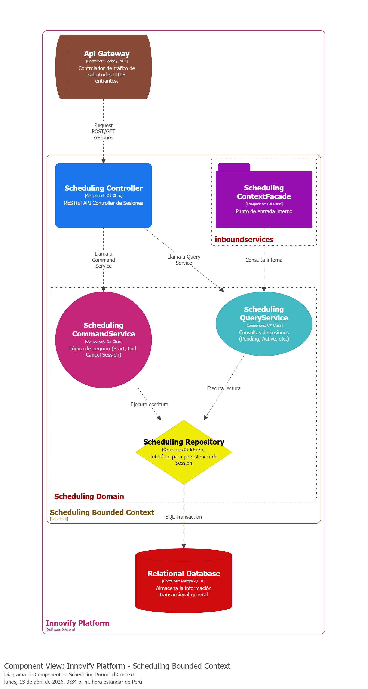
  <br>
  <em>Figura 75. C4 Model: Component Diagram - Elaboración propia. Nota: Diagrama de componentes que detalla la estructura interna y las responsabilidades (Controladores, Servicios, Repositorios) de uno de los contenedores principales de la plataforma.</em>
</p>

## 4.7. Software Object-Oriented Design

### 4.7.1. Class Diagrams

La arquitectura del sistema se ha modelado bajo el enfoque de Domain-Driven Design (DDD) para garantizar una alta cohesión y un bajo acoplamiento. Con el objetivo de facilitar el análisis del dominio y asegurar la legibilidad técnica, la representación visual del backend se ha segmentado. A continuación, se presentan los diagramas de clases correspondientes a los 8 Bounded Contexts identificados, detallando sus respectivos Agregados, Entidades y Objetos de Valor (Value Objects).

Acá se presenta el diagrama de clases con sus respectivos Bounded Context:

<p align="center">
  
  <br>
  
  <br>
  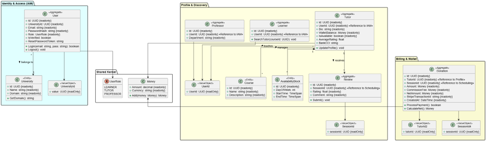
  <br>
  <em>Diagrama de Clases: Innovify - Elaboración propia.</em>
</p>


#### Identity & Access Context

<p align="center">
  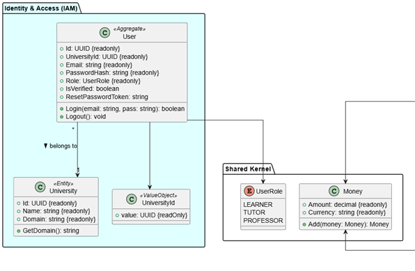
  <br>
  <em>Figura 76. Diagrama de Clases: Identity & Access Context - Elaboración propia.</em>
</p>

#### Profile & Discovery Context

<p align="center">
  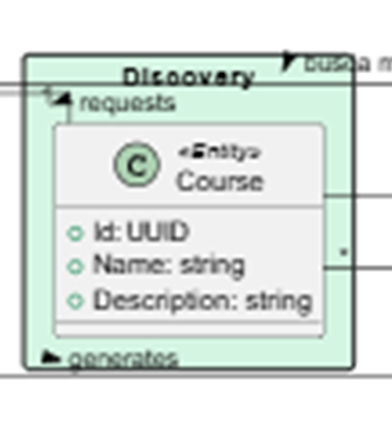
  <br>
  <em>Figura 77. Diagrama de Clases: Profile & Discovery Context - Elaboración propia.</em>
</p>

#### Scheduling Context

<p align="center">
  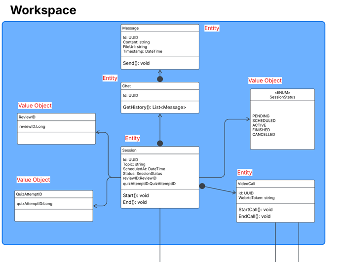
  <br>
  <em>Figura 78. Diagrama de Clases: Scheduling Context - Elaboración propia.</em>
</p>

#### Collaboration Context

<p align="center">
  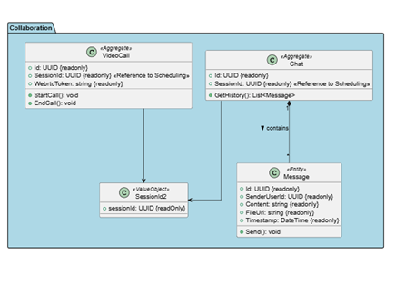
  <br>
  <em>Figura 79. Diagrama de Clases: Collaboration Context - Elaboración propia.</em>
</p>

#### Assessment Context

<p align="center">
  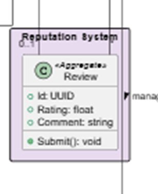
  <br>
  <em>Figura 80. Diagrama de Clases: Assessment Context - Elaboración propia.</em>
</p>

#### Billing & Wallet Context

<p align="center">
  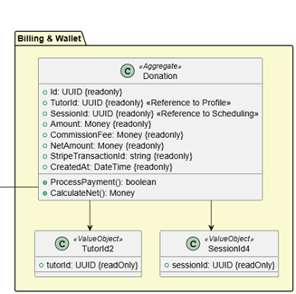
  <br>
  <em>Figura 81. Diagrama de Clases: Billing & Wallet Context - Elaboración propia.</em>
</p>

#### Moderation Context

<p align="center">
  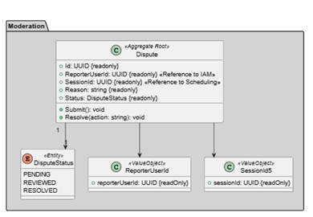
  <br>
  <em>Figura 82. Diagrama de Clases: Moderation Context - Elaboración propia.</em>
</p>

#### Analytics Context

<p align="center">
  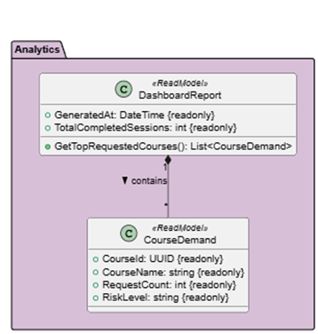
  <br>
  <em>Figura 83. Diagrama de Clases: Analytics Context - Elaboración propia.</em>
</p>
---

## 4.8. Database Design

Para garantizar la persistencia, integridad y escalabilidad de la información en Innovify, el equipo ha optado por un sistema de gestión de bases de datos relacional (RDBMS), gestionado a través del ORM (Object-Relational Mapping) Entity Framework Core.

El diseño físico de la base de datos se ha estructurado aplicando los principios de Domain-Driven Design (DDD). Para evitar un modelo de datos monolítico y altamente acoplado, la arquitectura de la base de datos se ha dividido en cuatro Bounded Contexts (Contextos Delimitados). Cada contexto agrupa las tablas, columnas, restricciones (Primary Keys y Foreign Keys) y relaciones estrictamente necesarias para resolver un dominio específico del negocio, promoviendo la alta cohesión y el bajo acoplamiento.

Los cuatro contextos que rigen el ecosistema de Innovify son: Identity & Profile Context, Tutoring & Operations Context, Academic & Assessment Context y Monetization Context.

### 4.8.1. Database Diagrams

<p align="center">
  
  <br>
  <em>Figura 80. Diagrama de Base de Datos Relacional por Bounded Contexts - Elaboración propia. Nota: Este diagrama Entidad-Relación ilustra la estructura física de los datos agrupada por dominios, asegurando la integridad referencial y un bajo acoplamiento.</em>
</p>
# Capítulo V: Product Implementation

## 5.1. Software Configuration Management

### 5.1.1. Software Development Environment Configuration

Durante el desarrollo del proyecto se utilizó las siguientes herramientas de software:

| Software | Actividad | Tipo | Descripción | Link |
| :--- | :--- | :---: | :--- | :--- |
| **Canva** | Documentación y Presentaciones | SaaS | Elaboración colaborativa de presentaciones y documentación de los artefactos del proyecto. | [canva.com](https://www.canva.com/) |
| **Figma** | UX/UI Design | SaaS | Diseño de la interfaz de usuario (wireframes, mockups y prototipos) para la Landing Page en versión web y móvil. | [figma.com](https://figma.com) |
| **GitHub** | Control de versiones | SaaS | Repositorio del código fuente del Landing Page y servicios backend. | [github.com](https://github.com) |
| **Miro** | Requirements Management | SaaS | Elaboración colaborativa de User Story Mapping, escenarios As-Is/To-Be, diagramas C4 Model y flujos de usuario. | [miro.com](https://miro.com/) |
| **Microsoft PowerPoint** | Documentación y Presentaciones | Local | Elaboración colaborativa de presentaciones y documentación de los artefactos del proyecto. | [microsoft.com](https://www.microsoft.com/en/microsoft-365/powerpoint) |
| **Trello** | Project Management | SaaS | Gestión ágil del proyecto, administración del Product Backlog, planificación de Sprints y asignación de tareas al equipo. | [trello.com](https://trello.com/) |
| **Visual Studio Code** | Desarrollo Web | Local | Desarrollo y edición del código (HTML y CSS) para la Landing Page y los Acceptance Tests. | [code.visualstudio.com](https://code.visualstudio.com/download) |
| **Microsoft Word Online** | Software Documentation | SaaS | Redacción colaborativa del informe final del proyecto, especificación de requisitos y documentación técnica. | [office.com](https://www.office.com/) |

---

### 5.1.2. Source Code Management

Para administrar el código fuente del proyecto, el equipo empleará Git como sistema distribuido de control de versiones y GitHub como el entorno principal de colaboración. Esto permitirá conservar un registro detallado de todas las modificaciones, optimizar el trabajo en conjunto entre los miembros y garantizar la trazabilidad de cada versión del software.

#### Repositorios GitHub

* **Landing Page:** Repositorio público para la página de presentación del producto. 
  * Enlace: [https://github.com/Aplicaciones-Web-SkillSwap/Landing-Page-SkillSwap.git](#)
* **Frontend Web Application:** Repositorio para la aplicación web transaccional (Desarrollada en JavaScript/Vite) donde interactúan los estudiantes y profesores.
  * Enlace: *[Añadir enlace]*
* **Web Services (Backend API):** Repositorio para la API RESTful (Desarrollada en C#/.NET). Incluye el proyecto principal y los directorios correspondientes a las pruebas unitarias y de integración/aceptación.
  * Enlace: *[Añadir enlace]*
* **Acceptance Test:** Repositorio en el que se encuentran los archivos (`.feature`) en formato Gherkin.
  * Enlace: [https://github.com/Aplicaciones-Web-SkillSwap/Acceptance-Tests.git](#)

#### Implementación GitFlow

**Ramas principales:**
* `main`: La rama principal, contiene la versión estable del proyecto. Cada commit indicará una nueva versión de la landing page.
* `develop`: Rama dedicada a integrar nuevas funcionalidades antes de su lanzamiento oficial hacia la rama principal.

**Ramas adicionales:**
* `feature/...`: Estas ramas estarán dedicadas a los cambios de cada función de nuestro proyecto. Serán unidas en develop para finalmente ser testeadas.
* `release/...`: Ramas dedicadas a cambios menores y últimas revisiones antes de subir una versión al main.
* `hotfix/...`: Dedicadas a arreglar errores graves de la versión final en main (por ejemplo: bugs) que necesitan solución inmediata. Esta se unirá nuevamente en develop para darle una última revisión y finalmente subirla al main como una nueva versión.

#### Semantic Versioning

Para nuestro proyecto usaremos Semantic Versioning 2.0.0 para etiquetar nuestras versiones, lo cual tiene el siguiente formato: `MAJOR.MINOR.PATCH` (`X.X.X`). 
* Usaremos **MAJOR** para cambios grandes que rompan compatibilidad con otras versiones y su cambio en la versión afectará al número principal (primera cifra).
* **MINOR** para la agregación de nuevas funcionalidades compatibles con la versión existente y modificará el segundo dígito.
* **PATCH** para correcciones pequeñas como simples bugs, ajustes visuales o errores tipográficos.

*Ejemplo: V1.0.0 -> V2.0.0 (cambios MAJOR), V1.0.0 -> V1.1.0 (cambios MINOR), V1.0.0 -> V1.0.1 (cambios PATCH).*

#### Conventional Commits

A partir del lanzamiento de nuestra primera versión (1.0.0) nuestros commits seguirán el formato Conventional Commits, con la designación: `tipo(lugar del cambio): explicación breve`.

Los tipos de commits serán: 
* `feat(funcionalidad)` para agregar nuevas funcionalidades.
* `fix(lugar de arreglo)` para arreglar errores.
* `docs(cambio)` para editar la documentación.
* `style(funciones o lugar)` para cambios en el estilo sin afectar la lógica principal.
* `refactor(lugar)` para cambios en la estructura del código sin afectar la funcionalidad.
* `test(objeto)` para testear cambios.
* `chore(lugar)` para tareas menores de mantenimiento.

#### Flujo de trabajo:
1. Cada integrante clona la rama `develop` al crear una rama `feature/` para trabajar en una nueva tarea.
2. Cuando termina, realiza un *merge* hacia `develop` a través de un *pull request*.
3. Luego se crea una rama `release/` para realizar una verificación final antes de publicar la versión oficial.
4. Una vez aprobada la versión, se publica en la rama `main` con su nuevo número de versión y es eliminada la rama `release/` creada.
5. En caso de detectar pequeños errores en la versión oficial dentro de la rama `main`, se crea una rama `hotfix/` para ser resueltos de manera inmediata.

---

### 5.1.3. Source Code Style Guide & Conventions

En esta sección se describen las guías de estilo y las reglas de organización aplicadas durante la construcción del sitio web, contemplando los lenguajes HTML, CSS y Gherkin. Estas convenciones se establecieron para garantizar un código claro, estructurado y sencillo de mantener por todo el equipo.

#### HTML
El equipo seguirá las recomendaciones de *HTML Style Guide and Coding Conventions*, el cual indica que, por ejemplo, los nombres de los elementos deben estar en minúsculas, la indentación debe ser de 2 espacios, usar comentarios, etc.

Para la realización del código hemos utilizado diversos elementos semánticos como `<nav>` para el menú, `<ul>` y `<li>` para listas, `<button>` para llamadas a la acción, `<section>` para dividir el contenido, `` para imágenes y `<footer>` para el pie de página. También se utilizaron atributos clave como `class`, `src` y `alt`.

```html
<nav class="barra-navegacion">
  <div class="menu-horizontal">
    <ul class="menu-horizontal-opciones">
      <li><a href="sites/alianzas.html" data-i18n="nav-alianzas">Alianzas</a></li>
      <li><a href="sites/proyects.html" data-i18n="nav-proyectos">Proyectos</a></li>
      <li><a href="sites/aboutUS.html" data-i18n="nav-sobre-nosotros">Sobre nosotros</a></li>
      <button class="lang-btn active" data-lang="es" onclick="applyLanguage('es')" aria-label="Español">ES</button>
      <span class="lang-divider">|</span>
      <button class="lang-btn" data-lang="en" onclick="applyLanguage('en')" aria-label="English">EN</button>
    </ul>
  </div>
</nav>

<section class="seccion-llamado-accion">
  <div class="hero-badge" data-i18n="hero-badge">Red Interuniversitaria del Perú</div>
  <h1 class="llamado-accion-texto" data-i18n="hero-title">
    
  </h1>
  <a href="sites/login.html">Regístrate</a>
</section>
```

#### CSS

Respecto a la hoja de estilos en cascada (CSS), se aplicaron distintas reglas para estructurar la apariencia del sitio. Las propiedades fueron organizadas en un orden coherente (posicionamiento, modelo de caja, tipografía, color y efectos) con el fin de mantener claridad y uniformidad en el código. Asimismo, se utilizaron nombres de clases claros y descriptivos, alineados a variables CSS globales.

```css
.barra-navegacion {
  display: flex;
  background-color: var(--surface-color);
  justify-content: space-between;
  align-items: center;
  padding: 0 28px;
  height: var(--nav-bar-height);
  width: 100%;
  position: fixed;
  top: 0;
  left: 0;
  z-index: 1000;
  border-bottom: 1px solid var(--border-color);
  box-shadow: var(--shadow-sm);
}

.logo {
  display: flex;
  align-items: center;
  flex-shrink: 0;
}

.formulario-registro, .formulario-inicio-sesion {
  margin: 20px 0px;
  display: flex;
  flex-direction: column;
  align-items: center;
  width: 100%;
  max-width: 1200px; 
}
```
### 5.1.4. Software Deployment Configuration

En esta sección explicaremos cómo realizamos el despliegue (deploy) de nuestra landing page directamente desde nuestro repositorio utilizando **GitHub Pages**.

**Deploy con GitHub Pages:**

1. Primero accederemos al repositorio de la Landing Page ("SkillSwap-LandingPage") y nos dirigiremos al menú de ajustes (**Settings**) ubicado en el menú horizontal de la parte superior de la pantalla.
2. Luego, dentro de los ajustes, ubicamos la opción **Pages** en el menú vertical de la parte izquierda de la pantalla.
3. Dentro buscaremos la sección **Branch** y en el menú desplegable que por defecto tiene la opción "None", elegiremos la rama `main`. Dejaremos por defecto la carpeta `/(root)` y finalmente haremos clic en el botón **Save**.
4. Luego de unos pocos minutos (a veces segundos), al refrescar la página, GitHub automáticamente creará y mostrará el dominio en vivo de la página web.

> **Nota:** Es importante recalcar que para que este método funcione, el archivo `.html` principal (generalmente `index.html`) debe encontrarse en la raíz del repositorio, ya que elegimos la configuración de la carpeta `/(root)`.

<p align="center">
  
  <br>
  
  <br>
  
  <br>
  
  <br>
  
  <br>
  <em>Figura 84. Configuración de despliegue en GitHub Pages - Elaboración propia.</em>
</p>

---

**Gestión de Ramas y Commits (GitFlow en la práctica)**

A continuación, se evidencia el trabajo colaborativo del equipo y la correcta aplicación del flujo de trabajo GitFlow dentro de nuestro repositorio:

<p align="center">
  
  <br>
  <em>Figura 85. Ramas (Branches) del repositorio - Elaboración propia. Nota: En esta imagen podemos ver las branches que cada uno de los integrantes creó y que se irán creando a medida que continúe el proyecto.</em>
</p>

<p align="center">
  
  <br>
  
  <br>
  
  <br>
  <em>Figura 86. Historial de Commits - Elaboración propia. Nota: Estos son algunos de los commits realizados por los integrantes en sus respectivas ramas, siguiendo la convención de Conventional Commits.</em>
</p>

<p align="center">
  
  <br>
  
  <br>
  <em>Figura 87. Network Graph de GitFlow - Elaboración propia. Nota: Gráfica de nuestros commits y la red (network) en la que seguimos el flujo de GitFlow. Se evidencia la creación de ramas (features), su paso a la rama `develop` (cuando se unen), y finalmente a la rama `main` (la línea principal) que contiene el código de producción.</em>
</p>
